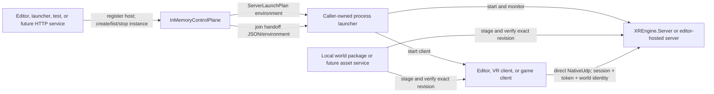

# Control Plane Runtime Architecture

XRENGINE separates multiplayer orchestration from realtime networking. The
control plane decides which server instance a player should use and creates the
launch and join contracts. The data plane is the running editor-hosted or
dedicated server that accepts the resulting direct UDP connection and
replicates the world.

The current reference implementation is `XREngine.ControlPlane`, an
in-process, memory-only library intended for local development, tests, editor
tooling, launchers, and future service wrappers. It is not an HTTP service, an
operating-system process supervisor, a public matchmaker, or a network load
balancer.

> Important: `CreateInstance` records an instance but does not start a server
> process. `JoinInstance` records admission and returns a handoff but does not
> connect a client. `StopInstance` changes control-plane state but does not
> terminate a process. The caller owns those side effects.

## Control Plane And Data Plane

| Plane | Responsibilities | Current implementation |
|---|---|---|
| Control plane | Host registration, capacity and placement, instance records, session credentials, world identity, join handoffs, and launch environment generation | `InMemoryControlPlane` in `XREngine.ControlPlane` |
| Process launcher | Starts and monitors server/client processes, assigns ports, waits for readiness, and terminates processes | The caller: editor UI, test harness, launcher, or future service |
| Data plane | Direct UDP connection, join validation, player assignment, replication, and gameplay traffic | `XREngine.Server` or an editor-hosted `ServerNetworkingManager` |
| Asset delivery | Makes the exact world revision available before connection | Caller-managed storage plus `WorldPackageManifestBuilder` for local verification/mirroring |

The former in-process HTTP load-balancer types were removed from
`XREngine.Server`. A realtime worker should not discover hosts, allocate
itself, expose a public room directory, or choose another worker. It receives
one concrete session, endpoint, token, and world identity from the control
plane.

## Runtime Topology



The control plane is not on the per-frame or packet path. After handoff, the
client talks directly to the selected realtime endpoint.

## Public Contracts

| Contract | Purpose |
|---|---|
| `ControlPlaneHostRegistration` | Advertises a host ID, default endpoint, maximum instance count, and total player-slot capacity. |
| `CreateMultiplayerInstanceRequest` | Selects or names a host, endpoint, world identity/package, session credentials, and instance player limit. |
| `MultiplayerInstanceInfo` | Describes the selected host, endpoint, session, exact world, state, and occupancy. |
| `ServerLaunchPlan` | Carries the instance plus environment variables required by a dedicated server process. |
| `JoinMultiplayerInstanceRequest` | Requests admission for one client and optionally verifies its local world/build before issuing a handoff. |
| `JoinMultiplayerInstanceResult` | Carries the player record, handoff object/JSON, and client launch environment. |
| `RealtimeJoinHandoffPayload` | The data-plane contract: session ID/token, concrete endpoint, protocol version, and exact world identity. |
| `WorldPackageManifest` | Describes a local package whose files can be verified or mirrored before startup. |

Session tokens are credentials. `CreateInstance` and
`GetInstance(includeToken: true)` can return them, but `ListInstances` and
the default `GetInstance` result deliberately omit them. Do not put tokens in
public directory responses or logs.

## Instance Lifecycle

The implemented local lifecycle is:

1. Optionally register one or more hosts with `RegisterHost`.
2. Allocate an instance with `CreateInstance`.
3. Stage and verify the instance's world on the server host.
4. Call `CreateServerLaunchPlan`, then launch the server with its environment.
5. Wait for launcher-defined server readiness.
6. Show eligible instances with `ListInstances`.
7. Call `JoinInstance` for a selected client.
8. Start or reconfigure the client with the returned handoff/environment.
9. The client connects directly to the server's UDP endpoint.
10. Record a departure with `LeaveInstance`, then disconnect that client.
11. Stop and dispose the server process, then call `StopInstance`.

`CreateInstance` currently creates the record directly in `Running` state.
`StopInstance` moves it to `Stopped` and clears its player records.
`Pending` and `Draining` exist in the state enum for future orchestration but
are not driven by `InMemoryControlPlane`.

The in-memory object must outlive every instance it owns. Restarting its host
process loses all registrations, instances, players, and tokens.

## Prerequisites For A Local Run

- Windows 10/11 and the .NET 10 SDK.
- A built server and whichever client executable will connect:

  ```powershell
  dotnet build .\XREngine.Server\XREngine.Server.csproj
  dotnet build .\XREngine.Editor\XREngine.Editor.csproj
  ```

- The same world revision available to the server and every client. A handoff
  describes the world; it does not download it.
- One free UDP bind port per server process.
- One free client receive port per client process on the same machine.
- A reachable advertised endpoint. `127.0.0.1` works only when server and
  client are on the same machine.
- Firewall/NAT rules that allow the advertised UDP endpoint for cross-machine
  tests. The reference control plane does not provide relay or NAT traversal.

## Fastest Workflow: Editor To Editor

The ImGui editor embeds one `InMemoryControlPlane` for local smoke tests.

1. Start two editor processes and load the same world in both.
2. In the host editor, open **View > Networking**.
3. Set **Server IP** to `127.0.0.1` for same-machine testing, or to an address
   the other machine can reach.
4. Set **Server Bind Port** and **Server Send Port**. For a simple local run,
   use the same free port for both.
5. Under **Control Plane**, set the host ID, instance name, and maximum players.
6. Select **Create / Start Editor Server Instance**. This is the one workflow
   where the UI performs both the control-plane operation and the data-plane
   server start.
7. Select **Issue Client Handoff**, then **Copy Handoff**.
8. In the client editor, open **View > Networking**, choose a unique
   **Client Receive Port**, paste the JSON into **Handoff JSON**, and select
   **Join From Handoff**.
9. Confirm the client status names the host endpoint and the host's connection
   table lists the client.
10. Use **Disconnect** in each process when finished. On the host this also
    stops its in-memory instance record.

The same handoff may be copied to additional clients until the instance is
full. Each client on one machine still needs a distinct receive port. The host
editor records admission when the realtime join reaches its installed
`ServerJoinAdmissionResolver`.

## Programmatic Dedicated-Server Workflow

Reference `XREngine.ControlPlane` from a launcher, editor tool, test, or
service wrapper. The following orchestration skeleton creates an instance,
starts a dedicated server, issues one client handoff, and starts an editor
client. Build both projects first so `--no-build` does not make concurrent
launches contend over build outputs.

```csharp
using System.Diagnostics;
using XREngine;
using XREngine.ControlPlane;
using XREngine.Networking;

// Run this launcher from the repository root.
string repoRoot = Directory.GetCurrentDirectory();

var controlPlane = new InMemoryControlPlane();
ControlPlaneHostSnapshot host = controlPlane.RegisterHost(
    new ControlPlaneHostRegistration
    {
        HostId = "dev-host-a",
        DisplayName = Environment.MachineName,
        Endpoint = new RealtimeEndpointDescriptor
        {
            Host = "127.0.0.1",
            Port = 5010,
            ProtocolVersion = "dev",
        },
        MaxInstances = 4,
        MaxPlayers = 16,
    });

var world = new WorldAssetIdentity
{
    WorldId = "collaboration-world",
    RevisionId = "rev-1",
    ContentHash =
        "sha256:aaaaaaaaaaaaaaaaaaaaaaaaaaaaaaaaaaaaaaaaaaaaaaaaaaaaaaaaaaaaaaaa",
    AssetSchemaVersion = 1,
    RequiredBuildVersion = "dev",
};

ControlPlaneResult<MultiplayerInstanceInfo> create =
    controlPlane.CreateInstance(new CreateMultiplayerInstanceRequest
    {
        DisplayName = "Collaboration Room",
        HostId = host.HostId,
        // Assign a unique endpoint for every server process on this host.
        Endpoint = new RealtimeEndpointDescriptor
        {
            Host = "127.0.0.1",
            Port = 5010,
            ProtocolVersion = "dev",
        },
        WorldAsset = world,
        MaxPlayers = 4,
    });

if (!create.Success || create.Value is null)
    throw new InvalidOperationException(
        create.Message ?? "Control-plane instance creation failed.");

MultiplayerInstanceInfo instance = create.Value;
ServerLaunchPlan serverPlan =
    controlPlane.CreateServerLaunchPlan(instance.InstanceId);

Process server = StartDotnetProject(
    repoRoot,
    @".\XREngine.Server\XREngine.Server.csproj",
    serverPlan.Environment);

Console.WriteLine(
    $"Server {instance.InstanceId} is starting on " +
    $"{instance.Endpoint.Host}:{instance.Endpoint.Port}.");
Console.WriteLine("Wait for the server to be ready, then press Enter.");
Console.ReadLine();

ControlPlaneResult<JoinMultiplayerInstanceResult> join =
    controlPlane.JoinInstance(new JoinMultiplayerInstanceRequest
    {
        InstanceId = instance.InstanceId,
        ClientId = "editor-client-1",
        DisplayName = "Editor Client 1",
        LocalWorldAsset = world,
        BuildVersion = "dev",
        ClientReceivePort = 6010,
    });

if (!join.Success || join.Value is null)
    throw new InvalidOperationException(
        join.Message ?? "Control-plane join failed.");

join.Value.ClientEnvironment[XREngineEnvironmentVariables.WindowTitle] =
    "XRE Editor - Collaboration Client";

Process client = StartDotnetProject(
    repoRoot,
    @".\XREngine.Editor\XREngine.Editor.csproj",
    join.Value.ClientEnvironment);

static Process StartDotnetProject(
    string repoRoot,
    string project,
    IReadOnlyDictionary<string, string> environment)
{
    var start = new ProcessStartInfo("dotnet")
    {
        UseShellExecute = false,
        WorkingDirectory = repoRoot,
    };
    start.ArgumentList.Add("run");
    start.ArgumentList.Add("--no-build");
    start.ArgumentList.Add("--project");
    start.ArgumentList.Add(project);

    foreach ((string name, string value) in environment)
        start.Environment[name] = value;

    return Process.Start(start)
        ?? throw new InvalidOperationException($"Failed to start {project}.");
}
```

The interactive readiness pause is intentionally simple. A real launcher must
replace it with a bounded health/readiness check, capture process exit, and call
`StopInstance` if launch fails.

Keep the returned `Process` next to its instance ID. To shut down, stop the
process through the launcher's normal graceful path, wait for exit, and then
call `StopInstance(instanceId)`. The control plane does not know the process
ID.

## Starting More Instances

For each additional dedicated server:

1. Allocate a different UDP port.
2. Call `CreateInstance` again, passing the same `HostId` and a
   per-instance `Endpoint` with that port.
3. Check `ControlPlaneResult.Success`; placement may fail with
   `NoHostCapacity`.
4. Create a new `ServerLaunchPlan`.
5. Start and monitor a separate server process with that plan.
6. Store the `instanceId -> Process` association in the caller.

A registered host has one default endpoint, but it does not allocate a port
range. If multiple instances inherit the same default endpoint, their server
processes will contend for the same UDP port. Always supply a unique endpoint
per instance or register one single-instance host record per endpoint.

Capacity requires both:

- active instance count below `MaxInstances`; and
- the sum of active instances' configured `MaxPlayers` reservations, plus the
  new reservation, at or below the host's `MaxPlayers`.

Capacity is reserved from configured instance sizes, not current player count.

## Finding And Joining An Existing Instance

`ListInstances()` returns non-stopped instances without session tokens.
Choose an instance using its public fields, then ask the same authoritative
control-plane object or service to issue a join:

```csharp
MultiplayerInstanceInfo selected = controlPlane.ListInstances()
    .First(instance =>
        instance.State == MultiplayerInstanceState.Running
        && instance.CurrentPlayers < instance.MaxPlayers);

ControlPlaneResult<JoinMultiplayerInstanceResult> join =
    controlPlane.JoinInstance(new JoinMultiplayerInstanceRequest
    {
        InstanceId = selected.InstanceId,
        ClientId = clientId,
        LocalWorldAsset = localWorldAsset,
        BuildVersion = currentBuildVersion,
        ClientReceivePort = localReceivePort,
    });
```

Do not construct a handoff from a list result: its token is intentionally
blank. Only a successful `JoinInstance` result or another privileged
token-issuing path should reach the client.

In the reference dedicated-server flow, the caller must gate handoff issuance
through `JoinInstance` so control-plane capacity is enforced. The dedicated
server validates the session token and world identity, but it does not call
back into the launcher's in-memory control plane.

## Launch Environment Contract

`CreateServerLaunchPlan` generates:

| Variable | Meaning |
|---|---|
| `XRE_SESSION_ID` | Session accepted by this server process. |
| `XRE_SESSION_TOKEN` | Opaque local-dev admission credential. |
| `XRE_WORLD_ID`, `XRE_WORLD_REVISION`, `XRE_WORLD_CONTENT_HASH` | Exact world identity. |
| `XRE_WORLD_ASSET_SCHEMA_VERSION`, `XRE_WORLD_REQUIRED_BUILD_VERSION` | World schema and compatible build. |
| `XRE_UDP_BIND_PORT` | Local UDP port the server binds. |
| `XRE_UDP_ADVERTISED_PORT` | Port placed in the realtime endpoint. |

`JoinInstance` generates a client environment containing:

| Variable | Meaning |
|---|---|
| `XRE_NET_MODE=Client` | Selects client networking. |
| `XRE_REALTIME_JOIN_PAYLOAD` | JSON handoff with endpoint, session credentials, protocol, and world. |
| `XRE_WORLD_*` | Matching local world-identity overrides. |
| `XRE_UDP_CLIENT_RECEIVE_PORT` | Optional local receive port from the join request. |

The client also accepts `XRE_REALTIME_JOIN_PAYLOAD_FILE`. When set, the file
takes precedence over the inline payload. The generated environment uses the
inline form; `Tools/Start-NetworkTest.bat` demonstrates the lower-level file
contract without maintaining control-plane state.

## World Package Staging

When a local world is represented by files, build and verify a manifest before
launching either side:

```csharp
var packageIdentity = new WorldAssetIdentity
{
    WorldId = "collaboration-world",
    RevisionId = "rev-1",
    // Leaving this empty makes the builder use the package manifest hash.
    ContentHash = string.Empty,
    AssetSchemaVersion = 1,
    RequiredBuildVersion = "dev",
};

WorldPackageManifest manifest =
    WorldPackageManifestBuilder.CreateFromDirectory(
        serverWorldRoot,
        packageIdentity);

WorldPackageVerificationResult verification =
    WorldPackageManifestBuilder.Verify(manifest);
if (!verification.Success)
    throw new InvalidOperationException("World package verification failed.");

WorldPackageManifestBuilder.Mirror(manifest, clientCacheRoot);
WorldPackageVerificationResult mirroredVerification =
    WorldPackageManifestBuilder.Verify(manifest, clientCacheRoot);
if (!mirroredVerification.Success)
    throw new InvalidOperationException("Mirrored world verification failed.");
```

Pass the manifest as `CreateMultiplayerInstanceRequest.WorldPackage` when the
instance should retain package metadata, and use `manifest.Asset` as that
instance's `WorldAsset`. These helpers verify and mirror local files only. They
do not upload, download, stream, cache-evict, or sign packages.

## Failure Handling

| Failure | Meaning and action |
|---|---|
| `HostNotFound` | The requested host ID is not registered in this control-plane object. |
| `NoHostCapacity` | Instance-count or reserved player-slot capacity is exhausted. Select another host or reduce the requested size. |
| `InstanceNotFound` / `InstanceNotRunning` | Refresh the directory and do not start the client. |
| `InstanceFull` | Do not issue a handoff; select another instance. |
| `WorldAssetMismatch` | Stage the exact revision/hash before retrying. Never silently ignore the mismatch. |
| `BuildVersionMismatch` | Run a compatible client build or choose a compatible instance. |
| UDP bind failure | The caller reused a port or the OS denied it. Stop the failed process, stop its instance record, and allocate another port. |
| Client never connects | Verify endpoint reachability, firewall rules, unique receive port, inherited environment, session token, and world identity. |

## Production Service Boundary

A production control-plane application can wrap these contracts, but it must
add the behavior the local library intentionally lacks:

- authenticated HTTPS APIs and authorization;
- durable host, instance, player, and lease storage;
- health checks, readiness, heartbeats, and crash reconciliation;
- process/container scheduling and graceful draining;
- atomic port or endpoint allocation;
- cryptographically signed, expiring, scoped join credentials;
- secret storage and redaction;
- world storage, signed download URLs, verification, and cache policy;
- regional placement, matchmaking, abuse controls, and rate limits;
- NAT traversal or relays where direct UDP is not viable; and
- metrics, audit logs, retries, idempotency, and operational alerts.

Keep the engine boundary unchanged: the service may evolve, but a realtime
worker should still receive only the concrete session, endpoint, token,
protocol, and world identity it needs.

## Source And Validation

- Implementation: `XREngine.ControlPlane/InMemoryControlPlane.cs`
- Public models: `XREngine.ControlPlane/Models/`
- Dedicated server startup: `XREngine.Server/Program.cs`
- Client handoff parsing: `XREngine/Engine/Networking/RealtimeJoinHandoff.cs`
- Editor workflow: `XREngine.Editor/IMGUI/EditorImGuiUI.NetworkingPanel.cs`
- Tests: `XREngine.UnitTests/Core/ControlPlaneTests.cs`
- Code-facing guide:
  [Control Plane developer guide](../../developer-guides/networking/control-plane.md)
- Realtime networking overview:
  [Networking architecture](../networking/overview.md)
