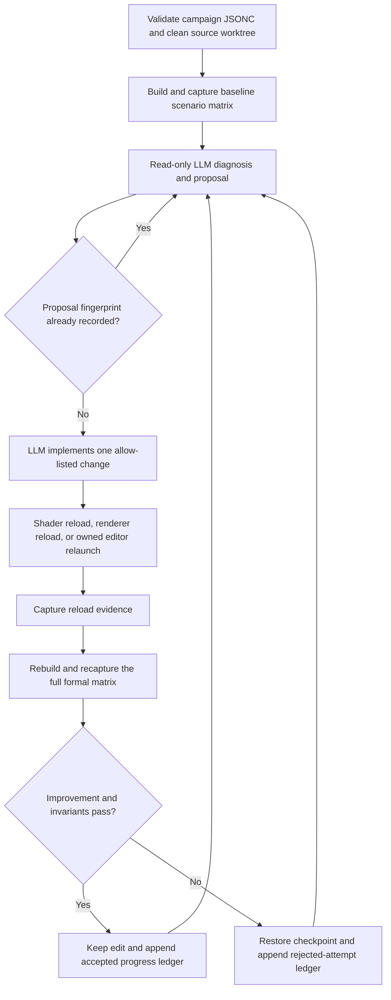

# Self-Iterating Rendering Performance Loop

The self-iteration harness in `XREngine.Benchmarks/SelfIteration/` runs a
bounded, evidence-first LLM loop over a configured rendering scenario matrix.
It launches or relaunches isolated editor processes, captures steady-state CPU
and GPU evidence, asks an external agent for one source change, validates the
change through renderer reload or editor restart, repeats the formal
measurement, and accepts only statistically useful candidates that preserve
the requested workload.

The loop is deliberately conservative. It leaves accepted edits in the
working tree for human review, restores rejected edits, never commits or stages
changes, and does not change dependencies or submodules.

## Pipeline



The read-only proposal phase is fingerprinted before write access is used.
Fingerprints include the campaign, target scenario, issue key, and attempt key.
Both accepted and rejected ledgers are scanned at startup, so a previously
recorded approach is not implemented again for the same issue.

## Quick Start

Generate the local Unit Testing World JSONC if it does not exist:

```powershell
powershell -ExecutionPolicy Bypass -File Tools\Generate-UnitTestingWorldSettings.ps1
```

Copy and edit the schema-backed example:

```text
XREngine.Benchmarks/SelfIteration/Examples/render-pipeline-self-iteration.jsonc
```

The example uses a standalone `codex` command, but the controller is
provider-neutral. `agent.executable` can name any non-interactive LLM command
that follows the two-phase JSON protocol described below. The Codex desktop
application executable is not a substitute for a separately invocable CLI on
machines where the packaged executable cannot launch itself.

Validate configuration without building, launching an editor, writing docs, or
invoking the LLM:

```powershell
powershell -ExecutionPolicy Bypass -File `
  Tools\Benchmarks\Invoke-SelfIteration.ps1 -ValidateOnly
```

Capture and validate the formal baseline without invoking the LLM:

```powershell
powershell -ExecutionPolicy Bypass -File `
  Tools\Benchmarks\Invoke-SelfIteration.ps1 -BaselineOnly
```

Run the bounded loop:

```powershell
powershell -ExecutionPolicy Bypass -File `
  Tools\Benchmarks\Invoke-SelfIteration.ps1
```

Pass `-Config <path>` to select a different campaign. The equivalent VS Code
tasks are `Benchmark-SelfIteration-Validate`,
`Benchmark-SelfIteration-Baseline`, and `Benchmark-SelfIteration-Run`.

## Scenario Matrix

Each `scenarios` entry selects an independently measured workload:

| Field | Purpose |
| --- | --- |
| `name` | Stable scenario identity used in evidence and comparisons. |
| `renderBackend` | Required active backend: `Vulkan` or `OpenGL`. |
| `meshSubmissionStrategy` | `CpuDirect`, an instrumented GPU path, or a zero-readback GPU path. |
| `unitTestingWorldSettingsPath` | JSONC used to build the Unit Testing World for this workload. |
| `overrides` | Scenario-specific VR, culling, Vulkan, scene, camera, viewport, clock-policy, and diagnostic controls. |
| `environment` | Additional scalar environment settings for the editor process. |

Shared defaults live under `measurement`; a scenario's `overrides` win for
that scenario. This permits matrices such as:

- Vulkan plus `GpuIndirectZeroReadback`;
- Vulkan plus `CpuDirect`;
- OpenGL plus `CpuDirect`;
- Vulkan dynamic rendering with command chains enabled;
- Vulkan/OpenXR and desktop workloads using different Unit Testing World
  JSONC files.

Use separate scenario names when a feature changes the measured workload.
The candidate is accepted only after every configured scenario is captured and
passes its invariants.

By default, each scenario has two capture cohorts:

- a short `DevelopmentProfile` diagnostic cohort with dense GPU timestamps,
  used for LLM diagnosis and per-pipeline attribution;
- a repeated `CleanProfile` formal cohort, used for acceptance metrics and
  noise/regression gates.

This separation prevents detailed instrumentation overhead from becoming part
of the acceptance result. Set `runDetailedDiagnosticCapture` to `false` only
when the formal profile mode itself produces all CPU/GPU evidence required by
the campaign.

`CleanProfile` and `ReleaseBenchmark` reject validation layers, dense GPU
timestamps, and command-buffer labels because those diagnostics perturb formal
measurement. `Diagnostics` and `DevelopmentProfile` are the intended detailed
capture modes.

## Evidence Collected

For every detailed and formal repetition,
`Tools/Measure-GameLoopRenderPipeline.ps1` starts a fresh requested
editor/backend on a free read-only MCP port and waits for the configured warmup
and stability gate. It records:

- p50/p95/p99 CPU frame, render, collection, wait, allocation, draw, resource,
  and backend phase counters;
- coarse whole-frame GPU timing and the available Vulkan lifecycle phases;
- an LLM-readable CPU frame hierarchy from `dump_cpu_frame_profile`;
- an LLM-readable timing dump for every executing GPU render pipeline from
  `dump_gpu_render_pipeline_profile(all_pipelines=true)`;
- render-profiler counters, workload identity, active backend, effective mesh
  strategy, fallback/readback events, and crash/hang state;
- relevant rendering, OpenGL, Vulkan, profiler, and stall logs.

The harness retries a scenario with a fresh editor when a process crashes,
hangs, exits before capture, produces no summary, or fails an evidence
invariant. `maxLaunchAttempts` bounds this recovery.

Warmup and stability polling read only newly appended profiler records and keep
a bounded rolling window. The no-sample watchdog applies to the formal capture
window; slow cold shader compilation is instead bounded by the startup and
stability timeouts.

Copied evidence and a concise deterministic `diagnosis.md` live under:

```text
Build/_AgentValidation/<timestamp>-self-iteration-<campaign>/
```

The LLM receives paths to the clean formal summary, deterministic diagnosis,
dense CPU hierarchy, every detailed GPU pipeline dump, and the two durable
attempt ledgers. Raw machine evidence remains ignored and disposable; accepted
and rejected decisions are durable Markdown under `docs/work/`.

## Reload And Relaunch Rules

Reload validation is selected from the changed files and the active backend:

- shader-only edits use `reload_renderer_shaders`;
- OpenGL renderer-leaf C# edits may use `build_and_reload_renderer`;
- Vulkan structural C# edits use a full owned editor rebuild/relaunch;
- core or other compiled C# edits use a full editor rebuild/relaunch;
- a failed reload, delayed post-reload crash, or missing post-reload evidence
  automatically falls back once to rebuilding and relaunching the named editor
  session.

Before reload, the controller waits for a rendered frame and an active viewport
pipeline instead of treating MCP readiness as render readiness. During the
bounded validation window it enables CPU frame logging, render statistics, and
GPU pipeline timings in the isolated session, waits for GPU timing history, and
requires both diagnostic dumps when configured. Continuous profile-capture
streaming stays disabled while the external LLM is editing.

The controller stops only the named session it created. It never stops editor
processes by name. A successful live reload is not acceptance evidence:
candidate measurement always rebuilds and launches clean editor processes for
the entire scenario matrix.

## LLM Command Contract

The controller starts the configured command twice per attempt.

The proposal phase must be read-only and return:

```json
{
  "issueKey": "stable bottleneck identifier",
  "attemptKey": "stable implementation approach identifier",
  "targetScenario": "configured scenario name",
  "hypothesis": "evidence-backed root cause",
  "plannedChange": "one coherent source change",
  "expectedMetric": "metric expected to improve",
  "reloadMode": "Auto"
}
```

The implementation phase may edit only `allowedPathPrefixes` and returns:

```json
{
  "implemented": true,
  "changeSummary": "what was actually changed",
  "reloadMode": "Auto"
}
```

Prompts are written to stdin by default. Argument templates may use
`{promptPath}`, `{responsePath}`, `{workspaceRoot}`, and `{runRoot}`. If the
command writes `{responsePath}`, that file is used; otherwise stdout is parsed.

The controller independently detects all tracked changes, watched untracked
source changes, new untracked files, staged files, and proposal-phase writes.
The two ledger paths are controller-owned even if an allow-list prefix would
otherwise include them. An unauthorized write rejects the attempt and restores
the previous checkpoint. A branch or commit change stops the campaign without
trying to rewrite repository history. Run the loop only in an otherwise idle
worktree: concurrent human edits cannot be distinguished from agent edits and
would be rolled back.

## Acceptance And Attempt Ledgers

`acceptance.metrics` defines lower- or higher-is-better metrics, weights,
material-improvement thresholds, and maximum regressions. Acceptance also
requires:

- repetition-to-repetition coefficient of variation within the configured
  noise ceiling;
- stable workload identity;
- the requested backend and mesh strategy, with no silent substitution;
- CPU and per-pipeline GPU dumps when configured;
- zero readback/mapped-buffer activity for zero-readback strategies;
- zero forbidden fallback, unapproved output-policy, and rejected Vulkan
  submission events;
- at least one material improvement and the configured weighted aggregate
  improvement.

Invariant counters use the maximum across repetitions, so one violating run
cannot be hidden by an otherwise-zero median.

For zero-readback strategies, the invariant applies to the steady-state capture
window. Initialization activity is preserved in `AllGpuReadbackBytesTotal` and
`AllGpuMappedBuffersTotal` for diagnosis, but does not invalidate a capture
whose steady-state counters are zero.

Required diagnostics fail closed. In particular, Vulkan per-pipeline timings
currently require the dense detailed cohort; a clean formal cohort can remain
coarse because its paired detailed evidence supplies attribution. If a backend
cannot resolve its timestamp queries, the baseline is rejected before an LLM
may edit source. The current OpenGL readiness finding is tracked in
`docs/work/investigations/rendering/opengl-gpu-pipeline-timestamp-readiness-2026-07-28.md`.

Accepted attempts append to `progressDocument` and become the next baseline.
Rejected, invalid, crashing, or regressing attempts append to
`rejectedAttemptsDocument` after their source changes are restored. Both
records include the fingerprint, hypothesis, actual edit, reload route,
before/after metrics, decision reasons, and evidence path.

## RenderDoc Escalation

Engine timestamp dumps are the repeatable comparison surface. When they show a
GPU-bound pipeline but do not identify the offending draw, resource, or pass,
capture a representative baseline or candidate frame with RenderDoc under the
same scenario settings. Keep `.rdc` files and exported targets under the
campaign run's `renderdoc/` folder. RenderDoc capture is intentionally not part
of every formal repetition because capture layers and frame interception can
perturb the timings being compared.

See [Profiler](profiler.md) for metric semantics and
[Renderer Backend Hot Reload](../../architecture/rendering/renderer-backend-hot-reload.md)
for backend reload constraints.
