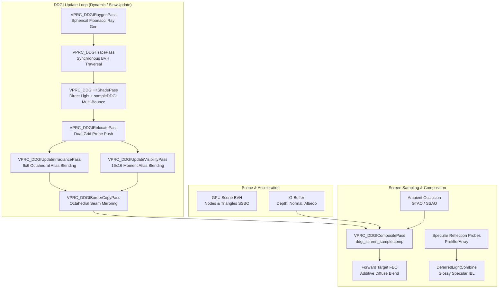

# Dynamic Diffuse Global Illumination (DDGI)

Dynamic Diffuse Global Illumination (DDGI) is an experimental probe-based diffuse lighting system based on Majercik et al. (2019). The implementation is undergoing corrective runtime validation. Track current defects and acceptance evidence in the [DDGI remediation checklist](../../work/todo/rendering/global-illumination/ddgi-implementation-todo.md).

## Overview

### Support Tier & Platform Posture

- **Status**: Experimental; implemented in `DefaultRenderPipeline`. `AdvancedRenderPipeline` does not support DDGI.
- **Primary Baseline**: Windows 10/11, .NET 10, OpenGL 4.6 (Core Profile)
- **Vulkan and stereo**: Source paths exist but require separate runtime acceptance. OpenGL validation does not establish support on these paths.

The current geometry path builds a separate world-space triangle BVH and works independently of CPU or GPU mesh draw submission. It supports constant material base color, metallic and emissive factors and directional-light shadows. Textures, alpha coverage, transmission and directional environment-map sampling are not yet represented in probe hit shading; miss radiance uses the world's authored ambient color. Pending GPU deformation or shader programs postpone the update instead of substituting geometry.

Grid, ray and cascade changes rebuild resources from an immutable descriptor. Current explicit implementation limits are 65,535 probe workgroups, 2,097,120 rays per update, 16,384 texels per atlas dimension and 512 MiB for a volume's probe/atlas/ray resources. Backend allocation must also succeed. The separate aggregate geometry service accepts up to 2,000,000 triangles. Camera scrolling clears history before tracing at new origins and warms the probes again. Per-viewport histories and cursors are independent.

### Key Characteristics

- **Temporal Probe Integration**: Lighting accumulates in probes and is interpolated at visible surfaces. Finite ray budgets, relocation and moving geometry can still cause temporal variation.
- **Visibility Weighting**: Probes store distance moments ($E[r], E[r^2]$). Chebyshev weighting reduces contributions from occluded probes; it does not guarantee leak-free thin walls or sub-grid geometry.
- **Indirect Feedback**: Hit shading combines direct lighting with previous probe lighting. Convergence depends on ray budget, scheduling, materials and hysteresis; no fixed convergence frame count is guaranteed.
- **Explicit Memory Sizing**: Atlas and probe costs scale with grid dimensions and cascades; ray/hit/radiance buffers scale with the per-update probe cap and rays per probe. The triangle BVH has a separate scene-dependent cost.
- **Baked Mode**: Captured `.ddgi` assets use the same screen sampling path with no runtime probe tracing. Screen sampling still dispatches compute, and mobile support has not been validated.

---

## Architecture & Pipeline

### 1. Probe-Ray Generation (`ddgi_raygen.comp`)
Probe rays are generated on the GPU using a spherical Fibonacci lattice rotated by a temporal pseudo-random rotation sequence each frame to distribute samples over direction and time.

### 2. GPU BVH Traversal (`ddgi_trace.comp`)
Probe rays traverse dedicated `DDGIGeometryTriangles` and `DDGIGeometryNodes` buffers directly in compute shaders. The scene service builds or refits these from current world-space mesh geometry independently of draw submission. Probe tracing does not read results back to the CPU.

### 3. Hit Shading & Multi-Bounce (`ddgi_hit_shade.comp`)
Ray hits evaluate the primary directional light with triangle-BVH shadow rays, constant material factors and emission, plus previous probe diffuse lighting. Miss rays use the world's ambient color. `sampleDDGI` returns irradiance divided by pi; hit feedback must not divide that value by pi again. Screen shading applies the G-buffer albedo and the deferred renderer's diffuse Fresnel/metallic weighting.

### 4. Dual-Grid Relocation & Classification (`ddgi_relocate.comp`)
- **Relocation**: Probes hitting geometry at distances less than `RelocationMinDistance` are pushed away along the surface normal. Backface hits push probes outward to escape interior voids. Relocation offsets are strictly clamped to $[-\frac{1}{2}\mathbf{\Delta}_k, +\frac{1}{2}\mathbf{\Delta}_k]$ along each axis (the dual-grid constraint) to guarantee grid topology remains valid.
- **Classification**: Probes with a high backface hit ratio (>85%) are classified as embedded and excluded during screen sampling, preventing bright or dark leaks from inside geometry.

### 5. Octahedral Atlas Integration (`ddgi_update_*.comp`)
- **Irradiance Atlas**: Stored as an octahedral projection tile of $6 \times 6$ texels ($4 \times 4$ interior + 1-pixel border) in `R11G11B10F`. Updated via cosine-weighted hemispherical integration and exponential moving average (EMA) blending using `Hysteresis`.
- **Visibility Atlas**: Stored as an octahedral projection tile of $16 \times 16$ texels ($14 \times 14$ interior + 1-pixel border) in `RG16F`. Tracks mean distance $E[r]$ and mean squared distance $E[r^2]$ moments.
- **Border Copying**: Border texels replicate interior texels with diagonal corner reflections and edge mirror flips, enabling standard bilinear interpolation across tile seams without sampling artifacts.

---

## Component Configuration: `DDGIVolumeComponent`

Attach a `DDGIVolumeComponent` to any scene node to define the bounding volume and probe properties.

### Property Reference

| Category | Property | Type | Default | Description |
|---|---|---|---|---|
| **DDGI Volume** | `HalfExtents` | `Vector3` | `(10, 6, 10)` | World-space half-extents of the axis-aligned primary volume. Node translation sets its center; node rotation and scale do not transform the grid. |
| | `ProbeCounts` | `IVector3` | `(16, 8, 16)` | Probe grid resolution along $X, Y, Z$ (total: 2,048 probes). |
| | `Intensity` | `float` | `1.0` | Global indirect diffuse radiance multiplier. |
| | `Tint` | `ColorF4` | `White` | Multiplicative color filter applied to sampled indirect light. |
| | `VolumeEnabled` | `bool` | `true` | Master toggle for volume participation. |
| **DDGI Tracing** | `RaysPerProbe` | `int` | `128` | Number of stratified rays traced per probe per update (viable: 64–288). |
| | `MaxProbesUpdatedPerFrame` | `int` | `0` | Probe budget per frame (0 = update full grid every frame; >0 = round-robin update). |
| | `FixedTimeBudgetMs` | `float` | `0.0` | Target GPU update budget in milliseconds (dynamically adjusts probe count). |
| **DDGI Blending** | `Hysteresis` | `float` | `0.97` | Temporal blend weight ($0.0 - 0.999$). Higher values produce smoother lighting with slower adaptation. |
| | `NormalBias` | `float` | `0.1` | World-space offset along surface normal to prevent probe self-shadowing. |
| | `ViewBias` | `float` | `0.2` | World-space offset towards the camera to avoid backface leaks. |
| | `ChebyshevPower` | `float` | `4.0` | Power exponent for Chebyshev visibility testing. |
| **DDGI Features** | `RelocationEnabled` | `bool` | `true` | Enables automatic probe relocation outside geometry. |
| | `ClassificationEnabled` | `bool` | `true` | Excludes embedded probes from screen sampling. |
| **DDGI Shading** | `ApplyAmbientOcclusion` | `bool` | `true` | Modulates diffuse indirect bounce by near-field AO (GTAO/SSAO). |
| **DDGI Cascades** | `CascadeCount` | `int` | `1` | Number of nested cascade levels ($1 - 4$). |
| | `CameraScrolling` | `bool` | `false` | Centers cascades around camera with grid-snapped origins. |
| | `CascadeSpacingMultiplier` | `float` | `2.0` | Expansion factor for probe spacing per cascade level. |
| | `DisableCoarseVisibility` | `bool` | `true` | Skips visibility updates and sampling on the outermost cascade; its allocated atlas layer remains present. |
| | `CascadeBlendMargin` | `float` | `0.1` | Fractional margin ($0.01 - 0.5$) for smoothstep cascade blending. |
| **DDGI Mode** | `UpdateMode` | `EDDGIUpdateMode`| `Dynamic` | Operational mode: `Dynamic`, `SlowUpdate`, or `Baked`. |
| | `SlowUpdateIntervalFrames`| `int` | `30` | Update cadence in frames for `SlowUpdate` mode. |
| | `BakedAssetPath` | `string` | `null` | File path to precomputed `.ddgi` asset container. |
| **DDGI Debug** | `DebugDrawProbes` | `bool` | `false` | Visualizes probe positions and status in the scene. |
| | `DebugMode` | `EDDGIDebugMode` | `None` | Shading debug mode: `None`, `DDGIOnly`, `ProbeNeighborhood`, `CascadeCoverage`. |

---

## Operational Modes

### 1. Dynamic Mode (`UpdateMode = Dynamic`)
Continuous per-frame ray tracing, BVH traversal, hit shading, relocation, and atlas updates. Recommended for high-end desktop hardware and scenes with dynamic time-of-day, moving primary lights, or large geometric shifts.

### 2. SlowUpdate / Infinite Latency Mode (`UpdateMode = SlowUpdate`)
Updates probes on a render-frame cadence (e.g. every 30 or 60 frames), or continuously during warm-up after `volume.RuntimeState.Invalidate()`. Cascade scheduling advances with completed updates so a slow cadence cannot starve the near cascade. Actual cost depends on scene geometry and the update budget.

### 3. Baked Mode (`UpdateMode = Baked`)
Bypasses probe tracing, geometry preparation and atlas updates. The loaded `.ddgi` configuration determines the grid, stationary origin and cascade resource dimensions. Probe records and atlas layers upload again after resource regeneration or asset replacement. Screen sampling and composition still execute on the GPU.

For a complete guide on authoring, converging, and saving baked DDGI assets, see the [DDGI Baking Workflow Guide](ddgi-baking-workflow.md).

---

## Hybrid Integrations & Interoperability

DDGI is engineered to integrate cleanly with XRENGINE's full lighting and post-processing pipeline:

### 1. Specular IBL Decoupling
Classical reflection probes combine diffuse ambient and glossy specular reflections. When `EGlobalIlluminationMode.DDGI` is active:
- **Diffuse Ambient**: Classical probe diffuse ambient accumulation (`probeAmbient`) is suppressed in `DeferredLightCombine.fs`. Indirect diffuse lighting is evaluated exclusively by DDGI.
- **Specular IBL**: Specular reflection probe arrays (`PrefilterArray`) and environment cubemaps remain **100% active**, providing sharp or glossy reflections modulated by roughness and Fresnel equations.

### 2. Short-Range Ambient Occlusion (GTAO / SSAO)
Probe grids operate at spatial resolutions between $0.5\text{ m}$ and $2.0\text{ m}$, meaning sub-grid crevices, tight corners, and small contact areas cannot be fully resolved by probes alone.
- With `ApplyAmbientOcclusion = true`, the resolved screen-space AO buffer (from GTAO, SSAO, or HBAO+) modulates the sampled indirect diffuse light:
  $$\mathbf{L}_{\text{diffuse}} = \mathbf{E}_{\text{DDGI}} \odot \text{albedo} \odot k_D \times \text{AO}$$
- Here $\mathbf{E}_{\text{DDGI}}$ already includes the Lambertian division by pi; $k_D$ applies the deferred material's diffuse energy weighting.

### 3. Planned ReSTIR GI Interoperability
ReSTIR traces 1 ray per pixel to resample direct and primary indirect lighting. When secondary bounce rays hit diffuse geometry:
- Tracing multi-bounce rays recursively leads to exponential branching or high path-tracing latency.
- Instead, ReSTIR hit shading can sample `sampleDDGI(hitPos, hitNormal)` at secondary hit points, obtaining instantaneous, converged, multi-bounce indirect irradiance with zero additional ray dispatches.

### 4. Planned Glossy RT & Ray Work Sharing
In hardware ray-tracing backends (Vulkan KHR Ray Tracing / DXR), probe rays and screen-space glossy rays can share a single Top-Level Acceleration Structure (TLAS). In compute-based BVH traversal (OpenGL baseline), keeping DDGI probe rays and screen-space reflection rays in separate compute workgroups prevents branch divergence, preserves memory locality, and maximizes GPU wavefront occupancy.

### 5. Comparison with Other GI Modes

| Mode | Scene Representation | Dynamics | Memory Footprint | Recommended Use Case |
|---|---|---|---|---|
| **DDGI** | Regular / Cascaded Probe Grid | Dynamic / Baked | Grid, update budget and geometry dependent | Experimental Default pipeline diffuse lighting. |
| **Light Probes** | Tetrahedral Delaunay Network | Static / Pre-baked | $1 - 5\text{ MB}$ | Legacy scenes, mobile platforms with no compute support. |
| **Surfel GI** | Screen-Spawned Spatial Hash Surfels | Fully Real-time | $15 - 30\text{ MB}$ | Medium scenes with dynamic deformable meshes or rigid debris. |
| **ReSTIR GI** | Spatiotemporal Reservoirs | Fully Real-time | $20 - 40\text{ MB}$ | High-end hardware with Vulkan RT support. |
| **Light Volumes** | 3D Voxel Texture Grid | Baked | $8 - 32\text{ MB}$ | Static open fields and outdoor terrains. |

---

## Memory & Performance Budgets

### Per-Cascade VRAM Footprint ($32 \times 4 \times 32 = 4,096$ Probes)

| Resource | Dimensions | Format | Bytes / Pixel | Memory Footprint |
|---|---|---|---|---|
| **Irradiance Atlas** | $192 \times 768$ | `R11G11B10F` | 4 bytes | **589,824 bytes** (~0.56 MB) |
| **Visibility Atlas** | $512 \times 2,048$ | `RG16F` | 4 bytes | **4,194,304 bytes** (~4.00 MB) |
| **Probe State SSBO** | 4,096 elements | `struct` | 32 bytes | **131,072 bytes** (~0.125 MB) |
| **Fine Cascade Total** | | | | **~4.69 MB** (< 5.0 MB target) |
| **Coarse Cascade Total** | Visibility layer still allocated | | | **~4.69 MiB** |
| **3-Cascade Hierarchy** | Three full atlas layers | | | **~14.06 MiB**, before ray scratch and scene geometry |

Ray, hit and radiance scratch costs 96 bytes per scheduled ray of allocated capacity. For example, a cap of 256 probes with 128 rays each adds 3 MiB. Setting `MaxProbesUpdatedPerFrame` to zero allocates room for a full cascade. Scene triangle/BVH buffers, screen output, GPU query objects and backend overhead are additional. `FixedTimeBudgetMs` adapts the submitted probe count from delayed GPU timestamp measurements; it is a target for probe update passes, not a hard limit for geometry preparation or the entire frame.

---

## Debugging & Diagnostics

### Viewport Debug Modes

Set `volume.DebugMode` or the pipeline property to inspect DDGI behavior:
- **`None` (0)**: Normal indirect lighting composite.
- **`DDGIOnly` (1)**: Visualizes pure indirect diffuse irradiance multiplied by albedo, isolating DDGI from direct sun and specular reflections.
- **`ProbeNeighborhood` (2)**: Visualizes the fractional coordinates inside the enclosing probe cell, confirming spatial grid bounds and indexing.
- **`CascadeCoverage` (3)**: Renders false colors indicating cascade coverage and smoothstep blend boundaries:
  - **Cascade 0 (Finest)**: Vibrant Green (`#2ecc71`)
  - **Cascade 1**: Warm Amber (`#f39c12`)
  - **Cascade 2**: Cool Blue (`#3498db`)
  - **Cascade 3**: Magenta (`#9b59b6`)

### Profiler & Console Metrics

The MCP `list_render_pipeline_resources` response includes a `ddgi` snapshot with completed updates, warm-up state, active cascade, scheduled probes, measured update time, per-cascade cursors and geometry counts. These are CPU-side scheduling diagnostics and do not read probe rays back. `DebugDrawProbes` draws GPU probe positions with cascade colors, inactive red and sleeping blue. Screen debug modes remain separate from probe drawing.

Screen debug modes use neutral exposure and pause exposure metering for the
frame that actually draws the diagnostic composite. They preserve the camera's
authored exposure settings and resume normal metering when debug presentation
ends. This prevents the debug view's dark background from driving auto-exposure
into a white image.

---

## See Also

- [DDGI Baking Workflow Guide](ddgi-baking-workflow.md)
- [Global Illumination Overview](global-illumination.md)
- [Light Probes & IBL](light-probes.md)
- [Surfel GI](surfel-gi.md)
- [ReSTIR GI](restir-gi.md)
- [Ambient Occlusion](ambient-occlusion.md)
