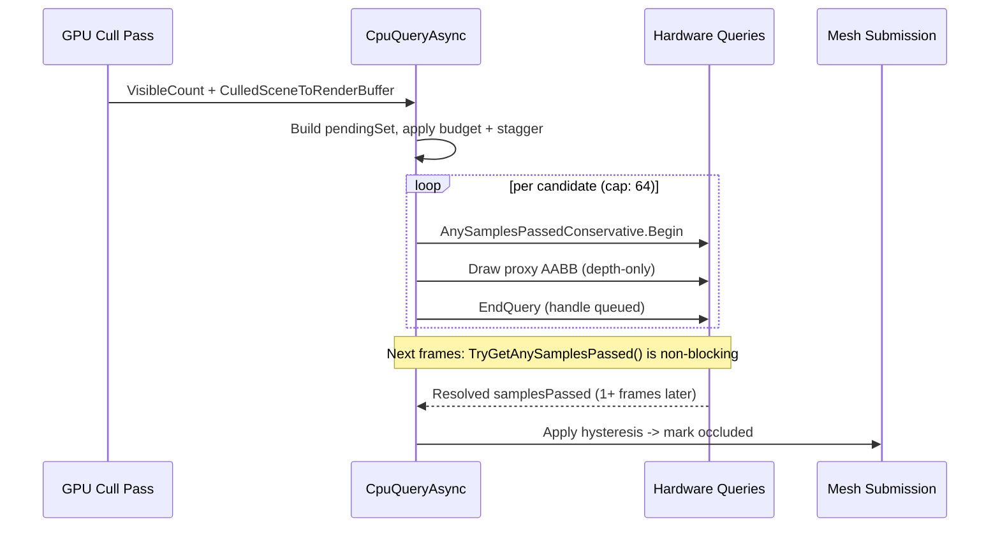

# CPU Query Async Occlusion

`EOcclusionCullingMode.CpuQueryAsync` is XRENGINE's hardware-query-based occlusion
path. On the CPU-direct mesh submission path, it submits asynchronous hardware
queries on OpenGL and Vulkan. DX12 still forces commands visible and records an
`UnsupportedBackend` diagnostic instead of silently culling with an unvalidated
query backend.

Backend support is path-specific:

- On `CpuDirect` (CPU traversal), the per-pass `RenderCommandCollection` uses
  `CpuRenderOcclusionCoordinator` to bracket each visible probe's draw with an
  occlusion query. OpenGL records the query immediately; Vulkan enqueues
  begin/end query frame ops around the deferred proxy draw.
- On the GPU-dispatch strategies (`GpuIndirect*`), the current
  `GPURenderPassCollection.ApplyCpuQueryAsyncOcclusion` path issues proxy-AABB
  queries against `CulledSceneToRenderBuffer` after the GPU cull pass on the
  supported instrumented/OpenGL path. Zero-readback modes should use `GpuHiZ`.

The requested `CpuQueryAsync` mode is not rewritten by the Vulkan feature
profile. Unsupported backends or pass shapes must report an explicit skip /
force-visible reason instead of silently substituting a different occlusion
algorithm.

It complements the GPU Hi-Z compute path (`GpuHiZ`) and the CPU software
rasterizer (`CpuSoftwareOcclusion`).

## When To Use

| Mode | Cull granularity | Latency | Best for |
| --- | --- | --- | --- |
| `GpuHiZ` | Per-command, per-frame | Same frame | High-instance scenes with stable temporal state. |
| `CpuQueryAsync` | Per-command, ~1 frame late | Async hardware query | Scenes where Hi-Z gets confused (camera teleports, scripted edits) and per-mesh granularity is sufficient. |
| `CpuSoftwareOcclusion` | Per-command, same frame | Software raster | Headless / debug; deterministic; CPU-bound. |

`CpuQueryAsync` is the right pick when Hi-Z's temporal pyramid is unreliable
(frequent camera cuts, large per-frame edits) but the scene is still complex
enough that per-mesh culling pays off.

## Pipeline Flow

## Submission (CPU-direct path)

The CPU-direct path defers proxy work until after predicted-visible opaque
meshes have populated depth. Each scheduled probe draws a depth-tested,
color/depth-write-disabled AABB proxy between `BeginQuery` and `EndQuery`.
OpenGL executes those calls directly through `GLRenderQuery`. Vulkan enqueues
`QueryOp` frame operations around the deferred proxy `MeshDrawOp`, then records
`vkCmdBeginQuery` / `vkCmdEndQuery` inside the same render pass as the proxy
draw.

CPU occlusion only runs on primary opaque/masked scene passes. Shadow passes and
forward depth-normal prepasses bypass both CPU-query and CPU software occlusion:
their depth contents are inputs to later lighting/visibility work, so letting
them make or reuse temporal occlusion decisions can produce stale one-frame
holes and duplicate per-mesh query work.

The two-step lifecycle (`SubmitCpuOcclusionQueryBatch` + `ResolveCpuOcclusionQueryResults`)
is intentionally asynchronous. Queries submitted on frame N typically resolve on
frame N+1 or N+2; the resolve path is non-blocking, so frames never stall on
the GPU.

## Submission (GPU-dispatch path)

`SubmitCpuOcclusionQueryBatch` (in
[`GPURenderPassCollection.Occlusion.cs`](../../../XREngine.Runtime.Rendering/Rendering/Commands/GPURenderPassCollection/GPURenderPassCollection.Occlusion.cs))
runs after the GPU cull pass for the active `RenderPass`. It:

1. Bails when the active renderer is not OpenGL. **CpuQueryAsync is OpenGL-only
   on this GPU-dispatch refinement path today.** Vulkan and DX12 backends pass
   through unchanged and report the unsupported backend in telemetry.
2. Bails when the culled-buffer or count-buffer is unavailable, when the pass is
   on a `GpuIndirectZeroReadback` strategy (no CPU-visible visible-count), or
   when `VisibleCommandCount == 0`. Pair `CpuQueryAsync` with `CpuDirect` or
   `GpuIndirectInstrumented` when you want GPU-dispatch refinement; use
   `GpuHiZ` under zero-readback.
3. Iterates `CulledSceneToRenderBuffer` entries, looking up the source command
   (`Reserved1` → source index in `GPUScene`).
4. Skips a candidate if:
   - it's already in `_cpuOcclusionPending`,
   - it was recently resolved and the per-frame stagger says "not yet" (LRU
     retest window = `TemporalOcclusionHysteresisFrames * 3` = **6 frames**),
   - the source command is missing or not an AABB primitive,
   - `CpuSoftwareOcclusionCuller.IsCpuOcclusionExcluded` returns true (gizmo
     materials, editor overlays, etc.),
   - the AABB size is degenerate.
5. Acquires a pooled `XRRenderQuery` from `AsyncOcclusionQueryManager`, brackets
   `CpuOcclusionProxyRenderer.Draw(bounds)` (depth-only proxy AABB rasterization
   with color writes off, depth writes off, depth test on, cull None) with
   `BeginQuery(AnySamplesPassedConservative)` / `EndQuery()`, and appends
   `(sourceIndex, query)` to the pending list.

### Budget And Hysteresis

| Knob | Default | Source |
| --- | --- | --- |
| `CpuOcclusionMaxQueriesPerFrame` | 64 | `_cpuOcclusionPending.Count` headroom |
| `TemporalOcclusionHysteresisFrames` | 2 | resolve-side filter |
| Retest period | 6 frames | `TemporalOcclusionHysteresisFrames * 3` |
| Submit-side stagger | `(frameId + sourceIndex) % 6 == 0` | spreads cost |

The 64-query cap puts a hard ceiling on per-frame submission cost; with the
6-frame retest window, a stable scene cycles roughly `6 * 64 = 384` candidates
through the pool before reusing query slots. Larger working sets simply test
fewer candidates more often — Hi-Z handles the wide cull, `CpuQueryAsync` adds
mesh-level refinement.

## Resolution

`ResolveCpuOcclusionQueryResults` drains the pending list every frame:

1. `XRRenderQuery.TryGetAnySamplesPassed(out _)` is non-blocking
   (`GL_QUERY_RESULT_AVAILABLE`). Unresolved queries stay in the pending list.
2. Resolved results enter `_cpuOcclusionRecent` (sourceIndex → last result frame
   + verdict).
3. The hysteresis filter requires `TemporalOcclusionHysteresisFrames` consecutive
   "occluded" results before downstream culling acts on the verdict.
4. Telemetry counters `CpuQueryAsyncResolved` / `CpuQueryAsyncOccluded` are
   incremented; the editor Occlusion panel surfaces them next frame.

## Telemetry

[`OcclusionTelemetry`](../../../XREngine.Runtime.Rendering/Rendering/Occlusion/OcclusionTelemetry.cs)
exposes:

- `CpuQueryAsyncSubmitted` — queries Begin/End-bracketed this frame.
- `CpuQueryAsyncResolved` — queries whose results landed this frame.
- `CpuQueryAsyncOccluded` — final per-frame "occluded" decisions after
  hysteresis.

The ImGui Occlusion panel renders all three plus a one-line explanation when
the path is inactive (effective mode mismatch, zero-readback strategy, etc.).

## Backend Scope

| Backend | Status |
| --- | --- |
| OpenGL 4.6 | Production. Uses `GL_ANY_SAMPLES_PASSED_CONSERVATIVE`. |
| Vulkan | Production for CPU-direct. Uses `VkQueryPool` occlusion queries recorded as Vulkan frame ops. Occlusion state is isolated per `XRRenderPipelineInstance` (desktop, each VR eye, capture/preview cameras), and hardware probe issuance rotates so at most one pipeline instance submits queries per frame (query brackets force that instance's primary command buffer to re-record). Prefer `GpuHiZ` for Vulkan GPU-driven zero-readback. |
| DX12 | Not implemented. |

Both OpenGL and Vulkan resolve through `AsyncOcclusionQueryManager` with
availability checks first, so the render thread never waits for query results.

## Did We Try Meshlets On OpenGL?

Yes — partially. `EMeshShaderDialect` already models both OpenGL dialects,
and the production GLSL shader variants for both already exist alongside the
Vulkan ones:

| Dialect | Spec | Shaders shipped | Indirect-count dispatch | `SupportsMeshletDispatch()` |
| --- | --- | --- | --- | --- |
| `VulkanEXT` | `VK_EXT_mesh_shader` | `MeshletCulling.task`, `MeshletRender.mesh`, `MeshletRenderSkinned.mesh` | `vkCmdDrawMeshTasksIndirectCountEXT` wired | **true** |
| `OpenGLEXT` | `GL_EXT_mesh_shader` | `MeshletCullingExt.task`, `MeshletRenderExt.mesh`, `MeshletRenderSkinnedExt.mesh` | `glMultiDrawMeshTasksIndirectCountEXT` **not wired**; extension also rarely exposed by current drivers | false |
| `OpenGLNV` | `GL_NV_mesh_shader` | NV variants for diagnostics | No indirect-count entrypoint exists in the spec | false (diagnostic-only) |
| `None` | — | — | — | false |

The blocker for production meshlets on OpenGL is **not** missing shaders; it's
the indirect-count mesh-task dispatch entrypoint:

- `GL_NV_mesh_shader` has no indirect-count call at all, so even on supported
  NVIDIA hardware it cannot satisfy production `GpuMeshletZeroReadback`. It
  remains as a bring-up / shader-diagnostics path.
- `GL_EXT_mesh_shader` does expose `glMultiDrawMeshTasksIndirectCountEXT`,
  but XRENGINE has not yet wired the C# delegate loader for it, and current
  driver coverage for the extension is thin (NVIDIA only on recent drivers;
  AMD/Intel typically do not expose it). The Phase 3 todo in
  `occlusion-and-meshlet-execution-todo.md` calls out the decision of whether
  to finish the EXT delegate wiring in v1 or accept Vulkan-only meshlets.

Until the EXT delegate is wired (or a driver/hardware target appears that
justifies it), the resolver downgrades any forced meshlet strategy on OpenGL
to `GpuIndirectZeroReadback`. The Occlusion panel surfaces the active
downgrade (requested → resolved + dialect + reason), and the editor tooltip on
`ForceMeshSubmissionStrategy` explains it.

See [mesh-submission-strategies](../../architecture/rendering/mesh-submission-strategies.md)
for the full resolver contract.

## Limits And Follow-Ups

- **Per-mesh granularity ceiling.** Hardware occlusion queries can't cull
  meshes whose AABB has even one visible pixel. Large meshes covering many
  pixels will report "visible" even when most of the mesh is behind an
  occluder. Split large geometry or stack with `CpuSoftwareOcclusion` for
  software pre-pass coverage.
- **CPU SOC self-occluder guard.** `CpuSoftwareOcclusion` culls between render
  commands, not inside a single merged command. When an imported scene collapses
  to one `$MergedNode_0` command, SOC may rasterize that command into the mask
  and then skip testing it against itself. The Occlusion panel reports this as
  `Self-Occluder Skips`; split submeshes or mesh islands into separate render
  commands to see SOC remove hidden geometry.
- **Hi-Z dirty-bypass passthrough copy** (todo Phase 4) is deferred. The
  current `XRE_GPU_HIZ_DIRTY_BYPASS=1` opt-in has a documented nvoglv64 crash
  under sustained dirty conditions; the safe default remains OFF until the
  state handoff is rewritten as an explicit GPU passthrough copy.
- **Vulkan GPU-dispatch parity** remains separate from CPU-direct support. The
  CPU-direct path records `QueryOp` begin/end around proxy draws; the
  GPU-dispatch refinement path still needs backend-specific validation before it
  should be treated as production Vulkan behavior.
