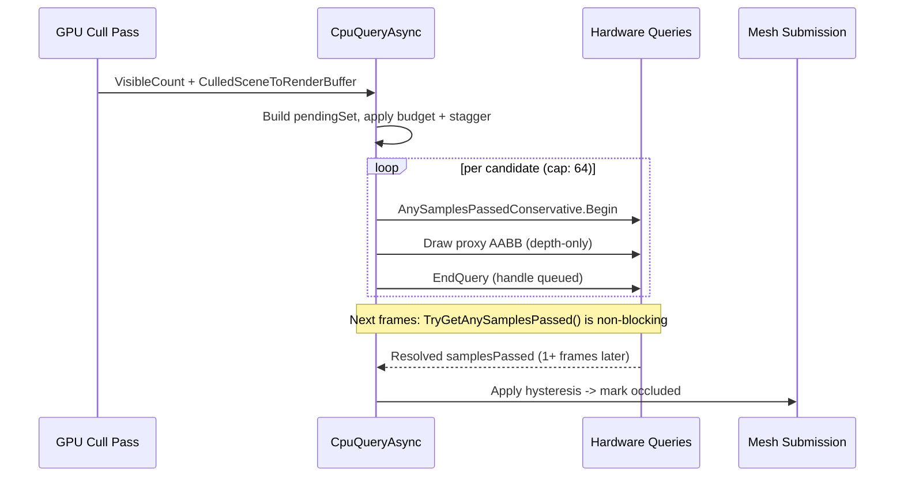

# CPU Query Async Occlusion

`EOcclusionCullingMode.CpuQueryAsync` is XRENGINE's hardware-query-based occlusion
path. It works on **both** mesh submission paths:

- On `CpuDirect` (CPU traversal), the per-pass `RenderCommandCollection` uses
  `CpuRenderOcclusionCoordinator` to bracket each visible probe's draw with an
  occlusion query (this has always worked).
- On the GPU-dispatch strategies (`GpuIndirect*`), the
  `GPURenderPassCollection.ApplyCpuQueryAsyncOcclusion` path issues proxy-AABB
  queries against `CulledSceneToRenderBuffer` after the GPU cull pass.

It complements the GPU Hi-Z compute path (`GpuHiZ`) and the CPU software
rasterizer (`CpuSoftwareOcclusion`).

## When To Use

| Mode | Cull granularity | Latency | Best for |
| --- | --- | --- | --- |
| `GpuHiZ` | Per-command, per-frame | Same frame | High-instance scenes with stable temporal state. |
| `CpuQueryAsync` | Per-command, ~1 frame late | Async hardware query | Scenes where Hi-Z gets confused (camera teleports, scripted edits) and per-mesh granularity is sufficient. |
| `CpuSoftwareOcclusion` | Per-command, same frame | Software raster | Headless / debug; deterministic; CPU-bound. |

`CpuQueryAsync` is the right pick when Hi-Z's temporal pyramid is unreliable
(frequent camera cuts, large per-frame edits) but the scene is still complex
enough that per-mesh culling pays off.

## Pipeline Flow

The two-step lifecycle (`SubmitCpuOcclusionQueryBatch` + `ResolveCpuOcclusionQueryResults`)
is intentionally asynchronous. Queries submitted on frame N typically resolve on
frame N+1 or N+2; the resolve path is non-blocking, so frames never stall on
the GPU.

## Submission (GPU-dispatch path)

`SubmitCpuOcclusionQueryBatch` (in
[`GPURenderPassCollection.Occlusion.cs`](../../../XREngine.Runtime.Rendering/Rendering/Commands/GPURenderPassCollection/GPURenderPassCollection.Occlusion.cs))
runs after the GPU cull pass for the active `RenderPass`. It:

1. Bails when the active renderer is not OpenGL. **The CpuQueryAsync GPU-dispatch
   path is OpenGL-only today.** Vulkan and DX12 backends pass through unchanged.
   The CpuDirect submission path is independent of this gate.
2. Bails when the culled-buffer or count-buffer is unavailable, when the pass is
   on a `GpuIndirectZeroReadback` strategy (no CPU-visible visible-count), or
   when `VisibleCommandCount == 0`. Pair `CpuQueryAsync` with `CpuDirect` or
   `GpuIndirectInstrumented` when you want GPU-dispatch refinement; use
   `GpuHiZ` under zero-readback.
3. Iterates `CulledSceneToRenderBuffer` entries, looking up the source command
   (`Reserved1` → source index in `GPUScene`).
4. Skips a candidate if:
   - it's already in `_cpuOcclusionPending`,
   - it was recently resolved and the per-frame stagger says "not yet" (LRU
     retest window = `TemporalOcclusionHysteresisFrames * 3` = **6 frames**),
   - the source command is missing or not an AABB primitive,
   - `CpuSoftwareOcclusionCuller.IsCpuOcclusionExcluded` returns true (gizmo
     materials, editor overlays, etc.),
   - the AABB size is degenerate.
5. Acquires a pooled `XRRenderQuery` from `AsyncOcclusionQueryManager`, brackets
   `CpuOcclusionProxyRenderer.Draw(bounds)` (depth-only proxy AABB rasterization
   with color writes off, depth writes off, depth test on, cull None) with
   `BeginQuery(AnySamplesPassedConservative)` / `EndQuery()`, and appends
   `(sourceIndex, query)` to the pending list.

### Budget And Hysteresis

| Knob | Default | Source |
| --- | --- | --- |
| `CpuOcclusionMaxQueriesPerFrame` | 64 | `_cpuOcclusionPending.Count` headroom |
| `TemporalOcclusionHysteresisFrames` | 2 | resolve-side filter |
| Retest period | 6 frames | `TemporalOcclusionHysteresisFrames * 3` |
| Submit-side stagger | `(frameId + sourceIndex) % 6 == 0` | spreads cost |

The 64-query cap puts a hard ceiling on per-frame submission cost; with the
6-frame retest window, a stable scene cycles roughly `6 * 64 = 384` candidates
through the pool before reusing query slots. Larger working sets simply test
fewer candidates more often — Hi-Z handles the wide cull, `CpuQueryAsync` adds
mesh-level refinement.

## Resolution

`ResolveCpuOcclusionQueryResults` drains the pending list every frame:

1. `XRRenderQuery.TryGetAnySamplesPassed(out _)` is non-blocking
   (`GL_QUERY_RESULT_AVAILABLE`). Unresolved queries stay in the pending list.
2. Resolved results enter `_cpuOcclusionRecent` (sourceIndex → last result frame
   + verdict).
3. The hysteresis filter requires `TemporalOcclusionHysteresisFrames` consecutive
   "occluded" results before downstream culling acts on the verdict.
4. Telemetry counters `CpuQueryAsyncResolved` / `CpuQueryAsyncOccluded` are
   incremented; the editor Occlusion panel surfaces them next frame.

## Telemetry

[`OcclusionTelemetry`](../../../XREngine.Runtime.Rendering/Rendering/Occlusion/OcclusionTelemetry.cs)
exposes:

- `CpuQueryAsyncSubmitted` — queries Begin/End-bracketed this frame.
- `CpuQueryAsyncResolved` — queries whose results landed this frame.
- `CpuQueryAsyncOccluded` — final per-frame "occluded" decisions after
  hysteresis.

The ImGui Occlusion panel renders all three plus a one-line explanation when
the path is inactive (effective mode mismatch, zero-readback strategy, etc.).

## Backend Scope

| Backend | Status |
| --- | --- |
| OpenGL 4.6 | Production. Uses `GL_ANY_SAMPLES_PASSED_CONSERVATIVE`. |
| Vulkan (WIP) | Pass-through; the submit/resolve methods bail when the active renderer is not `OpenGLRenderer`. Vulkan queries (`VK_QUERY_TYPE_OCCLUSION`) are tracked under the Vulkan upscale bridge work. |
| DX12 | Not implemented. |

A Vulkan equivalent can reuse the same lifecycle (proxy AABB depth-only draw,
`AnySamplesPassed` query, non-blocking poll) — the bottleneck is wiring a
`VkQueryPool`-backed `XRRenderQuery` rather than redesigning the contract.

## Did We Try Meshlets On OpenGL?

Yes — partially. `EMeshShaderDialect` already models both OpenGL dialects,
and the production GLSL shader variants for both already exist alongside the
Vulkan ones:

| Dialect | Spec | Shaders shipped | Indirect-count dispatch | `SupportsMeshletDispatch()` |
| --- | --- | --- | --- | --- |
| `VulkanEXT` | `VK_EXT_mesh_shader` | `MeshletCulling.task`, `MeshletRender.mesh`, `MeshletRenderSkinned.mesh` | `vkCmdDrawMeshTasksIndirectCountEXT` wired | **true** |
| `OpenGLEXT` | `GL_EXT_mesh_shader` | `MeshletCullingExt.task`, `MeshletRenderExt.mesh`, `MeshletRenderSkinnedExt.mesh` | `glMultiDrawMeshTasksIndirectCountEXT` **not wired**; extension also rarely exposed by current drivers | false |
| `OpenGLNV` | `GL_NV_mesh_shader` | NV variants for diagnostics | No indirect-count entrypoint exists in the spec | false (diagnostic-only) |
| `None` | — | — | — | false |

The blocker for production meshlets on OpenGL is **not** missing shaders; it's
the indirect-count mesh-task dispatch entrypoint:

- `GL_NV_mesh_shader` has no indirect-count call at all, so even on supported
  NVIDIA hardware it cannot satisfy production `GpuMeshletZeroReadback`. It
  remains as a bring-up / shader-diagnostics path.
- `GL_EXT_mesh_shader` does expose `glMultiDrawMeshTasksIndirectCountEXT`,
  but XRENGINE has not yet wired the C# delegate loader for it, and current
  driver coverage for the extension is thin (NVIDIA only on recent drivers;
  AMD/Intel typically do not expose it). The Phase 3 todo in
  `occlusion-and-meshlet-execution-todo.md` calls out the decision of whether
  to finish the EXT delegate wiring in v1 or accept Vulkan-only meshlets.

Until the EXT delegate is wired (or a driver/hardware target appears that
justifies it), the resolver downgrades any forced meshlet strategy on OpenGL
to `GpuIndirectZeroReadback`. The Occlusion panel surfaces the active
downgrade (requested → resolved + dialect + reason), and the editor tooltip on
`ForceMeshSubmissionStrategy` explains it.

See [mesh-submission-strategies](../../architecture/rendering/mesh-submission-strategies.md)
for the full resolver contract.

## Limits And Follow-Ups

- **Per-mesh granularity ceiling.** Hardware occlusion queries can't cull
  meshes whose AABB has even one visible pixel. Large meshes covering many
  pixels will report "visible" even when most of the mesh is behind an
  occluder. Split large geometry or stack with `CpuSoftwareOcclusion` for
  software pre-pass coverage.
- **Hi-Z dirty-bypass passthrough copy** (todo Phase 4) is deferred. The
  current `XRE_GPU_HIZ_DIRTY_BYPASS=1` opt-in has a documented nvoglv64 crash
  under sustained dirty conditions; the safe default remains OFF until the
  state handoff is rewritten as an explicit GPU passthrough copy.
- **Vulkan parity** is the next obvious extension; the design above is
  backend-agnostic apart from the `OpenGLRenderer` cast in
  `SubmitCpuOcclusionQueryBatch`.
