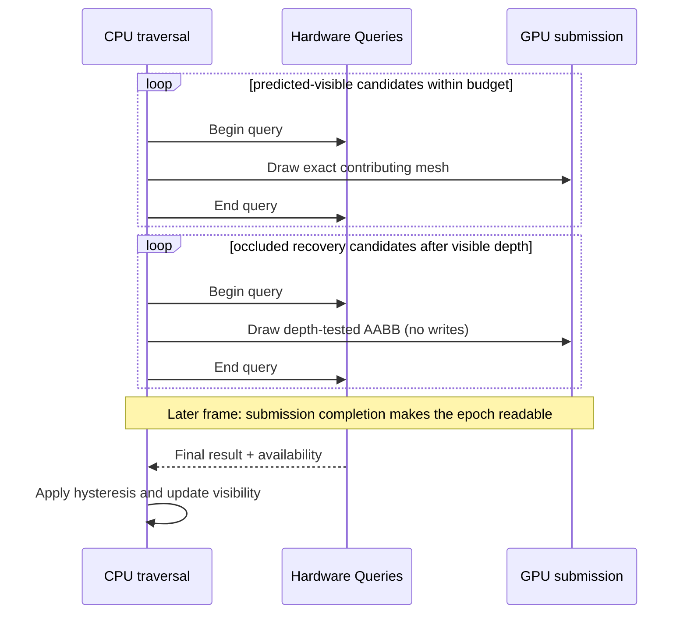

# CPU Query Async Occlusion

`EOcclusionCullingMode.CpuQueryAsync` is XRENGINE's hardware-query-based occlusion
path. On the CPU-direct mesh submission path, it submits asynchronous hardware
queries on OpenGL and Vulkan. DX12 still forces commands visible and records an
`UnsupportedBackend` diagnostic instead of silently culling with an unvalidated
query backend.

Backend support is path-specific:

- On `CpuDirect` (CPU traversal), the per-pass `RenderCommandCollection` uses
  `CpuRenderOcclusionCoordinator` to bracket each predicted-visible mesh's exact
  contributing draw with an occlusion query. Already-occluded meshes are retested
  later with conservative AABB proxies. OpenGL records the query immediately;
  Vulkan enqueues ordered begin/draw/end frame ops.
- On the GPU-dispatch strategies (`GpuIndirect*`), the current
  `GPURenderPassCollection.ApplyCpuQueryAsyncOcclusion` path issues proxy-AABB
  queries against `CulledSceneToRenderBuffer` after the GPU cull pass on the
  supported instrumented/OpenGL path. Zero-readback modes should use `GpuHiZ`.

The requested `CpuQueryAsync` mode is not rewritten by the Vulkan feature
profile. Unsupported backends or pass shapes must report an explicit skip /
force-visible reason instead of silently substituting a different occlusion
algorithm.

It complements the GPU Hi-Z compute path (`GpuHiZ`) and the CPU software
rasterizer (`CpuSoftwareOcclusion`).

## When To Use

| Mode | Cull granularity | Latency | Best for |
| --- | --- | --- | --- |
| `GpuHiZ` | Per-command, per-frame | Same frame | High-instance scenes with stable temporal state. |
| `CpuQueryAsync` | Per-command, submission-completion latency | Async hardware query | Scenes where Hi-Z gets confused (camera teleports, scripted edits) and per-mesh granularity is sufficient. |
| `CpuSoftwareOcclusion` | Per-command, same frame | Software raster | Headless / debug; deterministic; CPU-bound. |

`CpuQueryAsync` is the right pick when Hi-Z's temporal pyramid is unreliable
(frequent camera cuts, large per-frame edits) but the scene is still complex
enough that per-mesh culling pays off.

## Pipeline Flow

## Submission (CPU-direct path)

The CPU-direct path keeps visible-demotion queries at each mesh's original
front-to-back draw position. `BeginQuery` and `EndQuery` bracket the exact mesh
draw, so the result follows that pass's real depth function, alpha discard, and
depth-prepass equality behavior. This avoids testing a bounding box against
depth previously written by the candidate itself.

Meshes already classified as occluded do not contribute depth. Their recovery
queries are deferred until predicted-visible meshes have populated depth, then
draw a depth-tested, color/depth-write-disabled AABB proxy. A false-positive
only renders extra geometry; a final zero proves the candidate bounds remain
hidden. OpenGL executes query calls directly. Vulkan records each
`QueryOp -> MeshDrawOp -> QueryOp` bracket in one render scope and preserves its
enqueue order through sorting and primary-command-buffer reuse. The render-graph
compiler assigns global query-order ordinals in one O(N) forward scan. Opaque
draws may still canonicalize and batch inside an order block, but operations
from an equal-ranked pass cannot enter the bracket and no draw may cross a query
boundary. The cached-primary generation includes each bracket's positions,
query identity, and enclosed draw structure, so a primary recorded for one
query/draw pairing cannot be reused for another.

CPU occlusion only runs on primary opaque/masked scene passes. Shadow passes and
forward depth-normal prepasses bypass both CPU-query and CPU software occlusion:
their depth contents are inputs to later lighting/visibility work, so letting
them make or reuse temporal occlusion decisions can produce stale one-frame
holes and duplicate per-mesh query work.

The lifecycle is intentionally asynchronous. OpenGL polls availability without
waiting. Vulkan waits to *poll* until resource-lifetime tracking proves the
submission fence/timeline completed, then reads each result and availability in
one call. Queries can resolve several frames after submission. A pending
visible-demotion query stays visible; a mono recovery query may retain its prior
proven occlusion until the stale-result deadline, while invalid or overdue state
is forced visible. `CpuQueryOcclusionMaxQueriesPerFrame` is enforced as a
reservation-aware total in-flight limit, including the direct visible-demotion
path, rather than only as a per-frame submission allowance. At the first budget
use for a pass/view scope each frame, the coordinator scans pending individual
and hierarchy queries once. Later scheduling checks that snapshot plus same-frame
visible and recovery reservations, while resolution or expiry decrements the
snapshot. Repeated inline scheduling therefore avoids rescanning query state and
becoming O(N^2).

If an owner is evicted or a command container is released while its epoch is
pending, the query is quarantined instead of being returned to the descriptor-
compatible pool. A later nonblocking drain consumes the exact ticket after its
submission completes; terminal backend errors destroy the handle. An individual
or hierarchy epoch that exceeds
`CpuQueryOcclusionMaxPendingFrames` is likewise replaced with a fresh query and
pending-released. Its decision fails visible, and the abandoned epoch cannot be
pooled under a new owner or permanently consume query capacity. The render
thread never stalls on an ordinary query poll.

### Query Granularity And Scheduling

One query can reject only the draw it encloses. Importing a large scene with
`OptimizeMeshes` commonly produces one material-wide draw whose triangles span
the whole building; one visible fragment then keeps all of that material's
geometry alive. `ModelImportOptions.SpatialPartitionMaxTriangles` addresses
this without discarding Assimp's graph/material optimization. A value greater
than zero applies bounded, binned surface-area-heuristic (SAH) splits over the
triangle centroids and bounds. Splits are mandatory above the triangle limit;
high-value splits may also be accepted below it, within a bounded leaf budget,
when they materially tighten the draw units. The partitioner preserves the
source material and LOD settings and emits one render command per partition. A
mandatory phase completes before optional refinement, so unresolved hard splits
cannot consume the optional leaf budget as if they were one leaf. Large
mandatory nodes also enforce a balanced child size before falling back to a
median split, avoiding repeated one-triangle-versus-rest construction. Vertex
identity and copying include bitangent handedness, so rebuilding partitions
does not merge mirrored tangent-space seams.
The Unit Testing World flag
`SpatiallyPartitionMeshesForOcclusion` selects a 4,096-triangle target. It is
intended for large static occlusion workloads; leave it disabled for animated
content unless the extra draw units have been profiled.

Spatial partitions can share one imported parent transform and therefore the
same origin, leaving origin-distance ties to import order. Each destination
render-command collection captures its own camera-local distance from the
nearest point on the partition's world AABB and stores that distance with the
sort key in an immutable snapshot. Desktop, VR-eye, capture, and preview
collection can consequently sort the same command independently without another
viewport mutating a live key inside the collection.

Visible-query selection is global to the completed pass, not first-come in
render order. The coordinator ranks the full eligible set and reserves the next
pass's budget by recovery/staleness priority, projected area, distance, and
stable key. Commands whose Vulkan mesh/pipeline resources are not ready draw
fail-visible but are excluded from the query set, so a begin/end pair never
encloses an empty draw. Negative evidence remains valid for at least two full
budget sweeps plus Vulkan's result latency while the camera is stable; this
prevents a large working set from becoming visible again before it can be
retested.

### Auxiliary Replay And Full Overdraw

CPU motion-vector replay consults the exact primary CPU-query visibility
decision recorded for that command in the current frame instead of scheduling
or deriving a second independent visibility set. Commands explicitly excluded
from CPU occlusion remain unconditional in the replay. Passes outside the
CPU-query-testable opaque/masked mesh set also render unconditionally. The CPU
full-overdraw diagnostic also replays only surviving mesh commands, but its
override material deliberately disables depth testing and depth writes. It
therefore counts every triangle fragment inside each accepted draw unit,
including triangles that ordinary depth testing would hide; CPU queries can
remove a whole partition, not hidden triangles within a partition that remained
visible. The default full-overdraw pass list excludes `Background` and
`OnTopForward`.

Full overdraw is a diagnostic worst-case replay on top of the normal scene work,
not the normal CPU-query rendering path. Its frame rate should not be used as the
ordinary culling-path frame rate.

## Submission (GPU-dispatch path)

`SubmitCpuOcclusionQueryBatch` (in
[`GPURenderPassCollection.Occlusion.cs`](../../../XREngine.Runtime.Rendering/Rendering/Commands/GPURenderPassCollection/GPURenderPassCollection.Occlusion.cs))
runs after the GPU cull pass for the active `RenderPass`. It:

1. Bails when the active renderer is not OpenGL. **CpuQueryAsync is OpenGL-only
   on this GPU-dispatch refinement path today.** Vulkan and DX12 backends pass
   through unchanged and report the unsupported backend in telemetry.
2. Bails when the culled-buffer or count-buffer is unavailable, when the pass is
   on a `GpuIndirectZeroReadback` strategy (no CPU-visible visible-count), or
   when `VisibleCommandCount == 0`. Pair `CpuQueryAsync` with `CpuDirect` or
   `GpuIndirectInstrumented` when you want GPU-dispatch refinement; use
   `GpuHiZ` under zero-readback.
3. Iterates `CulledSceneToRenderBuffer` entries, looking up the source command
   (`Reserved1` -> source index in `GPUScene`).
4. Skips a candidate if:
   - it's already in `_cpuOcclusionPending`,
   - it has a cached verdict and the motion-tiered per-frame stagger says "not
     yet",
   - the source command is missing or not an AABB primitive,
   - `CpuSoftwareOcclusionCuller.IsCpuOcclusionExcluded` returns true (gizmo
     materials, editor overlays, etc.),
   - the AABB size is degenerate.
5. Acquires a pooled `XRRenderQuery` from `AsyncOcclusionQueryManager`, brackets
   `CpuOcclusionProxyRenderer.Draw(bounds)` (depth-only proxy AABB rasterization
   with color writes off, depth writes off, depth test on, cull None) with
   `BeginQuery(AnySamplesPassedConservative)` / `EndQuery()`, and appends
   `(sourceIndex, query)` to the pending list.

### GPU-Dispatch Budget And Hysteresis

| Knob | Default | Source |
| --- | --- | --- |
| `CpuQueryOcclusionMaxQueriesPerFrame` | 64 | Maximum GPU-dispatch queries in flight |
| `TemporalOcclusionHysteresisFrames` | 2 | resolve-side filter |
| Stable retest period | 6 frames | `TemporalOcclusionHysteresisFrames * 3` |
| Small-motion retest period | 4 frames | `TemporalOcclusionHysteresisFrames * 2` |
| Other motion-tier retest period | 1 frame | medium/large motion and camera cuts |
| Submit-side stagger | `(frameId + sourceIndex) % retestPeriod == 0` | spreads cost for cached verdicts |

The submit budget is `maxQueries - pendingQueries`, not 64 fresh submissions
every frame. A candidate with a cached result is eligible according to the
current motion tier's stagger: every six frames while stable, every four during
small motion, and every frame for the remaining motion tiers. If the in-flight
pool is full, submission waits for existing results to resolve. Larger working
sets therefore receive less-frequent refinement. Hi-Z remains the preferred
wide-cull path.

## Resolution

### CPU-Direct Resolution

The CPU-direct coordinator owns one logical query state per command and view
scope. Vulkan resolution follows these rules:

1. Polling is delayed by at least two render frames. OpenGL checks
   `GL_QUERY_RESULT_AVAILABLE`; Vulkan additionally requires completion of the
   exact submission that reset and wrote the pool.
2. Each recorded command buffer publishes an immutable result epoch containing
   its submission serial and query count. A query cannot be recorded or reused
   for a second epoch while the first is pending.
3. `vkGetQueryPoolResults` reads 64-bit `(result, availability)` pairs in one
   call, without `VK_QUERY_RESULT_PARTIAL_BIT`. Every multiview slot must be
   available, then their sample results are ORed. An unavailable, malformed,
   stale, or unknown epoch is never interpreted as zero samples.
4. Two final zero-sample results are required to demote a predicted-visible
   mesh. A positive result immediately restores visible confidence. Occluded
   meshes are retested by deferred recovery proxies; overdue or invalid query
   state is forced visible.
5. An overdue individual or hierarchy epoch is retired as still pending and
   replaced rather than merely clearing its pending flag. The replacement can
   participate in later revalidation, while the abandoned native epoch remains
   quarantined through backend lifetime tracking.

This is deliberately fence-aware instead of relying on `WAIT_BIT`. Vulkan can
still expose the previous use's availability until a queued
`vkCmdResetQueryPool` has actually executed, even when wait and availability
flags are combined.

### GPU-Dispatch Resolution

The OpenGL GPU-dispatch resolver checks `_cpuOcclusionPending` once per frame.
Completed results enter `_cpuOcclusionLastResolved`, and the temporal filter
requires two consecutive filter frames carrying a zero-sample verdict before
removing a GPU command. The cached verdict is evaluated on every filter frame,
so one resolved zero can satisfy both frames; this does not require two distinct
hardware-query results. Unavailable results remain pending. This path uses the
separate `CpuQueryAsyncSubmitted`, `CpuQueryAsyncResolved`, and
`CpuQueryAsyncOccluded` counters.

## Telemetry

[`OcclusionTelemetry`](../../../XREngine.Runtime.Rendering/Rendering/Occlusion/OcclusionTelemetry.cs)
exposes two counter families.

CPU-direct traversal reports:

- `CpuQuerySubmittedTotal` / `CpuQueryResolvedTotal`, with per-reason buckets.
- `CpuPendingQueries`.
- `CpuQueryLatencyAverageFrames` / `CpuQueryLatencyMaxFrames`.
- `CpuTested`, `CpuRendered`, and `CpuCulled`, plus decision-reason counters.
- `CpuForcedVisibleTotal` and per-reason forced-visible diagnostics.

The CPU-direct tested/rendered/culled totals include only mesh commands admitted
to CPU-query decision logic. Non-mesh debug commands, bounds visualization, and
explicitly excluded meshes do not inflate those counters, though enabling such
debug rendering still adds real CPU/GPU work and can reduce frame rate.

When mesh-bounds visualization is enabled, a mesh suppressed by the active
view's CPU-query decision draws its bounds in yellow. Meshes not suppressed by
CPU-query occlusion retain the configured bounds color. The lookup is view-local
and runs after every CPU-query-testable primary mesh pass. It consumes only an
exact decision recorded for the current pass epoch, does not create coordinator
state, and does not share diagnostic state between desktop, stereo-eye, capture,
or shadow pipelines.

The OpenGL GPU-dispatch refinement reports:

- `CpuQueryAsyncSubmitted` - proxy queries Begin/End-bracketed this frame.
- `CpuQueryAsyncResolved` - proxy-query results resolved this frame.
- `CpuQueryAsyncOccluded` - GPU commands removed this frame after
  hysteresis.

The ImGui Occlusion panel renders both families plus a one-line explanation
when a path is inactive (effective mode mismatch, zero-readback strategy,
unsupported backend, and so on).

## Backend Scope

| Backend | Status |
| --- | --- |
| OpenGL 4.6 | Production. Uses `GL_ANY_SAMPLES_PASSED_CONSERVATIVE`. |
| Vulkan | Production for CPU-direct. Uses `VkQueryPool` occlusion queries recorded as ordered Vulkan frame ops. A pool epoch remains exclusively owned until its submission completes and the final result is consumed; reset execution, not stale host-visible availability, defines reuse. Occlusion state is isolated per `XRRenderPipelineInstance` (desktop, each VR eye, capture/preview cameras). Prefer `GpuHiZ` for Vulkan GPU-driven zero-readback. |
| DX12 | Not implemented. |

Both backends resolve through `AsyncOcclusionQueryManager` without query waits
in the render path. For Vulkan, see the
[render-query guide](render-queries.md),
[query specification](https://docs.vulkan.org/spec/latest/chapters/queries.html),
[`vkCmdResetQueryPool`](https://docs.vulkan.org/refpages/latest/refpages/source/vkCmdResetQueryPool.html),
and
[`vkGetQueryPoolResults`](https://docs.vulkan.org/refpages/latest/refpages/source/vkGetQueryPoolResults.html):
a queued GPU reset must execute before the previous use's availability/value
ceases to be observable. The asynchronous scheduling and temporal-coherence
policy also follow the established guidance in NVIDIA's
[Efficient Occlusion Culling](https://developer.nvidia.com/gpugems/gpugems/part-v-performance-and-practicalities/chapter-29-efficient-occlusion-culling)
and
[Hardware Occlusion Queries Made Useful](https://developer.nvidia.com/gpugems/gpugems2/part-i-geometric-complexity/chapter-6-hardware-occlusion-queries-made-useful):
consume older results instead of stalling for the query just issued, and spend
fewer queries on objects whose recent visibility is coherent.

## Did We Try Meshlets On OpenGL?

Yes - partially. `EMeshShaderDialect` already models both OpenGL dialects,
and the production GLSL shader variants for both already exist alongside the
Vulkan ones:

| Dialect | Spec | Shaders shipped | Indirect-count dispatch | `SupportsMeshletDispatch()` |
| --- | --- | --- | --- | --- |
| `VulkanEXT` | `VK_EXT_mesh_shader` | `MeshletCulling.task`, `MeshletRender.mesh`, `MeshletRenderSkinned.mesh` | `vkCmdDrawMeshTasksIndirectCountEXT` wired | **true** |
| `OpenGLEXT` | `GL_EXT_mesh_shader` | `MeshletCullingExt.task`, `MeshletRenderExt.mesh`, `MeshletRenderSkinnedExt.mesh` | `glMultiDrawMeshTasksIndirectCountEXT` **not wired**; extension also rarely exposed by current drivers | false |
| `OpenGLNV` | `GL_NV_mesh_shader` | NV variants for diagnostics | No indirect-count entrypoint exists in the spec | false (diagnostic-only) |
| `None` | - | - | - | false |

The blocker for production meshlets on OpenGL is **not** missing shaders; it's
the indirect-count mesh-task dispatch entrypoint:

- `GL_NV_mesh_shader` has no indirect-count call at all, so even on supported
  NVIDIA hardware it cannot satisfy production `GpuMeshletZeroReadback`. It
  remains as a bring-up / shader-diagnostics path.
- `GL_EXT_mesh_shader` does expose `glMultiDrawMeshTasksIndirectCountEXT`,
  but XRENGINE has not yet wired the C# delegate loader for it, and current
  driver coverage for the extension is thin (NVIDIA only on recent drivers;
  AMD/Intel typically do not expose it). The Phase 3 todo in
  `occlusion-and-meshlet-execution-todo.md` calls out the decision of whether
  to finish the EXT delegate wiring in v1 or accept Vulkan-only meshlets.

Until the EXT delegate is wired (or a driver/hardware target appears that
justifies it), the resolver downgrades any forced meshlet strategy on OpenGL
to `GpuIndirectZeroReadback`. The Occlusion panel surfaces the active
downgrade (requested -> resolved + dialect + reason), and the editor tooltip on
`ForceMeshSubmissionStrategy` explains it.

See [mesh-submission-strategies](../../architecture/rendering/mesh-submission-strategies.md)
for the full resolver contract.

## Limits And Follow-Ups

- **Per-draw granularity ceiling.** Hardware occlusion queries cannot reject
  part of a draw. Large, spatially scattered material batches report visible
  when any enclosed geometry passes. Use
  `ModelImportOptions.SpatialPartitionMaxTriangles` (or the Unit Testing World
  `SpatiallyPartitionMeshesForOcclusion` flag) for large static imports, and
  tune the partition size against query/draw overhead rather than maximizing
  the number of chunks.
- **Full-overdraw interpretation.** The full-overdraw view disables depth while
  replaying the partitions that survived primary culling. It exposes all
  triangles inside those accepted draw units and intentionally represents a
  worst-case diagnostic workload, not the normal depth-tested frame.
- **CPU SOC self-occluder guard.** `CpuSoftwareOcclusion` culls between render
  commands, not inside a single merged command. When an imported scene collapses
  to one `$MergedNode_0` command, SOC may rasterize that command into the mask
  and then skip testing it against itself. The Occlusion panel reports this as
  `Self-Occluder Skips`; split submeshes or mesh islands into separate render
  commands to see SOC remove hidden geometry.
- **Hi-Z dirty-bypass passthrough copy** (todo Phase 4) is deferred. The
  current `XRE_GPU_HIZ_DIRTY_BYPASS=1` opt-in has a documented nvoglv64 crash
  under sustained dirty conditions; the safe default remains OFF until the
  state handoff is rewritten as an explicit GPU passthrough copy.
- **Vulkan GPU-dispatch parity** remains separate from CPU-direct support. The
  CPU-direct path records query brackets around exact visible draws and recovery
  proxies; the
  GPU-dispatch refinement path still needs backend-specific validation before it
  should be treated as production Vulkan behavior.
