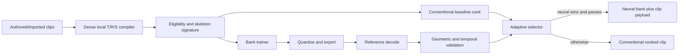
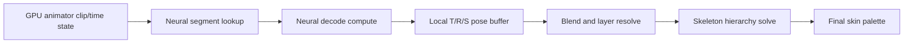

# Neural Animation Compression Design

Last Updated: 2026-08-25
Owner: Animation
Status: Proposed
Scope: add opt-in lossy compression for fixed-rate skeletal animation clips using an XRENGINE-owned neural representation, offline training, and deterministic custom inference.

Related repository documents:

- [Baked Animation Value Compression](../../../architecture/animation/baked-value-compression.md)
- [Lossy Float Baked Value Compression TODO](../../todo/animation/lossy-float-baked-value-compression-todo.md)
- [GPU-Driven Animation Architecture](../rendering/gpu/gpu-driven-animation.md)
- [GPU-Driven Animation TODO](../../todo/rendering/gpu/gpu-driven-animation-todo.md)
- [Neural Texture Compression Implementation Plan](../texturing/neural%20texture%20compression.md)
- [Animation System](../../../developer-guides/animation/animation-api.md)

---

## 1. Executive Summary

Neural animation compression should be an optional cooked representation for correlated skeletal T/R/S clips, not another codec inside the generic per-property `BakedValueStore<T>` abstraction.

The recommended representation is a **neural clip bank**:

- clips in a bank share an exact skeleton signature and dense output layout,
- one small decoder network is shared across the bank,
- each clip stores compact quantized latent codes for short time segments,
- the decoder maps a latent code plus local time to a complete local-space pose,
- constant/default channels, root motion, events, and unsupported tracks use conventional side data,
- a cook-time selector keeps the neural result only when it beats the conventional baseline while satisfying all error and performance gates.

The first production milestone should use **decode-on-load or decode-during-cook**. It reconstructs standard fixed-rate T/R/S samples and feeds the existing CPU animation path or the future `AnimationSampleAtlas`. This proves the asset, training, quality, fallback, and versioning contracts without requiring per-frame inference.

Direct CPU and GPU inference are later runtime modes. GPU inference naturally replaces the clip-sampling pass in the planned GPU-driven animation pipeline, writing the same local-pose buffer consumed by blending and the skeleton hierarchy solve. The network must never own state-machine semantics, root-motion authority, IK, callbacks, or final bone matrices.

The custom part is deliberately narrow: XRENGINE owns the network topology, payload format, quantization, validation, CPU decoder, and compute shader. It does not need a general-purpose ML runtime in shipping builds.

---

## 2. Current XRENGINE Reality

### 2.1 Existing Seams

The engine already has several useful boundaries:

- `AnimationClip` is the authoring/runtime clip asset.
- `AnimationClipBinaryCacheCodec` and `AnimationClipCookedBinaryCodec` provide cooked-cache and published binary serialization seams.
- `BasePropAnimBakeable` and `BakedValueStore<T>` provide allocation-free playback of per-property baked values.
- The lossy baked-value plan already owns ordinary float, vector, quaternion, and transform quantization.
- The GPU-driven animation design already defines immutable clip tables, a fixed-rate T/R/S `AnimationSampleAtlas`, local-pose output, hierarchy solve, and final skin-palette publication.

### 2.2 Missing Pieces

XRENGINE does not currently have:

- a canonical skeletal clip-cooking representation independent of reflected member paths,
- a clip/skeleton corpus and conventional rate-distortion baseline,
- a neural animation bank asset or bank dependency model,
- an offline trainer/exporter,
- a custom runtime inference kernel,
- clip-level geometric and temporal quality gates,
- editor tooling for source/reconstructed comparison and fallback reasons.

### 2.3 Architectural Consequence

Neural compression belongs after import and skeletal channel compilation but before backend-specific sample storage. It should consume dense local T/R/S data and produce an alternative cooked clip payload. It should not train against mutable `AnimationMember` object graphs or attempt to encode arbitrary property/method animations.

---

## 3. Research Basis

The proposed architecture is XRENGINE-specific, but several prior results establish useful design constraints:

- Holden, Saito, and Komura show that an autoencoder can learn a compact motion manifold, supporting the basic premise that correlated body motion is compressible in a learned latent space: [A Deep Learning Framework for Character Motion Synthesis and Editing](https://www.research.ed.ac.uk/en/publications/a-deep-learning-framework-for-character-motion-synthesis-and-edit/).
- Learned Motion Matching demonstrates a more runtime-oriented compressor/decompressor and reports that naive mean-squared reconstruction produces jitter; its decoder training uses forward-kinematics and velocity losses. It also observes that the decompressor alone can serve as a general animation compressor: [Learned Motion Matching](https://theorangeduck.com/media/uploads/other_stuff/Learned_Motion_Matching.pdf).
- NeMF represents kinematic motion as a continuous function of time conditioned by a latent vector, which supports time-coordinate decoding rather than storing every reconstructed frame: [NeMF: Neural Motion Fields for Kinematic Animation](https://papers.nips.cc/paper_files/paper/2022/hash/1b3750390ca8b931fb9ca988647940cb-Abstract-Conference.html).
- NeRMo further separates temporal coordinates from joint-specific latent information and uses Fourier features for time. Its prediction objective is not XRENGINE's compression objective, but its representation is useful evidence for a time-conditioned motion decoder: [Implicit Neural Representations for Motion Prediction](https://www.ecva.net/papers/eccv_2024/papers_ECCV/papers/06076.pdf).
- Zhou et al. show why a continuous 6D rotation representation is better behaved for neural regression than raw quaternions or Euler angles: [On the Continuity of Rotation Representations in Neural Networks](https://openaccess.thecvf.com/content_CVPR_2019/html/Zhou_On_the_Continuity_of_Rotation_Representations_in_Neural_Networks_CVPR_2019_paper.html).
- The Animation Compression Library is a useful conventional benchmark because it prioritizes deformation accuracy and decode speed ahead of payload size. XRENGINE should compare against similar production principles even if it does not adopt ACL as a dependency: [Animation Compression Library](https://github.com/nfrechette/acl).

These sources do not establish that neural compression will beat a strong conventional codec on XRENGINE content. That must be demonstrated with the same clip corpus, error metric, platform, and runtime constraints.

---

## 4. Goals And Non-Goals

### 4.1 Goals

- Reduce disk, patch, and eventually resident-memory cost for large skeletal clip libraries.
- Exploit correlations across bones, time, and clips that per-track codecs cannot capture.
- Preserve random access to arbitrary clip times without decoding from frame zero.
- Keep state-machine, blend-tree, IK, root-motion, and skinning contracts unchanged.
- Provide a platform-neutral decode-on-load path before direct neural inference.
- Use a small, versioned, XRENGINE-owned inference implementation with no shipping ML-framework dependency.
- Reject neural payloads that miss geometric, temporal, size, or decode-time budgets.
- Keep all fallback choices explicit and diagnosable.

### 4.2 Non-Goals For V1

- Do not compress arbitrary reflected properties, methods, strings, objects, events, or discrete channels.
- Do not make neural compression the default for every animation clip.
- Do not generate motion not present in the source clip.
- Do not use an autoregressive decoder; random seeking and deterministic frame evaluation are required.
- Do not make GPU inference a prerequisite for loading neural-compressed assets.
- Do not synchronously read GPU-decoded poses back to CPU.
- Do not encode final bone matrices. Local T/R/S remains the source representation.
- Do not hide a failed required neural decode behind an undocumented conventional path.
- Do not add or upgrade a training dependency without the repository's dependency and license approval workflow.

---

## 5. Core Product Decision

### 5.1 Separate Clip-Level Compression From Property Stores

Neural compression depends on correlations among many tracks. Adding `Neural` to `EAnimationValueCompressionAlgorithm` would incorrectly imply that a single `float`, `Vector3`, or `Quaternion` track owns enough context to decode itself.

Keep these systems separate:

| System | Responsibility |
|---|---|
| `BakedValueStore<T>` | Per-property lossless and conventional lossy codecs |
| Conventional skeletal clip codec | Quantized local T/R/S baseline and universal fallback |
| Neural clip bank | Correlated lossy representation of eligible skeletal channels |
| GPU animation runtime | Evaluation, blending, hierarchy solve, and palette publication |

### 5.2 Three Runtime Modes Under One Cooked Contract

| Mode | Storage benefit | Runtime-memory benefit | Inference location | First use |
|---|---:|---:|---|---|
| `DecodeOnLoad` | Yes | Only through bounded residency/streaming | CPU load job | First shipping path |
| `CpuDirect` | Yes | Yes | SIMD CPU pose evaluation | Optional later tier |
| `GpuDirect` | Yes | Yes | Compute clip-sampling pass | Preferred eventual direct path |

`Auto` selects among those modes from cooked platform capabilities and project policy. It must report its effective choice.

---

## 6. Eligibility And Bank Formation

### 6.1 V1 Eligible Data

V1 accepts clips that can be compiled into:

- one exact skeleton signature,
- fixed-rate local bone translation, rotation, and positive scale samples,
- a stable dense bone index for every output,
- finite values with valid normalized rotations,
- explicit loop and root-motion metadata.

The skeleton signature should hash at least:

- bone count and parent indices,
- stable bone identifiers or canonical names,
- bind-pose local T/R/S values,
- output channel mask and channel order,
- coordinate and handedness convention.

### 6.2 Conventional Side Data

The following stay outside the neural pose payload in V1:

- authoritative root translation and root rotation,
- animation events and exact marked frames,
- blendshape, material, renderer-uniform, and custom numeric tracks,
- negative or singular scale and transform shear,
- callbacks, reflected methods, strings, objects, and discrete values,
- any channel whose neural reconstruction fails its semantic error budget.

Root motion is intentionally conventional. Small neural drift can otherwise accumulate into gameplay, networking, navigation, and loop discontinuities.

### 6.3 Bank Cohorts

A bank should contain clips with the same skeleton signature and compatible output mask. The shared network cost is then amortized across many clips.

Bank construction must be an explicit cook operation. Retraining a decoder changes every latent payload associated with it, so automatically rebuilding a large bank when one clip changes would create poor patch behavior. Recommended policy:

- banks are content-addressed and immutable after publication,
- editor iteration may rebuild a temporary bank freely,
- release banks are rebuilt only through an explicit recook command,
- small or frequently changing clip sets remain conventionally compressed,
- adding a clip may create a new bank generation instead of rewriting an existing shipped bank.

---

## 7. Proposed Custom Network

### 7.1 Representation

Split each clip into fixed-size segments. The initial prototype should sweep several profiles, beginning with:

- 32 source frames per segment,
- 2 overlap frames at each internal boundary,
- 32 latent values per segment,
- 4 Fourier frequency bands for normalized local time,
- two 128-wide hidden layers,
- one topology-specific output head for the bank's animated T/R/S lanes.

These are starting points, not format invariants. The chosen values belong to a versioned architecture profile selected by measured rate-distortion and decode cost.

For segment latent vector `z`, normalized segment time `u` in `[0, 1]`, and Fourier encoding `gamma(u)`:

```text
x  = concat(z, u, gamma(u))
h0 = ReLU(W0 * x  + b0)
h1 = ReLU(W1 * h0 + b1)
o  = W2 * h1 + b2
```

`o` contains only lanes animated anywhere in the bank. A compact output descriptor maps them to bones and channel kinds. Bind-pose and constant channels are restored without neural output.

The first network should remain a plain multilayer perceptron. Attention, recurrence, mixture-of-experts, and arbitrary operator graphs would complicate custom CPU/GPU inference, payload validation, and performance predictability without first proving that the simple decoder is inadequate.

### 7.2 Why Shared Decoder Plus Segment Latents

- A per-clip network repeats weights and often loses to conventional compression on short clips.
- A whole-database autoencoder still needs per-frame or per-window codes; segment codes preserve bounded random access.
- A shared skeleton-specific output head captures cross-bone correlation efficiently.
- Non-autoregressive segment evaluation prevents history-dependent drift and makes seeking deterministic.
- Segment overlap allows seam errors to be blended and measured explicitly.

### 7.3 Output Encoding

For each eligible bone:

- translation is a normalized residual from bind translation,
- rotation is emitted as the continuous 6D representation and orthonormalized into a rotation matrix/quaternion,
- positive scale is emitted as a normalized log-scale residual from bind scale,
- constant lanes are omitted and restored exactly.

Translation normalization uses per-lane bank or bone scale metadata. Rotation loss is computed geometrically after 6D conversion, not as raw output-lane MSE. Negative or otherwise non-log-safe animated scale stays conventional in V1.

### 7.4 Segment Boundaries And Loops

Adjacent segments share overlap frames. Runtime evaluation in an overlap evaluates both segments and applies a fixed deterministic crossfade. The cooker validates the final blended output, not each segment in isolation.

Looping clips use wrapped training context and an explicit loop-seam loss. A clip is rejected from neural compression if its decoded end/start pose or velocity seam exceeds the selected profile. Marked exact poses may be stored as conventional anchors, but anchor correction must be blended over a declared window rather than producing a one-frame snap.

### 7.5 Quantization

The initial portable payload should use:

- FP16 decoder weights and biases,
- signed INT8 segment latents with per-latent-dimension scale metadata,
- FP16 normalization metadata where its measured error is acceptable,
- FP32 accumulation in the portable CPU and GPU decoders.

Training must simulate the exported quantization before final acceptance. If quantization-aware retraining is not implemented initially, the exporter must at least quantize, decode, and re-run every quality gate on the actual payload bytes.

OpenGL 4.6 can unpack FP16 storage into FP32 arithmetic without assuming vendor matrix extensions. Vulkan cooperative matrices, cooperative vectors, or integer dot-product acceleration are later specialized kernels, never the only decoder.

---

## 8. Training And Cooking Pipeline

### 8.1 Pipeline



### 8.2 Preprocessing

1. Compile source animation member paths to dense skeletal channel IDs.
2. Resample eligible local T/R/S channels at the declared sample rate.
3. Separate root motion and unsupported tracks into conventional side data.
4. Canonicalize quaternion signs, then convert rotations to 6D training targets.
5. Restore or classify missing channels against the bind pose.
6. Strip exact constant lanes.
7. Normalize translation and scale residuals using stored metadata.
8. Partition clips into bank-compatible cohorts and time segments.
9. Produce conventional compressed baselines from the identical samples.

### 8.3 Loss Function

The trainer should optimize a weighted sum, with every term reported separately:

```text
L = wLocal * Llocal
  + wFK * LforwardKinematics
  + wShell * LvirtualVertex
  + wVel * Lvelocity
  + wAccel * Lacceleration
  + wContact * Lcontact
  + wSeam * LsegmentAndLoopSeams
  + wLatent * LlatentRegularization
```

Required meanings:

- `Llocal`: translation, geodesic rotation, and scale reconstruction.
- `LforwardKinematics`: character-space joint and end-effector position error.
- `LvirtualVertex`: deformation proxy using per-bone virtual vertices or a dominant-shell metric.
- `Lvelocity` and `Lacceleration`: temporal smoothness and jitter control.
- `Lcontact`: foot/hand slip during offline-detected contact intervals.
- `LsegmentAndLoopSeams`: pose and velocity agreement at internal and loop boundaries.
- `LlatentRegularization`: keeps codes quantizable and discourages extreme ranges.

Naive per-lane MSE is not an acceptable final objective because it does not reflect hierarchy-amplified pose errors or visible jitter.

### 8.4 Toolchain Boundary

Recommended layout:

- `Tools/NeuralAnimationCompression/` - trainer driver, exporter, corpus commands, and reports.
- `XREngine.Animation/Compression/Neural/` - format models, validation, portable reference decoder, and selector.
- `XREngine.Runtime.Rendering/Rendering/Animation/Neural/` - GPU resources and direct compute decoder.

An isolated Python/PyTorch trainer is the fastest credible offline prototype, while the exported graph remains the fixed XRENGINE MLP above. Shipping runtime projects must not reference PyTorch, ONNX Runtime, DirectML, or another generic inference framework.

Adding the offline training stack is a dependency change and therefore requires explicit approval, locked versions, license review, `Tools/Generate-Dependencies.ps1`, and updated dependency documentation. Until approved, the design does not authorize adding it.

### 8.5 Reproducibility

Training is not assumed byte-deterministic merely because a seed is fixed. The cook record must include:

- trainer and exporter versions,
- architecture profile ID,
- source clip hashes and skeleton signature,
- preprocessing and normalization versions,
- random seed and determinism settings,
- training dependency lock hash,
- exported bank hash,
- post-quantization metric report hash.

Published bank bytes are immutable build inputs. CI should validate their metadata, checksum, decoder compatibility, and quality report; it should not silently retrain them during an ordinary build.

---

## 9. Cooked Asset Contract

### 9.1 Asset Shape

Recommended types:

- `XRNeuralAnimationBankAsset` - shared decoder, skeleton/output contract, normalization, and bank metadata.
- `NeuralAnimationClipPayload` - clip timing, segment table, latent codes, loop flags, and side-data references.
- `NeuralAnimationCompressionProfile` - author-facing quality/size/runtime policy.
- `NeuralAnimationCookReport` - measured quality, bytes, timing, and selection reason.

The neural payload should remain separate from the authoring `AnimationClip` graph. The cooked clip may reference a neural bank by content hash and retain source metadata for diagnostics.

### 9.2 Required Header Fields

- magic and payload format version,
- decoder architecture ID and minimum decoder version,
- bank content hash,
- source clip hash,
- skeleton signature and output-layout hash,
- sample rate, frame count, length, segment size, and overlap,
- loop and exact-anchor flags,
- weight, latent, and normalization quantization profiles,
- conventional side-data descriptors,
- payload sizes, offsets, alignments, and checksum,
- quality-profile ID and cook-report digest.

All ranges and offsets must be bounds-checked before allocation or upload. Unknown architecture IDs, mismatched skeletons, invalid dimensions, non-finite metadata, truncated buffers, and checksum failures reject the payload with a specific diagnostic.

### 9.3 Serialization Integration

Do not overload the existing `AnimationClipSerializedModel` with opaque neural state until the cooked boundary is explicit. Preferred sequence:

1. Add a versioned cooked skeletal clip representation.
2. Register the bank as its own published cooked asset type.
3. Let the cooked clip reference either a conventional skeletal payload or a neural payload plus side data.
4. Keep authoring serialization able to rebuild either representation from source clips.

---

## 10. Runtime Integration

### 10.1 Portable Decode-On-Load

The first decoder is a custom C# reference implementation:

- reads validated spans from the cooked asset,
- unpacks FP16 weights and INT8 latents,
- uses preallocated scratch buffers,
- evaluates the fixed MLP and 6D rotation conversion,
- reconstructs fixed-rate local T/R/S samples,
- hands those samples to the conventional CPU skeletal sampler or future `AnimationSampleAtlas`,
- performs no steady-state playback allocation after reconstruction.

Decode jobs should run off the visible frame path. A bounded LRU cache may retain reconstructed clips. Eviction drops the reconstructed samples while the smaller neural payload remains available for later decode.

### 10.2 Direct CPU Decode

`CpuDirect` is useful only if profiling shows that its resident-memory saving outweighs per-instance inference cost. It should use:

- one versioned network kernel per architecture profile,
- `Span<T>` and pooled/preallocated scratch,
- `System.Numerics.Vector<T>` or explicit intrinsics where justified,
- batched evaluation for instances using the same bank,
- no delegates, LINQ, boxing, or heap allocation in the update path.

The decoder writes dense local pose slots. Existing blending and property application remain outside the network.

### 10.3 Direct GPU Decode

`GpuDirect` replaces only the fixed-rate atlas sampling step from the GPU-driven animation design:



Requirements:

- decoder weights upload once per bank generation,
- segment latents and tables remain immutable GPU resources,
- clip/time/weight remains compact per-instance state,
- current and previous poses use the existing temporal page contract,
- no CPU readback is required for visible rendering,
- root motion remains CPU-authoritative unless a separate GPU-only consumer is explicitly selected,
- the output layout is identical to conventional GPU clip sampling.

The portable shader performs FP32 accumulation from packed FP16 weights. Specialized Vulkan/DX12 paths may use matrix acceleration only after matching the portable reference within tolerance.

### 10.4 Runtime Selection

Suggested policy fields:

```text
StorageMode: Conventional | NeuralAuto | NeuralRequired
RuntimeMode: Auto | DecodeOnLoad | CpuDirect | GpuDirect
QualityProfile: Gameplay | Cinematic | Crowd | Custom
```

`NeuralAuto` falls back during cooking when neural compression does not win or fails validation. `NeuralRequired` makes cook or runtime incompatibility an explicit failure. The editor and runtime diagnostics must report requested mode, effective mode, bank ID, decoded-cache residency, and fallback reason.

---

## 11. Quality, Performance, And Selection Gates

### 11.1 Quality Metrics

Every clip is validated after weight/latent quantization and after any overlap blending or conventional side-data composition.

Required metrics:

- maximum and percentile local translation error,
- maximum geodesic rotation error per bone class,
- maximum relative/absolute scale error,
- maximum character-space joint and end-effector position error,
- maximum virtual-vertex or dominant-shell deformation error,
- velocity and acceleration error,
- contact slip distance and velocity,
- internal segment seam pose/velocity error,
- loop seam pose/velocity error,
- error at marked exact frames,
- non-finite or invalid transform count.

Metrics must include worst-frame/worst-bone results. Mean error alone can hide a single visible failure.

### 11.2 Compression Gates

Compare neural bytes with the smallest conventional payload that satisfies the same semantic error profile. Count all neural costs:

- amortized bank weights and metadata,
- per-clip latent codes and segment tables,
- normalization and output descriptors,
- conventional root motion, exact anchors, and unsupported side tracks,
- optional platform fallback payloads.

Recommended initial rule: do not select neural compression unless it produces a material total-size win after amortization. A stricter project policy may require a minimum percentage win to justify operational complexity.

### 11.3 Runtime Gates

Measure on representative Windows hardware:

- cold and warm decode-on-load time,
- direct CPU nanoseconds per pose and allocation count,
- direct GPU time for representative instance counts,
- upload bytes and bank residency,
- reconstructed-cache bytes and eviction churn,
- impact on animation update and render critical paths.

No direct mode ships merely because its payload is smaller. It must satisfy the frame budget for its intended character counts.

### 11.4 Baseline Before Thresholds

Do not hard-code universal tolerances before collecting an XRENGINE corpus. Hands, face-adjacent bones, weapon sockets, feet, and long child chains need tighter budgets than background crowd bones. Profiles should define per-bone-class and semantic tolerances, then the adaptive selector should enforce them.

---

## 12. Editor And Diagnostics

Recommended Animation Clip inspector additions:

- requested and effective storage/runtime mode,
- neural eligibility and exact rejection reasons,
- skeleton signature and bank generation,
- neural versus conventional byte breakdown,
- bank-cost amortization count,
- cook/training duration and tool versions,
- worst bone, frame, and metric for each quality gate,
- source/reconstructed playback toggle,
- error visualization on joints, end effectors, and virtual shell points,
- segment-boundary and loop-seam markers,
- decoded-cache residency and direct-decode timing.

The editor should support side-by-side or rapidly toggled playback on a fixed camera path. Reports should be serializable JSON so corpus results can be compared across architecture profiles.

---

## 13. Failure Modes And Mitigations

| Risk | Consequence | Mitigation |
|---|---|---|
| Shared network weights dominate small banks | Neural payload is larger | Adaptive selector and minimum bank cohort |
| One clip change retrains a large bank | Patch churn and unstable hashes | Immutable content-addressed bank generations |
| Local MSE looks good but hands/feet drift | Visible and gameplay errors | FK, shell, contact, and per-bone-class gates |
| Segment boundaries pop | Periodic artifacts | Overlap, deterministic crossfade, seam loss, final-output validation |
| Neural root motion accumulates error | Gameplay/network divergence | Conventional authoritative root motion |
| Quantization breaks a trained model | Cooked result misses quality | Validate exported bytes; quantization-aware retraining |
| Runtime graph is too general | Large, slow, fragile decoders | Fixed architecture IDs and custom kernels only |
| GPU path becomes mandatory | Unsupported hardware cannot load content | Decode-on-load baseline and cooked platform policy |
| Direct CPU decode allocates or scales poorly | Update-path regression | Preallocated scratch, batching, SIMD, performance rejection |
| Model learns noise or produces jitter | Unstable motion and temporal artifacts | velocity/acceleration loss and worst-frame validation |
| Training is not reproducible | Unstable builds and cache misses | immutable published artifacts and complete cook provenance |
| Corrupt or mismatched bank reference | Invalid poses or unsafe reads | checksums, dimension/range validation, explicit rejection |

---

## 14. Implementation Phases

### Phase 0 - Corpus And Conventional Baseline

- Define the dense skeletal clip intermediate format and skeleton signature.
- Build a representative corpus: authored, mocap, loops, additive candidates, noisy clips, long clips, humanoids, and non-humanoids.
- Implement or finish the conventional quantized T/R/S baseline first.
- Record bytes, decode time, worst geometric error, temporal error, and allocations.
- Define semantic bone classes and provisional quality profiles.

Exit criterion: neural work has a trustworthy rate-distortion and runtime baseline.

### Phase 1 - Offline Research Prototype

- Add a disposable trainer prototype under the approved tooling environment.
- Train one exact-skeleton bank with the plain segment-latent MLP.
- Export an intentionally simple versioned binary format.
- Implement a standalone reference decoder and metric report.
- Sweep segment length, overlap, latent width, hidden width, and weight/latent quantization.
- Compare per-clip networks, shared-bank networks, and the conventional baseline.

Exit criterion: at least one representative bank shows a meaningful total-size win within all quality gates. If it does not, stop rather than integrating runtime complexity.

### Phase 2 - Cooked Asset And Decode-On-Load

- Add `XRNeuralAnimationBankAsset`, `NeuralAnimationClipPayload`, and versioned headers.
- Add strict payload validation, checksum, and rejection diagnostics.
- Integrate bank/clip references with published cooked assets and cache invalidation.
- Add custom C# decode-on-load with bounded scratch and reconstructed-clip caching.
- Reconstruct the conventional skeletal sample representation used by CPU playback.
- Add `NeuralAuto` cook selection and explicit `NeuralRequired` failure behavior.

Exit criterion: packaged clips can use neural storage while rendering through existing animation evaluation, with no shipping ML dependency.

### Phase 3 - Editor Workflow And Production Cooking

- Add batch bank authoring and immutable generation management.
- Add inspector eligibility, size, error, and fallback reporting.
- Add source/reconstructed comparison and error visualization.
- Add reproducible trainer manifests and publish/recook commands.
- Add CI validation of payload metadata and golden reference decode.

Exit criterion: content authors can make informed, repeatable adoption decisions.

### Phase 4 - GPU Direct Decode

Prerequisite: GPU-driven animation has a working conventional clip sampling and local-pose path.

- Upload bank weights, latents, and descriptors as immutable GPU resources.
- Add portable neural decode compute shader.
- Write the existing local T/R/S pose buffer contract.
- Batch instances by bank and decoder profile.
- Validate CPU reference versus OpenGL and Vulkan output.
- Profile representative animated-character counts and retain only winning cases.

Exit criterion: eligible GPU animation instances save resident sample memory without violating pose quality or frame budgets.

### Phase 5 - Optional CPU Direct Decode

- Add vectorized custom C# inference kernels.
- Batch instances by bank and reuse preallocated scratch.
- Compare against decode-on-load memory and conventional CPU sampling time.
- Expose only on hardware/content profiles where it wins.

Exit criterion: direct CPU mode is allocation-free and justified by measured platform tradeoffs.

### Phase 6 - Advanced Profiles

- Evaluate hierarchical or joint-group output heads if the plain full-pose head cannot scale to large skeletons.
- Evaluate learned residuals over a conventional low-frequency base.
- Evaluate latent streaming and clip-page residency.
- Add vendor matrix acceleration while retaining portable decode.
- Consider blendshape or other numeric channels only after separate semantic metrics exist.

---

## 15. First Implementation Slice

The narrowest credible implementation is an offline proof, not a renderer change:

1. Choose one humanoid skeleton and 20-100 clips with the exact same topology.
2. Compile them to 30 or 60 Hz local T/R/S, with root motion separated.
3. Produce the conventional quantized baseline and full metric report.
4. Train the proposed 32-frame segment, 32-latent, two-layer shared decoder.
5. Export FP16 weights and INT8 latents.
6. Decode with an independent CPU reference implementation.
7. Measure final byte cost, worst virtual-vertex error, joint/end-effector error, jitter, contacts, seams, and decode time.
8. Continue to cooked asset integration only if the neural result is materially smaller under the same error profile.

This slice answers the decisive question cheaply: whether XRENGINE's real animation corpus contains enough shared structure to justify a custom neural codec.

---

## 16. Production Acceptance Criteria

Neural animation compression is not production-ready until:

- a conventional skeletal codec exists as baseline and fallback,
- neural selection counts all shared and per-clip bytes,
- every accepted clip passes post-quantization geometric and temporal gates,
- root motion and unsupported semantic channels remain correct,
- random seek, reverse playback, looping, and segment boundaries are deterministic,
- corrupt and version-mismatched payloads reject safely with clear diagnostics,
- decode-on-load has no steady-state playback allocation regression,
- direct modes, if enabled, pass CPU/GPU reference parity and platform performance budgets,
- editor tooling exposes effective mode, fallback reason, size, and worst errors,
- shipping runtime binaries have no general-purpose ML-framework dependency,
- training provenance and bank generation behavior are documented and reproducible.

---

## 17. Open Decisions To Resolve With The Prototype

- Minimum number and duration of clips needed to amortize one bank decoder.
- Best segment length, overlap, latent dimension, and hidden width per quality tier.
- Whether one union output mask per skeleton wastes too much capacity for heterogeneous clips.
- Whether FP16 weights plus FP32 accumulation are sufficient on every target backend.
- Whether direct CPU inference ever beats bounded decode-on-load caching for typical gameplay counts.
- Which virtual-vertex or dominant-shell metric best matches XRENGINE skin deformation.
- Whether additive clips should encode absolute poses, bind-relative residuals, or remain conventional in V1.
- How release tooling should group bank generations to balance compression against patch stability.
