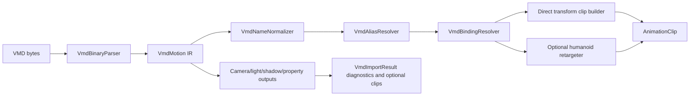

# VMD Animation Import Design

[<- Architecture index](../README.md)

Last Updated: 2026-06-12
Owner: Animation
Status: Proposed

This document converts the VMD research notes into an implementation plan for
loading MikuMikuDance `.vmd` motion data into XRENGINE animation assets.

The engine already has a low-level VMD parser under `XREngine.Data/MMD/VMD`
and an existing `.vmd` path in `AnimationClip.Load3rdParty` /
`AnimationClip.LoadFromVMD`. That path is useful as a prototype, but it is too
tightly coupled to `AnimationClip`, rewrites source names during parse, only
partially imports VMD sections, and uses an approximate Bezier-to-keyframe
conversion. The target design is a dedicated importer stack that preserves VMD
semantics first, then emits runtime clips deliberately.

## Goals

- Preserve standard VMD data as a structural intermediate representation before
  any XRENGINE-specific binding or retargeting.
- Support source-rig playback through direct bind-relative transform tracks as
  the first reliable output.
- Add optional humanoid retargeting after direct import is stable.
- Route morphs through blend shape method channels, not humanoid muscle
  channels.
- Route IK goal motion through the current `HumanoidIKSolverComponent`
  animated-goal API where possible.
- Keep camera, light, self-shadow, and property/IK-state data available even
  when model animation is the first supported runtime output.
- Make malformed, truncated, or nonstandard files visible through diagnostics
  instead of silent partial success.
- Avoid per-frame allocation in imported clip playback.

## Non-Goals

- Do not treat VMD as a self-contained avatar format. The file is name-keyed
  motion data and does not contain the source skeleton or bind pose.
- Do not convert directly from VMD bone frames to humanoid muscle values as the
  primary import path.
- Do not hide unsupported camera, light, self-shadow, or IK-state playback
  behind silent drops.
- Do not implement MikuMikuMoving `.mvd` in this work. MVD should be a separate
  importer because it has a different format and text-encoding model.
- Do not keep parser-level Japanese-to-English substitution as the binding
  mechanism.

## Current State

The relevant files today are:

| Area | Existing files | Current behavior |
| --- | --- | --- |
| VMD parser | `XREngine.Data/MMD/VMD/VMDFile.cs`, `VMDHeader.cs`, `AnimationBase.cs`, frame-key classes | Reads VMD sections into parser objects. Bone frames apply Z inversion and MMD-to-meter scaling during load. |
| Name handling | `XREngine.Data/MMD/VMD/VMDUtils.cs`, `AnimationBase.cs`, `PropertyFrameKey.cs` | Decodes Shift-JIS and immediately rewrites recognized names through `VMDUtils.JP2EN`. |
| Clip import | `XREngine.Animation/Property/Core/AnimationClip.cs` | `.vmd` loads directly into an `AnimationClip` member tree. Bone tracks become bind-relative transform method channels. Shape keys are currently not wired. |
| Unity clip import | `XREngine.Animation/Importers/UnityAnimImporter.cs` | Has a richer clip-member builder pattern for transforms, blend shapes, humanoid values, root motion, and animated IK goal channels. |
| Runtime playback | `XREngine.Runtime.AnimationIntegration/Scene/Components/Animation/AnimationClipComponent.cs` | Plays `AnimationClip` member trees and applies runtime remaps for humanoid muscles and animated IK goal methods. |
| Humanoid/IK | `HumanoidComponent.cs`, `AvatarHumanoidProfileBuilder.cs`, `HumanoidIKSolverComponent.cs` | Provides muscle-value application, profile-based avatar mapping, root motion APIs, and animated IK goal APIs. |

The most important current gaps are:

- `VMDHeader` only accepts `Vocaloid Motion Data 0002`.
- `VMDFile.Load` catches `EndOfStreamException` and continues without a
  structured warning.
- `VMDFile.MaxFrameCount` only considers bone and shape-key sections.
- Parser save paths pad fixed-length text fields by character count instead of
  encoded byte count.
- `AnimationBase<T>` and `PropertyFrameKey` replace source names during parse.
- Camera interpolation remains raw, and camera/light basis conversion is not
  explicit.
- `AnimationClip.LoadFromVMD` is a monolithic importer inside the asset type.
- Morph import is commented out.
- IK detection depends on rewritten English names and `Contains("IK")`
  heuristics.

## Design Invariants

- VMD parsing is structural. It records bytes, decoded text, frame numbers,
  section data, interpolation data, and diagnostics without choosing runtime
  targets.
- Name decoding, name normalization, alias resolution, and scene binding are
  separate stages.
- Direct-transform output is authoritative for source-compatible rigs.
- Humanoid output is derived from canonical bone tracks plus target avatar
  profile data.
- VMD bone rotations use scalar-eased quaternion slerp. They must not be
  imported by independently Bezier-interpolating quaternion components.
- Imported runtime channels should use the same member shapes as other importers
  where possible, especially for blend shapes and animated IK goals.
- Unsupported sections produce import diagnostics with section, frame, and name
  context when available.
- Any imported `XRBase` mutation paths added during implementation must use
  `SetField(...)`.

## Pipeline



The parser should continue to live in `XREngine.Data/MMD/VMD`, but the
high-level importer should move to `XREngine.Animation/Importers/Vmd`.
`AnimationClip.Load3rdParty(".vmd")` should become a thin wrapper around the
new importer so existing asset-loading entry points keep working.

## Parser Layer

Add explicit load results and options rather than returning only a populated
`VMDFile`.

Suggested types:

```csharp
public sealed record VmdLoadOptions(
    bool AllowNonstandardUtf8Fallback = false,
    bool AllowTruncatedOptionalTailSections = true);

public sealed record VmdLoadResult(
    VmdMotion Motion,
    IReadOnlyList<VmdDiagnostic> Diagnostics);

public sealed record VmdDiagnostic(
    VmdDiagnosticSeverity Severity,
    string Code,
    string Message,
    string? Section = null,
    uint? Frame = null,
    string? SourceName = null);
```

Parser work:

- Accept both standard signatures:
  - `Vocaloid Motion Data file` with a 10-byte model name field.
  - `Vocaloid Motion Data 0002` with a 20-byte model name field.
- Decode fixed-length strings as Shift-JIS by default.
- Keep the original fixed-length byte slice for names.
- Normalize decoded names without applying target aliases.
- Provide an opt-in repair mode for nonstandard UTF-8-like names and emit a
  warning when that path is used.
- Replace silent `EndOfStreamException` handling with diagnostics. Missing
  optional tail sections may be allowed; truncated records inside a section
  should be an error.
- Compute duration across all loaded sections.
- Fix save padding to use encoded byte length, not `.Length` on the string.
- Guard section counts and record sizes against obviously corrupt files before
  allocating large structures.

The existing parser classes can be kept as compatibility containers during the
transition, but the new importer should consume a `VmdMotion` representation
that does not rely on dictionary keys being rewritten English names.

## Intermediate Representation

`VmdMotion` should preserve the source and expose conversion-ready tracks.

Suggested shape:

```csharp
public sealed record VmdMotion(
    VmdMetadata Metadata,
    IReadOnlyList<VmdNamedTrack<VmdBoneFrame>> Bones,
    IReadOnlyList<VmdNamedTrack<VmdMorphFrame>> Morphs,
    IReadOnlyList<VmdCameraFrame> Cameras,
    IReadOnlyList<VmdLightFrame> Lights,
    IReadOnlyList<VmdSelfShadowFrame> SelfShadows,
    IReadOnlyList<VmdPropertyFrame> Properties,
    uint MaxFrame,
    float DurationSeconds);

public sealed record VmdDecodedName(
    byte[] RawBytes,
    string DecodedText,
    string NormalizedText,
    VmdTextEncoding Encoding,
    bool UsedRepairFallback);
```

Bone frames should retain source-space values and decoded interpolation data.
The basis/unit conversion should be a named conversion step in the importer,
not hidden inside name parsing. During transition, `BoneFrameKey` may continue
to expose the current engine-space values for legacy code, but the new pipeline
should have tests that define the conversion explicitly.

## Name Resolution

Use a three-stage name model:

| Stage | Responsibility | Example output |
| --- | --- | --- |
| Decode | Convert fixed bytes to text and preserve raw bytes | original Shift-JIS decoded name |
| Normalize | Trim nulls, normalize Unicode forms, normalize whitespace and width variants | stable comparison key |
| Resolve | Map normalized VMD names to engine concepts or scene paths | `Humanoid.Hips`, `IK.LeftFootGoal`, direct node path |

The existing constants and `VMDUtils.JP2EN` dictionary are useful seed data,
but the dictionary should not run in the parser. Move aliasing into resolver
types such as:

- `VmdBoneAliasMap`
- `VmdMorphAliasMap`
- `VmdIkAliasMap`
- `VmdNodeBindingMap`

The root-control names represented by `VMDUtils.Mother`, `VMDUtils.Groove`,
`VMDUtils.Center`, `VMDUtils.Waist`, and `VMDUtils.LowerBody` need explicit
policy. Do not hard-bind them to generic names such as `Armature` or
`RootNode` during parse. The import options should choose whether these tracks
stay as direct node tracks, contribute to root motion, drive hips, or split
across those destinations.

## Clip Output Strategy

### Direct Transform Clip

Direct transform import is phase-one runtime support. It should target
source-compatible rigs and preserve extra MMD controller bones when matching
nodes exist.

Policy:

- Bind known bone tracks to explicit node paths when `VmdNodeBindingMap` supplies
  a path.
- Otherwise use cached `FindDescendantByName` member lookup with the resolved
  target name.
- Use bind-relative transform channels for VMD bone motion because VMD motion is
  authored relative to the model bind pose.
- Preserve unmapped non-humanoid tracks in diagnostics and optionally emit them
  to same-name direct node bindings.
- Set `AnimationClip.SampleRate` to the source/import sampling rate and record
  authored frame indices on keyframes or baked samples.

The current `AnimationClip.LoadFromVMD` behavior can be used as a baseline, but
the new implementation should move the member-tree construction into a shared
builder rather than keeping VMD-specific tree assembly inside `AnimationClip`.

### Shared Clip Builder

Extract the reusable member-building logic from
`XREngine.Animation/Importers/UnityAnimImporter.cs` into a shared builder, for
example `AnimationClipMemberBuilder`.

The builder should expose methods for:

- direct transform scalar channels,
- bind-relative transform channels,
- blend shape method channels via `ModelComponent.SetBlendShapeWeightNormalized`,
- humanoid value channels via `HumanoidComponent.SetImportedRawValue`,
- root motion channels via `HumanoidComponent.SetRootPosition*` and
  `SetRootRotation*`,
- animated IK goal channels via `HumanoidIKSolverComponent.SetAnimatedIKPosition*`
  and `SetAnimatedIKRotation*`.

VMD should use the animated IK goal methods rather than the older
`SetIKPosition*`/`SetIKRotation` methods currently used in
`AnimationClip.LoadFromVMD`, because `AnimationClipComponent` already has
runtime remap support and tests around the animated method names.

### Morph Clip

VMD morph frames should route to blend shape channels:

```csharp
builder.AddBlendshapeAnimation(
    nodePath,
    blendShapeName,
    BuildFloatAnimation(track, normalizedInput: true));
```

The morph resolver must support one VMD morph name binding to multiple mesh
blend shapes. Unresolved morphs are warnings, not silent drops.

### IK And Property Frames

VMD has two IK-related streams:

- Bone transform tracks for IK goals such as foot or toe controllers.
- Property frames with enable/disable state for named IK channels.

IK goal bone tracks should map to `HumanoidIKSolverComponent` animated goal
position and rotation channels when a compatible solver goal exists. Property
IK toggles should map to solver enable state or animated position/rotation
weights after the solver API exposes a suitable runtime method. Until then,
property IK toggles should be preserved in `VmdImportResult` diagnostics and
metadata rather than discarded.

### Humanoid Retargeted Clip

Humanoid retargeting is optional and should be implemented after direct import
and interpolation are stable.

Retargeting needs:

- source bind pose or a source model context,
- canonical VMD bone interpretation,
- target avatar profile from `AvatarHumanoidProfileBuilder`,
- root/center/groove/hips split policy,
- per-bone basis conversion and target-space delta computation.

Retargeted output may use direct target bone transforms, root motion methods,
humanoid muscle channels, or a mixture. Muscle-channel output should be a
deliberate export mode, not the default representation.

### Camera, Light, And Shadow Outputs

Camera, light, and self-shadow sections should be parsed into `VmdImportResult`
even before runtime playback is fully supported.

Initial policy:

- Produce separate optional result objects such as `VmdCameraClip`,
  `VmdLightClip`, and `VmdSelfShadowTrack`.
- Decode camera interpolation into named curves rather than keeping the raw
  24-byte payload at conversion time.
- Apply explicit basis conversion to camera locations and light directions.
- Mark runtime playback unsupported with diagnostics until target components and
  binding APIs are selected.

## Interpolation

VMD bone interpolation is not the same as Unity tangent interpolation. Each
bone segment carries:

- one cubic Bezier easing curve for X translation,
- one cubic Bezier easing curve for Y translation,
- one cubic Bezier easing curve for Z translation,
- one cubic Bezier easing curve for quaternion slerp.

Preferred implementation:

- Add native segment interpolation support for VMD-style Bezier spans in the
  property animation system.
- For quaternion spans, evaluate the scalar Bezier easing value and then use
  `Quaternion.Slerp(start, end, easedT)`.
- For vector spans, evaluate each axis with its own easing curve.

Acceptable first implementation:

- Deterministically bake VMD tracks at an import-configured sample rate.
- Use the same evaluation rules as `BoneFrameKey.InterpolateTo`.
- Preserve authored frame metadata so later tooling can trace samples back to
  source frames.
- Do not bake by interpolating quaternion components independently.

The current `AnimationClip.BezierCurveToControlPoints` helper should be treated
as a compatibility approximation. It should not be the final fidelity target.

## Proposed Files

Parser/data layer:

- `XREngine.Data/MMD/VMD/VmdLoadOptions.cs`
- `XREngine.Data/MMD/VMD/VmdLoadResult.cs`
- `XREngine.Data/MMD/VMD/VmdDiagnostic.cs`
- `XREngine.Data/MMD/VMD/VmdDecodedName.cs`
- `XREngine.Data/MMD/VMD/VmdNameNormalizer.cs`
- updates to `VMDHeader.cs`, `VMDFile.cs`, `AnimationBase.cs`,
  `PropertyFrameKey.cs`, and save padding in fixed-name writers

Animation importer layer:

- `XREngine.Animation/Importers/AnimationClipMemberBuilder.cs`
- `XREngine.Animation/Importers/Vmd/VmdAnimationImporter.cs`
- `XREngine.Animation/Importers/Vmd/VmdImportOptions.cs`
- `XREngine.Animation/Importers/Vmd/VmdImportResult.cs`
- `XREngine.Animation/Importers/Vmd/VmdMotion.cs`
- `XREngine.Animation/Importers/Vmd/VmdBasisConverter.cs`
- `XREngine.Animation/Importers/Vmd/VmdBoneAliasMap.cs`
- `XREngine.Animation/Importers/Vmd/VmdMorphAliasMap.cs`
- `XREngine.Animation/Importers/Vmd/VmdHumanoidRetargeter.cs`
- `XREngine.Animation/Importers/Vmd/VmdBezierBaker.cs` or native Bezier span
  types if the property animation system gains direct support

Compatibility layer:

- update `AnimationClip.Load3rdParty(".vmd")` to call `VmdAnimationImporter`
- keep `AnimationClip.LoadFromVMD(VMDFile)` temporarily as a wrapper or mark it
  obsolete after tests cover the new path

## Import Options

Suggested options:

```csharp
public sealed record VmdImportOptions
{
    public float FramesPerSecond { get; init; } = 30.0f;
    public float UnitScale { get; init; } = VMDUtils.MMDUnitsToMeters;
    public VmdInterpolationMode InterpolationMode { get; init; } =
        VmdInterpolationMode.BakeDeterministically;
    public VmdOutputMode OutputMode { get; init; } = VmdOutputMode.DirectTransform;
    public VmdRootMotionPolicy RootMotionPolicy { get; init; } =
        VmdRootMotionPolicy.KeepAsDirectTracks;
    public VmdUnsupportedSectionPolicy UnsupportedSectionPolicy { get; init; } =
        VmdUnsupportedSectionPolicy.Warn;
    public VmdTextDecodeOptions TextDecoding { get; init; } = new();
    public VmdBoneAliasMap BoneAliases { get; init; } = VmdBoneAliasMap.Default;
    public VmdMorphAliasMap MorphAliases { get; init; } = VmdMorphAliasMap.Default;
}
```

`VmdImportResult` should include:

- primary model `AnimationClip`,
- optional humanoid-retargeted `AnimationClip`,
- optional camera/light/shadow tracks,
- parser and converter diagnostics,
- unresolved bone, morph, IK, camera, and light binding summaries,
- source metadata such as header version, model name, max frame, and duration.

## Implementation Phases

### Phase 0 - Baseline And Tests

- Add unit tests that capture current `.vmd` parser behavior with small synthetic
  files.
- Add tests for current `AnimationClip.LoadFromVMD` output shape before
  replacing it.
- Collect one or more known-good VMD samples for visual validation.

Acceptance criteria:

- Current behavior is documented by tests before the importer is moved.

### Phase 1 - Parser Hardening

- Add v1/v2 header support.
- Add load diagnostics and structured optional-tail handling.
- Remove parser-level alias replacement.
- Compute duration across all sections.
- Fix fixed-length text save padding.
- Add count/record-size validation.

Acceptance criteria:

- Parser tests cover v1 header, v2 header, Shift-JIS names, optional missing
  tail sections, truncated records, and duration from non-bone sections.

### Phase 2 - Shared Clip Builder

- Extract shared member-building APIs from the Unity animation importer.
- Update Unity importer tests to prove output stays equivalent.
- Add VMD-specific builder methods only when the generic builder cannot express
  bind-relative transform channels.

Acceptance criteria:

- Unity `.anim` import tests still pass and VMD importer code can construct
  transform, blend shape, root motion, humanoid, and IK method channels without
  duplicating tree-building logic.

### Phase 3 - Direct Transform VMD Import

- Implement `VmdAnimationImporter.Import`.
- Build direct bind-relative transform clips from VMD bone tracks.
- Preserve extra non-humanoid tracks when matching direct node bindings exist.
- Return diagnostics for unresolved names.
- Make `AnimationClip.Load3rdParty(".vmd")` call the new importer.

Acceptance criteria:

- A source-compatible rig can play a standard bone-only VMD through
  `AnimationClipComponent`.
- The old `.vmd` load entry point still works.

### Phase 4 - Interpolation Fidelity

- Add native VMD Bezier span support or deterministic baking.
- Validate midpoint and endpoint sampling against the VMD Bezier evaluator.
- Preserve authored frame indices and frame rate metadata.

Acceptance criteria:

- Sampled translation and rotation values match golden VMD segment evaluations
  within tight numeric tolerances.

### Phase 5 - Morphs And IK State

- Map shape-key frames to `SetBlendShapeWeightNormalized` method channels.
- Map IK bone tracks to animated IK goal channels.
- Add or choose a solver API for animated IK enable/weight state.
- Preserve property visibility and IK toggles even if playback support is
  partial.

Acceptance criteria:

- Morph-only files produce blend shape channels.
- Foot IK goal tracks use `SetAnimatedIKPosition*` and
  `SetAnimatedIKRotation*`.
- Unsupported IK toggles produce clear diagnostics.

### Phase 6 - Humanoid Retargeting

- Build canonical bone tracks from resolved VMD names.
- Use target avatar profile data from `AvatarHumanoidProfileBuilder`.
- Implement root/center/groove/hips split policies.
- Emit retargeted humanoid or target-bone clips as an explicit output mode.

Acceptance criteria:

- A standard MMD humanoid motion retargets to a mapped XRENGINE humanoid with
  pose snapshots inside position and angular tolerances.

### Phase 7 - Camera, Light, And Shadow Outputs

- Decode camera interpolation.
- Convert camera and light basis explicitly.
- Select runtime binding targets or keep output as structured import data.

Acceptance criteria:

- Camera/light/shadow-only files parse with correct duration and return
  structured outputs or diagnostics.

### Phase 8 - Documentation And Cleanup

- Update the animation developer guide with the new import path.
- Document import options and diagnostics.
- Remove or obsolete the legacy direct `AnimationClip.LoadFromVMD` tree assembly.

Acceptance criteria:

- Users can see which VMD sections are supported, partial, or unsupported, and
  the codebase has one primary VMD importer path.

## Validation Matrix

| Test case | File contents | Assertions |
| --- | --- | --- |
| `VmdParser_LoadsV2ShiftJisBoneFrames` | v2 header, bone frames, Bezier interpolation | counts, decoded names, max frame, source frame order |
| `VmdParser_LoadsLegacyV1Header` | v1 signature, 10-byte model name | header version and model name are correct |
| `VmdParser_ReportsTruncatedBoneRecord` | incomplete record after valid count | error diagnostic; no silent success |
| `VmdParser_ComputesDurationFromCameraOnlyFile` | camera section, no bones or morphs | duration uses camera frames |
| `VmdParser_DoesNotRewriteNamesDuringLoad` | known MMD bone names | original and normalized names remain separate from aliases |
| `VmdImporter_BuildsDirectBindRelativeClip` | center, hips, spine, limb tracks | member tree targets bind-relative transform methods |
| `VmdImporter_BakesBezierSegmentFaithfully` | two-key bone segment with non-linear curves | sampled midpoint matches VMD evaluator |
| `VmdImporter_MapsMorphsToBlendShapes` | morph-only frames | emits `SetBlendShapeWeightNormalized` channels |
| `VmdImporter_MapsFootIkBonesToAnimatedGoals` | foot IK tracks | emits animated IK position and rotation methods |
| `VmdImporter_WarnsForUnsupportedIkToggles` | property IK states | diagnostics include source name and frame |
| `VmdImporter_RetargetsStandardHumanoid` | standard MMD humanoid motion plus source context | target pose snapshots match tolerances |
| `VmdImporter_ReturnsCameraLightShadowOutputs` | camera, light, self-shadow sections | structured outputs or explicit unsupported diagnostics |

Run targeted validation:

```powershell
dotnet test .\XREngine.UnitTests\XREngine.UnitTests.csproj --filter "FullyQualifiedName~Vmd"
dotnet test .\XREngine.UnitTests\XREngine.UnitTests.csproj --filter "FullyQualifiedName~UnityAnimImporter"
dotnet build .\XREngine.Animation\XREngine.Animation.csproj
dotnet build .\XREngine.Editor\XREngine.Editor.csproj
```

For visual validation, use the Unit Testing World with a source-compatible MMD
model and compare sampled poses or viewport captures at fixed frames.

## Risks

- Coordinate conversion mistakes are easy to miss when a pose is roughly
  plausible. Golden numeric pose samples are required.
- Root, center, groove, and hips splitting is policy-heavy and may need multiple
  import modes.
- Humanoid retargeting cannot be correct from a VMD file alone; it needs source
  rig context.
- Some community files may contain nonstandard text encodings. Repair mode must
  warn and remain opt-in.
- Runtime binding through reflection member trees is flexible but easy to
  duplicate incorrectly. Shared builder tests should protect the channel shapes.
- Camera and light playback may require target component API work outside the
  animation importer.

## Open Questions

- Should native VMD Bezier support live in `PropAnim*` keyframes, or should the
  first production importer always bake VMD curves?
- What asset format should store `VmdImportOptions` for repeatable imports and
  cache variants?
- Which runtime component should own imported model visibility property frames?
- Should direct-transform VMD clips preserve untranslated source names as
  metadata on each track?
- How should MMD physics controllers interact with bones explicitly driven by
  imported VMD tracks?

## Summary

The implementation should replace the current one-off `AnimationClip.LoadFromVMD`
path with a staged importer:

1. Parse VMD structurally with diagnostics.
2. Normalize and resolve names without mutating parser keys.
3. Emit direct bind-relative transform clips first.
4. Add faithful VMD interpolation through native spans or deterministic baking.
5. Add morph, IK, and property support.
6. Add optional humanoid retargeting once source-rig semantics are explicit.

This keeps standard VMD playback reachable quickly while leaving a clean path to
retargeted humanoid clips and richer camera/light import later.
