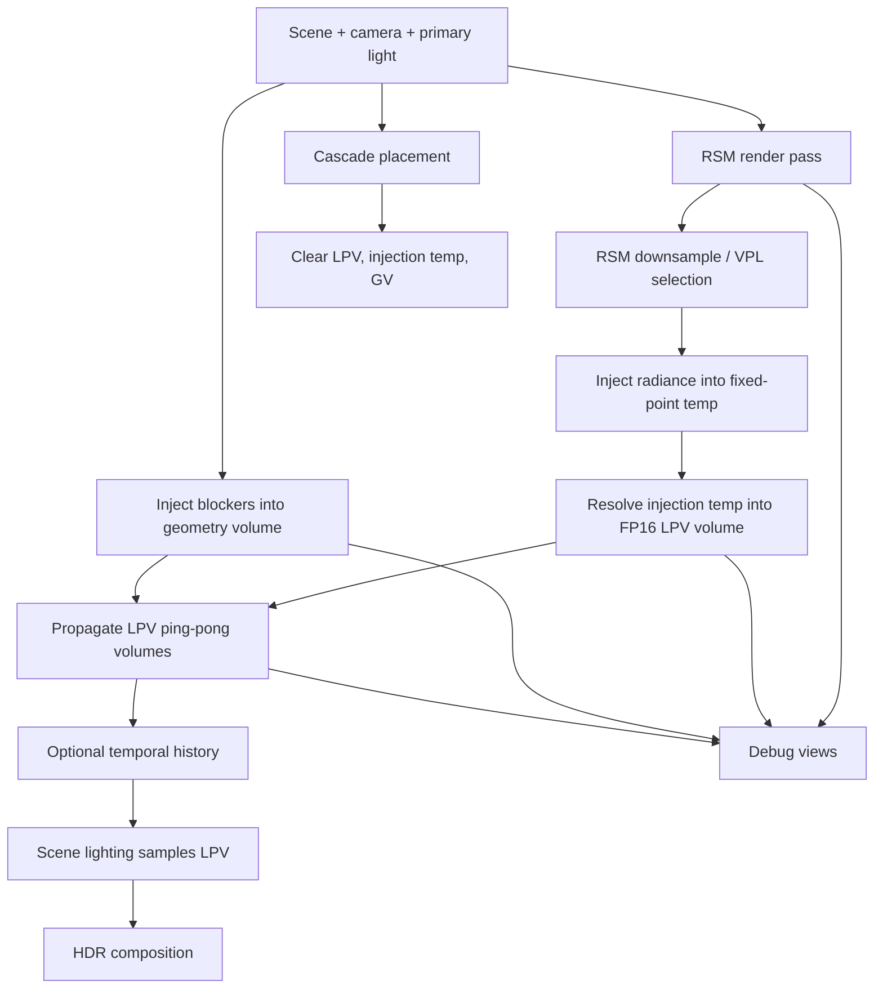

# Light Propagation Volumes Global Illumination Design

Status: Design proposal  
Target stage: pre-v1 rendering feature  
Primary backend target: OpenGL 4.6  
Secondary backend target: Vulkan, after the OpenGL path proves the feature shape  
Related docs:

- `docs/architecture/rendering/default-render-pipeline-notes.md`
- `docs/work/design/global-illumination/ddgi-integration-plan.md`
- `docs/work/design/global-illumination/neural irradiance volumes.md`
- `docs/work/design/global-illumination/vxao-implementation-plan.md`
- `docs/work/design/gpu-render-pass-pipeline.md`
- `docs/work/design/slang-shader-cross-compile-plan.md`
- `docs/work/design/dynamic-shadow-atlas-lod-plan.md`

## Purpose

This document rewrites the external LPV research report into an XRENGINE-specific design for integrating Light Propagation Volumes as a dynamic diffuse global illumination path.

LPV is not intended to replace every GI technique. It is a practical option for fully dynamic, low-frequency diffuse bounce lighting when the engine needs predictable real-time cost, compatibility with the current OpenGL renderer, and a path that can later be mapped cleanly onto Vulkan compute.

The recommended XRENGINE version is:

- Compute-first.
- Cascaded.
- L1 spherical-harmonics based.
- Geometry-volume augmented for coarse secondary occlusion.
- Temporally stabilized by snapped cascades and optional history blending.
- Integrated into the DefaultRenderPipeline as an optional dynamic diffuse GI feature.

## Executive decisions

| Area | Decision |
|---|---|
| First backend | OpenGL 4.6 compute path |
| Vulkan posture | Design resources and passes so Vulkan can mirror the OpenGL path later |
| Render path integration | Add LPV as a diffuse-indirect contribution inside HDR lighting composition |
| Initial light support | One primary directional light with RSM injection |
| Later light support | Budgeted top-N spot/point/hero-light injection |
| Cascade count | 4 cascades |
| Default cascade size | 32x32x32 cells |
| Higher-quality option | 48x48x48 cells, only behind a preset |
| SH order | L1, 4 coefficients |
| Radiance storage | RGBA16F logical LPV volumes after injection resolve |
| Injection accumulation | Signed 32-bit fixed-point temporary storage, resolved into FP16 LPV volumes |
| Propagation | 6-face gather kernel with ping-pong volumes |
| Propagation iterations | 6-8 default, 8-10 high quality |
| Occlusion | Injection bias first, then geometry volume plus derivative damping |
| Temporal behavior | One-cell cascade snapping first, history/reprojection later |
| Debugging | ImGui debug panel, RSM previews, LPV/GV slice views, cascade overlay, timings |
| Reference-code policy | Do not copy GPL-3.0 reference implementation code or shaders |

## Goals

- Provide dynamic diffuse GI for scenes where static lightmaps, probes, or baked data are not a good fit.
- Keep the first implementation compatible with XRENGINE's current Windows-first OpenGL baseline.
- Preserve a clean backend boundary so Vulkan can implement the same pass model with explicit descriptors and barriers.
- Avoid turning LPV into a monolithic renderer fork.
- Make the feature inspectable enough that artists and engine developers can diagnose leaks, bad injection, cascade popping, and SH sign mistakes.
- Keep hot paths allocation-free after resource initialization.

## Non-goals

- No hardware ray tracing dependency.
- No direct GPL-3.0 code or shader reuse from external LPV repositories.
- No first-pass support for all dynamic lights.
- No specular GI.
- No guarantee that LPV becomes the final high-quality GI solution for every content type.
- No compatibility layer for old internal APIs if cleaner pre-v1 architecture is available.

## Why LPV fits XRENGINE

XRENGINE is pre-v1, Windows-first, and currently treats OpenGL 4.6 as the primary rendering path while Vulkan and DX12 remain works in progress. LPV is attractive in that context because it can deliver fully dynamic diffuse bounce lighting without requiring hardware ray tracing or a mature Vulkan render graph.

LPV is also a good complement to the existing design work around DDGI and VXAO:

- DDGI is a better long-term probe-based solution for stable multi-bounce irradiance, but it needs more infrastructure for probe placement, relocation, validation, and content workflows.
- VXAO-style techniques are stronger for occlusion and voxelized scene reasoning, but they are not the same as dynamic diffuse light propagation.
- LPV can ship earlier as a dynamic GI mode for preview, gameplay, and editor iteration, provided its artifacts are visible and tunable.

The tradeoff is quality. LPV is low-frequency and prone to leaking through thin walls. It should be exposed as a controllable rendering feature, not treated as physically exact lighting.

## Clean-room and license posture

The source report references an LPV repository with a GPL-3.0 license. XRENGINE should treat that repository as a behavioral and algorithmic reference only.

Implementation rules:

- Do not copy source code.
- Do not copy shader code.
- Do not translate functions line-by-line.
- Re-derive the implementation from the published LPV concepts and this design.
- If any dependency, submodule, or third-party shader package is considered later, follow the repository dependency and license audit policy before merging it.

This is an engineering safety rule, not legal advice.

## Algorithm overview

LPV has four core stages:

1. Render a Reflective Shadow Map from the light.
2. Inject lit surfels from the RSM into a low-order SH radiance grid.
3. Propagate radiance through the grid for several iterations.
4. Sample the propagated radiance during scene shading and add it as diffuse indirect light.

XRENGINE should extend the classic flow with:

- Cascades for larger scene coverage.
- Geometry volumes for coarse secondary occlusion.
- Cascade snapping for temporal stability.
- Optional history blending after the static pass is correct.



## Engine integration point

LPV should integrate as a renderer-owned feature, not as a scene component that owns GPU resources.

Proposed runtime ownership:

| Type | Responsibility |
|---|---|
| `LpvSettings` | User-facing quality, cascade, debug, and budget settings |
| `LpvRenderer` | Owns LPV pass sequencing and backend calls |
| `LpvCascadeSet` | Computes cascade extents, snapping, blending ranges, and shader constants |
| `LpvResources` | Owns RSM, LPV, GV, temp, history, and debug GPU resources |
| `LpvShaderSet` | Resolves backend-specific shader programs and shared constants |
| `LpvDebugPanel` | ImGui debug controls and visualization entry points |

Suggested source layout:

```text
XREngine/
  Rendering/
    GlobalIllumination/
      Lpv/
        LpvSettings.cs
        LpvRenderer.cs
        LpvCascadeSet.cs
        LpvResources.cs
        LpvShaderSet.cs
        LpvDebugDraw.cs
```

Use the existing shader organization rather than introducing a new top-level shader root. LPV shader files should live beside the renderer's current OpenGL shader assets once the actual implementation begins.

## Renderer lifecycle

LPV resource creation should happen only when the renderer starts, the graphics backend changes, the quality preset changes, or the viewport/device resources are recreated.

Per-frame work should be allocation-free. The renderer should reuse:

- Cascade arrays.
- Dispatch constants.
- Draw packet lists.
- RSM atlas descriptors.
- Debug draw packet buffers.
- Timing query handles.

No LINQ, capturing lambdas, or heap allocation should appear in LPV render, collect-visible, fixed-update, or per-frame update paths.

## Settings model

Initial settings should be explicit and conservative.

```csharp
public enum LpvQualityPreset
{
    Off,
    Low,
    Medium,
    High,
    DebugReference,
}

public sealed class LpvSettings
{
    public LpvQualityPreset Quality { get; set; } = LpvQualityPreset.Off;
    public int CascadeCount { get; set; } = 4;
    public int CellsPerCascade { get; set; } = 32;
    public int PropagationIterations { get; set; } = 6;
    public bool EnableGeometryVolume { get; set; } = false;
    public bool EnableTemporalHistory { get; set; } = false;
    public bool EnableDebugViews { get; set; } = false;
    public float Intensity { get; set; } = 1.0f;
    public float InjectionBiasCells { get; set; } = 0.5f;
}
```

The implementation can place these settings in the existing renderer/editor preferences model if that is the current source of truth. If settings become user-visible through editor preferences, docs must be updated at the same time.

## Default quality presets

| Preset | Cascades | Cells | Iterations | GV | History | Intended use |
|---|---:|---:|---:|---|---|---|
| Off | 0 | 0 | 0 | No | No | Default until feature is stable |
| Low | 3 | 32 | 4 | No | No | Fast preview |
| Medium | 4 | 32 | 6 | Yes | No | First target preset |
| High | 4 | 48 | 8 | Yes | Yes | High-end desktop |
| DebugReference | 4 | 32 | 6 | Toggle | Toggle | FP32/debug validation path |

The first implementation should target `Medium` internally but keep the feature disabled by default until validation scenes and debug views exist.

## Reflective Shadow Map input

The first supported RSM source should be the primary directional light.

Required RSM outputs:

| Texture | Suggested format | Notes |
|---|---|---|
| Depth | Existing shadow depth format | Reuse compatible shadow infrastructure where possible |
| World position or reconstructable depth | RGBA16F or depth-derived reconstruction | Prefer reconstruction if the renderer already has stable light matrices |
| Normal | RGBA16F or packed normal | Must be world-space or consistently transformed |
| Flux/albedo response | RGBA16F | Represents reflected diffuse flux from directly lit surfels |

Implementation notes:

- Start with one directional light RSM.
- Use the existing shadow-map draw path where possible.
- Keep RSM resolution independent from LPV cell count.
- Add downsample or VPL selection before injection so raw RSM texel count does not dominate cost.
- Treat local-light RSMs as a later phase.

## Cascades

Use nested cascades centered around the camera, biased slightly forward along the view direction.

Rules:

- Cascade 0 covers the near field.
- Each next cascade covers a larger region at the same cell count.
- Cascade origins snap to one cell in world space.
- Shading samples the finest cascade containing the point.
- Cascade boundaries blend into the next cascade to avoid visible seams.
- Very small objects may be omitted from coarse cascade injection later, but not in the MVP.

Proposed initial cascade scale:

| Cascade | Relative coverage | Purpose |
|---|---:|---|
| 0 | 1x | Local contact-scale color bounce |
| 1 | 2x | Room/building-scale propagation |
| 2 | 4x | Large interior/outdoor mid-field |
| 3 | 8x | Coarse far-field diffuse influence |

The exact world sizes should be exposed as tuning data once representative XRENGINE scenes exist.

## Spherical harmonics layout

LPV should encode directional diffuse radiance using L1 spherical harmonics: four coefficients per color channel.

Logical cell layout:

```text
LPV_R[cascade][x,y,z] = float4(R_SH0, R_SH1, R_SH2, R_SH3)
LPV_G[cascade][x,y,z] = float4(G_SH0, G_SH1, G_SH2, G_SH3)
LPV_B[cascade][x,y,z] = float4(B_SH0, B_SH1, B_SH2, B_SH3)
GV   [cascade][x,y,z] = float4(blocker_SH0..blocker_SH3)
```

This layout is simple for propagation and shading. It also keeps coefficient order explicit, which is important because SH sign/order errors are easy to introduce and hard to see without debug tooling.

## Injection accumulation layout

Final LPV storage should be FP16, but initial injection needs many RSM samples to contribute to the same cells. Portable floating-point image atomics are not a safe baseline across OpenGL and Vulkan.

Use a separate fixed-point injection accumulator:

```text
InjectionTemp_R: R32I 3D image or buffer, 4 coefficients per cell
InjectionTemp_G: R32I 3D image or buffer, 4 coefficients per cell
InjectionTemp_B: R32I 3D image or buffer, 4 coefficients per cell
```

Injection pass:

1. Convert each VPL contribution into L1 SH RGB coefficients.
2. Scale each coefficient by a fixed factor.
3. Atomically add into signed 32-bit temporary storage.
4. Track overflow or saturation in debug builds.

Resolve pass:

1. Convert fixed-point values back to float.
2. Apply exposure/intensity scaling.
3. Write final values into RGBA16F LPV source volumes.

This keeps the propagation and lighting passes clean while avoiding a dependency on non-portable floating-point atomics. A later optimization can replace this with binning or subgroup reductions if profiling proves injection is the bottleneck.

## GPU resources

Per renderer, LPV needs:

| Resource | Count | Format | Lifetime |
|---|---:|---|---|
| RSM depth | Per active LPV light | Existing depth format | Recreated with RSM resolution |
| RSM normal | Per active LPV light | RGBA16F or packed | Recreated with RSM resolution |
| RSM flux | Per active LPV light | RGBA16F | Recreated with RSM resolution |
| Injection temp | 3 colors x 4 coeff groups x cascades | R32I | Recreated with cascade settings |
| LPV ping | 3 colors x cascades | RGBA16F | Recreated with cascade settings |
| LPV pong | 3 colors x cascades | RGBA16F | Recreated with cascade settings |
| LPV history | 3 colors x cascades | RGBA16F | Only when history is enabled |
| GV | Cascades | RGBA16F or R16F/RGBA16F | Only when GV is enabled |
| Debug readback/counters | Small buffers | UInt/R32I | Debug only |

Prefer one texture array or one atlas-style allocation per class if the current renderer supports it cleanly. Otherwise, keep per-cascade resources explicit for the first implementation and collapse them later.

## Pass graph

The first implementation should use fixed pass ordering before any more ambitious render-graph refactor.

| Order | Pass | Backend kind | Notes |
|---:|---|---|---|
| 1 | Cascade placement | CPU | Updates snapped bounds and constants |
| 2 | RSM render | Graphics | Directional light only |
| 3 | RSM downsample/VPL selection | Compute | Optional at first if RSM resolution is low |
| 4 | Clear injection temp, LPV, GV | Compute | Avoid per-resource CPU clears |
| 5 | Radiance injection | Compute | Fixed-point atomics |
| 6 | Injection resolve | Compute | Fixed-point to RGBA16F LPV source |
| 7 | GV injection | Compute or graphics-derived compute | Can ship after radiance MVP |
| 8 | Propagation iterations | Compute | 6-face gather ping-pong |
| 9 | Temporal history | Compute | Later phase |
| 10 | Scene lighting sample | Graphics/lighting shader | Adds diffuse indirect in HDR |
| 11 | Debug extraction | Compute/graphics | Debug only |

## Propagation design

Use a 6-face gather kernel.

For each cell:

1. Read six axial neighbors from the source LPV volume.
2. Evaluate directional transfer into the current cell.
3. Apply propagation scale and damping.
4. Apply GV attenuation if enabled.
5. Write the result into the destination volume.
6. Swap source/destination for the next iteration.

Avoid scatter propagation for the first implementation. Scatter requires write contention handling and is more fragile across APIs.

## Geometry volume design

The geometry volume stores coarse blocker information in the same cascade space as the LPV, with a half-cell offset from LPV cell centers.

MVP:

- Start without GV until basic radiance injection, propagation, and shading are correct.
- Add normal-biased injection to reduce self-lighting.
- Add derivative damping or simple wall-thickness damping before full GV if needed.

Production target:

- Inject coarse blocker SH into GV.
- Sample GV during propagation to attenuate transport through blockers.
- Provide a GV slice viewer in the editor.
- Include half-cell alignment tests.

GV is the most important mitigation for LPV light leaking, but it should not block the first visual prototype.

## Scene lighting integration

LPV contributes only to diffuse indirect lighting.

Composition should happen before tone mapping:

```text
HDR =
    directDiffuse
  + directSpecular
  + lpvIntensity * lpvDiffuseIndirect
  + emissive
  + otherIndirectTerms
```

Rules:

- Do not multiply LPV over direct specular.
- Do not use LPV for glossy reflections.
- If SSAO or another ambient occlusion term is used, apply it only where it is conceptually valid for diffuse indirect.
- Blend LPV with existing probes or ambient terms carefully to avoid double lighting.

The lighting shader samples the finest cascade that contains the shaded world position, blends near cascade edges, evaluates the SH field against the surface normal, and adds the resulting irradiance to diffuse lighting.

## OpenGL backend plan

The OpenGL path is the first shipping target.

OpenGL requirements:

- OpenGL 4.6 context.
- Compute shader support.
- 3D image load/store.
- Integer image atomics for injection temp.
- Texture/image barriers between clear, inject, resolve, propagate, and shade.

OpenGL implementation notes:

- Prefer compute for clear, inject, resolve, propagate, and debug extraction.
- Use graphics only for RSM rendering and final scene lighting.
- Use object labels for all LPV textures, buffers, and programs.
- Centralize memory-barrier calls in backend helpers.
- Keep one debug mode that can switch LPV storage to FP32 if practical.

Barrier examples by intent:

| Transition | Required intent |
|---|---|
| Clear -> inject | Shader image writes visible to shader image reads/writes |
| Inject -> resolve | Atomic image writes visible to resolve shader reads |
| Resolve -> propagate | LPV image writes visible to propagation reads |
| Propagate iteration N -> N+1 | Ping-pong write visible to next compute read |
| Propagate -> lighting | Compute writes visible to texture sampling |

Do not scatter raw `glMemoryBarrier` calls throughout feature code. Put them behind named backend operations so Vulkan can mirror the same logical transitions later.

## Vulkan backend plan

Vulkan should implement the same pass graph once the OpenGL feature shape is validated.

Vulkan requirements:

- Storage images for injection temp and LPV volumes.
- Descriptor layouts that separate stable LPV resources from per-frame constants.
- Explicit image layouts and sync2 barriers.
- Format declarations that exactly match shader image views.

Vulkan implementation notes:

- Keep RSM as graphics.
- Keep injection, resolve, propagation, GV, history, and debug extraction as compute.
- Use per-frame descriptor sets for transient resources.
- Keep persistent descriptor sets for stable LPV volume bindings when possible.
- Transition propagated LPV images from compute-write usage to shader-read usage before scene lighting.

Vulkan should not drive the initial design into unnecessary abstraction. The important part is to avoid OpenGL-only assumptions in resource naming, format choice, and pass ordering.

## Shader organization

Use backend-specific wrappers with shared math where possible.

Suggested organization:

```text
Shaders/
  Common/
    lpv_sh.glsl
    lpv_constants.generated.glsl
  OpenGL/
    lpv_clear.comp.glsl
    lpv_inject.comp.glsl
    lpv_resolve.comp.glsl
    lpv_propagate.comp.glsl
    lpv_history.comp.glsl
    lpv_debug_slice.frag.glsl
  Vulkan/
    lpv_clear.comp.glsl
    lpv_inject.comp.glsl
    lpv_resolve.comp.glsl
    lpv_propagate.comp.glsl
```

If the shader cross-compile plan moves the engine toward Slang or HLSL later, LPV should follow that direction. Do not make LPV the first place where an unproven shader toolchain becomes mandatory.

## Editor and debug tooling

LPV should not be considered usable until it has editor-facing debug views.

Required ImGui controls:

- Enable/disable LPV.
- Quality preset.
- Cascade count.
- Cell count.
- Propagation iterations.
- Intensity.
- Injection bias.
- Toggle GV.
- Toggle history.
- Select debug visualization.

Required visualizations:

| View | Purpose |
|---|---|
| RSM depth | Verifies light-space coverage |
| RSM normal | Finds invalid normal transforms |
| RSM flux | Shows injected light source quality |
| LPV slice | Validates injection and propagation |
| GV slice | Validates blocker coverage and half-cell alignment |
| Cascade bounds | Shows placement, snapping, and blending |
| Dominant SH direction | Catches coefficient sign/order mistakes |
| Leak heatmap | Shows where damping/GV matters |
| Timing panel | Tracks RSM, injection, propagation, lighting cost |
| Saturation counters | Detects fixed-point overflow or FP16 clipping |

Debug views should work in the ImGui editor first. Native UI integration can come later.

## Unit and scene validation

Add focused tests in `XREngine.UnitTests/` when implementation begins.

Unit-level targets:

- SH basis evaluation.
- SH lobe encode/decode sanity.
- Fixed-point injection conversion and saturation.
- Cascade snapping.
- World-to-cell and cell-to-world transforms.
- Cascade boundary blending.
- GV half-cell offset.
- Propagation ping-pong indexing.

Scene-level targets:

| Scene | Validates |
|---|---|
| Cornell-box-style room | Color bounce and propagation stability |
| Thin-wall test | Leakage and GV/damping effectiveness |
| Large atrium | Cascade coverage and transition blending |
| Outdoor sun scene | Directional RSM and broad diffuse bounce |
| Moving door/blocker | Dynamic GV and history rejection |
| Moving sun | RSM update and temporal stability |

Use Unit Testing World toggles for repeatable scene validation once the feature reaches that stage. If new settings are added to `Assets/UnitTestingWorldSettings.jsonc`, regenerate the schema and mirrored server settings through the existing tooling.

## Profiling targets

Instrument each stage independently.

Counters:

- RSM GPU time.
- RSM draw count.
- VPL/downsample compute time.
- Injection compute time.
- Injection saturation count.
- Resolve compute time.
- Per-iteration propagation time.
- Total propagation time.
- GV injection time.
- Scene-lighting LPV sample cost.
- Total LPV memory footprint.
- Cascade history rejection rate, once history exists.

Initial performance budget should be conservative:

| Preset | Target GPU cost |
|---|---:|
| Low | <= 1.5 ms |
| Medium | <= 3.0 ms |
| High | <= 5.0 ms |

These are target budgets, not promises. They should be revised after representative XRENGINE scenes are captured.

## Implementation roadmap

### Phase 0: spec and scaffolding

- Add design-approved settings types.
- Add empty renderer feature hooks.
- Add shader/resource naming conventions.
- Add debug panel skeleton with disabled controls.
- Add unit tests for cascade placement and SH math.

### Phase 1: OpenGL MVP

- Render directional-light RSM.
- Allocate LPV resources.
- Clear LPV and injection temp resources on GPU.
- Inject RSM flux into fixed-point temp.
- Resolve temp into FP16 LPV source volumes.
- Propagate with 6-face gather.
- Sample LPV in lighting as diffuse indirect.
- Add LPV slice debug view.

### Phase 2: quality baseline

- Add four cascades.
- Add cascade snapping and boundary blending.
- Add injection bias tuning.
- Add timing instrumentation.
- Add RSM flux/normal/depth debug views.
- Add thin-wall and Cornell-box validation scenes.

### Phase 3: occlusion and stability

- Add GV injection.
- Add GV slice debug view.
- Add propagation attenuation from GV.
- Add derivative/light-leak damping.
- Add optional temporal history and rejection.
- Add temporal delta debug visualization.

### Phase 4: Vulkan parity

- Mirror LPV resources as Vulkan images/descriptors.
- Implement Vulkan compute passes.
- Add sync2 barriers matching the logical OpenGL transitions.
- Validate storage-image formats and descriptor limits.
- Match OpenGL debug outputs.

### Phase 5: production hardening

- Add local hero-light injection budget.
- Add quality presets.
- Add content authoring guidance.
- Add docs for any user-facing settings.
- Add regression scenes to the standard validation workflow.
- Decide whether LPV remains an optional feature or graduates into a default GI preset.

## Risks and mitigations

| Risk | Likelihood | Impact | Mitigation |
|---|---|---|---|
| Thin-wall light leaking | High | High | Injection bias, derivative damping, GV, dedicated thin-wall scenes |
| Temporal popping from cascade movement | High | High | One-cell snapping, stable bounds, boundary blending, history rejection |
| Fixed-point overflow during injection | Medium | Medium | Debug counters, conservative scale, FP32 debug path |
| Shader duplication across backends | Medium | Medium | Shared SH math and generated constants |
| Vulkan descriptor/layout bugs | Medium | High | Backend-neutral pass model, explicit format table, sync helpers |
| Over-budget propagation cost | Medium | High | 32x32x32 default, preset limits, per-stage timestamps |
| Double-counted indirect light | Medium | Medium | Clear composition rules with probes/AO/direct lighting |
| Reference-repo license confusion | Medium | High | Clean-room implementation rule |

## Open questions

- Which existing renderer settings object should own LPV preferences?
- Should the first RSM reuse shadow-map infrastructure directly or use an LPV-specific light pass?
- Which debug scene should become the canonical Cornell-box-style validation map?
- Should LPV ship as a separate dynamic-GI mode beside DDGI, or should both be hidden behind one future global-illumination settings model?
- Does the engine's eventual shader toolchain favor native GLSL, Slang, or HLSL for the Vulkan path?

## Recommended next step

The next actionable step is not to implement the full feature. It is to create a short LPV task plan from this design, beginning with an isolated branch and ending with merge-back validation, then implement Phase 0 and Phase 1 only.
