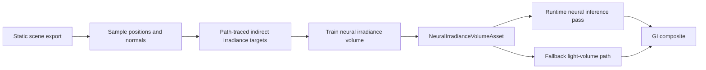
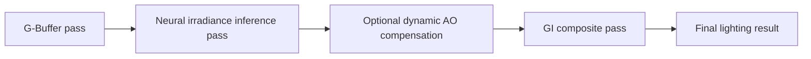

# Neural Irradiance Volume Implementation Plan

Last Updated: 2026-03-20
Status: design
Scope: add a baked neural irradiance volume GI mode to XRENGINE for mostly static scenes, with runtime inference from the G-Buffer and explicit fallback to existing baked GI modes.

Related docs:

- `docs/features/gi/global-illumination.md`
- `docs/features/gi/light-volumes.md`
- `docs/features/gi/radiance-cascades.md`
- `vxao-implementation-plan.md`

---

## 1. Executive Summary

Neural irradiance volumes should enter XRENGINE as a new baked or hybrid GI mode for mostly static worlds, not as a replacement for the engine's dynamic GI systems.

The right product position is narrow and explicit:

- diffuse indirect lighting only
- trained offline from static scene state
- sampled at runtime from the G-Buffer in a compute pass
- supported by a conventional fallback asset such as an irradiance volume texture

This mode should sit between existing light volumes and more expensive dynamic GI paths:

- better memory-quality scaling than conventional baked probe or volume data
- cheaper runtime than ray-traced or surface-cache neural GI
- less physically complete than Surfel GI, ReSTIR GI, or any method that actually re-solves dynamic light transport

Recommended delivery sequence:

1. add a new GI mode and asset/component scaffolding
2. support fallback rendering through a conventional 3D irradiance texture
3. build the offline bake and training toolchain
4. add runtime neural inference and half-resolution support
5. add debug views, dynamic AO compensation, and limited conditioning later

---

## 2. Current Reality

### 2.1 Relevant Engine Seams

The most relevant existing systems are:

- `docs/features/gi/global-illumination.md`
- `docs/features/gi/light-volumes.md`
- `docs/features/gi/radiance-cascades.md`
- `XRENGINE/Scene/Components/Lights/LightVolumeComponent.cs`
- `XRENGINE/Rendering/Pipelines/Types/DefaultRenderPipeline.cs`
- `XRENGINE/Rendering/Pipelines/Types/DefaultRenderPipeline2.cs`
- `XRENGINE/Engine/Subclasses/Rendering/Engine.Rendering.SecondaryContext.cs`

### 2.2 What Already Exists

- XRENGINE already supports multiple GI modes with explicit engine-level selection.
- `LightVolumeComponent` already represents a baked 3D irradiance texture plus transform and bounds.
- `RadianceCascadeComponent` already establishes the pattern for compute-driven baked GI sampling from the G-Buffer.
- The renderer already has a concept of secondary rendering work for probe or irradiance updates outside the main frame budget.
- The project already distinguishes baked, hybrid, and real-time GI rather than forcing one GI system to solve every case.

### 2.3 What Is Missing

- No `NeuralIrradianceVolume` GI mode.
- No neural irradiance asset format.
- No trainer or bake tool that exports scene samples and optimizes a model.
- No runtime pass that performs batched inference against G-Buffer position and normal.
- No debug tooling to compare neural GI against existing light volumes or radiance cascades.

### 2.4 Consequence For Design

This feature should be treated as a new baked GI asset family with a compute resolve pass. It should not be bolted onto the current `LightVolumeComponent` as a hidden special case.

---

## 3. Product Position

Recommended product position:

- Neural irradiance volume is a baked or hybrid GI mode for static environments with moving dynamic objects.
- It complements existing modes rather than replacing them.
- It should target scenes where current light probes or light volumes are too coarse, but full dynamic GI is too expensive.
- It should remain diffuse-only for the first version.

Recommended non-goals for the first version:

- do not attempt glossy transport
- do not attempt runtime retraining
- do not attempt large numbers of dynamic conditioning variables
- do not require dynamic objects to inject bounced light back into the field

---

## 4. Goals And Non-Goals

### 4.1 Goals

- Add a new GI mode that samples a compact neural irradiance field from G-Buffer position and normal.
- Reuse existing GI composite conventions so downstream lighting stays stable.
- Provide an explicit baked fallback when neural inference is unavailable or disabled.
- Support mostly static scenes with dynamic objects moving through the trained volume.
- Support half-resolution inference and upsampling in the runtime path.
- Make training and bake output deterministic enough for cooking and patching.

### 4.2 Non-Goals

- No requirement to solve specular GI.
- No requirement to replace Surfel GI, ReSTIR GI, or voxel cone tracing.
- No requirement to capture higher-order bounce interactions from newly spawned dynamic objects.
- No requirement to train inside the engine process.

---

## 5. Recommended Architecture

### 5.1 New Runtime Mode And Component

Recommended engine additions:

- `EGlobalIlluminationMode.NeuralIrradianceVolume`
- `NeuralIrradianceVolumeComponent`
- `NeuralIrradianceVolumeAsset`
- `VPRC_NeuralIrradianceVolumePass`

`NeuralIrradianceVolumeComponent` should mirror the operational shape of `LightVolumeComponent` without overloading it.

Recommended component fields:

- `Asset` or `ModelAsset`
- `FallbackVolumeTexture`
- `HalfExtents`
- `Tint`
- `Intensity`
- `VolumeEnabled`
- `HalfResolution`
- `UseFallbackOnly`

This keeps the scene-level authoring model familiar while making the runtime payload distinct.

### 5.2 Asset Contract

Recommended payload inside `NeuralIrradianceVolumeAsset`:

- scene or bake hash
- world-space bounds and transform metadata
- encoding metadata for position and normal inputs
- hash-grid or feature-grid parameters
- MLP topology metadata
- weights and latent tables
- optional fallback 3D irradiance texture
- training metric summary
- conditioning metadata for any optional extra inputs

### 5.3 High-Level Data Flow

### 5.4 Why This Should Be A Separate GI Mode

Light volumes already assume a conventional 3D irradiance texture. Neural irradiance volumes have very different runtime characteristics:

- inference instead of trilinear volume sampling
- model metadata instead of only texture metadata
- possible half-resolution and temporal support
- per-platform capability decisions

Keeping NIV as a distinct GI mode makes those differences visible in code, tooling, and profiling.

---

## 6. Runtime Rendering Design

### 6.1 First-Version Frame Flow

The first real runtime path should look like this:

Pass responsibilities:

1. reconstruct or read world position and normal from the G-Buffer
2. transform world position into the local NIV domain
3. reject pixels outside the trained volume bounds
4. evaluate the neural field for diffuse irradiance
5. multiply by tint and intensity controls
6. composite into the existing GI output contract

### 6.2 Runtime Contract

Recommended runtime output contract:

- the pass outputs indirect diffuse irradiance or indirect diffuse radiance into a dedicated GI texture
- the composite stage remains compatible with the current pipeline
- direct lighting remains separate

That keeps NIV aligned with the rest of the renderer instead of bypassing it.

### 6.3 Half-Resolution Support

Half-resolution inference should be part of the first neural runtime design, not a later afterthought.

Recommended approach:

- execute inference at half resolution when enabled
- upsample using depth-aware and normal-aware filtering
- keep the output contract identical to the full-resolution path

NIV is a good candidate for this because diffuse irradiance varies more smoothly than direct lighting.

### 6.4 Dynamic Object Compensation

The neural field will not encode bounced-light changes caused by runtime dynamic objects. The first mitigation should be simple and explicit:

- add optional dynamic AO or contact shadow compensation for dynamic geometry
- keep this compensation separate from the baked irradiance solve
- expose the blend so the limitation stays visible instead of pretending the system is fully dynamic

This should integrate with the AO work already planned elsewhere rather than inventing a dedicated neural-only occlusion system.

---

## 7. Offline Bake And Training Pipeline

### 7.1 Tool Ownership

Recommended new tooling folder:

- `Tools/NeuralIrradianceVolume/`

Recommended responsibilities:

- export static scene geometry, materials, lights, and bounds
- generate training samples
- invoke the path-tracing target generator
- invoke the trainer
- package the cooked model and optional fallback texture
- emit metrics and thumbnails

### 7.2 Training Data Contract

The bake pipeline should generate tuples of:

- world position
- oriented normal or direction
- indirect diffuse irradiance target

Recommended first-version sampling rules:

- sample both interior volume points and surface points
- bias a fixed portion of samples toward surfaces
- reject samples inside geometry or clearly invalid regions
- export all sampling rules into the cook metadata for reproducibility

### 7.3 Fallback Asset Generation

Every NIV cook should be able to generate a conventional fallback.

Recommended fallback:

- a low- or medium-resolution 3D irradiance texture matching the same bounds

That lets the engine continue rendering even when:

- runtime neural inference is disabled
- the backend lacks a compatible inference path
- a cooked model fails validation

### 7.4 Training Profiles

Recommended author-facing profiles:

- `Preview`
- `Balanced`
- `HighQuality`
- `MemoryAggressive`

Profiles should set sampling density, model capacity, and fallback resolution together rather than exposing raw training hyperparameters in ordinary editor workflows.

---

## 8. Integration With Existing GI Systems

### 8.1 Relationship To Light Volumes

Light volumes remain the simplest fallback and the easiest reference path. NIV should be treated as a higher-quality baked successor in the same content space, not as a replacement for every volume-based solution.

Recommended behavior:

- if NIV mode is selected and a valid neural asset is present, run the neural pass
- if not, fall back to the component's conventional 3D irradiance texture
- if neither exists, fail over to the engine's default GI mode or neutral GI behavior

### 8.2 Relationship To Radiance Cascades

Radiance cascades remain the better choice when the project wants explicit multi-scale volume data and conventional texture sampling. NIV should target cases where radiance cascade memory or interpolation quality is the real problem.

### 8.3 Relationship To Dynamic GI

NIV should not compete with Surfel GI, ReSTIR GI, or voxel cone tracing on the same claim. It is not a full dynamic GI system. It is a compact baked diffuse field for static scenes with dynamic receivers.

---

## 9. Debuggability And Tooling

Recommended editor and runtime debug views:

- volume bounds visualization
- inside or outside volume coverage overlay
- neural vs fallback output toggle
- irradiance-only buffer view
- inference cost and memory readout
- bake profile and metrics panel
- dynamic AO compensation overlay

Recommended content diagnostics:

- heatmap of disagreement vs fallback volume
- view of surface-sample density
- invalid-sample rejection count
- per-scene model size and inference time

---

## 10. Risks And Mitigations

| Risk | Why it matters | Mitigation |
|------|----------------|------------|
| Dynamic geometry does not affect GI | The method is only partially dynamic | Keep compensation explicit and document limits |
| Training time is dominated by target generation | Bake iteration can become slow | Make preview profiles cheap and cache scene exports |
| Large scenes exceed one model's capacity | Quality falls off or memory grows too far | Support multiple volumes or partitions before scaling one model indefinitely |
| Runtime inference cost spikes in VR or stereo | GI pass can exceed budget | Require half-resolution support and explicit stereo profiling |
| Model quality is hard to trust | Baked GI regressions are subtle | Ship fallback texture generation and A/B tools |

---

## 11. Phased Bring-Up Plan

### Phase 0: Honest Scaffolding

Outcome: the engine can represent a neural irradiance volume mode without pretending the bake or runtime inference already exists.

Required work:

- add the GI mode enum value
- add asset and component skeletons
- add editor-visible properties and neutral debug labels
- add fallback-only behavior

### Phase 1: Fallback Volume Path

Outcome: the new component can render through a conventional 3D irradiance texture while the neural toolchain is still under construction.

Required work:

- component registration and bounds handling
- fallback volume texture support
- pipeline plumbing and GI mode selection
- basic debug visualization

Deliverable:

- projects can adopt the new scene component without waiting for neural runtime inference

### Phase 2: Offline Bake Toolchain

Outcome: a static scene can be exported, sampled, trained, and packaged as a cooked NIV asset.

Required work:

- scene export format
- sample generation
- trainer driver and profile selection
- asset packaging and fallback texture generation
- deterministic metadata and hashes

### Phase 3: Runtime Neural Inference Pass

Outcome: NIV produces visible indirect diffuse lighting from the neural field in real time.

Required work:

- add `VPRC_NeuralIrradianceVolumePass`
- implement G-Buffer query and bounds rejection
- implement inference and output path
- add half-resolution option
- integrate GI composite and profiling hooks

### Phase 4: Debugging, Validation, And AO Compensation

Outcome: the system is explainable and can be evaluated against current baked GI modes.

Required work:

- A/B comparison against light volumes and radiance cascades
- error heatmaps and overlay views
- dynamic AO compensation pass or integration
- editor metrics panel

### Phase 5: Limited Conditioning And Partitioning

Outcome: the system can handle small controlled variations without becoming a general variable-scene renderer.

Possible later additions:

- time-of-day or one-light-angle conditioning
- multiple neural volumes per world
- spatial partitioning for large scenes
- more aggressive stereo and VR optimizations

---

## 12. Validation Plan

### 12.1 Required Comparisons

Every serious NIV evaluation should compare against:

- current light volume fallback
- radiance cascades where applicable
- light probes in scenes where probe interpolation is currently the baseline

### 12.2 Required Measurements

- model size on disk
- VRAM residency size
- inference time at 1080p and stereo
- half-resolution quality delta
- camera-motion stability
- visible error on inserted dynamic objects

### 12.3 Acceptance Criteria

The mode should not be considered ready until:

- it can fall back cleanly to a standard volume texture
- runtime inference cost is budgeted and stable
- A/B debug views exist in the editor
- at least one real project scene shows a meaningful quality-memory win over current baked GI options
- its dynamic-scene limitations are documented and visible in tooling

---

## 13. Recommended First Milestone

The first milestone should remain narrow:

- diffuse-only
- one neural volume per scene region
- one conventional fallback texture per asset
- full-resolution and half-resolution runtime modes
- no runtime retraining
- no glossy transport

That is enough to answer the real question: whether XRENGINE benefits from a compact neural irradiance field more than it already benefits from light volumes and radiance cascades.

If the answer is no on real content, the engine should keep the fallback path and stop there rather than forcing a larger neural GI surface area.