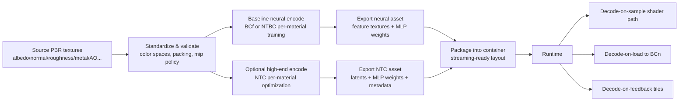
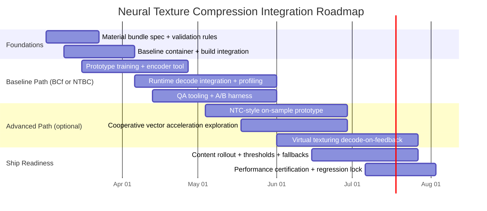

# Neural Texture Compression in Production Game Engines

## Executive summary

Neural texture compression (NTC, broadly construed) replaces a conventional set of physically based rendering (PBR) material textures (albedo, normals, roughness, metalness, AO, etc.) with (a) a compact learned representation (often “neural textures” / latent feature maps) and (b) a small neural decoder (commonly an MLP) that reconstructs the material channels at runtime (or at load time) with random access. This targets the dominant cost center of modern content: high-resolution, multi-channel texture sets and their mip chains. citeturn39view0turn23view0turn30view0

Public reporting around the new Ubisoft news post (dated “2 days ago” on the official news index as of Feb 26, 2026) describes: (1) exploiting **cross-channel structure** in PBR textures, (2) reconstructing “full PBR materials in real time,” and (3) pursuing a high compression rate “without sacrificing visual quality.” citeturn39view0 A contemporaneous secondary write-up adds two operationally important production facts: the technique was **compute-expensive enough to be applied selectively** (e.g., to high-instance-count assets under memory pressure) and delivered **up to ~30% memory savings** where it was used. citeturn37view0

From related primary sources, three “production-plausible” families of neural texture compression emerge:

- **Per-material latent grids + per-material MLP decoder** (the canonical “NTC” approach), compressing **multiple material channels and mip levels together**, using quantized latent feature pyramids and a shader-integrated decoder; high-end implementations exploit matrix acceleration (tensor cores / cooperative vectors) and may require stochastic filtering to regain proper texture filtering behavior. citeturn22view1turn24view1turn23view0turn30view0turn38view0  
- **Block-compressed neural features (BCf)**: store learned features directly in a standard GPU block-compressed format (notably BC6), emulate BC decompression during training so the exported features remain hardware-decodable, and run a lightweight shader MLP after trilinear sampling—aiming for cross-platform integration without vendor-specific ML shader extensions. citeturn32view0turn32view1  
- **Neural block compression emitters (NTBC)**: learn a mapping from uncompressed textures to **standard BC blocks** (e.g., BC1/BC4), execute inference *once per material* at load time to reconstruct BC data, and keep shaders unchanged—trading runtime sampling cost for load-time compute. citeturn29view0

A robust custom-engine implementation plan should treat neural texture compression as a **new material asset type** spanning: offline training/encoding, packaging/containerization, streaming/virtual texturing integration, runtime decode paths (GPU “decode-on-sample” and/or “decode-on-load”), QA tooling for perceptual validation, and a fallbacks matrix keyed by platform and GPU capability. citeturn30view0turn33search1turn35search3

Key recommendation: adopt a **two-path design** from the start—(1) a cross-platform baseline (BCf-like or NTBC-like) and (2) an optional high-end “decode-on-sample” path accelerated by cooperative vectors / matrix ops on capable PCs—so you can ship broadly while still harvesting upside where hardware permits. citeturn32view1turn29view0turn30view0turn31search0turn31search1

## Technical background

Modern real-time renderers rely on PBR materials comprising multiple texture layers (albedo, normals, scalar maps, etc.). Increasing perceived material fidelity typically increases either texture resolution or the number of layers—directly increasing disk size, memory footprint, and streaming bandwidth. citeturn17view0turn21view0

### Why classic GPU texture compression looks the way it does

GPU-native texture compression formats (BC1–BC7 in DirectX-class pipelines; ASTC on many mobile/console-class pipelines) are engineered around three constraints:

1. **Random access**: the shader must sample arbitrary UVs efficiently.  
2. **Fixed-rate blocks**: small independent blocks make addressing easy and enable hardware decode.  
3. **Hardware filtering**: mips + filtering must remain fast and stable.

BC7, for example, is described as a high-quality format for RGB/RGBA data, with per-block mode choices enabling different tradeoffs while preserving fast hardware decode. citeturn33search0turn33search8 ASTC was designed as a flexible fixed-rate block compression system spanning a wide range of bit rates and texture types. citeturn33search3turn33search19turn33search7

Separately, many pipelines use **meta-compression** (disk/transmission) formats that later transcode into GPU-native blocks. KTX 2.0 explicitly treats supercompression as something applied per mip level to support streaming and random access of levels. citeturn33search1turn35search3

### Neural compression fundamentals for textures

Most learned compression methods can be framed around an information bottleneck:

- **Analysis transform / encoder** produces latents  
- **Quantization** discretizes latents  
- **Entropy coding** (optional) compresses symbols using a probabilistic model  
- **Synthesis transform / decoder** reconstructs the signal

Classic learned image compression work formalizes this as optimization over rate and distortion, using a differentiable proxy for quantization during training. citeturn27search0turn27search1

However, texture compression has a special requirement: **random access** in a shader. Many neural image codecs prioritize global transforms and entropy coding, which complicates random-access decoding. The NTC line of work explicitly states that standard image compression techniques (including neural ones) are generally ill-suited for real-time texture sampling because they require full-image decode rather than arbitrary texel access. citeturn17view0turn21view0

As a result, neural texture compression methods often use:

- **Autodecoder training** (no encoder network): directly optimize per-material latent feature grids plus a small decoder network. citeturn22view1turn17view0  
- **Multi-resolution feature grids / pyramids**: latent grids at multiple scales to span low- and high-frequency details. citeturn22view1turn29view0  
- **Quantization-aware training**: inject noise or otherwise approximate discretization during training; later freeze/quantize. citeturn22view1turn29view0  
- **Either no entropy coding (fixed-rate)** or carefully constrained entropy coding compatible with random access (often avoided). The NTC paper explicitly enforces fixed quantization rates and notes it does not use entropy coding for the core method. citeturn22view1turn22view3

### Quantization and entropy coding essentials

Quantization converts continuous values into discrete symbols. In neural codecs, quantization is frequently approximated during training with additive uniform noise; the NTC paper describes adding uniform noise in a quantization bin range to simulate quantization error, then later explicitly quantizing and fine-tuning the decoder weights for discrete grids. citeturn22view1

Entropy coding then compresses those discrete symbols close to their Shannon limit using a probability model. Modern entropy coders cluster around Huffman coding and arithmetic/range coding; asymmetric numeral systems (ANS) is a family that aims to get arithmetic-like compression efficiency with Huffman-like speed characteristics. citeturn35search0turn35search24turn35search1turn35search17 In practice, game asset containers frequently rely on general-purpose compressors (e.g., Zstandard) and/or texture-specific supercompression schemes (as in KTX2 tooling). citeturn35search2turn35search11turn35search3

### Perceptual metrics for regression and QA

Neural compression tends to trade “classic distortion” for perceptual plausibility, so evaluation needs multiple metrics:

- **SSIM / MS-SSIM**: structured similarity measures; MS-SSIM explicitly incorporates multiple scales. citeturn34search0turn34search1  
- **Deep-feature perceptual similarity**: the LPIPS work argues that PSNR/SSIM are shallow and often misaligned with human perception, and proposes learned deep-feature distances that correlate better with human judgments. citeturn27search2turn27search6  
- **FLIP**: a perceptual difference evaluator targeted at graphics-style comparisons, incorporating viewing conditions; it’s used in neural texture compression literature to quantify visible error. citeturn27search3turn23view0  

A production pipeline should treat these metrics as **decision aids** rather than absolute truths; even the BCf paper notes no single metric perfectly aligns with perception and that artifact types differ between block codecs and neural methods. citeturn32view1

## What Ubisoft publicly claims and what remains unspecified

### What is explicitly stated in the Ubisoft public teaser and secondary reporting

From the official news index entry, the technique is described as:

- a **“neural material texture compression technique”**  
- using **machine learning** to exploit **cross-channel structure**  
- reconstructing **full PBR materials in real time**  
- enabling a high compression rate without sacrificing visual quality (as stated in the teaser). citeturn39view0

A separate search snippet referencing the Ubisoft article adds an implementation implication: “additional work was required to fully align Neural Texture Compression with the engine’s existing texture …” (the remainder is truncated in the snippet). citeturn25search0 This strongly suggests non-trivial integration work in the texture system: packaging, streaming/virtual texturing, and material evaluation consistency.

A detailed secondary article (published Feb 26, 2026) describes the technique operationally as replacing multiple high-res textures with a smaller map plus a small neural network, reconstructing material properties at use time. It also reports that compute cost led to selective deployment “to a subset of assets … with high instance counts and significant memory pressure,” and that savings reached “as high as 30%” where applied. citeturn37view0

### What Ubisoft does not specify (based on accessible public text)

Because the full Ubisoft article body is not accessible via the provided static capture in this research session, the following details should be treated as **unspecified by Ubisoft’s public article** for purposes of this report, unless you verify them directly:

- Exact network architecture (layer counts, activation functions, neuron widths)  
- Exact feature representation (latent pyramid layout, channel counts, bit depth)  
- Loss functions (e.g., L1/L2 vs perceptual; special handling of normals/roughness)  
- Training time targets and hardware  
- Runtime inference target (GPU ISA, shader model usage, any use of cooperative vectors / matrix acceleration)  
- Whether runtime decode is “decode-on-sample,” “decode-on-load,” or hybrid  
- Streaming details (virtual texturing tiles, sampler feedback-like mechanisms, caching policies)  
- Formal visual-quality metrics used for acceptance

### Most likely technical lineage of Ubisoft’s shipped approach (inference; verify against the full article)

Ubisoft-affiliated primary research from entity["organization","Ubisoft La Forge","research lab"] presents a neural material framework explicitly designed for real-time pipelines, with two core design choices that are especially compatible with multi-platform shipping:

1. **Store learned features in hardware block-compressed textures (BC6)**, and make training compatible with that constraint by simulating BC6 decompression during training. citeturn32view0  
2. Use a **small MLP decoded directly in a shader** after trilinear sampling the features, outputting filtered material values so the rest of the renderer shades “as usual.” citeturn32view1turn17view0  

The BCf paper explicitly positions itself as avoiding vendor-specific features and seeking real-time performance on consumer hardware. citeturn17view0 Given the PC Gamer description (“small neural network,” “smaller map”), this BCf line is technically consistent with the described product behavior, but this remains an inference until the exact Ubisoft article details are confirmed. citeturn37view0turn32view1

## Related primary approaches and tradeoffs

This section consolidates what “neural texture compression” can concretely mean in an engine, using three primary implementations.

### Random-access per-material NTC (feature pyramid + MLP decoder)

The NTC paper’s key idea is to compress *multiple material textures and their mip chains together* using a compact per-material neural representation: quantized latent feature pyramids plus a small per-material MLP to decode texels on demand. citeturn21view0turn22view1

Implementation-defining details include:

- **Feature pyramid layout**: multiple feature levels, each with two grids at different resolutions, with one decoder shared across mip levels; sharing allows reducing total mip storage relative to a conventional mip chain. citeturn22view1  
- **Quantization**: fixed-rate quantization (no entropy coding) using simulated quantization noise during training; explicit quantization + fine-tuning at the end. citeturn22view1turn22view3  
- **Decoder conditioning**: positional encoding and learned interpolation mechanisms to preserve high-frequency detail when grids are lower-res. citeturn22view0turn22view1  
- **Hardware acceleration and shader integration**: the paper describes tensor-core style matrix acceleration challenges in shaders, using Slang and compiler workarounds for Direct3D, and noting Vulkan vendor extensions can support similar acceleration without compiler modification. citeturn24view1turn24view3turn24view2  
- **Performance and costs**: the paper reports decompression cost in a simple renderer between ~1.15–1.92 ms (varies by profile) on an RTX 4090, compared to ~0.49 ms for trilinear-filtered BC7 in their test setup; it also reports per-material optimization times on RTX 4090 (minutes scale). citeturn23view0turn23view1

The open entity["company","GitHub","code hosting company"] RTXNTC SDK operationalizes this as a developer-facing package with multiple modes: **inference-on-sample** (direct shader decode), **inference-on-load** (decompress then transcode to BCn), and an “inference-on-feedback” mode that uses sampler feedback to decode only needed tiles into sparse tiled BCn textures. citeturn30view0

A key practical constraint is filtering: NTC decoding yields a single unfiltered texel; the SDK suggests combining with stochastic texture filtering (STF) to recover filtered results over time. citeturn30view0turn38view0 STF itself is described as sampling texels stochastically per frame according to a target filter footprint and relying on temporal accumulation/upscaling (notably DLSS) to converge. citeturn38view0

### Block-compressed neural features (BCf) for cross-platform shader decode

The BCf approach trains neural features under a block-compression constraint so the features can be exported as **regular BC6 textures** (i.e., GPU-native) and sampled with hardware trilinear filtering. citeturn32view0turn17view0

Concrete implementation parameters disclosed in the paper include:

- Feature organization compatible with BC6: per-block endpoints, indices, and fixed partitions; training simulates BC6 decompression to enable backpropagation. citeturn32view0  
- Runtime path: sample mipmapped neural features with trilinear filtering, then run a small MLP in a shader to output the filtered material; the shading step remains conventional. citeturn32view1turn17view0  
- Example decoder sizing: input size 12; one hidden layer (sizes explored: 16 and 32); output sized to the encoded material (example output size 8). citeturn32view1  
- Training: two-phase schedule (brief unconstrained pretrain, then initialization via BC6 compression and longer training); training time examples are given (e.g., ~140 minutes on RTX 2070 for one configuration) and “decent results after 10k steps.” citeturn32view1  
- Comparisons: the paper explicitly compares against BC, ASTC, and an implementation of NTC, and discusses that neural artifacts differ qualitatively from block artifacts and that no metric is perfect. citeturn32view1  

### Neural Texture Block Compression (NTBC) as “shader-preserving” integration

The NTBC approach is explicitly designed to reduce disk footprint without shader changes by learning to emit **standard BC1/BC4 blocks**. NTBC is trained per material and at runtime performs inference once per material to reconstruct block-compressed data which is then used normally. citeturn29view0

Notable production-facing details include:

- Up to ~45% less storage footprint reported in experiments (for their scope), with a modest overhead at texture loading time. citeturn29view0  
- Multi-resolution feature grids with quantization-aware training into 8-bit integers to reduce model size. citeturn29view0  
- Implementation uses HIP and evaluates on an RX 7900 XT. citeturn29view0  

### Comparative table of model families

| Model family | Random access at sample time | Texture filtering story | Where compute cost lands | Cross-platform risk profile | Best fit use case |
|---|---:|---|---|---|---|
| NTC (latent pyramid + MLP decode) citeturn22view1turn30view0 | Yes | Needs STF / special filtering approaches for high-quality filtering citeturn30view0turn38view0 | Per-sample shading cost (unless decode-on-load path) citeturn30view0 | Higher (matrix accel paths differ; divergence issues noted) citeturn24view1turn30view0turn31search0 | High-end PC path; memory-bound scenes; advanced virtual texturing |
| BCf (block-compressed features + tiny MLP) citeturn32view0turn32view1 | Yes | Uses hardware trilinear sampling of feature mips, outputs filtered material citeturn32view0turn32view1 | Small per-sample MLP | Lower (uses standard BC + “just a shader”) | Broad shipping path; predictable integration; avoids vendor ML extensions |
| NTBC (neural emit BC blocks) citeturn29view0 | Standard BC sampling | Standard GPU BC filtering | Load time / streaming decode step | Moderate (requires compute at load; still standard sampling) | Consoles/mobile where shader cost is precious; “keep shaders unchanged” constraint |

## Implementation plan for a custom engine

This plan assumes you control an asset pipeline, a renderer/material system, and a streaming/virtual texturing stack. It is structured to let you ship *something* broadly (baseline path) while preserving an upgrade path to more aggressive on-sample decoding on high-end PCs.

### Engine integration points

Neural texture compression touches four “seams” in a modern engine:

1. **Material authoring → bake/export**  
   You must define a canonical “material texture bundle” (channels, color spaces, normal encoding conventions, mip generation policy, packing rules). This is essential because neural compression exploits cross-channel redundancy, and mismatched conventions will destroy correlations. citeturn39view0turn22view1turn30view0  

2. **Cook/build pipeline (compression)**  
   Neural methods are typically per-material optimization procedures (minutes-scale for NTC; longer for some BCf configurations), producing (a) feature textures/latents and (b) decoder weights. citeturn23view1turn32view1turn29view0  

3. **Containerization and patching**  
   You need a stable on-disk format for “neural material assets” that supports patching, incremental builds, and per-mip / per-tile decompression (especially if used with virtual texturing). KTX2’s per-mip supercompression model is one pattern for streaming-friendly containers, even if you define a separate payload for neural latents. citeturn33search1turn35search3turn30view0  

4. **Runtime sampling / streaming**  
   Decide early whether you support:
   - decode-on-sample (shader MLP per sample),  
   - decode-on-load (material load-time transcode to BCn),  
   - decode-on-feedback (sampler-feedback-driven tile decode),  
   - or some combination. The RTXNTC SDK treats these as distinct runtime modes because they trade compute vs memory differently. citeturn30view0  

### Architecture choice and model options

A practical selection strategy:

- **Baseline (ship everywhere): BCf-like or NTBC-like**  
  - If you can afford a small shader MLP: BCf provides a very direct pipeline—feature textures are standard GPU BC textures, and decode uses ordinary sampling + small MLP. citeturn32view0turn32view1  
  - If you must not touch shaders: NTBC reconstructs standard BC blocks at load time and keeps the renderer unchanged. citeturn29view0  

- **High-end PC enhancement: NTC decode-on-sample**  
  Reserve the more aggressive NTC decode-on-sample path for targets with robust shader-model support and matrix acceleration paths. This path provides the deepest VRAM reduction because you can keep latents resident instead of decoded BCn textures. citeturn30view0turn31search0turn31search1  

### Proposed asset pipeline (end-to-end)

Below is a concrete pipeline that supports BCf baseline + optional NTC path.

This architecture mirrors what the primary sources consider “real-time viable”: feature textures/latents plus a small MLP evaluated in shaders (BCf/NTC), or inference at load to produce BC blocks (NTBC). citeturn32view1turn30view0turn29view0

### Training pipeline details

#### Training data and sampling scheme

For **per-material optimization**, your dataset is essentially the material’s own texture bundle and its mips. The key is to train against the *filtered* material value the renderer expects at arbitrary UV and scale:

- Sample random UV coordinates and scale/LOD (or anisotropic footprint parameters if you extend later).  
- Define a target function that matches your engine’s mipmapping and filtering conventions.
  - NTC-type methods explicitly share a decoder across mip levels and treat LOD selection as part of decoding. citeturn22view1turn22view0  
  - BCf explicitly trains to output material information continuously in space and scale, using trilinear interpolation over mipmapped feature textures. citeturn32view0turn32view1  

If you later adopt stochastic filtering (e.g., STF), your training target may shift from “filtered texel” to “unfiltered texel + an estimator,” but this adds temporal considerations and is best treated as a second-phase optimization. citeturn38view0turn30view0

#### Loss functions and channel-specific considerations

A production loss stack should be channel-aware:

- **Albedo/base color**: L1 or Charbonnier in linear space; consider log/ACES-like transforms only if that matches your shading pipeline.  
- **Normals**: loss should reflect angle error, not raw RGB. Convert to tangent-space normal vectors and penalize (1 − dot(n̂, n)).  
- **Roughness/metalness/AO**: scalar losses can use L1/L2 but consider perceptual remapping (roughness is non-linear in appearance).  
- **Perceptual image losses**: deep-feature losses can better track perceived differences than PSNR/SSIM in many settings, and are commonly used in perceptual optimization contexts. citeturn27search2turn36search2  

For acceptance testing (not necessarily training), compute PSNR + SSIM/MS-SSIM + LPIPS + FLIP across representative render scenarios; the BCf paper specifically warns that artifact types differ between block compression and neural schemes, which can confuse single-metric optimization. citeturn32view1turn34search0turn27search6turn27search3

#### Quantization and storage formats

Design your quantization around your chosen family:

- **NTC-style fixed-rate quantization**: inject noise during training, clamp to quantization ranges, then freeze and fine-tune on discrete grids (as described). citeturn22view1  
- **BCf-style BC6 constraint**: bake quantization into the BC6 endpoint/index parameterization and emulate BC6 decompression during training so the exported textures remain hardware-decodable. citeturn32view0  
- **NTBC-style int8 feature grids**: quantization-aware training into 8-bit integers is explicitly used to reduce model size. citeturn29view0  

Containerization options (disk):

- If you store feature textures as BC (BC6/BC7/etc), you can package them like standard GPU textures in KTX2 or DDS-style payloads; KTX2’s supercompression schemes are designed to preserve mip-level access patterns for streaming. citeturn33search1turn35search3  
- If you store custom latents, design your own chunked format with per-mip / per-tile chunks, and optionally apply a lossless compressor such as Zstandard; the broader ecosystem documents FSE/ANS roots for high-speed entropy coding inside such compressors. citeturn35search2turn35search0turn35search24  

### Runtime decoder design

#### Decode-on-sample (shader-integrated)

This is the most “neural-native” path and achieves the largest VRAM reduction because you keep latents resident.

Implementation steps:

- Bind feature textures/latent grids as sampled resources; bind network weights as a structured buffer (or root constants if small).  
- In the material shader:  
  1) choose feature level / resolution based on desired LOD,  
  2) sample/interpolate latent features,  
  3) run MLP to output channels. citeturn22view1turn32view1turn30view0  

Acceleration options:

- On high-end PC GPUs, use cooperative vector / matrix acceleration where available. The RTXNTC SDK states cooperative vector extensions for Vulkan and Direct3D 12 can allow pixel shaders to leverage the same matrix acceleration hardware used for inference, with significant throughput gains on specific GPU generations, while still providing fallbacks. citeturn30view0turn31search1turn31search0turn31search9  
- For Direct3D 12, cooperative vectors are introduced in preview Agility SDKs, with Microsoft documentation framing them as enabling efficient neural rendering techniques in real-time pipelines. citeturn31search7turn31search0turn31search3  

Operational caveats:

- SIMD divergence: per-material networks imply different weights per surface; the NTC paper describes divergence challenges for matrix acceleration and outlines fallback paths when lanes are inactive or weights differ. citeturn24view1turn24view3  
- Filtering: if your decoder outputs unfiltered texels (common in NTC), you must integrate a filtering strategy such as stochastic texture filtering with temporal accumulation. citeturn30view0turn38view0  

#### Decode-on-load (transcode to BCn)

This path shifts compute to load/streaming time:

- Load neural asset → run inference to reconstruct either:
  - conventional texture channels (then BC compress), or  
  - directly emit BC blocks (NTBC). citeturn30view0turn29view0  
- Upload resulting BC textures to VRAM and use existing shader sampling. This preserves established material systems and avoids per-sample inference cost.

This is particularly attractive when:
- GPU time in the base pass is scarce, or  
- you need deterministic, non-temporal filtering behavior, or  
- you cannot rely on temporal accumulation/upscalers. citeturn29view0turn38view0  

#### Decode-on-feedback (virtual texturing integration)

If your engine uses sampler feedback / virtual texturing:

- Track visible tiles and needed mip levels; decode only those tiles into a sparse BC texture cache.  
- The RTXNTC SDK describes an “Inference on Feedback” mode that follows this pattern, decoding only required tiles and storing them in sparse tiled textures as BCn. citeturn30view0  

This can be the highest-complexity path but provides the best bandwidth behavior in large worlds.

### Memory, bandwidth, and latency budgeting

Because “no constraints” were specified, the plan should still declare budgets as engineering contracts.

A defensible budgeting method is to fix three envelopes:

1. **Disk footprint envelope**: total shipped textures per biome/level.  
2. **VRAM envelope**: worst-case visible set + caches.  
3. **Frame-time envelope**: decode overhead (either steady-state per-sample or bursty per-load).

Concrete reference points from primary sources:

- NTC paper reports decode overhead in a simple renderer of ~1.15–1.92 ms for NTC profiles vs ~0.49 ms for BC7 in their test scene on RTX 4090. citeturn23view0  
- RTXNTC SDK provides an example where a typical PBR bundle that might be ~64 bits/texel raw and ~24 bits/texel in a BCn pipeline could be represented in ~5 bits/texel for NTC-like latents (example framing in the SDK docs). citeturn30view0  
- BCf paper provides explicit feature configuration examples (e.g., BCf-1k/2k feature resolutions and a tiny MLP) and indicates training/runtime goals aimed at minimal overhead in real-time pipelines. citeturn32view1turn17view0  

A practical cross-platform budget template:

- **Baseline (BCf or NTBC)**: target ≤0.2 ms average added cost in the base pass for MLP decode (BCf), or ≤X ms per-material load burst for inference (NTBC), and cap total neural-material VRAM to a fraction of your existing texture pool (e.g., 20–40% of baseline) to ensure real benefit. (Exact numbers must be calibrated per engine and content; treat these as placeholders until profiled.) citeturn29view0turn32view1  
- **High-end path (NTC on-sample)**: explicitly gate by GPU capability and by scene; the sources make clear that decode-on-sample is materially more expensive than hardware BC sampling unless accelerated and carefully integrated. citeturn23view0turn30view0turn31search0  

### Fallback strategies

A production-ready design should include at least these fallbacks:

- **Per-platform fallback**: ship conventional BC/ASTC textures for platforms not enabled for neural decoding, or provide decode-on-load to standard formats. citeturn30view0turn29view0  
- **Per-material fallback**: keep original textures for materials that fail quality thresholds or are too expensive to decode (e.g., alpha-tested foliage with temporal instability). The RTXTF documentation explicitly warns that certain content classes (volumetrics, decals, alpha maps, LUTs) can lead to unexpected results under stochastic filtering. citeturn38view0  
- **Per-scene fallback**: disable neural sampling for passes that cannot accumulate temporally (shadow maps, cube maps), aligning with stochastic filtering constraints. citeturn38view0  
- **Runtime kill-switch**: a user-facing or developer-facing toggle to revert to standard sampling for debugging and emergency hotfixing.

### Tooling for QA and visual comparison

A minimal but high-leverage tooling set:

- **Deterministic A/B capture harness**: render identical camera paths with neural on/off; output HDR reference buffers and final LDR.  
- **Metric suite**: compute PSNR + SSIM/MS-SSIM + LPIPS + FLIP on both texture-space reconstructions and end-to-end rendered frames. citeturn34search0turn34search1turn27search6turn27search3  
- **Artifact heatmaps**: FLIP provides perceptual error maps; use these to localize regressions (especially important when neural artifacts are non-blocky). citeturn27search3turn23view0  
- **Material debugger**: in-engine view that shows reconstructed albedo/normal/roughness directly alongside baseline to separate “decoder issues” from lighting/shading issues.  
- **Stress scenes**: high-frequency patterns, smooth gradients, grazing-angle specular highlights (these are typical compression failure cases; NTC literature discusses specular flicker under temporal filtering in motion). citeturn23view1turn38view0  

### Deployment and testing checklist

| Area | Checklist item | Pass criteria |
|---|---|---|
| Asset determinism | Neural compression output is deterministic for a given source bundle and build configuration | Byte-identical outputs across CI runs |
| Shader correctness | Reconstructed channels respect engine conventions (normal length, roughness range, color space) | Automated unit tests on decoded channels |
| Streaming | Per-mip (and optionally per-tile) decode works under seek-heavy camera motion | No stalls beyond budget; no missing mips |
| Performance | Decode cost stays within the allocated envelope on each hardware tier | GPU captures and frame-time deltas match targets citeturn23view0turn29view0 |
| Visual quality | Metrics + human review pass thresholds; regression triage is actionable | LPIPS/FLIP deltas bounded; no “new class” artifacts citeturn27search6turn27search3turn32view1 |
| Fallback | Failover to baseline BC/ASTC textures works per material and per platform | No crashes; consistent shading |
| Packaging | Patch-friendly chunking (per material / per mip / per tile) validated | Partial installs and hotfixes preserve integrity |
| Telemetry | Optional in-dev reporting: decode time, cache hit rate, fallback triggers | Dashboards show stable trends |

## Codec and platform comparison tables

### Codec and container options

| Option | GPU sampling cost | Disk size reduction | VRAM reduction | Random access | Notes |
|---|---:|---:|---:|---:|---|
| BCn (e.g., BC7) citeturn33search0turn33search4 | Very low (hardware) | Moderate | Moderate | Yes | Mature baseline; fixed-rate blocks |
| ASTC citeturn33search3turn33search19 | Very low (hardware on supported GPUs) | Moderate–high (configurable bpp) | Moderate–high | Yes | Flexible bit rates; broad mobile relevance |
| KTX2 + Basis Universal supercompression citeturn33search1turn33search5turn35search3 | Depends (transcode step) | High (wire/disk) | Indirect | Mip-level access | Excellent distribution container; doesn’t replace GPU format |
| NTC (decode-on-sample) citeturn30view0turn23view0 | Higher (MLP per sample) | High | High | Yes | Needs careful filtering and acceleration; strongest VRAM savings |
| BCf (decode-on-sample) citeturn32view0turn32view1 | Low–moderate (tiny MLP) | High (if features smaller than originals) | High | Yes | Cross-platform friendly; leverages standard BC6 storage |
| NTBC (decode-on-load) citeturn29view0 | Baseline (BC sampling) | High | Baseline VRAM (after decode) | Yes | Best when you can pay load-time compute but not per-sample cost |

### Hardware target matrix

| Target tier | Recommended runtime mode | Acceleration approach | Rationale |
|---|---|---|---|
| High-end PC GPUs | NTC on-sample or BCf | Cooperative vectors / matrix ops when available citeturn30view0turn31search0turn31search1 | Max VRAM savings; can afford shader compute |
| Mid-range PC GPUs | BCf or NTC on-load | Standard FP16/INT path; avoid heavy temporal dependencies | Stability and predictable perf |
| AMD-focused PC / consoles | BCf or NTBC | Conventional shader ALU; load-time compute if needed citeturn29view0turn32view1 | Avoid vendor-specific ML shader features |
| Mobile | NTBC-like (load-time) or tuned ASTC | Prefer hardware formats; minimal shader overhead citeturn33search19turn29view0 | Power and thermal constraints |

## Roadmap, milestone timeline, and prioritized sources

### Delivery timeline (illustrative; assumes dedicated engineering + ML infra)

### Key risks and mitigations

- **Filtering/temporal instability**: If you rely on stochastic filtering, you inherit noise and dependence on TAA/upscalers; documented limitations include alpha-tested content and offscreen passes. Mitigation: prefer BCf-style “filtered output” baseline; constrain STF usage to content known to behave well; keep fallbacks. citeturn38view0turn32view1  
- **Shader divergence and specialization explosion**: Per-material networks stress SIMD-uniform acceleration; mitigate by clustering materials by decoder shape, using indirection tables for weights, and supporting a non-accelerated path. citeturn24view1turn30view0  
- **Pipeline complexity / build times**: Per-material optimization is slower than BC encoding; mitigate with caching, incremental builds, and quality tiers. The NTC paper reports minutes-scale per material on high-end GPUs, while BCf reports longer for some configs; both imply CI strategy matters. citeturn23view1turn32view1  
- **Perceptual acceptance**: Metrics can disagree; mitigate with targeted visual tests and error heatmaps (FLIP), and by defining content-specific thresholds. citeturn27search3turn32view1turn27search6  

### Prioritized sources (recommended reading order)

1. Ubisoft news teaser (official index entry) for stated intent: cross-channel structure, real-time PBR reconstruction, quality claim. citeturn39view0  
2. Ubisoft-affiliated BCf technical paper (real-time neural materials with block-compressed features) for a cross-platform-capable architecture and concrete MLP/feature configurations. citeturn17view0turn32view0turn32view1  
3. entity["company","NVIDIA","gpu company"] NTC paper (random-access neural compression of material textures) for full-stack design: feature pyramids, quantization strategy, shader integration, performance numbers. citeturn21view0turn22view1turn23view0turn24view1  
4. RTXNTC SDK (reference implementation of multiple runtime modes) and RTXTF (stochastic filtering) for practical integration patterns and pitfalls. citeturn30view0turn38view0  
5. entity["company","Advanced Micro Devices","semiconductor company"] NTBC paper for a “keep shaders unchanged” alternative and load-time inference strategy. citeturn29view0  
6. entity["company","Microsoft","software company"] cooperative vectors documentation (DirectX) and entity["organization","Khronos Group","graphics standards consortium"] Vulkan cooperative vector documentation for hardware acceleration pathways. citeturn31search0turn31search7turn31search1turn31search9  
7. Neural compression fundamentals: end-to-end learned image compression and hyperprior VAEs for rate–distortion framing and quantization proxies. citeturn27search0turn27search1  
8. Perceptual metrics: SSIM/MS-SSIM, LPIPS, FLIP for measurement and tooling. citeturn34search0turn34search1turn27search6turn27search3  
9. Entropy coding primers (ANS, arithmetic coding) and container specs (KTX2) for storage and streaming design vocabulary. citeturn35search24turn35search1turn33search1turn35search3  

For citation completeness of major foundational authors referenced by these sources (without repeating names elsewhere): entity["people","Karthik Vaidyanathan","computer graphics researcher"] citeturn20view0; entity["people","Clément Weinreich","computer graphics researcher"] citeturn16view0; entity["people","Satoshi Fujieda","computer graphics researcher"] citeturn29view0; entity["people","Johannes Ballé","research scientist"] citeturn27search0; entity["people","Richard Zhang","computer vision researcher"] citeturn27search2; entity["people","Pontus Andersson","computer graphics researcher"] citeturn27search3; entity["people","Zhou Wang","image processing researcher"] citeturn34search0; entity["people","Jarek Duda","computer scientist"] citeturn35search0; entity["people","Aaron van den Oord","machine learning researcher"] citeturn36search0