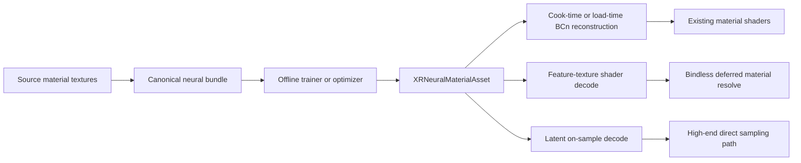

# Neural Texture Compression Implementation Plan

Last Updated: 2026-03-20
Status: design
Scope: add a production-usable neural texture compression pipeline to XRENGINE, starting with offline decode-on-load for broad support and reserving shader decode for later hardware tiers.

Related docs:

- `bindless-deferred-texturing-plan.md`
- `zero-readback-gpu-driven-rendering-plan.md`
- `docs/features/gi/light-volumes.md`
- `docs/features/gi/global-illumination.md`

---

## 1. Executive Summary

Neural texture compression should enter XRENGINE as a new material asset pipeline, not as an ad hoc shader experiment.

The engine should ship this in three layers:

1. **Decode-on-load baseline first**: compress authored PBR texture bundles into a neural asset offline, then reconstruct standard BCn textures during cooking or load. This keeps runtime shaders unchanged and is the only path that should be considered for a first shipping milestone.
2. **BC-feature shader decode second**: once bindless deferred texturing is real, allow a cross-platform runtime path that samples block-compressed learned features and runs a very small shader decoder during material resolve.
3. **High-end latent decode last**: only after the first two modes are stable should XRENGINE add a direct decode-on-sample path for high-end PC GPUs with cooperative vector or matrix acceleration.

The main product constraint is selective use. Neural compression should not be the default for every material. It should target memory-dominant assets first:

- large tiling terrain and landscape materials
- repeated environment kits with several correlated PBR channels
- hero environments where streaming pressure is the bottleneck
- high-instance-count assets where disk and VRAM savings compound materially

The wrong first move would be to wire neural decode into every material shader before the asset format, cooker, fallback policy, and validation tooling exist. The right first move is a cooker-backed asset type with deterministic fallbacks.

---

## 2. Current Reality

### 2.1 Relevant Engine Seams

The most relevant existing code and plans are:

- `XRENGINE/Rendering/Materials/GPUMaterialTable.cs`
- `XRENGINE/Rendering/Commands/GPURenderPassCollection.IndirectAndMaterials.cs`
- `docs/work/design/bindless-deferred-texturing-plan.md`
- `XRENGINE/Core/ModelImporter.cs`
- `XRENGINE/Scene/Components/Landscape/LandscapeComponent.cs`

### 2.2 What Already Exists

- A `GPUMaterialTable` exists and already defines the idea of GPU-resident material indirection.
- The renderer already has an explicit design direction toward bindless deferred texturing.
- The engine already treats baked and hybrid rendering features as asset-driven systems rather than one-off shader toggles.
- Existing GI and material docs already assume multiple runtime capability tiers and per-mode fallbacks.

### 2.3 What Is Missing

- No neural material asset type.
- No cook step that groups albedo, normals, roughness, metalness, AO, and emissive into a single compression bundle.
- No training or optimization toolchain under `Tools/` for per-material neural compression.
- No runtime cache for decoded neural materials.
- No capability matrix that decides when to decode to BCn, when to sample learned features directly, and when to fall back to conventional textures.
- No metric-driven acceptance workflow for texture-space and frame-space regressions.

### 2.4 Consequence For Design

This feature is mostly a pipeline problem first and a runtime shader problem second. XRENGINE should treat it as a new cooked material representation with multiple consumption modes.

---

## 3. Product Position

Recommended product position:

- Neural texture compression is an optional material storage mode, not a universal replacement for BCn.
- The baseline runtime contract must preserve existing shading behavior.
- Runtime shader decode is an optimization tier, not the first dependency.
- The system should be content-selective and budget-driven.

Recommended non-goals for the first version:

- do not attempt arbitrary neural material graphs
- do not require vendor-specific ML APIs for the first milestone
- do not require virtual texturing or sampler feedback for the first shipped path
- do not replace artist-authored source textures as the ground truth asset

---

## 4. Goals And Non-Goals

### 4.1 Goals

- Reduce disk and VRAM footprint for selected multi-channel PBR materials.
- Preserve existing material appearance closely enough that regression tooling can gate rollout.
- Support at least one broad-compatibility path that keeps current shader contracts intact.
- Integrate with existing material cooking and asset import flows.
- Make per-platform and per-material fallback explicit.
- Keep the runtime path deterministic and debuggable.

### 4.2 Non-Goals

- No promise of neural compression for transparent, decal, or procedural materials in phase 1.
- No promise of runtime retraining or online adaptation.
- No requirement to support every texture channel combination on day one.
- No requirement to replace current streaming infrastructure immediately.

---

## 5. Recommended Architecture

### 5.1 Core Decision

XRENGINE should support three runtime modes under one cooked asset format.

| Mode | Runtime cost placement | Compatibility | Recommended XRENGINE phase |
|------|------------------------|---------------|-----------------------------|
| Decode-on-load to BCn | Load time or cook time | Highest | First shipping path |
| BC-feature shader decode | Per visible pixel in material resolve | Medium-high | Second path |
| Latent on-sample decode | Per texture sample | Lowest hardware coverage | High-end experimental path |

The cooked asset should not be tied to a single consumption path. The same source bundle should be able to produce:

- standard BCn fallback payloads
- learned feature textures plus tiny decoder weights
- latent grids plus decoder weights for high-end decode-on-sample

### 5.2 Material Bundle Contract

Compression quality depends on stable channel conventions. Before any neural compression work is meaningful, XRENGINE needs a canonical bundle definition for neural-eligible materials.

Required bundle fields:

- base color or albedo
- tangent-space normal
- roughness
- metallic
- ambient occlusion if authored separately
- emissive if used in the deferred contract
- mip policy and resolution policy
- color-space metadata per channel

Recommended first constraint:

- only support the standard opaque PBR material contract already assumed by deferred shading

That keeps the first implementation aligned with the bindless deferred plan rather than inventing a second material model.

### 5.3 Asset Types

Recommended cooked assets:

- `XRNeuralMaterialAsset`
- `XRNeuralMaterialCookSettings`
- `XRNeuralMaterialFallbackSet`

Recommended runtime helper objects:

- `NeuralMaterialDecodeCache`
- `NeuralMaterialCapabilityProfile`
- `NeuralMaterialDebugView`

Suggested payload layout inside `XRNeuralMaterialAsset`:

- source bundle hash
- training profile identifier
- decoder architecture metadata
- feature textures or latent grids
- decoder weights
- per-channel reconstruction metadata
- optional prebuilt BCn fallback textures
- metric summary from the cook step

### 5.4 Frame And Asset Flow

```mermaid
flowchart LR
  A[Source material textures] --> B[Canonical neural bundle]
  B --> C[Offline trainer or optimizer]
  C --> D[XRNeuralMaterialAsset]
  D --> E1[Cook-time or load-time BCn reconstruction]
  D --> E2[Feature-texture shader decode]
  D --> E3[Latent on-sample decode]
  E1 --> F[Existing material shaders]
  E2 --> G[Bindless deferred material resolve]
  E3 --> H[High-end direct sampling path]
```

### 5.5 Why Decode-On-Load Comes First

XRENGINE does not yet have a shipped bindless deferred resolve path, sampler-feedback-based material residency, or a hardware-specific ML inference layer inside material shaders. That makes direct runtime neural sampling the wrong first milestone.

Decode-on-load solves the real integration risks first:

- asset format
- cooker determinism
- selective rollout
- acceptance metrics
- platform fallback

It also lets the renderer keep the existing G-Buffer and material fetch behavior while content teams start validating compression quality.

---

## 6. Runtime Integration Strategy

### 6.1 Phase 1 Runtime Contract: Existing Shaders Stay Intact

The first runtime path should work like this:

1. Load `XRNeuralMaterialAsset`.
2. Select a decode policy from capability settings.
3. Reconstruct standard BCn textures into a cache or use precomputed cooked BCn payloads.
4. Populate the existing material system with those decoded textures.
5. Render normally.

This path intentionally does not require new per-pixel neural inference.

### 6.2 Phase 2 Runtime Contract: Deferred Material Resolve

Once bindless deferred texturing exists, neural feature decode should happen in the material resolve pass rather than in the geometry pass. That keeps neural work out of overdraw-heavy rasterization.

Recommended contract:

- geometry pass writes material ID only
- material resolve fetches learned feature textures from the material table
- resolve shader runs a tiny decoder MLP
- resolved channels are written into the same downstream buffers already consumed by lighting and decals

This path should consume the same `GPUMaterialTable` concept already present in the renderer rather than inventing a separate neural descriptor binding model.

### 6.3 Phase 3 Runtime Contract: Direct Sample Decode

The high-end path may decode at sample time for materials that remain resident only as latent grids plus weights.

This should be gated by all of the following:

- explicit capability detection
- explicit user or project opt-in
- a content allowlist
- profiling confirmation that the material is memory-bound enough to justify extra shading cost

This path should be considered an optimization tier, not the baseline engine behavior.

---

## 7. Cooker And Toolchain Design

### 7.1 Tool Ownership

Recommended new tooling folder:

- `Tools/NeuralTextureCompression/`

Recommended responsibilities:

- canonical bundle export
- training and optimization driver
- metric generation
- payload packaging
- cache key generation
- decode preview generation

The trainer itself does not need to run inside the engine process. For phase 1 it is better if the training stack is external and invoked by the cook pipeline.

### 7.2 Deterministic Outputs

Neural outputs must be treated like other cooked assets: a given source bundle and cook profile should produce byte-stable output or at least metric-stable output with a stable hashable payload.

Required cooker metadata:

- source asset hashes
- training profile version
- code version or model version
- quantization profile
- fallback generation version
- generated metrics and thresholds

### 7.3 Training Profiles

Recommended initial profiles:

- `HighQualityEnvironment`
- `BalancedEnvironment`
- `MemoryAggressive`
- `DoNotUseNeuralCompression`

Per-material authoring should choose among profiles, not arbitrary low-level network knobs.

---

## 8. Streaming, Residency, And Caching

### 8.1 First-Version Policy

Do not block phase 1 on virtual texturing.

Recommended initial policy:

- decode whole-material payloads
- cache reconstructed BCn textures in a bounded runtime cache
- evict least-recently-used decoded materials under memory pressure

This is simpler than tile-level neural decode and is sufficient to validate the asset pipeline.

### 8.2 Later Policy

After bindless deferred texturing and GPU-driven material residency are stable, XRENGINE can add:

- tile-level decode
- sparse residency for reconstructed BCn pages
- background decode jobs
- visibility-driven decode requests

That work should be explicitly downstream of the first shippable baseline.

---

## 9. Validation And Quality Gates

### 9.1 Acceptance Should Be Multi-Layered

Every neural material cook should produce:

- texture-space metrics per channel
- frame-space metrics on controlled camera paths
- size comparison against baseline authored textures and baseline BCn textures
- a pass or fail decision against per-profile thresholds

### 9.2 Required Outputs

- reconstructed albedo, normal, roughness, metallic, AO, and emissive preview images
- error heatmaps
- metric summary JSON or YAML
- optional editor thumbnails for comparison

### 9.3 Editor Tooling

Recommended editor features:

- toggle between source and reconstructed material textures
- show effective runtime mode for a material
- show decoded cache residency and size
- show cook metrics and profile used
- hot-switch fallback to conventional textures for debugging

---

## 10. Risks And Mitigations

### 10.1 Biggest Risks

| Risk | Why it matters | Mitigation |
|------|----------------|------------|
| Runtime shader cost exceeds savings | Direct decode can cost more than it saves | Ship decode-on-load first |
| Material filtering artifacts | Learned decode can break expected mip behavior | Keep BCn fallback and validate across mip levels |
| Toolchain complexity | Cooker and trainer can become fragile quickly | Keep phase 1 external and deterministic |
| Cross-platform divergence | ML shader features vary by backend and vendor | Make runtime mode capability-driven |
| Artist trust erosion | Poor previews kill adoption | Provide A/B tooling and explicit opt-out |

### 10.2 Content Classes To Exclude Early

The first allowlist should exclude:

- alpha-tested foliage
- UI textures
- LUTs and lookup textures
- decals
- animated procedural materials
- highly view-dependent authored tricks that already push the current material contract

---

## 11. Phased Bring-Up Plan

### Phase 0: Honest Scaffolding

Outcome: the engine can represent neural-compressed materials without claiming runtime decode sophistication it does not yet have.

Required work:

- add neural material asset metadata types
- add cook settings and per-material opt-in flags
- add a runtime capability profile enum
- add editor-facing debug labels that report fallback mode

### Phase 1: Decode-On-Load Baseline

Outcome: selected materials can ship as neural assets while rendering through existing BCn-based shaders.

Required work:

- define canonical bundle contract
- add external cook driver
- generate BCn fallback payloads from the cooked neural asset
- integrate runtime cache and material substitution
- validate deterministic output and load-time cost

Deliverable:

- a project can enable neural compression for a subset of opaque materials without shader changes

### Phase 2: Validation And Rollout Controls

Outcome: content teams can decide where the feature should be used.

Required work:

- A/B editor tooling
- per-material metrics report
- size and performance dashboarding
- allowlist and denylist support in project settings

### Phase 3: Bindless BC-Feature Decode

Outcome: XRENGINE can sample learned feature textures and decode material channels in a deferred resolve pass.

Required work:

- extend `GPUMaterialTable` to store neural feature references and decoder metadata
- add a deferred material resolve decoder path
- keep downstream lighting contracts stable
- profile overdraw and per-pixel decoder cost

### Phase 4: Streaming And Feedback Integration

Outcome: the engine can avoid reconstructing full-material payloads when only subsets are visible or resident.

Required work:

- tile-level residency metadata
- background decode jobs
- optional sparse page cache
- visibility-driven decode requests

### Phase 5: High-End Direct Decode

Outcome: select platforms can keep only the smallest neural payload in VRAM and decode on demand.

Required work:

- capability detection for matrix or cooperative-vector acceleration
- specialized shader path and fallback path
- aggressive profiling and artifact validation
- explicit per-platform content gating

---

## 12. Acceptance Criteria

The feature should not be considered production-ready until all of the following are true:

- phase 1 decode-on-load works on the default desktop renderer path
- material cooks are deterministic enough for CI and patching
- failed cooks fall back automatically to standard textures
- the editor can display source vs reconstructed output
- memory savings are measurable on real project content, not only synthetic samples
- runtime fallback selection is visible and debuggable

---

## 13. Recommended First Milestone

The first milestone should be narrow:

- opaque PBR materials only
- decode-on-load only
- no runtime shader inference
- no tile-level streaming
- editor comparison tooling included

That milestone is the shortest path to proving whether neural texture compression is materially better than existing BCn workflows for XRENGINE content.

If that baseline is not compelling, the engine should stop there instead of forcing a more complex shader integration.
