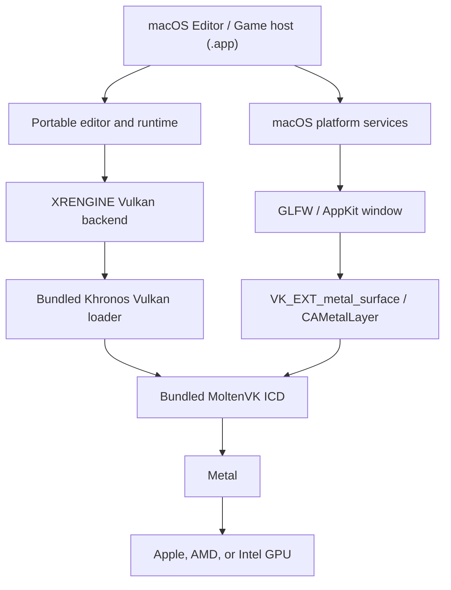

# Apple Platform and MoltenVK Support Design

Status: Proposed
Last updated: 2026-07-24
Initial delivery target: macOS 14 or later, Apple Silicon
Rendering path: Vulkan through MoltenVK to Metal

## Summary

XRENGINE should support macOS by keeping Vulkan as the engine-facing graphics API and using MoltenVK as the Vulkan portability implementation over Metal. The first supported Apple product should be the ImGui editor and game runtime on Apple Silicon macOS. Intel macOS should be a secondary compatibility tier. iOS, iPadOS, tvOS, and visionOS should reuse the resulting portable runtime and renderer, but each needs a separate host, lifecycle, input, packaging, and product design before it becomes a supported target.

The recommended shipping stack is:

```text
XRENGINE Vulkan backend
    -> bundled Khronos Vulkan loader
        -> bundled MoltenVK ICD
            -> Metal
                -> Apple GPU
```

The macOS application bundle must contain every required native component. Users must not need the Vulkan SDK, Homebrew, environment variables, or a system-installed MoltenVK. Development builds may use SDK validation layers, but release builds must resolve the loader and MoltenVK from the signed application bundle and fail with an actionable diagnostic if that contract is broken.

This is not only a renderer port. The current project graph, window lifecycle, editor shell integrations, native dependency packaging, build output model, and CI are Windows-first. macOS support therefore requires a portable application boundary and explicit platform services in addition to MoltenVK bootstrap work.

## Decisions

1. **macOS is the first Apple platform.** Other Apple operating systems are follow-on hosts, not implicit deliverables of the macOS port.
2. **Apple Silicon is tier 1.** `osx-arm64` is the first supported RID. `osx-x64` is tier 2 and follows after the arm64 path is stable.
3. **macOS 14 is the initial OS baseline.** MoltenVK itself supports older macOS versions, but the engine uses .NET 10; the baseline follows the current [.NET 10 supported-OS policy](https://github.com/dotnet/core/blob/main/release-notes/10.0/supported-os.md). Re-evaluate this decision when the engine changes .NET versions.
4. **Vulkan through MoltenVK is required on macOS.** Do not silently fall back to Apple's deprecated OpenGL implementation or to a CPU renderer.
5. **The ImGui editor is the initial editor target.** The native UI editor is outside the first macOS milestone.
6. **The official Vulkan loader is the primary integration path.** Directly loading MoltenVK may exist as a diagnostic fallback, but it is not the shipping architecture.
7. **MoltenVK and the Vulkan loader are pinned native dependencies.** Upgrade them intentionally, regenerate dependency and license reports, and validate the renderer before changing the pinned pair.
8. **Feature support is capability-driven.** Vulkan API version, operating-system name, or GPU vendor alone must not imply support for a renderer feature.
9. **The macOS editor initially uses one native window with ImGui docking.** Detached ImGui platform windows require a later multi-swapchain implementation.
10. **Developer ID distribution is the first packaging target.** Mac App Store sandboxing and policy constraints are a separate product milestone.

## Related Work

- [Runtime modularization plan](../runtime-modularization-plan.md)
- [Window creation and renderer initialization](../../../architecture/rendering/window-creation-and-renderer-init.md)
- [Vulkan renderer architecture](../../../architecture/rendering/vulkan-renderer.md)
- [Vulkan pipeline compilation](../../../architecture/rendering/vulkan-pipeline-compilation.md)
- [Default render pipeline notes](../../../architecture/rendering/default-render-pipeline-notes.md)
- [Mesh submission strategies](../../../architecture/rendering/mesh-submission-strategies.md)

This design should be implemented as part of, or after, the runtime modularization work. It must not create a second competing set of renderer abstractions.

## Goals

- Build and run the core runtime, Vulkan renderer, ImGui editor, and a packaged game on macOS.
- Render through Metal exclusively by way of Vulkan and MoltenVK.
- Preserve the existing Windows Vulkan and OpenGL behavior.
- Bundle and resolve all required native libraries from a signed `.app`.
- Make unsupported renderer and integration features visible through capability reports and editor diagnostics.
- Support Retina framebuffer scaling, macOS input conventions, normal application lifecycle events, and core editor workflows.
- Establish repeatable CI, physical-hardware validation, signing, notarization, and clean-machine installation checks.
- Leave portable seams that future iOS, iPadOS, tvOS, and visionOS hosts can reuse.

## Non-goals for the Initial Port

- Native Metal renderer code in XRENGINE.
- Apple's deprecated OpenGL renderer as a fallback.
- The native UI editor.
- OpenXR, OpenVR, SteamVR, or `XREngine.VRClient` on macOS.
- iOS, iPadOS, tvOS, or visionOS application hosts.
- Mac App Store distribution.
- Detached ImGui platform windows.
- MetalFX, DLSS, Streamline, CUDA, RTX IO, DirectStorage, or Direct3D interop.
- Mesh-shader, ray-tracing, geometry-shader, transform-feedback, or tessellation parity when the selected MoltenVK device profile cannot provide it.
- Universal binaries in the first milestone. Publish and validate arm64 and x64 independently before considering a `universal2` bundle.

## Current-State Gap Analysis

The following describes the repository at the time this design was written. Some paths may move as the runtime modularization plan is implemented.

| Area | Current state | Required change |
| --- | --- | --- |
| Target frameworks | Most engine, runtime, rendering, editor, and test projects target a Windows-specific .NET 10 TFM. | Retarget portable assemblies to `net10.0`; isolate Windows APIs and Windows-only integrations in leaf projects or platform implementations. |
| Application host | Startup, project output, launcher naming, and build-platform enums assume Windows and `.exe` output. | Add explicit macOS RIDs, a macOS host, `.app` publishing, `Info.plist`, entitlements, signing, and notarization. |
| Windowing | Silk.NET windowing already provides a useful abstraction, but startup and resize behavior include Win32-specific paths. | Make GLFW the initial macOS provider, keep lifecycle work on the main thread, and replace direct Win32 calls with platform services or Silk APIs. |
| Vulkan instance | The backend requests Vulkan 1.3 and gets surface extensions from the window provider. | Add loader-version negotiation, portability enumeration, bundled-loader resolution, and detailed startup diagnostics. |
| Vulkan device | The required device extension list primarily assumes normal desktop Vulkan. | Enable `VK_KHR_portability_subset` when advertised, query its features and properties, and construct an explicit MoltenVK capability profile. |
| Renderer features | Optional Vulkan extensions are already queried in several areas, but some pipelines and strategies still assume desktop-GPU capabilities. | Audit every startup requirement, shader stage, descriptor path, and submission strategy against the negotiated profile; implement intentional fallbacks or disable the feature. |
| Memory allocation | The preferred VMA bridge is built as a Windows native project; a managed Vulkan allocator path also exists. | Port the bridge to CMake and macOS dylibs, or use the managed Vulkan allocator as an explicit bootstrap profile until the native bridge is ready. |
| Shader pipeline | GLSL is compiled to SPIR-V with shaderc and consumed by Vulkan. | Set an explicit Vulkan/SPIR-V target, validate SPIR-V, add a MoltenVK conversion corpus, and include the portability profile in cache identity. |
| Editor integration | Clipboard, shell reveal, resize mode, secret storage, and other utilities contain Windows assumptions. | Route them through macOS implementations and adopt macOS keyboard, text input, filesystem, and lifecycle conventions. |
| Native dependencies | Project files copy multiple Windows-only DLLs and expose integrations without a macOS asset matrix. | Classify every direct and transitive dependency as required, optional, replaceable, or unavailable; package RID-specific assets. |
| Diagnostics | Vulkan validation discovery and GPU tooling are Windows-oriented. | Support loader-based validation on macOS, MoltenVK diagnostics, Xcode Metal capture, Metal API Validation, and Instruments. |
| CI | Existing automation is Windows-centered. | Add macOS arm64 build, test, render-smoke, bundle, signing, and clean-machine jobs; add x64 coverage as tier 2. |

Relevant starting points include:

- `XRENGINE/Engine/Engine.Windows.cs`
- `XREngine.Runtime.Rendering/Rendering/API/XRWindow.cs`
- `XREngine.Runtime.Rendering/Rendering/API/Rendering/Vulkan/Bootstrap/VulkanRenderer.Initialization.cs`
- `XREngine.Runtime.Rendering/Rendering/API/Rendering/Vulkan/Bootstrap/VulkanRenderer.Instance.cs`
- `XREngine.Runtime.Rendering/Rendering/API/Rendering/Vulkan/Bootstrap/VulkanRenderer.Surface.cs`
- `XREngine.Runtime.Rendering/Rendering/API/Rendering/Vulkan/Bootstrap/VulkanExtensions.cs`
- `XREngine.Runtime.Rendering/Rendering/API/Rendering/Vulkan/UI/VulkanRenderer.ImGui.cs`
- `XREngine.Runtime.Rendering/Rendering/API/Rendering/Vulkan/Shaders/VulkanShaderCompiler.cs`
- `XREngine.Runtime.Rendering/Runtime/RuntimeVulkanRobustnessSettings.cs`
- `XREngine.Editor/ProjectBuilder.cs`
- `XREngine.Data/Core/Enums/EBuildPlatform.cs`
- `XRENGINE/Settings/EditorPreferences.cs`
- `XRENGINE/Settings/SecretCipher.cs`

## Target Support Policy

| Target | Architecture | Initial status | Notes |
| --- | --- | --- | --- |
| macOS 14+ | Apple Silicon arm64 | Tier 1 | Primary editor, runtime, CI, packaging, and performance target. |
| macOS 14+ | Intel x64 | Tier 2 | Build and functional parity after arm64; performance and native dependency availability may differ. |
| iOS/iPadOS | arm64 | Future host | Requires touch/input, suspend/resume, sandbox, static/AOT, packaging, and App Store design. |
| tvOS | arm64 | Future host | Requires controller-first UI, lifecycle, AOT, and App Store design. |
| visionOS | arm64 | Future host | Requires a product decision for windowed/immersive presentation and Apple's spatial APIs; it is not an OpenXR port. |

The published support policy should distinguish:

- **Builds:** the code compiles for the RID.
- **Runs:** the application reaches a usable editor or game window.
- **Supported:** the target passes the release validation matrix and receives regression coverage.

An architecture must not be advertised as supported merely because .NET can publish it.

## Proposed Architecture



### Project and Dependency Boundaries

Use the runtime modularization plan's backend-neutral rendering contracts and Vulkan leaf backend. Add a narrow platform boundary rather than spreading `OperatingSystem.IsMacOS()` and conditional compilation throughout the engine.

Proposed responsibilities are:

| Boundary | Responsibility |
| --- | --- |
| Portable runtime and editor | Scene, asset, ECS, editor panels, commands, serialization, renderer contracts, and platform-neutral orchestration. |
| Vulkan renderer leaf | Vulkan resources, descriptors, shaders, pipelines, swapchains, render graph, ImGui rendering, memory allocation, and negotiated feature profiles. |
| Platform abstractions | Application lifecycle, main-thread dispatch, clipboard, file dialogs, shell integration, secure secrets, native-library resolution, paths, and window metrics. |
| Windows platform implementation | Existing Win32-specific behavior moved behind the platform contracts. |
| macOS platform implementation | AppKit-compatible lifecycle and macOS services, with Objective-C interop isolated from engine code. |
| Thin app hosts | Select platform services and integrations, configure dependency injection/bootstrap, own the process entry point, and publish the platform artifact. |

The exact project names can follow the modularization work, but the dependency direction must remain:

```text
App host -> platform implementation -> platform abstractions
App host -> editor/runtime -> renderer contracts
App host -> Vulkan backend -> renderer contracts
```

Portable projects should target `net10.0`. Windows-only leaves may retain a Windows TFM. macOS publishing should use explicit RIDs such as `osx-arm64`; do not use `AnyCPU` as a substitute for a native architecture.

### Platform Service Contracts

Introduce focused contracts only where platform behavior exists. Likely contracts include:

- `IApplicationLifecycle` for activate, deactivate, quit, suspend-like notifications, display changes, and orderly shutdown.
- `IMainThreadDispatcher` for operations that AppKit or GLFW requires on the process main thread.
- `IClipboardService` for text and later image/data clipboard support.
- `IFileDialogService` for open, save, folder selection, and security-scoped access if sandboxing is added later.
- `IShellIntegration` for reveal-in-Finder, open URL, and open external file.
- `ISecretStore` with Keychain on macOS and the current Windows implementation behind the same contract.
- `INativeLibraryResolver` for deterministic RID-aware library resolution and diagnostic reporting.
- `IWindowMetrics` or equivalent data on the existing window abstraction for logical size, framebuffer size, content scale, monitor, and safe resize state.

Do not create a general platform service locator. Resolve these dependencies once in the application host and pass focused services to their consumers.

## Workstream 1: Make the Managed Project Graph Portable

1. Inventory all projects and source files that require Windows-specific TFMs.
2. Retarget platform-neutral projects to `net10.0`.
3. Move Windows APIs, packages, and source into Windows leaf projects or platform-specific implementations.
4. Split the editor into portable editor logic plus a thin host if the existing project cannot target both Windows and macOS cleanly.
5. Add `osx-arm64` and `osx-x64` build platforms or RIDs to build settings. Replace the current Windows-only `EBuildPlatform` assumptions with a target model containing operating system and architecture.
6. Replace executable-name logic that forces `.exe` with a platform artifact model:
   - Windows executable
   - macOS application bundle
   - future mobile application package
7. Add compile-time platform analyzers or forbidden-API checks so portable projects cannot add Win32 P/Invokes or Windows-only package references.
8. Keep Windows projects building throughout the split; do not land a macOS graph that silently drops Windows integrations.

Exit criteria:

- Portable engine, runtime, Vulkan renderer, and editor-core projects build on Windows and macOS.
- Windows-specific packages are absent from the macOS restore graph.
- The macOS host can start far enough to emit a structured platform and native-dependency report before creating a window.

## Workstream 2: Native Dependency and Integration Audit

Create a checked-in matrix for every direct and transitive native dependency. At minimum, record:

- owner and repository/package;
- version and license;
- required feature;
- macOS arm64 and x64 artifact availability;
- minimum OS;
- dynamic versus static linkage;
- code-signing requirements;
- whether it is mandatory at startup;
- replacement or disablement strategy.

The current graph contains examples that require special handling, including Win32 extras, WGL, XInput, DirectStorage, D3D12, OpenVR, OpenXR loader assets, CUDA integrations, VMA native code, FFmpeg binaries, FreeType, Rive, OVRLipSync, and other native SDKs.

Classify integrations as follows:

| Class | Startup behavior |
| --- | --- |
| Required baseline dependency | Missing or wrong architecture is a startup error with the expected bundle path and architecture in the message. |
| Optional portable integration | Load only after capability probing; expose the reason it is unavailable. |
| Optional Windows-only integration | Exclude from the macOS publish graph and mark unavailable in the editor. |
| Unsupported hard dependency | Refactor it out of the baseline path before macOS can be considered supported. |

No optional integration may make the baseline editor fail during assembly load, static initialization, or native library probing.

After any dependency addition, upgrade, or replacement, run `Tools/Generate-Dependencies.ps1` and review `docs/DEPENDENCIES.md` and `docs/licenses/` as required by repository policy.

## Workstream 3: macOS Application and Window Lifecycle

### Main-thread ownership

GLFW initialization, window creation/destruction, and event processing must occur on the process main thread. AppKit also expects its application lifecycle on that thread.

The first implementation should run the existing window/event/render loop on the main thread. If rendering later moves to a worker thread, use an explicit mailbox:

- main thread owns application events, GLFW, window creation/destruction, clipboard, dialogs, and AppKit calls;
- render thread owns Vulkan command recording and submission where allowed;
- resize, close, scale, and surface lifecycle changes cross the boundary as immutable messages;
- shutdown joins the render thread before destroying the surface and window.

Do not reuse the current Windows-specific SDL pump prototype as the macOS lifecycle.

### GLFW and surface creation

Use the Silk.NET GLFW window provider as the initial macOS backend:

- select Vulkan as the macOS default and require the requested backend rather than falling back to OpenGL;
- request `NoApi`/Vulkan rather than an OpenGL context;
- ask GLFW for its required Vulkan instance extensions;
- create the `VkSurfaceKHR` through GLFW/Silk;
- verify that `VK_EXT_metal_surface` is present in the resolved extension set;
- ensure GLFW and Silk.NET resolve the same bundled Vulkan loader;
- retain SDL as a separately validated future option, not an automatic fallback.

### Window metrics and Retina

Treat logical window coordinates and framebuffer pixels as distinct values:

- swapchain extent and viewport use framebuffer dimensions;
- editor layout and pointer coordinates use logical dimensions with an explicit content scale;
- handle content-scale changes when moving between displays;
- rebuild size-dependent resources only after a non-zero framebuffer extent is stable;
- suspend acquisition/presentation while minimized or fully occluded rather than spinning;
- revalidate fullscreen, borderless, monitor selection, display hot-plug, sleep/wake, and lid/external-display transitions.

Replace `GetSystemMetrics` and other user32-derived window behavior with cross-platform monitor/window data.

### Input and application behavior

Validate:

- Command as the primary macOS shortcut modifier while preserving Control where semantically required;
- keyboard layout-independent shortcuts versus text input;
- Unicode text, dead keys, composition, and IME;
- high-resolution scrolling, trackpads, extra mouse buttons, and cursor confinement behavior;
- clipboard, drag and drop, file dialogs, open-file events, and open-URL behavior;
- application activate/deactivate, reopen, close-last-window, quit, and unsaved-document prompts.

The macOS host should behave like a normal macOS application without embedding AppKit calls in renderer or scene code.

## Workstream 4: Bundle the Vulkan Loader and MoltenVK

### Versioning

Pin a tested pair of:

- Khronos Vulkan loader;
- MoltenVK release;
- shaderc/SPIR-V toolchain versions used to produce engine shaders.

Record the versions in one dependency manifest and in the startup report. Upgrade the set as one renderer-platform change, not opportunistically through transitive packages.

### Application bundle layout

The publish pipeline should produce a layout equivalent to:

```text
XREngine Editor.app/
  Contents/
    MacOS/
      XREngine.Editor
    Frameworks/
      libvulkan.1.dylib
      libMoltenVK.dylib
      <other signed native dylibs>
    Resources/
      vulkan/
        icd.d/
          MoltenVK_icd.json
    Info.plist
```

The generated ICD manifest must reference the bundled MoltenVK library using a relocatable bundle path. Native libraries should use correct `@rpath` install names and must not retain build-machine paths.

The Vulkan loader supports application-bundle driver discovery under `Contents/Resources/vulkan/icd.d`. Use that mechanism rather than relying on `VK_ICD_FILENAMES` or shell startup files. Environment overrides may remain a development diagnostic.

### Deterministic resolution

Add a startup native-library resolver that:

1. Determines the application bundle root.
2. Verifies the process architecture.
3. Resolves the bundled Vulkan loader before the Vulkan API is acquired.
4. Ensures the GLFW Vulkan path uses that loader.
5. Verifies the expected MoltenVK manifest and dylib.
6. Logs absolute resolved paths, binary architectures, and versions.
7. Stops with remediation text when the bundle is incomplete or mixed-architecture.

Development may opt into a LunarG SDK loader and validation layers. Release builds must default to the application bundle and should ignore ambient SDK installations unless an explicit diagnostic override is supplied.

## Workstream 5: Make Vulkan Bootstrap Portability-Aware

### Instance creation

Update instance bootstrap to:

1. Enumerate the loader-supported Vulkan API version.
2. Enumerate instance extensions before constructing the create info.
3. Request the tested Vulkan 1.3 baseline, bounded by the loader's supported version.
4. Enable `VK_KHR_portability_enumeration` when available.
5. Set `VK_INSTANCE_CREATE_ENUMERATE_PORTABILITY_BIT_KHR` only when that extension is enabled.
6. Include GLFW's required surface extensions.
7. Enable validation and debug utilities only when their layers/extensions are actually present.
8. Log requested, available, enabled, and missing requirements separately.

The bundled MoltenVK version should satisfy the tested baseline. A lower API version is not an automatic compatibility mode: startup should continue only if every required engine capability has a valid implementation.

### Physical device selection

Replace first-suitable-device selection with scored selection and a structured rejection report:

- surface and swapchain support;
- required queues;
- Vulkan API and required extensions;
- portability-subset support;
- required features and limits;
- descriptor capacity;
- memory budget and heap topology;
- presentation modes and surface formats.

Do not penalize Apple Silicon merely because it exposes unified rather than discrete memory. Prefer an explicitly selected device when supplied through settings or diagnostics.

### Logical device creation

When a device advertises `VK_KHR_portability_subset`, enable it and query the associated feature/property structures. The Vulkan portability rules require applications to enable the extension when the implementation exposes it.

Construct device features from the intersection of:

- engine-required features;
- selected renderer profile;
- core Vulkan features;
- extension features;
- portability-subset restrictions;
- numeric device limits.

Never put an unsupported structure in a feature chain or enable a feature because it is common on Windows.

### Surface and swapchain

Validate and update:

- surface format and color-space selection;
- supported composite alpha rather than assuming opaque;
- present-mode selection, with FIFO as the always-safe baseline;
- three swapchain images when surface limits allow, matching MoltenVK guidance;
- drawable acquisition behavior when a window is occluded or minimized;
- resize and content-scale transitions;
- out-of-date, suboptimal, surface-lost, and device-lost recovery;
- display sleep/wake and GPU-switch behavior on Intel-era hardware;
- clean destruction ordering before the window and AppKit host exit.

HDR/EDR output should remain a later feature until SDR presentation is correct and measurable.

## Workstream 6: Define an Apple MoltenVK Renderer Profile

Add a named, reportable capability profile such as `AppleMoltenVkBaseline`. It is a negotiated result, not a hard-coded OS switch. Functional decisions should use standard Vulkan extensions, features, portability properties, and limits. MoltenVK-specific APIs may provide configuration or diagnostics but should not replace capability checks.

The baseline profile should require only the renderer behavior needed for a usable rasterized editor:

- graphics, compute, and transfer work;
- swapchain presentation;
- depth/stencil and common color attachment formats;
- sampled images, storage images, uniform/storage buffers, and push constants within queried limits;
- synchronization required by the render graph;
- dynamic rendering or a tested render-pass path;
- timestamps only when supported and reliable;
- a descriptor strategy that fits the actual device limits.

### Feature policy

| Feature | Initial policy |
| --- | --- |
| Core raster and compute | Required and fully validated. |
| Dynamic rendering and synchronization 2 | Use when reported; maintain one tested baseline path if the pinned profile needs extensions rather than core entry points. |
| Descriptor indexing/bindless | Size tables from queried limits. Fall back to bounded descriptor sets or a CPU-direct submission strategy when the required indexing semantics are unavailable. |
| Buffer device address | Enable only with all required feature bits and a tested Metal argument-buffer tier. |
| Geometry shaders | Not a baseline requirement. Replace pipeline dependencies with layered/per-view draws or another portable technique. |
| Tessellation | Optional and portability-feature-gated. |
| Transform feedback | Not a baseline requirement; disable affected features or implement an alternative. |
| Mesh/task shaders | Not a baseline requirement; select another mesh-submission strategy. |
| Ray tracing | Not a baseline requirement. Disable ray-tracing features with an explicit capability reason. |
| Vendor upscalers and CUDA/Streamline | Windows/vendor-specific; exclude from baseline startup and publish graph. |
| Occlusion/pipeline statistics | Query support and tolerate missing statistics without breaking profiling UI. |

The current MoltenVK supported-extension list should be treated as a release-specific input, not a permanent promise. Every pinned upgrade must regenerate the tested feature matrix.

### Renderer audit

Audit the default pipeline and every selectable submission strategy for:

- implicit geometry-, mesh-, or transform-feedback requirements;
- descriptor indexing assumptions;
- hard-coded descriptor counts;
- image-view and swizzle assumptions;
- format support and filtering requirements;
- render-target layer behavior;
- line/point rasterization behavior;
- non-solid fill modes;
- depth clip, depth bias, and shadow sampling;
- synchronization and image-layout assumptions;
- non-coherent memory flush/invalidate alignment;
- timestamp period and query availability;
- device-local versus host-visible heap assumptions.

Unsupported strategies must be removed from resolver candidates and shown as unavailable with their missing capabilities. They must not be tried and silently replaced after initialization has already failed.

## Workstream 7: Shader and Pipeline Portability

MoltenVK translates SPIR-V to Metal Shading Language. The engine should continue to own GLSL/HLSL-to-SPIR-V compilation and treat SPIR-V as the renderer input.

Required changes:

1. Set explicit shaderc target environment, Vulkan version, and SPIR-V version.
2. Run SPIR-V validation for development and CI shader builds.
3. Create a shader portability corpus covering every stage, resource type, descriptor pattern, specialization constant, and render-pass convention used by the default pipeline.
4. Compile and create pipelines from that corpus on a macOS runner using the pinned MoltenVK.
5. Audit clip-space, framebuffer origin, front-face winding, depth range, array layers, and shadow comparison behavior through rendered tests.
6. Make feature-dependent defines derive from the negotiated renderer profile.
7. Do not compile unsupported stages and hope MoltenVK rejects them later.
8. Expose translated MSL and MoltenVK shader diagnostics only behind explicit development diagnostics.

### Cache identity

Preserve Vulkan's portable shader artifacts where possible, but key runtime pipeline caches by at least:

- shader source and engine shader ABI;
- shader compiler and SPIR-V tool versions;
- enabled renderer feature profile;
- Vulkan vendor/device/driver identifiers;
- Vulkan API version;
- MoltenVK version;
- relevant pipeline layout and render-target formats.

Persist pipeline caches under the normal macOS per-user cache directory with versioning and corruption recovery. Measure both cold and warm startup. MoltenVK's SPIR-V-to-MSL and Metal pipeline compilation costs make warm-cache validation a release requirement.

## Workstream 8: Vulkan Memory Allocation on Unified Memory

The existing native VMA bridge should gain a cross-platform CMake build that produces:

- `osx-arm64` dylib;
- `osx-x64` dylib;
- consistent exported C ABI;
- correct install name and rpath;
- RID-specific package placement;
- release and debug-symbol artifacts;
- license and version metadata.

Until that work is complete, the existing managed Vulkan allocator may be used as an explicitly selected bootstrap configuration. It must be named in the startup report and may not masquerade as the production VMA path. The managed allocator still allocates GPU memory; this is not authorization for a CPU rendering fallback.

On Apple Silicon:

- expect memory types that are both device-local and host-visible;
- select memory based on required properties and measured behavior, not discrete-GPU heuristics;
- use memory-budget information where available;
- avoid unnecessary staging copies while retaining correct synchronization;
- honor non-coherent atom sizes even when test hardware commonly exposes coherent memory;
- measure transient-resource aliasing and peak unified-memory use under editor workloads.

Before tier-1 release, either the VMA bridge must be supported or the managed allocator must meet explicit correctness, fragmentation, and performance acceptance targets.

## Workstream 9: Port the ImGui Editor

The initial macOS editor uses the current ImGui path in one native GLFW window.

Required editor work includes:

- replace Win32 clipboard callbacks in the Vulkan ImGui backend with `IClipboardService`;
- select a non-Win32 interactive resize mode by default;
- support macOS shortcut labels and Command-based commands;
- validate text entry, IME, drag/drop, cursor shapes, and high-resolution scrolling;
- implement Finder reveal, file open, URL open, and native dialogs;
- implement Keychain-backed secret storage;
- remove `.exe` and Windows path assumptions from project creation, launching, asset import, and build output;
- audit case-sensitive paths and Unicode normalization;
- verify file watching and shader/asset hot reload;
- verify menu, close, quit, and unsaved-change behavior;
- make unavailable integrations visible without loading their Windows-only assemblies.

Detached ImGui viewports remain disabled for the first release. Enabling them later requires:

- platform-window creation and destruction on the main thread;
- one Vulkan surface and swapchain per detached window;
- per-window resize, scale, acquire, submit, and present state;
- correct shutdown and docking transitions;
- tests across displays with different content scales.

The editor MCP server should remain available. Extend `Tools/Manage-McpEditorSession.ps1` and related scripts so an isolated named editor session can be built, launched, queried, captured, and stopped on macOS without assuming Windows process or output paths.

## Workstream 10: Build, Publish, Sign, and Notarize

### Build output

Add deterministic publish commands for at least:

```powershell
dotnet publish <macOS-host-project> -c Release -r osx-arm64 --self-contained true
dotnet publish <macOS-host-project> -c Release -r osx-x64 --self-contained true
```

The build pipeline must then:

1. Assemble the `.app` layout.
2. Generate `Info.plist` with stable bundle identifier, display name, version, icon, and minimum OS.
3. Copy only the selected RID's managed and native assets.
4. Generate the relocatable MoltenVK ICD manifest.
5. Normalize dylib install names and rpaths.
6. Verify every Mach-O architecture and dependency path.
7. Remove build-machine absolute paths.
8. Sign nested frameworks and dylibs before signing the app.
9. Enable Hardened Runtime.
10. Notarize and staple the distributable artifact.
11. Verify with Gatekeeper tooling on a clean machine.

### Runtime and entitlements

Use a self-contained CoreCLR application for the first editor release. The editor depends on runtime reflection and development workflows that should not be forced through NativeAOT during this port.

Under Hardened Runtime, include only entitlements proven necessary by the selected .NET deployment model. The initial expectation is the JIT entitlement described by Microsoft's [macOS deployment guidance](https://learn.microsoft.com/en-us/dotnet/core/deploying/macos). Do not add broad unsigned-executable-memory or library-validation exceptions by default. Every native library in the app should be signed consistently.

NativeAOT may be evaluated later for packaged games after reflection, dynamic assembly loading, plugins, and shader/tool workflows are audited.

### Distribution scope

The first supported artifact is a Developer ID-signed and notarized application distributed outside the Mac App Store. A later App Store milestone must separately address:

- App Sandbox and container paths;
- user-selected file access and security-scoped bookmarks;
- plugins and dynamically loaded native code;
- network and hardware entitlements;
- background work;
- App Review policy;
- any JIT or NativeAOT implications.

## Workstream 11: Diagnostics and GPU Tooling

Emit one structured renderer startup report containing:

- OS version and process architecture;
- .NET runtime and RID;
- window provider and main-thread identity;
- Vulkan loader path and version;
- ICD manifest and MoltenVK library path;
- MoltenVK version;
- requested and negotiated Vulkan API versions;
- instance and device extensions;
- portability enumeration/subset state;
- selected physical device and memory heaps/types;
- renderer profile;
- enabled and disabled optional features with reasons;
- descriptor and buffer-address limits;
- surface format, present mode, extent, image count, and content scale;
- memory allocator;
- shader and pipeline cache paths and cache-hit state.

Support these development tools:

- Vulkan validation layers through the official loader;
- loader and application-bundle layer discovery on macOS instead of the Windows registry-based discovery path;
- MoltenVK log and configuration facilities;
- `VK_EXT_layer_settings` for checked-in development profiles where supported;
- Xcode Metal API Validation;
- Xcode GPU Frame Capture and `.gputrace`;
- Instruments Metal System Trace and Time Profiler;
- engine MCP screenshots and per-run logs.

Do not make RenderDoc a macOS validation requirement. The macOS equivalent investigation path should use Xcode/Metal captures while retaining the existing RenderDoc workflow for Windows Vulkan and OpenGL.

## Delivery Plan

### Phase 0: Portability Inventory and Bootstrap Spike

Work:

- create the managed and native dependency matrices;
- confirm the target OS/RID policy;
- pin a loader/MoltenVK/toolchain combination;
- build a minimal GLFW + Silk.NET Vulkan surface through the bundled loader;
- create an instance with portability enumeration;
- select a portability-subset device;
- clear and present a swapchain image;
- capture one frame in Xcode.

Exit criteria:

- The spike runs on Apple Silicon without a Vulkan SDK installed.
- The startup report proves that both GLFW and Silk use the bundled loader and MoltenVK.
- A captured frame shows Metal commands originating from the Vulkan workload.

### Phase 1: Portable Compile Graph

Work:

- split portable and Windows-only assemblies;
- introduce platform services and thin hosts;
- add macOS RID-aware build settings;
- make the runtime, Vulkan renderer, and editor core compile on macOS;
- prevent optional Windows integrations from loading.

Exit criteria:

- macOS arm64 restore and build succeed from a clean checkout.
- Windows solution and targeted tests still pass.
- The macOS host reaches window creation with no Windows-only assembly-load failures.

### Phase 2: Vulkan Baseline

Work:

- productionize loader/ICD resolution;
- implement portability-aware instance/device creation;
- implement the MoltenVK baseline profile;
- validate swapchain lifecycle, memory allocation, command submission, synchronization, and presentation;
- render a basic scene through the engine rather than the spike.

Exit criteria:

- The Unit Testing World renders basic opaque geometry, textures, depth, and compute work.
- Resize, Retina scaling, minimize/restore, fullscreen, and shutdown are stable.
- There are no unresolved Vulkan validation errors in the baseline scene.

### Phase 3: Default Render Pipeline

Work:

- port shader corpus and cache handling;
- audit descriptor and submission strategies;
- remove hard requirements on unsupported stages;
- validate shadows, transparency, lighting, post-processing, UI, and asset formats;
- port or qualify the Vulkan memory allocator.

Exit criteria:

- The default pipeline produces an acceptable image on Apple Silicon across the reference scene set.
- Unsupported strategies are excluded before initialization and explained in diagnostics.
- Cold/warm shader and pipeline behavior meets agreed startup and hitch budgets.

### Phase 4: Usable ImGui Editor

Work:

- implement macOS input, clipboard, dialogs, shell, secret storage, and application lifecycle;
- remove project/build path assumptions;
- validate asset import, scene editing, save/reload, play/stop, and MCP control;
- add macOS defaults for renderer and resize behavior.

Exit criteria:

- A user can create/open a project, import an asset, edit and save a scene, run it, stop it, and reopen it.
- Keyboard, text input, clipboard, drag/drop, dialogs, Retina scaling, and unsaved-change prompts work.
- The editor selects Vulkan/MoltenVK explicitly and never falls back silently.

### Phase 5: CI and Developer Distribution

Work:

- add macOS arm64 CI and physical-hardware render validation;
- build the `.app`;
- sign, notarize, staple, and package it;
- add clean-machine installation and launch tests;
- document developer setup and troubleshooting.

Exit criteria:

- The notarized app passes Gatekeeper and launches on a machine without the Vulkan SDK.
- All nested native libraries are signed and use relocatable dependency paths.
- CI publishes validation evidence and the supported feature report.

### Phase 6: Hardening and Tier 2

Work:

- add Intel x64 builds and hardware validation;
- profile CPU/GPU/memory behavior;
- address long-session, display-change, sleep/wake, and recovery defects;
- set performance budgets and regression thresholds;
- consider detached viewports and universal bundles.

Exit criteria:

- Tier-1 performance and stability budgets are continuously enforced.
- `osx-x64` is either promoted with explicit coverage or documented as build-only/unsupported.
- Any universal bundle contains matching architecture slices for every native dependency.

### Phase 7: Other Apple Products

Write separate host designs for iOS/iPadOS, tvOS, and visionOS. Reuse the portable runtime, Vulkan capability model, shader corpus, and MoltenVK dependency management, but do not reuse desktop assumptions about:

- application lifecycle;
- windows and presentation;
- input;
- dynamic code/JIT;
- filesystem access;
- background execution;
- memory budgets;
- App Store packaging and entitlements.

## Validation Strategy

### Continuous integration matrix

| Job | Minimum checks |
| --- | --- |
| Windows x64 | Existing build/tests plus Vulkan/OpenGL regression protection after project splits. |
| macOS arm64 build | Restore, compile, unit tests, shader validation, native-asset and Mach-O audit. |
| macOS arm64 GPU | Window/swapchain smoke, reference scenes, MCP captures, validation logs, cold/warm cache timing. |
| macOS arm64 package | Bundle audit, signing, notarization, Gatekeeper, clean-machine launch with no SDK. |
| macOS x64 | Build first; functional/render/package jobs before promotion to supported tier. |

GPU correctness and performance must be validated on physical Apple hardware. A compile-only runner or virtual machine is insufficient evidence for MoltenVK support.

### Renderer reference coverage

At minimum, test:

- triangle and clear/present smoke;
- opaque and alpha-tested PBR materials;
- transparency and blending;
- directional/point/spot shadows and cascade boundaries;
- skeletal animation and skinned meshes;
- compute dispatch and storage resources;
- descriptor-capacity stress;
- render-target arrays, mip generation, and texture formats;
- post-processing, temporal history, motion vectors, and resizing;
- ImGui overlay and editor docking;
- multiple Retina/non-Retina display scales where hardware permits;
- minimize/restore, occlusion, fullscreen, display hot-plug, and sleep/wake;
- corrupted and incompatible pipeline-cache recovery;
- graceful reporting for every disabled optional feature.

Use image comparisons with documented tolerances; Metal output should not be required to match another API bit-for-bit.

### Performance coverage

Record separate cold and warm measurements for:

- application startup;
- shader compilation;
- pipeline creation/cache hits;
- first visible frame;
- steady-state frame CPU and GPU time;
- command recording/submission;
- transient and peak unified-memory use;
- resize and scene-load hitches.

Set numeric release budgets after the Phase 3 reference scenes are stable. Until then, store baselines and fail only on correctness or severe regressions.

## Risks and Mitigations

| Risk | Consequence | Mitigation |
| --- | --- | --- |
| Windows-only code is deeply coupled to portable assemblies. | Large or unstable project split. | Follow the runtime modularization dependency direction, add forbidden-reference checks, and land vertical slices with Windows validation. |
| A required native dependency has no macOS arm64 build or incompatible licensing. | Editor cannot ship or loses a core workflow. | Complete the dependency matrix in Phase 0; replace, port, isolate, or explicitly remove the integration before baseline startup depends on it. |
| Renderer paths assume features omitted by the portability profile. | Pipeline creation failure or visual corruption. | Define the baseline profile, audit every strategy, add shader corpus coverage, and reject unsupported strategies before use. |
| Descriptor or buffer-address limits are lower than desktop assumptions. | Bindless/resource indexing failures. | Size from device limits and keep a tested bounded-descriptor/CPU-direct strategy. |
| GLFW/AppKit work occurs off the main thread. | Hangs, event loss, or unsafe window destruction. | Give the host explicit main-thread ownership and use a mailbox if rendering is threaded. |
| SPIR-V translation and Metal pipeline creation hitch. | Slow startup and frame spikes. | Persist correctly keyed pipeline caches, prewarm reference pipelines, and measure cold/warm behavior. |
| Unified-memory heuristics copy too much or oversubscribe memory. | Lower performance or system pressure. | Select by memory properties/budget, profile staging behavior, and enforce peak-memory baselines. |
| Signing, rpaths, JIT entitlements, or nested dylibs are wrong. | Gatekeeper rejection or launch failure on clean systems. | Automate Mach-O/rpath/signature audits, sign inside-out, notarize, staple, and test without a developer environment. |
| Ambient SDK installation masks a broken bundle. | Developer builds work but releases fail. | Release-mode resolution must prefer and verify the app bundle; clean-machine CI must have no Vulkan SDK. |
| Intel support consumes disproportionate effort. | Delays the primary Apple Silicon target. | Keep x64 as tier 2 until arm64 is stable and publish its actual support level. |
| App Store rules conflict with plugins or runtime code generation. | Store submission cannot use the desktop artifact unchanged. | Keep Developer ID distribution as the first target and write a separate sandbox/AOT design. |

## Definition of Done

macOS support is complete for the first release only when all of the following are true:

- The supported projects build from a clean checkout for `osx-arm64`.
- The notarized editor app runs on a clean supported Mac without the Vulkan SDK or command-line environment setup.
- The Vulkan startup report confirms the bundled loader, bundled MoltenVK, portability enumeration, portability subset, and selected capability profile.
- The ImGui editor completes the core project/asset/scene/edit/run/save workflow.
- The default reference scenes render within accepted image tolerances.
- Resize, Retina scaling, minimize/restore, fullscreen, sleep/wake, and orderly shutdown are stable.
- Missing optional integrations are reported and do not cause load-time failures.
- Vulkan validation, MoltenVK diagnostics, and Metal validation have no unresolved baseline errors.
- Shader and pipeline caches survive normal upgrades and recover from incompatible/corrupt data.
- Signing, notarization, Gatekeeper, Mach-O architecture, and rpath checks are automated.
- Windows Vulkan and OpenGL regression coverage still passes.
- Public setup, build, debugging, packaging, support-level, and known-feature-gap documentation is current.

## Primary References

- [MoltenVK repository and supported platform overview](https://github.com/KhronosGroup/MoltenVK)
- [MoltenVK Runtime User Guide](https://github.com/KhronosGroup/MoltenVK/blob/main/Docs/MoltenVK_Runtime_UserGuide.md)
- [MoltenVK Configuration Parameters](https://github.com/KhronosGroup/MoltenVK/blob/main/Docs/MoltenVK_Configuration_Parameters.md)
- [MoltenVK release notes](https://github.com/KhronosGroup/MoltenVK/blob/main/Docs/Whats_New.md)
- [VK_KHR_portability_enumeration](https://docs.vulkan.org/refpages/latest/refpages/source/VK_KHR_portability_enumeration.html)
- [VkPhysicalDevicePortabilitySubsetFeaturesKHR](https://docs.vulkan.org/refpages/latest/refpages/source/VkPhysicalDevicePortabilitySubsetFeaturesKHR.html)
- [Vulkan Loader driver discovery](https://github.com/KhronosGroup/Vulkan-Loader/blob/main/docs/LoaderDriverInterface.md)
- [LunarG Vulkan SDK for macOS](https://vulkan.lunarg.com/doc/view/1.4.350.0/mac/getting_started.html)
- [GLFW Vulkan guide](https://www.glfw.org/docs/latest/vulkan_guide.html)
- [GLFW thread-safety rules](https://www.glfw.org/docs/latest/intro.html)
- [GLFW window and framebuffer APIs](https://www.glfw.org/docs/latest/group__window.html)
- [Apple NSApplication lifecycle](https://developer.apple.com/documentation/appkit/nsapplication)
- [Apple notarization guidance](https://developer.apple.com/documentation/security/notarizing-macos-software-before-distribution)
- [Apple Hardened Runtime](https://developer.apple.com/documentation/security/hardened-runtime)
- [Microsoft .NET macOS deployment guidance](https://learn.microsoft.com/en-us/dotnet/core/deploying/macos)
- [.NET 10 supported operating systems](https://github.com/dotnet/core/blob/main/release-notes/10.0/supported-os.md)
