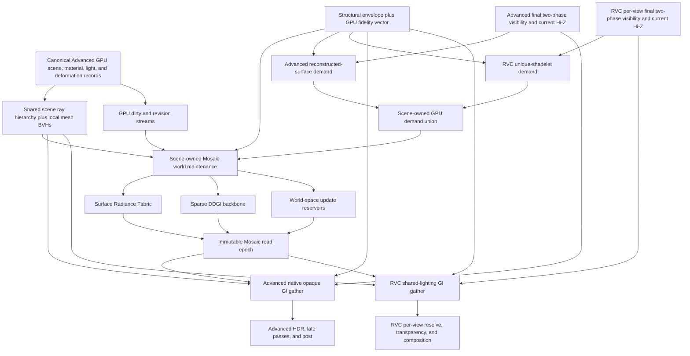

# MOSAIC-GI

## Multi-Scale Occlusion-Aware Surface-Adaptive Incident-Radiance Cache

| Field | Value |
|---|---|
| Document type | Rendering architecture and implementation design |
| Status | Research proposal / pre-prototype specification |
| Version | 0.4 |
| Date | 2026-07-29 |
| Primary target | A scene-owned, Vulkan GPU-zero-readback GI service consumed by `AdvancedRenderPipeline` and `RvcRenderPipeline` |
| Reference target | Dynamic global illumination with Lumen-like breadth, but with a deterministic non-neural baseline |
| Validation status | The engine-integration and quality-scaling architecture has been audited against XRENGINE's target GPU scene, Advanced, RVC, BVH, two-phase Hi-Z, and zero-readback contracts. The complete GI system has not yet been implemented or benchmarked. |

---

## Executive summary

No single real-time global-illumination representation is simultaneously precise, temporally stable, low-memory, view-independent, fully dynamic, inexpensive, and suitable for diffuse transport, rough reflections, mirror reflections, transmission, volumetrics, and several simultaneous VR views.

MOSAIC-GI therefore treats global illumination as a **transport-allocation problem** rather than a single tracing algorithm. It routes each lighting query to the cheapest representation that can meet the required spatial, angular, temporal, and visibility accuracy.

The proposed system combines:

1. **The canonical XRENGINE GPU scene and acceleration path for exact geometry.** Mosaic imports stable Advanced scene/material records, a scene GPU ray hierarchy, and geometry- or deformation-owned local mesh BVHs. It does not create a parallel `GiInstance` database.
2. **Static per-mesh SDF sidecars.** Static-mesh signed-distance fields accelerate cone visibility, rough transport, empty-space traversal, thickness estimation, and global clipmap construction. They do not replace exact BVH hits for important rays.
3. **A Surface Radiance Fabric (SRF).** Persistent, geometry-attached records store directional incident radiance near surfaces. Dynamic surfels cover topology-changing, procedural, or otherwise difficult geometry.
4. **A sparse cascaded DDGI irradiance backbone.** Probes provide stable low-frequency lighting, distant transport, volumetric support, and cache-miss initialization.
5. **Screen-space micro-tracing over pipeline-owned final visibility.** Per-view tracing consumes the final current-frame depth/visibility/Hi-Z product published after two-phase occlusion recovery. World-space structures remain authoritative for off-screen and occluded transport.
6. **World-space reservoirs.** ReSTIR-style reservoirs retain and share useful direct and indirect candidates at stable surface records and probe cells rather than making a noisy per-pixel reservoir estimate the whole final image.
7. **A control-variate residual gather.** The stable cached result is integrated first; exact rays estimate only the remaining error. This reduces the signal energy and variance that must be temporally reconstructed.
8. **A Sparse Delta Transport Graph.** Temporary, validated transport links predict the immediate effect of lighting changes while the long-term stochastic cache reconverges.
9. **Roughness-aware escalation.** Diffuse and rough transport use caches; uncertain visibility, thin geometry, sharp reflection, transmission, and foveal detail escalate to exact triangle traversal.
10. **A unified multi-output scheduler.** RVC eye, wide/inset, Advanced desktop, and Advanced capture consumers append GPU demand into one scene-owned queue. View-independent cache maintenance runs once, while each output keeps its own view-local correction and history.
11. **Error-budgeted quality scaling.** A public preset expands into independent world-cache, output-correction, responsiveness, and memory budgets. Each GPU request carries an accuracy/confidence/age contract, allowing the scheduler to stop at DDGI, SRF, an approximate hierarchy result, or exact traversal according to measured need.
12. **An absolute production zero-readback contract.** Counts, cutoffs, overflow state, residency, cache epochs, visibility, indirect arguments, quality debt, representation promotion, and budget decisions remain GPU-resident. Production never maps them or uses them to steer CPU submission.

The core design principle is:

> **Cache the predictable majority of the light field, trace only its unpredictable residual, and allocate exact visibility according to radiometric and perceptual importance.**

MOSAIC-GI is therefore **not a third render pipeline**. It is a shared world
service with:

- scene-persistent read/write cache epochs and acceleration imports;
- frame-slot GPU queues for dirty work, demand, rays, and indirect dispatch;
- an Advanced consumer integrated into native opaque shading;
- an RVC consumer integrated into shadelet/shared-lighting and per-view resolve;
- and no ownership of primary raster visibility, occlusion state, output-local
  temporal history, transparency composition, or presentation.

---

## Table of contents

1. [Terminology and normative language](#1-terminology-and-normative-language)
2. [Goals and non-goals](#2-goals-and-non-goals)
3. [Research synthesis](#3-research-synthesis)
4. [System assumptions](#4-system-assumptions)
5. [Architecture overview](#5-architecture-overview)
6. [Geometry and traversal architecture](#6-geometry-and-traversal-architecture)
7. [Static-mesh SDF subsystem](#7-static-mesh-sdf-subsystem)
8. [Skinned geometry and skinned SDF feasibility](#8-skinned-geometry-and-skinned-sdf-feasibility)
9. [Surface Radiance Fabric](#9-surface-radiance-fabric)
10. [Sparse DDGI irradiance backbone](#10-sparse-ddgi-irradiance-backbone)
11. [World-space reservoir scheduler](#11-world-space-reservoir-scheduler)
12. [Control-variate residual gather](#12-control-variate-residual-gather)
13. [Sparse Delta Transport Graph](#13-sparse-delta-transport-graph)
14. [Reflection, transmission, and difficult transport](#14-reflection-transmission-and-difficult-transport)
15. [Dynamic geometry and difficult materials](#15-dynamic-geometry-and-difficult-materials)
16. [Multi-view and foveated VR](#16-multi-view-and-foveated-vr)
17. [GPU work scheduling](#17-gpu-work-scheduling)
18. [Per-frame render graph](#18-per-frame-render-graph)
19. [GPU interfaces and data layouts](#19-gpu-interfaces-and-data-layouts)
20. [Memory and performance targets](#20-memory-and-performance-targets)
21. [Quality scaling and hardware tiers](#21-quality-scaling-and-hardware-tiers)
22. [Failure modes and mitigations](#22-failure-modes-and-mitigations)
23. [Comparison with Lumen](#23-comparison-with-lumen)
24. [Implementation roadmap](#24-implementation-roadmap)
25. [Validation plan](#25-validation-plan)
26. [Research risks and open questions](#26-research-risks-and-open-questions)
27. [Recommended production baseline](#27-recommended-production-baseline)
28. [References](#28-references)

---

# 1. Terminology and normative language

The terms **MUST**, **MUST NOT**, **SHOULD**, **SHOULD NOT**, and **MAY** describe implementation requirements:

- **MUST / MUST NOT:** required for correctness or architectural consistency.
- **SHOULD / SHOULD NOT:** strongly recommended, but may be changed after profiling.
- **MAY:** optional quality or hardware tier.

| Term | Meaning |
|---|---|
| **SRF** | Surface Radiance Fabric: the primary near-field, surface-attached incident-radiance cache |
| **DDGI** | Dynamic Diffuse Global Illumination probe field |
| **TLAS** | Scene-level top-level acceleration structure over instances |
| **Local BVH** | Per-mesh GPU traversal structure, equivalent in role to a BLAS |
| **SDF sidecar** | Per-static-mesh 3D signed-distance texture and optional companion metadata |
| **Residual ray** | A ray used to estimate the difference between exact incident radiance and cached incident radiance |
| **Truth ray** | A more expensive path used to detect recursive cache bias and estimate cache error |
| **Surface key** | Stable identifier for a geometry-attached cache location |
| **Cache epoch** | Immutable read snapshot of the cache used by a frame |
| **View union** | Combined importance and coverage of all active views |
| **Approximate query** | A query permitted to return cone coverage, distance, or low-frequency visibility without an exact primitive |
| **Exact query** | A query that MUST return a real primitive, barycentrics, material, and hit distance |
| **Quality envelope** | Structural maximum memory, queue, representation, and feature set allocated for a production profile |
| **Fidelity vector** | Runtime quality controls for world-cache accuracy, output correction, responsiveness, and memory pressure |
| **Quality debt** | GPU-resident priority accumulated when useful work is deferred, preventing indefinite starvation |
| **Correctness floor** | Invariants that never weaken with quality, including safe bounds, stable identity, visibility ownership, exact-query semantics, and zero readback |

---

# 2. Goals and non-goals

## 2.1 Required goals

| Goal | Required behavior |
|---|---|
| Fully dynamic lighting | Moving lights, animated emissives, time-of-day changes, light toggles, and changing materials |
| Fully dynamic geometry | Rigid instances, skinned meshes, procedural content, destruction, and user-created content |
| Multi-bounce diffuse GI | Stable indoor and outdoor bounce lighting without baking |
| Broad reflection support | Rough reflection from cache; sharp reflection from exact rays |
| Large-world support | Sparse residency, clipmaps, hierarchical LOD, and far-field fallbacks |
| VR stability | World-space histories and minimal reliance on view-specific reuse |
| Quad-view foveation | One shared transport solution with per-view final gathers |
| Vulkan production | Vulkan compute/local-BVH baseline plus optional Vulkan ray-query acceleration |
| OpenGL correctness slice | Shared logical records and compute traversal where useful, without constraining RVC production |
| Predictable execution | Fixed memory pools and time-controlled ray budgets |
| Automatic content support | No mandatory artist-authored lightmaps, GI UVs, or manual proxy cards |
| Deterministic baseline | Complete non-neural solution |
| GPU-only degradation | Missing optional RT or ML features lower quality through another GPU lane, never a hidden CPU renderer |
| Production zero readback | No same-frame or delayed CPU mapping of GI work, count, visibility, overflow, residency, or timing data |
| Pipeline-native integration | Native Advanced opaque shading and RVC shadelet/resolve integration; no legacy full-frame GI composite |
| Two-phase visibility compatibility | Consume, but never own or perturb, each output's persistent early/late Hi-Z visibility state |
| Continuous quality scaling | Prefer progressively coarser, older, or more approximate radiance as the requested performance increases, while preserving a fixed correctness floor |
| Monotonic fidelity controls | Raising a quality profile tightens error/age limits and enables additional work rather than silently replacing an exact lane with a less accurate one |

## 2.2 Base-mode non-goals

The balanced configuration is not required to provide:

- fully converged spectral path tracing;
- unrestricted multi-layer refraction;
- unbiased focused caustics;
- deep path-traced participating media;
- exact multi-bounce glossy transport at every pixel;
- or identical quality on every GPU tier.

These effects use specialized lanes or higher quality modes.

## 2.3 Performance philosophy

The system SHOULD maximize:

- reuse across space, time, eyes, and cameras;
- view-independent work;
- stable low-frequency estimates;
- exact tracing only where it changes the final image;
- bounded work per frame;
- and measurable error signals.

The system SHOULD avoid:

- tracing the same transport independently for each eye;
- storing radiance densely in empty volume;
- using SDF hits as final truth for important rays;
- forcing a one-sample path-traced image through an aggressive denoiser;
- updating all cache elements uniformly;
- rebuilding or mapping GPU worklists on the CPU;
- allocating a second scene/material database for GI;
- and making view visibility determine whether geometry exists for world-space
  transport.

The public renderer MAY expose one simple Mosaic quality setting, but internally
that setting expands into a fidelity vector. A single scalar MUST NOT obscure
whether a profile trades spatial detail, angular detail, convergence latency,
view-local correction, exact path depth, or memory.

---

# 3. Research synthesis

## 3.1 Why a hybrid is necessary

Lumen is a useful architectural reference because it combines screen-space tracing, a surface-lighting cache, software distance-field tracing, and hardware triangle tracing instead of treating one representation as sufficient.[^1] Its documented limitations also illustrate the unavoidable tradeoffs of cards, distance fields, amortized updates, and hardware-RT scene maintenance.

MOSAIC-GI keeps the hybrid principle but changes the division of labor:

- exact geometry is universally available through local BVHs;
- static SDFs are optional accelerators rather than required geometry;
- the primary cache stores incident radiance on actual surfaces;
- DDGI is explicitly the low-frequency and distant backbone;
- reservoirs allocate samples in world space;
- and exact rays estimate cache error rather than reconstructing the entire GI field from scratch.

## 3.2 Technique comparison

| Technique | Strongest property | Principal weakness | MOSAIC-GI role |
|---|---|---|---|
| Screen-space tracing | Current visible geometry and bounded traversal | Cannot represent off-screen or deeply occluded geometry | First-hit micro-detail and near-field correction |
| LPV | Cheap dynamic low-frequency propagation | Leakage, grid frequency limits, weak visibility | Optional volumetric/fog propagation |
| Voxel cone tracing | Efficient finite-footprint visibility and radiance integration | Memory, resolution, thin-geometry errors, leakage | Broad rough transport and macro visibility |
| Sparse SDF GI | Fast empty-space traversal without mandatory RT hardware | Approximate surface, material ambiguity, cascade artifacts | Conservative stepping, cone visibility, rough transport |
| DDGI | Compact, stable, view-independent irradiance | Coarse diffuse field and temporal convergence | Distant and low-frequency backbone |
| Surfels | Samples exist where transport interacts with surfaces | Allocation churn and coverage pressure | Dynamic overlay and unsupported geometry |
| On-surface radiance caches | Stable reuse across viewers and reflections | Memory, page boundaries, fine-geometry pressure | Primary near-field cache |
| ReSTIR GI | Retains and shares important low-probability paths | Validation cost and noisy low-sample output | Candidate allocation at world-space cache elements |
| Neural radiance caches | Compact approximation of complex continuation | Training noise, flicker, opaque failures, hardware dependency | Optional accelerator only |
| Lumen | Production-proven orchestration of imperfect techniques | Representation-specific limitations and update costs | Architectural precedent |

Screen-space ray tracing is naturally bounded by the depth buffer and captures current visible detail, but it cannot represent off-screen visibility and therefore requires a fallback structure.[^2]

Light Propagation Volumes introduced real-time propagation of low-order radiance through a volume, but the representation is fundamentally low-frequency and prone to grid leakage.[^3]

Voxel cone tracing demonstrates that hierarchical volumetric representations can efficiently integrate diffuse and glossy light over finite angular footprints, at the cost of spatial approximation and memory.[^4]

AMD Brixelizer validates sparse, cascaded distance-field structures as a practical compute-based basis for diffuse and specular GI without requiring hardware RT.[^5]

DDGI adds visibility-aware interpolation to irradiance probes and is a strong fit for compact, stable, view-independent diffuse lighting.[^6]

EA's GIBS demonstrates that dynamic surfel GI can support moving and skinned content, transparency, many lights, and large production scenes.[^7]

Recent on-surface cache work demonstrates multi-view reuse and geometry-attached incoming-radiance storage, while also exposing memory and fine-geometry challenges that this design must explicitly manage.[^8]

AMD's GI-1.2 work combines screen-space and world-space radiance caches with reservoir sampling and multi-bounce indirect lighting, independently supporting the viability of a two-level world-space cache architecture.[^9]

Neural Radiance Caching can learn a dynamic radiance function online, but current neural-cache documentation and research discuss estimator noise, training oscillation, stability/responsiveness tradeoffs, and temporal flicker. Neural inference is therefore optional rather than foundational.[^10][^11]

## 3.3 ReSTIR is not AI

ReSTIR is a family of reservoir-based resampling algorithms, not a neural method. ReSTIR GI shares indirect-light candidates across pixels and frames and substantially improves sample efficiency, but low-sample results still benefit from reconstruction or denoising.[^12]

MOSAIC-GI uses ReSTIR-style reservoirs to:

- choose direct lights at secondary surfaces;
- retain useful indirect directions and surface candidates;
- share candidates between nearby compatible world-space cache records;
- and allocate exact rays.

It does **not** require raw per-pixel ReSTIR GI to become the final image.

---

# 4. System assumptions

The target production renderer provides the following. These are target
prerequisites, not claims that every item is already live:

1. `AdvancedSharedGpuSceneDatabase` generational draw, instance, geometry,
   material, deformation, view, light, shadow, probe, environment, and GI
   records are the canonical renderer data.
2. Every resident GI-eligible geometry asset has a GPU-traversable local
   triangle BVH. Rigid instances share immutable geometry BVHs; deforming
   instances use frame-slot BVHs refit or rebuilt from aggregate GPU deformation
   output.
3. A scene GPU ray hierarchy selects stable instance/geometry records and can
   descend into the corresponding local mesh BVH. Render-command culling and
   ray traversal may use related builders and layouts, but their semantic roots
   remain explicit.
4. Static meshes may publish local-space SDF sidecars. An unavailable SDF only
   disables SDF-assisted queries; it does not remove exact GPU BVH visibility.
5. Current and previous deformed vertices, triangle/meshlet bounds, transforms,
   material rows, and texture references are GPU-addressable through stable
   records.
6. Advanced desktop/capture and RVC eye outputs each publish final per-view
   depth, visibility identity, velocity, and current Hi-Z after early visibility,
   current-pyramid construction, deferred-candidate recovery, and late depth
   raster.
7. The renderer supports GPU-written counts, indirect dispatch, indirect-count
   draw/mesh-task submission, persistent frame-slot storage, and explicit
   Vulkan synchronization.
8. Multiple RVC and Advanced output consumers can append demand to one
   scene-owned Mosaic queue without sharing output-local pipeline instances or
   histories.
9. A reference path tracer and explicit instrumented builds may read data for
   offline validation. Those builds are not production modes or fallback paths.

These assumptions materially improve the design. In particular:

> **The shared GPU scene and local BVHs are authoritative. The SDF answers broad
> or approximate questions; the BVHs answer which surface was actually hit.**

This eliminates the need for animated SDFs as a correctness requirement.

## 4.1 Normative XRENGINE integration contracts

The following engine documents constrain this design:

- [Advanced Render Pipeline Architectural Refactor](../../todo/rendering/architectural-refactor/00-advanced-render-pipeline-refactor-todo.md)
- [Native Material, Lighting, Decal, And GI Shading](../../todo/rendering/architectural-refactor/07-native-material-lighting-decals-and-gi-todo.md)
- [Retinal Visibility Cache Rendering](../../../architecture/rendering/retinal-visibility-cache-rendering.md)
- [Vulkan Compact Zero-Readback Submission](../../../architecture/rendering/vulkan-compact-zero-readback-submission.md)
- [Mesh Submission Strategies](../../../architecture/rendering/mesh-submission-strategies.md)
- [GPU Scene BVH](../../../architecture/rendering/gpu-scene-bvh.md)
- [GPU Mesh BVH](../../../architecture/rendering/gpu-mesh-bvh.md)
- [GPU-Driven Occlusion Culling Architecture](../../todo/rendering/gpu/gpu-driven-occlusion-culling-architecture-todo.md)
- [Render Pipeline Resource Lifecycle](../../../architecture/rendering/render-pipeline-resource-lifecycle.md)

When this proposal conflicts with one of those ownership contracts, Mosaic
adapts to the engine contract unless that contract is deliberately revised in
both places.

## 4.2 Production integration audit

| Area | Pre-audit mismatch or ambiguity | Binding production decision |
|---|---|---|
| Scene data | A standalone `GiInstance` duplicated transforms, buffers, material identity, and revisions | Import canonical generational Advanced records and add only acceleration/cache sidecars keyed by those handles |
| Scene/local BVHs | The proposal assumed scene-to-local traversal was already universal | Make GPU-resident instance-to-local traversal an explicit prerequisite; do not confuse the current command-culling TLAS with a completed GI ray TLAS |
| Advanced output | The generic graph implied a G-buffer/full-frame GI composite | Emit demand after final visibility/reconstruction and integrate Mosaic inside `NativeOpaqueShading` through the Advanced GI resource table |
| RVC output | Generic pixel gathers ignored shadelet ownership and could imply cross-eye visibility reuse | Emit one demand per validated unique shadelet; evaluate shared diffuse/broad terms in `SharedLighting`, then eye-local residual/sharp terms in `FoveatedResolve` |
| Two-phase Hi-Z | Mosaic appeared to rasterize/build Hi-Z itself | Advanced/RVC own persistent early/late visibility and publish a final current pyramid; Mosaic only samples that output for optional micro-traces |
| Zero readback | Time control and diagnostic counters did not prohibit host steering | All production selection, counts, overflow, timing feedback, and indirect arguments stay GPU-resident; instrumented readback is a different non-production mode |
| Resource lifetime | Dynamic allocation did not name frame-slot or command-reuse rules | Declare fixed-capacity scene-persistent epochs and frame-slot queues up front; GPU content changes never invalidate recorded topology |
| Frame budget | A standalone 2.8-5.7 ms GI target could violate the engine's whole-frame RVC and desktop targets | The owning output profile supplies a bounded GPU work budget; promotion is judged only by whole-frame p95 |
| Quality scaling | Feature toggles and fixed sample counts could produce discontinuous quality cliffs | Expand presets into error, confidence, staleness, shading-rate, path-depth, memory, and feature budgets; let GPU work stop at the cheapest representation satisfying the request |

## 4.3 Ownership boundary

| Resource or decision | Owner |
|---|---|
| Canonical draw/instance/geometry/material/light records | Shared renderer scene database |
| Aggregate deformation output | Shared GPU preparation service |
| Scene ray hierarchy and local mesh BVHs | Shared GPU acceleration service |
| SRF, DDGI, Mosaic reservoirs, delta graph, cache epochs | Scene-owned Mosaic world service |
| Structural quality envelope and capacities | Renderer profile resolver at a safe frame/resource-generation boundary |
| Runtime fidelity vector, error routing, quality debt, and promotion/demotion | GPU scheduler within the declared structural envelope |
| Early/late visibility, persistent view visibility, depth, final Hi-Z | Owning Advanced or RVC output pipeline |
| Advanced surface reconstruction and native opaque HDR | `AdvancedRenderPipeline` |
| RVC visibility, shadelets, shared lighting, and foveated resolve | `RvcRenderPipeline` |
| Screen-space micro-trace and residual history | Output-local Mosaic consumer inside the owning pipeline |
| Transparency, post-processing, presentation, mirror composition | Owning output pipeline |

The world cache is shared across output pipelines. Per-view images and histories
are not.

## 4.4 Absolute production zero-readback contract

The Vulkan production path MUST NOT:

- map, copy to host, or call a host query for Mosaic queue counts, selected
  records, ray counts, active pages, overflow flags, cache residency, cache
  epochs, BVH statistics, visibility, or timestamps;
- size or skip dispatch/draw work from a CPU-visible GPU result;
- rebuild a command packet because a GPU-written count or cache payload changed;
- wait for a current-frame query result to choose a quality budget;
- fall back to CPU traversal, CPU occlusion, CPU material bucketing, or CPU GI
  when a required GPU lane is unavailable.

GPU queue headers contain count, capacity, generation, and overflow state.
Compute kernels clamp reservations, preserve bounds safety, and emit indirect
arguments. A GPU debug overlay may visualize sticky failure state without host
mapping. Explicit diagnostic/capture modes may perform asynchronous or tool
readback, but their results MUST NOT steer production submission and MUST NOT
be accepted as zero-readback promotion evidence.

The qualifying production cohort also disables optional delayed counter,
timestamp, visibility, and profiler readback modes in the surrounding
Advanced/RVC/Vulkan renderer. Existing engine diagnostics that poll a staging
ring are instrumented modes, not exceptions to this document's "no CPU
readbacks" requirement.

## 4.5 Current prerequisite gaps

This document targets the final production architecture and therefore records
these current gaps instead of hiding them:

- the current `GPUScene` BVH is a command-level culling hierarchy and does not
  yet descend into `GpuMeshBvh`;
- `GpuMeshBvh` is currently prepared primarily for interaction/debug consumers,
  not published as an always-resident production geometry service;
- the Advanced visibility-buffer renderer and its native GI provider contract
  are still being completed;
- RVC declares its resources and stage topology, but its production GPU kernels
  are not yet linked; its production dependencies must place late-visibility
  recovery before final attribute/shadelet demand rather than letting Mosaic
  consume pre-recovery reconstruction;
- the shared two-phase Hi-Z architecture still needs complete Advanced/RVC
  publication of a final post-late-raster pyramid;
- `EGlobalIlluminationMode`, `AdvancedGiResourceRecord`, and RVC frame resources
  do not yet expose a Mosaic provider bundle.

Mosaic implementation MUST close or depend explicitly on these gaps. It MUST
NOT work around them with a private CPU-maintained scene or a legacy composite
pass.

---

# 5. Architecture overview

## 5.1 Logical architecture



`WORLD` reads the preceding completed demand epoch and writes a different cache
epoch from the one consumed by output shading. This decouples scene-wide cache
maintenance from output ordering: an RVC eye render never waits for an Advanced
capture (or vice versa) merely to obtain a coherent world cache.

## 5.2 Query classification

Every GI query is classified by:

1. **Spatial frequency** — broad illumination versus contact or thin-detail visibility.
2. **Angular frequency** — diffuse, rough glossy, sharp glossy, or delta-like.
3. **Visibility confidence** — exact primitive, validated screen hit, conservative field, or unknown.
4. **Temporal volatility** — static, moving, deforming, newly visible, or lighting-dirty.
5. **View reuse** — pixel-local, eye-local, multi-view, or globally reusable.
6. **Radiometric importance** — expected energy and contribution.
7. **Perceptual importance** — foveal weight, projected size, motion, and contrast.
8. **Accuracy contract** — target relative/absolute error, minimum confidence,
   maximum staleness, and whether an exact primitive is mandatory.

The routing policy is:

> Use the coarsest view-independent representation whose predicted error remains below the current radiometric and perceptual threshold.

This is a one-way escalation ladder for a request:

```text
DDGI prior
    -> coarse/scalar SRF
    -> directional/promoted SRF
    -> validated screen or SDF/BVH-node approximate result
    -> exact scene/local BVH hit
    -> deeper exact residual/truth continuation
```

A stage may be skipped when inapplicable. An exact query starts at the exact
scene/local BVH step; it never becomes approximate merely because the frame is
over budget.

## 5.3 Signal ownership

| Signal | Primary owner |
|---|---|
| Primary raster visibility and occlusion | Advanced/RVC per-view two-phase visibility |
| Exact scene instance selection for rays | Shared scene GPU ray hierarchy |
| Exact primitive visibility | Shared local mesh BVH |
| Broad static occupancy and cone coverage | Static SDF |
| Visible current-frame micro-detail | Output-local screen trace over final current depth/visibility/Hi-Z |
| Near-field incident radiance | SRF |
| Distant and low-frequency irradiance | DDGI |
| Rare or important light/path candidates | World-space reservoirs |
| Fast temporary lighting-change prediction | Delta Transport Graph |
| Remaining exact correction | Control-variate residual |
| Mirror and bounded transmission | Exact path lane |
| Volumetric broad indirect light | DDGI and optional LPV-like propagation |
| GPU demand union and cache epoch publication | Scene-owned Mosaic world service |
| Advanced GI integration | Native opaque shading kernel |
| RVC shared/view-local split | Shared lighting and foveated resolve |

---

# 6. Geometry and traversal architecture

## 6.1 Canonical hierarchy

```text
AdvancedSharedGpuSceneDatabase
        |
        +-- AdvancedDrawRecord
        +-- AdvancedInstanceRecord
        +-- AdvancedGeometryRecord
        +-- AdvancedMaterialRecord
        +-- AdvancedDeformationRecord
        |
        v
Scene GPU ray hierarchy over stable instance handles
        |
        +-- Mosaic acceleration sidecar for geometry/deformation generation
        +-- geometry-owned local BVH for rigid/static data
        +-- frame-slot local BVH for deforming data
        +-- optional static SDF handle
        +-- SRF surface-page root
                    |
                    v
          Exact local BVH traversal
          -> stable handles + primitive + barycentrics + revisions
```

Mosaic MUST NOT copy transforms, vertex/index references, material tables, or
deformation identity into a second scene database. It adds a narrow sidecar
keyed by canonical generational handles:

```c
struct MosaicGeometryAccelerationRecord
{
    uvec2 geometryHandle;
    uvec2 deformationHandle;    // INVALID for immutable geometry
    uvec2 localBvhHandle;
    uvec2 sdfResourceHandle;    // INVALID when unavailable
    uvec2 surfacePageTable;
    uint topologyGeneration;
    uint deformationGeneration;
    uint flags;
};
```

The scene leaf carries a stable instance/draw handle and resolves current
transforms, geometry, deformation output, material sections, and texture
references through the shared tables. The same rigid local BVH is reused by all
instances of compatible immutable geometry. A skinned/deformed local BVH is
owned by the applicable deformation output and frame slot, not by the source
asset alone.

An exact traversal MUST return generation-checked identity:

```c
struct GiHit
{
    uvec2 drawHandle;
    uvec2 instanceHandle;
    uvec2 geometryHandle;
    uvec2 materialHandle;

    uint primitiveId;
    uint topologyGeneration;
    uint deformationGeneration;
    uint hitFlags;

    float worldT;
    vec2 barycentrics;
    float confidence;           // 1.0 for an exact validated hit
};
```

This common contract MUST be identical across:

- Vulkan hardware ray queries;
- custom Vulkan compute traversal;
- custom OpenGL compute traversal;
- and screen-space hits after world-space reconstruction and validation.

Bare dense row indices are not persistent identity. Every stored reference uses
the stable handle and generation or stores enough generation data to reject a
reused row on the GPU.

The ray hierarchy contains all resident geometry allowed by the ray's authored
geometry-layer mask. It is never reduced to the current view-visible draw set:
an off-screen wall can still occlude indirect light, and a currently occluded
emissive can still contribute transport.

## 6.2 Stable surface keys

The canonical surface key is:

```text
(stable instance handle and generation,
 stable geometry handle and topology generation,
 primitive ID or meshlet-local primitive,
 surface LOD,
 quantized barycentric cell)
```

The material handle is stored with the record revision but is not necessarily
part of geometric identity; a material change invalidates/re-shades the record
without forcing a new geometric anchor. For skinned geometry, the anchor
remains stable while topology remains stable. Current position and frame are
reconstructed from the shared current deformed vertices. Deformation generation
and deformation revision are validation metadata, not hash identity: they
invalidate stale reconstructed position/normal or residual history and may
lower confidence without allocating a new persistent primitive/barycentric
anchor every animation frame.

## 6.3 Ray-class routing

The engine SHOULD NOT automatically run an SDF trace before every BVH query. A scalar any-hit or closest-hit ray is generally a natural BVH workload. SDF sampling becomes advantageous for finite-footprint or distance queries.

Primary-render Hi-Z visibility is not a world-space ray backend. It can supply
an output-local micro-hit candidate, but it cannot remove geometry from scene or
local BVH traversal.

| Query | Static mesh | Skinned mesh |
|---|---|---|
| Hard any-hit shadow | Local BVH | Local BVH |
| Exact closest hit | Local BVH | Local BVH |
| DDGI probe ray | Local BVH | Local BVH |
| SRF update ray | Local BVH | Local BVH |
| Mirror/refraction | Local BVH | Local BVH |
| Alpha-tested foliage | BVH plus alpha test | BVH plus alpha test |
| Rough reflection cone | SDF-assisted cone gather | BVH samples or coarse proxy |
| Soft area visibility | SDF cone or BVH sample set | BVH sample set or proxy |
| Broad AO/bent normal | SDF cones | Bone/capsule proxy or sparse BVH rays |
| Closed-object thickness | SDF estimate plus BVH validation | BVH entry/exit |
| Nearest-surface query | SDF, optionally BVH-refined | BVH nearest-point query |
| Precise material lookup | BVH | BVH |

## 6.4 Screen-space micro-trace

Per-view screen-space tracing is attempted first for rays originating on visible surfaces when:

- the projected ray remains inside the viewport;
- the maximum distance is limited;
- and the query can tolerate view-dependent availability.

The tracer uses:

- the owning pipeline's **final current-frame** hierarchical depth published
  after late visibility raster;
- final visibility identity;
- optional second-layer depth;
- conservative thickness;
- normal and primitive-ID validation;
- and a confidence value rather than a binary hit.

A successful screen hit returns a real reconstructed surface key. It SHOULD query world-space radiance at that surface instead of simply reusing already shaded screen color, which would create view-dependent feedback.

The phase-one pyramid used for late occlusion recovery is not automatically the
final screen-trace pyramid because it may omit phase-two geometry. The output
pipeline SHOULD publish an incremental or rebuilt post-late-raster pyramid. If
only the phase-one pyramid exists, Mosaic treats it as a traversal hint, never a
conclusive miss or hit, and falls back to exact scene/local BVH traversal.

For RVC stereo or quad views:

1. test the current view's final Hi-Z and visibility identity;
2. same-eye wide-to-inset projection MAY seed a candidate only when the RVC
   view contract proves the zero-parallax relationship;
3. a paired-eye result is only a world-space candidate and MUST pass exact
   surface/revision/normal/thickness validation;
4. never use another eye's depth to reject current-eye visibility;
5. never copy final eye-local lighting histories directly.

## 6.5 Vulkan hardware path

On supporting devices, `VK_KHR_ray_query` MAY accelerate exact cache-update,
residual, reflection, and transmission rays. The required production baseline
remains the shared scene/local compute-BVH contract so Mosaic does not require a
second geometry truth. Ray queries integrate naturally into compute shaders and
return traversal control to the caller.[^13]

Two Vulkan configurations are possible.

### Full hardware triangle backend

```text
Hardware TLAS
    -> Hardware triangle BLAS
```

Advantages:

- vendor-optimized triangle traversal;
- straightforward closest-hit behavior;
- strong performance on RT-capable GPUs.

Costs:

- a second acceleration representation may duplicate the engine's custom local BVHs;
- skinned BLAS update/rebuild costs;
- increased memory and backend complexity.

A hardware triangle BLAS/TLAS is acceptable only as a GPU-built derived
representation of the same canonical geometry/deformation records. Its build,
refit, compaction, and instance counts MUST NOT depend on a CPU readback, and
its hit identity MUST resolve to the same stable handles as compute traversal.

Runtime Vulkan AS storage uses structurally selected, fixed-capacity frame-slot
arenas. GPU-authored build-range counts use
`vkCmdBuildAccelerationStructuresIndirectKHR` when that capability is selected;
otherwise the renderer uses bounded fixed ranges or the custom compute backend.
Runtime compaction MUST NOT query a compacted byte count back to the host to
drive allocation. It is either disabled, performed into a structurally
preallocated destination, or deferred to an explicit offline/frame-boundary
resource-generation change. Ordinary instance-count changes do not re-record
the command packet.

### Hybrid procedural-AABB backend

```text
Hardware TLAS / AABB BLAS
    -> AABB candidate
    -> custom local BVH traversal
    -> generated ray-query intersection
```

Vulkan ray queries can expose procedural AABB candidates and allow shader code to generate an intersection after custom work.[^14] This MAY let the engine reuse one local BVH implementation across OpenGL and Vulkan while accelerating top-level instance traversal.

Conceptually:

```glsl
while (rayQueryProceedEXT(query))
{
    uint type = rayQueryGetIntersectionTypeEXT(query, false);

    if (type == gl_RayQueryCandidateIntersectionAABBEXT)
    {
        uint sceneLeafIndex =
            rayQueryGetIntersectionInstanceCustomIndexEXT(query, false);
        uvec2 instanceHandle =
            ResolveStableInstanceHandle(sceneLeafIndex);

        LocalHit hit = TraceLocalMeshBvh(instanceHandle, worldRay);

        if (hit.found)
            rayQueryGenerateIntersectionEXT(query, hit.worldT);
    }
}
```

This is a benchmark-dependent optimization, not an assumed win. Large or overlapping AABBs may produce expensive candidate traffic.

## 6.6 Portable compute path

The portable backend SHOULD use:

- the engine's canonical compact scene-BVH builder and node contract;
- an engine-wide measured wide/quantized node encoding only if it replaces or
  extends that canonical contract for all consumers;
- geometry-owned local BVHs with a traversal layout selected independently
  from the scene root;
- meshlet or triangle-cluster leaves;
- GPU refitting for deforming meshes;
- separate static and dynamic trees where useful;
- persistent-thread traversal;
- ray sorting by origin cell, direction octant, and ray class;
- and indirect queues for continuation rays.

The current command-culling `GPUScene` BVH can contribute its GPU builder,
compact node format, bounds publication, and traversal infrastructure, but a
production Mosaic ray root MUST select stable instances and descend into local
triangle BVHs. A command-only leaf that terminates without local descent does
not satisfy this contract.

All higher GI layers MUST remain unaware of the selected traversal backend.
Backend selection, queue production, and continuation dispatch remain entirely
GPU-side after the frame plan is recorded.

## 6.7 Error-bounded hierarchical termination

Approximate rough-cone, broad-visibility, occupancy, and nearest-surface
queries MAY terminate before a triangle leaf when the hierarchy can prove that
the result satisfies the request's error contract. This turns the same
scene/local acceleration hierarchy into a continuously scalable transport
structure instead of requiring a separate low-quality tracer.

Useful scene or local node summaries include:

- conservative spatial bounds and geometric error;
- normal-cone bounds;
- opaque, masked, transmissive, and two-sided coverage classes;
- conservative opacity/transmittance intervals;
- emissive/material-class ranges;
- minimum and maximum distance;
- topology/deformation revision summaries;
- and an optional generation-checked reference to coarse SRF/DDGI radiance
  plus its angular and temporal error.

An approximate query may stop at a node only when:

1. the query kind explicitly permits approximation;
2. the node fits inside the ray/cone footprint or requested surface LOD;
3. normal, material, opacity, distance, radiance, and staleness bounds meet the
   request;
4. all contributing generations remain valid;
5. the returned `GiApproxResult.errorBound` is conservative.

Raising quality tightens these tests and naturally descends farther. Lowering
quality allows broad diffuse and rough transport to accept coarser nodes.
`GI_TRACE_EXACT_CLOSEST`, `GI_TRACE_EXACT_ANY`, mirror, required alpha-tested,
and correctness-critical transmission queries always descend to the applicable
exact primitive/procedural intersection.

Dynamic geometry may use a current conservative proxy or dynamic surfel for an
approximate diffuse request. A stale deformed BVH or proxy MUST NOT be reported
as an exact current-frame hit. If an exact dynamic lane is enabled, its current
frame-slot local BVH is a required dependency.

---

# 7. Static-mesh SDF subsystem

## 7.1 Correct role of the SDF

Static SDFs SHOULD be used for:

- cone visibility;
- rough reflection and diffuse visibility footprints;
- soft area-light visibility;
- broad ambient occlusion and bent normals;
- conservative empty-space stepping;
- nearest-surface estimates;
- approximate closed-object thickness;
- global static-distance clipmap composition;
- and locating candidate SRF features.

Static SDFs MUST NOT be the final source of truth for:

- mirror hits;
- alpha-tested foliage;
- exact material identity;
- foveal residual rays;
- or any query whose error materially changes high-frequency shading.

## 7.2 Recommended SDF sidecar data

A static mesh MAY provide:

```text
MeshSdfDistance       R16F or R32F
MeshSdfSafeDistance   optional conservative lower-bound field
MeshSdfFeatureId      optional R16UI or R32UI
MeshSdfCoverage       optional R8
MeshSdfThickness      optional R16F
```

`MeshSdfFeatureId` identifies a nearby:

- meshlet;
- triangle cluster;
- SRF page;
- or coarse surface feature.

This enables an SDF cone to discover likely surface influence and query surface-attached radiance without storing a second dense radiance volume.

## 7.3 SDF-guided radiance cone tracing

A rough cone performs:

1. transform the cone into mesh-local space;
2. march conservatively using distance and cone footprint;
3. when the distance falls below the cone radius, read one or more nearby feature IDs;
4. estimate the nearest surface point from the SDF gradient;
5. query SRF radiance for those features;
6. accumulate radiance and opacity over the cone footprint;
7. refine uncertain or high-importance encounters with the local BVH.

Approximate nearest point:

```text
p_s ≈ p - d(p) * ∇d(p) / ||∇d(p)||
```

This estimate becomes unreliable near medial axes, feature discontinuities, undersampled regions, or non-manifold surfaces. The query MUST reduce confidence or invoke BVH refinement in those cases.

The division of responsibilities is:

```text
SDF:
    Where is surface influence likely?
    How broad is its coverage?
    How far can a cone safely advance?

SRF:
    What incident radiance belongs to that surface region?

BVH:
    What exact primitive was intersected?
```

## 7.4 Conservative stepping

A sampled distance texture is not automatically safe for sphere tracing. Voxelization, quantization, interpolation, and mip filtering can overestimate the true empty distance.

A safe step SHOULD use:

```text
d_safe = max(
    0,
    d_sampled - e_voxel - e_quant - e_filter
)
```

The SDF system SHOULD expose two sampling modes:

```text
SDF_FINE:
    ordinary filtered distance;
    used for approximate normals and nearest-surface estimation.

SDF_SAFE:
    conservative lower bound;
    used for stepping, culling, and interval narrowing.
```

A conservative mip chain SHOULD use a minimum-distance reduction adjusted for the larger parent-cell footprint rather than an arithmetic average.

If the source SDF does not guarantee a lower bound, it MAY still guide child ordering, estimate a likely hit interval, or provide cone visibility, but it MUST NOT conclusively reject exact geometry.

## 7.5 Non-uniform transforms

For a world-space ray:

```text
x_w(t) = o_w + t * d_w
```

and an instance linear transform `A`, transform into local space:

```text
o_l = A^-1 * (o_w - b)
q_l = A^-1 * d_w
d_l = q_l / ||q_l||
```

Local and world parameters satisfy:

```text
s = t * ||q_l||
```

Therefore:

```text
Δt = Δs / ||A^-1 * d_w||
```

A world-space circular cone becomes an ellipsoid in local space under non-uniform scaling. Conservative local cone radius SHOULD use a bound derived from the largest singular value of the inverse linear transform.

## 7.6 Broad indirect occlusion

A broad SDF visibility term MAY modulate or validate cached transport:

```text
V_broad(x, ω) ≈ ConeVisibility_SDF(x, ω, θ)
```

Uses include:

- reducing interpolation through narrow openings;
- estimating cache-record footprint visibility;
- selecting a bent direction;
- validating DDGI fallback;
- and deciding whether a rough reflection cone needs exact samples.

It SHOULD NOT replace exact update rays that require a true material and surface key.

## 7.7 Thickness and transmission

For watertight static meshes, a bounded transmission path MAY:

1. find an exact BVH entry hit;
2. refract into the object;
3. march through the interior SDF;
4. refine near the predicted exit using the BVH;
5. apply Beer-Lambert absorption using the refined path length.

Open, thin, alpha-cut, or non-manifold geometry MUST use exact multi-hit traversal instead.

## 7.8 Global static-distance clipmap

Object SDFs MAY be composed into sparse scrolling world clipmaps for:

- long-range rough visibility;
- volumetric fog occlusion;
- distant sky visibility;
- broad reflection cones;
- and cache scheduling.

A world clipmap MUST NOT provide final mirror, material, alpha, or foveal-residual hits.

Epic's mesh-distance-field documentation describes a related global distance field assembled from object fields and updated in scrolling clipmaps.[^15]

---

# 8. Skinned geometry and skinned SDF feasibility

## 8.1 Production baseline

A skinned SDF is **not required** for correctness because the skinned local BVH already provides exact visibility.

The recommended baseline is:

```text
Exact visibility and material:
    current local skinned BVH

Surface radiance:
    primitive/barycentric SRF records

Broad character occlusion:
    bone capsules, spheres, tapered capsules,
    or coarse bone-attached SDF parts

Hero-only broad effects:
    optional regenerated narrow-band SDF
```

Production distance-field systems commonly restrict generated fields to rigid geometry because arbitrary vertex deformation is not represented by the original field.[^15]

## 8.2 Tier A — no skinned SDF

Use exact local BVH traversal for all significant rays.

For broad low-frequency character occupancy, use analytic bone proxies:

- capsules;
- tapered capsules;
- spheres;
- boxes;
- or a small union of primitives.

This tier is cheap, stable, and sufficient for:

- broad AO;
- fog occlusion;
- distant rough visibility;
- and diffuse contact reduction.

It is not used for exact reflection or material identity.

## 8.3 Tier B — bone-part SDF atlas

Precompute rigid local fields for regions such as:

```text
head
torso
upper/lower arms
hands
upper/lower legs
feet
accessory clusters
```

The runtime field is approximated by:

```text
d_character(p) = min_i d_i(M_i^-1 * p)
```

A smooth minimum can hide joints but rounds or expands the silhouette.

This tier MAY support:

- broad indirect shadowing;
- particle collision;
- volumetric occlusion;
- and distant rough cones.

It MUST NOT determine exact cloth folds, fingers, self-contact, thin accessories, or primitive IDs.

## 8.4 Tier C — regenerated narrow-band SDF

For a small number of hero characters, the engine MAY generate a coarse dynamic field:

1. voxelize current skinned triangles;
2. mark shell and, if reliable, inside/outside;
3. run jump flooding, fast sweeping, or a related distance transform;
4. update only occupied bricks or a narrow band;
5. rebuild conservative mips;
6. retain the previous field until the update completes.

Real-time approximate SDF generation has been demonstrated, but resolution and generation cost remain central limitations.[^16]

This tier is most plausible when shared by several systems:

- GI;
- cloth or hair collision;
- particles;
- soft shadows;
- volumetric interaction;
- and character AO.

GI alone is unlikely to amortize a high-resolution per-frame rebuild when an exact BVH already exists.

## 8.5 Tier D — canonical SDF with deformation-aware tracing

A bind-pose SDF can theoretically be traced through an explicit deformation map. Research on nonlinear sphere tracing explores deformation-aware traversal for deformed implicit surfaces, including deformation patterns related to skinning.[^17]

Naive inverse skinning is insufficient:

```text
(Σ_i w_i M_i)^-1 ≠ Σ_i w_i M_i^-1
```

Additional problems include:

- volumetric skin weights away from the surface;
- ambiguous inverse mappings around folds;
- self-intersection;
- a deformed field that is no longer a unit-gradient distance field;
- and unsafe ordinary sphere-tracing steps.

This is a research tier only.

---

# 9. Surface Radiance Fabric

## 9.1 Purpose

The SRF is the primary near-field representation. It stores incident radiance at stable surface locations rather than storing final shaded color or allocating a dense world volume.

Surface-aligned storage is attractive because transport changes most rapidly near matter and because the same record can be reused by:

- both eyes;
- foveated inner and outer views;
- desktop and spectator cameras;
- reflection rays;
- probe rays;
- and future frames.

## 9.2 Persistent records and dynamic overlay

The SRF has two complementary forms:

1. **Persistent primitive-anchored records** for ordinary static, rigid, and skinned triangle meshes.
2. **Dynamic surfels** for topology-changing, procedural, particle, hair, foliage, cloth, or temporarily uncovered geometry.

Both forms MUST expose the same directional incident-radiance query interface.

## 9.3 Surface LOD

Each record has a world-space support radius and LOD.

A coarse record represents broad low-frequency transport. Finer children are allocated only when justified by:

- projected footprint;
- geometry curvature;
- lighting variance;
- measured residual;
- reflection roughness demand;
- foveal visibility;
- and repeated query frequency.

This hierarchical surface allocation replaces a fixed card count or uniform texel density.

## 9.4 Store incident radiance

The cache stores:

```text
L̃_i(x, ω_i)
```

The final pixel applies its current BRDF:

```text
L̃_o(x, ω_o) =
    ∫_(Ω+) f_r(x, ω_i, ω_o) * L̃_i(x, ω_i) * |n · ω_i| dω_i
```

This preserves current:

- albedo;
- shading normal and normal map;
- roughness;
- metalness;
- anisotropy;
- clearcoat;
- and view direction.

On-surface cache research similarly emphasizes incoming-radiance storage at primary surfaces for material-detail preservation and multi-view reuse.[^8]

## 9.5 Adaptive angular representation

### Level 0 — scalar irradiance

Used for:

- distant surfaces;
- low-confidence initialization;
- diffuse-only records;
- and coarse DDGI-derived priors.

Suggested payload:

- RGB irradiance;
- bent direction or first directional moment;
- confidence;
- variance.

### Level 1 — fixed nonnegative lobes

The standard record SHOULD store approximately six nonnegative directional lobes in the local tangent frame.

Advantages:

- no negative-radiance ringing;
- low interpolation cost;
- directional bounce-light preservation;
- and inexpensive integration for common roughness bins.

The exact lobe layout SHOULD be selected through fitting experiments. A useful starting point is one normal-facing lobe and five around a tangent-space ring.

### Level 2 — promoted directional residual

Records with high angular fitting error or repeated medium-rough reflection demand receive a sparse 4×4 or 8×8 hemi-octahedral residual tile.

Promotion depends on:

- angular residual;
- requested roughness distribution;
- radiance variance;
- foveal coverage;
- reflection usage;
- and available memory.

Inactive records are demoted.

## 9.6 Record query

A query attempts:

1. exact surface-key lookup;
2. meshlet-local page lookup;
3. connected adjacent surface records;
4. compatible world-space surface hash;
5. dynamic surfel overlay;
6. DDGI fallback.

Weights SHOULD account for:

- geodesic or local-surface distance;
- normal agreement;
- plane separation;
- record radius and LOD;
- geometry revision;
- confidence;
- sample count;
- and age.

Nearby records across a wall MUST NOT interpolate simply because their world positions are close.

## 9.7 Record update

Each update ray samples a mixture of:

- cosine-weighted directions;
- directions important to recently requested BRDFs;
- cache-guided high-radiance directions;
- reservoir-retained candidates;
- and a small exploration distribution.

At a hit:

```text
L_sample = L_e + L_direct + L_cached_continuation
```

A configurable fraction of update rays MUST be truth rays that bypass cached continuation for additional exact bounces. Truth rays:

- detect recursive energy drift;
- estimate cache bias;
- measure control-variate quality;
- and drive invalidation or priority.

## 9.8 Immutable cache epochs

The cache MUST be double-buffered or otherwise versioned:

- updates read epoch `C_n`;
- writes accumulate into `C_(n+1)`;
- final gather reads one immutable epoch;
- the swap occurs only after all dependent work completes.

This prevents within-frame feedback and is required for a consistent residual estimator.

`C_n/C_(n+1)` describe logical roles, not a promise that two physical
allocations are sufficient. The resource ring MUST cover all in-flight readers
plus the writer, or the render graph must serialize reuse. Its physical version
count is a structural frames-in-flight/profile decision; it never grows or
rotates in response to a mapped GPU completion value.

Epoch ownership is scene-wide, not pipeline-local. Advanced desktop/capture and
all RVC views rendered for frame `n` read the same published epoch ID.
Output-local demand is appended to queue `Q_n`; world maintenance may consume
the preceding completed queue while outputs render, and publishes `C_(n+1)`
for a later frame only after its GPU completion dependency is satisfied.

The read/write indices and readiness token live in GPU-visible frame state.
Frame-graph/timeline dependencies choose which epoch is safe; no cache-ready
flag, page count, or completion counter is mapped to the CPU. A GPU-written
payload or epoch change is frame data and MUST NOT invalidate stable recorded
command topology.

## 9.9 Dynamic surfel allocation

Surfels are spawned from:

- uncovered reconstructed Advanced surfaces or RVC shadelets with canonical
  visibility identity;
- exact secondary-ray hits without persistent pages;
- procedural geometry emitters;
- cache-miss feedback;
- and explicit high-variance regions.

They SHOULD be merged or rejected based on:

- position;
- normal;
- primitive identity when available;
- radius;
- and material compatibility.

Separate quotas SHOULD prevent foliage, particles, or hair from consuming the full cache pool.

---

# 10. Sparse DDGI irradiance backbone

## 10.1 Responsibilities

DDGI provides:

- distant diffuse illumination;
- cache-miss fallback;
- initial lighting for newly visible surfaces;
- rough continuation beyond SRF residency;
- broad lighting for particles and fog;
- stable ambient response during camera motion;
- and a prior for newly allocated SRF records.

It MUST be selected as a lower-detail continuation, not simply added on top of valid SRF lighting.

## 10.2 Sparse cascades

Use three or four sparse scrolling cascades centered on the union of important views.

Each probe page stores:

- directional irradiance;
- directional distance moments;
- validity;
- relocation/classification state;
- sample count;
- variance;
- and lighting/geometry revisions.

Pages are allocated around:

- occupied regions;
- view-union frusta;
- portal-connected spaces;
- volumetric regions;
- and areas reached by important transport.

## 10.3 Probe update

A probe ray:

1. traverses exact geometry;
2. evaluates emissive and direct light;
3. queries SRF for indirect continuation;
4. records hit distance for visibility moments;
5. updates probe irradiance and uncertainty.

This creates a two-way relationship:

- DDGI initializes and backstops SRF;
- SRF gives detailed secondary-hit lighting to DDGI.

New probe pages SHOULD initialize from:

- a coarser cascade;
- the environment;
- neighboring stable probes;
- and, where available, nearby SRF records.

They SHOULD NOT begin completely black.

## 10.4 Temporal behavior

DDGI is the stable long-term field. Rapid changes are handled by:

- dirty-region priority;
- immediate screen-space correction;
- exact residual rays;
- and the Sparse Delta Transport Graph.

This avoids forcing probe accumulation to be both extremely stable and instantly responsive.

---

# 11. World-space reservoir scheduler

## 11.1 Reservoir attachment

Reservoirs attach to stable world-space entities:

- SRF records;
- dynamic surfels;
- DDGI probe cells;
- and optionally emissive clusters.

This enables reuse across views and frames without screen-space reprojection as the primary identity mechanism.

These are Mosaic world-maintenance reservoirs. RVC's existing/planned
`SharedLightReservoirs` are output/shadelet direct-light resources unless they
are deliberately promoted through the canonical surface-key contract. The two
systems MUST use distinct resource identity and must not resample the same
candidate twice merely because both contain a field named "reservoir."

## 11.2 Direct-light reservoir

A direct-light reservoir stores:

```c
struct DirectLightReservoir
{
    uint lightOrClusterId;
    uint packedSample;
    float weightSum;
    float selectedTarget;

    uint sampleCount;
    uint lightRevision;
    uint geometryRevision;
    uint flags;
};
```

Candidate sources include:

- clustered analytic lights;
- emissive-triangle alias tables;
- environment-map importance sampling;
- neighboring compatible reservoirs;
- and previous-frame reservoirs.

## 11.3 Indirect candidate reservoir

An indirect reservoir MAY store:

- secondary surface key;
- sampled direction;
- path throughput;
- estimated outgoing radiance;
- distance;
- and participating revisions.

It is used for direction allocation and rare-path retention, not as the sole final GI value.

## 11.4 Reuse validation

Spatial reuse requires bounds on:

- world or surface distance;
- normal angle;
- surface connectivity;
- roughness demand;
- material class;
- and visibility topology.

Temporal reuse is discarded or downweighted after:

- light changes;
- geometry movement;
- topology generation changes;
- material revision;
- large deformation;
- or failed visibility revalidation.

## 11.5 Why world-space reservoirs

ReSTIR GI's key strength is retaining useful low-probability paths under a small ray budget.[^12]

In MOSAIC-GI, the retained sample becomes an update candidate for a persistent world-space record. It does not immediately become a noisy pixel. This allows many observations and views to contribute to the same cache element before final display.

RVC may consume the resulting incident-radiance estimate in shared lighting,
while its own direct-light reservoir continues to solve view/output-local
many-light allocation. Advanced may likewise use its native clustered direct
lighting independently. Mosaic does not replace the owning pipeline's direct
lighting unless a future provider contract explicitly does so.

---

# 12. Control-variate residual gather

## 12.1 Decomposition

For a non-emissive surface:

```text
L_o(x, ω_o) =
    ∫_(Ω+) f_r(x, ω_i, ω_o) * L_i(x, ω_i) * |n · ω_i| dω_i
```

Let the cache estimate be `L̃_i`:

```text
L_o =
    [∫_(Ω+) f_r * L̃_i * |n · ω_i| dω_i]             (stable cached baseline)
  + [∫_(Ω+) f_r * (L_i - L̃_i) * |n · ω_i| dω_i]   (sparse exact residual)
```

A Monte Carlo residual estimator is:

```text
R_hat = (1 / N) * Σ_(k=1..N) [
    f_r(x, ω_k, ω_o)
    * (L_i*(x, ω_k) - L̃_i(x, ω_k))
    * |n · ω_k|
    / p(ω_k)
]
```

where `L_i*` is obtained from an exact or higher-quality path.

## 12.2 Why this matters

In a stable region:

```text
L_i - L̃_i ≈ 0
```

The residual has lower expected energy and often lower variance than the full indirect-light signal. This should permit:

- fewer exact samples;
- shorter temporal history;
- narrower spatial filters;
- reduced ghosting;
- and less dependence on AI reconstruction.

Neural Two-Level Monte Carlo applies a related cache-plus-error-integral concept using a neural cache.[^18] MOSAIC-GI uses deterministic SRF and DDGI caches instead.

Recent work also combines spatiotemporal control variates with ReSTIR, so the general pairing of reservoirs and control variates is not claimed as wholly novel.[^19] The proposed contribution is the complete deterministic, geometry-attached, multi-view architecture.

## 12.3 Consistency requirements

The baseline integral and the subtracted cache sample MUST come from the same immutable cache epoch.

The residual buffer MUST remain signed. Negative residual values are valid because the cache can overestimate incident radiance.

## 12.4 Quality modes

### Stable

- cached baseline for most surfaces;
- screen-space correction;
- exact rays only for low confidence and sharp paths;
- intentionally biased but highly stable.

### Balanced

- cached baseline;
- sparse residual in foveal, high-error, or high-energy regions;
- one exact visibility bounce followed by cached continuation;
- low residual reconstruction cost.

### Reference-real-time

- deeper exact continuation;
- mathematically consistent baseline and residual where practical;
- used for validation, screenshots, and high-end desktop mode.

## 12.5 Non-neural residual reconstruction

A reduced SVGF-style pipeline is appropriate because the residual is lower-energy than full GI. SVGF demonstrates classical temporal accumulation, variance estimation, and edge-aware wavelet filtering for sparse path-traced lighting.[^20]

History validation SHOULD include:

- surface key;
- primitive and geometry revision;
- world position;
- normal;
- roughness;
- motion vector;
- cache epoch;
- and visibility confidence.

Track:

- signed first moment;
- squared magnitude;
- absolute luminance;
- sample count;
- and confidence.

Use one to three edge-aware à-trous passes. Foveal pixels SHOULD receive fewer and narrower passes than peripheral pixels.

---

# 13. Sparse Delta Transport Graph

## 13.1 Motivation

Persistent caches are stable because they update gradually, but that stability can make abrupt lighting changes propagate too slowly. Lumen documentation describes slow propagation after lighting changes as a practical issue of amortized scene updates.[^1]

MOSAIC-GI adds a sparse temporary predictor of dominant cache-to-cache transport.

## 13.2 Link construction

When an update ray from destination record `i` reaches source record `j`, the system MAY retain:

- source record `j`;
- destination record `i`;
- compressed RGB transport weight;
- sampled direction;
- distance;
- source/destination revisions;
- visibility revision;
- age;
- and confidence.

Each destination keeps only a small number of strong or stable links, such as two to four.

## 13.3 Delta propagation

When direct or emissive lighting at record `j` changes by `ΔL_j`:

```text
ΔL_i^(h+1) = η * Σ_(j ∈ N(i)) W_ij * ΔL_j^h
```

where:

- `W_ij` is a compressed transport estimate;
- `h` is propagation hop;
- and `η` is damping.

Two or three Jacobi-style iterations may spread dominant first- and second-order changes before stochastic updates reconverge.

## 13.4 Safety rules

The graph is a predictor, not authoritative transport. It MUST use:

- energy-normalized weights;
- damping;
- bounded hop count;
- edge expiry;
- geometry/material/light revisions;
- visibility revalidation;
- rejection after large movement;
- and truth-ray correction.

The feature SHOULD be independently switchable because its benefit and stability are major research risks.

---

# 14. Reflection, transmission, and difficult transport

## 14.1 Roughness-aware routing

| Roughness | Initial policy |
|---:|---|
| `r >= 0.50` | Cache-dominant integration |
| `0.15 <= r < 0.50` | Directional cache plus verification/residual ray |
| `r < 0.15` | Dedicated exact reflection path |

These are tuning starting points, not universal material boundaries.

## 14.2 Diffuse and very rough reflection

Use:

- SRF Level 0 or Level 1;
- DDGI for distant continuation;
- optional SDF cone visibility;
- residual rays only where confidence, angular fit, or variance is poor.

## 14.3 Medium roughness

Use:

- promoted directional SRF records;
- cache-importance-sampled directions;
- one exact verification or residual ray;
- screen-space first hit when valid;
- and exact geometry for thin or uncertain occluders.

## 14.4 Sharp reflection

Use:

1. current-view screen trace;
2. optional paired-eye screen trace;
3. exact BVH fallback;
4. actual material evaluation at the hit;
5. SRF/DDGI only for deeper rough or diffuse continuation.

Mirror paths MUST NOT terminate at coarse SDF geometry.

## 14.5 Layered materials

Classify each lobe independently:

- diffuse base -> SRF/DDGI;
- rough coat -> promoted directional SRF;
- sharp coat -> exact reflection;
- bounded transmission -> exact entry/exit path;
- diffuse transmitted continuation -> SRF/DDGI after exiting.

## 14.6 Transmission

The balanced path supports:

- exact entry and exit;
- Fresnel split;
- absorption;
- optional rough transmission;
- bounded transparent depth;
- and cached diffuse continuation outside the transparent chain.

Deep overlapping transparency is an Ultra feature.

## 14.7 Caustics

Focused caustics SHOULD NOT be approximated by the standard diffuse SRF.

An optional caustic lane MAY use:

- light-space photon or path candidates;
- world-space reservoirs;
- sparse caustic surfels;
- and exact receiver validation.

This lane is separate so the base GI architecture remains stable and affordable.

---

# 15. Dynamic geometry and difficult materials

## 15.1 Rigid instances

Persistent records follow rigid transforms.

After movement:

- transform anchor position and local frame;
- rotate directional coefficients;
- lower confidence based on translation and rotation;
- prioritize nearby refresh;
- invalidate or weaken transport links.

Old lighting is a prior, not final truth.

## 15.2 Skinned meshes

A skinned record is anchored by primitive and barycentric coordinates.

Each frame:

- reconstruct world position and frame from current skinning;
- rotate local directional data;
- compute a deformation metric per meshlet or record;
- reduce history confidence after large deformation;
- invalidate records after topology-generation changes.

This maintains a direct relation to actual animated triangles rather than approximating the whole character as a small fixed set of capture cards.

## 15.3 Topology changes

Geometry generation is part of every surface key. Destruction, remeshing, or procedural regeneration increments the generation and invalidates old records without clearing unrelated cache data.

## 15.4 Foliage and alpha-tested geometry

Near and foveal foliage:

- exact BVH traversal;
- alpha test;
- appropriate two-sided shading;
- and a separate update quota.

Distant foliage:

- cluster transmittance or opacity statistics;
- coarse surfels;
- DDGI;
- and optional SDF broad occupancy.

The SDF MUST NOT convert an entire alpha-tested cluster into an opaque solid for important queries.

## 15.5 Hair, particles, and procedural surfaces

Use dynamic surfels and exact procedural intersection where available.

The cache scheduler SHOULD apply class-specific quotas so a dense particle or hair system cannot evict the rest of the scene's stable GI.

## 15.6 Volumetrics

A froxel volume receives:

- direct-light scattering;
- exact or cached shadowing as budget permits;
- DDGI irradiance for broad indirect scattering;
- optional low-order LPV-like propagation inside participating media.

The SRF SHOULD NOT be sampled at every volumetric march step.

---

# 16. Multi-view and foveated VR

`RvcRenderPipeline` owns OpenXR eye rendering whether foveation is enabled or
disabled. `AdvancedRenderPipeline` owns promoted desktop, spectator, ordinary
camera, and offscreen-capture output. Mosaic shares transport data between
those consumers without merging their output-local visibility or histories.

## 16.1 One world cache

The following are shared by all views:

- SRF residency and radiance;
- dynamic surfels;
- DDGI probes;
- reservoirs;
- transport links;
- geometry acceleration;
- cache update rays;
- and cache epochs.

The following remain view-specific:

- persistent two-phase visibility, depth, and final Hi-Z;
- primary surface points;
- screen-space traces;
- view-dependent baseline integration;
- residual-ray origins;
- temporal disocclusion;
- and final reconstruction.

The RVC material/shadelet cache and Mosaic SRF are different representations.
RVC caches material evaluation and resolved lighting at a retinal shading
sample. Mosaic stores world-space incident radiance independent of the viewing
eye and current material BRDF. An RVC temporal entry therefore records the
Mosaic epoch and surface key it consumed; it does not duplicate or mutate the
SRF record.

## 16.2 Request deduplication

Advanced emits demand from its reconstructed visible-surface work. RVC emits
demand from tile-local/global unique shadelets after visibility identity and
reuse validation, not once per source pixel. Both lower to:

```text
SurfaceKey
ProjectedFootprint
ViewImportance
FovealWeight
RoughnessDemand
ResidualEstimate
TargetRelativeError
TargetAbsoluteError
MinimumConfidence
MaximumStalenessFrames
RepresentationCeiling
```

The GPU:

1. radix-sorts or hashes by `SurfaceKey`;
2. merges duplicates;
3. keeps maximum projected and foveal importance;
4. combines angular/roughness demand;
5. combines residual and missing-coverage estimates;
6. preserves the strictest error, confidence, and staleness request, weighted by
   the owning consumer's declared importance;
7. emits one world-space update request.

The same wall visible in four foveated eye renders is therefore updated once.
The queue append count, merge histogram/hash, survivor count, and dispatch
arguments remain GPU-resident.

## 16.3 Foveal scheduling

Foveation applies to GI quality, not only raster shading:

- **Foveal inset:** finest surface LOD, highest angular promotion, strict validation, residual rays.
- **Transition region:** moderate LOD, sparse or checkerboard residual.
- **Peripheral region:** stable cache baseline, broader filtering, fewer exact rays.
- **Recently foveal region:** hysteresis priority.
- **Desktop/secondary camera:** configurable weight according to streaming or capture importance.

Foveated rendering research demonstrates meaningful shading-rate reductions, though actual gains depend on gaze latency, display characteristics, and quality thresholds.[^21]

Foveal weight changes scheduling and representation LOD; it does not change the
physical value stored in a shared SRF/DDGI record. Peripheral observations may
request less work, but they MUST NOT overwrite a higher-confidence record with
a deliberately lower-quality retinal approximation.

## 16.4 Stereo consistency

Both eyes MUST consume the same immutable world-cache epoch.

For compatible surfaces visible to both eyes, the scheduler MAY share:

- reservoir candidates;
- tangent-space random directions;
- update priority;
- and cache records.

Each eye still launches from its correct primary surface point. Screen-space histories remain separate.

Shared diffuse and sufficiently broad incident-radiance integration may feed
RVC `SharedLighting`. Fresnel, sharp specular, residual rays, screen traces,
reflection/refraction, and disocclusion correction remain per view in
`FoveatedResolve`. Non-foveated stereo follows the same ownership split with a
uniform perceptual weight; it is not a separate Mosaic mode.

## 16.5 Gaze hysteresis

Foveal importance SHOULD decay over several frames rather than dropping immediately after a saccade.

This reduces:

- cache-LOD popping;
- angular promotion churn;
- sudden foveal undersampling;
- and visible quality holes after rapid gaze movement.

## 16.6 View-union clipmap placement

The SRF residency and DDGI clipmap centers SHOULD use the union of important views rather than one camera.

A weighted center may incorporate:

- both eye centers;
- predicted head motion;
- foveal gaze direction;
- desktop camera importance;
- and portal-connected spaces.

## 16.7 Concrete pipeline insertion points

| Consumer | Demand emission | Cached world gather | View-local correction |
|---|---|---|---|
| Advanced desktop/capture | After final two-phase visibility and `AttributeReconstruction`/work classification | Inside `NativeOpaqueShading` through the selected Advanced GI provider resources | Current-view screen micro-trace, signed residual, sharp reflection, and transmission before late passes |
| RVC stereo/quad | After final per-view visibility, attribute reconstruction, and unique shadelet generation | Diffuse/broad terms inside `SharedLighting` | Eye/view-local terms inside `FoveatedResolve` |
| Transparent/special late path | No mandatory persistent demand for unstable samples; optional bounded surfel demand | Limited world-cache query through the late material contract | Exact/refraction/ordering work remains with the owning late path |

Mosaic MUST NOT insert a legacy full-frame GI texture composite after these
stages. Advanced writes opaque HDR natively, and RVC writes its shared-lighting
and resolve records natively.

Cubemap faces, reflection probes, portals, and one-shot captures are Advanced
camera consumers. They append weighted demand into the same `Q_n` union and
read the same world epoch; they do not trigger a complete Mosaic maintenance
cycle per face. Screen micro-tracing is enabled only when that capture owns a
valid final depth/visibility/Hi-Z history. Otherwise it uses the world cache and
exact GPU traversal directly.

## 16.8 Surface-space variable-rate gather

Output quality SHOULD scale in reconstructed surface/shadelet space rather than
only by reducing screen resolution:

- Advanced `WorkClassification` groups compatible reconstructed surfaces by
  stable identity, material class, normal/roughness range, projected footprint,
  motion, and error demand;
- RVC reuses its unique-shadelet map and foveation regions directly;
- one cached baseline or residual sample may cover a compatible 1x1, 2x2, 4x4,
  or larger surface group according to the output fidelity vector;
- edge, disocclusion, thin-geometry, high-motion, high-residual, and foveal
  groups promote toward one sample per shadelet or pixel;
- interpolation is surface-key, depth, normal, material, and epoch aware and
  never broadcasts across an unrelated foreground/background surface.

Non-foveated RVC uses uniform perceptual weights but still benefits from
material/shadelet deduplication. Foveated RVC may use full-rate correction in
the inset and progressively coarser compatible groups outside it. Advanced
desktop/capture profiles independently select their output rate without
allocating another world cache.

---

# 17. GPU work scheduling

## 17.1 Priority function

Each candidate receives an approximate score:

```text
P_i = (V_i * F_i * E_i) / (C_hat_i + ε) * [
      w_a * A_i
    + w_σ * sqrt(σ_i²)
    + w_l * ΔL_i
    + w_g * ΔG_i
    + w_r * R_i
    + w_m * M_i
    + w_d * D_i
]
```

| Term | Meaning |
|---|---|
| `V_i` | Union-view visibility and projected coverage |
| `F_i` | Maximum foveal importance |
| `E_i` | Expected radiance contribution |
| `C_hat_i` | Predicted trace and shading cost |
| `A_i` | Record age |
| `σ_i²` | Radiance variance |
| `ΔL_i` | Local light/emissive change |
| `ΔG_i` | Geometry/deformation change |
| `R_i` | Measured control-variate residual |
| `M_i` | Missing coverage or low-confidence penalty |
| `D_i` | Accumulated quality debt from previously deferred useful work |

## 17.2 GPU selection

After deduplication, quantize priority into roughly 16–32 bins:

1. histogram candidate counts;
2. compute the cutoff from the GPU-visible profile budget;
3. compact selected candidates;
4. write bounded queue headers and indirect-dispatch arguments;
5. dispatch update work through `vkCmdDispatchIndirect` or an equivalent
   stable GPU-driven packet.

A complete global sort is unnecessary.

No selected count, bin count, cutoff, or active-work list is copied to the CPU.
The CPU records stable maximum-capacity dispatch/indirect packets and does not
branch on their contents.

## 17.3 Ray batching

Group rays by:

- traversal backend;
- origin world cell or SDF brick;
- direction octant;
- ray class;
- alpha-test requirement;
- maximum distance;
- and roughness band.

This improves coherence in both hardware and compute traversal.

## 17.4 Time-based budget control

The production baseline uses deterministic per-profile work-unit quotas
published in a small GPU budget record by the owning whole-frame profile. A
quota is expressed in bounded records, rays, and continuation steps, so it works
without a timing readback.

An optional adaptive controller MAY use prior-slot timestamps only if Vulkan
copies query results and availability into a device-local ring and a GPU compute
pass consumes that completed ring. It MUST NOT use `vkGetQueryPoolResults`, map
the ring, wait for a current-frame result, or route a result through the CPU.
The GPU-side controller may apply:

```text
B_(n+1) = B_n * clamp(T_target / T_measured, 0.8, 1.2)
```

where `T_measured` is a completed device-local prior-slot sample.
Unavailable samples retain or conservatively reduce the previous budget.

Maintain GPU-visible independent budgets for:

- SRF maintenance;
- DDGI updates;
- residual rays;
- sharp reflections;
- transmission;
- truth rays;
- hierarchy/SDF refinement;
- representation promotion;
- and optional caustics.

Budget shedding follows the monotonic order in Section 17.10. The RVC or
Advanced whole-frame profile, not Mosaic in isolation, sets the ceiling.

## 17.5 Dirty-region propagation

Light, material, and geometry changes emit dirty regions into the scheduler.

CPU-authored gameplay/editor changes may upload revision or dirty records as
ordinary scene input. Expansion, overlap tests, cache lookup, affected-record
selection, and queue construction occur on the GPU. A dirty stream is not a
request for the CPU to enumerate cache records.

A dirty record receives increased priority based on:

- estimated affected solid angle;
- light intensity change;
- visibility from important views;
- cached transport-link connectivity;
- and age since last exact validation.

## 17.6 Fixed capacity and overflow

Every append queue uses a fixed frame-profile capacity and a header containing:

```c
struct MosaicQueueHeader
{
    uint count;          // published count clamped to capacity
    uint capacity;
    uint generation;
    uint overflowFlags;
};
```

One workgroup reservation SHOULD replace per-item global atomics where
practical. Overflow never permits an out-of-bounds write. Lower-priority work
is dropped or deferred according to a declared GPU policy, and correctness-
critical lanes reserve capacity before optional work. Sticky GPU diagnostics
can feed an on-GPU overlay. Capacity growth is a frame-boundary structural
profile change, never a response to a mapped overflow flag in the render loop.

If an enabled exact lane exhausts its reserved capacity, an unserved request
produces an explicit GPU-side unavailable/deferred result and the owning
material/effect applies its declared fallback. It is never routed through an
approximate-result queue while retaining an exact flag.

## 17.7 Error-budget request contract

Every world-cache demand and output-correction request carries a compact
quality contract. A conceptual record is:

```c
struct MosaicQualityRequest
{
    float targetRelativeError;
    float targetAbsoluteError;
    float minimumConfidence;
    uint maximumStalenessFrames;

    uint allowedRepresentationMask;
    uint maximumExactPathDepth;
    uint maximumContinuationCount;
    uint qualityFlags;
};
```

The error fields are routing estimates, not a claim that a stochastic renderer
can prove exact image error in advance. Their estimators combine:

- cached residual moments and angular fitting error;
- record/probe age and sample count;
- topology, deformation, material, light, and epoch revisions;
- SDF or hierarchy-node conservative error bounds;
- screen-hit confidence and disocclusion state;
- projected footprint, roughness, radiance energy, and view importance;
- and periodic truth-ray disagreement.

For a radiance estimate with predicted absolute error
`e_hat_abs`, use a luminance floor to avoid unstable relative
error in dark regions:

```text
e_hat_abs <= max(
    e_abs_target,
    e_rel_target * max(L_hat, L_floor)
)
```

Acceptance additionally requires the requested confidence and staleness limits.
Visibility, identity, and exact-query requirements are separate hard tests and
are never absorbed into a radiance-error tolerance.

The scheduler chooses the cheapest allowed representation predicted to satisfy
the request, then escalates when confidence or error tests fail. Exact-request
flags override approximation and budget shedding. A profile may disable an
optional effect explicitly, but MUST NOT relabel an approximate result as exact.

## 17.8 Fidelity vector and structural envelope

A resolved production profile has two layers:

1. **Structural quality envelope** — capability set, maximum pool sizes, queue
   capacities, descriptor layouts, maximum path features, frame-slot count, and
   command topology. It changes only through a safe resource generation.
2. **Runtime fidelity vector** — GPU-visible limits inside that envelope. It
   may change every frame without reallocating resources or re-recording stable
   command packets.

The fidelity vector contains four independent budgets:

| Budget | Principal controls |
|---|---|
| World cache | SRF spatial/angular LOD, DDGI cascades/spacing, resident pages, update rays, truth-ray fraction, reservoir candidates, hierarchy-node approximation tolerance |
| Output correction | Compatible surface-group size, screen micro-trace steps, residual density, exact reflection/transmission depth, reconstruction width/history |
| Responsiveness | Maximum useful record/probe age, dirty-region boost, lighting/deformation latency target, temporal half-life, recently foveal retention |
| Memory | SRF/DDGI/residual page quotas, representation promotion ceilings, history extent, optional feature pools |

Runtime state contains one scene-world/memory vector plus one
output-correction/responsiveness vector for each active Advanced or RVC
consumer. Each consumer's demand carries its desired world error and
importance; GPU union reduction produces per-record scene requirements rather
than globally raising every cache record to the highest active output profile.
The world memory envelope remains scene-owned.

A profile also declares one control policy:

| Policy | Behavior |
|---|---|
| Fixed fidelity | Hold the requested error/age vector; useful for deterministic captures, even if the owning frame target is missed |
| Frame-time priority | The GPU controller may relax optional work toward the profile's declared minimum vector to protect the owning whole-frame target |
| Adaptive envelope | Move between declared minimum, preferred, and maximum vectors using device-local timing, error, debt, and overflow state |

No policy crosses the correctness floor. An adaptive minimum is explicit profile
data, not an undocumented emergency fallback.

A public one-dimensional quality slider MAY select a named fidelity vector.
Advanced settings SHOULD expose the four budgets separately because spatial
accuracy, convergence latency, output sharpness, and memory are not equivalent
tradeoffs.

CPU-authored settings may upload a new vector as ordinary frame input. Adaptive
GPU controllers may tighten or relax it within the structural envelope. Neither
path consumes a GPU readback. Any change requiring larger buffers, new
descriptors, or different command topology is a declared frame-boundary
resource-generation change, not an emergency quality response.

## 17.9 Quality debt and representation hysteresis

Deferred useful work accumulates bounded GPU-resident quality debt:

```text
D_i^(n+1) = clamp(
    D_i^n + k_e * e_hat_i + k_a * A_i + k_c * Γ_i,
    0,
    D_max
)
```

where `e_hat_i` is estimated error, `A_i` is age, and `Γ_i` is a
dirty/change penalty. A validated refresh reduces or clears the debt. This
ensures that low-priority world regions converge eventually instead of being
permanently starved by foveal work.

Spatial/angular SRF promotion, DDGI page residency, residual-tile allocation,
and variable-rate output grouping use separate enter/exit thresholds plus a
minimum residency time. Recently foveal or recently high-error records decay
gradually. Promotion may occur quickly; demotion SHOULD require sustained low
error and low importance.

Debt, promotion, and demotion decisions remain GPU-resident. Their thresholds
are part of the fidelity vector, while all allocations remain inside fixed
profile capacities.

## 17.10 Monotonic degradation order

When the owning whole-frame budget tightens, Mosaic sheds work in this order:

1. experimental caustics, neural, and delta-graph refinement;
2. optional indirect-reservoir candidates and deep continuation;
3. distant/old maintenance above its debt floor;
4. low-importance capture demand;
5. peripheral residual density and micro-trace steps;
6. medium-rough exact verification;
7. SRF angular promotion and fine spatial pages outside important regions;
8. DDGI ray count/update fraction, then cascade count/spacing at a structural
   profile transition;
9. foveal/near-field residual;
10. correctness-critical exact lanes last and only if the optional effect is
    explicitly disabled by the selected profile.

The reverse order raises fidelity. Higher named profiles MUST NOT loosen
target-error, confidence, or staleness bounds relative to a lower profile for
the same enabled feature. Scene-dependent scheduling may make individual frame
times non-monotonic, but matched captures SHOULD show non-increasing reference
error as quality rises.

---

# 18. Per-frame render graph

Mosaic participates in three graph scopes. It does not replace the owning
pipeline's graph.

## 18.1 Shared scene preparation

This work executes once for a scene/device frame and is imported by Advanced
and RVC:

| Order | Owner | Operation | Main output |
|---:|---|---|---|
| S1 | Shared renderer | Publish current/previous scene, material, light, shadow, probe, and dirty-range records | Canonical GPU scene tables |
| S2 | Shared deformation | Run aggregate blendshape/skinning/deformation work | Current/previous deformed arenas |
| S3 | Shared acceleration | Refit/rebuild affected local mesh BVHs from canonical geometry/deformation data | Local exact traversal |
| S4 | Shared acceleration | Refit/rebuild the scene ray hierarchy and any derived Vulkan AS | Scene-to-local exact traversal |
| S5 | Mosaic world service | Update changed SDF/occupancy bricks where enabled | Broad approximate traversal |
| S6 | Mosaic world service | Consume completed demand `Q_(n-1)`, current dirty streams, scene/output fidelity state, quality debt, and read epoch `C_n`; route by error and schedule reservoirs/SRF/DDGI/delta work | GPU ray/update queues |
| S7 | Mosaic world service | Trace and shade selected updates into write epoch `C_(n+1)` | Pending world-cache epoch |

S3/S4 include all resident ray-visible geometry, not only primary-view
survivors. S6/S7 may run on Vulkan compute concurrently with output-local work
when resource dependencies and measured queue overlap allow it.

## 18.2 Output-local visibility and demand

Each Advanced or RVC output owns this sequence for every stable logical view:

| Order | Owner | Operation | Main output |
|---:|---|---|---|
| V1 | Advanced/RVC | Early frustum/BVH/Hi-Z cull against the previous valid per-view pyramid and persistent visibility | GPU early and deferred lists |
| V2 | Advanced/RVC | Raster early indirect-count visibility/depth | Early visibility and depth |
| V3 | Advanced/RVC | Build current phase-one Hi-Z | Late-recovery occlusion source |
| V4 | Advanced/RVC | Re-test only deferred candidates, then raster late indirect-count visibility/depth | Same-frame disocclusion recovery |
| V5 | Advanced/RVC | Incrementally update or rebuild final current Hi-Z including late depth | Final per-view micro-trace source |
| V6 | Advanced | Classify work, reconstruct `AdvancedSurface` records, and select compatible surface-space GI rates | Advanced visible-surface work |
| V6-RVC | RVC | Reconstruct attributes, build/deduplicate shadelets, validate permitted reuse, and apply foveated/uniform GI rates | RVC unique shadelets |
| V7 | Mosaic consumer | Append error/confidence/age-bounded surface demand to `Q_n`, then hash/bin/reduce without host-visible counts | Scene-owned next demand epoch |

Mosaic does not write persistent occlusion visibility bits and does not build an
independent primary depth pyramid. Missing or invalid final Hi-Z disables the
screen micro-trace lane and routes the query to world traversal; it never causes
a CPU query or a false occlusion.

After stable view-handle/projection validation, V5 also advances that view's
persistent previous-pyramid resource for the next frame's V1 test. Mosaic does
not request a second "GI Hi-Z" build.

## 18.3 Output-local gather and composition

All gathers read the same immutable `C_n`:

| Order | Owner | Operation | Main output |
|---:|---|---|---|
| G1 | Advanced native opaque shading | Integrate SRF/DDGI incident radiance with the current material BRDF | Stable cached Advanced baseline |
| G1-RVC | RVC shared lighting | Integrate share-safe diffuse and broad terms once per validated shadelet | Shared RVC GI baseline |
| G2 | Mosaic output consumer | Run variable-rate current-view screen micro-trace and signed residual queues according to surface-group error | View-local correction |
| G3 | Mosaic output consumer | Trace sharp reflection, bounded transmission, and required exact lanes | Exact view-local transport |
| G4 | Owning pipeline | Reconstruct signed residual and combine it inside native Advanced HDR or RVC resolve | Opaque output |
| G5 | Owning pipeline | Render transparency/special late paths, volumetrics, temporal/post, output, and UI/composition | Final output |

There is no deferred full-frame "Mosaic composite" pass. Direct, emissive,
indirect, AO, shadow, decal, and material terms meet in the owning native
shading contract.

## 18.4 Epoch finalization

After all producers finish:

1. `Q_n` is sealed for a future world-maintenance dispatch.
2. `C_(n+1)` remains unpublished until its GPU completion dependency and
   resource transitions are satisfied.
3. A later frame rotates the read/write epoch indices through GPU-visible frame
   state.
4. Advanced and RVC output-local histories validate the Mosaic epoch ID they
   consumed.

No step reads a count, fence payload, availability flag, or cache state back to
the CPU. Fence/timeline completion protects frame-slot reuse; it does not expose
GI work data or choose submission topology.

## 18.5 Vulkan synchronization invariants

The render graph owns cross-pass synchronization. Dispatch-local barriers do
not substitute for these edges:

| Producer | Consumer | Required visibility |
|---|---|---|
| Aggregate deformation writes | Local-BVH AABB/triangle packing and refit/build | Compute shader storage write -> compute/AS-build read |
| Local-BVH and scene-hierarchy build/refit | Mosaic exact traversal | AS-build/compute write -> compute/ray-query read |
| Early visibility compaction | Early raster | Compute storage/indirect write -> draw-indirect and vertex/mesh shader read |
| Early depth attachment writes | Phase-one pyramid build | Depth-stencil attachment write -> compute sampled read |
| Phase-one pyramid writes | Deferred-candidate re-test | Compute storage write -> compute sampled read |
| Late indirect/payload writes | Late visibility raster | Compute storage/indirect write -> draw-indirect and visibility-raster read |
| Late depth attachment writes | Final pyramid update | Depth-stencil attachment write -> compute sampled read |
| Final pyramid and visibility writes | Screen micro-trace | Compute/storage and color/depth attachment write -> compute sampled/storage read |
| Mosaic demand append/reduction | Later world maintenance | Compute storage write -> later-slot compute storage read |
| Mosaic write-epoch accumulation | Later epoch publication/read | Compute storage/image write -> compute/material sampled/storage read |
| Residual/exact-lane writes | Advanced native combine or RVC resolve | Compute storage/image write -> native shading/resolve read |

Image layouts, stage/access masks, queue-family ownership, and timeline values
are backend lowering details of these semantic edges. Ordinary GPU-written
counts, transforms, visibility, cache payloads, and epoch contents are frame
data; only topology, capacity, binding, shader, or resource-generation changes
invalidate recorded packets.

---

# 19. GPU interfaces and data layouts

## 19.1 Engine-facing provider and resource publication

The implementation SHOULD add one selected `MosaicGI` mode to
`EGlobalIlluminationMode` and expose Mosaic through the narrow advanced GI
provider contract planned by the Advanced pipeline. It MUST NOT make the legacy
boolean `UsesSurfelGI`/`UsesRestirGI` flags describe a system that owns several
internal representations.

The scene-owned service publishes a generation-checked resource bundle through
the shared GI resource table. `AdvancedGiResourceRecord` may be extended with
Mosaic-specific record types or point at a small table of provider resources;
the logical bundle includes:

| Resource | Scope |
|---|---|
| Epoch state and immutable read descriptor | Scene-persistent |
| SRF hash/page tables and radiance payloads | Scene-persistent, versioned |
| DDGI page tables, atlases, and probe payloads | Scene-persistent, versioned |
| Mosaic reservoirs and delta links | Scene-persistent, versioned |
| Scene/local acceleration bindings and optional SDF table | Imported shared scene resources |
| Demand, dirty, trace, hit, continuation, and update queues | Frame-slot transient |
| Structural envelope descriptor | Scene/device generation |
| Runtime fidelity vector, GPU budget, quality-debt state, and queue diagnostics | Frame-slot transient plus scene-persistent debt where required |
| Signed residual/moments/history | Output/view-local, owned by Advanced or RVC |

Advanced imports this bundle into `NativeOpaqueShading`. RVC imports the same
world bundle into `SharedLighting` and `FoveatedResolve`; it does not allocate a
second SRF/DDGI set in each `RvcRenderPipeline` instance. Each import records the
provider generation and Mosaic epoch for history validation.

Concretely, the bundle is reachable from
`AdvancedGlobalResourceTableSet.GiResources`. RVC frame-graph declarations
import those scene-owned handles with explicit external ownership and
synchronization rather than declaring pipeline-owned copies. RVC still owns its
per-view residual/history images and its output-local shadelet/light resources.

Provider unavailability is resolved before rendering with a machine-readable
reason. A required accelerated mode does not silently select legacy composite
passes or CPU GI. An explicitly configured GPU-only lower quality provider may
be selected by the normal pipeline resolver.

## 19.2 Unified tracing interface

```c
enum GiTraceKind
{
    GI_TRACE_EXACT_CLOSEST,
    GI_TRACE_EXACT_ANY,
    GI_TRACE_ROUGH_CONE,
    GI_TRACE_NEAREST_SURFACE,
    GI_TRACE_THICKNESS
};

struct GiTraceRequest
{
    vec3 origin;
    float tMin;

    vec3 direction;
    float tMax;

    float coneAngle;
    float targetRelativeError;
    float targetAbsoluteError;
    float minimumConfidence;

    uint kind;
    uint flags;
    uint queueClass;
    uint maximumStalenessFrames;

    uvec2 requestingViewHandle; // INVALID for scene-maintenance rays
    uvec2 requestingViewMask;   // scheduling/provenance only
    uvec2 geometryLayerMask;    // authored ray visibility filter
};
```

`requestingViewMask` MUST NOT be used to remove off-screen or occluded geometry
from exact traversal. Only the authored `geometryLayerMask`, material/ray flags,
and residency rules filter the scene. A view-local screen/residual request
validates `requestingViewHandle` against the canonical generational view table
before accessing depth, visibility, Hi-Z, or history. A deduplicated scene
maintenance request uses an invalid view handle and may retain the bounded view
mask only for priority/provenance; the mask is never a substitute for stable
view identity. Approximate trace kinds consume the error/confidence/staleness
fields for hierarchical termination. Exact kinds may use them for scheduling
priority or continuation depth but never to stop before an exact hit.

Exact result:

```c
struct GiHit
{
    uvec2 drawHandle;
    uvec2 instanceHandle;
    uvec2 geometryHandle;
    uvec2 materialHandle;

    uint primitiveId;
    uint topologyGeneration;
    uint deformationGeneration;
    uint hitFlags;

    float worldT;
    vec2 barycentrics;
    float confidence;
};
```

Approximate result:

```c
struct GiApproxResult
{
    uvec2 instanceHandle;
    uvec2 geometryHandle;
    uint featureId;
    uint flags;
    uint topologyGeneration;
    uint deformationGeneration;

    float estimatedT;
    float coverage;
    float confidence;
    float errorBound;
};
```

All request and result arrays have the fixed-capacity GPU queue header from
Section 17.6. Exact and approximate outputs use separate queues so an
approximate SDF result cannot be mistaken for a primitive hit.

## 19.3 Surface record

A compact base record uses a hash plus an exact key-table row. Hash lookup is
only a candidate search; the exact key resolves collisions:

```c
struct SurfaceKeyRecord
{
    uvec2 instanceHandle;
    uvec2 geometryHandle;
    uint primitiveId;
    uint topologyGeneration;
    uint packedBarycentricLod;
};
```

A conceptual 64-96-byte base payload:

```c
struct SurfaceRecord
{
    uint64_t keyHash;
    uint keyRecordIndex;

    uint packedAnchor;
    uint packedNormalTangent;
    uint topologyRevision;
    uint deformationRevision;
    uint materialRevision;

    uint radianceLobes[6];

    uint varianceAndConfidence;
    uint ageAndSampleCount;
    uint reservoirIndex;
    uint linkRange;

    uint angularResidualIndex;
    uint lastWrittenEpoch;
    uint flags;
};
```

World position SHOULD be reconstructed from the primitive anchor where practical.

## 19.4 Transport link

```c
struct TransportLink
{
    uint sourceRecord;
    uint sourceGeneration;
    uint packedRgbWeight;
    uint packedDirectionAndAge;
    uint revisions;
};
```

## 19.5 DDGI probe

```c
struct DdgiProbe
{
    uint irradianceTile;
    uint distanceMomentsTile;
    uint packedPositionState;
    uint revisions;

    uint sampleCountVariance;
    uint relocationData;
    uint flags;
    uint reserved;
};
```

## 19.6 Hashing and residency

The SRF SHOULD use:

- a fixed-capacity hash table or two-level page table;
- separate record payload pools;
- free lists managed on the GPU;
- generation counters;
- LRU or segmented aging;
- and class-specific quotas.

Surface-key hash collisions MUST compare `SurfaceKeyRecord` and be resolved,
not silently merged. Free-list, page-residency, LRU/aging, and eviction results
remain on the GPU. A CPU never walks the table to select or retire records.

---

# 20. Memory and performance targets

These are pre-prototype engineering targets, not measured results.

| Pool | Suggested range |
|---|---:|
| 0.75–1.5 million base SRF records plus exact key rows | 72–192 MB |
| Promoted angular residual tiles | 12–40 MB |
| Dynamic surfels | 12–32 MB |
| Sparse DDGI pages | 8–24 MB |
| Reservoirs | 12–32 MB |
| Delta transport links | 16–48 MB |
| Scene hash/page tables and persistent metadata | 12–32 MB |
| Frame-slot demand/ray/hit/update queues | 16–48 MB |
| **Estimated scene-shared Mosaic total** | **148–448 MB** |

The balanced target SHOULD initially cap the scene-shared service near
**180-280 MB** on a high-end desktop GPU, with fixed lower-memory profiles.
Exact sizing is a profile input and must be measured.

Signed residual, moments, confidence, and history are output-local. Their budget
scales with the actual Advanced/RVC view extents and selected foveation density,
so it MUST be reported as:

```text
M_view = Σ_v P_v * (b_residual + b_moments + b_history) * ρ_v
```

where `P_v` is the view pixel count and `ρ_v` is the chosen residual
shading density. A four-view RVC profile must not hide three views inside a
single fixed "per-view" estimate.

The scene-shared pools are allocated once per scene/device, not once per
`AdvancedRenderPipeline`, `RvcRenderPipeline`, eye, or capture instance.

Geometry BVHs and base SDF assets are excluded because they may also serve:

- shadows;
- reflections;
- physics queries;
- audio;
- culling;
- and editor tools.

Base BVH nodes are excluded, but any Mosaic-only node error, material-range,
opacity, or radiance-summary sidecar MUST be reported separately under scene
metadata/acceleration overhead rather than hidden in the shared BVH budget.

Recent on-surface cache work reports several hundred megabytes in one implementation, so adaptive allocation and multi-view sharing are essential rather than optional optimizations.[^8]

## 20.1 Initial frame-time targets

Mosaic has no independent allowance that can overrule the owning production
pipeline:

| Production profile | Whole-frame promotion gate | Mosaic requirement |
|---|---|---|
| Advanced desktop/camera | Desktop p95 at or below 5.00 ms for the named promotion cohort | World maintenance, native gather, residual, and exact lanes are included in that same frame |
| Vulkan RVC, foveated off or on | Whole-frame p95 at or below 8.33 ms for 120 Hz, including required desktop and eye output work | One shared maintenance cost plus all active view gathers must fit; a per-eye or per-inset budget is invalid |
| OpenGL/diagnostic | Correctness and contract evidence only | Not production-performance promotion evidence for RVC |

These gates follow the engine's Advanced/RVC target contracts and may be
revised only with those owning documents. During development, the profiler
SHOULD break out:

- world SRF/DDGI/reservoir maintenance;
- demand merge and scheduling;
- screen micro-trace;
- signed residual;
- error-routing decisions, hierarchy-node early termination, and exact
  refinement;
- quality-debt maintenance and representation promotion/demotion;
- sharp reflection/transmission;
- Advanced native gather;
- RVC shared-lighting gather;
- RVC per-view correction;
- output surface/shadelet group sizes;
- and queue pressure/overflow.

The initial work quotas are deliberately conservative and profile-owned.
Peripheral, distant maintenance, and low-importance capture work adapt before
foveal correctness. A numerical subsystem target is promoted only after matched
whole-frame captures prove it leaves enough budget for visibility, material
shading, transparency, post, and presentation.

## 20.2 Memory-envelope scaling

Memory profiles are structural envelopes rather than runtime allocation
requests. Within an envelope, the GPU may promote/demote records and reassign
fixed pages without changing descriptor layouts or buffer capacity.

When reducing memory, prefer:

1. fewer optional delta/reservoir/residual pools;
2. a lower directional-promotion ceiling;
3. coarser/fewer distant DDGI pages and SRF fine pages;
4. shorter output-local histories or coarser residual shading density;
5. smaller low-importance capture quotas;
6. dynamic surfel/foliage class quotas;
7. and only then a smaller base-record working set.

Base identity rows, queue safety headers, correctness-lane capacity, immutable
epoch metadata, and stable-handle generation tables are not opportunistically
evicted. Exceeding a fixed memory envelope creates bounded quality debt,
declared approximation, or an unavailable optional lane; it never triggers a
host-visible emergency resize.

---

# 21. Quality scaling and hardware tiers

Quality level and hardware backend are orthogonal. A Vulkan compute device and
a Vulkan ray-query device may both run Performance, Balanced, Quality, or Ultra
profiles; ray query changes the exact traversal implementation, not the
meaning of a surface key or quality contract.

## 21.1 Non-scalable correctness floor

Every named production profile preserves:

- stable generation-checked scene, view, geometry, and surface identity;
- bounds-safe fixed-capacity queues and valid zero-work indirect arguments;
- the owning view's persistent two-phase visibility and final Hi-Z authority;
- no cross-eye or cross-camera visibility rejection;
- inclusion of off-screen ray-visible geometry in world acceleration;
- exact primitive semantics whenever a query or enabled effect declares itself
  exact;
- explicit approximate confidence/error for SDF, proxy, node, or screen
  candidates;
- no stale deformed geometry reported as a current exact hit;
- immutable cache epochs and frames-in-flight-safe resource reuse;
- Vulkan GPU-driven submission with no production CPU readback or CPU fallback.

A lower profile may disable an optional exact mirror, deep transmission,
caustic, or residual lane and substitute a declared cached/environment result.
It may not run the lane approximately while advertising exact support.

## 21.2 Scalable fidelity controls

| Control | Performance direction | Quality direction |
|---|---|---|
| SRF spatial LOD | Larger surface cells and fewer fine resident pages | Fine primitive/barycentric cells |
| SRF angular LOD | Scalar irradiance | Directional lobes and promoted residual tiles |
| Cache update cadence | Multi-frame age buckets and smaller refresh fraction | Refresh dirty/high-error records every frame |
| DDGI | Wider spacing, fewer active cascades/pages, fewer rays and update slices | Denser probes, more cascades/pages, more frequent updates and rays |
| Surface/shadelet shading rate | One gather/correction for a compatible 4x4, 2x2, or larger group | One gather/correction per unique shadelet or pixel |
| Residual sampling | Disabled or sparse foveal/edge/high-error requests | Broad full-rate signed residual |
| Exact continuation | Exact first hit followed by cached continuation | More exact bounces and truth rays |
| Rough reflections | Directional cache and bounded approximate visibility | Increasing BVH verification, then exact paths |
| Approximate traversal | Earlier SDF/BVH-node termination for permitted broad queries | Tighter error bounds and deeper triangle descent |
| Dynamic geometry | Current conservative proxies/dynamic surfels for approximate diffuse transport | Current deformed local BVHs for more ray classes |
| Reservoir work | Fewer new candidates and smaller validation/reuse work | More candidates, stricter validation, indirect retention |
| Reconstruction | Longer history and wider compatible filtering | Fresher samples, shorter history, narrower filtering |
| Special transport | Disable caustics, deep transmission, delta prediction, and neural features | Enable independently after their lower layers are saturated |

These controls are applied by reconstructed surface/shadelet classification,
not blindly by screen resolution. Fine geometry, disocclusion, high motion,
high residual, and foveal work may promote inside an otherwise inexpensive
profile.

## 21.3 Named fidelity profiles

The following are starting contracts to tune with captures, not measured
shipping presets:

| Profile | World-cache behavior | Output correction | Exact and special transport | Intended use |
|---|---|---|---|---|
| Performance | Coarse DDGI, scalar/coarse SRF, small update slices, high but bounded staleness | Coarse compatible surface groups, cache-first gather, little or no residual | Exact only for enabled correctness lanes; cached/environment rough reflection; proxies allowed only for approximate diffuse | GPU-limited VR/peripheral/capture work |
| Balanced | Adaptive SRF spatial LOD, scalar records promoted to directional, sparse DDGI slices | Full-rate foveal/important baseline, variable-rate elsewhere, sparse signed residual | One exact hit plus cached continuation, direct reservoirs, bounded mirror/transmission | Initial production target |
| Quality | Finer SRF/DDGI, faster dirty refresh, more angular promotion and truth validation | Fine compatible groups and residual over important/high-error surfaces | More BVH verification, broader exact dynamic coverage, deeper reflection/transmission | High-quality desktop and capable VR |
| Ultra | Fine cache residency, aggressive dirty refresh, indirect reservoirs and optional stable delta work | Near-full-rate residual with narrow reconstruction | Multiple exact continuations/truth rays; optional caustic and advanced transmission lanes | High-end capture or relaxed frame target |
| Reference real-time | Cache retained primarily as a control variate and initialization source | Widespread exact residual with minimal smoothing | Deep deterministic exact paths within a bounded real-time envelope | A/B validation; not an automatic production promotion tier |

Profiles apply per owning output while sharing one world service. The scene
world scheduler merges their demands and honors the strictest important
request that fits the whole-frame budget. A low-importance Ultra capture cannot
starve RVC foveal correctness; it accrues quality debt and converges over time.

## 21.4 Hardware/backend tiers

| Backend tier | Visibility/traversal | Quality implications |
|---|---|---|
| Vulkan compute production | Final pipeline Hi-Z candidates plus shared scene/local compute BVHs | Complete deterministic profile ladder; exact-ray throughput determines practical upper profiles |
| Vulkan ray-query acceleration | Same identity/error contract with GPU-built derived Vulkan AS | May spend saved traversal time on residuals, truth rays, glossy transport, or lower frame time |
| OpenGL correctness slice | Shared logical records and custom compute BVH where supported | Reduced validation envelope; no RVC production-performance claim |
| Neural-assisted capability | Same exact visibility and persistent deterministic cache | Optional continuation/reconstruction feature inside an existing profile |
| Instrumented reference | Deep exact paths with cache control variate | Validation/captures; readback permitted only as explicitly non-production tooling |

Every production backend remains GPU-zero-readback. Capability loss may choose
a declared lower GPU-only envelope before the frame begins, but cannot fall
through to CPU traversal or a legacy full-frame GI composite while reporting
Mosaic active.

## 21.5 Neural policy

A neural component MAY replace deep continuation or residual reconstruction, but MUST NOT be the only source of:

- primary visibility;
- mirror intersection;
- direct shadow visibility;
- surface identity;
- or persistent diffuse GI.

Neural output SHOULD include confidence and be validated by sparse exact samples.

---

# 22. Failure modes and mitigations

| Failure | Mitigation |
|---|---|
| Thin-wall leaks | Exact BVH for important rays; conservative SDF stepping; local interval refinement |
| Light bleeding across nearby surfaces | Surface connectivity, plane tests, normal agreement, micro-visibility |
| Slow lighting change | Dirty-region priority plus Delta Transport Graph |
| Recursive cache energy drift | Frozen epochs, truth rays, energy bounds, residual monitoring |
| Camera teleport | DDGI/environment initialization and coarse parent records |
| Newly disoccluded area is black | Parent SRF LOD, DDGI prior, environment fallback |
| Mirror is blurry or misses detail | Dedicated exact reflection path and hit lighting |
| Medium-rough reflection noise | Promoted directional records plus verification residual |
| Foliage consumes cache | Separate quotas, cluster transmittance, dynamic surfels |
| SDF treats foliage as solid | Mark alpha geometry and force exact refinement for important rays |
| Animated object retains old lighting | Barycentric anchors and deformation-dependent confidence |
| Surface page seams | Adjacency links and compatible cross-page gather |
| Stereo mismatch | Shared cache epoch and shared world-space candidates |
| Gaze causes quality pop | Foveal hysteresis and prefetch halo |
| Dynamic SDF lags animation | Treat as low-frequency proxy only; exact BVH remains authoritative |
| Delta graph amplifies energy | Damping, normalization, hop bounds, expiry, truth-ray correction |
| Bright caustic absent | Optional specialized caustic lane |
| Neural cache flicker | Optional use, confidence validation, deterministic fallback |
| Scene ray hierarchy or local BVH unavailable | Resolve Mosaic unavailable or use an explicitly selected lower GPU provider; never CPU-trace or silently omit required exact lanes |
| Off-screen transport disappears | Build ray acceleration from all resident ray-visible instances, never from primary-view survivors |
| Phase-two geometry missing from screen trace | Publish final post-late-raster Hi-Z; otherwise mark the screen result uncertain and use exact BVH traversal |
| Cross-eye false occlusion | Per-view persistent visibility and Hi-Z; another eye supplies candidates only, never rejection authority |
| RVC shadelet cache double-counts world GI | Store Mosaic epoch/surface identity in the shadelet history and keep SRF ownership scene-wide |
| Demand/ray/page queue overflow | Clamp GPU reservations, reserve correctness lanes, defer low priority work, and expose sticky on-GPU diagnostics |
| Cache epoch still being written | Continue reading the last immutable epoch; publish the next only after GPU completion |
| Provider or resource generation mismatch | Reject stale handles on GPU and select the declared unavailable/fallback result before shading |
| GPU timing sample unavailable | Retain or conservatively lower the device-local budget; never query or wait on the CPU |
| Scene/profile capacity must grow | Defer growth to an explicit frame-boundary structural generation; never resize while executing the graph |
| Low-priority regions never converge | Accumulate bounded quality debt and reserve a maintenance floor independent of current view demand |
| SRF/probe LOD oscillates | Separate promotion/demotion thresholds, minimum residency, and recently-important hysteresis |
| Variable-rate gather crosses an edge | Group and reconstruct only generation-, depth-, normal-, material-, motion-, and epoch-compatible surfaces |
| Hierarchy node accepts excessive error | Require conservative node bounds, record the returned error/confidence, and validate statistically with truth rays |
| Dynamic proxy is mistaken for exact geometry | Keep approximate/exact queues and result types distinct; exact dynamic queries require the current frame-slot local BVH |
| Ultra capture starves VR | Apply per-output importance and class quotas; preserve RVC foveal/correctness reservations while capture work accrues debt |
| Runtime slider change reallocates resources | Change only the fidelity vector inside the current envelope; perform capacity/topology changes through a safe resource generation |
| Higher preset unexpectedly looks worse | Enforce monotonic per-feature error/age/confidence bounds and compare matched deterministic captures |

---

# 23. Comparison with Lumen

| Area | Lumen-style approach | MOSAIC-GI proposal |
|---|---|---|
| Primary philosophy | Hybrid screen, cache, distance-field, and triangle tracing | Same hybrid philosophy |
| Exact mesh representation | Hardware triangles where available | Local GPU BVH for every mesh |
| Software geometry | Mesh/global distance fields | Static SDF sidecar plus exact local BVH |
| Surface representation | Automatically generated cards/captures | Primitive/barycentric records and dynamic surfels |
| Skinned geometry | Representation-specific limitations | Exact skinned local BVH and anchored SRF records |
| Near diffuse GI | Surface/radiance cache | Incident-radiance SRF |
| Far diffuse GI | World-space mechanisms and far field | Explicit sparse DDGI backbone |
| Candidate reuse | Screen/world cache reuse | World-space reservoirs at cache records |
| Change response | Amortized updates | Dirty priority plus sparse delta transport |
| Final exactness | Screen/hardware fallback | Cache-as-control-variate residual |
| Sharp reflection | Exact/hit-lighting path at high quality | Exact local BVH path |
| Multi-view | Engine-specific optimizations | Explicit world-cache sharing across all views |
| VR | Not the central documented target | First-class multi-view foveated scheduler |
| API portability | Engine/platform-specific | Vulkan production plus an OpenGL logical-contract/compute correctness slice |
| Engine integration | Integrated into Unreal's renderer | Scene-owned provider imported by Advanced native shading and RVC shadelet/resolve stages |
| Occlusion ownership | Engine-specific | Pipeline-owned persistent two-phase Hi-Z; GI only consumes final per-view products |
| Submission feedback | Engine-specific | GPU-written queues and indirect arguments with no production CPU readback |
| Quality scaling | Engine-specific software/hardware scalability | Explicit error-bounded escalation, surface-space variable rate, quality debt, hysteresis, and orthogonal world/output/responsiveness/memory budgets |

MOSAIC-GI is not automatically better. It introduces:

- complex sparse surface residency;
- persistent primitive-level identity;
- transport-link maintenance;
- custom compute traversal;
- and substantial memory pressure.

Its expected advantage is greatest in an engine that already has:

- stable meshlet/primitive IDs;
- GPU scene buffers;
- local BVHs;
- multi-view visibility;
- compute-driven queues;
- and an explicit render graph.

---

# 24. Implementation roadmap

## Phase 0 — ownership contracts and reference instrumentation

Before a GI cache is implemented:

- define the scene-owned Mosaic service, immutable epoch, frame-slot queues,
  and Advanced/RVC import contracts;
- add `MosaicGI` provider selection and machine-readable unavailable reasons;
- define structural quality envelopes, the four-part fidelity vector, named
  profiles, and the non-scalable correctness floor;
- reserve stable `AdvancedGiResourceRecord`/RVC resource identities and profile
  capacities;
- write the Vulkan production no-readback and stable-command-packet tests;
- implement a low-resolution reference path tracer using production material
  rows for explicit instrumented validation;
- output diffuse/specular references, variance, path length, surface keys,
  backend-hit comparisons, and GPU debug counters.

Reference readback and capture tooling is explicitly instrumented and cannot be
compiled into or selected by the production provider.

## Phase 1 — canonical GPU acceleration integration

Close the engine prerequisites instead of building Mosaic-private geometry:

- publish always-resident geometry-owned local BVHs for GI-eligible rigid
  geometry;
- publish frame-slot local BVHs for aggregate GPU-deformed geometry;
- implement a scene GPU ray hierarchy keyed by stable Advanced instance/draw
  handles and descend into local BVHs;
- publish conservative node bounds required for optional rough-cone/occupancy
  early termination without weakening exact traversal;
- add acceleration/SDF/SRF sidecars keyed by canonical geometry/deformation
  handles;
- fetch materials and alpha coverage through shared GPU material/texture
  tables;
- implement common exact and approximate hit formats;
- add custom compute traversal first, then optional derived Vulkan ray-query
  acceleration;
- validate CPU reference versus GPU intersections only in tests/instrumented
  tooling.

Milestone: exact rays traverse off-screen, static, rigid, skinned, masked, and
multi-material geometry without CPU preparation or readback.

## Phase 2 — zero-readback queues, budgets, and epochs

Implement:

- fixed-capacity demand, dirty, ray, hit, continuation, update, and diagnostic
  queue headers;
- workgroup compaction, GPU histogram/cutoff selection, and indirect dispatch;
- scene-persistent `C_n/C_(n+1)` epochs and `Q_n/Q_(n-1)` demand epochs;
- frame-slot lifetime, Vulkan barriers, timeline/fence reuse, and command
  generation rules;
- deterministic profile budgets and optional device-local GPU timing feedback;
- GPU error/confidence/age request records, escalation routing, quality debt,
  and representation promotion/demotion hysteresis;
- on-GPU overflow/failure visualization.

Milestone: a warmed empty/provider-stub frame performs zero host mappings and
does not re-record because GPU queue contents changed.

## Phase 3 — Advanced, RVC, and two-phase visibility consumers

Integrate the provider shape before quality features:

- Advanced demand after final two-phase visibility and attribute
  reconstruction;
- Advanced compatible surface-space GI rate classification;
- Advanced cached gather inside `NativeOpaqueShading`;
- RVC demand after final per-view visibility and unique-shadelet generation;
- RVC foveated and uniform variable-rate GI classification over unique
  shadelets;
- RVC shared diffuse/broad gather in `SharedLighting`;
- RVC per-view correction in `FoveatedResolve`;
- final post-late-raster Hi-Z publication for every Advanced/RVC logical view;
- uniform non-foveated stereo and foveated wide/inset priority inputs;
- one scene demand union across Advanced desktop/captures and all RVC views;
- output-local residual/history resources keyed by Mosaic epoch.

No legacy G-buffer, full-frame light-combine, GI composite, cross-eye occlusion,
or duplicate world cache is permitted.

## Phase 4 — scalar diffuse SRF and sparse DDGI

Implement:

- persistent exact surface keys and scalar irradiance records;
- parent/child surface LOD and world-space compatible-record lookup;
- fixed-pool spatial promotion/demotion with quality-debt integration;
- one-bounce update rays and immutable cache writes;
- sparse DDGI cascades, visibility moments, relocation/classification,
  scrolling, and coarse initialization;
- SRF/DDGI mutual continuation without double counting.

Milestone: stable diffuse GI under camera/head motion, camera cuts, desktop plus
RVC rendering, and cache misses.

## Phase 5 — dynamic content baseline

Implement:

- rigid record transforms;
- skinned primitive/barycentric anchors from shared deformed arenas;
- topology and deformation generations;
- deformation-dependent confidence;
- dynamic surfels;
- foliage/particle/hair quotas;
- alpha-geometry handling.

Dynamic content is part of the first production baseline, not a late VR add-on.

## Phase 6 — directional SRF

Add:

- fixed nonnegative lobes;
- incident-radiance storage;
- native Advanced and RVC BRDF integration;
- rough reflection;
- angular fitting error;
- promoted residual tiles.

## Phase 7 — control-variate residual and screen micro-trace

Implement:

- final-current-Hi-Z micro-trace with exact surface validation;
- error-bounded SDF/scene/local hierarchy termination for query classes that
  explicitly permit approximation;
- cached baseline integration;
- signed exact residual;
- residual moments and epoch/history validation;
- reduced à-trous filtering;
- per-view sharp reflection and bounded transmission lanes.

Compare full-GI denoising against residual-only reconstruction at equal
GPU-visible ray budgets.

## Phase 8 — world-space reservoirs

Add:

- direct-light and emissive candidate reservoirs at stable world records;
- temporal/spatial validation;
- indirect candidate retention;
- clear ownership relative to RVC's direct-light/shadelet reservoirs;
- sample-efficiency metrics from explicit instrumented runs.

## Phase 9 — static SDF integration

Add conservative SDF sampling, cone visibility, rough-radiance cone gather,
feature-ID sidecars, thickness estimation, and global static clipmaps. The BVH
remains authoritative throughout.

## Phase 10 — Sparse Delta Transport Graph

Add link recording, strongest-link retention, revisions, bounded propagation,
damping, and truth-ray correction. This feature remains behind a runtime toggle
until stability and net frame benefit are demonstrated.

## Phase 11 — optional skinned SDF research

Evaluate bone analytic proxies, bone-part SDF atlases, hero narrow-band dynamic
SDFs, and deformation-aware canonical SDF tracing. No production dependency is
created until measured benefit exceeds update and memory cost.

## Phase 12 — optional neural tier

Only after the deterministic system is complete, test neural continuation and
residual inference, measure lighting-change stability, and preserve runtime
disable plus the complete GPU deterministic path.

---

# 25. Validation plan

## 25.1 Test scenes

The suite SHOULD include:

1. Cornell-style energy-conservation rooms.
2. Sponza-like occlusion complexity.
3. Large exterior with foliage.
4. Narrow multi-room interiors with doors.
5. Moving high-intensity emissive geometry.
6. Hundreds or thousands of small lights.
7. Heavily animated skinned characters.
8. Destructible and procedural geometry.
9. Mirror hallway.
10. Rough metals with strong normal maps.
11. Glass over diffuse geometry.
12. Large outdoor world with fast travel.
13. Four foveated VR views plus spectator camera.
14. Instant teleport and 180-degree head turn.
15. Rapid day/night transition.
16. Thin walls, vents, railings, and alpha-tested fences.
17. Off-screen emissive and off-screen occluder affecting an on-screen receiver.
18. A camera-motion scene where phase one rejects geometry that phase two must recover.
19. Non-foveated RVC stereo, foveated RVC quad view, Advanced desktop, and an Advanced offscreen capture active together.
20. Geometry/material table compaction with stable-handle row reuse and stale-key rejection.
21. Thin foreground silhouettes over unrelated background surfaces while the fovea crosses the edge, exercising variable-rate grouping.
22. A large low-importance region hidden from the primary views long enough to test quality-debt convergence and starvation bounds.
23. Repeated Performance/Balanced/Quality/Ultra transitions under camera motion, animation, and abrupt lighting changes.
24. Rough-cone queries over mixed opaque, masked, emissive, and transmissive BVH nodes compared with forced triangle descent.
25. An Ultra Advanced capture competing with foveated RVC under a saturated whole-frame budget.

## 25.2 Metrics

Measure:

- GPU time by subsystem;
- traced rays by class and backend;
- cache memory;
- SRF hit rate;
- DDGI fallback rate;
- exact-refinement rate;
- routing counts and time for DDGI, scalar/directional SRF, screen, SDF,
  hierarchy-node approximate, and exact BVH results;
- requested error/confidence/staleness versus measured reference error;
- average and maximum record age;
- quality-debt distribution, oldest deferred work, and reserved maintenance
  progress;
- spatial/angular promotion and demotion rates plus residency duration;
- variable-rate surface/shadelet group-size distribution and edge rejection;
- reservoir reuse acceptance;
- transport-link validity;
- residual-to-baseline energy ratio;
- temporal error after lighting changes;
- cross-eye luminance disparity;
- image error against the reference path tracer;
- phase-one, deferred, phase-two, and final-Hi-Z work per stable view;
- scene-hierarchy and local-BVH node/primitive visits;
- demand before and after Advanced/RVC union deduplication;
- queue high-water marks and overflow by correctness/optional class;
- CPU readback bytes, mapped GPU resources, host query calls, and CPU-steered
  dispatches;
- warmed command-packet re-records and their structural invalidation reason;
- world-shared versus output-local memory;
- Advanced, RVC-shared, and RVC-view-local Mosaic GPU time;
- per-profile memory, rays, node/triangle visits, convergence latency, temporal
  error, and matched-capture reference error;
- and complete whole-frame p50/p95/p99 with Mosaic off/on.

Image/counter extraction may use an explicit instrumented build, RenderDoc, or
offline capture. The production cohort itself must retain zero readback and
must not use captured values to steer its frame.

## 25.3 Acceptance tests

Initial gates:

- moving-light first-bounce response visible in the same frame;
- dominant second-bounce change visible within two or three frames;
- no persistent energy growth with cache recursion enabled;
- no near-field thin-wall leaks caused by SDF-only hits;
- no mirror ray terminating at a coarse SDF result;
- plausible non-black lighting after camera teleport;
- foveal region receives appropriate record and angular LOD;
- both eyes consume the same cache epoch;
- the deterministic mode remains complete with all neural features disabled;
- skinned meshes remain correct with all skinned-SDF features disabled;
- the production Vulkan cohort reports zero CPU readback bytes, zero mapped GI
  counters/counts, zero host query calls for Mosaic decisions, and zero
  CPU-steered dispatches;
- every Mosaic dispatch/draw count is GPU-authored, bounded, and safe at zero
  and at capacity;
- a derived Vulkan AS path uses indirect or structurally bounded build ranges
  and performs no host compacted-size query or GPU-result-driven allocation;
- GPU queue-content changes cause no warmed command-packet re-record;
- cache/demand physical versions remain hazard-free at the maximum supported
  frames in flight without mapping an epoch-ready value;
- an exact ray traverses the shared scene hierarchy into a local rigid or
  skinned mesh BVH and returns canonical generational handles;
- off-screen and primary-occluded geometry continues to affect world transport;
- phase-two disocclusion recovery is visible in the same frame and the final
  published Hi-Z includes late depth;
- another eye's Hi-Z never rejects current-eye visibility or exact traversal;
- Advanced emits demand after final visibility and integrates Mosaic inside
  native opaque shading with no classic G-buffer/light-combine/GI composite;
- RVC emits demand per unique shadelet, reads the scene's single Mosaic epoch,
  and splits shared versus eye-local lighting at `SharedLighting` and
  `FoveatedResolve`;
- non-foveated stereo and foveated quad view use the same Mosaic ownership
  contract;
- Advanced, RVC, and capture consumers share one world cache while retaining
  independent output-local histories;
- a missing required GPU acceleration/provider capability fails visibly with a
  machine-readable reason and never CPU-falls back;
- every exact trace kind reaches an exact primitive/procedural result regardless
  of the selected fidelity profile;
- an approximate hierarchy result carries a conservative error/confidence
  classification and never enters an exact-result queue;
- an exhausted exact-lane reservation returns explicit unavailable/deferred
  state and the declared effect fallback, never an approximate hit labeled
  exact;
- variable-rate output grouping never crosses an incompatible surface,
  disocclusion, epoch, or material boundary;
- deferred low-importance records make bounded progress through quality debt
  without consuming correctness-reserved capacity;
- representation promotion/demotion and profile transitions do not thrash or
  produce persistent visible popping;
- an Ultra low-importance capture cannot starve RVC foveal or exact correctness
  lanes;
- at matched deterministic camera/scene states, raising Performance through
  Balanced, Quality, and Ultra does not loosen per-feature error, confidence,
  or age contracts and produces non-increasing reference error within the
  declared statistical tolerance;
- runtime fidelity-vector changes inside one structural envelope cause no
  allocation, descriptor-layout change, command re-record, or CPU readback;
- the device-local adaptive controller never exceeds a profile's declared
  minimum/maximum vector or changes an exact/disabled feature contract;
- the named Advanced desktop cohort stays within its 5.00 ms p95 whole-frame
  gate;
- the named Vulkan RVC cohort stays within its 8.33 ms p95 whole-frame gate
  with foveation disabled and enabled.

## 25.4 A/B experiments

The following experiments are especially important:

1. **Full GI denoise versus residual-only reconstruction.**
2. **Direct BVH traversal versus SDF-guided interval narrowing.**
3. **Full hardware triangle BLAS versus procedural-AABB/custom-local-BVH Vulkan mode.**
4. **SRF-only versus SRF plus DDGI.**
5. **Reservoir-free updates versus world-space reservoirs.**
6. **Delta graph disabled versus enabled after abrupt light changes.**
7. **Bone proxy versus hero dynamic SDF for animated-character broad visibility.**
8. **Per-view cache updates versus unified multi-view deduplication.**
9. **Output-order serialization versus one-frame-latent scene demand epochs.**
10. **Phase-one-only pyramid hints versus a final post-late-raster micro-trace pyramid.**
11. **Advanced per-surface demand versus RVC per-shadelet demand at matched visible content.**
12. **Custom scene/local compute BVH versus a GPU-derived Vulkan ray-query representation.**
13. **Error-budget escalation versus fixed per-feature sample counts.**
14. **Surface/shadelet variable-rate gather versus uniform half/full-resolution GI.**
15. **Error-bounded hierarchy-node termination versus forced triangle descent for permitted rough queries.**
16. **Quality debt and hysteresis enabled versus simple view-priority eviction.**
17. **Performance/Balanced/Quality/Ultra profiles at matched frame-time, memory, and image-error targets.**

---

# 26. Research risks and open questions

## 26.1 Highest-risk components

### Adaptive SRF residency

Open questions:

- How many records are required per visible square meter at each LOD?
- How should pages split and merge without flicker?
- Can primitive/barycentric records avoid pathological churn on tiny triangles?
- What replacement policy best preserves recently foveal and reflection-visible surfaces?

### Error estimator and monotonic scaling

Open questions:

- Which combination of residual moments, angular fit, staleness, and truth-ray
  disagreement best predicts visible error?
- How conservative must hierarchy-node bounds be before early termination loses
  its performance advantage?
- Can named profiles produce statistically monotonic image quality across
  interiors, exteriors, animation, and emissive changes?
- How should error contracts be calibrated between Advanced pixels and RVC
  shadelets with different projected densities?

### Variable-rate surface grouping

Open questions:

- Which surface compatibility tests prevent edge leaks without destroying
  grouping efficiency?
- Should Advanced group before or after material-bin classification?
- How much residual work can RVC share across a same-eye wide/inset pair before
  view-local correction becomes cheaper?
- What group-size hysteresis avoids shimmer under motion and gaze changes?

### Directional representation

Open questions:

- Are six fixed lobes enough for diffuse and medium-rough continuation?
- Which lobe orientations minimize integration error?
- How frequently do records need promoted residual tiles?
- Is a small SG mixture, cosine lobes, or octahedral histogram best?

### Delta Transport Graph

Open questions:

- Can bounded sparse links predict visible changes without energy amplification?
- How aggressively can links be reused after movement?
- Is two-hop propagation enough to matter?
- Does graph maintenance cost more than simply tracing more dirty rays?

### Control-variate residual

Open questions:

- How much does deterministic SRF/DDGI reduce residual variance in real scenes?
- What sampling distribution best targets cache error?
- How often must truth rays run to bound bias?
- Can the baseline be integrated accurately enough for medium-rough BRDFs?

### Static SDF utility with universal BVHs

Open questions:

- Which queries are actually faster with SDF guidance?
- Does SDF interval narrowing improve coherent ray batches?
- Are companion feature IDs worth their memory?
- How conservative must the field be to avoid missed geometry?
- Does rough-radiance cone tracing outperform several exact BVH samples?

### Skinned SDFs

Open questions:

- Do bone-part fields materially improve broad character GI?
- Can one dynamic SDF update be shared by enough systems to amortize cost?
- What resolution and update cadence are sufficient for rough effects?
- Is deformation-aware tracing practical on modern GPU SIMT hardware?

## 26.2 Novelty caution

MOSAIC-GI combines known families:

- surface caches;
- DDGI;
- reservoirs;
- SDF traversal;
- exact BVHs;
- control variates;
- temporal reconstruction;
- and sparse transport approximations.

The complete integration may be novel in implementation, but individual concepts are not. A formal novelty or patent analysis would require a dedicated literature and prior-art review.

---

# 27. Recommended production baseline

The first production-oriented configuration SHOULD be:

1. **Vulkan `GpuIndirectZeroReadback` or `GpuMeshletZeroReadback` submission with no Mosaic CPU readbacks or CPU fallback.**
2. **Canonical Advanced GPU scene/material/light/deformation records; no `GiInstance` mirror.**
3. **A scene GPU ray hierarchy over stable instances that descends into geometry- or deformation-owned local mesh BVHs.**
4. **Custom scene/local compute traversal as the required exact baseline; Vulkan ray query only as a derived optional accelerator.**
5. **Advanced and RVC ownership of per-view persistent two-phase Hi-Z visibility, including a final post-late-raster pyramid.**
6. **A scene-owned Mosaic service with fixed-capacity GPU queues, indirect dispatch, and immutable cache/demand epochs.**
7. **A structural quality envelope plus GPU-visible world/output/responsiveness/memory fidelity vector, error-bounded escalation, quality debt, and promotion/demotion hysteresis.**
8. **Advanced demand after reconstruction, compatible surface-space variable rates, and GI integration inside native opaque shading.**
9. **RVC per-unique-shadelet demand, shared diffuse/broad integration in `SharedLighting`, and view-local variable-rate correction in `FoveatedResolve`, foveated or not.**
10. **One shared world cache across desktop, RVC, spectator, and capture consumers, with separate output-local residual histories.**
11. **Final-current-Hi-Z screen micro-tracing only as a validated candidate path; exact world BVHs remain authoritative.**
12. **Static SDF sidecars and error-bounded hierarchy-node termination only for query classes that explicitly permit approximation.**
13. **Persistent primitive/barycentric SRF records, starting with scalar irradiance and then fixed directional lobes.**
14. **Sparse DDGI cascades for distant, low-frequency, and cache-miss support.**
15. **Exact mirror and bounded transmission lanes plus signed control-variate residual in foveal/high-error regions.**
16. **Classical temporal and variance-guided residual reconstruction keyed by surface, view, and Mosaic epoch.**
17. **World-space direct-light reservoirs before indirect reservoirs.**
18. **Bone/capsule proxies for broad animated-character occupancy; exact skinned local BVHs for correctness.**
19. **Performance, Balanced, Quality, and Ultra profiles that scale radiometric accuracy and convergence latency while preserving one correctness floor.**
20. **No mandatory skinned SDF, neural cache, caustic lane, or Delta Transport Graph in the first shipping milestone.**

The recommended sequence is intentionally conservative:

> First prove the shared scene/local acceleration, zero-readback queues, epoch
> lifetime, two-phase visibility imports, and native Advanced/RVC integration.
> Then prove stable geometry-attached diffuse GI, add distant probes,
> directional radiance, and exact residual correction, and only afterward
> introduce transport prediction and optional neural acceleration.

---

# 28. References

[^1]: Epic Games, [Lumen Technical Details](https://dev.epicgames.com/documentation/unreal-engine/lumen-technical-details-in-unreal-engine).

[^2]: Morgan McGuire and Michael Mara, [Efficient GPU Screen-Space Ray Tracing](https://jcgt.org/published/0003/04/04/paper.pdf), *Journal of Computer Graphics Techniques*, 2014.

[^3]: Anton Kaplanyan and Carsten Dachsbacher, [Light Propagation Volumes in CryEngine 3](https://advances.realtimerendering.com/s2009/Light_Propagation_Volumes.pdf), SIGGRAPH Advances in Real-Time Rendering, 2009.

[^4]: Cyril Crassin et al., [Interactive Indirect Illumination Using Voxel Cone Tracing](https://research.nvidia.com/labs/rtr/publication/crassin2011givoxels/), Pacific Graphics, 2011.

[^5]: AMD GPUOpen, [FidelityFX Brixelizer](https://gpuopen.com/fidelityfx-brixelizer/).

[^6]: Zander Majercik et al., [Dynamic Diffuse Global Illumination with Ray-Traced Irradiance Fields](https://research.nvidia.com/publication/2019-05_dynamic-diffuse-global-illumination-ray-traced-irradiance-fields), 2019.

[^7]: EA SEED, [Global Illumination Based on Surfels (GIBS)](https://www.ea.com/seed/news/siggraph21-global-illumination-surfels), 2021.

[^8]: High-Performance Graphics 2024, [On-Surface Caching for Global Illumination](https://www.highperformancegraphics.org/slides24/hpg24_oscgi.pdf), presentation slides, 2024.

[^9]: AMD GPUOpen, [Capsaicin / GI-1.2](https://gpuopen.com/capsaicin/).

[^10]: Thomas Müller et al., [Real-Time Neural Radiance Caching for Path Tracing](https://research.nvidia.com/publication/2021-06_real-time-neural-radiance-caching-path-tracing), 2021.

[^11]: AMD GPUOpen, [FSR SDK Radiance Cache Documentation](https://gpuopen.com/manuals/fsr_sdk/techniques/radiance-cache/).

[^12]: Yaobin Ouyang et al., [ReSTIR GI: Path Resampling for Real-Time Path Tracing](https://research.nvidia.com/publication/2021-06_restir-gi-path-resampling-real-time-path-tracing), 2021.

[^13]: Khronos Group, [VK_KHR_ray_query](https://docs.vulkan.org/refpages/latest/refpages/source/VK_KHR_ray_query.html).

[^14]: Khronos Group, [Vulkan Ray Traversal and Ray Query](https://docs.vulkan.org/spec/latest/chapters/raytraversal.html).

[^15]: Epic Games, [Mesh Distance Fields](https://dev.epicgames.com/documentation/unreal-engine/mesh-distance-fields-in-unreal-engine).

[^16]: [RTSDF: Real-Time Signed Distance Fields for Soft Shadows](https://arxiv.org/abs/2210.04449), 2022.

[^17]: [Nonlinear Sphere Tracing for Rendering Deformed Signed Distance Fields](https://dl.acm.org/doi/10.1145/3355089.3356502), ACM Transactions on Graphics, 2020.

[^18]: [Neural Two-Level Monte Carlo Real-Time Rendering](https://arxiv.org/abs/2412.04634), 2024.

[^19]: [Spatiotemporal Control Variates for ReSTIR](https://dl.acm.org/doi/10.1145/3799902.3811113), 2026.

[^20]: Christoph Schied et al., [Spatiotemporal Variance-Guided Filtering: Real-Time Reconstruction for Path-Traced Global Illumination](https://research.nvidia.com/publication/2017-07_spatiotemporal-variance-guided-filtering-real-time-reconstruction-path-traced), 2017.

[^21]: Anjul Patney et al., [Towards Foveated Rendering for Gaze-Tracked Virtual Reality](https://research.nvidia.com/labs/rtr/publication/patney2016towards/), 2016.

---

## Closing design decision

MOSAIC-GI should be implemented as a hierarchy of confidence:

```text
Canonical Advanced GPU scene records
    -> one shared identity/material/deformation truth

Scene GPU ray hierarchy -> local mesh BVH
    -> authoritative world-space instance and primitive visibility

Advanced/RVC two-phase per-view visibility + final Hi-Z
    -> authoritative primary visibility and optional screen micro-hit candidates

GPU fidelity vector + error estimates + quality debt
    -> cheapest permitted representation that meets the current request

Static SDF sidecar
    -> broad finite-footprint visibility, distance, and acceleration

Surface Radiance Fabric
    -> detailed near-field incident radiance

Sparse DDGI
    -> stable distant and low-frequency irradiance

World-space reservoirs
    -> high-value candidate retention

Control-variate residual
    -> sparse exact correction

Delta Transport Graph
    -> temporary fast response to abrupt changes

Advanced native shading / RVC shared lighting and resolve
    -> pipeline-owned material integration, view correction, and final output
```

The central architectural commitment is simple:

> **The shared GPU scene owns identity, the scene/local BVHs tell world-space
> truth, each output pipeline owns its two-phase view truth, the SDF tells us
> where approximation is cheap, the fidelity vector says how much error and
> latency are acceptable, the caches remember stable transport, and no
> production decision comes back through the CPU.**
