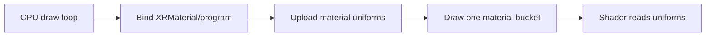
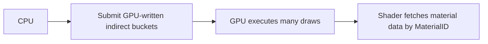
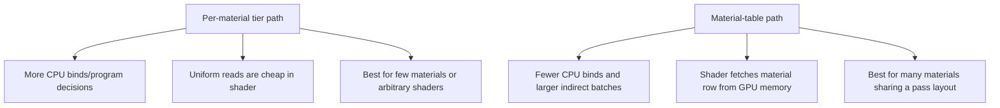
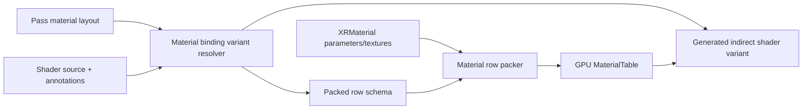
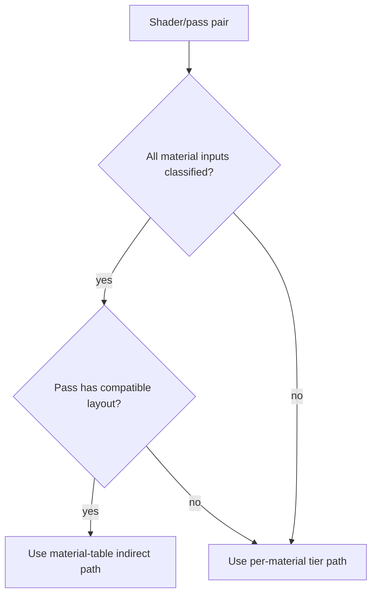

# Dynamic Indirect Material Bindings

Status: in progress (extends [bindless-deferred-texturing-plan.md](../texturing/bindless-deferred-texturing-plan.md); upgrade path referenced from [material-binding-policy.md](../../../architecture/rendering/material-binding-policy.md))
Last updated: 2026-05-14

## Implementation Status

The first implementation slice is active on branch
`rendering-dynamic-indirect-material-bindings`. It adds immutable material
binding layout descriptors, layout validation, shader binding manifest
metadata, generated OpenGL material-table GLSL, layout-driven opaque deferred
row packing, pass-level layout exposure, resolver outcomes, and render
diagnostics for layout hash/fallback reasons. The generated material-table
path now forwards a flat material id from the generated indirect vertex shader
and loads missing rows through layout defaults.

Still pending: editor/runtime visual smoke for `MaterialTable` and
`BindlessMaterialTable`, Forward+ material-table promotion, Vulkan
descriptor-indexing runtime validation, material/shader inspector UI, and final
merge back to `main`.

## Problem

`GpuIndirectZeroReadback` can submit many visible draws without asking the CPU which draws survived culling. That is the right direction for production rendering, but it changes the material-binding problem.

Traditional material rendering relies on CPU state changes:



The fastest GPU-driven path wants a smaller CPU loop:



Uniforms are program state, not per-indirect-draw data. If one indirect draw call contains multiple materials, material values must live in GPU-addressable storage such as SSBO rows, descriptor indices, or bindless texture handle tables.

The current OpenGL material-table implementation is intentionally narrow. The C# `GPUMaterialEntry` in `XREngine.Runtime.Rendering/Rendering/Materials/GPUMaterialTable.cs` packs a fixed 12-uint / 48-byte opaque-deferred row:

```text
MaterialEntry
  uint AlbedoHandleIndex
  uint NormalHandleIndex
  uint RMHandleIndex
  uint Flags
  vec4 BaseColorOpacity
  vec4 RMSE
```

That fixed row is enough for standard color/roughness/metallic/specular/emission deferred materials, but it is not a general material binding system.

Worse, there are currently **two parallel GLSL definitions of `MaterialEntry`** for the same SSBO at binding 11:

- `HybridRenderingManager.CreateMaterialTableFragmentShader` inlines the full 12-uint row (4 uints + `BaseColorOpacity` + `RMSE`) and is the version actually used by the `MaterialTable` / `BindlessMaterialTable` zero-readback paths.
- `Build/CommonAssets/Shaders/Common/MaterialTable.glsl` still declares a 4-uint row (handle indices + `Flags`) with a stale `// Layout must match GPUMaterialEntry packing in C# (16 bytes / 4 uints per entry)` comment. `Build/CommonAssets/Shaders/Graphics/BindlessMesh.frag` consumes that header and therefore reads a wrong-sized row.

A generated material-record layout is the correct fix for both: it removes the hand-edited shared header and replaces the inlined string-builder shader with a single source of truth keyed off the pass-declared layout.

## Goals

- Let render pipelines and passes declare the material data layout they need.
- Let shader source opt into material-table conversion with explicit annotations.
- Preserve the fastest zero-readback path for compatible shaders.
- Keep arbitrary/custom shaders correct by falling back to per-material tier draws when conversion is unsafe.
- Support both OpenGL bindless handles and Vulkan descriptor indexing from the same logical material layout.
- Avoid per-frame allocations and avoid draw-time shader parsing or layout synthesis.

## Non-Goals

- Do not infer every arbitrary shader uniform as material data.
- Do not require every shader to use material-table rendering.
- Do not make texture arrays the generic fallback for material diversity.
- Do not mutate shader source in place at draw time.

## Performance Answer

Dynamic material binding is not automatically slower. It trades CPU binding work for GPU material fetch work.



Expected cost profile:

| Path | CPU cost | GPU cost | Best case |
|------|----------|----------|-----------|
| Per-material tier | Higher; one bind/program path per material bucket | Lower per-fragment material access | Few materials, custom shaders, heavy shader work where CPU is not the bottleneck |
| Material table | Lower; one pass/pipeline family can cover many materials | One or more material-table loads in shader | Many materials, GPU-driven culling, bindless/descriptor-indexed textures |

The material-table path can be slower if the generated record is large, if it forces divergent branches in hot fragment code, or if it fetches fields that the shader does not use. The design must therefore generate compact per-layout records, cache variants, and only select the material-table path when the shader/pass combination is compatible.

The fastest generated path should:

- pass `MaterialID` or a material-table row index as a flat vertex-to-fragment value when the fragment shader needs it (the current path resolves it in the fragment shader via `floatBitsToUint(FragTransformId)` -> `Draws[drawID].MaterialID` against the `DrawMetadata` SSBO emitted by `DefaultVertexShaderGenerator`/`AppendDrawMetadataGlsl`; the layout system should keep that as a fallback and prefer forwarding from the vertex stage when possible)
- pack fields into `vec4`/`uvec4` lanes so `std430` does not insert scalar padding (the existing `GPUMaterialEntryWords` packer already does this for the hardcoded row)
- separate rarely used or large data into secondary tables
- only update dirty material rows
- keep static feature choices in shader variants instead of per-fragment table branches

## Binding Scopes

Every shader input used by an indirect-compatible variant must be classified into one of these scopes:

| Scope | Storage | Examples |
|-------|---------|----------|
| `frame` | regular uniform/UBO set once per frame | time, render settings |
| `camera` | regular uniform/UBO set per camera/view | view/projection matrices, camera position |
| `pass` | regular uniform/UBO set per render pass | shadow atlas data, G-buffer mode |
| `draw` | draw metadata / command buffer | transform id, object id, skin id |
| `instance` | instance buffer | per-instance matrix, instance color |
| `material` | material table row | base color, roughness, material toggles |
| `texture` | material row index into bindless/descriptor table | albedo map, normal map |
| `static` | generated shader literal/define | feature enables, static Uber properties |

Unclassified uniforms must not be silently converted. A shader with unclassified uniforms is still valid, but it should render through the per-material tier path unless the pipeline explicitly allows a conservative fallback.

## Pipeline-Declared Layouts

The render pipeline/pass is the authority for output targets and material record shape. Shader annotations help classify source fields; they do not replace the pass contract.

Example conceptual C# descriptor:

```csharp
MaterialBindingLayout deferredOpaque = MaterialBindingLayout.Create("DeferredOpaque")
    .ForRenderPass(EDefaultRenderPass.OpaqueDeferred)
    .Outputs(
        new("AlbedoOpacity", location: 0, type: "vec4"),
        new("Normal", location: 1, type: "vec2"),
        new("RMSE", location: 2, type: "vec4"),
        new("TransformId", location: 3, type: "uint"))
    .Fields(
        new("BaseColorOpacity", "vec4", semantic: "baseColorOpacity", defaultValue: "vec4(1,1,1,1)"),
        new("RMSE", "vec4", semantic: "roughnessMetallicSpecularEmission", defaultValue: "vec4(1,0,1,0)"))
    .Textures(
        new("Albedo", semantic: "albedo", dimensionality: "2D"),
        new("Normal", semantic: "normal", dimensionality: "2D"),
        new("MetallicRoughness", semantic: "metallicRoughness", dimensionality: "2D"));
```

The same model applies to forward+ passes. A forward+ pass would declare its own output contract, light-list bindings, and material fields. It should not reuse the opaque deferred G-buffer row unless its shader actually writes the deferred outputs.

## Shader Annotations

The Uber shader already uses source comments such as `//@feature(...)` and `//@property(...)`. Dynamic indirect bindings should reuse that style and add binding-oriented metadata.

Recommended directives:

```glsl
//@binding(name="BaseColor", scope=material, semantic=baseColor, storage=field, default="vec3(1.0)")
uniform vec3 BaseColor;

//@binding(name="Opacity", scope=material, semantic=opacity, storage=field, default="1.0")
uniform float Opacity;

//@binding(name="Texture0", scope=texture, semantic=albedo, storage=bindless)
layout(binding = 0) uniform sampler2D Texture0;

//@binding(name="ViewMatrix", scope=camera, storage=uniform)
uniform mat4 ViewMatrix;
```

For Uber shader properties, `//@property(...)` can grow optional indirect-binding keys:

```glsl
//@property(name="_Color", display="Tint", mode=static, indirect=field, semantic=baseColor)
uniform vec4 _Color;

//@property(name="_MainTex", display="Albedo Map", slot=texture, indirect=texture, semantic=albedo)
layout(binding = 0) uniform sampler2D _MainTex;
```

Rules:

- `scope=material` values become material-table fields.
- `scope=texture` samplers become material-table texture indices.
- `scope=static` or `mode=static` values stay in generated variants as literals/defines.
- `scope=frame`, `scope=camera`, and `scope=pass` remain normal uniforms or UBO fields.
- Missing scope on a user-authored shader is a validation warning, not an implicit material-table conversion.

## Variant Resolver

The shader source variant resolver can convert uniforms for the fastest path when three inputs agree:

1. The render pass declares a compatible `MaterialBindingLayout`.
2. The shader source has enough annotations or known-engine metadata to classify all required inputs.
3. The material instance can provide the required values or defaults.



Generated shader strategy:

1. Parse GLSL declarations and binding annotations.
2. Remove or suppress material-scoped uniform declarations in the indirect variant.
3. Emit a generated material record struct and `XRE_LoadMaterial(...)`.
4. Replace material uniform references with material record accesses.
5. Replace material sampler references with bindless/descriptor-indexed texture access when the backend supports it.
6. Leave frame/camera/pass uniforms on the regular binding path.
7. Cache the generated variant by source hash, pass layout hash, backend feature mask, and static property hash.

Use the existing `XR_` shader-helper prefix (matching `XR_CombineHandle` and `XR_MATERIAL_TABLE_GLSL` in `Build/CommonAssets/Shaders/Common/MaterialTable.glsl`). The current baseline binding slots are `MaterialTableSsboBinding = 11` for the material row table and `MaterialTextureHandleTableSsboBinding = 17` for the texture handle table; generated variants must keep those slot numbers unless the entire runtime is updated.

Example generated shape:

```glsl
struct XR_MaterialRecord
{
    vec4 BaseColorOpacity;
    vec4 RMSE;
    uint AlbedoIndex;
    uint NormalIndex;
};

layout(std430, binding = 11)
readonly buffer XR_MaterialTableBuffer
{
    XR_MaterialRecord XR_MaterialTable[];
};

flat in uint XR_FragMaterialId;

void XR_LoadMaterial(out XR_MaterialRecord material)
{
    material = XR_MaterialTable[XR_FragMaterialId];
}
```

Reference substitution can be implemented with explicit generated aliases for value uniforms:

```glsl
#define BaseColor XR_Material.BaseColorOpacity.rgb
#define Opacity XR_Material.BaseColorOpacity.a
#define Roughness XR_Material.RMSE.x
```

Sampler conversion is harder than value conversion because GLSL opaque sampler variables cannot always be treated like ordinary values. The existing engine-side helper is `SampleBindlessTexture(handleIndex, uv, fallback)` (generated today inside `CreateMaterialTableFragmentShader`); the long-term stable approach is to lift that into a shared `XR_TEXTURE2D` helper that the resolver can lower to either a regular sampler lookup or a bindless/descriptor-indexed lookup:

```glsl
vec4 albedo = XR_TEXTURE2D(Texture0, uv);
```

Arbitrary `texture(Texture0, uv)` rewriting should be a later phase and should require a real GLSL transform, not ad hoc string replacement.

## Forward+ And Custom Shader Behavior

Forward+ requires more than a layout descriptor today. The `EZeroReadbackMaterialDrawPath` switch in `HybridRenderingManager` (`ActiveBucketList` / `MaterialTable` / `BindlessMaterialTable` / per-material tiers) is currently hardcoded to `EDefaultRenderPass.OpaqueDeferred` (see the early-out in `RenderZeroReadbackMaterialTableBuckets`). Enabling forward+ therefore needs two changes together: a pass-declared `MaterialBindingLayout` for forward+, and either a new draw-path branch or a generalization of the `MaterialTable` path so it is no longer deferred-only.

The material-table system itself is not deferred-only; the current hardcoded implementation is.



Policy:

- Engine-owned deferred shaders should be upgraded first.
- Engine-owned forward+ shaders should be second, once forward+ material and lighting inputs are described as pass layouts.
- Uber shader support should use the existing `//@feature` and `//@property` metadata, plus indirect binding keys.
- Arbitrary imported or hand-authored shaders should use per-material tier rendering unless they opt into `//@binding` annotations or helper macros.

## Uniform Value Coverage

All per-material uniform values can be represented, but not all should be packed into one row.

Recommended packing model:

| Uniform kind | Material-table representation |
|--------------|-------------------------------|
| scalar/vector/matrix material values | packed field, usually grouped into vec4 lanes |
| small booleans/enums | packed flags or uint fields |
| static feature toggles | shader variant define, not table field |
| animated material values | table field updated when dirty |
| textures | handle/descriptor index in material row |
| large arrays | secondary material data buffer, indexed from main row |
| engine/camera/pass values | normal uniform/UBO, not material row |

The packer should only upload rows for dirty materials. Editing one material color should not rewrite the full material table.

## Safety And Fallback

The resolver must produce one of three outcomes:

- `MaterialTableCompatible`: generate or reuse indirect material-table variant.
- `PerMaterialRequired`: use per-material tier path because the shader has unclassified uniforms, unsupported samplers, or unsupported output contract.
- `Invalid`: fail validation because the shader claimed compatibility but required fields are missing or type-incompatible.

Validation should appear in the shader/material inspector and in render diagnostics. It should not silently render with missing material data.

## Backend Mapping

OpenGL:

- Material rows are SSBO records.
- Textures are two-level bindless handles: `MaterialEntry -> handle index -> 64-bit handle`.
- Fallback without bindless can support value-only material rows and per-material texture binding, but it cannot batch arbitrary texture diversity in one material-table draw.

Vulkan:

- Material rows are SSBO or storage-buffer records.
- Textures use descriptor indexing with `nonuniformEXT` where needed.
- Pipeline layout validation must include material table and descriptor-indexed texture bindings.

## Implementation Plan

1. Introduce `MaterialBindingLayout`, `MaterialBindingField`, and `MaterialTextureBinding` descriptors.
2. Let render pipeline passes expose a material binding layout for each pass family.
3. Extend shader manifest parsing with `//@binding(...)` and optional `indirect=...` keys on `//@property(...)`.
4. Add a resolver that classifies uniforms into binding scopes and reports compatibility.
5. Generate material-table structs, aliases, and loader code from the layout. Replace both existing definitions of `MaterialEntry` (the inlined version in `HybridRenderingManager.CreateMaterialTableFragmentShader` and the stale 4-uint version in `Build/CommonAssets/Shaders/Common/MaterialTable.glsl`) with output from this generator, keeping SSBO binding 11 for the row table and 17 for the texture handle table.
6. Add a material row packer generated or cached from the same layout; share its lane-packing rules with the existing `GPUMaterialEntryWords` `PackMaterialEntry` path so dirty-row uploads stay allocation-free.
7. Convert standard opaque deferred shaders from the current hardcoded row to the dynamic layout path.
8. Generalize the `EZeroReadbackMaterialDrawPath.MaterialTable` / `BindlessMaterialTable` dispatch so it is no longer hardcoded to `EDefaultRenderPass.OpaqueDeferred`, then add forward+ layout support once the forward+ pass contract is explicit.
9. Add Uber shader support by mapping existing `//@property` metadata into material fields, texture indices, and static variants.
10. Keep custom arbitrary shaders on per-material tier rendering until they opt in.

## Acceptance Criteria

- Standard opaque deferred materials render correctly through `MaterialTable` and `BindlessMaterialTable` without hardcoded `GPUMaterialEntry` fields.
- Adding a new annotated material field changes the layout hash, generated shader, and packer deterministically.
- Unknown material uniforms force `PerMaterialRequired`, not incorrect material-table rendering.
- Standard forward+ material-table rendering is possible with a pass-declared forward+ layout.
- Uber shader variants can choose material-table compatibility from authored state and annotations.
- Per-material tier rendering remains available and correct for arbitrary shaders.
- No shader parsing, layout synthesis, or allocation occurs in the per-frame hot draw path.
