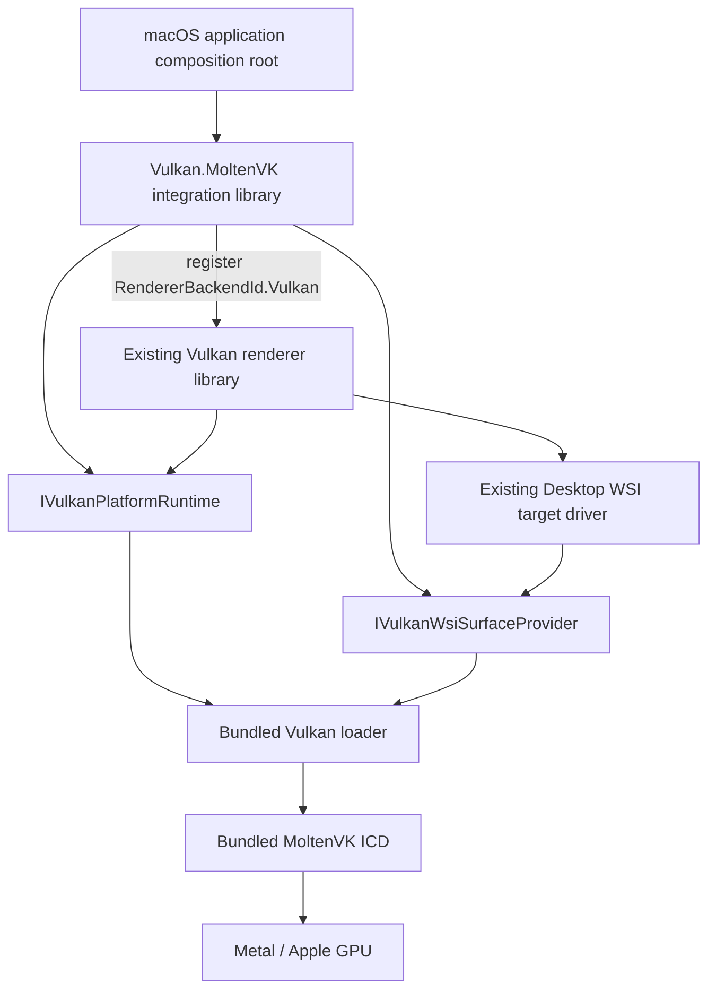

# MoltenVK Vulkan Renderer Integration Design

Status: proposed  
Last updated: 2026-08-13  
Initial target: macOS 14 or later on Apple Silicon  
Engine graphics API: Vulkan  
Native implementation: Vulkan Loader -> MoltenVK -> Metal

## Purpose

This document defines the renderer changes required to run XRENGINE's existing Vulkan backend on Apple Metal through MoltenVK. It deliberately does not define a native Metal renderer. The engine continues to record Vulkan commands, consume SPIR-V, and expose the Vulkan backend to runtime and editor code; MoltenVK translates those commands and shaders to Metal.

The broader [Apple Platform and MoltenVK Support Design](../platform/apple-platform-moltenvk-support-design.md) remains authoritative for the macOS application host, project portability, input, editor behavior, dependency acquisition, `.app` construction, signing, notarization, CI, and later Apple products. This companion document is the implementation contract for the renderer boundary itself.

## Decision Summary

1. **Reuse `VulkanRenderer`; do not create `MetalRenderer` or `MoltenVkRenderer`.** MoltenVK is a Vulkan implementation, not another XRENGINE rendering API.
2. **Keep the public renderer identity Vulkan.** `RuntimeGraphicsApiKind.Vulkan` and `RendererBackendId.Vulkan` remain unchanged. A separate implementation identity reports `NativeVulkan` or `MoltenVK` for diagnostics, feature-profile selection, and cache keys.
3. **Add one narrow integration library, not another renderer backend.** `XREngine.Runtime.Rendering.Vulkan.MoltenVK` implements platform services consumed by `XREngine.Runtime.Rendering.Vulkan`. It may register the Vulkan backend for a macOS composition root, but it must not register a second backend ID.
4. **Keep target mode separate from platform implementation.** Desktop WSI, headless WSI, presentationless, and OpenXR remain execution modes. MoltenVK does not introduce a fifth target mode.
5. **Use the official Vulkan loader with the bundled MoltenVK ICD.** Release builds resolve the signed bundle contents deterministically and do not depend on a developer Vulkan SDK, Homebrew, or ambient environment variables.
6. **Negotiate an `AppleMoltenVkBaseline` from Vulkan capabilities.** Operating-system checks select composition; Vulkan extensions, features, portability properties, formats, and limits decide renderer behavior.
7. **Never silently switch graphics APIs or hide a requested accelerated path.** Missing baseline requirements stop startup with a structured report. Optional renderer strategies are filtered before use and display the reason they are unavailable.
8. **Keep SPIR-V as the renderer shader artifact.** MoltenVK owns SPIR-V-to-MSL translation. Native MSL is not a second shader source of truth.
9. **Start with the managed Vulkan allocator as an explicit macOS bootstrap profile.** Promote a macOS VMA bridge only after its dylib build, correctness, and performance are validated.

## Scope

The first milestone covers one macOS desktop window rendered by the normal Vulkan default pipeline on Apple Silicon. It includes:

- bundled Vulkan-loader and MoltenVK resolution;
- portability-aware instance and device creation;
- `CAMetalLayer` desktop presentation through `VK_EXT_metal_surface`;
- swapchain, resize, Retina, minimize, and loss handling;
- capability-based selection of existing renderer strategies;
- shader and pipeline cache identity for MoltenVK;
- explicit exclusion of Windows-only Vulkan integrations;
- renderer diagnostics and physical-device validation.

The following are not part of this renderer milestone:

- a native Metal RHI or Metal shader frontend;
- iOS, iPadOS, tvOS, or visionOS application hosts;
- OpenXR, OpenVR, SteamVR, detached ImGui platform windows, or multi-window presentation;
- MetalFX, Streamline, DLSS, CUDA, DirectStorage, or Win32 external-handle interop;
- feature parity for ray tracing, mesh shaders, geometry shaders, transform feedback, or tessellation when the selected Vulkan portability device cannot supply them;
- macOS shell, input, packaging, signing, or notarization work already owned by the platform design.

## Existing Architecture to Preserve

The current Vulkan backend already has the right high-level split:

- `IVulkanRendererTargetDriver` describes Desktop WSI, headless WSI, presentationless, and OpenXR output requirements;
- `VulkanDesktopWsiTargetDriver` obtains surface extensions from the window provider;
- `VulkanTargetSurfaceAuthority` owns Vulkan surface creation and destruction;
- `VulkanDeviceContext` owns instance, physical-device, logical-device, extension, feature, and capability bootstrap;
- `VulkanFeatureProfile` and explicit capability policy select renderer features;
- `VulkanShaderCompiler` produces SPIR-V with shaderc;
- `VulkanFrameLoop` sequences target resources, device creation, output, swapchain, synchronization, rendering, and present.

MoltenVK integration extends these seams. It does not duplicate the render graph, commands, resource wrappers, materials, passes, or frame loop.

Current blockers are project and bootstrap assumptions rather than a missing renderer:

| Area | Current assumption | Required renderer change |
| --- | --- | --- |
| Vulkan project | `net10.0-windows7.0`, Win32 extras, OpenVR, Windows VMA project, and NVIDIA DLL copy rules | Make the core Vulkan assembly portable and move or condition RID/vendor integrations so they are absent from the macOS load graph. |
| Loader | The Vulkan API is acquired without a bundle-specific implementation contract | Inject a platform runtime that resolves the bundled loader and records loader/ICD identity before instance creation. |
| Instance | Extensions are aggregated, but instance create flags do not include portability enumeration | Add platform-contributed extensions and instance flags; negotiate the loader API version. |
| Device | Normal desktop Vulkan extensions and optional features drive admission | Enable `VK_KHR_portability_subset` whenever advertised and query its features, properties, and relevant numeric limits. |
| Surface | Desktop surface creation calls Silk window `VkSurface` directly | Retain the Silk path where it returns the correct Metal surface support, behind an explicit surface-provider contract that can also wrap an AppKit-owned `CAMetalLayer`. |
| Interop | Win32 external-memory/semaphore and vendor services live near baseline device bootstrap | Move them behind optional, platform-specific capability contributors; they cannot affect macOS device admission. |
| Allocator | Native VMA bridge is built and copied as a Windows DLL | Select the managed allocator explicitly until a signed macOS dylib is available. |
| Cache | Shader artifacts use a repository-relative path and incomplete compiler identity | Use the macOS user cache directory and include implementation, device, profile, compiler, and target identities. |

## Proposed Module Boundary



### Core Vulkan integration contract

Add a small public backend-integration contract under `XREngine.Runtime.Rendering.Vulkan`, for example:

```csharp
public interface IVulkanPlatformRuntime
{
    VulkanImplementationIdentity Identity { get; }
    Vk AcquireApi(VulkanLoaderRequest request);
    VulkanInstancePlatformRequirements GetInstanceRequirements(
        VulkanInstanceDiscovery discovery);
    VulkanDevicePlatformRequirements GetDeviceRequirements(
        VulkanPhysicalDeviceSnapshot device);
    string GetPipelineCacheRoot();
    VulkanPlatformDiagnosticSnapshot CaptureDiagnostics();
}
```

The actual names may follow nearby code style, but the contract must have these properties:

- it is immutable after renderer construction;
- it contributes facts to bootstrap rather than creating or retaining the renderer;
- it has no dependency on scene, material, render-graph, or editor types;
- it exposes standard Vulkan requirements wherever Vulkan can express them;
- it exposes MoltenVK-specific information for configuration and diagnostics only;
- it is injected into `VulkanRendererBackendFactory` by the composition root, not discovered through reflection or mutable global state.

`VulkanNativePlatformRuntime` preserves the existing native-Vulkan behavior. `MoltenVkPlatformRuntime` lives in `XREngine.Runtime.Rendering.Vulkan.MoltenVK` and supplies the macOS implementation. Static registration is the initial macOS model; renderer hot reload may retain the same immutable platform runtime across generations but must not reload native loader or ICD ownership mid-device.

### Surface-provider contract

Desktop WSI also needs an explicit provider, either as a capability of the render window or the presentation target:

```csharp
public interface IVulkanWsiSurfaceProvider
{
    IReadOnlyList<string> RequiredInstanceExtensions { get; }
    VulkanSurfaceMetrics GetMetrics();
    SurfaceKHR CreateSurface(Vk api, Instance instance);
}
```

On the existing GLFW/Silk path, this provider delegates to `Window.VkSurface`. On an AppKit-specific path, it retains the AppKit-owned view and `CAMetalLayer` handles and creates the Vulkan surface with `VK_EXT_metal_surface`. `VulkanDesktopWsiTargetDriver` remains the target driver in either case.

This refactor also removes concrete-driver tests such as “is `VulkanDesktopWsiTargetDriver`” from frame initialization. Swapchain initialization must depend on `RequiresSwapchainOutput` or a target-output interface so every desktop WSI provider follows the same lifecycle.

## Bootstrap Contract

### 1. Resolve the loader before acquiring `Vk`

The platform runtime resolves the signed Vulkan loader from the `.app` bundle before any window or renderer code asks Silk for Vulkan entry points. The macOS composition must prove that windowing and `VulkanDeviceContext` use the same loader.

Release startup fails if any of the following are true:

- the loader, MoltenVK dylib, or ICD manifest is missing;
- the native architecture does not match the process;
- the manifest resolves outside the application bundle;
- an unexpected ambient loader or ICD was selected;
- code signing invalidates a required native component.

The exact bundle layout and relocatable ICD discovery mechanism are owned by the platform design. Directly linking MoltenVK is allowed only as an explicit diagnostic experiment, not as the normal release route.

### 2. Discover before deciding

Before constructing `VkInstanceCreateInfo`, enumerate:

- loader-supported Vulkan API version;
- available instance extensions and validation layers;
- target-required surface extensions;
- platform-required extensions and instance flags;
- optional diagnostics extensions.

The engine requests its tested Vulkan version bounded by the loader version. A lower version is not automatically accepted; the resolved capability profile still has to satisfy every baseline requirement.

For a loader-mediated MoltenVK instance:

- enable `VK_KHR_portability_enumeration` when available;
- set `VK_INSTANCE_CREATE_ENUMERATE_PORTABILITY_BIT_KHR` only when that extension is enabled;
- enable `VK_KHR_surface` and `VK_EXT_metal_surface` for the Metal WSI provider;
- keep validation and debug-utils optional and presence-checked.

`VulkanDeviceBootstrapRequest` should gain an immutable `Platform` requirement value containing extensions, instance flags, implementation identity, and requested API bounds. Target, OpenXR, Streamline, validation, and platform contributions remain separately labeled in diagnostics. The macOS baseline excludes OpenXR and Streamline contributors from the build and request rather than passing empty Windows services through startup.

### 3. Enumerate and score physical devices

Extend `VulkanDeviceCapabilityQuery` so each candidate snapshot contains:

- standard Vulkan features and properties already used by the backend;
- queue-family and surface presentation support;
- formats, present modes, image-count bounds, usage flags, and composite alpha;
- descriptor and buffer numeric limits used by current submission strategies;
- memory heaps, types, budgets, and host-coherency limits;
- advertised `VK_KHR_portability_subset` state;
- `VkPhysicalDevicePortabilitySubsetFeaturesKHR` and `VkPhysicalDevicePortabilitySubsetPropertiesKHR` when applicable;
- implementation, driver, vendor, device, and API identity for reporting and cache keys.

If a physical device advertises `VK_KHR_portability_subset`, Vulkan requires the application to enable that device extension. Failure to enable it is a bootstrap bug, not an optional compatibility choice.

Device selection produces a structured report for every rejected candidate. Apple unified memory must not be scored as an inferior “integrated GPU” solely because it does not resemble a discrete Windows GPU.

### 4. Build the logical device from an exact intersection

Logical-device creation enables only the intersection of:

- engine baseline requirements;
- selected feature profile;
- core and extension features reported by the candidate;
- portability-subset restrictions;
- target and platform device extensions;
- numeric limits required by the selected resource and submission strategies.

The existing explicit feature-chain approach should remain. Add portability structures only when their extension is advertised and queried. Win32 external-memory/semaphore entry points, Streamline, OpenVR, and NVIDIA services become optional leaf capabilities and are never loaded for the macOS baseline.

## `AppleMoltenVkBaseline` Profile

`AppleMoltenVkBaseline` is a named negotiated result, not an OS preset. It represents the smallest feature set that can run the rasterized editor and default pipeline correctly on the pinned loader/MoltenVK pair.

Required behavior:

- graphics and compute queues, plus transfer operations on available queues;
- desktop surface and swapchain presentation;
- supported SDR color and depth/stencil attachment formats;
- sampled and storage images;
- uniform and storage buffers;
- push constants within queried limits;
- render-graph synchronization through a validated core or extension path;
- dynamic rendering or the existing tested render-pass path;
- timestamps only when supported and reliable;
- at least one material/descriptor strategy sized from actual device limits;
- one validated CPU-direct or standard indirect mesh submission path.

Optional features are resolved before pipeline or resource creation:

| Capability | Initial policy |
| --- | --- |
| Dynamic rendering and synchronization 2 | Prefer when reported; keep one tested baseline path for the pinned profile. |
| Timeline semaphores | Use only when reported and validated; otherwise select an existing compatible synchronization path. |
| Descriptor indexing/bindless | Size tables from the reported semantics and limits. Select bounded descriptors when the full engine contract is unavailable. |
| Buffer device address | Require all feature bits and a validated Metal argument-buffer capability. |
| Indirect-count and GPU-driven submission | Enable only when the complete submission-strategy contract is met. Never read counters back to the CPU as a hidden fallback. |
| Geometry, tessellation, transform feedback, mesh/task shaders | Not baseline requirements. Remove dependent strategies and shaders from candidates when unsupported. |
| Ray tracing | Not a baseline requirement. Report unavailable; do not construct RT resources or compile RT stages. |
| Sparse resources | Not a baseline requirement. Use the non-sparse texture/resource policy selected before allocation. |
| External memory/semaphore interop | Platform-specific and excluded from the first macOS profile. |
| Vendor upscalers and low-latency services | Excluded from the macOS load graph and capability candidates. |

If the user explicitly selects an unsupported accelerated strategy, startup or settings application must reject it with the missing capability list. Automatic strategy selection may choose a supported GPU or CPU-submission strategy, but it may not change graphics APIs or pretend an unavailable GPU feature is active.

## Metal Surface and Swapchain

### Ownership

AppKit owns the window, view, and `CAMetalLayer`. Their lifetime must exceed the Vulkan surface and every swapchain created from it. AppKit lifecycle work stays on the main thread; render submission remains under the renderer's threading contract.

For correct display timing when a window moves between displays, the `CAMetalLayer` delegate should be the containing `NSView`, following MoltenVK guidance. Renderer code receives opaque handles and pixel metrics, not AppKit types.

### Pixel size and Retina

The surface provider publishes both logical client size and drawable pixel size. Swapchain extent uses the current framebuffer/drawable size, including backing-scale changes. A content-scale event invalidates size-dependent resources even when the logical window dimensions did not change.

The frame loop must tolerate a zero drawable size while minimized or occluded without busy-spinning, leaking acquired images, or fabricating a CPU-rendered frame.

### Negotiation

Every swapchain generation queries and records:

- surface capabilities and supported usage flags;
- formats and color spaces;
- present modes;
- min/max image counts and chosen image count;
- current transform and supported composite alpha;
- drawable size and backing scale.

FIFO is the safe presentation baseline. Other present modes are selected only when advertised and measured. Prefer three images when the surface permits it, but never violate reported bounds. HDR/EDR is a later profile; first delivery requires correct SDR output.

### Recovery

Handle `SuboptimalKHR`, `ErrorOutOfDateKHR`, surface loss, device loss, resize, backing-scale change, display sleep/wake, and application activation as explicit state transitions. Destruction order is:

1. stop new frame acquisition;
2. retire or wait for target-owned GPU work;
3. destroy swapchain views and swapchain;
4. destroy Vulkan surface;
5. release the layer/view/window through the host.

## Shaders and Pipelines

The engine retains this pipeline:

```text
XRENGINE shader source -> shaderc -> SPIR-V -> Vulkan pipeline -> MoltenVK -> MSL/Metal pipeline
```

Required changes:

1. Set explicit shaderc Vulkan target environment and SPIR-V target versions.
2. Validate SPIR-V during development and CI asset cooking.
3. Compile a portability corpus containing every shader stage, descriptor form, storage access, specialization constant, render-target convention, and default-pipeline family.
4. Exclude unsupported shader stages through the negotiated feature profile before compilation and pipeline creation.
5. Validate clip space, framebuffer origin, front-face winding, depth range, array layers, shadow comparison, atomics, and image-format behavior through rendered reference scenes.
6. Treat translated MSL as opt-in diagnostic output. Do not edit or ship it as canonical source.

Shader artifact and pipeline cache identity must include:

- engine shader ABI and source hash;
- shaderc, SPIR-V target, and validation-tool versions;
- negotiated feature-profile hash;
- Vulkan API and implementation identity;
- MoltenVK version;
- physical-device and driver identifiers;
- pipeline layout and attachment formats.

Runtime caches live in the normal versioned macOS per-user cache location, not under repository-relative `Build/Cache`. Corrupt or incompatible caches are discarded with a diagnostic. Measure cold and warm pipeline creation because SPIR-V-to-MSL and Metal pipeline compilation can dominate startup.

## Memory Allocation

Phase 1 uses the existing managed Vulkan allocator through an explicit `AppleMoltenVkManaged` allocator choice. Startup reports that choice; a failed VMA load must not be caught and silently converted to managed mode.

In parallel, port `VulkanMemoryAllocatorBridge.Native` to a cross-platform CMake build that produces signed `osx-arm64` and later `osx-x64` dylibs with the same C ABI. Promote it only after:

- allocation, mapping, flush/invalidate, aliasing, and destruction validation;
- memory-budget and out-of-memory behavior;
- fragmentation and transient-allocation stress;
- cold-start and representative-frame performance comparisons;
- clean bundle resolution and code-signing validation.

Allocator policy must understand unified memory. Select memory types from required properties and measured behavior rather than discrete-GPU heuristics; still honor non-coherent atom sizes and explicit synchronization.

## Configuration and Diagnostics

Prefer Vulkan-standard configuration and diagnostics. Use `VK_EXT_layer_settings` for MoltenVK settings when the pinned stack supports it. Do not make MoltenVK private APIs a shipping dependency because they are tied to direct linking rather than the loader/ICD contract.

The startup report must show:

- resolved loader path, architecture, and API version;
- resolved ICD manifest and MoltenVK library/version;
- renderer backend ID and Vulkan implementation identity;
- requested, available, enabled, and missing instance extensions and flags;
- all physical-device candidates and structured rejection reasons;
- portability-subset features and properties;
- selected `AppleMoltenVkBaseline` capabilities and disabled strategies;
- surface format, color space, present mode, image count, drawable size, and scale;
- allocator backend;
- shader target and cache identity;
- validation and debug-setting state.

Development validation uses Vulkan validation layers through the loader, MoltenVK logs, Xcode Metal capture, Metal API Validation, and Instruments. Release performance measurements must disable Xcode's debug-executable and Metal capture/validation facilities because they materially alter performance.

## Implementation Phases

### Phase 0: Portable build graph

- Retarget the Vulkan core assembly and its portable dependencies so `osx-arm64` can restore and publish.
- Split or condition Win32 extras, OpenVR/OpenXR, Streamline/NVIDIA, native VMA, and DLL-copy targets.
- Add the MoltenVK integration library and explicit static composition without native binaries yet.

Exit: a macOS compile proves the renderer core does not load Windows-only assemblies or assets.

### Phase 1: Loader, instance, and enumeration spike

- Pin a loader/MoltenVK/toolchain set under the repository dependency policy.
- Resolve it from an unsigned development `.app`.
- Add platform instance requirements and portability enumeration flags.
- Enumerate physical devices and emit the structured report.

Exit: an Apple Silicon machine with no Vulkan SDK installed reports the bundled loader, bundled MoltenVK ICD, and at least one portability device.

### Phase 2: Surface and clear-present

- Implement the WSI surface provider over Silk/GLFW or AppKit `CAMetalLayer`.
- Refactor swapchain setup to rely on target capabilities instead of concrete target-driver types.
- Clear, resize, minimize/restore, change Retina scale, and present continuously.

Exit: the window remains correct through repeated surface transitions with validation enabled and without lifecycle leaks.

### Phase 3: Baseline renderer

- Query portability features/properties and resolve `AppleMoltenVkBaseline`.
- Use the explicit managed allocator profile.
- Run the default raster pipeline and ImGui in one window.
- Filter optional renderer strategies before shader and resource creation.

Exit: representative scenes render correctly, unsupported features show reasons, and no graphics-API fallback occurs.

### Phase 4: Shader, cache, and allocator hardening

- Validate the shader portability corpus.
- Introduce per-user artifact and pipeline cache identities.
- Measure cold/warm startup and frame pacing.
- Port and compare the VMA bridge.

Exit: cache invalidation is deterministic and the selected allocator meets documented correctness and performance thresholds.

### Phase 5: Production qualification

- Validate the signed/notarized bundle defined by the platform design.
- Run physical-device image, stress, device-loss, memory, and performance validation.
- Establish the pinned upgrade procedure and feature-matrix artifact.

Exit: a clean Apple Silicon machine runs the signed editor/game without external Vulkan software and with no unresolved baseline validation errors.

Per repository testing policy, implement and validate each integration phase through the live macOS runtime path first. Add or expand automated tests for the integration only after the user explicitly clears test work.

## Validation Matrix

| Lane | Required evidence |
| --- | --- |
| Windows Vulkan regression | Existing native Vulkan device selection, targets, default pipeline, and caches behave unchanged. |
| macOS arm64 development | Bundled-loader proof, clear-present, default scene, ImGui, resize/scale/minimize, validation logs, and screenshots. |
| macOS arm64 release | Signed bundle on a clean machine, no SDK/Homebrew dependency, cold/warm startup, frame pacing, memory pressure, sleep/wake. |
| macOS x64 tier 2 | Compile and smoke first; publish support only after physical Intel/AMD validation. |
| Headless/presentationless regression | Platform contributions do not accidentally require Metal WSI for non-WSI targets. |
| Capability-negative | Forced unavailable strategies fail visibly with exact missing features, extensions, or limits. |

Image comparisons require tolerances appropriate to different GPU implementations; they must still catch missing passes, inverted depth, wrong winding, broken shadows, incorrect color space, and stale swapchain images. Compile-only CI is not evidence of GPU correctness.

## Risks and Mitigations

| Risk | Mitigation |
| --- | --- |
| A second “Metal renderer” forks the Vulkan backend over time | Keep one backend ID, one `VulkanRenderer`, and one render-command/resource implementation; isolate only platform bootstrap and WSI. |
| Platform services become an OS-switch dumping ground | Keep the contract Vulkan-specific, immutable, fact-oriented, and free of editor/scene types. |
| MoltenVK's advertised extensions change between releases | Pin the stack, negotiate every run, store the matrix, and requalify upgrades as a renderer change. |
| Windows-only packages still enter the macOS load graph | Enforce RID-conditional project references and native assets; validate restore/publish on macOS before runtime work. |
| Unsupported GPU-driven paths fail late | Resolve strategies from the full capability/limit snapshot before compiling shaders or allocating resources. |
| Loader and windowing use different Vulkan libraries | Acquire loader ownership before window creation and report the resolved paths used by both layers. |
| AppKit and render-thread lifetime races destroy the layer early | Make surface ownership explicit and follow the ordered target shutdown contract. |
| Unified-memory assumptions hide synchronization bugs | Continue honoring Vulkan mapping, coherence, barrier, and lifetime rules; validate under pressure. |
| Pipeline compilation makes startup unacceptable | Use complete cache identity, prewarm representative pipelines, and measure cold and warm cases on physical hardware. |
| Debug tooling distorts performance | Separate correctness captures from release-mode performance runs and record tool state. |

## Definition of Done

The MoltenVK renderer integration is complete when:

- macOS composition selects `RendererBackendId.Vulkan` and reports `MoltenVK` as its implementation;
- no duplicated Metal/MoltenVK renderer, render graph, resource wrappers, or shader system exists;
- the `.app` resolves its own loader and MoltenVK ICD on a clean Apple Silicon machine;
- portability enumeration and `VK_KHR_portability_subset` requirements are handled exactly as advertised;
- `AppleMoltenVkBaseline` produces a complete capability and rejection report;
- Desktop WSI presents through a host-owned `CAMetalLayer` with correct Retina, resize, minimize, and recovery behavior;
- the default raster pipeline and single-window ImGui editor render representative scenes correctly;
- unsupported strategies are unavailable before use and explicit requests fail visibly;
- shader and pipeline caches are keyed by the complete implementation/device/profile identity;
- allocator choice is explicit and validated;
- Windows Vulkan, headless, and presentationless behavior remains intact;
- validation layers, MoltenVK diagnostics, and Metal validation have no unresolved baseline errors;
- the pinned native dependency set has completed the repository license and dependency-report workflow.

## Repository Starting Points

- `XREngine.Runtime.Rendering.Vulkan/XREngine.Runtime.Rendering.Vulkan.csproj`
- `XREngine.Runtime.Rendering.Vulkan/Rendering/API/Rendering/Vulkan/Bootstrap/Targets/IVulkanRendererTargetDriver.cs`
- `XREngine.Runtime.Rendering.Vulkan/Rendering/API/Rendering/Vulkan/Bootstrap/Targets/VulkanDesktopWsiTargetDriver.cs`
- `XREngine.Runtime.Rendering.Vulkan/Rendering/API/Rendering/Vulkan/Bootstrap/Device/VulkanDeviceBootstrapRequest.cs`
- `XREngine.Runtime.Rendering.Vulkan/Rendering/API/Rendering/Vulkan/Bootstrap/Device/VulkanDeviceContext.Instance.cs`
- `XREngine.Runtime.Rendering.Vulkan/Rendering/API/Rendering/Vulkan/Bootstrap/Device/VulkanDeviceCapabilityQuery.cs`
- `XREngine.Runtime.Rendering.Vulkan/Rendering/API/Rendering/Vulkan/Bootstrap/Device/VulkanDeviceContext.LogicalDeviceBootstrap.cs`
- `XREngine.Runtime.Rendering.Vulkan/Rendering/API/Rendering/Vulkan/Frame/Output/Authority/VulkanTargetSurfaceAuthority.cs`
- `XREngine.Runtime.Rendering.Vulkan/Rendering/API/Rendering/Vulkan/Shaders/VulkanShaderCompiler.cs`
- `XREngine.Runtime.Rendering.Vulkan/Rendering/API/Rendering/Vulkan/Shaders/VulkanShaderArtifactCache.cs`
- `XREngine.Runtime.Rendering/Rendering/Vulkan/VulkanFeatureProfile.cs`

## Related XRENGINE Documents

- [Apple Platform and MoltenVK Support Design](../platform/apple-platform-moltenvk-support-design.md)
- [Window Creation and Renderer Initialization](../../../architecture/rendering/window-creation-and-renderer-init.md)
- [Vulkan Renderer Architecture](../../../architecture/rendering/vulkan-renderer.md)
- [Vulkan Pipeline Compilation](../../../architecture/rendering/vulkan-pipeline-compilation.md)
- [Vulkan Render-Loop Target Architecture](vulkan-render-loop-target-architecture.md)
- [Runtime Rendering Host Capability Inventory](runtime-rendering-host-capability-inventory.md)
- [Completed Vulkan Presentation-Independent Renderer Refactor](../../todo/COMPLETED/vulkan-presentation-independent-renderer-refactor-todo.md)

## External References

- [MoltenVK repository and supported-platform overview](https://github.com/KhronosGroup/MoltenVK)
- [MoltenVK Runtime User Guide](https://github.com/KhronosGroup/MoltenVK/blob/main/Docs/MoltenVK_Runtime_UserGuide.md)
- [MoltenVK Configuration Parameters](https://github.com/KhronosGroup/MoltenVK/blob/main/Docs/MoltenVK_Configuration_Parameters.md)
- [Vulkan `VK_KHR_portability_subset` reference](https://docs.vulkan.org/refpages/latest/refpages/source/VK_KHR_portability_subset.html)
- [Apple `CAMetalLayer` reference](https://developer.apple.com/documentation/quartzcore/cametallayer)
- [Apple guidance for managing a Metal game window on macOS](https://developer.apple.com/documentation/Metal/managing-your-game-window-for-metal-in-macos)
