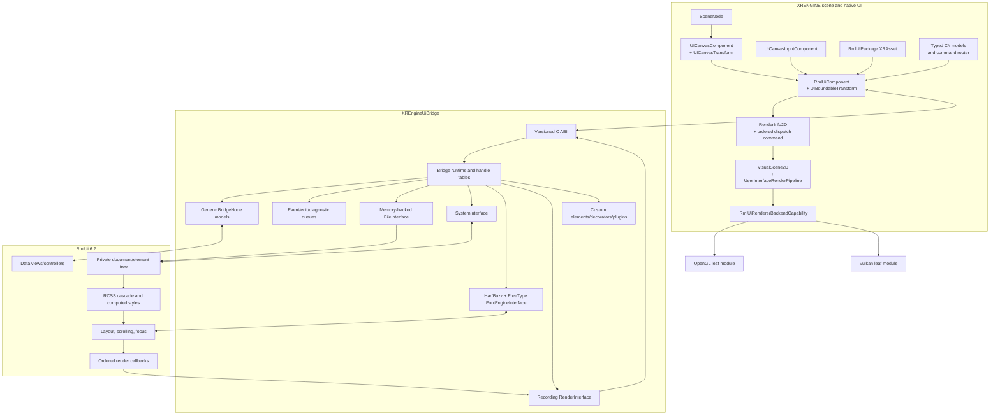
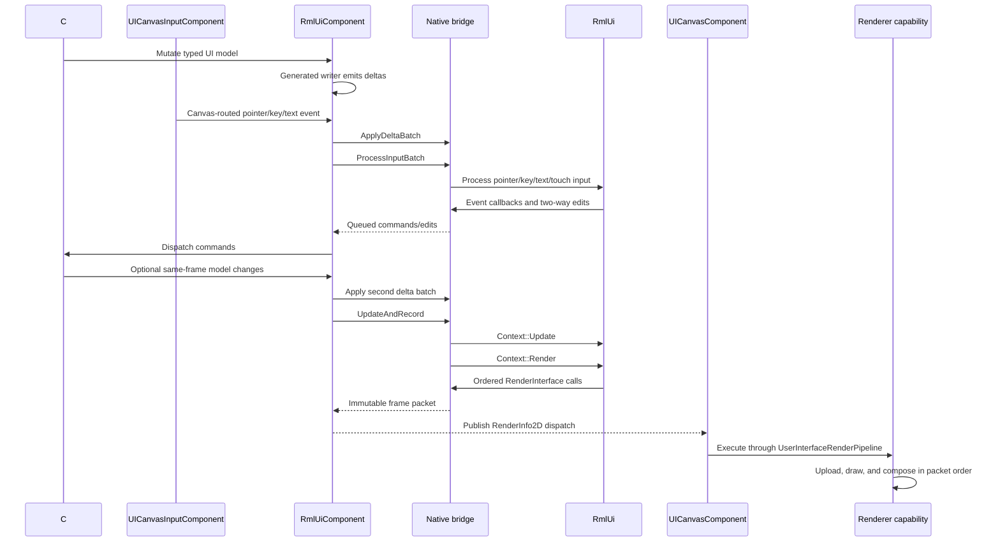

# XRENGINE Native HTML/CSS UI System

## Comprehensive Implementation Design

**Architecture:** Scene-owned `RmlUiComponent`, RmlUi 6.2 core, native C++ bridge, existing XRENGINE UI canvas/input pipeline, and OpenGL 4.6/Vulkan 1.3 backend capabilities  
**Primary target:** XRENGINE runtime and editor  
**Document status:** Proposed implementation baseline, aligned with the current native UI and scene hierarchy  
**Version:** 1.0  
**Date:** 2026-07-29  
**Audience:** Engine, rendering, tools, platform, UI, localization, and QA engineers

---

## Document purpose

This document specifies an implementation-ready extension to XRENGINE's existing native UI subsystem that adds web-like markup and styling without embedding a full browser into every game surface.

The subsystem uses:

- **RmlUi 6.2** for RML parsing, RCSS style resolution, layout, retained elements, form controls, focus, events, animation, and draw generation.
- A scene-owned **`RmlUiComponent`** on a `SceneNode` with a `UIBoundableTransform`, beneath an existing `UICanvasComponent`.
- A **small C-compatible native bridge** that owns all RmlUi C++ objects and presents a stable ABI to .NET.
- **C# gameplay models, commands, resources, and engine services** as the authoritative application layer.
- A **generic bridge-side data model** exposed to RmlUi through custom `VariableDefinition` implementations, with schema-generated managed delta writers for safety and speed.
- The existing **`UserInterfaceRenderPipeline`**, `VisualScene2D`, and backend-capability model for native rendering.
- The existing **`UICanvasInputComponent`** for canvas coordinate conversion, focus ownership, pointer selection, and device routing.
- **HarfBuzz and FreeType** for production-quality shaping, fallback, rasterization, and international text.
- **No mandatory JavaScript**. An optional, restricted Jint layer may be added after the core system ships.
- The existing **`UIWebViewComponent` / `IWebRendererBackend`** path for content that genuinely requires browser compatibility.

The intended result is analogous in philosophy to Valve Panorama: familiar HTML/CSS-style authoring, but with a bounded game-UI profile, deterministic engine integration, controller and VR support, and no claim of arbitrary website compatibility.

The existing scene and native UI hierarchy remains authoritative:

```text
SceneNode
└─ UICanvasComponent + UICanvasTransform
   ├─ optional UICanvasInputComponent on the canvas node
   └─ SceneNode
      └─ RmlUiComponent + UIBoundableTransform
         └─ private RmlUi document/element tree (not SceneNodes)
```

RmlUi MUST NOT introduce a second public scene hierarchy, canvas system, draw-space enum, input router, or independently scheduled production surface graph. It owns layout only inside the bounded rectangle represented by `RmlUiComponent`; XRENGINE owns placement of that rectangle, scene activation, canvas draw space, render scheduling, and device-to-canvas input mapping.

The editor's current day-to-day shell remains Dear ImGui while the native editor UI is unstable. This design enables RML/RCSS content inside the native UI path; it does not require replacing the ImGui shell. Initial component inspectors and DOM tooling MAY be implemented in ImGui, with equivalent native-editor panels added as that path matures.

---

## Normative language

The terms **MUST**, **MUST NOT**, **SHOULD**, **SHOULD NOT**, and **MAY** are used as engineering requirements:

- **MUST**: required for the design to be considered correctly implemented.
- **SHOULD**: strongly recommended; deviations require an architecture note.
- **MAY**: optional or product-dependent.

---

## Table of contents

1. [Executive summary](#1-executive-summary)
2. [Architecture decisions](#2-architecture-decisions)
3. [Goals, non-goals, and constraints](#3-goals-non-goals-and-constraints)
4. [Requirements](#4-requirements)
5. [XRENGINE UI Profile 1.0](#5-xrengine-ui-profile-10)
6. [System architecture](#6-system-architecture)
7. [Repository and module organization](#7-repository-and-module-organization)
8. [Native dependency and build strategy](#8-native-dependency-and-build-strategy)
9. [Native ABI design](#9-native-abi-design)
10. [Managed C# API](#10-managed-c-api)
11. [Frame lifecycle and threading](#11-frame-lifecycle-and-threading)
12. [Data-binding architecture](#12-data-binding-architecture)
13. [Event and command architecture](#13-event-and-command-architecture)
14. [Resource and asset pipeline](#14-resource-and-asset-pipeline)
15. [Render-command architecture](#15-render-command-architecture)
16. [OpenGL renderer](#16-opengl-renderer)
17. [Vulkan renderer](#17-vulkan-renderer)
18. [Advanced visual effects](#18-advanced-visual-effects)
19. [Text, fonts, shaping, and glyph atlases](#19-text-fonts-shaping-and-glyph-atlases)
20. [Input, focus, text editing, and IME](#20-input-focus-text-editing-and-ime)
21. [Screen, offscreen, world-space, and VR canvas integration](#21-screen-offscreen-world-space-and-vr-canvas-integration)
22. [Custom elements and game integration](#22-custom-elements-and-game-integration)
23. [Hot reload and tooling](#23-hot-reload-and-tooling)
24. [Performance and memory design](#24-performance-and-memory-design)
25. [Security and trust model](#25-security-and-trust-model)
26. [Localization and accessibility](#26-localization-and-accessibility)
27. [Error handling and diagnostics](#27-error-handling-and-diagnostics)
28. [Testing and CI](#28-testing-and-ci)
29. [Implementation roadmap](#29-implementation-roadmap)
30. [Risk register](#30-risk-register)
31. [Definition of done](#31-definition-of-done)
32. [Worked example](#32-worked-example)
33. [Appendix A: native ABI header skeleton](#appendix-a-native-abi-header-skeleton)
34. [Appendix B: managed interop skeleton](#appendix-b-managed-interop-skeleton)
35. [Appendix C: frame packet format](#appendix-c-frame-packet-format)
36. [Appendix D: renderer state contracts](#appendix-d-renderer-state-contracts)
37. [Appendix E: source basis](#appendix-e-source-basis)

---

# 1. Executive summary

## 1.1 Recommended implementation

XRENGINE SHOULD implement RmlUi as a retained-mode document renderer inside the existing scene-owned native UI subsystem with the following ownership split:

| Concern | Owner |
|---|---|
| Scene presence, serialization, activation, and hierarchy | `SceneNode` / `XRComponent` lifecycle |
| Canvas size, placement, screen/camera/world draw space | `UICanvasComponent` / `UICanvasTransform` |
| Placement of an HTML/CSS document region within a canvas | `RmlUiComponent` / `UIBoundableTransform` |
| RML and RCSS parsing | RmlUi |
| Style cascade and computed styles | RmlUi |
| Layout and scroll behavior inside the component bounds | RmlUi |
| Retained element tree and form controls | RmlUi |
| Native event propagation | RmlUi |
| UI data authority | C# game/editor code |
| Cross-language data representation | Native bridge model |
| Canvas hit testing, coordinate conversion, and device abstraction | `UICanvasInputComponent` and `XREngine.Runtime.InputIntegration` |
| DOM pointer capture, element focus, and text editing state | `RmlUiComponent` and its RmlUi context |
| Resource lookup and package loading | `XRAsset` / `AssetManager` integration |
| Draw recording | Native bridge `RenderInterface` |
| UI draw ordering and canvas composition | `VisualScene2D` / `UserInterfaceRenderPipeline` |
| GPU upload and API-specific packet execution | Renderer capability implemented by the OpenGL/Vulkan leaf module |
| Text shaping and rasterization | Native HarfBuzz/FreeType font engine |
| Screen/world/VR rendering and offscreen reuse | Existing `UICanvasComponent` policy |
| Optional scripting | Jint, disabled by default |
| Arbitrary web content | Existing `UIWebViewComponent` / `IWebRendererBackend` |

RmlUi is a strong fit because it converts HTML/CSS-like source into retained UI state and ordered draw operations while intentionally delegating rendering and platform interfaces to the host. Its current public release is 6.2. The official renderer matrix shows full advanced-effect support in the OpenGL 3 and DirectX 12 reference renderers, while the bundled Vulkan renderer currently covers only basic rendering and transforms. Therefore, this design treats the engine's Vulkan advanced-effects implementation as first-party work rather than assuming the sample backend is production-complete.

The public integration unit is `RmlUiComponent`, not a free-standing `UiContext` or `UiSurface`. One component owns one RmlUi context and may load multiple RML documents for modal layers or internal z-order. Multiple components can coexist as ordinary sibling UI nodes. Their contents are atomic at the XRENGINE scene-order boundary: engine-native siblings can render before or after a component, but cannot interleave between individual DOM elements inside that component.

## 1.2 Core design principle

The subsystem is **not a browser**. It is a native game UI runtime with a documented web-inspired compatibility profile.

This principle has several consequences:

1. Arbitrary internet pages are out of scope.
2. RML is treated as XML-like UI markup, not permissive browser HTML.
3. RCSS support is exactly what the engine validates and documents.
4. Unsupported CSS features fail visibly in development builds.
5. Game-native elements and properties are encouraged when they are cleaner than browser metaphors.
6. Networking, cookies, browser storage, `iframe`, WebGL, WebGPU, and service workers do not exist in the core UI runtime.
7. JavaScript is not required for ordinary UI screens.
8. Browser content is isolated behind a separate component and process/security policy.

## 1.3 Why a native C ABI

RmlUi is C++. The engine is C#. Directly mirroring the RmlUi class hierarchy into managed wrappers would create:

- Large binding maintenance cost.
- Frequent ABI breakage when C++ types change.
- Per-element P/Invoke overhead.
- Complex ownership and lifetime bugs.
- C++ standard-library types crossing module boundaries.
- Difficult exception and allocator boundaries.

The native bridge instead exposes:

- Opaque, generation-checked 64-bit handles.
- Blittable versioned structs.
- UTF-8 string views.
- Batched input and model-delta arrays.
- Drained event and diagnostic queues.
- Immutable frame packets.
- No C++ exceptions across the ABI.
- No C++ standard-library types in public signatures.
- No callbacks in per-draw or per-element hot paths.

The bridge is the compatibility firewall between managed engine code and RmlUi.

## 1.4 Why the renderer records commands

RmlUi calls its `RenderInterface` in strict paint order. The engine MUST preserve that order. Instead of making immediate OpenGL/Vulkan calls from C++, the bridge records an immutable frame packet:

```text
RmlUi Render()
    -> bridge RenderInterface callbacks
    -> ordered native command recorder
    -> immutable RmlUiFramePacket
    -> RmlUiComponent RenderCommandMethod2D
    -> UserInterfaceRenderPipeline
    -> OpenGL or Vulkan backend capability
```

This allows:

- One RmlUi integration for multiple graphics APIs.
- Render-thread ownership of GPU objects.
- GPU work to follow the existing canvas and UI render-pipeline lifecycle.
- Double- or triple-buffered UI packets.
- Deferred GPU resource destruction.
- Deterministic capture and replay.
- Headless layout/recording tests.
- Visual comparison across backends.

## 1.5 Why the data bridge is generic

RmlUi's data model is C++-typed, but its public API supports custom `VariableDefinition` objects and custom `DataVariable` instances. The bridge will use that extension point to represent a generic stable node graph:

```text
BridgeNode
    Scalar
    Object -> name-to-NodeId map
    Array  -> ordered NodeId list
```

Three custom definitions—scalar, object, and array—translate the generic nodes to RmlUi. C# does not pass object pointers into native code. It sends compact typed delta operations.

A schema compiler still generates:

- Managed field and command IDs.
- Strongly typed model writers.
- Type validation.
- Efficient delta serialization.
- Documentation and editor metadata.

It does **not** need to generate per-model C++ structs. This keeps native code stable while preserving a strongly typed C# authoring experience.

## 1.6 Shipping strategy

The renderer is delivered in capability tiers:

| Tier | Features |
|---|---|
| **Tier 0** | Solid/textured geometry, text, rectangular scissor |
| **Tier 1** | 2D/3D transforms and perspective |
| **Tier 2** | Rounded/transformed clip masks |
| **Tier 3** | Offscreen layers, opacity groups, masks, box shadows |
| **Tier 4** | Filters, backdrop filters, gradients, and approved custom shaders |

OpenGL and Vulkan MUST expose the same capability report. Documents MAY require a minimum tier. Development builds MUST warn when a document requests a feature unsupported by the active backend.

The first playable milestone ships Tier 1. Production desktop/VR release targets Tier 3. Tier 4 is optional for the first release unless product UI art requires it.

---

# 2. Architecture decisions

## ADR-001 — Use RmlUi 6.2 as the UI core

**Decision:** Pin RmlUi 6.2 by tag and verified commit in the dependency lock.

**Rationale:**

- It already provides the difficult middle of a game UI system: retained elements, style resolution, layout, forms, focus, events, animation, data views, controller navigation, and draw generation.
- It is designed for host-provided rendering.
- It is MIT-licensed.
- It supports iterative opt-in rendering features.
- It has visual tests and reference backends useful for conformance.

**Consequence:** The engine inherits RmlUi's syntax, feature boundaries, bug surface, and upgrade cost. Upgrades MUST be deliberate rather than floating to `master`.

## ADR-002 — Define XRENGINE UI Profile 1.0

**Decision:** Public documentation MUST say “XRENGINE UI Profile 1.0” or “RML/RCSS UI,” not “full HTML5/CSS3.”

**Rationale:** This prevents accidental browser-compatibility commitments and permits game-specific extensions.

## ADR-003 — Use a C ABI bridge

**Decision:** All managed/native calls go through a versioned C ABI.

**Rejected alternatives:**

- C++/CLI: Windows-specific and unsuitable for Linux.
- Generated wrappers over the full C++ API: too broad and fragile.
- Calling RmlUi directly from C# through ad hoc exports: poor ownership and versioning.
- Reimplementing RmlUi in C#: excessive scope.

## ADR-004 — Record immutable frame packets

**Decision:** Native rendering callbacks record engine-neutral commands; C# consumes packets later.

**Rationale:** Preserves render-thread ownership, supports both graphics APIs, and integrates with `UserInterfaceRenderPipeline` without allowing the native library to call a graphics API directly.

## ADR-005 — Preserve paint order

**Decision:** Draw commands remain in RmlUi submission order. Optimization MAY merge adjacent compatible commands but MUST NOT globally reorder them.

**Rationale:** CSS stacking, clipping, opacity, and backdrop effects depend on painter's order.

## ADR-006 — Use premultiplied alpha end-to-end

**Decision:** UI vertices, generated textures, image imports, intermediate layers, and blend states use premultiplied alpha.

**Rationale:** RmlUi submits colors and generated pixels as premultiplied alpha, and correct layered composition depends on using matching blend equations.

## ADR-007 — Use a generic native model graph

**Decision:** C# submits typed deltas to stable bridge nodes; RmlUi accesses them through custom variable definitions.

**Rationale:** Avoids C++ model generation, managed object pinning, reflection in hot loops, and cross-DLL RmlUi type-ID hazards.

## ADR-008 — Generate managed schema writers

**Decision:** UI models and commands are declared in schemas or attributed C# contracts and compiled into strongly typed writers.

**Rationale:** Prevents runtime string paths and catches layout/model drift at build time.

## ADR-009 — Avoid reentrant managed callbacks

**Decision:** Native code queues events, edits, logs, and resource requests. Managed code drains queues at explicit safe points.

**Rationale:** Prevents reentrancy, exception propagation, GC transition storms, and hard-to-debug ownership cycles.

## ADR-010 — Keep each RmlUi context thread-affine

**Decision:** A context is created, updated, rendered, and destroyed on one logical UI owner thread.

**Rationale:** Simplifies correctness. Other threads submit messages through queues.

## ADR-011 — Render world and VR UI once per canvas

**Decision:** World-space UI continues to use `UICanvasComponent`'s offscreen path: the RmlUi component is laid out and rendered once into the canvas output, then the canvas texture is sampled by all relevant views and both VR eyes.

**Rationale:** Layout and UI draw generation are view-independent; repeating them per eye wastes CPU and may cause input/state divergence.

## ADR-012 — Use HarfBuzz-backed shaping from the first production milestone

**Decision:** The default FreeType-only path MAY be used for an early renderer spike, but production text uses a custom RmlUi font engine based on HarfBuzz and FreeType.

**Rationale:** Correct glyph selection, clusters, ligatures, script direction, language shaping, fallback, and cursor behavior cannot be safely retrofitted after UI layouts assume one-codepoint/one-glyph behavior.

## ADR-013 — JavaScript is optional and isolated

**Decision:** Core screens use data binding and C# commands. Jint is a separately enabled capability.

**Rationale:** JavaScript is not necessary for the primary UI use cases and substantially expands API, security, debugging, and performance obligations.

## ADR-014 — Browser content remains a different subsystem

**Decision:** Browser-compatible content continues through `UIWebViewComponent` and an `IWebRendererBackend`; it is not an RML document and is not implemented by `RmlUiComponent`.

**Rationale:** Browser processes, security, navigation, storage, and pixel/texture composition have different constraints from native game UI.

## ADR-015 — Preserve the existing scene and UI hierarchy

**Decision:** Every production RmlUi context is owned by an `RmlUiComponent` attached to a `SceneNode` beneath a `UICanvasComponent`. The component requires `UIBoundableTransform`; the canvas continues to require `UICanvasTransform`.

**Rationale:** `SceneNode` and `XRComponent` already define serialization, activation, world binding, editor hierarchy, and lifetime. `UICanvasComponent`, `UICanvasTransform`, `VisualScene2D`, and `UserInterfaceRenderPipeline` already define draw space, layout scheduling, offscreen composition, and render publication. Replacing or bypassing them would create two incompatible UI systems.

**Consequences:**

- DOM elements are private implementation detail and MUST NOT be mirrored one-for-one into `SceneNode` objects.
- XRENGINE layout positions the component rectangle; RmlUi layout positions content within that rectangle.
- A component's active state follows `SceneNode.IsActiveInHierarchy` and component activation.
- Component configuration and `RmlUiPackage` asset references are serialized; native handles, DOM pointers, frame packets, and focus state are runtime-only.
- Headless contexts are allowed only in compiler/tests/tooling adapters and do not become an alternative runtime authoring model.

## ADR-016 — Reuse canvas input and focus ownership

**Decision:** `UICanvasInputComponent` remains the device-to-canvas router. A backend-neutral input-target contract in `XREngine.Runtime.Rendering` is extended as needed for pointer down/up/cancel, wheel, key, text, IME, controller navigation, and pointer capture. `RmlUiComponent` implements that contract and converts canvas coordinates through its `UIBoundableTransform`.

**Rationale:** The existing input integration already owns viewport normalization, screen/camera/world ray conversion, render-order hit testing, local-player routing, and canvas focus. A global RmlUi input router would duplicate those responsibilities and break scene ordering.

## ADR-017 — Use stable renderer capabilities

**Decision:** Packet descriptors and an `IRmlUiRendererBackendCapability` contract live in `XREngine.Runtime.Rendering`. Concrete packet execution lives in `XREngine.Runtime.Rendering.OpenGL` and `XREngine.Runtime.Rendering.Vulkan`. The stable rendering kernel MUST NOT reference either leaf backend.

**Rationale:** This follows the repository's enforced runtime-modularization direction and allows renderer replacement/hot loading without moving API-specific code into the native bridge or stable kernel.

The packet dispatch command resolves the interface through the existing `TryGetBackendCapability<TCapability>` mechanism. If the active renderer does not expose the component's required tier, the component reports a visible unsupported-capability diagnostic and skips that packet; it MUST NOT silently execute a CPU renderer or reach into a leaf backend.

---

# 3. Goals, non-goals, and constraints

## 3.1 Goals

The implementation MUST provide:

1. Familiar RML/RCSS authoring for HUDs, menus, inventories, settings, social lists, chat, editor panels, and world-space controls.
2. Native rendering through the engine's OpenGL and Vulkan backends.
3. A stable C# API that hides RmlUi and native ownership details.
4. Strongly typed C# model and command bindings without mandatory JavaScript.
5. Mouse, keyboard, text input, controller, touch-ready, and VR-ray interaction.
6. High-DPI and user-scale support.
7. International text shaping, fallback, bidirectional layout, and IME.
8. Cached canvas offscreen outputs for world-space and VR UI.
9. Hot reload of documents, styles, images, localization, and selected model metadata.
10. An inspector/debug overlay and frame-level profiling.
11. Deterministic visual regression tests for both graphics APIs.
12. Explicit feature capabilities and graceful fallback.
13. Packaged local assets with no implicit network access.
14. Steady-state operation without managed allocations per frame.
15. A clear migration path for optional scripting and the existing browser-view subsystem.
16. Coexistence with engine-native UI components as sibling `SceneNode` objects under the same canvas.
17. Scene serialization, activation, transform, draw-space, and editor-hierarchy behavior consistent with every other native UI component.

## 3.2 Non-goals

The core UI runtime MUST NOT attempt to provide:

- Arbitrary website compatibility.
- Browser navigation and history.
- HTTP loading of arbitrary document dependencies.
- Cookies, browser cache, local storage, IndexedDB, or service workers.
- `iframe`.
- WebGL or WebGPU.
- Browser developer extension APIs.
- Complete SVG/MathML implementation.
- Print, paged media, or multicolumn document layout.
- Full CSS Grid in version 1.0.
- Floats and browser-quirks compatibility as a product promise.
- DOM APIs compatible with JavaScript frameworks.
- Executing remote or untrusted scripts in-process.
- Rendering UI separately for each VR eye.
- Exposing raw game engine objects to markup or script.
- Per-element C# wrapper objects as the default programming model.
- Mirroring the RmlUi DOM into `SceneNode` or `UITransform` objects.
- Replacing `UICanvasComponent`, `UICanvasTransform`, `UICanvasInputComponent`, `VisualScene2D`, or `UserInterfaceRenderPipeline`.
- Providing a second production `UiSurface` API parallel to `ECanvasDrawSpace`.

## 3.3 Product constraints

The design assumes:

- C#/.NET 10 managed runtime.
- A native C++17-or-newer toolchain.
- Windows 10/11 and `win-x64` as the initial supported development and runtime target, matching the repository's Windows-targeted runtime projects.
- A portable C ABI that does not prevent a future Linux target; Linux support is not claimed until the engine host, packaging, and CI support it.
- OpenGL 4.6 as the primary implementation/conformance target.
- Vulkan 1.3 as a WIP secondary backend; capability reporting must expose incomplete tiers honestly until parity is implemented.
- `UserInterfaceRenderPipeline`, `VisualScene2D`, renderer capabilities, and `UICanvasComponent` offscreen composition as the integration path.
- An engine virtual file system and asset database.
- VR frame budgets near 90 Hz, meaning approximately 11.11 ms total frame time.
- Multiple simultaneous viewpoints, including two VR eyes and potentially foveated subviews.
- UI output that may target SDR or HDR render targets.
- Engine-owned input abstraction and windowing.
- Trusted first-party UI documents by default.
- Mod UI as an explicitly more restricted trust tier.

## 3.4 Compatibility constraints

RmlUi's rendered coordinates are pixel offsets from the top-left of its context, while XRENGINE UI transforms and canvas input use the engine's canvas/local conventions. `RmlUiComponent` MUST perform the single documented local-coordinate conversion at its boundary, and the renderer capability MUST normalize OpenGL/Vulkan viewport, scissor, texture-origin, and clip-space differences. Markup authors MUST see identical logical coordinates on all backends and in all `ECanvasDrawSpace` modes.

---

# 4. Requirements

## 4.1 Functional requirements

### Documents and contexts

The system MUST:

- Create and destroy one RmlUi context with each active `RmlUiComponent`; headless tools/tests MAY create an explicitly non-scene context.
- Load, show, hide, focus, reload, and close documents.
- Support multiple documents in one context.
- Support document z-order and modal layers.
- Derive context dimensions from `UIBoundableTransform.ActualSize` and density-independent scaling from the owning viewport/canvas policy.
- Support context-level and document-level event routing.
- Preserve focus and scroll position across compatible hot reloads.
- Provide a deterministic unload path for all native and GPU resources.
- Follow `SceneNode` and `XRComponent` activation, deactivation, serialization, world rebinding, and editor undo/redo expectations.
- Keep the DOM out of the scene hierarchy while exposing it through a component-scoped editor inspector.

### Styling and layout

The system MUST:

- Support the XRENGINE UI Profile defined in Section 5.
- Report unsupported properties and values in development builds.
- Make backend capability requirements queryable.
- Permit theme variables and media queries.
- Support transitions and keyframe animation within the validated profile.
- Support custom decorators and elements without changing the managed ABI.

### Data and commands

The system MUST:

- Bind C# models without per-frame reflection.
- Apply model updates in batches.
- Support scalar, object, and array data.
- Support two-way editable scalar fields.
- Support command arguments with explicit types.
- Reject schema-incompatible writes.
- Queue UI-originated model edits and commands for managed dispatch.
- Prevent stale document or model handles from affecting new objects.

### Rendering

The system MUST:

- Publish one ordered component render command into the owning canvas's `VisualScene2D`.
- Render screen-space content through the owning `UICanvasComponent`.
- Render camera/world-space content through the canvas's existing offscreen path and sample it from multiple views.
- Preserve submission order.
- Preserve XRENGINE sibling ordering at the `RmlUiComponent` boundary and RmlUi paint order inside its frame packet.
- Support rectangular clipping in Tier 0.
- Support transforms in Tier 1.
- Support rounded/transformed masks in Tier 2.
- Manage transient layers and effects in Tier 3+.
- Render in SDR and compose correctly into HDR targets.
- Provide capture/replay of UI frame packets for testing.

### Text

The system MUST:

- Accept UTF-8 at the ABI.
- Shape Unicode text with script, direction, language, and fallback.
- Preserve cluster information for caret and selection behavior.
- Support editable text and IME composition.
- Support common color emoji formats or provide a documented fallback.
- Allow fonts to be loaded through the engine asset pipeline.
- Include font-license metadata in packaged assets.

### Input

The system MUST support:

- Routing through `UICanvasInputComponent`, including its screen/camera/world coordinate conversion and render-order hit selection.
- Pointer movement, buttons, wheel, enter/leave, and capture.
- Physical keyboard events separately from text input.
- Clipboard copy/paste.
- Controller directional navigation and activation.
- Touch event representation even if touch ships after desktop.
- VR ray-to-canvas pointer conversion.
- Input consumption reporting to the engine.
- Modal input capture.
- Virtual keyboard activation/deactivation hooks.
- A single component-level hit proxy in `VisualScene2D`; DOM elements MUST NOT register individual engine render-info or scene objects.

### Tools

The system MUST provide:

- RmlUi debugger integration in development builds.
- An engine inspector for contexts, documents, elements, styles, focus, and model values.
- Hot reload.
- UI frame profiler.
- Resource-resolution diagnostics.
- Capability diagnostics.
- Visual-regression capture.
- A schema/layout validation command-line tool.
- A `RmlUiComponent` editor and DOM/style/model inspector that does not pollute `HierarchyPanel` with ephemeral DOM nodes.

## 4.2 Non-functional requirements

### Performance targets

These are engineering budgets, not external guarantees. They MUST be measured on representative hardware and adjusted only through documented performance review.

| Scenario | CPU target, p95 | GPU target, p95 | Notes |
|---|---:|---:|---|
| Static HUD, no changes | ≤ 0.20 ms | ≤ 0.35 ms | On-demand update; cached geometry |
| Animated HUD | ≤ 0.75 ms | ≤ 0.60 ms | Excludes expensive blur |
| Full-screen menu | ≤ 1.50 ms | ≤ 1.00 ms | Typical 1080p/1440p |
| Heavy editor panel | ≤ 2.50 ms | ≤ 1.50 ms | Virtualized lists required |
| One active VR world panel | ≤ 1.00 ms | ≤ 0.75 ms | Rendered once, shared by eyes |
| Idle offscreen canvas component | ≤ 0.05 ms | 0 ms | No pass when not dirty |

Additional requirements:

- Steady-state managed allocation: **0 bytes/frame** for unchanged UI.
- Typical animated UI managed allocation: **0 bytes/frame** after warm-up.
- Native transient allocations SHOULD be zero in the hot path after pool warm-up.
- No synchronous disk I/O during frame update or render.
- No shader compilation during interactive frames.
- UI update MUST have a configurable hard budget and telemetry.
- List screens over 200 visible rows MUST use virtualization or pagination.
- GPU resources MUST be released only after the consuming fence completes.
- A malformed document MUST fail without crashing the engine.
- A stale handle MUST produce a deterministic error, never use-after-free.

### Reliability

- Native exceptions MUST NOT cross the C ABI.
- Managed exceptions MUST NOT cross unmanaged callback boundaries.
- All owned handles MUST be disposable and safe against double release.
- Shutdown MUST be valid after partial initialization failure.
- GPU backend loss/recreation MUST not require rebuilding game state.
- Reload failure MUST leave the previous valid document visible when possible.

### Portability

- Public ABI types MUST have fixed widths and explicit packing.
- Endianness is little-endian for frame packets in version 1.
- The ABI MUST avoid `long`, `size_t`, C++ `bool`, STL types, and compiler-specific classes.
- The bridge MUST build with MSVC and Clang; GCC/MinGW is optional and tested separately.
- Shader sources SHOULD be generated from a common shader definition or compiled from a common intermediate representation where practical.

---

# 5. XRENGINE UI Profile 1.0

## 5.1 Authoring model

Documents use RmlUi's RML format and RCSS stylesheets. Files SHOULD use:

- `.rml` for documents and templates.
- `.rcss` for styles.
- `.uimodel.json` for model/command schemas.
- `.uipak` for compiled UI packages.
- `ui://` URIs for engine resources.

Example:

```xml
<rml>
  <head>
    <title>Inventory</title>
    <link type="text/rcss" href="ui://game/inventory/inventory.rcss"/>
  </head>

  <body data-model="inventory">
    <header class="toolbar">
      <h1>{{ title }}</h1>
      <button data-event-click="dispatch('inventory.close')">Close</button>
    </header>

    <ui-virtual-list
      class="inventory-grid"
      data-source="items"
      item-template="inventory-item"
      item-key="id"/>
  </body>
</rml>
```

RML is XML-like. Documents MUST be well-formed according to the validated RmlUi parser behavior. The engine does not implement browser HTML error recovery.

## 5.2 Supported element baseline

The conformance suite MUST validate at least:

- Structural: `rml`, `head`, `body`, `div`, `span`, `p`.
- Headings: `h1` through `h6`.
- Text: `br`.
- Media: `img`.
- Interaction: `button`, `a` when used as a command/navigation element.
- Forms: `form`, `label`, `input`, `textarea`, `select`, `option`.
- RmlUi controls used by the product, such as progress, tabs, and handles where validated.
- Engine custom elements prefixed with `ui-`.

Any RmlUi element not in the engine conformance suite is “available experimentally,” not guaranteed by XRENGINE UI Profile 1.0.

## 5.3 Selector baseline

The engine MUST validate:

- Type selectors.
- Class selectors.
- ID selectors.
- Descendant and direct-child combinators.
- Adjacent and general sibling combinators where supported by the pinned RmlUi version.
- Attribute existence and equality selectors.
- Selector lists.
- `:hover`, `:active`, `:focus`, `:focus-visible`.
- `:disabled`, `:checked`, `:selected` where applicable.
- Structural pseudo-selectors used by project UI, including constrained `:nth-child`.
- `:scope` for tool/query APIs where supported.

Complex selectors SHOULD be linted for cost and maintainability. IDs and classes SHOULD be preferred for hot, frequently restyled trees.

## 5.4 Layout baseline

Version 1.0 MUST support and test:

- `display: none`, block, inline, inline-block where applicable.
- Flexbox, including row/column direction, wrapping, alignment, justification, order, basis, grow, shrink, and gap.
- Relative, absolute, and fixed positioning as supported by RmlUi.
- Width, height, min/max dimensions.
- Margin, border, padding, and `box-sizing`.
- Percentages and intrinsic content sizing supported by RmlUi.
- `px`, `dp`, `em`, `rem`, `vw`, `vh`, and percentages where applicable.
- Overflow clipping and scroll containers.
- Aspect ratios if supported and validated.
- Tables only for limited data presentation; Flexbox is preferred.
- Media queries supported by RmlUi.
- Density scaling through context `dp_ratio`.

CSS Grid is explicitly deferred. Product UI MUST not depend on it in Profile 1.0.

## 5.5 Visual baseline

Profile 1.0 includes, subject to renderer tier:

- Solid backgrounds.
- Images and texture regions.
- Sprite sheets.
- Nine-slice decoration.
- Borders and border radius.
- Opacity.
- 2D/3D transforms.
- Linear, radial, and conic gradients.
- Box shadows.
- Text shadows/font effects where supported.
- Masks.
- Scissor and curved clipping.
- Transitions.
- Keyframe animations.
- Blur and selected color filters.
- Approved custom shader decorators.

Every advanced effect MUST declare the minimum renderer tier. A release package validator MUST fail if a shipping document requires a feature unavailable on a supported target platform.

## 5.6 Deliberate deviations

The engine MAY add:

- `dp` as the preferred density-independent unit.
- Engine media features such as input modality, VR mode, reduced motion, HDR, and performance tier.
- Custom properties beginning with `ui-` or engine registration namespaces.
- Custom elements beginning with `ui-`.
- Command URIs or data-event dispatch helpers.
- Render-cache hints.
- Spatial-navigation metadata.
- Sound/haptic feedback metadata.

Examples:

```css
@media (ui-vr: true) {
  .button {
    min-width: 56 dp;
    min-height: 56 dp;
  }
}

.world-card {
  ui-hover-sound: "ui://engine/audio/hover";
  ui-activate-sound: "ui://engine/audio/select";
  ui-render-cache: auto;
}
```

Custom features MUST be documented and linted. They MUST NOT silently reuse standard CSS names with incompatible semantics.

## 5.7 Explicit exclusions

Profile 1.0 excludes:

- CSS Grid.
- Floats as a required feature.
- Multicolumn layout.
- Print and paged media.
- Vertical writing modes unless later required.
- Container queries.
- CSS Houdini.
- `:has()` as a required selector.
- Arbitrary SVG filters.
- `iframe`.
- Script tags in the default trust profile.
- External HTTP resources.
- Browser storage and navigation.
- Web media playback elements.
- WebGL/WebGPU.

---

# 6. System architecture

## 6.1 Top-level component diagram



## 6.2 Data flow



## 6.3 Ownership boundaries

### Scene and native UI ownership

The existing XRENGINE scene/UI layer owns:

- `SceneNode` identity, hierarchy, world binding, and serialization.
- `XRComponent` activation/deactivation and tick registration.
- `UIBoundableTransform` placement and the component bounds.
- `UICanvasComponent` draw space, canvas sizing, offscreen composition, `VisualScene2D`, and `UserInterfaceRenderPipeline`.
- `UICanvasInputComponent` device registration, viewport/ray conversion, canvas hit testing, topmost-target selection, and engine focus.
- Native UI sibling order before and after the `RmlUiComponent`.

### Managed RmlUi adapter ownership

`RmlUiComponent` and its supporting managed runtime own:

- The public scene-facing API.
- Game/editor model instances.
- Command handlers.
- `RmlUiPackage` asset references and resource registration.
- Conversion between canvas-local and RmlUi top-left coordinates.
- The component-level input target and DOM pointer-capture bridge.
- Context dimensions derived from `UIBoundableTransform.ActualSize`.
- Publication of immutable packets through a `RenderInfo2D` command.
- Hot-reload watchers.
- UI metrics exposed to engine telemetry.

### Native bridge ownership

The bridge owns:

- RmlUi initialization and shutdown.
- RmlUi contexts, documents, and models.
- Stable bridge model nodes.
- RmlUi custom variable definitions.
- RmlUi file, system, font, text-input, and render interfaces.
- Native compiled geometry metadata.
- Native resource references and frame-recording pools.
- Event/edit/log queues.
- Handle tables and stale-handle detection.

### RmlUi ownership

RmlUi owns its internal:

- Element/document objects.
- Style/layout state.
- Data views/controllers.
- Compiled style sheets.
- Animation state.
- Generated geometry lifetime according to its render interface contract.

### Renderer-backend ownership

The active OpenGL or Vulkan leaf-module capability owns:

- Vertex/index allocations.
- Texture and sampler objects.
- Descriptor slots.
- Pipeline objects.
- Framebuffers/render targets.
- Layer and mask image pools.
- Fence-tracked deferred destruction.

No raw GPU object is exposed to RmlUi.

## 6.4 Canvas, component, context, and document model

These terms are intentionally separate:

- **Runtime:** One process-wide bridge instance.
- **Canvas:** The existing scene-owned `UICanvasComponent` that defines screen, camera, or world rendering through `UICanvasTransform.DrawSpace`.
- **Component:** One `RmlUiComponent` occupying a bounded native UI region and owning one RmlUi context.
- **Context:** The component's private RmlUi layout/input domain, sized from its `UIBoundableTransform`.
- **Document:** One loaded `.rml` document in a context.
- **Frame packet:** Immutable recorded output for one component-context render.
- **Model:** Named data graph attached to a context and referenced by documents.
- **DOM:** The private RmlUi element tree inspected through component tooling, never the engine scene hierarchy.
- **Backing target:** The render destination already chosen by the canvas; it is not owned by the RmlUi context.

Typical mapping:

| Use case | XRENGINE hierarchy | RmlUi ownership |
|---|---|---|
| Main game HUD | Player screen-space canvas -> full-canvas component | One context for the component |
| Pause/settings menu | Same canvas; another document in the component or a sibling component | One context per component |
| In-world terminal | World-space canvas node -> bounded component | One context per unique interactive terminal state |
| Repeated static signage | World-space canvas or ordinary mesh reusing a cached canvas texture | No duplicate context for each camera |
| VR wrist menu | World-space canvas attached beneath the wrist transform -> component | One context; canvas output sampled by both eyes |
| Native editor panel | Editor native-UI canvas -> component | One context per independently updating component |
| Mirror of existing UI | Reuse the owning canvas texture/material | No new context |

A context SHOULD not be created for each eye, foveated region, or camera.

## 6.5 Scene-hierarchy and layout invariants

1. `RmlUiComponent` derives from the native UI component stack and requires `UIBoundableTransform`. It SHOULD use the existing `UIInteractableComponent` hit-proxy behavior or a generalized successor, not invent a second culling tree.
2. The component exposes exactly one logical bounded UI target through the existing `UIInteractableComponent` `RenderInfo2D`/`RenderInfo3D` proxy pair. Its internal DOM may contain thousands of elements without creating per-element `SceneNode`, `UITransform`, `RenderInfo2D`, or `RenderInfo3D` instances.
3. XRENGINE measure/arrange determines the component's outer rectangle. RmlUi receives that rectangle's pixel extent and performs all internal document layout. RmlUi MUST NOT write child scene transforms.
4. `UICanvasTransform.DrawSpace` is the only production draw-space selection. There is no RmlUi-specific overlay/world/VR enum.
5. The component packet is atomic in `VisualScene2D` ordering. RmlUi paint order is preserved inside the packet. Adjacent engine-native UI batches MUST be broken before and after the packet dispatch marker.
6. Screen-space rendering uses the canvas's normal viewport path. Camera/world-space rendering uses the canvas's existing offscreen path. Until direct non-screen packet rendering is explicitly implemented and tested, a component on a canvas with offscreen rendering disabled MUST report an unsupported configuration rather than silently fall back.
7. Scene deactivation immediately stops input and update publication. Native destruction waits until published packet references are retired.
8. A transform size change resizes the RmlUi context and invalidates the component packet. A canvas draw-space change does not recreate the DOM.

---

# 7. Repository and module organization

Recommended layout:

```text
XREngine.Runtime.Rendering/
  Scene/Components/UI/RmlUi/
    RmlUiComponent.cs
    RmlUiPackage.cs
    RmlUiDocument.cs
    RmlUiCommandRouter.cs
    Models/
    Resources/
    Interop/
      XREngineUiNativeMethods.cs
      XREngineUiSafeHandles.cs
      XREngineUiNativeStructs.cs
  Rendering/UI/RmlUi/
    RmlUiFramePacket.cs
    RmlUiPacketDispatchCommand.cs
    IRmlUiRendererBackendCapability.cs

XREngine.Runtime.InputIntegration/
  Scene/Components/Pawns/
    UICanvasInputComponent.cs
  Rendering/UI/RmlUi/
    RmlUiInputAdapter.cs

XREngine.Runtime.Rendering.OpenGL/
  Rendering/API/Rendering/OpenGL/UI/RmlUi/
    OpenGlRmlUiRendererBackendCapability.cs

XREngine.Runtime.Rendering.Vulkan/
  Rendering/API/Rendering/Vulkan/UI/RmlUi/
    VulkanRmlUiRendererBackendCapability.cs

XREngine.Editor/
  ComponentEditors/
    RmlUiComponentEditor.cs
  UI/Tools/RmlUi/
    RmlUiDomInspector.cs
    RmlUiHotReloadService.cs

Tools/
  RmlUiCompiler/
  RmlUiSchemaGenerator/

Build/
  Native/XREngineUiBridge/
    include/xrengine_ui.h
    src/
      Abi.cpp
      Runtime.cpp
      HandleTable.cpp
      Context.cpp
      Document.cpp
      Model/
      Interfaces/
      Events/
      Plugins/
      Recording/
      Diagnostics/
    tests/
    CMakeLists.txt
  Submodules/
    RmlUi/
    harfbuzz/
    freetype/

Assets/UI/
  styles/
  templates/
  fonts/
  images/
  inspector/

XREngine.UnitTests/UI/
  Architecture/
  Golden/
  Documents/
  Models/
  Input/
  Performance/
```

Rules:

- `XREngine.Runtime.Rendering` owns the backend-neutral component, package, packet schema, and stable renderer capability because runtime native UI already lives in that project.
- `XREngine.Runtime.InputIntegration` adapts physical devices and `UICanvasInputComponent` to the backend-neutral component input contract; `XREngine.Runtime.Rendering` MUST NOT reference InputIntegration.
- OpenGL- and Vulkan-specific execution stay in their existing leaf modules. Neither leaf module may reference the other, and the stable rendering project may not reference either leaf.
- Editor inspectors, DOM tooling, and authoring workflows stay in `XREngine.Editor`; runtime projects MUST NOT reference Editor.
- RmlUi headers MUST NOT be included by managed-facing engine modules.
- `xrengine_ui.h` is the only public native bridge header.
- The bridge may statically link RmlUi, HarfBuzz, and FreeType to reduce deployment complexity, subject to license and build policy.
- The bridge records API-neutral packets; it does not link OpenGL, Vulkan, or an XRENGINE renderer leaf module.
- Generated files MUST be reproducible and checked or cached according to repository policy.
- Third-party source revisions and licenses MUST be recorded in a lock manifest.

---

# 8. Native dependency and build strategy

## 8.1 Version baseline

Proposed implementation baseline (not yet an installed dependency set):

| Dependency | Baseline |
|---|---|
| RmlUi | 6.2, pinned tag and commit |
| .NET | 10 |
| C++ | C++20 bridge; RmlUi requirement satisfied |
| FreeType | 2.14.3 or later tested security-patched 2.14.x |
| HarfBuzz | 14.2.1 or later tested 14.x |
| OpenGL | 4.6 engine backend |
| Vulkan | 1.3 engine backend |
| CMake | Project-defined modern minimum |
| Ninja | Preferred local/CI generator |

Dependency versions other than RmlUi MAY be advanced for security or compatibility, but changes require conformance and visual-test runs.

RmlUi, HarfBuzz, and any new FreeType source/binary path are dependency additions or changes under the repository policy. Implementation MUST stop for owner approval before adding or bumping them. After an approved dependency change, run `pwsh Tools/Generate-Dependencies.ps1` and include the resulting `docs/DEPENDENCIES.md` and `docs/licenses/` updates. Existing engine or Rive-provided copies MUST NOT be silently repurposed unless ownership, versioning, ABI, and license compatibility are explicitly reviewed.

## 8.2 Pinning policy

The dependency lock MUST include:

- Repository URL.
- Tag.
- Commit SHA.
- Source archive checksum when applicable.
- Build options.
- Applied patches.
- License identifier and notice path.
- Upgrade test report.

Do not track `master` in production builds.

## 8.3 RmlUi build configuration

Recommended initial configuration:

- Build `RmlCore`.
- Build the debugger plugin in development configurations.
- Disable sample applications in shipping builds.
- Disable Lua unless deliberately adopted.
- Do not rely on RmlUi's sample Vulkan renderer.
- Use the custom engine `FileInterface`, `SystemInterface`, `FontEngineInterface`, and `RenderInterface`.
- Build RmlUi tests and visual tests in the dependency-validation CI job.
- Use static linkage into `XREngineUiBridge` where supported to keep RmlUi type registration and ownership inside one binary.

Keeping all RmlUi data binding and type definitions inside the bridge avoids cross-DLL type-family ID problems documented by RmlUi.

## 8.4 CMake target layout

Illustrative:

```cmake
add_library(XREngineUiBridge SHARED
    src/Abi.cpp
    src/Runtime.cpp
    src/Context.cpp
    src/Document.cpp
    src/Model/BridgeNode.cpp
    src/Model/VariableDefinitions.cpp
    src/Model/DeltaDecoder.cpp
    src/Interfaces/RecordingRenderInterface.cpp
    src/Interfaces/MemoryFileInterface.cpp
    src/Interfaces/EngineSystemInterface.cpp
    src/Interfaces/HarfBuzzFontEngine.cpp
    src/Events/EventQueue.cpp
    src/Recording/FramePacketBuilder.cpp
)

target_compile_features(XREngineUiBridge PRIVATE cxx_std_20)
target_link_libraries(XREngineUiBridge PRIVATE
    RmlUi::Core
    harfbuzz::harfbuzz
    Freetype::Freetype
)

target_compile_definitions(XREngineUiBridge PRIVATE
    XRUI_BUILD_SHARED=1
    XRUI_ENABLE_DEBUGGER=$<BOOL:${XRUI_ENABLE_DEBUGGER}>
)

set_target_properties(XREngineUiBridge PROPERTIES
    CXX_VISIBILITY_PRESET hidden
    VISIBILITY_INLINES_HIDDEN YES
)
```

Only symbols marked by the bridge export macro are public.

## 8.5 Runtime deployment

Suggested outputs:

```text
runtimes/
  win-x64/native/XREngineUiBridge.dll
```

Managed resolution uses `NativeLibrary.SetDllImportResolver` so local development and packaged paths are explicit. Future Linux outputs MAY use `linux-x64/native/libXREngineUiBridge.so`, but they are not a supported deliverable until XRENGINE adds a non-Windows target framework, host validation, packaging, and CI coverage.

## 8.6 License compliance

The package process MUST:

- Preserve the RmlUi MIT license.
- Preserve HarfBuzz license notices.
- Select and comply with one FreeType license; the FreeType License is generally the simpler proprietary-engine option but includes a credit clause.
- Track licenses for every shipped font separately.
- Reject fonts without acceptable redistribution rights.
- Generate a third-party notices file from the dependency lock.
- Treat font embedding flags as metadata, not as a substitute for reviewing the actual font license.

---

# 9. Native ABI design

## 9.1 Design rules

The public ABI MUST:

- Be valid C11.
- Use a stable calling convention macro.
- Use fixed-width integer types.
- Use explicit structure sizes and versions.
- Represent strings as UTF-8 pointer-plus-length views.
- Return `XruiResult` rather than throw.
- Use opaque 64-bit handles.
- Never expose RmlUi or STL types.
- Never transfer ownership ambiguously.
- Permit callers to query required output sizes.
- Support batch operations.
- Be fuzz-testable independently of C#.
- Remain backward compatible within ABI major version 1.

## 9.2 Handle format

A handle is a 64-bit integer:

```text
bits  0..31  slot index
bits 32..47  generation
bits 48..55  handle type
bits 56..63  runtime instance tag
```

Handle type examples:

```c
typedef enum XruiHandleType {
    XRUI_HANDLE_NONE     = 0,
    XRUI_HANDLE_RUNTIME  = 1,
    XRUI_HANDLE_CONTEXT  = 2,
    XRUI_HANDLE_DOCUMENT = 3,
    XRUI_HANDLE_MODEL    = 4,
    XRUI_HANDLE_PACKET   = 5
} XruiHandleType;
```

Each lookup validates:

1. Runtime tag.
2. Type.
3. Slot range.
4. Slot occupied state.
5. Generation.

Destroyed slots increment generation before reuse. Generation wrap MUST be treated as a rare fatal diagnostic or the slot retired.

## 9.3 Error model

```c
typedef enum XruiResult {
    XRUI_OK = 0,
    XRUI_ERROR_INVALID_ARGUMENT = 1,
    XRUI_ERROR_ABI_MISMATCH = 2,
    XRUI_ERROR_INVALID_HANDLE = 3,
    XRUI_ERROR_WRONG_THREAD = 4,
    XRUI_ERROR_NOT_FOUND = 5,
    XRUI_ERROR_ALREADY_EXISTS = 6,
    XRUI_ERROR_PARSE = 7,
    XRUI_ERROR_SCHEMA = 8,
    XRUI_ERROR_UNSUPPORTED = 9,
    XRUI_ERROR_OUT_OF_MEMORY = 10,
    XRUI_ERROR_BUFFER_TOO_SMALL = 11,
    XRUI_ERROR_STATE = 12,
    XRUI_ERROR_SECURITY = 13,
    XRUI_ERROR_INTERNAL = 14
} XruiResult;
```

Every exported function:

- Returns a `XruiResult`.
- Writes outputs only on documented success states.
- Catches all C++ exceptions at the boundary.
- Records a detailed diagnostic in a per-runtime queue.
- MAY provide `xrui_get_last_error_utf8` for bootstrap failures, but normal diagnostics use the queue.

## 9.4 Structure versioning

Each top-level input structure begins with:

```c
typedef struct XruiStructHeader {
    uint32_t size;
    uint32_t version;
} XruiStructHeader;
```

Rules:

- The bridge accepts known prefixes when `size` is at least the required size.
- New fields append at the end.
- Reserved fields MUST be zero.
- ABI-breaking semantic changes increment the major ABI version.
- Packet format version is separate from function ABI version.

## 9.5 String representation

```c
typedef struct XruiUtf8View {
    const uint8_t* data;
    uint32_t length;
} XruiUtf8View;
```

Rules:

- Strings are not null-terminated unless explicitly stated.
- Empty string is `{NULL, 0}` or `{non-null, 0}`.
- Input pointers remain valid only for the call.
- The bridge validates UTF-8 in development and package-validation modes.
- Output strings live inside a drained queue buffer or caller-provided memory.

## 9.6 Call grouping

The ABI is divided into:

1. **Bootstrap:** version, create/destroy runtime, capabilities.
2. **Resource registration:** packages, blobs, textures, fonts.
3. **Context/document lifecycle.**
4. **Model lifecycle and delta application.**
5. **Input batches.**
6. **Update and recording.**
7. **Queue draining:** events, edits, diagnostics, texture uploads/releases.
8. **Frame packet access/release.**
9. **Development tooling:** debugger, inspection, snapshots.

## 9.7 Callback policy

Native-to-managed callbacks are limited to cold or platform-required paths:

- Optional fatal-log callback during bootstrap.
- Optional clock callback if an engine clock cannot be submitted explicitly.
- Optional clipboard and virtual-keyboard callback table.
- Optional cursor-change notification.

All ordinary events, model edits, resource work, and render operations use queues. No callback is permitted from `CompileGeometry`, `RenderGeometry`, or per-glyph generation into managed code.

## 9.8 Runtime initialization

The managed host supplies:

- ABI version.
- Runtime flags.
- Allocator policy if custom native allocation is later required.
- Logging severity threshold.
- Maximum context/document/model counts.
- Maximum package/resource limits.
- Time source policy.
- Platform service function table.
- Development/shipping mode.

The bridge creates and installs all RmlUi interfaces before calling `Rml::Initialise()`. Those interface objects remain alive until after `Rml::Shutdown()`.

---

# 10. Managed C# API

## 10.1 Scene-facing façade

The public API hides P/Invoke details and is reached through the scene component:

```csharp
namespace XREngine.Rendering.UI;

[RequiresTransform(typeof(UIBoundableTransform))]
public sealed class RmlUiComponent : UIInteractableComponent
{
    private RmlUiPackage? _package;
    private string? _initialDocument;
    private RmlUiUpdatePolicy _updatePolicy = RmlUiUpdatePolicy.WhenDirty;

    public RmlUiPackage? Package
    {
        get => _package;
        set => SetField(ref _package, value);
    }

    public string? InitialDocument
    {
        get => _initialDocument;
        set => SetField(ref _initialDocument, value);
    }

    public RmlUiUpdatePolicy UpdatePolicy
    {
        get => _updatePolicy;
        set => SetField(ref _updatePolicy, value);
    }

    public RmlUiCommandRouter Commands { get; }

    public RmlUiDocument OpenDocument(RmlUiDocumentUri uri);
    public RmlUiModel<TContract> BindModel<TContract>(
        string name,
        TContract initialState)
        where TContract : class;

    public void RequestRender();
    public RmlUiMetricsSnapshot GetMetrics();
}
```

```csharp
public sealed class RmlUiDocument : IDisposable
{
    public bool IsVisible { get; }
    public bool HasDomFocus { get; }

    public void Show();
    public void Hide();
    public void Focus();
    public void Reload();
    public void Close();
}
```

The component constructor adds one `RenderCommandMethod2D` (or a dedicated allocation-free command type) to the inherited `UIInteractableComponent.RenderInfo2D`. The existing `RenderInfo2D`/`RenderInfo3D` pair remains one logical component-level target: the 2D proxy participates in canvas ordering, canvas hit testing, and offscreen composition, while the 3D proxy retains the engine's non-screen world-registration and culling role. The packet command invokes the active `IRmlUiRendererBackendCapability` with the newest immutable packet. The component does not create a sibling `UIMaterialComponent` for ordinary direct canvas rendering and does not register DOM elements separately.

`RmlUiPackage` is an `XRAsset`. The component serializes the package reference, initial document URI, update policy, quality settings, and trust policy using normal engine asset/component serialization. It never serializes a native context/document handle.

The process-wide runtime is internal infrastructure, not an alternative public UI root:

```csharp
internal sealed class RmlUiRuntimeService : IDisposable
{
    public RmlUiCapabilities Capabilities { get; }

    internal void Activate(RmlUiComponent component);
    internal void Deactivate(RmlUiComponent component);
    internal void UpdateAndRecord(RmlUiComponent component, in RmlUiUpdateContext update);
}
```

Production code MUST NOT expose `CreateContext`, `CreateSurface`, or `RegisterRenderGraphPasses` as free-standing APIs. Tests and the package compiler MAY use a separate headless harness around the same internal bridge.

## 10.2 Interop layer

Interop methods use source-generated `[LibraryImport]` where supported:

```csharp
internal static partial class NativeMethods
{
    internal const string LibraryName = "XREngineUiBridge";

    [LibraryImport(LibraryName)]
    internal static partial uint xrui_get_abi_version();

    [LibraryImport(LibraryName)]
    internal static unsafe partial XruiResult xrui_runtime_create(
        XruiRuntimeDesc* description,
        ulong* runtimeHandle);

    [LibraryImport(LibraryName)]
    internal static partial XruiResult xrui_runtime_destroy(
        ulong runtimeHandle);
}
```

Microsoft's current .NET interop guidance recommends `[LibraryImport]` where possible and `SafeHandle` for unmanaged resource ownership. The managed implementation follows that guidance while still using explicit `Dispose` at deterministic engine lifecycle points.

## 10.3 Safe handles

```csharp
internal sealed class RmlUiRuntimeSafeHandle : SafeHandle
{
    private RmlUiRuntimeSafeHandle() : base(IntPtr.Zero, ownsHandle: true) {}

    public override bool IsInvalid => handle == IntPtr.Zero;

    internal static RmlUiRuntimeSafeHandle FromRaw(ulong raw)
    {
        if (raw == 0)
            throw new ArgumentOutOfRangeException(nameof(raw));

        if (IntPtr.Size != sizeof(ulong))
            throw new PlatformNotSupportedException(
                "The UI bridge requires a 64-bit process.");

        var result = new RmlUiRuntimeSafeHandle();
        result.SetHandle(unchecked((IntPtr)(long)raw));
        return result;
    }

    protected override bool ReleaseHandle()
    {
        ulong raw = unchecked((ulong)handle.ToInt64());
        return NativeMethods.xrui_runtime_destroy(raw) == XruiResult.Ok;
    }
}
```

For high-frequency child handles, wrappers MAY store `ulong` plus a parent lifetime token instead of one `SafeHandle` object per document. The runtime itself MUST use `SafeHandle`. Child wrappers MUST be sealed, disposable, and validate parent lifetime.

The managed bridge is a **64-bit-process-only subsystem** because its opaque ABI handles are represented through `SafeHandle`/`IntPtr` at the runtime boundary. The initial production RID is `win-x64`; 32-bit processes MUST fail capability probing before component activation. Additional RIDs require their own engine-host and packaging qualification.

## 10.4 No per-element managed wrappers

The public API SHOULD not expose every DOM element as a managed object. Element access is reserved for:

- Inspector tooling.
- One-time setup.
- Testing.
- Escape-hatch operations.

Hot-path UI changes use models and commands. This prevents thousands of managed objects and native transitions.

## 10.5 Batch memory strategy

Managed batch writers SHOULD use:

- `ArrayPool<T>`.
- Stack allocation for small fixed batches.
- Reusable unmanaged staging pages for very large payloads.
- `IBufferWriter<byte>`-style encoders.
- Explicit little-endian serialization.
- No reflection after generated metadata initialization.

A delta batch is submitted by one P/Invoke call.

## 10.6 Native library resolution

```csharp
internal static class RmlUiNativeLibraryResolver
{
    internal static void Install()
    {
        NativeLibrary.SetDllImportResolver(
            typeof(NativeMethods).Assembly,
            Resolve);
    }

    private static IntPtr Resolve(
        string libraryName,
        Assembly assembly,
        DllImportSearchPath? searchPath)
    {
        if (libraryName != NativeMethods.LibraryName)
            return IntPtr.Zero;

        string path = RmlUiRuntimePaths.GetNativeLibraryPath();
        return NativeLibrary.Load(path);
    }
}
```

The resolver MUST reject unexpected search paths in shipping builds to reduce DLL preloading risk.

## 10.7 Public API error behavior

- Programmer errors throw `ArgumentException`, `ObjectDisposedException`, or a specific engine exception.
- Document/schema/resource load failures return structured diagnostics and MAY throw `RmlUiLoadException`.
- Runtime frame failures are logged and surfaced to telemetry without taking down the game when a previous valid frame can be reused.
- Native `XRUI_ERROR_INTERNAL` in development triggers a breakpoint option and packet capture.


# 11. Frame lifecycle and threading

## 11.1 Context thread affinity

Each RmlUi context MUST have one logical owner thread. The owner thread performs:

- Context creation and destruction.
- Model creation and removal.
- Document load/show/hide/close.
- Input submission.
- `Context::Update`.
- `Context::Render`.
- Hot-reload swaps.
- Native inspection that traverses the element tree.

Other threads communicate through lock-free or low-contention queues. They MUST NOT call context/document/model APIs directly.

The initial implementation SHOULD run context ownership in an engine-managed update phase that completes before the owning canvas collects `VisualScene2D` render commands. The component MUST register through normal `XRComponent` tick/lifecycle facilities rather than adding an unrelated process-wide timer hook. Actual packet execution remains on the render thread or backend worker.

## 11.2 Legal RmlUi update sequence

The bridge MUST respect this order:

1. Submit input.
2. Observe UI-originated data edits/events.
3. Apply host-originated data changes and mark variables dirty.
4. Call `Context::Update`.
5. Call `Context::Render`.
6. Do not mutate documents between `Update` and `Render`.

RmlUi's documentation specifically recommends processing input before update and performing update close to rendering. The engine wraps this into one explicit transaction.

## 11.3 Managed frame sequence

Recommended same-frame sequence:

```text
A. XREngine input integration routes device events to UICanvasInputComponent
B. UICanvasInputComponent selects the component and supplies canvas-local events
C. Gameplay/editor code mutates typed component models
D. RmlUiComponent update drains model and input queues
E. Apply first model delta batch
F. Submit input batch
G. Drain native UI events and two-way edits
H. Dispatch C# commands
I. Apply command-produced model delta batch
J. Native Context::Update and Context::Render into a frame packet
K. Publish the immutable packet before canvas collect-visible
L. VisualScene2D publishes the component's ordered render command
M. UserInterfaceRenderPipeline invokes IRmlUiRendererBackendCapability
N. Retire old packet/resources after backend completion
```

Pseudo-code:

```csharp
private void UpdateAndRecord(in RmlUiUpdateContext update)
{
    _dispatcher.AssertOwnerThread();

    if (!IsActive || UserInterfaceCanvas is null)
        return;

    _modelWriter.FlushToNative();

    NativeMethods.xrui_context_process_input(
        _contextHandle,
        _pendingInput.AsBatch(),
        out _);

    DrainAndDispatchUiEvents();
    _modelWriter.FlushToNative();

    NativeMethods.xrui_context_update_and_record(
        _contextHandle,
        update.NativeDescription,
        out ulong packetHandle);

    _packets.Publish(packetHandle);
}
```

## 11.4 Same-frame versus decoupled mode

Two scheduling modes are supported.

### Same-frame mode

Use for:

- Main HUD.
- Menus under direct input.
- VR wrist menus.
- Text editing.
- Low-latency cursor interaction.

The component update completes before the owning canvas's collect-visible phase publishes its render command.

### Decoupled mode

Use for:

- Background editor panels.
- Slowly changing world terminals.
- Remote dashboards.
- Noninteractive signage.
- Components with fixed lower update rates.

A UI worker creates a packet one frame ahead. The render thread uses the newest complete packet. Input coordinates and focus events MUST be timestamped so latency can be measured.

A component may switch modes, but only at a packet boundary.

## 11.5 On-demand updates

Each component context tracks:

- Dirty models.
- Pending input.
- Active transitions/animations.
- Inertial scrolling.
- Blinking caret.
- Pending resource readiness.
- Hot-reload work.
- Explicit render requests.
- Next RmlUi requested update time.

If none are active and the target texture is valid, the context does not call `Update` or `Render`. The existing texture or packet remains reusable.

Context scheduling:

```text
nextWake = min(
    animationWake,
    caretWake,
    inertialScrollWake,
    resourceWake,
    explicitDeadline)
```

The engine SHOULD consult RmlUi's on-demand scheduling functions where available and combine them with engine-side dirty state.

## 11.6 Packet buffering

Each active context uses at least two packet slots:

```text
Writing -> Published -> Rendering -> Retired -> Reusable
```

Three slots are recommended when:

- Rendering can lag update by one frame.
- GPU resource uploads are embedded in packet lifetime.
- capture/replay is enabled.
- the renderer uses multiple frames in flight.

Packets are immutable after publication.

## 11.7 Frame consistency

A packet stores:

- Context generation.
- Logical dimensions.
- `dp_ratio`.
- Monotonic UI frame number.
- Model transaction number.
- Resource registry epoch.
- Renderer capability tier.
- Draw commands.
- Auxiliary tables.
- Upload/release operations.
- Metrics.

The renderer MUST reject a packet whose:

- Context generation is stale.
- Format version is unsupported.
- Resource epoch is too new for the registry state.
- Target dimensions are incompatible and scaling is not permitted.

## 11.8 Shutdown order

Correct shutdown:

1. Scene/component deactivation removes the component from input targeting and stops accepting model/input work.
2. Unregister the component's tick/update callbacks and stop publishing new render commands.
3. Drain or cancel hot reload and package loading.
4. Retire published packet references through the renderer capability's normal deferred-resource path.
5. Destroy the component's documents and models.
6. Destroy the component context.
7. When the final component is gone during engine shutdown, release RmlUi font resources and generated textures.
8. Call `Rml::Shutdown`.
9. Destroy installed interface objects.
10. Destroy bridge runtime and native library state.

Partial initialization failure MUST be safe at every step.

---

# 12. Data-binding architecture

## 12.1 Requirements

The binding system must simultaneously provide:

- Strongly typed C# authoring.
- No raw managed object pointers in native code.
- No per-frame reflection.
- No per-element P/Invoke.
- Runtime support for arbitrary project model names and object fields.
- Scalar, nested object, and array traversal in RmlUi expressions.
- Two-way text and form values.
- Batched dirty propagation.
- Stable memory while RmlUi retains data variables.
- Hot reload and model inspection.
- A route for mod-authored UI with stricter limits.

## 12.2 Model schema

Each model has a schema. Schemas MAY be authored directly or generated from annotated C# types.

Example `.uimodel.json`:

```json
{
  "schemaVersion": 1,
  "model": "inventory",
  "root": {
    "title": "string",
    "selectedItemId": { "type": "guid", "writable": true },
    "capacity": "int32",
    "items": {
      "type": "array",
      "key": "id",
      "element": {
        "id": "guid",
        "name": "string",
        "description": "string",
        "icon": "assetUri",
        "quantity": "int32",
        "equipped": "bool",
        "rarity": "string"
      }
    }
  },
  "commands": {
    "inventory.close": [],
    "inventory.select": ["guid"],
    "inventory.equip": ["guid"],
    "inventory.drop": ["guid", "int32"]
  }
}
```

The schema compiler emits:

1. Stable 32-bit field IDs.
2. Stable 32-bit command IDs.
3. A 128-bit schema hash.
4. A compact runtime schema blob.
5. C# model writer code.
6. C# command registration helpers.
7. Inspector metadata.
8. Validation diagnostics for referenced documents.

Field IDs SHOULD use a deterministic hash plus collision table. Shipping packages store the resolved ID/name map so collisions are never ambiguous.

## 12.3 Managed typed model API

Illustrative generated API:

```csharp
public sealed partial class InventoryUiModel : RmlUiGeneratedModel
{
    public string Title
    {
        get => _title;
        set => SetScalar(InventoryField.Title, ref _title, value);
    }

    public Guid SelectedItemId
    {
        get => _selectedItemId;
        set => SetScalar(
            InventoryField.SelectedItemId,
            ref _selectedItemId,
            value);
    }

    public RmlUiObservableList<InventoryItemUi> Items { get; }
}
```

The generated writer:

- Compares values before emitting a delta.
- Encodes values directly into a reusable batch buffer.
- Tracks the top-level dirty variable.
- Coalesces multiple writes to the same scalar.
- Converts list mutations into insert/remove/move/replace operations.
- Can emit a full snapshot for initial binding or recovery.
- Exposes no string property paths in normal game code.

## 12.4 Generic bridge node graph

Native representation:

```cpp
enum class BridgeNodeKind : uint8_t
{
    NullScalar,
    Bool,
    Int64,
    UInt64,
    Double,
    String,
    Object,
    Array
};

struct BridgeNode
{
    NodeId id;
    BridgeNodeKind kind;
    RootVariableId root_variable;
    uint32_t schema_type;
    uint32_t flags;

    BridgeScalar scalar;
    BridgeObject object;
    BridgeArray array;
};
```

Objects map schema field IDs and names to child IDs:

```cpp
struct BridgeObject
{
    SmallVector<FieldEntry, 8> ordered_fields;
    FlatMap<uint32_t, NodeId> by_field_id;
    FlatMap<Rml::String, NodeId> by_name;
};
```

Arrays store stable child IDs:

```cpp
struct BridgeArray
{
    std::vector<NodeId> order;
    FlatMap<StableItemKey, NodeId> keyed_items;
};
```

Nodes live in a stable arena:

```cpp
class BridgeNodeArena
{
public:
    BridgeNode* Resolve(NodeId id);
    NodeId Allocate(BridgeNodeKind kind);
    void Tombstone(NodeId id);
    void Reset();
};
```

A `BridgeNode*` does not move for the lifetime of the model. Removed nodes are tombstoned and not reclaimed until a safe model rebuild or model destruction. This deliberately trades bounded model-lifetime memory for pointer safety.

## 12.5 Custom RmlUi variable definitions

The bridge installs three main definitions.

### Scalar definition

```cpp
class BridgeScalarDefinition final : public Rml::VariableDefinition
{
public:
    BridgeScalarDefinition()
        : VariableDefinition(Rml::DataVariableType::Scalar) {}

    bool Get(void* pointer, Rml::Variant& output) override;
    bool Set(void* pointer, const Rml::Variant& input) override;
};
```

`Get` converts the current scalar to `Rml::Variant`. `Set`:

1. Validates that the schema permits writes.
2. Converts the incoming variant.
3. Updates the bridge node.
4. Marks its top-level root variable dirty.
5. Queues a `RmlUiModelEditRecord` for C#.
6. Returns success or a validation failure.

### Object definition

```cpp
class BridgeObjectDefinition final : public Rml::VariableDefinition
{
public:
    BridgeObjectDefinition(BridgeDefinitions& definitions)
        : VariableDefinition(Rml::DataVariableType::Struct),
          definitions(definitions) {}

    Rml::DataVariable Child(
        void* pointer,
        const Rml::DataAddressEntry& address) override;

    Rml::StringList ReflectMemberNames() override;
};
```

`Child` resolves `address.name`, then returns:

```cpp
return Rml::DataVariable(
    definitions.ForKind(child->kind),
    child);
```

### Array definition

```cpp
class BridgeArrayDefinition final : public Rml::VariableDefinition
{
public:
    BridgeArrayDefinition(BridgeDefinitions& definitions)
        : VariableDefinition(Rml::DataVariableType::Array),
          definitions(definitions) {}

    int Size(void* pointer) override;

    Rml::DataVariable Child(
        void* pointer,
        const Rml::DataAddressEntry& address) override;
};
```

It supports numeric indices and the synthetic `size` member expected by RmlUi array expressions.

## 12.6 Model creation in RmlUi

At model creation:

1. C# registers the schema blob and initial snapshot.
2. Native validates the schema hash and constructs the node graph.
3. The bridge calls `Context::CreateDataModel(model_name)`.
4. For each root field, the bridge calls `BindCustomDataVariable` with the correct definition and node pointer.
5. The bridge binds one or more generic event callbacks, such as `dispatch`.
6. The bridge registers approved transform functions.
7. Only then may dependent documents load.

This follows RmlUi's requirement that types and variables are available before documents referencing the model are loaded.

## 12.7 Delta protocol

A delta batch begins with:

```text
RmlUiDeltaBatchHeader
  magic
  formatVersion
  schemaHash
  modelHandle
  transactionId
  operationCount
  payloadBytes
```

Operations:

```text
SetNull
SetBool
SetInt64
SetUInt64
SetDouble
SetString
ObjectReplace
ArrayInsert
ArrayRemove
ArrayMove
ArrayReplace
ArrayClear
BeginAtomicGroup
EndAtomicGroup
```

Each operation addresses a node by `NodeId`, not by a repeated string path. Initial snapshots can allocate nodes and return a managed/native node map, or use deterministic schema-derived IDs for fixed fields.

Variable-length strings are UTF-8 length-prefixed. Arrays and objects are validated against schema depth and size limits before mutation.

## 12.8 Atomic application

A delta batch is transactional:

1. Validate header and sizes.
2. Validate every operation without mutating live nodes.
3. Reserve required arena and string memory.
4. Apply operations.
5. Record changed root variables.
6. Mark each root dirty once.
7. Commit transaction number.
8. On failure, leave the previous model intact.

For very large snapshots, the bridge MAY construct a shadow graph and swap the model root at a safe boundary.

## 12.9 Dirty propagation

RmlUi dirty tracking is top-level-variable based. Every node stores its owning root variable ID.

Example:

```text
items[42].quantity changed
    -> node.root_variable = "items"
    -> mark "items" dirty once
```

The bridge coalesces all updates to a root during a frame.

Rules:

- Scalar root changes mark that root.
- Nested object changes mark the containing root.
- Any array structural change marks the array root.
- Two-way controller writes mark the affected root.
- Full schema or locale changes may call `DirtyAllVariables`.

## 12.10 Two-way fields

Writable schema fields support `data-value`.

Native-to-managed edit record:

```c
typedef struct XruiModelEditRecord
{
    uint64_t model_handle;
    uint64_t node_id;
    uint32_t field_id;
    uint32_t value_type;
    uint64_t event_sequence;
    XruiValue value;
} XruiModelEditRecord;
```

Managed handling:

1. Drain edits after input processing.
2. Validate model/document lifetime.
3. Apply the generated setter or validation rule.
4. If accepted, retain the value.
5. If rejected, emit a corrective model delta and optional validation message.
6. Do not invoke arbitrary user code inside the native setter.

This allows C# to remain authoritative.

## 12.11 Transform functions

A small approved set is registered natively:

- `format_number`.
- `format_percent`.
- `format_time`.
- `localize`.
- `plural`.
- `asset_uri`.
- `clamp`.
- `round`.
- `equals`.
- `not`.
- product-specific formatting that is pure and deterministic.

Complex gameplay logic MUST not be embedded in transforms.

Transform arguments and output are bounded. Transform failures produce diagnostics and an empty/fallback value.

## 12.12 Arrays, identity, and reconciliation

General `data-for` views are suitable for modest lists. However, full array dirtiness can cause substantial work.

Rules:

- Collections SHOULD declare a stable key.
- Reordering SHOULD use `ArrayMove`, not remove/insert pairs.
- Generated writers SHOULD coalesce repeated mutations.
- Screens displaying hundreds or thousands of records MUST use `ui-virtual-list`.
- Frequently changing high-volume telemetry SHOULD use a purpose-built custom element rather than a large RML node tree.
- Removed node memory is reclaimed on model compaction or unload, not immediately.

## 12.13 Virtualized lists

`ui-virtual-list` owns only visible rows plus overscan.

Inputs:

```xml
<ui-virtual-list
  data-source="friends"
  item-template="friend-row"
  item-key="id"
  estimated-item-height="72dp"
  overscan="4"/>
```

The native custom element:

1. Reads collection size and stable keys.
2. Computes visible index range from scroll state.
3. Instantiates/recycles row elements.
4. Binds a row-scoped data alias.
5. Preserves focus by item key.
6. Adjusts estimated sizes as measured.
7. Emits accessibility range metadata.
8. Avoids rebuilding offscreen rows.

The first production social, inventory, server-browser, and asset-browser screens MUST use this component if their list size is unbounded.

## 12.14 Mod-authored model mode

Mod UI MAY use a generic schema loaded from a signed/validated package. Restrictions:

- No arbitrary C# type exposure.
- Only scalar/object/array schema types.
- Command names must be allowlisted capabilities.
- Maximum model size/depth.
- Read-only by default.
- No custom native transforms.
- No scripting unless separately trusted.
- Lower update-frequency and memory budgets.

---

# 13. Event and command architecture

## 13.1 Event goals

The event system must:

- Preserve RmlUi capture/target/bubble behavior natively.
- Avoid reentrant managed callbacks.
- Dispatch strongly typed C# commands.
- Support default prevention where known in advance.
- Include pointer/key/modifier context.
- Remain safe after documents reload.
- Support tracing and replay.

## 13.2 Markup convention

Preferred command binding:

```xml
<button
  data-event-click="dispatch('inventory.equip', item.id)">
  Equip
</button>
```

Alternative compiled shorthand:

```xml
<button ui-command="inventory.equip" ui-arg-id="{{ item.id }}">
  Equip
</button>
```

The package compiler rewrites shorthand to the native binding representation and validates the command against the model schema.

## 13.3 Generic native dispatcher

Each model binds a native `dispatch` data-event callback. The callback receives:

- RmlUi event reference.
- command name or ID.
- evaluated arguments.
- model/document context.

It serializes a `XruiEventRecord` into a queue.

```c
typedef struct XruiEventRecord
{
    uint64_t context_handle;
    uint64_t document_handle;
    uint64_t element_token;
    uint64_t event_sequence;
    uint64_t timestamp_ns;

    uint32_t command_id;
    uint32_t event_type;
    uint32_t phase;
    uint32_t flags;

    float pointer_x;
    float pointer_y;
    int32_t pointer_id;
    uint32_t modifiers;

    uint32_t argument_offset;
    uint32_t argument_count;
} XruiEventRecord;
```

Arguments live in an adjacent value table.

## 13.4 Element tokens

Managed code does not receive raw element pointers. A token contains:

- Document generation.
- Element slot.
- Element generation.

Tokens are intended for diagnostics and scoped escape-hatch operations. Commands SHOULD operate on model identity arguments, not element identity.

## 13.5 Safe dispatch point

After `ProcessInputBatch` returns, C# drains the event queue and dispatches commands. This means:

- No managed code executes inside RmlUi event propagation.
- C# exceptions are contained by the command router.
- Resulting model changes can still be applied before `Context::Update`.
- Commands have deterministic ordering by native event sequence.

## 13.6 Preventing default behavior

Because managed dispatch is deferred, synchronous event decisions use declarative policy:

```xml
<input
  data-event-keydown="dispatch('chat.key', event.key)"
  ui-prevent-default="Enter,Escape"/>
```

The package compiler/native listener can stop propagation or prevent default based on:

- Event type.
- Key/button.
- Command metadata.
- Element attributes.
- Modal state.

Cases requiring arbitrary synchronous C# decisions SHOULD be redesigned or implemented as a native custom element/controller.

## 13.7 Command router

```csharp
context.Commands.Register(
    InventoryCommand.Equip,
    static (InventoryUiController controller, in RmlUiCommandContext command) =>
    {
        Guid id = command.Arguments.GetGuid(0);
        controller.Equip(id);
    });
```

The router validates:

- Command ID exists.
- Argument count and types match.
- Source trust tier has permission.
- Document/context generation is current.
- Rate limits.
- Handler exceptions.

Commands MAY return an asynchronous task, but UI state MUST show pending state explicitly. Async continuation never blocks the UI owner thread.

## 13.8 Feedback metadata

Elements MAY declare native feedback:

```css
.primary-action {
    ui-hover-sound: "ui://engine/audio/ui-hover";
    ui-activate-sound: "ui://engine/audio/ui-confirm";
    ui-hover-haptic: subtle;
    ui-activate-haptic: confirm;
}
```

The native event layer queues feedback events immediately. The engine audio/haptics systems execute them without requiring each button handler to repeat the logic.

## 13.9 Event tracing

Development builds can record:

- Raw input.
- RmlUi processed/consumed result.
- Target and propagation path.
- Command ID and arguments.
- Prevent-default decisions.
- Model edits.
- Handler duration.
- Resulting dirty variables.

Trace capture is ring-buffered and opt-in to avoid shipping overhead.

---

# 14. Resource and asset pipeline

## 14.1 URI scheme

Core schemes:

```text
ui://engine/...
ui://game/...
ui://dlc/<id>/...
ui://mods/<mod-id>/...
ui://generated/...
```

Rules:

- URIs are case-normalized according to package policy.
- `..` path traversal is rejected after canonicalization.
- Backslashes are normalized to `/`.
- Percent-encoding is decoded once and revalidated.
- HTTP(S), file-system absolute paths, and UNC paths are rejected in shipping UI.
- Package trust tier is carried with the resolved URI.

## 14.2 UI package

`RmlUiPackage` derives from `XRAsset` and is loaded, referenced, serialized, reloaded, and inspected through the existing `AssetManager`/asset pipeline. `.rml`, `.rcss`, model schemas, and related source files are imported into a compiled `.uipak` payload; the payload is not a second asset database.

A `.uipak` contains:

```text
manifest.bin
documents/*.rml
styles/*.rcss
templates/*.rml
models/*.uimodel.bin
localization/*.locbin
images/*
fonts/*
shaders/*       # approved UI shader metadata, not arbitrary source in shipping
dependency.graph
source.map       # development only
```

Manifest entries include:

- Canonical URI.
- Content hash.
- Type.
- Uncompressed and compressed size.
- Dependencies.
- Image dimensions and alpha/color-space metadata.
- Font face metadata and license reference.
- Required UI capability tier.
- Trust level.
- Hot-reload source path in development.
- Optional prevalidated parser/cache information.

## 14.3 Build-time compiler

`Tools/RmlUiCompiler` performs:

1. XML/RML well-formedness checks.
2. RmlUi parse validation using a headless bridge.
3. RCSS validation.
4. Unsupported property and element checks.
5. Model expression and command validation.
6. Dependency extraction.
7. URI canonicalization.
8. Image metadata extraction.
9. Font metadata and license checks.
10. Capability-tier calculation.
11. Localization key validation.
12. Optional screenshot test generation.
13. Package compression and signing.

Shipping builds fail on errors. Warnings are policy-controlled.

## 14.4 Memory-backed FileInterface

RmlUi's `FileInterface` is synchronous. To prevent frame-time disk I/O:

- `AssetManager` and `RmlUiPackage` load and verify package chunks asynchronously.
- C# registers immutable resource blobs with the bridge.
- Native `MemoryFileInterface` opens handles into those blobs.
- Document load occurs only after required RML/RCSS/template bytes are resident.
- Blobs use reference-counted snapshots so hot reload cannot invalidate active reads.

Native file handle:

```cpp
struct MemoryFileHandle
{
    SharedBlob blob;
    size_t cursor;
};
```

`Open`, `Read`, `Seek`, `Tell`, and `Close` never call managed code.

## 14.5 Dependency preload

Before `LoadDocument`:

1. Resolve root document.
2. Read package dependency graph.
3. Ensure RML, RCSS, templates, model schema, and font declarations are registered.
4. Register external texture metadata and stable texture slots.
5. Load required font files into the native font engine.
6. Create required data models.
7. Call native document load.
8. Begin asynchronous GPU image uploads if not already resident.
9. Show document once required layout-critical dependencies are valid.

## 14.6 External texture registry

An external texture entry contains:

```text
TextureSlot
URI hash
width / height
format
color space
alpha mode
sampler class
engine texture handle
residency state
generation
```

RmlUi receives a stable nonzero texture handle representing `TextureSlot`, not a raw OpenGL/Vulkan object.

The renderer resolves the slot to the current backend resource.

Benefits:

- Async loading can replace a placeholder without changing RmlUi handles.
- Device recreation changes the backend object but not UI identity.
- Capture/replay can reference logical textures.
- Bindless/descriptor-indexing paths can use stable indices.

## 14.7 Layout-safe asynchronous images

Image dimensions affect layout. Therefore one of these MUST be true:

1. Package metadata contains intrinsic dimensions.
2. Markup specifies explicit width and height.
3. The document waits for metadata before loading.

The engine may display placeholder pixels while preserving dimensions. Unknown dimensions MUST NOT silently become zero and later trigger unexpected layout shifts in shipping UI.

## 14.8 Generated textures

RmlUi and the font engine may generate pixel data. The recording interface:

1. Copies or takes ownership of the provided immutable generated bytes.
2. Assigns a stable texture slot.
3. Emits a `TextureCreateOrUpdate` operation.
4. Returns the slot as RmlUi's texture handle.
5. Emits a deferred release operation when RmlUi calls `ReleaseTexture`.

Generated input is premultiplied RGBA unless the custom font path explicitly marks an A8 or color-glyph format in the engine extension.

## 14.9 Resource lifetime

Each resource has:

- Logical reference count from RmlUi.
- Packet reference count.
- GPU in-flight reference.
- Package residency reference.

Deletion occurs only when all are zero. GPU deletion is fence-deferred.

## 14.10 Hot reload

On source change:

1. Recompile the affected package fragment.
2. Validate in a shadow native context when feasible.
3. Compute affected documents from dependency graph.
4. Capture current state:
   - visible state,
   - focus token/semantic key,
   - scroll positions,
   - form values if not model-backed,
   - selected tab,
   - model handles.
5. Load replacement document hidden.
6. Attach existing models.
7. Restore compatible state.
8. Atomically swap visibility/z-order.
9. Close old document.
10. Keep old document if the replacement fails.

Style-only reload SHOULD use the least disruptive RmlUi reload path available, but correctness takes priority over preserving internal objects.

---

# 15. Render-command architecture

## 15.1 Recording interface responsibilities

The native `RecordingRenderInterface` implements all required RmlUi rendering methods and selected optional methods.

It MUST:

- Translate RmlUi geometry into stable bridge geometry records.
- Preserve draw order.
- Track current scissor, transform, clip mask, layer, filter, and shader state.
- Record texture operations.
- Record geometry release operations.
- Avoid direct GPU calls.
- Produce deterministic packets.
- Validate state stack balance.
- Expose per-context metrics.

The packet is component-local. At execution, `RmlUiPacketDispatchCommand` supplies an engine-side dispatch context containing the active canvas target, component bounds, component-to-canvas transform, root clip, target orientation, and color mode. The packet MUST NOT clear or replace the owning canvas target; `UICanvasComponent` and `UserInterfaceRenderPipeline` retain target ownership.

## 15.2 Compiled geometry

On `CompileGeometry`:

1. Validate vertex/index counts and limits.
2. Copy vertices/indices into bridge-owned immutable storage or retain RmlUi spans only if packet lifetime rules guarantee safety.
3. Convert to an engine-defined packed format.
4. Assign a `GeometryId`.
5. Add a pending upload record.
6. Return `GeometryId` as the compiled geometry handle.

The recommended initial design copies into bridge-owned storage. Although RmlUi guarantees its spans remain immutable until release, copying decouples packet capture, asynchronous GPU upload, and future RmlUi upgrades.

Engine vertex:

```c
typedef struct XruiVertex
{
    float position_x;
    float position_y;
    uint32_t color_rgba8_premultiplied;
    float texcoord_x;
    float texcoord_y;
} XruiVertex;
```

The packed size is 20 bytes. Backend upload code MUST not assume `Rml::Vertex` binary layout.

Indices are converted to 32-bit unsigned integers. A later optimization MAY use 16-bit indices when a geometry block qualifies.

## 15.3 Geometry registry

Each geometry entry tracks:

```text
GeometryId
generation
vertex count
index count
content hash (development/capture)
CPU source block
GPU allocation per backend/device
last used frame
release requested
in-flight packet count
```

Static compiled geometry is uploaded once and reused. Dynamic effects may generate new geometry; allocation pools must handle churn.

## 15.4 Draw command

```c
typedef struct XruiDrawGeometryCommand
{
    uint32_t geometry_id;
    uint32_t texture_slot;
    uint32_t transform_index;
    uint32_t clip_state_index;

    float translate_x;
    float translate_y;

    uint16_t pipeline_class;
    uint16_t layer_id;
    uint32_t flags;
} XruiDrawGeometryCommand;
```

Transforms, clips, gradients, filters, and shader parameters live in tables so commands remain compact.

## 15.5 Command types

Packet command stream includes:

```text
BeginPacket
SetRootComponentClip
SetScissor
DisableScissor
SetTransform
DrawGeometry
EnableClipMask
DisableClipMask
DrawClipMask
PushLayer
CompositeLayers
PopLayer
SaveLayerAsTexture
SaveLayerAsMask
ApplyFilter
DrawShader
DebugMarker
EndPacket
```

The final encoding MAY flatten state changes into indices on each draw, but capture/debug tools SHOULD retain semantic command names.

`BeginPacket` scopes backend state and applies the component-to-canvas transform. `SetRootComponentClip` prevents a document from painting outside its `UIBoundableTransform` unless an explicit, engine-reviewed overflow policy says otherwise. Only RmlUi effect layers may allocate or clear transient targets inside the packet.

## 15.6 Ordering and batching

Allowed optimizations:

- Merge adjacent draws with identical pipeline, texture, clip, transform, and target when geometry can be concatenated.
- Use one multidraw/indirect batch for adjacent compatible commands while preserving order.
- Use bindless/descriptor-indexed textures to avoid texture-bind breaks.
- Cache compiled geometry.
- Collapse redundant state commands.
- Intern identical transforms and clips.
- Skip empty scissor regions.
- Drop fully transparent draws when semantics permit.

Forbidden optimizations:

- Global sort by texture.
- Global sort by shader.
- Reordering across opacity groups.
- Reordering across masks or clips.
- Reordering around backdrop filters.
- Merging commands that changes blending order.

## 15.7 Texture and geometry operations in packets

Packet auxiliary operations:

```text
CreateGeometry
DestroyGeometry
CreateTexture
UpdateTexture
DestroyTexture
CreateFilter
DestroyFilter
CreateShaderInstance
DestroyShaderInstance
```

Creation may be consumed before draw commands in the same component-packet dispatch. Destruction is translated to fence-deferred backend work.

## 15.8 Packet capture

A `.uiframe` capture contains:

- Packet bytes.
- Geometry data referenced by the packet.
- Generated texture bytes.
- External texture manifest and optional snapshots.
- Shader/filter metadata.
- Target description.
- Build/version hashes.
- Expected screenshot hash when available.

This enables renderer debugging without running the game or RmlUi.

---

# 16. OpenGL renderer

## 16.1 Backend scope

The OpenGL renderer capability SHOULD reach feature parity first because RmlUi's GL3 reference renderer supports advanced effects and can be used for comparison. The XRENGINE implementation still uses its own resource, state, and UI render-pipeline systems.

## 16.2 Coordinate conversion

RmlUi coordinates:

- Origin: top-left.
- X: right.
- Y: down.
- Units: context pixels.

The renderer constructs an orthographic matrix or shader transform that maps to the engine target without changing authoring semantics.

For a target of width `W`, height `H`:

```glsl
vec2 ndc;
ndc.x =  2.0 * pixel.x / W - 1.0;
ndc.y =  1.0 - 2.0 * pixel.y / H;
```

Scissor rectangles require conversion if OpenGL's active convention uses bottom-left:

```text
glX = x
glY = targetHeight - (y + height)
glWidth = width
glHeight = height
```

If `glClipControl` is configured for upper-left engine-wide behavior, the UI backend MUST use the engine's canonical conversion rather than duplicate assumptions.

## 16.3 Buffer strategy

Use:

- Persistent mapped vertex and index upload rings for new geometry.
- Long-lived suballocations for compiled geometry.
- Fence-tracked reclamation.
- One VAO per vertex format.
- Optional indirect command ring for adjacent batches.
- No `glBufferData` reallocation in the frame loop.

Compiled geometry should migrate to a durable heap. One-frame transient geometry may remain in frame rings.

## 16.4 Base pipeline

State:

```text
Depth test: disabled by default
Depth write: disabled
Cull: disabled
Stencil: according to clip state
Blend: enabled
RGB: src = ONE, dst = ONE_MINUS_SRC_ALPHA
Alpha: src = ONE, dst = ONE_MINUS_SRC_ALPHA
Color mask: RGBA
```

Base fragment behavior:

```glsl
vec4 sampled = texture(uiTexture, inUv);
outColor = sampled * inPremultipliedColor;
```

If the vertex color is premultiplied and texture is premultiplied, multiplication remains premultiplied.

Untextured geometry samples a white texture or uses a pipeline flag.

## 16.5 Color space

Recommended contract:

- UI color values are authored in sRGB.
- Vertex colors are stored as sRGBA8 premultiplied in encoded space as supplied by RmlUi.
- Sampled color textures are declared sRGB when appropriate.
- Intermediate layer targets use a linear floating-point or appropriate linear format for effects.
- Final blending occurs in the target's expected linear workflow.
- The backend MUST validate the exact GL framebuffer-sRGB state and avoid double conversion.

A backend conformance test MUST cover semi-transparent colored edges over light and dark backgrounds.

## 16.6 Scissor clipping

Tier 0 uses `glScissor`. Empty or fully out-of-target scissors skip draws. Scissor state is cached to avoid redundant calls.

Scissor is independent of the current RmlUi transform, as required by the modern render interface.

## 16.7 Clip masks

Tier 2 uses stencil where practical:

1. Allocate a stencil reference or nested bit/range strategy.
2. Render mask geometry with color writes disabled.
3. Configure stencil test for subsequent draws.
4. Restore parent clip state on pop.

For deep or complex nested clips, an alpha mask texture MAY be used instead. The implementation must support:

- Rounded borders.
- Transformed clipping.
- Nested clips.
- Inverse/combined behavior requested by RmlUi.
- Layer-local clip state.

Stencil depth limits and fallback must be explicit.

## 16.8 Layers and effects

The renderer maintains an FBO/texture pool keyed by:

- Dimensions.
- Format.
- sample count.
- stencil requirement.
- color-space class.

`PushLayer` redirects rendering to a pooled target. `CompositeLayers` runs a fullscreen/rect pass. `PopLayer` restores the parent.

Targets are lazily cleared only over the required bounds where safe.

## 16.9 GL state containment

The UI pass either:

- Runs through the engine's state tracker, or
- Captures/restores every state it mutates.

Preferred: execute inside an explicit UI-pipeline state scope and use the engine's state cache. Do not use broad `glGet*` queries per frame.

## 16.10 Debug labels

Use `KHR_debug` labels and groups:

```text
UI Context: MainHUD
UI Document: inventory.rml
UI Layer: filter blur(8)
UI Geometry: 421
```

Development builds can map packet command indices to labels.

---

# 17. Vulkan renderer

## 17.1 Backend goals

The Vulkan backend MUST support the same XRENGINE UI Profile as OpenGL for every shipping platform. The official RmlUi Vulkan sample is useful for basic rendering and transforms but does not currently implement the full advanced interface. The engine backend therefore implements clip masks, layers, filters, gradients, and shader decorators directly.

## 17.2 Renderer-capability and Vulkan render-graph integration

When `UserInterfaceRenderPipeline` invokes the Vulkan `IRmlUiRendererBackendCapability`, each component packet contributes one or more backend passes:

```text
UI resource uploads
    -> UI mask/layer/effect passes as needed
    -> UI main draw pass
    -> optional composite into scene/HDR target
```

The capability translates semantic UI commands into Vulkan render-graph resources and pass dependencies without exposing Vulkan types to `XREngine.Runtime.Rendering`.

World/camera-space canvases render through `UICanvasComponent`'s sampled output for later scene passes. Screen-space canvases may target the active UI composition output directly.

## 17.3 Buffer allocation

Use:

- Device-local geometry heaps.
- Host-visible persistently mapped staging rings.
- Transfer or graphics queue uploads according to engine policy.
- Suballocation with alignment from Vulkan limits.
- Fence/timeline-semaphore retirement.
- Optional compaction for long-lived fragmented geometry heaps.

Geometry records cache device addresses/offsets per device epoch.

## 17.4 Descriptors

Preferred path when descriptor indexing is supported:

- One sampled-image descriptor array.
- One sampler array or small fixed sampler set.
- Stable texture slot maps to descriptor index.
- Update-after-bind only if supported and engine policy allows.
- Generation validation in development.

Fallback:

- Per-texture or per-page descriptor sets.
- Adjacent draw grouping without reordering.
- Descriptor-set cache keyed by image view and sampler.

The capability report records which path is active.

## 17.5 Pipelines

Minimum pipelines:

- Solid/textured geometry.
- Clip-mask write.
- Clip-mask test.
- Layer composite.
- Gradient/shader decorator.
- Blur horizontal/vertical or compute.
- Color filter.
- Mask composition.
- Debug overdraw.

Pipeline keys include:

```text
target format
depth/stencil format
sample count
blend mode
shader class
stencil mode
color write mask
descriptor mode
HDR/SDR variant
```

Pipeline objects are created during warm-up/package load, never during interactive rendering. Use the engine pipeline cache and persist compatible cache data according to driver policy.

## 17.6 Dynamic rendering versus render passes

Use the engine's existing Vulkan abstraction. If dynamic rendering is the standard path, UI pipelines declare compatible formats dynamically. If render passes are used, layer pool classes must provide compatible render-pass keys.

No UI-specific path should bypass the engine's synchronization model.

## 17.7 Coordinate and viewport policy

The backend must choose one consistent solution:

- Negative-height viewport.
- Projection-matrix Y inversion.
- Engine canonical top-left viewport convention.

Scissors are computed in target pixel coordinates and clamped to Vulkan's required nonnegative extents.

Golden tests must compare GL and Vulkan output at exact dimensions.

## 17.8 Stencil clip masks

Tier 2 implementation:

- Layer targets that need clips include a stencil attachment.
- Clip commands transition to a stencil-write pipeline.
- Draw commands use the active stencil compare/reference.
- Nested reference allocation is tracked per layer.
- Clearing is bounded when possible, but correctness comes first.
- If nesting exceeds supported references, fall back to alpha-mask layers or report a development error.

## 17.9 Layers and transient images

Use a render-graph transient image pool. Each layer request includes:

```text
logical bounds
padded bounds for filter radius
format
mask requirement
source sampling requirement
backdrop dependency
```

The allocator aliases nonoverlapping lifetimes where the render graph supports it.

Image layout transitions are generated from graph usage:

```text
COLOR_ATTACHMENT_OPTIMAL
    -> SHADER_READ_ONLY_OPTIMAL
    -> COLOR_ATTACHMENT_OPTIMAL
```

or equivalent synchronization2 states.

## 17.10 Filters

Blur options:

- Separable raster blur for small/medium radii.
- Compute blur for large targets/radii if profiling justifies it.
- Downsampled pyramid for very large radii.
- Clamp and transparent-border behavior matched to reference tests.

Color filters use one composite shader where possible.

Backdrop filters require a snapshot/read dependency on already-rendered content. The packet compiler must split passes at the exact order point.

## 17.11 Deferred destruction

When native requests release:

1. Remove the logical resource from future packet lookup.
2. Record the last timeline/fence that references it.
3. Queue backend destruction after completion.
4. Increment generation before slot reuse.

Device loss increments device epoch. Logical texture/geometry IDs survive where source data remains available, then resources are lazily recreated.

## 17.12 Vulkan validation

CI and development runs SHOULD enable:

- Validation layers.
- Synchronization validation.
- GPU-assisted validation on targeted tests.
- Descriptor validation.
- Leak checks.
- RenderDoc-compatible markers.

Packet replay is the primary way to isolate Vulkan UI failures.

---

# 18. Advanced visual effects

## 18.1 Capability model

```csharp
[Flags]
public enum RmlUiRenderCapability : ulong
{
    BasicGeometry       = 1UL << 0,
    Scissor             = 1UL << 1,
    Transform2D         = 1UL << 2,
    Transform3D         = 1UL << 3,
    ClipMask            = 1UL << 4,
    Layers              = 1UL << 5,
    SaveLayerTexture    = 1UL << 6,
    SaveLayerMask       = 1UL << 7,
    BoxShadow           = 1UL << 8,
    Gradient            = 1UL << 9,
    Filter              = 1UL << 10,
    BackdropFilter      = 1UL << 11,
    CustomShader        = 1UL << 12
}
```

Tier mapping is configuration, not hardcoded into documents.

## 18.2 RmlUi interface mapping

| RmlUi operation | Engine representation |
|---|---|
| `EnableScissorRegion` / `SetScissorRegion` | Draw-state scissor |
| `SetTransform` | Interned matrix table |
| `EnableClipMask` | Clip state push/enable |
| `RenderToClipMask` | Stencil or alpha-mask draw |
| `PushLayer` | New transient render target |
| `CompositeLayers` | Composite pass |
| `PopLayer` | Restore parent target |
| `SaveLayerAsTexture` | Persistent/logical texture snapshot |
| `SaveLayerAsMaskImage` | Mask texture snapshot |
| `CompileFilter` | Immutable filter program/parameter block |
| `RenderShader` | Approved shader decorator draw |

## 18.3 Clip implementation policy

Use scissor when the clip is:

- Axis-aligned.
- Rectangular.
- Not transformed in a way that invalidates axis alignment.

Use stencil or alpha mask for:

- Rounded corners.
- Rotated/skewed clips.
- Nested transformed overflow.
- Arbitrary decorator masks.

The recorder may preclassify clips to reduce backend work.

## 18.4 Layer bounds

Never allocate every effect at full-screen resolution by default. Compute conservative layer bounds from:

- Element paint bounds.
- Child overflow.
- Transform.
- Shadow spread/offset.
- Filter kernel radius.
- Mask extent.

Bounds are clamped to target and aligned for backend efficiency. Debug mode can visualize allocated bounds.

## 18.5 Gradients

RmlUi parses gradient syntax and sends shader information. Engine implementation SHOULD:

- Convert stops into a compact parameter buffer.
- Inline up to a small stop count.
- Use a storage/uniform buffer for larger gradients.
- Support linear, radial, conic, and repeating variants required by RmlUi.
- Evaluate in a documented color space.
- Cache immutable gradient programs/parameter hashes.
- Match the GL reference output within golden-test tolerance.

## 18.6 Box shadows

Box shadows can be implemented through:

- Analytic rounded-rect shadow shaders for common cases.
- Offscreen mask plus blur for arbitrary shapes/inset shadows.
- Cached shadow textures for static elements.

Use the analytic path when its output matches profile requirements. The packet compiler chooses based on shape and effect parameters.

## 18.7 Filters

Supported initial filter set:

- Opacity.
- Brightness.
- Contrast.
- Grayscale.
- Invert.
- Sepia.
- Hue rotation.
- Blur.
- Drop shadow.

Color-only filters SHOULD be fused into one pass. Blur and drop-shadow require spatial passes.

## 18.8 Backdrop filters

Backdrop filters are expensive and ordering-sensitive. Policy:

- Disabled below Tier 4.
- Limited to bounded regions.
- Prohibited on frequently moving large panels on lower performance tiers.
- Captured from content already rendered beneath the element.
- Never reordered with surrounding draws.
- Reported separately in profiler.

## 18.9 Custom shaders

Shipping custom UI shaders are not arbitrary source strings. A document references a registered shader class:

```css
decorator: shader("ui/hologram");
```

The package contains:

- Shader class ID.
- Validated parameter schema.
- Precompiled backend binaries or engine shader asset reference.
- Capability requirements.
- Trust classification.

Only engine-approved shader classes load in first-party UI. Mods receive an allowlist or no custom shaders.

## 18.10 Fallback behavior

Each feature declares one:

- **Required:** document fails validation on unsupported backend.
- **Fallback:** substitute defined simpler appearance.
- **Optional:** omit with warning in development.

Examples:

- Rounded clipping may be required.
- Blur may fall back to translucent solid.
- Decorative grain shader may be optional.

Silent backend divergence is prohibited.

---

# 19. Text, fonts, shaping, and glyph atlases

## 19.1 Production text architecture

```text
UTF-8 source
    -> RmlUi text/layout request
    -> shaping context: family/style/weight/size/lang/dir
    -> Unicode run analysis
    -> font fallback segmentation
    -> HarfBuzz shaping per run
    -> cluster/advance/offset output
    -> FreeType or color-glyph rasterization
    -> atlas placement
    -> RmlUi textured meshes
    -> normal UI draw packet
```

HarfBuzz performs glyph selection and positioning based on font, script, language, and direction. It does not replace paragraph layout or every Unicode algorithm, so the engine must keep those responsibilities explicit.

## 19.2 Implementation baseline

RmlUi includes a HarfBuzz sample, but the engine MUST treat it as a starting point rather than a production dependency that is already complete.

`HarfBuzzFontEngine` responsibilities:

- Load font files from memory-backed UI resources.
- Create cached FreeType faces.
- Create cached HarfBuzz faces/fonts.
- Resolve family/style/weight/size.
- Analyze text runs.
- Select fallback faces.
- Shape text.
- Return metrics and exact widths.
- Generate meshes using the same shaped result used for measurement.
- Rasterize and upload missing glyphs.
- Support font effects required by the profile.
- Maintain cluster mapping for text editing.
- Release resources deterministically.

## 19.3 Font objects and caching

Cache levels:

1. **Font file blob:** one per asset hash.
2. **FreeType face:** per face index and variation instance.
3. **HarfBuzz face:** per font face.
4. **Scaled font instance:** family/style/weight/size/variation/dp class.
5. **Shape result:** text hash plus shaping context.
6. **Glyph raster:** font instance plus glyph ID and raster mode.
7. **Atlas entry:** glyph raster plus atlas generation.

HarfBuzz documentation recommends reusing heavier face objects. The engine follows that model.

## 19.4 Run analysis

A shape run is homogeneous in:

- Paragraph direction level.
- Script.
- Language.
- Font face.
- Font size and variation axes.
- Feature set.
- Letter/word spacing behavior.
- Text decoration/effect configuration where geometry changes.

The engine SHOULD use a Unicode library for:

- Bidirectional algorithm.
- Script segmentation.
- Grapheme boundaries.
- Line-break opportunities.
- Word boundaries.

Options include ICU or smaller focused libraries. The implementation spike MUST compare dependency size and correctness. HarfBuzz remains the shaper; it is not assumed to perform the full bidirectional algorithm.

RmlUi's `TextShapingContext` supplies relevant authoring context and must be honored.

## 19.5 Font fallback

Fallback chain is explicit:

```json
{
  "family": "XRENGINE UI",
  "fallback": [
    "XRENGINE Symbols",
    "Noto Sans",
    "Noto Sans CJK",
    "Noto Color Emoji"
  ]
}
```

Algorithm:

1. Segment by grapheme cluster.
2. Test whether primary face covers all required code points/glyph substitutions.
3. Select the first fallback that can render the cluster.
4. Keep combining marks with their base.
5. Preserve emoji variation selectors and ZWJ sequences.
6. Shape contiguous clusters using the same face together.
7. Record fallback diagnostics in development when a tofu glyph remains.

## 19.6 Measurement/render consistency

`GetStringWidth` and `GenerateString` MUST use the same shaping cache and parameters. A string must not be measured with simple advances and rendered with HarfBuzz output.

Cache key includes:

```text
font instance ID
UTF-8 bytes hash and length
direction
script
language
feature flags
prior character/context where relevant
letter spacing
word spacing
```

Hash collisions are verified with source length/content or a strong hash.

## 19.7 Cluster mapping

Store for each shaped glyph:

- Glyph ID.
- X/Y advance.
- X/Y offset.
- Source UTF-8 byte cluster.
- Grapheme cluster ID.
- Font face ID.
- Flags such as unsafe-to-break.

Caret and selection use grapheme/cluster boundaries, not arbitrary UTF-8 byte positions.

## 19.8 Line breaking

RmlUi owns line layout, but the font engine and any extension must provide correct width behavior. For languages without spaces and for mixed scripts:

- Use Unicode line-break opportunities.
- Respect `white-space`, `word-break`, and related validated RCSS properties.
- Do not split inside unsafe HarfBuzz clusters.
- Preserve nonbreaking spaces and joiners.
- Test CJK punctuation behavior.
- Test long unbreakable user-generated names/URLs with overflow policy.

If RmlUi's current line-breaking hooks are insufficient for a required locale, that is a release-blocking integration issue, not something to hide with glyph clipping.

## 19.9 Raster modes

Initial modes:

### Coverage bitmap

Use FreeType grayscale/A8 coverage for:

- Small and normal screen-space UI text.
- Crisp hinted text.
- Most editor UI.

Pros: high quality at intended pixel size and straightforward correctness.

### MSDF/SDF

Use optionally for:

- Large world-space text.
- Wide scale ranges.
- Stylized outlined labels.

MSDF is not the universal default because hinting and small-text quality can be worse. It should be a separate raster class chosen by style or component/canvas policy.

### Color glyphs

Support prioritized formats:

- COLR/CPAL.
- CBDT/CBLC.
- sbix.
- SVG glyphs only if a safe renderer is integrated.

Color glyphs use RGBA atlas pages and bypass monochrome tint behavior where appropriate.

## 19.10 Atlas design

Atlas classes:

```text
A8 coverage atlas
RGB/RGBA MSDF atlas
RGBA color-glyph atlas
```

Each class uses multiple pages. Suggested initial page size: 2048×2048, configurable by device.

Features:

- Skyline or shelf allocator.
- One-pixel or mode-specific padding.
- Atlas generation IDs.
- LRU eviction only for unreferenced glyphs.
- Per-font warm-up sets.
- Async raster job queue where safe.
- Synchronous fallback for glyphs required immediately.
- Defragmentation by creating a new page, never moving live entries in-place without generation update.

## 19.11 Glyph upload

Native font engine writes new glyph pixels into generated texture update records. It does not call GPU APIs.

For subrect updates:

```text
texture slot
atlas generation
x/y/width/height
format
row pitch
byte payload
```

Renderer applies updates before draws that reference the new glyphs.

## 19.12 Font metrics

Validate:

- Ascender.
- Descender.
- Line gap.
- Underline position/thickness.
- Strikeout metrics.
- Baselines.
- X-height/cap-height where used.
- Synthetic style policy.
- Variable-font axes.

Do not synthesize bold/italic in shipping UI unless explicitly approved; prefer real faces.

## 19.13 Font security

Font files are parsable binary inputs. Requirements:

- Use patched FreeType/HarfBuzz versions.
- Limit file size, face count, glyph count, and table sizes.
- Package-hash trusted first-party fonts.
- Validate mod fonts in a separate package-processing step.
- Consider disabling mod-supplied fonts initially.
- Fuzz the font-loading boundary with corpus-based tests.
- Never load fonts from arbitrary network paths.

---

# 20. Input, focus, text editing, and IME

## 20.1 Input abstraction

Managed event:

```csharp
public readonly struct RmlUiInputEvent
{
    public RmlUiInputEventType Type { get; }
    public long TimestampNanoseconds { get; }
    public int DeviceId { get; }
    public int PointerId { get; }
    public Vector2 Position { get; }
    public Vector2 Delta { get; }
    public Vector2 Wheel { get; }
    public RmlUiKey Key { get; }
    public RmlUiModifierKeys Modifiers { get; }
    public RmlUiPointerButton Button { get; }
    public ReadOnlyMemory<byte> Utf8Text { get; }
}
```

The batch encoder uses a fixed-size event table plus UTF-8 payload area.

This event is the component/native-bridge format, not a new device API. `XREngine.Runtime.InputIntegration` converts existing engine input registrations into this format only after `UICanvasInputComponent` has selected the target component.

The current `UICanvasInputComponent` primarily exposes high-level `UIInteractableComponent` focus/click behavior; RmlUi additionally needs distinct pointer-down/up/cancel, wheel, key, text, IME, and capture phases. Implementation therefore adds a generic backend-neutral canvas-input-target interface in `XREngine.Runtime.Rendering` and teaches `UICanvasInputComponent` in `XREngine.Runtime.InputIntegration` to call it. The interface MUST be phrased in native UI terms so Rive, web views, and future retained controls can reuse it; `UICanvasInputComponent` MUST NOT depend on RmlUi types.

## 20.2 Physical keys versus text

The engine MUST submit:

- Physical/logical key events to RmlUi key processing.
- Text generated by the operating system through the text-input path.

Do not derive text by manually converting key codes. Keyboard layouts, dead keys, compose sequences, IME, and modifiers make that incorrect.

## 20.3 Pointer routing

Routing order:

1. `UICanvasInputComponent` receives input from its owning pawn/controller or an explicit world/VR pointer source.
2. It converts the event into the owning canvas coordinate system according to `ECanvasDrawSpace`.
3. Its existing `VisualScene2D` hit test and render-order rules select the topmost engine UI target.
4. Active component-level modal or pointer capture may retain the selected `RmlUiComponent`.
5. `RmlUiComponent` converts canvas coordinates through `UIBoundableTransform.CanvasToLocal`, flips to RmlUi's top-left convention once, and submits the event to its context.
6. RmlUi selects the DOM element and reports interaction/consumption.
7. Unconsumed input remains available to the normal engine/gameplay policy.

The DOM does not participate directly in `VisualScene2D`; the component is the only engine hit target.

## 20.4 Pointer capture

The router tracks:

- Owning `UICanvasInputComponent`.
- Target `RmlUiComponent` and context generation.
- Pointer ID.
- Captured element token if available.
- Press origin.
- Buttons held.

Capture continues outside the component bounds until released/cancelled. Deactivating the component, removing it from the scene, destroying its context, or closing the captured document synthesizes cancellation and releases canvas-level capture.

## 20.5 Controller navigation

XRENGINE UI Profile uses RmlUi spatial-navigation properties:

- `nav: auto`.
- `nav-up`, `nav-right`, `nav-down`, `nav-left`.
- `tab-index`.
- `:focus-visible`.

Policy:

- Automatic navigation for regular grids/lists.
- Explicit navigation across unusual layouts.
- Focus ring shown for keyboard/controller, not necessarily mouse.
- Activation maps to a platform-independent “accept” action.
- Back/cancel dispatches to modal/document policy.
- Focus is restored by semantic key after list recycling or reload.

## 20.6 Text editing

Required behaviors:

- Selection.
- Shift selection.
- Word navigation.
- Home/end.
- Copy/cut/paste.
- Undo/redo if supported by the control or engine extension.
- Password masking where needed.
- Maximum length in grapheme-aware terms where product requires it.
- Validation messages.
- Multiline scrolling.
- Correct caret geometry after shaping and wrapping.

The C# model is authoritative, but edits remain responsive in the native control and are synchronized through model-edit records.

## 20.7 Clipboard

`SystemInterface` clipboard hooks call platform services through a cold callback table or queued request/response mechanism.

All clipboard strings are UTF-8 at the bridge. The platform layer converts as required.

Security policy may deny clipboard access for untrusted mod UI.

## 20.8 IME

IME lifecycle:

1. A text control gains focus.
2. Native text input handler requests keyboard/IME activation.
3. It supplies caret position and line height.
4. The managed component maps the caret from context pixels through `UIBoundableTransform`, `UICanvasTransform`, and the active viewport into window/screen coordinates.
5. Platform IME sends composition updates and committed text.
6. Engine sends committed text through the text-input batch and composition metadata through the extended bridge API.
7. On blur, deactivate keyboard/IME.

For world-space VR UI:

- The caret is projected to screen space when using a desktop OS IME.
- Native VR virtual keyboard MAY be shown instead.
- Composition state belongs to one context/control at a time.
- Losing headset focus cancels or commits according to platform policy.

## 20.9 Touch

The input format supports:

- Touch start.
- Move.
- End.
- Cancel.
- Stable pointer IDs.
- Pressure and contact radius as future fields.

RmlUi 6.2 includes native touch handling and inertial scrolling. The engine should expose it even if first release testing focuses on desktop and VR.

## 20.10 VR ray input

Algorithm:

1. Route the controller/hand/gaze ray through the world-space canvas input path.
2. Intersect the owning `UICanvasTransform` plane or the canvas's explicit curved interaction mesh.
3. Resolve the nearest eligible `RmlUiComponent` through normal canvas hit ordering.
4. Convert the hit into canvas coordinates and then component-local coordinates.
5. For a curved mesh, apply its UV mapping before component-local conversion.
6. Convert bottom-left component-local coordinates to RmlUi top-left context pixels.
7. Submit pointer move through the component input contract.
8. Map trigger/pinch to primary button.
9. Map thumbstick to wheel or navigation by canvas/component policy.
10. Maintain capture if the ray leaves while pressed.
11. Render a cursor/reticle at the hit point.

For curved panels, UV mapping comes from the mesh, so the UI itself remains a flat logical texture.

## 20.11 Input latency telemetry

Record timestamps for:

- Device event received.
- UI batch submitted.
- native event generated.
- command dispatched.
- packet published.
- packet rendered.
- display prediction when available.

VR development builds SHOULD expose median/p95 pointer-to-photon UI latency.


# 21. Screen, offscreen, world-space, and VR canvas integration

## 21.1 Existing canvas contract

RmlUi does not add a surface-kind abstraction. Production placement is described by existing engine state:

- `UICanvasTransform.DrawSpace` (`Screen`, `Camera`, or `World`) chooses composition mode.
- `UICanvasTransform` owns canvas size and world/camera placement.
- `UIBoundableTransform.ActualSize` and placement define the component's logical context rectangle.
- `UICanvasComponent.PreferOffscreenRenderingForNonScreenSpaces` chooses the existing non-screen offscreen path.
- `UICanvasComponent` owns `VisualScene2D`, its UI render-pipeline instance, backing FBO/texture, and world-space quad.
- `RmlUiComponent` owns only document policy such as update mode, minimum renderer tier, trust tier, and maximum update rate.

Any new offscreen-resolution, mip-generation, or canvas-texture quality setting required by this design SHOULD extend `UICanvasComponent`/`UICanvasTransform` so Rive, web views, engine-native UI, and RmlUi share one policy.

## 21.2 Screen-space canvas

A component beneath a canvas whose `DrawSpace` is `Screen` renders through the canvas's normal screen-space path into:

- SDR final-color target.
- HDR composition target.
- A dedicated UI layer later composited by the engine.

Recommended order for a game frame:

```text
scene rendering
    -> post-processing
    -> world-space transparent/UI sampling as appropriate
    -> screen-space native UI
    -> cursor/debug overlays
    -> HDR/SDR output transform
```

The exact order is product-defined, but UI color management must be explicit.

Depth is normally disabled. A specialized overlay MAY use depth-aware masking, but that is outside the baseline RmlUi renderer state.

## 21.3 Existing non-screen offscreen path

For `Camera` and `World` draw spaces, `UICanvasComponent` already renders its `VisualScene2D` into an engine texture and displays that texture through a world-space quad. The RmlUi packet participates as one ordered 2D command in that canvas render. The backing output has:

- Stable logical identity.
- Configurable resolution.
- Optional alpha.
- Optional mip chain.
- Optional stencil transient attachment.
- Dirty-frame tracking.
- Device-recreation support.

The texture MAY outlive the latest RmlUi packet and is reused while the component context is idle. The component MUST NOT allocate a second full-surface texture merely because it uses RmlUi; transient RmlUi effect layers remain separate backend-managed resources.

## 21.4 World-space canvas

World-space UI consists of:

1. A scene `SceneNode` with `UICanvasComponent` and `UICanvasTransform.DrawSpace = ECanvasDrawSpace.World`.
2. One or more child native UI nodes, including a bounded `RmlUiComponent`.
3. The canvas's existing offscreen color texture and world-space quad/material.
4. The canvas input component or explicit VR/world pointer adapter.
5. The component's private RmlUi context.

The canvas material SHOULD use premultiplied-alpha-aware blending if transparent. Opaque physical displays can composite UI over a material background into an opaque target.

## 21.5 VR canvas

A world-space canvas visible in VR is rendered once and sampled by:

- Left eye.
- Right eye.
- All foveated regions or shading-rate zones.
- Desktop mirror view if visible.
- Secondary cameras if the panel is in their frustum.

The existing render lifecycle should model:

```text
RmlUiComponent update/record
    -> UICanvasComponent non-screen offscreen render
        -> shared canvas texture
            -> left-eye scene
            -> right-eye scene
            -> desktop mirror
            -> secondary camera
```

No per-eye RmlUi update or layout is permitted unless the content itself is intentionally eye-specific.

## 21.6 Resolution policy

For world/camera canvases, the canvas's logical/backing resolution is based on expected angular/pixel coverage, not simply world-space meters. `RmlUiComponent` then derives its context dimensions from its arranged share of that canvas.

Suggested calculation:

```text
targetPixelsPerDegree = quality policy
angularWidthDegrees = projected panel width
widthPixels = targetPixelsPerDegree * angularWidthDegrees
heightPixels = widthPixels / aspectRatio
```

Clamp to product limits and quantize to allocator-friendly sizes.

Dynamic policy MAY choose among preset resolutions:

```text
512×512
1024×1024
1536×1024
2048×2048
```

Do not continuously resize every frame. Apply hysteresis and cooldown.

## 21.7 Mipmapping and filtering

World-space canvas outputs SHOULD:

- Generate mipmaps only after a dirty render.
- Use anisotropic filtering where supported.
- Use an alpha-correct mip generation path for premultiplied content.
- Include sufficient transparent-edge padding.
- Consider a minimum text size policy to avoid unreadable distant UI.

For extremely oblique panels, projective sampling quality matters more than increasing UI layout resolution indefinitely.

## 21.8 Update-rate policy

Examples:

| Canvas/component use | Update behavior |
|---|---|
| HUD | Every dirty/animated frame |
| Active VR menu | Every dirty/animated frame, same-frame mode |
| Nearby terminal | 30–90 Hz depending interaction |
| Distant terminal | 5–15 Hz or frozen |
| Static sign | Render once |
| Security-camera UI overlay | UI only when data changes; video updates separately |
| Editor panel | On demand plus caret/animation |

Input activation immediately promotes the target component and owning canvas to their interactive rate.

## 21.9 Visibility and priority

Any future canvas/component scheduler uses:

- Frustum visibility in any view.
- Occlusion result.
- Distance/angular size.
- Interaction focus.
- Dirty state.
- Animation.
- Importance class.
- Time since last update.
- GPU/CPU budget.

A focused component is never starved. Nonfocused components/canvases may be rate-limited.

The scheduler MUST not use one eye's occlusion result to incorrectly suppress a canvas visible to the other eye.

## 21.10 Curved UI

The logical UI remains rectangular. Curvature belongs to a scene mesh that samples the existing canvas texture; it does not create a second RmlUi surface type.

Requirements:

- Mesh UVs are monotonic and suitable for hit mapping.
- Collision mesh supplies matching UVs.
- Cursor distortion follows mesh projection naturally.
- Resolution is sufficient near curved edges.
- For cylindrical panels, avoid UV seams inside interactive content.

## 21.11 Depth and occlusion

World-space UI participates in normal scene depth through the canvas's world quad or an explicit replacement mesh.

Options:

- Opaque panel material with UI composited into it.
- Alpha-blended panel with depth test and optional depth write.
- Alpha-to-coverage where MSAA policy supports it.
- Separate interaction collision that can remain active if visual panel is temporarily occluded, only when product design permits.

## 21.12 HDR

Two recommended approaches:

### SDR UI into HDR composition

- Render UI in a defined SDR/linear working space.
- Apply a paper-white scale during HDR composite.
- Preserve alpha in linear space.

### Native HDR UI target

- Use a floating-point layer target.
- Interpret authored colors relative to paper white.
- Clamp or tone-map custom shader output.

The first approach is simpler and preferred initially. Golden tests need SDR and HDR reference paths.

## 21.13 Scene/component destruction

Deactivating or destroying a world/VR canvas or its RmlUi child:

1. `SceneNode`/component lifecycle disables new input hits.
2. `UICanvasInputComponent` cancels component pointer capture and engine focus; RmlUi cancels DOM capture and text focus.
3. The component unregisters update publication.
4. Published packets remain alive until renderer-capability references retire.
5. The component destroys its documents/models/context.
6. If the canvas itself is destroyed, its existing resource lifecycle retains and fence-retires the backing texture/quad resources.
7. Native handle generations are invalidated.

---

# 22. Custom elements and game integration

## 22.1 Extension philosophy

Use ordinary RML/RCSS for ordinary UI. Add a custom element when the element:

- Needs direct integration with an engine service.
- Would require large or rapidly changing DOM trees.
- Needs specialized rendering.
- Needs specialized input semantics.
- Needs resource types RmlUi does not natively understand.
- Is performance-critical enough that generic markup is inappropriate.

Custom elements MUST remain narrow and composable.

## 22.2 Registration

The bridge uses RmlUi element instancers and plugins. All registration occurs before dependent documents load.

Registry:

```cpp
struct CustomElementDescriptor
{
    String tag_name;
    uint32_t class_id;
    uint32_t minimum_trust;
    RmlUiRenderCapability required_capabilities;
    ElementInstancerFactory factory;
};
```

Shipping builds use a closed registry. Mods receive a filtered subset.

## 22.3 `ui-render-texture`

Purpose: display an engine texture by logical resource name.

```xml
<ui-render-texture
  source="camera/security-04"
  fit="cover"
  color-space="linear"
  interaction="none"/>
```

Implementation:

- Resolves an engine texture slot registered with the bridge.
- Generates a quad/decorator using that slot.
- Does not copy pixels through RmlUi.
- Supports contain/cover/stretch and UV region.
- Can expose aspect ratio from texture metadata.
- Resource generation updates are transparent.

This element is suitable for cameras, video decoders, NDI/stream textures, and render previews.

## 22.4 `ui-model-view`

Purpose: render a 3D model/avatar/item preview.

```xml
<ui-model-view
  model="{{ selected.previewModel }}"
  camera-preset="inventory"
  lighting-preset="ui-studio"
  orbit-enabled="true"/>
```

Recommended architecture:

1. Element reports its screen/context bounds.
2. Engine schedules a separate 3D preview pass into a texture.
3. Element displays that texture through a stable slot.
4. Pointer drag commands adjust preview camera in C#.
5. Preview update rate is independently budgeted.

Do not embed 3D rendering inside RmlUi render callbacks.

## 22.5 `ui-input-binding`

Purpose: display and rebind an engine input action.

```xml
<ui-input-binding
  action="Player.Jump"
  device="auto"
  allow-rebind="true"/>
```

It:

- Reads binding display data.
- Shows glyph/text.
- Enters a modal capture mode when activated.
- Queues a C# command for rebinding.
- Handles conflicts and cancellation through model state.
- Provides accessible name and state.

## 22.6 `ui-virtual-list`

Specified in Section 12. It is a mandatory scalability component.

## 22.7 `ui-performance-graph`

Purpose: efficiently render rolling graphs without one DOM node per sample.

```xml
<ui-performance-graph
  source="renderer.frameTimes"
  history="240"
  units="ms"
  threshold="11.11"/>
```

Implementation may use:

- A generated mesh updated from a compact buffer.
- A dedicated custom shader.
- A render texture generated by the engine.

It should support the same data source used by the existing GPU debug graph tooling.

## 22.8 `ui-key-glyph`

Purpose: display platform/controller-specific button art.

```xml
<ui-key-glyph action="Menu.Accept"/>
```

The element watches active input modality and maps to a sprite entry. This avoids markup conditionals for Xbox/PlayStation/keyboard/VR controls.

## 22.9 `ui-safe-area`

Purpose: apply platform/display safe-area insets.

```xml
<ui-safe-area sides="all">
  ...
</ui-safe-area>
```

The element or associated style variables expose:

```text
--ui-safe-left
--ui-safe-top
--ui-safe-right
--ui-safe-bottom
```

## 22.10 Custom decorators and properties

Potential engine decorators:

- Nine-slice with engine sprite metadata.
- Material-style background.
- Animated noise/hologram.
- Icon atlas region.
- Signed-distance shape.
- Backplate optimized for VR readability.

Each decorator:

- Has a parsed parameter schema.
- Produces ordinary RmlUi geometry or an approved shader command.
- Declares renderer capabilities.
- Has golden tests.
- Is safe under the package trust policy.

## 22.11 Extension versioning

Custom element behavior is versioned by package profile:

```xml
<rml ui-profile="1.0">
```

Breaking behavior requires a new profile or explicit migration. Do not silently change property semantics across engine updates.

---

# 23. Hot reload and tooling

## 23.1 Development objectives

UI iteration should not require restarting the game or rebuilding native code for ordinary changes.

Reloadable assets:

- RML documents.
- RCSS.
- Templates.
- Images.
- Localization.
- Model schema in controlled development workflows.
- Approved shader assets.
- Font assets, with a heavier reset path.

## 23.2 File watching

The watcher:

- Debounces writes.
- Handles editor save-via-rename.
- Maps source path to canonical `ui://` URI.
- Recompiles only affected package nodes.
- Computes dependents through the dependency graph.
- Sends a transactional update to the running engine.
- Displays compiler diagnostics in the editor.

## 23.3 Inspector

The inspector MUST expose:

- Selected `RmlUiComponent`, owning `SceneNode`, and owning `UICanvasComponent`.
- Canvas `ECanvasDrawSpace`, component dimensions, `dp_ratio`, and update mode.
- Context generation and lifecycle state.
- Document list and z-order.
- Element tree.
- IDs/classes/attributes.
- Matched rules and computed properties.
- Box model and paint bounds.
- Transform and clip state.
- Focus/hover/active state.
- Data model tree and dirty roots.
- Command/event trace.
- Resource slots and residency.
- Renderer capability warnings.
- CPU/GPU timing.
- Packet command list.
- Layer/mask allocations.

Use RmlUi's debugger plugin where useful, then add engine-specific panels around it.

The editor `HierarchyPanel` continues to show the `SceneNode` and `RmlUiComponent` only. Selecting the component opens a separate DOM tree in its inspector/tool window. DOM selection MAY cross-highlight the component in the viewport, but DOM nodes MUST NOT masquerade as scene children or participate in scene undo/redo individually.

## 23.4 Element picking

Development input chord:

1. Freeze or overlay UI.
2. Hover/click a rendered element.
3. Highlight its layout and paint bounds.
4. Show clipping ancestors.
5. Open source location using source map.
6. Display model expressions and current values.

World-space picking supports ray selection.

## 23.5 Source maps

The package compiler stores:

- URI.
- Source line/column.
- Generated/rewrite mapping.
- Template origin.
- Included stylesheet origin.
- Schema field origin.

Native diagnostics report source-map tokens rather than only postprocessed text offsets.

## 23.6 Style live editing

The inspector may edit properties in a temporary override stylesheet:

```css
/* runtime inspector override */
#inventory-panel {
    width: 900dp !important;
}
```

Overrides:

- Are not saved automatically.
- Can be copied as a patch.
- Are cleared on session end.
- Are visibly distinguished from source styles.

## 23.7 Model explorer

RmlUi 6.2 includes a data model explorer in its debugger. The engine inspector augments it with:

- Native node IDs.
- Managed schema field IDs.
- Last-change transaction.
- Source C# model.
- Writable/read-only status.
- Dirty-root reason.
- Collection size and virtualization state.

## 23.8 Packet viewer

For each draw command:

- Command index.
- Geometry.
- Texture.
- Pipeline class.
- Transform.
- Clip.
- Layer.
- Source element token if available.
- Bounds.
- Estimated pixels.
- Backend timing marker.

The viewer can replay a prefix of commands to isolate ordering bugs.

## 23.9 Visual debugging modes

Optional overlays:

- Element boxes.
- Overdraw.
- Clip masks.
- Stencil depth.
- Layer bounds.
- Texture pages.
- Glyph atlas pages.
- Focus graph.
- Controller navigation arrows.
- Dirty subtrees.
- Layout invalidation reasons.
- Canvas backing resolution and component update rate.

## 23.10 Profiler integration

CPU zones:

```text
UI/CollectManagedDeltas
UI/ApplyNativeDeltas
UI/ProcessInput
UI/DispatchCommands
UI/RmlUpdate
UI/RmlRenderRecord
UI/PacketDecode
UI/GpuUpload
```

GPU zones:

```text
UI/Main
UI/Layer/<id>
UI/Mask/<id>
UI/Filter/Blur
UI/Backdrop
UI/Composite
```

Counters:

- contexts/documents/elements.
- dirty roots.
- new/released geometry.
- packet bytes.
- draw commands.
- adjacent batches.
- texture uploads.
- glyph cache hit rate.
- layer pixels.
- blur pixels.
- virtual-list visible/total rows.
- skipped idle components/canvases.

---

# 24. Performance and memory design

## 24.1 Primary performance rule

Do not optimize the ABI while allowing avoidable layout or paint work. The largest wins are:

1. Do not update idle contexts.
2. Do not dirty unchanged model roots.
3. Virtualize large collections.
4. Cache compiled geometry and glyphs.
5. Bound offscreen effects.
6. Render world UI once for all views.
7. Avoid full-size transient layers.
8. Avoid managed allocations.
9. Preserve GPU resource residency.
10. Measure real product screens.

## 24.2 Managed allocations

Steady-state code MUST avoid:

- LINQ in frame loops.
- String path construction.
- Boxing model values.
- Per-event delegate allocation.
- Per-command argument arrays.
- New `List<T>` per batch.
- Per-packet object graphs.

Use:

- Generated writers.
- Struct enumerators.
- pooled buffers.
- reusable command contexts.
- interned command IDs.
- spans.
- source-generated logging.

Allocation tests fail if designated scenarios allocate after warm-up.

## 24.3 Native allocation pools

Pools:

- Bridge nodes.
- UTF-8 strings.
- delta decode scratch.
- event records.
- command arguments.
- frame packet pages.
- geometry CPU blocks.
- filter/shader parameter blocks.
- inspector snapshots.

Pools have high-water metrics and configurable caps.

## 24.4 Dirty-state discipline

Generated setters compare old/new values.

Bad:

```csharp
model.Health = currentHealth; // every frame even when unchanged
```

Generated writer still filters equality, but gameplay code SHOULD update only on state changes.

Collection snapshots SHOULD not replace the full array each frame. Use mutations or a diff builder.

## 24.5 Model transaction coalescing

Within one frame:

```text
Set health = 90
Set health = 89
Set health = 88
```

encodes one final scalar update unless intermediate values are intentionally observable.

Array mutations preserve required order but can coalesce:

- insert then remove same new item -> no-op.
- repeated replace same index -> final replace.
- consecutive appends -> bulk insert.
- clear then append -> replace snapshot.

## 24.6 DOM complexity budgets

Initial warnings:

| Metric | Warning | Error for mod UI |
|---|---:|---:|
| Elements per document | 5,000 | 10,000 |
| Maximum depth | 64 | 96 |
| Selector count | 2,000 | 4,000 |
| Active animations | 256 | 512 |
| Simultaneous offscreen layers | 16 | 32 |
| Clip nesting | 32 | 64 |
| One data array | 10,000 | 25,000 |
| Visible virtual-list rows | 200 | 500 |

First-party shipping UI may exceed warnings only with a benchmark waiver.

## 24.7 Geometry cache

Compiled geometry is retained until RmlUi releases it.

Optimizations:

- Content hash deduplication is optional and should be benchmarked.
- Small geometry blocks may use slab allocation.
- Uploads are batched.
- Released blocks enter a fence-retired free list.
- Fragmentation metrics trigger background compaction during safe loading screens, not normal frames.

## 24.8 Texture residency

Texture policy:

- UI-essential atlases are pinned.
- Large thumbnails use engine streaming.
- Missing pixels use deterministic placeholders.
- Descriptor slots remain stable through residency changes.
- World-canvas mip generation happens only on dirty renders.
- Texture upload bytes per frame are budgeted.
- New glyph uploads are prioritized over decorative images needed later.

## 24.9 Layer/effect cost control

Each component/canvas policy has:

```text
max layer pixels/frame
max blur pixels/frame
max backdrop pixels/frame
max transient bytes
max effect passes
```

If a first-party UI exceeds budget in development:

- Log the offending element/source.
- Show overlay.
- Capture packet.
- Optionally apply configured fallback.

Shipping behavior is deterministic and package-validated rather than changing appearance unpredictably.

## 24.10 Animation policy

Prefer:

- Transform.
- Opacity.
- Small color changes.

Avoid frequent animation of properties that cause broad layout:

- Width/height of large containers.
- Font size.
- Large margins/padding.
- Content that changes intrinsic measurement every frame.

The linter classifies animated properties by likely cost.

Respect reduced-motion settings.

## 24.11 Canvas/component scheduling budget

At frame start, dirty RmlUi components are ordered using their owning canvas and scene visibility:

1. Focused/modal.
2. Visible HUD.
3. Interacted world/VR.
4. Visible nearby world.
5. Editor active tab.
6. Background/occluded.

A budget scheduler may defer lower-priority dirty components by one or more frames. It must never defer committed text feedback on the focused component.

## 24.12 VR-specific optimization

- Share one world UI texture across eyes/foveated views.
- Keep panel resolution independent of per-eye render target.
- Use mipmaps and anisotropy.
- Update at interaction priority.
- Avoid large blur/backdrop effects.
- Keep controller ray hit tests in the engine spatial structure.
- Use late-latched cursor pose only for the scene cursor mesh; do not rerun layout.
- Consider separating the cursor/laser from the panel texture to reduce apparent latency.

## 24.13 Benchmark suite

Representative screens:

1. Static HUD.
2. Animated health/ammo HUD.
3. Inventory with 1,000 items and 60 visible.
4. Social list with 10,000 entries and 40 visible.
5. Chat with bidi/emoji and active IME.
6. Settings screen with many controls.
7. Heavy effects showcase.
8. Four world terminals, one focused.
9. VR wrist menu.
10. Editor inspector with tree and properties.

Benchmark output records CPU distributions, GPU timings, allocations, packet size, layers, and cache hit rates.

---

# 25. Security and trust model

## 25.1 Trust tiers

```csharp
public enum RmlUiTrustLevel
{
    EngineFirstParty,
    GameFirstParty,
    SignedDlc,
    TrustedMod,
    UntrustedMod
}
```

Capabilities decrease by tier.

## 25.2 Core principle

RML/RCSS is data, but parsers, fonts, images, model expressions, and custom extensions still process attacker-controlled structure. Treat untrusted packages as hostile input.

## 25.3 Resource sandbox

For every package:

- Canonicalize URI.
- Require package-root containment.
- Reject absolute paths.
- Reject traversal.
- Reject unknown schemes.
- Limit file count and total unpacked bytes.
- Limit individual resource sizes.
- Verify hashes/signatures where applicable.
- Reject duplicate canonical URIs.
- Prevent package shadowing of engine-reserved URIs unless explicitly allowed.

## 25.4 Parser limits

Enforce:

- Document byte limit.
- Element count/depth.
- Attribute count/length.
- Text-node length.
- Stylesheet size.
- Selector count and complexity.
- Template recursion depth.
- Include/dependency depth.
- Animation count.
- Data expression length.
- Numeric range sanity.

XML external entities and arbitrary external resource expansion MUST not be available.

## 25.5 Model limits

Per trust tier:

- Maximum nodes.
- Maximum strings and string bytes.
- Maximum array size.
- Maximum mutation rate.
- Maximum snapshot size.
- Maximum nesting depth.
- Writable-field allowlist.
- Command allowlist.

Delta decoding validates all offsets and integer arithmetic before allocation.

## 25.6 Command capabilities

Commands are capabilities, not arbitrary names.

A package manifest declares requested commands. The engine grants a subset.

Example:

```json
{
  "requestedCommands": [
    "world.openDetails",
    "social.sendFriendRequest"
  ]
}
```

Untrusted UI cannot invoke:

- File operations.
- Process operations.
- Arbitrary console commands.
- Network requests.
- Purchases.
- Authentication changes.
- Privileged editor commands.

Sensitive actions require native confirmation UI or C# policy even for first-party documents.

## 25.7 Custom elements and shaders

Trust matrix example:

| Feature | First party | Trusted mod | Untrusted mod |
|---|---:|---:|---:|
| Core elements | Yes | Yes | Yes |
| `ui-virtual-list` | Yes | Yes | Yes |
| `ui-render-texture` | Yes | Allowlist | No/private sources |
| `ui-model-view` | Yes | Allowlist | No |
| Custom shader class | Yes | Signed allowlist | No |
| New native plugin | Build-time only | No | No |
| JavaScript | Optional | Normally no | No |

## 25.8 Optional Jint scripting

If implemented:

- Disabled by default.
- No BCL/CLR access.
- No reflection.
- No filesystem.
- No network.
- No process/environment access.
- No raw engine objects.
- Capability-based host API only.
- Strict mode.
- Prepared/cached scripts.
- Statement limit.
- Timeout.
- Memory limit.
- Call-depth limit.
- Cancellation token.
- Per-document or per-package engine isolation.
- Script errors contained to document.
- Deterministic event queue integration.

Jint exposes execution constraints, but those controls are defense-in-depth. Untrusted script execution inside the game process MUST NOT be advertised as a perfect security boundary. Truly remote/hostile code should remain disabled or isolated out of process.

## 25.9 `UIWebViewComponent` isolation

Browser-compatible content rendered through the existing `UIWebViewComponent` / `IWebRendererBackend` path:

- Is a different trust domain.
- Has explicit origin/navigation policy.
- Uses process isolation where available.
- Cannot call arbitrary engine commands.
- Uses a narrow message bridge.
- Is never loaded as an ordinary `RmlUiDocument`.
- Has separate cookies/storage policy.
- Has explicit microphone/camera/clipboard permissions.
- Is not used for core HUD/menu UI.

## 25.10 Binary asset safety

- Keep FreeType, HarfBuzz, image decoders, and compression libraries patched.
- Fuzz package and delta decoders.
- Process untrusted images/fonts in an offline compiler or sandbox where practical.
- Reject decompression bombs.
- Limit dimensions before allocation.
- Verify row pitch and pixel byte calculations.
- Do checked arithmetic on all sizes.

## 25.11 Privacy

Inspector and captures may include:

- Chat text.
- User names.
- Account data.
- Private textures.
- Command arguments.

Capture tooling must support redaction and must not upload data automatically.

---

# 26. Localization and accessibility

## 26.1 Localization data

Markup SHOULD use keys rather than embedded shipping strings:

```xml
<h1>{{ localize("inventory.title") }}</h1>
```

or a compiler shorthand:

```xml
<h1 ui-loc="inventory.title"/>
```

Localization catalog stores:

- Key.
- Locale text.
- Plural forms.
- Gender/select variants if required.
- Rich-text allowance.
- Translator comments.
- Source location.
- Maximum expected expansion metadata.

## 26.2 Locale switch

When locale changes:

1. Load catalog and font fallback set.
2. Update context/document `lang`.
3. Update direction (`dir`) where appropriate.
4. Dirty localization-dependent model roots.
5. Recompute layout.
6. Restore semantic focus and scroll where possible.
7. Capture diagnostics for missing glyphs/keys.

Locale switching is atomic from the user's perspective.

## 26.3 Bidirectional content

Requirements:

- Support document/element direction.
- Support mixed LTR/RTL user-generated strings.
- Isolate dynamic names/IDs to avoid direction spill.
- Test mirrored controller navigation where product design requires it.
- Mirror directional icons only when semantically appropriate.
- Preserve numeric/currency formatting.

## 26.4 Pseudo-locales

CI and editor support:

- Expanded Latin: 30–50% longer.
- Accented Latin.
- RTL pseudo-locale.
- CJK density.
- Missing-glyph sentinel.
- Long unbroken strings.

Screenshots must run at common aspect ratios and UI scales.

## 26.5 UI scaling

User setting:

```text
80%
90%
100%
110%
125%
150%
200%
```

Scaling modifies context `dp_ratio` or a controlled root scale policy. It MUST not blur text by merely scaling the final texture for screen overlays.

World-space panel physical size and UI content scale are separate settings.

## 26.6 Accessibility tree

RmlUi is not a browser accessibility stack. The engine must build its own semantic tree.

Each accessible node includes:

```text
role
name
description
value
state
bounds
focusable
actions
parent/children
document/component/canvas identity
```

Roles:

- button.
- checkbox.
- radio.
- text.
- heading.
- textbox.
- slider.
- list.
- list item.
- tab.
- dialog.
- image.
- progress.
- custom.

Sources:

- Native element type.
- `aria-*`-inspired engine attributes where supported.
- label relationships.
- localization/model values.
- custom element semantic provider.

Do not claim standards-complete ARIA support unless implemented and tested. A small explicit engine semantic profile is preferable.

## 26.7 Platform adapters

Future/target adapters:

- Windows UI Automation.
- Linux AT-SPI only after a Linux engine target is explicitly supported and product scope requires it.
- Console platform accessibility APIs.
- Internal screen-reader narration for VR.

The semantic tree is engine-neutral so adapters do not traverse RmlUi directly from arbitrary platform threads. They consume snapshots.

## 26.8 Accessible interaction

Provide:

- Full keyboard/controller navigation.
- Visible focus.
- Configurable hold/toggle behavior.
- Adjustable text scale.
- High-contrast theme.
- Color-blind-safe status alternatives.
- Reduced motion.
- Captions/subtitles integration.
- Narration hooks.
- Remappable actions.
- Avoidance of hover-only information.
- Minimum VR angular target sizes.

## 26.9 Accessibility testing

Automated checks:

- Interactive element without accessible name.
- Focusable hidden element.
- Broken label target.
- Focus trap without escape.
- Contrast below project threshold.
- Information encoded only by color.
- Navigation graph dead end.
- Text clipped at 200% scale.
- animation active under reduced motion.

Manual testing remains required.

---

# 27. Error handling and diagnostics

## 27.1 Diagnostic record

```c
typedef struct XruiDiagnosticRecord
{
    uint64_t sequence;
    uint64_t timestamp_ns;
    uint64_t context_handle;
    uint64_t document_handle;

    uint32_t severity;
    uint32_t category;
    uint32_t code;
    uint32_t source_map_id;

    uint32_t message_offset;
    uint32_t message_length;
    uint32_t details_offset;
    uint32_t details_length;
} XruiDiagnosticRecord;
```

Categories:

- ABI.
- lifecycle.
- document parse.
- RCSS.
- model/schema.
- command.
- resource.
- font.
- renderer.
- capability.
- performance.
- security.
- hot reload.
- scripting.

## 27.2 Severity

- Trace.
- Info.
- Warning.
- Error.
- Fatal-context.
- Fatal-runtime.

A fatal-context error disables that context and reuses its last valid texture/frame when safe. A fatal-runtime error shuts down native UI cleanly and falls back to a minimal engine-native error screen.

## 27.3 RmlUi logging

`SystemInterface::LogMessage` is mapped into the diagnostic queue with source/context metadata where available.

Development builds can:

- Break on selected codes.
- Deduplicate repeated warnings.
- Promote selected warnings to errors.
- Link to source.
- Capture a frame packet automatically.

## 27.4 Recovery policy

Examples:

| Failure | Recovery |
|---|---|
| RML parse error during initial load | Show structured load error/fallback document |
| Hot reload parse error | Keep old document |
| Missing image | Placeholder plus diagnostic |
| Missing font glyph | Fallback/tofu plus diagnostic |
| Unsupported optional effect | Defined fallback |
| Unsupported required effect | Package validation failure |
| Invalid model delta | Reject entire transaction |
| Stale event | Drop and count |
| GPU resource missing | Placeholder or rebuild |
| Device loss | Recreate backend resources from logical sources |
| Command handler exception | Log; keep UI responsive |
| Script timeout | Terminate document script; disable after threshold |

## 27.5 Metrics snapshot

```csharp
public readonly record struct RmlUiMetricsSnapshot
{
    public int ContextCount { get; init; }
    public int DocumentCount { get; init; }
    public int ElementCount { get; init; }
    public int DrawCommandCount { get; init; }
    public long PacketBytes { get; init; }
    public long NativeBytes { get; init; }
    public long GpuBytes { get; init; }
    public double UpdateMilliseconds { get; init; }
    public double RecordMilliseconds { get; init; }
    public double GpuMilliseconds { get; init; }
    public int DirtyRootCount { get; init; }
    public int NewGlyphCount { get; init; }
    public long LayerPixels { get; init; }
}
```

Metrics are per component/context and aggregate.

---

# 28. Testing and CI

## 28.1 Test pyramid

```text
C++ unit tests
C ABI contract tests
C# unit tests
schema/compiler tests
headless RmlUi integration tests
packet tests
renderer replay tests
golden visual tests
input/IME tests
world/VR interaction tests
performance tests
fuzz and sanitizer tests
```

## 28.2 Native unit tests

Cover:

- Handle generation/type checks.
- UTF-8 views.
- Structure versioning.
- Error paths.
- Node arena stability.
- Object/array variable definitions.
- Scalar conversion.
- Delta validation/transactions.
- Dirty-root coalescing.
- Event serialization.
- Queue wrap/growth.
- Package URI canonicalization.
- Packet builder stack validation.
- Resource lifetime/refcounts.

## 28.3 ABI tests

A standalone C test executable:

- Loads the shared library dynamically.
- Checks ABI version.
- Uses only `xrengine_ui.h`.
- Runs lifecycle and invalid-input cases.
- Verifies struct sizes/packing.
- Runs against Debug and Release bridge builds.
- Runs on Windows for the initial supported target; a future Linux job becomes required only when the engine supports a Linux runtime target.

Managed tests separately verify C# struct sizes and offsets against native-reported metadata.

Engine integration tests also verify:

- Adding `RmlUiComponent` forces or validates `UIBoundableTransform`.
- A component below `UICanvasComponent` resolves the correct `ParentCanvas`.
- Scene activation/deactivation creates and destroys exactly one context without leaking tick/input registrations.
- Scene serialization round-trips package/configuration references but never native handles.
- DOM elements never appear as `SceneNode` children.
- Native UI siblings preserve order around the component's atomic packet command.
- `UICanvasInputComponent` routes screen, camera, and world coordinates through the component input contract.
- Non-screen offscreen-disabled configurations fail visibly until direct rendering is supported.
- `XREngine.Runtime.Rendering` remains free of references to InputIntegration and the OpenGL/Vulkan leaf projects.

## 28.4 Data-binding tests

Documents test:

- Scalars.
- Nested objects.
- Arrays.
- `data-if`.
- `data-for`.
- formatting transforms.
- two-way text values.
- array insert/remove/move.
- null values.
- dirty-root behavior.
- validation rejection.
- model removal.
- hot reload with existing model.

## 28.5 Reference visual tests

Use RmlUi's GL3 reference renderer to establish expected behavior for:

- Basic geometry.
- transforms.
- clip masks.
- gradients.
- shadows.
- filters.
- masks.
- layers.
- text.

Then compare engine OpenGL and Vulkan outputs.

Reference rules:

- Fixed fonts and assets.
- Fixed dimensions and `dp_ratio`.
- Deterministic time.
- No driver-dependent random noise.
- Linearized image comparison where appropriate.
- Exact comparison for simple geometry where feasible.
- Perceptual/tolerance comparison for filters and text.

## 28.6 Golden matrix

At minimum:

```text
Backend: OpenGL, Vulkan
Resolution: 1280×720, 1920×1080, 2560×1440
DP ratio: 1.0, 1.25, 1.5, 2.0
Locale: en-US, ar, ja-JP, pseudo-long, pseudo-RTL
Theme: light, dark, high contrast
Color mode: SDR, HDR composite
```

Not every test runs every combination on each commit. Use smoke, nightly, and release tiers.

## 28.7 Text tests

Corpus:

- Latin kerning and ligatures.
- Combining marks.
- Arabic joining.
- Hebrew mixed with numbers/English.
- Devanagari.
- Thai.
- Japanese and Chinese line breaking.
- Korean.
- Emoji variation selectors.
- ZWJ emoji sequences.
- Skin-tone modifiers.
- Mixed fallback fonts.
- Variable fonts.
- Long names.
- Invalid UTF-8 rejection.

Use `hb-shape` output in targeted shaping tests as an external oracle where practical.

## 28.8 Input tests

Simulate:

- Pointer hover/click/drag/capture.
- Multiple pointers.
- wheel and nested scroll.
- touch inertial scroll.
- tab and spatial navigation.
- focus-visible modality changes.
- text input separate from key input.
- clipboard.
- IME composition/commit/cancel.
- modal dialogs.
- document destruction during capture.
- hot reload during focus.
- VR ray leave while pressed.

## 28.9 Packet replay tests

Given a `.uiframe`:

- Parse and validate.
- Render on GL and Vulkan.
- Compare output.
- Intentionally remove resources and verify fallback.
- Replay after device epoch recreation.
- Validate resource release under multiple frames in flight.
- Step command by command.

## 28.10 Performance tests

Each representative screen runs:

- Warm-up.
- 1,000+ measured frames.
- p50/p95/p99.
- allocation counters.
- native heap counters.
- GPU timestamps.
- cache metrics.
- packet size.

CI gates regressions by percentage and absolute budget. Performance hardware results are stored by machine class.

## 28.11 Fuzzing

Targets:

- ABI function inputs.
- delta decoder.
- package manifest.
- URI canonicalizer.
- RML/RCSS through the bridge with resource limits.
- custom shader parameter parser.
- capture packet parser.
- image metadata parser.
- font-loading wrapper.

Use libFuzzer/AFL-compatible native targets and managed fuzz/property tests.

## 28.12 Sanitizers and validation

Nightly:

- AddressSanitizer.
- UndefinedBehaviorSanitizer.
- ThreadSanitizer where practical.
- MSVC AddressSanitizer.
- Vulkan validation/synchronization.
- OpenGL debug context.
- Native leak sanitizer.
- .NET disposal/leak tests.

## 28.13 CI matrix

| Job | Windows baseline | Future Linux gate |
|---|---:|---:|
| Managed build/tests | Required | After engine target exists |
| Native MSVC | Required | N/A |
| Native Clang | Optional | Required when supported |
| C ABI tests | Required | Required when supported |
| Headless RmlUi tests | Required | Required when supported |
| OpenGL golden | Required | Required when supported |
| Vulkan golden | Required | Required when supported |
| ASan/UBSan | Optional toolchain job | Required when supported |
| Package compiler | Required | Required when supported |
| Performance smoke | Required | Selected after support |
| Full performance | Dedicated | Dedicated after support |

## 28.14 Release qualification

A release candidate requires:

- All conformance tests pass.
- No unresolved fatal diagnostics.
- No known resource leaks.
- Both backends match capability claims.
- Localization matrix passes.
- Accessibility smoke passes.
- Security corpus passes.
- Performance budgets pass or have signed waivers.
- Third-party notices generated.
- Dependency security review completed.

---

# 29. Implementation roadmap

The durations below are planning estimates, not promises. They assume two experienced engineers focused on the subsystem, with intermittent help from rendering, platform, localization, and QA specialists.

## Phase 0 — Architecture spikes

**Duration:** 2–3 weeks

### Work

1. Build RmlUi 6.2 in a native shared library.
2. Create a `SceneNode`/`UICanvasComponent`/`RmlUiComponent` hierarchy with one component-owned context and static document.
3. Implement minimum C ABI.
4. Record basic geometry into a packet.
5. Replay the packet through an OpenGL `IRmlUiRendererBackendCapability` invoked by `UserInterfaceRenderPipeline`.
6. Prototype generic `BridgeNode` custom variable definitions.
7. Bind scalar/object/array and run `data-for`.
8. Prototype HarfBuzz sample integration with one RTL string.
9. Replay the same packet through a minimal Vulkan renderer capability.
10. Render the existing world-space canvas offscreen output once and sample it from a VR/world view.

### Exit criteria

- Technical feasibility proven.
- No RmlUi C++ types cross ABI.
- Generic data model supports nested arrays.
- Packet order produces correct basic output.
- A known Arabic sample shapes correctly.
- One texture is shared across stereo views.
- Scene activation, transform sizing, sibling ordering, and canvas ownership are proven without DOM-to-`SceneNode` mirroring.
- Risks and estimates updated.

### Decision gates

- Confirm generic variable definitions are stable under document/model lifetime.
- Select Unicode bidi/line-break dependency.
- Confirm managed renderer packet-decoding cost.
- Confirm Vulkan descriptor strategy.

## Phase 1 — Core runtime and Tier 0 renderer

**Duration:** 4–6 weeks

### Deliverables

- Runtime/context/document lifecycle.
- `RmlUiComponent` scene lifecycle and `UIBoundableTransform` sizing.
- `RmlUiPackage : XRAsset` loading/serialization.
- `RenderInfo2D` packet dispatch through `VisualScene2D` and `UserInterfaceRenderPipeline`.
- Stable renderer capability plus OpenGL/Vulkan leaf implementations.
- Handle tables.
- diagnostics.
- memory-backed files.
- package registration.
- geometry/texture packet operations.
- OpenGL Tier 0.
- Vulkan Tier 0.
- scissor.
- premultiplied alpha.
- basic `UICanvasInputComponent` target contract and routing.
- component-centric C# API.
- unit and ABI tests.
- capture/replay v1.

### Exit criteria

- Static and interactive menus render on GL/Vulkan.
- Mouse and keyboard navigation work.
- No steady-state managed allocations.
- Golden tests for basic rendering pass.

## Phase 2 — Models, commands, and package compiler

**Duration:** 5–7 weeks

### Deliverables

- Schema compiler/generator.
- typed delta writers.
- generic native node graph.
- transactions and dirty roots.
- two-way fields.
- command router.
- package manifest/dependency graph.
- URI sandbox.
- hot reload baseline.
- model inspector.
- virtual-list prototype.

### Exit criteria

- Inventory and settings screens are model-driven.
- No direct per-element updates in product code.
- 10,000-item source list scrolls through virtualized rows within budget.
- Invalid deltas cannot partially mutate a model.

## Phase 3 — Production text and input

**Duration:** 6–10 weeks

### Deliverables

- HarfBuzz/FreeType font engine.
- fallback.
- bidi/run segmentation.
- glyph atlases.
- color emoji baseline.
- text editing.
- clipboard.
- IME.
- controller spatial navigation.
- touch path.
- text/localization test corpus.

### Exit criteria

- Target locales render correctly.
- Chat text entry works with IME.
- Mixed-direction and emoji tests pass.
- measurement and rendering are consistent.
- font memory and upload budgets pass.

## Phase 4 — Tier 1 and Tier 2 rendering

**Duration:** 5–8 weeks

### Deliverables

- transforms/perspective.
- stencil/alpha clip masks.
- rounded/transformed clipping.
- layer-ready resource pool.
- GL/Vulkan parity tests.

### Exit criteria

- RmlUi transform and clip visual tests match reference.
- Nested world-space panel clips render correctly.
- Stencil/resource lifetime passes multi-frame tests.

## Phase 5 — Tier 3 and selected Tier 4 effects

**Duration:** 7–12 weeks

### Deliverables

- layer stack.
- render-to-texture.
- masks.
- box shadows.
- gradients.
- color filters.
- blur.
- backdrop filters if required.
- approved custom shaders.
- effect profiler and budgets.

### Exit criteria

- Product art target screens pass on both backends.
- No unsupported shipping feature.
- transient memory stays within budget.
- effect fallbacks are deterministic.

## Phase 6 — World-space and VR productionization

**Duration:** 4–7 weeks

### Deliverables

- canvas/component scheduler.
- canvas backing-resolution policy.
- canvas mip generation.
- VR ray adapter through `UICanvasInputComponent`.
- pointer capture.
- virtual keyboard hooks.
- stereo/foveated sharing.
- existing canvas world-quad/material integration and optional curved replacement mesh.
- latency telemetry.

### Exit criteria

- Wrist menu and terminal meet 90 Hz budget.
- one texture is reused across all relevant views.
- interaction remains correct under movement, occlusion, and capture.
- no per-eye layout work.

## Phase 7 — Tooling, accessibility, hardening

**Duration:** 6–10 weeks, overlaps other phases

### Deliverables

- full inspector.
- source maps.
- navigation/clip/overdraw debug modes.
- accessibility semantic tree baseline.
- pseudo-localization.
- fuzzing.
- sanitizer jobs.
- performance gates.
- security trust tiers.
- documentation and samples.

### Exit criteria

- UI developers can diagnose layout/render/model issues without native debugger use.
- package validation blocks known unsafe constructs.
- release qualification matrix is automated.

## Optional Phase 8 — JavaScript

**Duration:** 4–8 weeks for a deliberately small API; longer for a broad DOM API

### Deliverables

- Jint host.
- restricted API.
- prepared scripts.
- constraints.
- debugger/logging.
- trust policy.
- script tests.

### Exit criteria

- Core screens remain script-free.
- scripts cannot access CLR/BCL.
- time/memory/statement limits are verified.
- script failure cannot break the context runtime.

## Staffing recommendation

| Role | Early | Middle | Hardening |
|---|---:|---:|---:|
| UI/native systems engineer | 1 | 1–2 | 1 |
| Rendering engineer | 1 | 1–2 | 1 |
| C#/tools engineer | 0.5 | 1 | 1 |
| Localization/text specialist | Consult | 0.5 | 0.25 |
| QA/automation | 0.25 | 0.5 | 1 |
| Accessibility review | Consult | Consult | 0.5 |

A solo implementation is possible but likely becomes a 12–24 month effort for production quality, depending on renderer and localization scope.

---

# 30. Risk register

| Risk | Probability | Impact | Mitigation |
|---|---|---|---|
| Generic `VariableDefinition` adapter hits undocumented edge cases | Medium | High | Phase-0 spike; unit corpus; fallback managed DOM patch layer for unsupported cases |
| RmlUi upgrade changes render/data behavior | Medium | Medium | Pin 6.2; upgrade branch; golden tests; ABI isolates managed API |
| Vulkan advanced effects take longer than GL | High | High | Tiered delivery; port concepts from GL/DX12 reference; packet replay; ship Tier 2 before Tier 4 |
| Mixed-direction text/line breaking is incomplete | Medium | High | Choose dedicated Unicode algorithm library early; locale corpus; specialist review |
| Glyph atlas churn causes stalls | Medium | Medium | Prewarm common sets; async raster; multiple pages; telemetry |
| Large `data-for` lists are slow | High if unbounded | High | `ui-virtual-list`; package linter; performance gates |
| Per-frame model snapshots create excessive work | Medium | High | Generated deltas; dirty roots; mutation coalescing |
| UI packet decoding becomes CPU-heavy | Low–Medium | Medium | Compact structs; direct spans; precompiled backend batches; benchmark in Phase 0 |
| Premultiplied/color-space mismatch causes halos | Medium | High visual | End-to-end contract; dedicated golden tests; texture import metadata |
| Clip/layer nesting exhausts stencil/transient memory | Medium | Medium | Limits; alpha-mask fallback; package diagnostics; bounded layer allocation |
| Hot reload leaves stale focus/model pointers | Medium | Medium | Generation tokens; shadow load/swap; stress tests |
| C ABI lifetime bug causes use-after-free | Low–Medium | Critical | Handle generations; SafeHandle; sanitizers; no raw pointers across ABI |
| Mod package denial of service | Medium | High | quotas, parser limits, virtualization, trust tiers, signing |
| Optional scripting expands scope/security risk | High | High | Defer; narrow capability API; disabled by default |
| Accessibility is postponed until architecture is rigid | Medium | High | Semantic attributes/tree in early profile; automated checks |
| World-space UI is rendered per eye by mistake | Low | High perf | `UICanvasComponent` offscreen contract and tests assert one canvas render |
| RmlUi introduces a parallel scene/canvas hierarchy | Medium | High architecture | Scene-owned component ADR; architecture tests; no public free-standing context/surface API |
| XRENGINE and RmlUi both try to lay out the same children | Medium | High correctness | XRENGINE owns only the component rectangle; DOM remains private and RmlUi-owned |
| Stable rendering project acquires leaf-backend or InputIntegration references | Medium | High modularity | Capability contract and source/project-reference architecture tests |
| Device loss loses generated glyphs/geometry | Medium | Medium | retain CPU source or rebuild callbacks; device epoch tests |
| Font licenses block redistribution | Medium | Medium | asset metadata and build-time license gate |
| Driver differences alter filters/text | Medium | Medium | cross-vendor golden tolerances; deterministic shaders |
| RmlUi missing a product-required CSS feature | Medium | Medium | custom element/decorator or explicit profile revision; no browser promise |
| UI engineer bypasses models with element calls | Medium | Medium | API design, linting, code review, limited DOM escape hatch |

## 30.1 Fallback DOM patch layer

A managed DOM patch fallback MAY exist for:

- Debug tooling.
- Dynamic mod schemas that cannot use the generic adapter.
- Temporary migration.
- Rare unsupported binding behavior.

It is not the primary path. It submits batched operations:

```text
SetText
SetAttribute
RemoveAttribute
SetClass
InsertTemplate
RemoveElement
MoveElement
```

This path has stricter performance limits and cannot be used silently for large product screens.

---

# 31. Definition of done

The subsystem is production-ready when all of the following are true.

## Architecture

- [ ] RmlUi is pinned and reproducibly built.
- [ ] Every production context is owned by an active scene `RmlUiComponent` under `UICanvasComponent`.
- [ ] `UIBoundableTransform` owns the outer rectangle; RmlUi owns only private DOM layout.
- [ ] DOM elements do not appear as `SceneNode`, `UITransform`, or `RenderInfo2D` objects.
- [ ] Component activation, serialization, world rebinding, and destruction follow normal `XRComponent` behavior.
- [ ] Stable packet/capability code is in `XREngine.Runtime.Rendering`; device input and API-specific rendering remain in their existing downstream projects.
- [ ] No C++ types cross the managed ABI.
- [ ] ABI versioning and handle generations are tested.
- [ ] RmlUi contexts are thread-affine.
- [ ] No managed callbacks occur in render hot paths.
- [ ] Frame packets are immutable and replayable.

## Models and events

- [ ] Typed schema generation works.
- [ ] Scalar/object/array binding works.
- [ ] Transactions are atomic.
- [ ] Dirty roots are coalesced.
- [ ] Two-way fields round-trip.
- [ ] Commands are typed and permission checked.
- [ ] Large lists are virtualized.
- [ ] Hot reload cannot dispatch stale events.

## Rendering

- [ ] GL and Vulkan pass Tier 0–2 conformance.
- [ ] Product-required Tier 3/4 effects pass.
- [ ] Paint order is preserved.
- [ ] Premultiplied alpha is correct.
- [ ] SDR/HDR composition is documented and tested.
- [ ] Resource creation/release survives frames in flight.
- [ ] Device recreation works.
- [ ] Packet replay works on both backends.

## Text and input

- [ ] HarfBuzz shaping is production default.
- [ ] Font fallback works.
- [ ] Target locale corpus passes.
- [ ] IME works on supported desktop platforms.
- [ ] Controller navigation works without mouse.
- [ ] VR ray input and capture work.
- [ ] Touch representation exists and core behavior is tested.
- [ ] Clipboard and virtual keyboard hooks work.

## Canvas integration

- [ ] Screen, camera, world, and VR canvas paths work through `ECanvasDrawSpace`.
- [ ] World/VR UI is rendered once and shared across views.
- [ ] Mipmaps/filtering are correct.
- [ ] Dirty scheduling skips idle components/canvases.
- [ ] Canvas backing-resolution and component update policies are profiled.
- [ ] `UICanvasInputComponent` owns device/ray conversion and component hit ordering.

## Tools and quality

- [ ] Inspector shows DOM, styles, models, commands, resources, and packets.
- [ ] Hot reload retains previous document on failure.
- [ ] Golden tests run in CI.
- [ ] Sanitizers/validation are clean.
- [ ] Performance budgets pass.
- [ ] Package compiler enforces profile/security limits.
- [ ] Pseudo-localization passes.
- [ ] Accessibility semantic baseline is present.
- [ ] Third-party notices and font licenses are complete.

---

# 32. Worked example

## 32.1 Schema

`inventory.uimodel.json`:

```json
{
  "schemaVersion": 1,
  "model": "inventory",
  "root": {
    "title": "string",
    "currency": "int64",
    "selectedId": { "type": "guid", "writable": true },
    "items": {
      "type": "array",
      "key": "id",
      "element": {
        "id": "guid",
        "name": "string",
        "icon": "assetUri",
        "quantity": "int32",
        "equipped": "bool"
      }
    }
  },
  "commands": {
    "inventory.close": [],
    "inventory.select": ["guid"],
    "inventory.equip": ["guid"]
  }
}
```

## 32.2 RML

```xml
<rml ui-profile="1.0">
  <head>
    <title>Inventory</title>
    <link type="text/rcss"
          href="ui://game/inventory/inventory.rcss"/>
  </head>

  <body data-model="inventory">
    <div class="screen">
      <header class="toolbar">
        <h1>{{ title }}</h1>

        <div class="currency">
          <ui-key-glyph action="Inventory.Currency"/>
          <span>{{ currency | format_number }}</span>
        </div>

        <button
          class="close"
          data-event-click="dispatch('inventory.close')">
          ×
        </button>
      </header>

      <ui-virtual-list
        id="items"
        class="item-grid"
        data-source="items"
        item-key="id"
        item-template="inventory-item"
        estimated-item-height="108dp"
        overscan="3"/>

      <template name="inventory-item">
        <button
          class="item"
          data-class-selected="id == selectedId"
          data-event-click="dispatch('inventory.select', id)"
          data-event-dblclick="dispatch('inventory.equip', id)">
          
          <span class="name">{{ name }}</span>
          <span class="quantity" data-if="quantity > 1">
            ×{{ quantity }}
          </span>
          <span class="equipped" data-if="equipped">Equipped</span>
        </button>
      </template>
    </div>
  </body>
</rml>
```

The exact virtual-list template binding syntax may be adjusted during implementation. The compiler owns this extension contract.

## 32.3 RCSS

```css
:root {
    --panel: #151820f2;
    --panel-2: #202633f2;
    --text: #f4f7ff;
    --muted: #aeb8ca;
    --accent: #8bc5ff;
    --focus: #ffffff;
}

body {
    width: 100%;
    height: 100%;
    margin: 0;
    color: var(--text);
    font-family: "XRENGINE UI";
    font-size: 18dp;
}

.screen {
    width: 100%;
    height: 100%;
    display: flex;
    flex-direction: column;
    background: var(--panel);
}

.toolbar {
    display: flex;
    align-items: center;
    gap: 16dp;
    min-height: 72dp;
    padding: 12dp 20dp;
    background: var(--panel-2);
}

.toolbar h1 {
    flex-grow: 1;
    margin: 0;
    font-size: 30dp;
}

.currency {
    display: flex;
    align-items: center;
    gap: 8dp;
    color: var(--muted);
}

.close {
    width: 48dp;
    height: 48dp;
    border-radius: 12dp;
}

.item-grid {
    flex-grow: 1;
    padding: 20dp;
}

.item {
    width: 164dp;
    height: 100dp;
    display: flex;
    align-items: center;
    gap: 12dp;
    padding: 10dp;
    border: 2dp transparent;
    border-radius: 12dp;
    background: #252c39;
    transition: transform 100ms ease-out,
                background 100ms ease-out;
}

.item:hover {
    background: #303b4c;
    transform: scale(1.025);
}

.item:focus-visible {
    border-color: var(--focus);
}

.item.selected {
    border-color: var(--accent);
}

.item img {
    width: 72dp;
    height: 72dp;
}

.name {
    flex-grow: 1;
}

.quantity,
.equipped {
    color: var(--muted);
    font-size: 14dp;
}

@media (ui-vr: true) {
    body {
        font-size: 21dp;
    }

    .item {
        min-height: 116dp;
    }
}

@media (ui-reduced-motion: true) {
    .item {
        transition: none;
    }

    .item:hover {
        transform: none;
    }
}
```

## 32.4 Managed setup

```csharp
SceneNode canvasNode = wristNode.NewChild("InventoryCanvas");
UICanvasComponent canvas = canvasNode.AddComponent<UICanvasComponent>()!;
UICanvasInputComponent canvasInput =
    canvasNode.AddComponent<UICanvasInputComponent>()!;

UICanvasTransform canvasTransform = canvas.CanvasTransform;
canvasTransform.DrawSpace = ECanvasDrawSpace.World;
canvasTransform.SetSize(new Vector2(1600.0f, 900.0f));
canvasTransform.Padding = Vector4.Zero;
canvas.PreferOffscreenRenderingForNonScreenSpaces = true;

SceneNode documentNode = canvasNode.NewChild("InventoryRmlUi");
UIBoundableTransform bounds =
    documentNode.SetTransform<UIBoundableTransform>();
bounds.Width = 1600.0f;
bounds.Height = 900.0f;
bounds.MinAnchor = Vector2.Zero;
bounds.MaxAnchor = Vector2.Zero;
bounds.NormalizedPivot = Vector2.Zero;

RmlUiComponent ui = documentNode.AddComponent<RmlUiComponent>()!;
ui.Package = inventoryPackage; // RmlUiPackage XRAsset reference
ui.UpdatePolicy = RmlUiUpdatePolicy.WhenDirty;

var model = ui.BindModel<InventoryUiContract>(
    "inventory",
    initialState);

ui.Commands.Register(
    InventoryCommand.Close,
    controller,
    static (c, command) => c.Close());

ui.Commands.Register(
    InventoryCommand.Select,
    controller,
    static (c, command) =>
        c.Select(command.Arguments.GetGuid(0)));

ui.Commands.Register(
    InventoryCommand.Equip,
    controller,
    static (c, command) =>
        c.Equip(command.Arguments.GetGuid(0)));

RmlUiDocument document = ui.OpenDocument(
    "ui://game/inventory/inventory.rml");
document.Show();
```

For a screen HUD, the same component hierarchy is used under a screen-space canvas; only `canvasTransform.DrawSpace` and the canvas/pawn input binding differ. The RmlUi API does not create or own a surface.

## 32.5 Model update

```csharp
public void OnInventoryItemChanged(GameInventoryItem item)
{
    int index = _uiItems.IndexOfKey(item.Id);
    if (index < 0)
    {
        _uiItems.Add(InventoryItemUi.From(item));
        return;
    }

    ref InventoryItemUi uiItem = ref _uiItems.GetReference(index);
    uiItem.Quantity = item.Quantity;
    uiItem.Equipped = item.IsEquipped;
}
```

Generated code emits only changed scalar deltas and marks the `items` root dirty once.

## 32.6 VR use

The inventory canvas is attached beneath the wrist `SceneNode`. Its existing offscreen texture is shown through the canvas world quad or an explicit curved mesh that samples the same canvas output. Each frame:

1. The VR pointer ray is routed through the canvas input adapter and hits the canvas/curved interaction mesh.
2. The hit maps to canvas coordinates, then through the component transform to RmlUi context pixels.
3. `UICanvasInputComponent` targets `RmlUiComponent`, which submits the pointer event.
4. The component updates/records once.
5. `UICanvasComponent` renders its offscreen output once if dirty.
6. Both eye scene passes sample the texture.
7. A late-latched scene-space cursor renders over the panel.

No UI layout or packet generation is repeated per eye.


# Appendix A: native ABI header skeleton

The following is a condensed, mechanically plausible starting point. The checked-in `xrengine_ui.h` is authoritative and should be generated or validated against managed layouts in CI.

```c
#ifndef XRENGINE_UI_H
#define XRENGINE_UI_H

#include <stdint.h>

#if defined(_WIN32)
    #if defined(XRUI_BUILD_SHARED)
        #define XRUI_API __declspec(dllexport)
    #else
        #define XRUI_API __declspec(dllimport)
    #endif
    #define XRUI_CALL __cdecl
#else
    #define XRUI_API __attribute__((visibility("default")))
    #define XRUI_CALL
#endif

#ifdef __cplusplus
extern "C" {
#endif

#define XRUI_ABI_VERSION_MAJOR 1u
#define XRUI_ABI_VERSION_MINOR 0u
#define XRUI_MAKE_VERSION(major, minor) \
    ((((uint32_t)(major)) << 16u) | ((uint32_t)(minor)))

#define XRUI_ABI_VERSION \
    XRUI_MAKE_VERSION(XRUI_ABI_VERSION_MAJOR, XRUI_ABI_VERSION_MINOR)

typedef uint64_t XruiHandle;

typedef enum XruiResult
{
    XRUI_OK = 0,
    XRUI_ERROR_INVALID_ARGUMENT = 1,
    XRUI_ERROR_ABI_MISMATCH = 2,
    XRUI_ERROR_INVALID_HANDLE = 3,
    XRUI_ERROR_WRONG_THREAD = 4,
    XRUI_ERROR_NOT_FOUND = 5,
    XRUI_ERROR_ALREADY_EXISTS = 6,
    XRUI_ERROR_PARSE = 7,
    XRUI_ERROR_SCHEMA = 8,
    XRUI_ERROR_UNSUPPORTED = 9,
    XRUI_ERROR_OUT_OF_MEMORY = 10,
    XRUI_ERROR_BUFFER_TOO_SMALL = 11,
    XRUI_ERROR_STATE = 12,
    XRUI_ERROR_SECURITY = 13,
    XRUI_ERROR_INTERNAL = 14
} XruiResult;

typedef enum XruiLogSeverity
{
    XRUI_LOG_TRACE = 0,
    XRUI_LOG_INFO = 1,
    XRUI_LOG_WARNING = 2,
    XRUI_LOG_ERROR = 3,
    XRUI_LOG_FATAL_CONTEXT = 4,
    XRUI_LOG_FATAL_RUNTIME = 5
} XruiLogSeverity;

typedef struct XruiStructHeader
{
    uint32_t size;
    uint32_t version;
} XruiStructHeader;

typedef struct XruiUtf8View
{
    const uint8_t* data;
    uint32_t length;
} XruiUtf8View;

typedef struct XruiBlobView
{
    const uint8_t* data;
    uint64_t length;
} XruiBlobView;

typedef struct XruiMutableBlobView
{
    uint8_t* data;
    uint64_t length;
} XruiMutableBlobView;

typedef struct XruiVector2I
{
    int32_t x;
    int32_t y;
} XruiVector2I;

typedef struct XruiVector2F
{
    float x;
    float y;
} XruiVector2F;

typedef struct XruiRectI
{
    int32_t x;
    int32_t y;
    int32_t width;
    int32_t height;
} XruiRectI;

typedef enum XruiRuntimeFlags
{
    XRUI_RUNTIME_NONE = 0,
    XRUI_RUNTIME_DEVELOPMENT = 1u << 0,
    XRUI_RUNTIME_ENABLE_DEBUGGER = 1u << 1,
    XRUI_RUNTIME_VALIDATE_UTF8 = 1u << 2,
    XRUI_RUNTIME_CAPTURE_SOURCE_MAPS = 1u << 3,
    XRUI_RUNTIME_STRICT_PROFILE = 1u << 4
} XruiRuntimeFlags;

typedef enum XruiCapabilityBits
{
    XRUI_CAP_BASIC_GEOMETRY = 1ull << 0,
    XRUI_CAP_SCISSOR = 1ull << 1,
    XRUI_CAP_TRANSFORM_2D = 1ull << 2,
    XRUI_CAP_TRANSFORM_3D = 1ull << 3,
    XRUI_CAP_CLIP_MASK = 1ull << 4,
    XRUI_CAP_LAYERS = 1ull << 5,
    XRUI_CAP_SAVE_LAYER_TEXTURE = 1ull << 6,
    XRUI_CAP_SAVE_LAYER_MASK = 1ull << 7,
    XRUI_CAP_BOX_SHADOW = 1ull << 8,
    XRUI_CAP_GRADIENT = 1ull << 9,
    XRUI_CAP_FILTER = 1ull << 10,
    XRUI_CAP_BACKDROP_FILTER = 1ull << 11,
    XRUI_CAP_CUSTOM_SHADER = 1ull << 12,
    XRUI_CAP_TOUCH = 1ull << 13,
    XRUI_CAP_HARFBUZZ_TEXT = 1ull << 14
} XruiCapabilityBits;

typedef uint64_t (XRUI_CALL *XruiGetTimeNanosecondsFn)(void* user_data);

typedef void (XRUI_CALL *XruiCursorChangedFn)(
    void* user_data,
    XruiUtf8View cursor_name);

typedef XruiResult (XRUI_CALL *XruiClipboardReadFn)(
    void* user_data,
    XruiMutableBlobView destination,
    uint32_t* required_utf8_bytes);

typedef XruiResult (XRUI_CALL *XruiClipboardWriteFn)(
    void* user_data,
    XruiUtf8View text);

typedef void (XRUI_CALL *XruiVirtualKeyboardFn)(
    void* user_data,
    uint32_t active,
    XruiVector2F caret_position,
    float line_height);

typedef struct XruiPlatformCallbacks
{
    XruiStructHeader header;
    void* user_data;

    XruiGetTimeNanosecondsFn get_time_nanoseconds;
    XruiCursorChangedFn cursor_changed;
    XruiClipboardReadFn clipboard_read;
    XruiClipboardWriteFn clipboard_write;
    XruiVirtualKeyboardFn virtual_keyboard;

    uint64_t reserved[8];
} XruiPlatformCallbacks;

typedef struct XruiRuntimeDesc
{
    XruiStructHeader header;
    uint32_t abi_version;
    uint32_t flags;

    uint32_t maximum_contexts;
    uint32_t maximum_documents;
    uint32_t maximum_models;
    uint32_t maximum_resource_megabytes;

    uint64_t renderer_capabilities;
    XruiPlatformCallbacks platform;

    uint64_t reserved[8];
} XruiRuntimeDesc;

typedef struct XruiRuntimeInfo
{
    XruiStructHeader header;
    uint32_t abi_version;
    uint32_t packet_version;
    uint32_t rmlui_version_major;
    uint32_t rmlui_version_minor;
    uint64_t native_build_hash;
    uint64_t capabilities;
    uint64_t reserved[8];
} XruiRuntimeInfo;

typedef struct XruiContextDesc
{
    XruiStructHeader header;
    XruiUtf8View name;

    XruiVector2I logical_dimensions;
    float dp_ratio;

    uint32_t flags;
    uint64_t minimum_capabilities;

    uint64_t reserved[8];
} XruiContextDesc;

typedef enum XruiResourceKind
{
    XRUI_RESOURCE_RML = 0,
    XRUI_RESOURCE_RCSS = 1,
    XRUI_RESOURCE_TEMPLATE = 2,
    XRUI_RESOURCE_MODEL_SCHEMA = 3,
    XRUI_RESOURCE_LOCALIZATION = 4,
    XRUI_RESOURCE_FONT = 5,
    XRUI_RESOURCE_BINARY = 6
} XruiResourceKind;

typedef struct XruiResourceDesc
{
    XruiStructHeader header;
    XruiUtf8View canonical_uri;
    XruiBlobView content;
    uint64_t content_hash;
    uint32_t resource_kind;
    uint32_t trust_level;
    uint64_t reserved[4];
} XruiResourceDesc;

typedef enum XruiTextureFormat
{
    XRUI_TEXTURE_RGBA8_PREMULTIPLIED = 0,
    XRUI_TEXTURE_SRGBA8_PREMULTIPLIED = 1,
    XRUI_TEXTURE_A8 = 2,
    XRUI_TEXTURE_RGBA16F_PREMULTIPLIED = 3
} XruiTextureFormat;

typedef struct XruiExternalTextureDesc
{
    XruiStructHeader header;
    XruiUtf8View canonical_uri;

    uint32_t texture_slot;
    uint32_t generation;
    uint32_t width;
    uint32_t height;

    uint32_t format;
    uint32_t sampler_class;
    uint32_t resident;
    uint32_t reserved0;

    uint64_t reserved[4];
} XruiExternalTextureDesc;

typedef struct XruiDocumentDesc
{
    XruiStructHeader header;
    XruiUtf8View canonical_uri;
    uint32_t show_immediately;
    uint32_t flags;
    uint64_t reserved[4];
} XruiDocumentDesc;

typedef struct XruiModelDesc
{
    XruiStructHeader header;
    XruiUtf8View model_name;
    XruiBlobView schema;
    XruiBlobView initial_snapshot;
    uint64_t schema_hash_lo;
    uint64_t schema_hash_hi;
    uint64_t reserved[4];
} XruiModelDesc;

typedef enum XruiInputEventType
{
    XRUI_INPUT_POINTER_MOVE = 0,
    XRUI_INPUT_POINTER_DOWN = 1,
    XRUI_INPUT_POINTER_UP = 2,
    XRUI_INPUT_POINTER_CANCEL = 3,
    XRUI_INPUT_POINTER_LEAVE = 4,
    XRUI_INPUT_WHEEL = 5,
    XRUI_INPUT_KEY_DOWN = 6,
    XRUI_INPUT_KEY_UP = 7,
    XRUI_INPUT_TEXT_UTF8 = 8,
    XRUI_INPUT_TOUCH_START = 9,
    XRUI_INPUT_TOUCH_MOVE = 10,
    XRUI_INPUT_TOUCH_END = 11,
    XRUI_INPUT_TOUCH_CANCEL = 12,
    XRUI_INPUT_FOCUS_LOST = 13
} XruiInputEventType;

typedef struct XruiInputEvent
{
    uint64_t timestamp_nanoseconds;

    uint32_t type;
    int32_t device_id;
    int32_t pointer_id;
    uint32_t modifiers;

    XruiVector2F position;
    XruiVector2F delta;
    XruiVector2F wheel;

    uint32_t key;
    uint32_t button;
    float pressure;
    uint32_t text_offset;
    uint32_t text_length;

    uint64_t reserved[2];
} XruiInputEvent;

typedef struct XruiInputBatch
{
    XruiStructHeader header;
    const XruiInputEvent* events;
    uint32_t event_count;
    XruiBlobView text_payload;
    uint64_t reserved[4];
} XruiInputBatch;

typedef struct XruiDeltaBatch
{
    XruiStructHeader header;
    uint64_t transaction_id;
    XruiBlobView encoded_operations;
    uint64_t reserved[4];
} XruiDeltaBatch;

typedef struct XruiUpdateDesc
{
    XruiStructHeader header;
    double delta_seconds;
    double absolute_time_seconds;
    uint64_t frame_number;
    uint32_t force_update;
    uint32_t force_render;
    uint64_t reserved[4];
} XruiUpdateDesc;

typedef struct XruiPacketView
{
    const uint8_t* data;
    uint64_t length;
} XruiPacketView;

typedef enum XruiQueueKind
{
    XRUI_QUEUE_EVENTS = 0,
    XRUI_QUEUE_MODEL_EDITS = 1,
    XRUI_QUEUE_DIAGNOSTICS = 2,
    XRUI_QUEUE_RESOURCE_OPERATIONS = 3
} XruiQueueKind;

/* Bootstrap */

XRUI_API uint32_t XRUI_CALL
xrui_get_abi_version(void);

XRUI_API XruiResult XRUI_CALL
xrui_runtime_create(
    const XruiRuntimeDesc* description,
    XruiHandle* out_runtime);

XRUI_API XruiResult XRUI_CALL
xrui_runtime_get_info(
    XruiHandle runtime,
    XruiRuntimeInfo* out_info);

XRUI_API XruiResult XRUI_CALL
xrui_runtime_destroy(
    XruiHandle runtime);

/* Resources */

XRUI_API XruiResult XRUI_CALL
xrui_resource_register(
    XruiHandle runtime,
    const XruiResourceDesc* description);

XRUI_API XruiResult XRUI_CALL
xrui_resource_unregister(
    XruiHandle runtime,
    XruiUtf8View canonical_uri);

XRUI_API XruiResult XRUI_CALL
xrui_external_texture_register(
    XruiHandle runtime,
    const XruiExternalTextureDesc* description);

XRUI_API XruiResult XRUI_CALL
xrui_external_texture_update(
    XruiHandle runtime,
    const XruiExternalTextureDesc* description);

/* Context */

XRUI_API XruiResult XRUI_CALL
xrui_context_create(
    XruiHandle runtime,
    const XruiContextDesc* description,
    XruiHandle* out_context);

XRUI_API XruiResult XRUI_CALL
xrui_context_resize(
    XruiHandle context,
    XruiVector2I logical_dimensions,
    float dp_ratio);

XRUI_API XruiResult XRUI_CALL
xrui_context_destroy(
    XruiHandle context);

/* Models */

XRUI_API XruiResult XRUI_CALL
xrui_model_create(
    XruiHandle context,
    const XruiModelDesc* description,
    XruiHandle* out_model);

XRUI_API XruiResult XRUI_CALL
xrui_model_apply_deltas(
    XruiHandle model,
    const XruiDeltaBatch* batch);

XRUI_API XruiResult XRUI_CALL
xrui_model_destroy(
    XruiHandle model);

/* Documents */

XRUI_API XruiResult XRUI_CALL
xrui_document_load(
    XruiHandle context,
    const XruiDocumentDesc* description,
    XruiHandle* out_document);

XRUI_API XruiResult XRUI_CALL
xrui_document_show(
    XruiHandle document);

XRUI_API XruiResult XRUI_CALL
xrui_document_hide(
    XruiHandle document);

XRUI_API XruiResult XRUI_CALL
xrui_document_focus(
    XruiHandle document);

XRUI_API XruiResult XRUI_CALL
xrui_document_reload(
    XruiHandle document);

XRUI_API XruiResult XRUI_CALL
xrui_document_destroy(
    XruiHandle document);

/* Frame */

XRUI_API XruiResult XRUI_CALL
xrui_context_process_input(
    XruiHandle context,
    const XruiInputBatch* batch,
    uint32_t* out_interaction_flags);

XRUI_API XruiResult XRUI_CALL
xrui_context_update_and_record(
    XruiHandle context,
    const XruiUpdateDesc* description,
    XruiHandle* out_packet);

XRUI_API XruiResult XRUI_CALL
xrui_packet_get_view(
    XruiHandle packet,
    XruiPacketView* out_view);

XRUI_API XruiResult XRUI_CALL
xrui_packet_release(
    XruiHandle packet);

/* Queues */

XRUI_API XruiResult XRUI_CALL
xrui_queue_get_required_bytes(
    XruiHandle owner,
    uint32_t queue_kind,
    uint64_t* out_required_bytes);

XRUI_API XruiResult XRUI_CALL
xrui_queue_drain(
    XruiHandle owner,
    uint32_t queue_kind,
    XruiMutableBlobView destination,
    uint64_t* out_written_bytes);

/* Development */

XRUI_API XruiResult XRUI_CALL
xrui_debugger_set_visible(
    XruiHandle context,
    uint32_t visible);

XRUI_API XruiResult XRUI_CALL
xrui_context_request_render(
    XruiHandle context);

XRUI_API XruiResult XRUI_CALL
xrui_context_capture_inspection(
    XruiHandle context,
    XruiMutableBlobView destination,
    uint64_t* in_out_bytes);

#ifdef __cplusplus
}
#endif

#endif
```

## A.1 ABI implementation rules

- Every pointer argument is checked before dereference.
- Every structure header is checked before reading later fields.
- The runtime records the thread ID at context creation.
- `xrui_packet_get_view` returns memory valid until `xrui_packet_release`.
- `xrui_queue_drain` removes only records successfully copied.
- Queue binary formats are independently versioned.
- Runtime destruction returns `XRUI_ERROR_STATE` if live contexts remain in development; shipping MAY force orderly teardown while logging.
- Native build exports a function or metadata table containing `sizeof` and `offsetof` values for CI verification.

---

# Appendix B: managed interop skeleton

```csharp
using System;
using System.Buffers;
using System.Reflection;
using System.Runtime.CompilerServices;
using System.Runtime.InteropServices;
using System.Text;

namespace XREngine.Rendering.UI.Interop;

internal enum XruiResult : uint
{
    Ok = 0,
    InvalidArgument = 1,
    AbiMismatch = 2,
    InvalidHandle = 3,
    WrongThread = 4,
    NotFound = 5,
    AlreadyExists = 6,
    Parse = 7,
    Schema = 8,
    Unsupported = 9,
    OutOfMemory = 10,
    BufferTooSmall = 11,
    State = 12,
    Security = 13,
    Internal = 14
}

[StructLayout(LayoutKind.Sequential)]
internal struct XruiStructHeader
{
    public uint Size;
    public uint Version;

    public static XruiStructHeader Create<T>(uint version = 1)
        where T : unmanaged
        => new()
        {
            Size = checked((uint)Unsafe.SizeOf<T>()),
            Version = version
        };
}

[StructLayout(LayoutKind.Sequential)]
internal unsafe struct XruiUtf8View
{
    public byte* Data;
    public uint Length;
}

[StructLayout(LayoutKind.Sequential)]
internal unsafe struct XruiBlobView
{
    public byte* Data;
    public ulong Length;
}

[StructLayout(LayoutKind.Sequential)]
internal unsafe struct XruiMutableBlobView
{
    public byte* Data;
    public ulong Length;
}

[StructLayout(LayoutKind.Sequential)]
internal struct XruiVector2I
{
    public int X;
    public int Y;
}

[StructLayout(LayoutKind.Sequential)]
internal unsafe struct XruiRuntimeDesc
{
    public XruiStructHeader Header;
    public uint AbiVersion;
    public uint Flags;

    public uint MaximumContexts;
    public uint MaximumDocuments;
    public uint MaximumModels;
    public uint MaximumResourceMegabytes;

    public ulong RendererCapabilities;
    public XruiPlatformCallbacks Platform;

    public fixed ulong Reserved[8];
}

[StructLayout(LayoutKind.Sequential)]
internal unsafe struct XruiPlatformCallbacks
{
    public XruiStructHeader Header;
    public void* UserData;

    public delegate* unmanaged[Cdecl]<void*, ulong> GetTimeNanoseconds;
    public delegate* unmanaged[Cdecl]<void*, XruiUtf8View, void> CursorChanged;

    public delegate* unmanaged[Cdecl]<
        void*,
        XruiMutableBlobView,
        uint*,
        XruiResult> ClipboardRead;

    public delegate* unmanaged[Cdecl]<
        void*,
        XruiUtf8View,
        XruiResult> ClipboardWrite;

    public delegate* unmanaged[Cdecl]<
        void*,
        uint,
        float,
        float,
        float,
        void> VirtualKeyboard;

    public fixed ulong Reserved[8];
}

internal static partial class NativeMethods
{
    internal const string LibraryName = "XREngineUiBridge";

    [LibraryImport(LibraryName)]
    [UnmanagedCallConv(
        CallConvs = [typeof(CallConvCdecl)])]
    internal static partial uint xrui_get_abi_version();

    [LibraryImport(LibraryName)]
    [UnmanagedCallConv(
        CallConvs = [typeof(CallConvCdecl)])]
    internal static unsafe partial XruiResult xrui_runtime_create(
        XruiRuntimeDesc* description,
        ulong* outRuntime);

    [LibraryImport(LibraryName)]
    [UnmanagedCallConv(
        CallConvs = [typeof(CallConvCdecl)])]
    internal static partial XruiResult xrui_runtime_destroy(
        ulong runtime);

    [LibraryImport(LibraryName)]
    [UnmanagedCallConv(
        CallConvs = [typeof(CallConvCdecl)])]
    internal static unsafe partial XruiResult xrui_model_apply_deltas(
        ulong model,
        XruiDeltaBatch* batch);

    [LibraryImport(LibraryName)]
    [UnmanagedCallConv(
        CallConvs = [typeof(CallConvCdecl)])]
    internal static unsafe partial XruiResult xrui_context_update_and_record(
        ulong context,
        XruiUpdateDesc* description,
        ulong* outPacket);
}
```

## B.1 UTF-8 helper

For short-lived calls:

```csharp
internal static unsafe TResult WithUtf8<TResult>(
    ReadOnlySpan<char> text,
    delegate*<XruiUtf8View, TResult> action)
{
    int maximumBytes = Encoding.UTF8.GetMaxByteCount(text.Length);

    byte[]? rented = null;
    Span<byte> buffer = maximumBytes <= 512
        ? stackalloc byte[maximumBytes]
        : (rented = ArrayPool<byte>.Shared.Rent(maximumBytes));

    try
    {
        int bytes = Encoding.UTF8.GetBytes(text, buffer);

        fixed (byte* pointer = buffer)
        {
            return action(new XruiUtf8View
            {
                Data = pointer,
                Length = checked((uint)bytes)
            });
        }
    }
    finally
    {
        if (rented is not null)
            ArrayPool<byte>.Shared.Return(rented);
    }
}
```

In actual code, prefer generated overloads or scoped ref structs rather than function-pointer gymnastics where they reduce clarity.

## B.2 Error conversion

```csharp
internal static class XruiResultExtensions
{
    public static void ThrowIfFailed(
        this XruiResult result,
        string operation)
    {
        if (result == XruiResult.Ok)
            return;

        throw result switch
        {
            XruiResult.InvalidArgument =>
                new ArgumentException(
                    $"Native UI rejected arguments for {operation}."),

            XruiResult.InvalidHandle =>
                new ObjectDisposedException(
                    operation,
                    "The native UI handle is stale or destroyed."),

            XruiResult.WrongThread =>
                new InvalidOperationException(
                    $"{operation} was called from the wrong thread."),

            XruiResult.Parse or XruiResult.Schema =>
                new RmlUiLoadException(
                    operation,
                    result),

            _ => new RmlUiNativeException(
                operation,
                result)
        };
    }
}
```

The exception factory SHOULD drain matching diagnostics and attach them.

## B.3 Owner-thread guard

```csharp
internal sealed class RmlUiOwnerThread
{
    private readonly int _threadId = Environment.CurrentManagedThreadId;

    [MethodImpl(MethodImplOptions.AggressiveInlining)]
    public void Assert()
    {
        if (Environment.CurrentManagedThreadId != _threadId)
        {
            throw new InvalidOperationException(
                "This UI context is thread-affine.");
        }
    }
}
```

## B.4 Packet wrapper

```csharp
internal sealed unsafe class RmlUiNativePacket : IDisposable
{
    private ulong _handle;
    private byte* _data;
    private ulong _length;

    public ReadOnlySpan<byte> Bytes
    {
        get
        {
            if (_handle == 0)
                throw new ObjectDisposedException(nameof(RmlUiNativePacket));

            if (_length > int.MaxValue)
                throw new InvalidOperationException(
                    "Packet exceeds managed span limit.");

            return new ReadOnlySpan<byte>(
                _data,
                checked((int)_length));
        }
    }

    public void Dispose()
    {
        ulong handle = _handle;
        if (handle == 0)
            return;

        _handle = 0;
        _data = null;
        _length = 0;

        NativeMethods.xrui_packet_release(handle).ThrowIfFailed(
            nameof(NativeMethods.xrui_packet_release));
    }
}
```

The `RmlUiPacketDispatchCommand` and active renderer capability must hold a packet reference until packet decoding and any CPU-side upload reads are complete.

---

# Appendix C: frame packet format

## C.1 Goals

The packet format is:

- Immutable.
- Little-endian.
- Position-independent through offsets.
- 16-byte aligned for major tables.
- Forward-compatible within major version.
- Fast to validate.
- Fast to decode from C#.
- Independently capturable.
- Free of native pointers.
- Free of backend-specific handles.

## C.2 Header

```c
#define XRUI_PACKET_MAGIC 0x46495558u /* "XUIF" little-endian */

typedef struct XruiFramePacketHeader
{
    uint32_t magic;
    uint16_t version_major;
    uint16_t version_minor;

    uint32_t header_size;
    uint32_t flags;
    uint64_t total_size;

    uint64_t context_handle;
    uint64_t context_generation;
    uint64_t frame_number;
    uint64_t model_transaction;
    uint64_t resource_epoch;

    uint32_t logical_width;
    uint32_t logical_height;
    float dp_ratio;
    uint32_t minimum_render_tier;

    uint64_t commands_offset;
    uint32_t command_count;
    uint32_t command_bytes;

    uint64_t transforms_offset;
    uint32_t transform_count;
    uint32_t transform_stride;

    uint64_t clips_offset;
    uint32_t clip_count;
    uint32_t clip_stride;

    uint64_t geometry_ops_offset;
    uint32_t geometry_op_count;
    uint32_t geometry_op_bytes;

    uint64_t texture_ops_offset;
    uint32_t texture_op_count;
    uint32_t texture_op_bytes;

    uint64_t parameter_data_offset;
    uint64_t parameter_data_bytes;

    uint64_t string_table_offset;
    uint64_t string_table_bytes;

    uint64_t checksum;
    uint64_t reserved[8];
} XruiFramePacketHeader;
```

## C.3 Generic command header

```c
typedef struct XruiCommandHeader
{
    uint16_t type;
    uint16_t version;
    uint32_t size;
} XruiCommandHeader;
```

Decoder loop:

```csharp
int offset = checked((int)header.CommandsOffset);

for (uint i = 0; i < header.CommandCount; i++)
{
    ref readonly XruiCommandHeader command =
        ref MemoryMarshal.AsRef<XruiCommandHeader>(
            packet[offset..]);

    ValidateCommand(command, packet.Length - offset);
    Dispatch(command, packet.Slice(offset, checked((int)command.Size)));

    offset += checked((int)Align16(command.Size));
}
```

The packet is fully validated before any GPU object is mutated in security-sensitive modes.

## C.4 Transform table

```c
typedef struct XruiTransform
{
    float m11, m12, m13, m14;
    float m21, m22, m23, m24;
    float m31, m32, m33, m34;
    float m41, m42, m43, m44;
} XruiTransform;
```

Conventions:

- Row/column convention is explicitly documented and unit-tested.
- Matrices map RmlUi local pixel coordinates into context pixel space before backend projection.
- Index 0 is identity.
- NaN/Inf is rejected.

## C.5 Clip table

```c
typedef enum XruiClipKind
{
    XRUI_CLIP_NONE = 0,
    XRUI_CLIP_SCISSOR = 1,
    XRUI_CLIP_STENCIL = 2,
    XRUI_CLIP_ALPHA_MASK = 3
} XruiClipKind;

typedef struct XruiClipState
{
    uint32_t kind;
    uint32_t parent_index;
    XruiRectI scissor;
    uint32_t mask_texture_slot;
    uint32_t stencil_reference;
    uint32_t flags;
    uint32_t reserved;
} XruiClipState;
```

## C.6 Draw command

```c
typedef struct XruiCmdDrawGeometry
{
    XruiCommandHeader header;

    uint32_t geometry_id;
    uint32_t geometry_generation;
    uint32_t texture_slot;
    uint32_t texture_generation;

    uint32_t transform_index;
    uint32_t clip_index;
    uint32_t pipeline_class;
    uint32_t flags;

    float translate_x;
    float translate_y;
    uint32_t parameter_offset;
    uint32_t parameter_bytes;
} XruiCmdDrawGeometry;
```

## C.7 Geometry operation

```c
typedef enum XruiGeometryOpType
{
    XRUI_GEOMETRY_CREATE = 0,
    XRUI_GEOMETRY_RELEASE = 1
} XruiGeometryOpType;

typedef struct XruiGeometryCreate
{
    XruiCommandHeader header;
    uint32_t geometry_id;
    uint32_t generation;
    uint32_t vertex_count;
    uint32_t index_count;
    uint64_t vertices_offset;
    uint64_t indices_offset;
    XruiRectI local_bounds;
    uint64_t content_hash;
} XruiGeometryCreate;
```

Vertex/index payloads are stored in packet parameter/data region or a referenced immutable bridge blob. Version 1 SHOULD embed them in packet-associated storage for simple capture semantics.

## C.8 Texture operation

```c
typedef enum XruiTextureOpType
{
    XRUI_TEXTURE_CREATE = 0,
    XRUI_TEXTURE_UPDATE = 1,
    XRUI_TEXTURE_RELEASE = 2
} XruiTextureOpType;

typedef struct XruiTextureUpdate
{
    XruiCommandHeader header;
    uint32_t texture_slot;
    uint32_t generation;
    uint32_t format;
    uint32_t flags;

    uint32_t texture_width;
    uint32_t texture_height;
    XruiRectI destination;

    uint32_t row_pitch;
    uint32_t reserved0;
    uint64_t pixel_data_offset;
    uint64_t pixel_data_bytes;
} XruiTextureUpdate;
```

## C.9 Layer command

```c
typedef struct XruiCmdPushLayer
{
    XruiCommandHeader header;
    uint32_t layer_id;
    uint32_t parent_layer_id;
    XruiRectI bounds;
    uint32_t format_class;
    uint32_t flags;
    uint32_t padding_pixels;
    uint32_t reserved0;
} XruiCmdPushLayer;
```

## C.10 Filter command

```c
typedef struct XruiCmdApplyFilter
{
    XruiCommandHeader header;
    uint32_t source_layer_id;
    uint32_t destination_layer_id;
    uint32_t filter_class;
    uint32_t flags;
    uint32_t parameter_offset;
    uint32_t parameter_bytes;
    XruiRectI bounds;
} XruiCmdApplyFilter;
```

## C.11 Validation

Before use:

- Check magic/version.
- Check `total_size`.
- Check every offset+size with checked arithmetic.
- Check alignment.
- Check table strides.
- Check command count against bytes.
- Check IDs/generations.
- Check dimensions and numeric finiteness.
- Check parameter ranges.
- Check resource operation limits.
- Check command-stack balance.
- Optionally verify checksum in capture/untrusted modes.

## C.12 Packet evolution

Minor-version rule:

- Add optional tables or command versions.
- Old decoders skip unknown command types only if command is marked optional.
- Required unknown commands reject packet.
- Fields append to structures with increased `size`.
- Major version changes for incompatible semantics.

---

# Appendix D: renderer state contracts

## D.1 Premultiplied alpha

For source color `Cs` and alpha `As`, premultiplied source is:

```text
Cs' = Cs * As
```

Blend:

```text
Cout = Cs' + Cd * (1 - As)
Aout = As  + Ad * (1 - As)
```

OpenGL:

```c
glBlendFuncSeparate(
    GL_ONE,
    GL_ONE_MINUS_SRC_ALPHA,
    GL_ONE,
    GL_ONE_MINUS_SRC_ALPHA);
```

Vulkan:

```text
srcColorBlendFactor = ONE
dstColorBlendFactor = ONE_MINUS_SRC_ALPHA
colorBlendOp        = ADD
srcAlphaBlendFactor = ONE
dstAlphaBlendFactor = ONE_MINUS_SRC_ALPHA
alphaBlendOp        = ADD
```

Straight-alpha textures MUST be converted or use an explicit conversion path before participating in ordinary UI blending.

## D.2 Texture sampling classes

```text
UI_SAMPLER_NEAREST
UI_SAMPLER_LINEAR_CLAMP
UI_SAMPLER_LINEAR_REPEAT
UI_SAMPLER_ANISOTROPIC_CLAMP
UI_SAMPLER_GLYPH_COVERAGE
UI_SAMPLER_MSDF
```

Sampler class is logical; renderer maps it to backend sampler objects.

## D.3 Color classes

```text
sRGB color texture
linear color texture
A8 coverage texture
premultiplied layer texture
HDR linear layer texture
mask texture
```

The texture registry must never infer color space only from filename.

## D.4 Base vertex shader contract

Inputs:

```text
float2 local position
RGBA8 premultiplied color
float2 UV
```

Uniforms/tables:

```text
context dimensions
translation
transform
target orientation
optional component/canvas transform
```

Output position must match RmlUi top-left pixel coordinates exactly at pixel centers according to the selected rasterization convention.

## D.5 Glyph coverage contract

For A8 glyph atlas:

```glsl
float coverage = texture(glyphAtlas, uv).r;
vec4 outputColor = premultipliedTextColor * coverage;
```

For LCD/subpixel rendering: initially disabled because world-space/VR transforms, transparency, and unknown display orientation make it unsafe. Grayscale coverage is the baseline.

## D.6 MSDF contract

MSDF shader:

- Uses median distance.
- Derives smoothing width from screen-space derivatives.
- Applies outline/shadow effects in distance space where approved.
- Preserves premultiplied output.
- Avoids use at very small pixel sizes unless quality tests pass.

## D.7 Scissor contract

- Input rectangle is top-left context pixels.
- Rectangle is intersected with target bounds.
- Empty rectangle suppresses draws.
- Scissor does not inherit transform.
- Backend conversion happens once.
- Layer-local origin is included in conversion.

## D.8 Stencil contract

Suggested nested reference strategy:

- Clear to zero at layer start when stencil needed.
- Increment or assign reference for a pushed clip.
- Child draws compare to active reference.
- On pop, restore parent reference logically; no need to redraw if references are assigned without overwrite conflict.
- If nested geometry overlap semantics require reconstruction, use RmlUi command semantics and reference implementation as oracle.
- Exceeding supported nesting invokes alpha-mask fallback.

## D.9 Layer contract

A layer contains:

```text
logical bounds in parent coordinates
allocation bounds including padding
local origin
color format
optional stencil
clear/load policy
source texture identity after completion
```

All commands inside are translated by the layer origin.

## D.10 Blur contract

- Radius and sigma interpretation must match chosen RmlUi/reference behavior.
- Transparent outside bounds.
- Padding prevents cutoff.
- Premultiplied colors remain premultiplied.
- Downsampling thresholds are deterministic.
- Golden tests cover hard edges, translucent colors, and nested opacity.

## D.11 State restoration

The UI pass declares or restores:

- framebuffer/render target.
- viewport.
- scissor.
- blend.
- depth/stencil.
- cull.
- color write masks.
- pipeline/program.
- vertex/index bindings.
- descriptors/textures/samplers.
- push constants/uniform state.

No UI state may leak into later engine passes.

---

# Appendix E: source basis

The design is based primarily on official project documentation and source material current as of 2026-07-29.

## RmlUi

1. [RmlUi repository and overview](https://github.com/mikke89/RmlUi)  
   Establishes RmlUi's purpose, retained DOM/event access, own layout engine, and host-provided rendering model.

2. [RmlUi releases — 6.2](https://github.com/mikke89/RmlUi/releases)  
   Establishes the selected current release baseline and 6.2 additions such as native touch handling and debugger model exploration.

3. [RmlUi renderer and platform matrix](https://github.com/mikke89/RmlUi/blob/master/readme.md)  
   Establishes that the bundled GL3 and DX12 renderers support the full advanced feature set, while the bundled Vulkan renderer currently supports basic rendering and transforms.

4. [RmlUi render interface](https://mikke89.github.io/RmlUiDoc/pages/cpp_manual/interfaces/render.html)  
   Defines ordered render submission, top-left pixel coordinates, compiled geometry lifetime, texture callbacks, scissor, transforms, clip masks, layers, filters, and shaders.

5. [RmlUi custom interfaces](https://mikke89.github.io/RmlUiDoc/pages/cpp_manual/interfaces.html)  
   Defines render, system, file, font engine, and text input interfaces and their initialization lifetime.

6. [RmlUi data model](https://mikke89.github.io/RmlUiDoc/pages/data_bindings/model.html)  
   Defines model creation, type/variable binding, dirty-variable behavior, event callbacks, update order, and cross-library type considerations.

7. [RmlUi `DataModelHandle.h`](https://raw.githubusercontent.com/mikke89/RmlUi/master/Include/RmlUi/Core/DataModelHandle.h)  
   Shows public custom data-variable binding and custom variable-definition registration APIs.

8. [RmlUi `DataVariable.h`](https://raw.githubusercontent.com/mikke89/RmlUi/master/Include/RmlUi/Core/DataVariable.h)  
   Defines `VariableDefinition`, scalar/array/struct behavior, `Child`, `Size`, and `ReflectMemberNames`, which underpin the generic bridge-node design.

9. [RmlUi font engine interface](https://mikke89.github.io/RmlUiDoc/pages/cpp_manual/interfaces/font_engine.html)  
   Defines font loading, face handles, metrics, width measurement, shaping context, and string mesh generation; identifies bitmap and HarfBuzz samples.

10. [RmlUi changelog](https://github.com/mikke89/RmlUi/blob/master/changelog.md)  
    Documents advanced rendering additions, premultiplied alpha, clip masks, layout improvements, text shaping, and custom data-variable support.

## Text stack

11. [HarfBuzz releases](https://github.com/harfbuzz/harfbuzz/releases)  
    Establishes the selected 14.2.1 release baseline.

12. [HarfBuzz overview](https://github.com/harfbuzz/harfbuzz)  
    Establishes HarfBuzz as a production text-shaping engine and documents its components.

13. [What is HarfBuzz?](https://harfbuzz.github.io/what-is-harfbuzz.html)  
    Describes shaping as Unicode-to-positioned-glyph conversion dependent on font, script, language, and direction.

14. [HarfBuzz fonts and faces](https://harfbuzz.github.io/fonts-and-faces.html)  
    Provides guidance on face/font objects, reuse, and FreeType integration.

15. [FreeType overview](https://freetype.org/freetype2/docs/index.html)  
    Establishes FreeType's role as a font access/rasterization library rather than a complete text layout system.

16. [FreeType licenses](https://freetype.org/license.html)  
    Defines the available FreeType License and GPLv2 choices.

## .NET and optional scripting

17. [.NET native interoperability best practices](https://learn.microsoft.com/dotnet/standard/native-interop/best-practices)  
    Supports use of `[LibraryImport]`, precise native signatures, structs, pooling, and `SafeHandle`.

18. [Jint repository and execution constraints](https://github.com/sebastienros/jint)  
    Documents prepared scripts, BCL controls, statement limits, call-depth limits, memory limits, and timeouts used in the optional scripting design.

## Interpretation note

Specific packet formats, performance budgets, thread scheduling, model-node representation, renderer tiers, security limits, custom elements, and implementation milestones are original engineering recommendations in this document. They are not claims that RmlUi or another cited project implements those exact engine policies.

---

# End state

When implemented, XRENGINE will have a native UI system that:

- Is authored with familiar RML/RCSS.
- Uses RmlUi rather than recreating a browser layout engine.
- Preserves `SceneNode`, native UI canvas, transform, input, and editor-hierarchy ownership.
- Represents each RmlUi context as one bounded scene component while keeping its DOM private.
- Keeps gameplay authority and APIs in C#.
- Crosses the native boundary in coarse, validated batches.
- Renders through `UserInterfaceRenderPipeline` and the active OpenGL/Vulkan renderer capability.
- Supports correct international text and modern input.
- Shares world-space UI work across every camera and both VR eyes.
- Scales to large product screens through deltas and virtualization.
- Is observable, testable, replayable, and secure by design.
- Can add restricted scripting while keeping real browser content isolated in `UIWebViewComponent`.

That is the practical route to a Panorama-class native UI subsystem without turning the engine into a browser project or creating a second UI scene graph.
