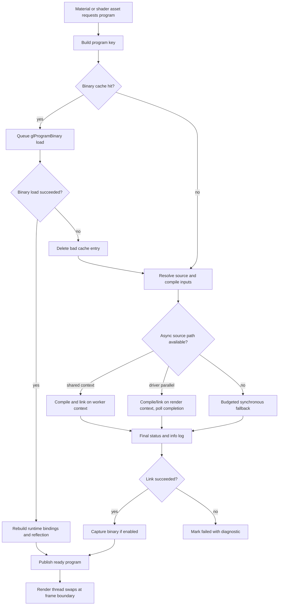

# OpenGL Shader Program Linking Design

## Goal

Eliminate visible frame-time spikes caused by OpenGL shader compilation, program
linking, binary program upload, reflection, and validation.

The target outcome is:

- the render thread never waits for a not-yet-ready shader program during
  normal interactive rendering,
- cold starts and hot reloads degrade gracefully instead of freezing the editor
  or game window,
- warm starts reuse a conservative program-binary cache when the driver still
  accepts it,
- shader backend status is visible to materials, tooling, logs, and profiler
  traces,
- the design remains compatible with OpenGL 4.6 as the primary renderer while
  leaving room for a shared SPIR-V or Slang shader pipeline later.

This is a v1 architecture cleanup area. It is acceptable to change internal
shader APIs, cache keys, and render-backend plumbing if the result is simpler,
measurably smoother, and easier to diagnose.

Related docs:

- [OpenGL Program Linking](../../../features/opengl-program-linking.md)
- [OpenGL Renderer](../../../architecture/rendering/opengl-renderer.md)
- [Secondary GPU Context](../../../architecture/secondary-gpu-context.md)
- [Uber Shader Varianting](../../../architecture/rendering/uber-shader-varianting.md)
- [Slang Shader Cross Compile Plan](../scripting/slang-shader-cross-compile-plan.md)

## Decision Summary

Treat OpenGL program linking as an asset-build and cache pipeline, not as
render-thread work.

The render thread owns visible windows, the primary OpenGL context, per-context
program pipeline objects, and the currently active program handles. Background
shader work runs through long-lived shared OpenGL contexts where possible. The
render thread keeps using the last known-good program until a replacement has
already compiled, linked, loaded from binary, reflected, and passed final status
checks.

Use three backend lanes:

1. program-binary cache load for warm starts,
2. asynchronous source compile/link through either driver-parallel compile or a
   shared-context worker queue,
3. synchronous render-thread fallback only as a diagnostic or last-resort path,
   with strict per-frame budgets.

Use `GL_ARB_parallel_shader_compile` / `GL_KHR_parallel_shader_compile` only as
a scheduling hint and completion-polling mechanism. Never query `GL_LINK_STATUS`,
info logs, active resources, or validation state for an in-flight program until
`GL_COMPLETION_STATUS` reports complete.

Use program binaries as a local cache, not as portable shipped assets. Cache
entries must be invalidated by shader content, generation options, program
topology, engine shader ABI, binary format, OpenGL version, vendor, renderer,
and driver identity. A failed `glProgramBinary` load deletes that entry and
falls back to source.

Use separable programs where stage reuse materially reduces permutation cost,
but create program pipeline objects on the render context because pipeline
objects are non-shared containers. Require explicit shader interface locations
and resource bindings for separable shader families.

## Why This Exists

`glLinkProgram` is allowed to do substantial driver work. On real drivers that
work can block the caller for long enough to make the editor or game window look
hung. The problem is amplified by XRENGINE's generated Uber variants, imported
model material permutations, shader editor hot reloads, and first-use material
paths.

The engine already has pieces of the right solution:

- `XRRenderProgram` stores shader variant and backend status metadata.
- `EOpenGLShaderLinkStrategy` selects `Auto`, `SharedContext`,
  `DriverParallel`, or `Synchronous`.
- `OpenGLRenderer.ParallelShaderCompile` probes and configures
  `GL_ARB/KHR_parallel_shader_compile`.
- `GLProgramCompileLinkQueue` can run source compile/link work on a shared GL
  context.
- `GLProgramBinaryUploadQueue` can upload cached binaries off the render thread.
- `GLRenderProgram.BinaryCache` persists program binaries and uniform metadata.
- `PollPendingAsyncPrograms` advances queued programs incrementally instead of
  trying to finish every pending program in one frame.

The missing architectural rule is to make these pieces the normal program
lifecycle, with clear ownership boundaries and measurable fallbacks.

## Non-Goals

This design does not replace OpenGL with Vulkan. Vulkan's explicit pipeline
model is a better long-term answer for deterministic pipeline creation, but the
OpenGL renderer remains a first-class renderer for v1.

This design does not make OpenGL program binaries portable. They are only a
per-machine, per-driver cache.

This design does not require every shader family to become separable. Monolithic
programs are still appropriate for hot paths with a bounded permutation count.

This design does not move visible swapchain ownership away from the render
thread. Worker contexts may create shared GL objects, but presentation and
render-context-local containers stay render-thread-owned.

This design does not use GL fences to wait for shader compiler completion.
Fences order GPU command streams; shader compiler completion is represented by
`GL_COMPLETION_STATUS` or by the shared-context queue result.

## Requirements

### Functional Requirements

- `XRRenderProgram.Link()` must be restartable across frames.
- A material must be able to render with its previous program, fallback program,
  or not-yet-ready status while a replacement builds in the background.
- Source compile/link must be eligible for worker-context execution when a
  shared context exists.
- Driver-parallel compile must be guarded by extension detection, configuration,
  and a startup probe.
- Known driver hazards must be represented as reusable predicates on program
  shape or shader family, not scattered ad hoc branches. The current empirically
  verified NVIDIA hazard set is: programs with a single attached shader
  (`shaderCount <= 1`, including separable single-stage programs) and any
  program containing a compute shader. Hazardous programs must bypass the
  driver-parallel lane. When the shared-context source queue is available,
  they should use it so a driver stall cannot freeze the render thread; only
  the no-queue fallback should link synchronously with parallel compile
  temporarily disabled.
- Program-binary loads must reapply or rebuild all runtime state that
  `glProgramBinary` resets, especially default-block uniforms.
- Cache misses, binary-load failures, async queue backpressure, abandoned driver
  links, and synchronous fallbacks must be logged with enough data to identify
  the shader family and hash.

### Render-Thread Requirements

- The render thread must never call a blocking status query on an in-flight
  driver-parallel program.
- The render thread must cap synchronous fallback work per frame.
- The render thread must swap program handles only at frame-safe points.
- Old program handles must remain alive until no queued draw or deferred cleanup
  can reference them.
- Program pipeline objects must be created, validated, and destroyed on the
  context that owns them.

### Worker-Context Requirements

- Each shader worker owns a long-lived shared GL context and keeps it current for
  the worker thread lifetime.
- Compile/link workers do not migrate one GL context across arbitrary threads.
- Worker completion is published with CPU synchronization after final GL status
  is known.
- A worker-side `glFinish` is allowed only as a conservative first handoff
  mechanism. It must never run on the render thread, and it should be measured
  so it can be replaced with narrower synchronization when safe.

### Cache Requirements

Cache keys must include at least:

- resolved shader source or SPIR-V hash, including `#include` content,
- shader stage set and separable or monolithic topology,
- generated variant hash and compile defines,
- engine shader ABI or cache schema version,
- OpenGL version string,
- vendor and renderer strings,
- driver version or build string when available,
- returned binary format token.

Cache values should include:

- binary blob and binary format,
- reflection metadata needed before uniforms are rebound,
- source hash and topology metadata for diagnostics,
- creation timestamp and engine version for cleanup tooling.

## Proposed Architecture

### Thread Roles

```text
Render Thread
  - owns visible windows and primary OpenGL context
  - owns active program handles and program pipeline objects
  - polls pending shader jobs once per frame
  - swaps only already-ready programs
  - uses fallback/previous programs while replacements build

Shader Worker Context
  - owns one long-lived shared OpenGL context
  - compiles shader objects from resolved source
  - links program objects or loads program binaries
  - polls GL_COMPLETION_STATUS when driver-parallel compile is active
  - captures program binaries after successful source links
  - publishes completed results to the render thread

Asset / Editor Threads
  - request shader variants and hot reloads
  - update source assets and material selections
  - observe backend status without touching GL state directly
```

### Program Lifecycle



### Backend Selection

`Auto` should be the default strategy. Its decision tree should remain simple
and observable:

```text
if program binary cache hit:
    upload/load binary, preferably on shared-context queue
else if program hash is known failed:
    fail fast
else if program shape is a known driver-parallel hazard
     and shared-context source queue exists:
    use shared-context source queue
else if program shape is a known driver-parallel hazard:
    use budgeted render-thread synchronous link, with parallel-compile
    temporarily disabled around the link, then restored
else if driver-parallel compile is enabled and probed:
    use driver-parallel completion polling
else if shared-context source queue exists:
    use shared-context source queue
else:
    use budgeted synchronous render-thread fallback
```

`DriverParallel` forces the driver-parallel lane after the extension/probe gate.
It is useful for diagnostics and vendors where the path is known good.

`SharedContext` forces the worker-context queue when available. It is the safest
interactive fallback for drivers where `GL_ARB/KHR_parallel_shader_compile` is
buggy or absent.

`Synchronous` is diagnostic only. It is allowed to stall and should make that
fact obvious in logs and profiler traces.

### Driver-Parallel Rules

When `GL_ARB_parallel_shader_compile` or `GL_KHR_parallel_shader_compile` is
available:

1. Resolve the configured thread budget at startup.
2. Call `glMaxShaderCompilerThreads*` once after context initialization.
3. Run a small startup probe when `Auto` or `DriverParallel` may use the path.
4. Issue compile/link work without immediately asking for final status.
5. Poll only `GL_COMPLETION_STATUS` until complete.
6. After completion, query compile/link status, info logs, reflection, and
   binary length.
7. Treat long-running noncompletion as a driver hazard and abandon without
   touching blocking handles if the hard timeout is reached.

The reported max shader compiler thread count is treated as driver state, not
as proof that the driver actually allocated that number of compiler workers.

**Process-wide scope on NVIDIA.** `glMaxShaderCompilerThreadsARB` is treated
by the NVIDIA driver as a process-wide setting, not a per-context one.
Disabling parallel compile on a worker context (e.g. before linking a
hazardous program) also disables it for the render context, and vice versa.
Any scoped disable must therefore:

- run on the render thread immediately before the hazardous link,
- be paired with a `RestoreParallelShaderCompile` immediately after, and
- never be left enabled across normal frame loops.

This scoped disable is only the fallback when no shared-context source queue is
available. If the queue exists, hazardous programs should be moved off the
render thread and diagnosed as worker-lane stalls instead of UI freezes.

**Known hazard shapes (NVIDIA, GL 4.6, driver 581.x).**

- Programs with a single attached shader, including single-stage separable
  programs.
- Any program containing a compute shader.

For these shapes the parallel-link worker can wedge indefinitely, and any
implicit-sync query (`GL_LINK_STATUS`, `GL_PROGRAM_BINARY_LENGTH`,
`glGetProgramBinary`, validation, reflection, `glUseProgram` on certain
drivers) issued before the wedged link finishes blocks the calling thread.
The `IsKnownAsyncLinkHazard` predicate on `GLRenderProgram` is the canonical
check.

### Shared-Context Queue Rules

The shared-context queue is the preferred fallback when driver-parallel compile
cannot be trusted. It is also the preferred lane for known hazardous programs
when the alternative would be a blocking render-thread compile/link.

Worker contexts should be created once during renderer initialization, share
with the primary context, and remain current on their owning worker thread. The
queue accepts resolved sources and program metadata; it should not depend on
mutable material state after enqueue.

The first implementation may link into a program object created on the render
context if the current GL sharing model requires that. The cleaner target is a
clone-and-swap model where the worker creates a fresh linked program in the
shared namespace, publishes its handle on success, and the render thread swaps
to it without relinking an active object in place.

Backpressure is part of the design. When the queue is full, programs remain
pending and are retried by the per-frame pump instead of forcing the render
thread into synchronous work.

**Single-worker hazard.** As of Phase 1, both program-binary upload and
source compile/link share one `GLSharedContext` worker thread. One wedged
source job can halt every queued shader operation, including binary uploads
needed by mesh prep, and manifests as "submeshes never appear" or "materials
never become visible."
Mitigations:

- Hazardous programs are allowed onto the queue to protect the render thread,
  but slow pending jobs must be logged with the program hash and phase.
- The queue needs hard per-job abandon semantics so a timed-out job is logged
  and no longer blocks local material state.
- Phase 3+ should consider splitting the binary-upload worker from the
  source-compile/link worker so a wedge in one lane does not starve the
  other. See Open Questions.

**No status-query-before-completion on the worker, either.** The worker
context is bound by the same rule as the render thread: it must not call
blocking status queries on a hazardous program. Because the worker today
does call `glGetShaderiv(COMPILE_STATUS)` and `glGetProgramiv(LINK_STATUS)`
immediately after `glLinkProgram`, a hazardous job can still stall the worker.
That is preferable to freezing the editor, but it is not the final design; the
source queue should either poll non-blocking completion where available or be
isolated from binary uploads.

### Program Binary Cache

Before source linking, set `GL_PROGRAM_BINARY_RETRIEVABLE_HINT` for programs
whose cache policy allows binary capture.

On successful link:

1. Query `GL_PROGRAM_BINARY_LENGTH`.
2. Skip cache write if the driver reports no retrievable binary.
3. Capture `glGetProgramBinary`.
4. Snapshot reflection/uniform metadata needed by the engine.
5. Store blob and metadata under the conservative key.

On load:

1. Reject entries whose fingerprint does not match the current runtime.
2. Call `glProgramBinary`, preferably off the render thread.
3. Query `GL_LINK_STATUS` only after the load has completed on that context.
4. Delete the cache entry on failure and fall back to source.
5. Rebuild uniform/sampler/resource binding state because binary load resets
   default-block uniforms.

Do not ship program binaries as durable assets. They belong under a generated
cache directory and may be deleted at any time.

### Separable Program Policy

Use monolithic programs for:

- renderer-critical paths with a small number of known permutations,
- programs where whole-program optimization is important,
- shader families that have driver hazards in separable form.

Use separable programs for:

- variant-heavy material systems,
- hot-reloaded stage libraries,
- shared vertex or fragment stages used by many material combinations,
- editor workflows that benefit from replacing one stage without rebuilding
  every combination.

Separable shader families must use explicit `layout(location=...)` for stage
interfaces and explicit `layout(binding=...)` or engine-owned binding maps for
resources. Program pipeline validation belongs in debug, warm-up, or pipeline
bake paths, not the hot frame loop.

### Synchronization Policy

Use CPU synchronization for shader build result publication. A completed worker
job means the program object has reached final link/load status and the render
thread may inspect the published result.

Use GL sync objects only for GPU command-stream ordering, such as a shared
texture or buffer upload that another context will sample. Do not use fences to
wait for compiler-thread completion.

Avoid `glFinish` on the render thread. If worker handoff needs conservative
synchronization, keep it on the worker and measure its effect on queue
throughput.

## Instrumentation

Every shader build path should write enough telemetry to answer these questions:

- Was the program loaded from binary, driver-parallel compiled, shared-context
  compiled, or synchronously linked?
- How long did source resolution, compile, link, binary load, reflection, and
  binary capture take?
- Did the render thread perform any synchronous shader work this frame?
- Did any query touch `GL_LINK_STATUS`, info logs, active resources, or
  validation before completion?
- How many programs are pending, in flight, ready, failed, or abandoned?
- Which material/shader family and hash produced a stall or failure?

Minimum metrics:

- compile time,
- link time,
- enqueue-to-ready latency,
- binary cache hit rate,
- binary load failure rate,
- source fallback count,
- shared queue depth and backpressure count,
- synchronous fallback time per frame,
- first-draw-after-swap CPU time,
- frame-time p50, p95, p99, and p99.9 during shader stress.

Profiler and log touchpoints:

- `XRWindow.ProcessPendingUploads`
- `GLRenderProgram.Link.*`
- `GLRenderProgram.Link.ProgramBinary`
- `GLRenderProgram.Link.ResolveSourceForHash`
- `GLRenderProgram.Link.ResolveSourceForCompilation`
- `profiler-render-stalls.log`
- `log_opengl.txt`

## Implementation Plan

### Phase 1: Stabilize Current Async Paths

- Keep `Auto` as the default strategy.
- Keep the startup driver-parallel probe and log line.
- Ensure known driver hazards are encoded as predicates on `GLRenderProgram`.
  Current predicate (`IsKnownAsyncLinkHazard`) covers single-shader programs
  and any program containing a compute shader. Hazardous programs route to
  the shared-context source queue when available; the render-thread sync-link
  path with parallel-compile temporarily disabled is the no-queue fallback.
- Keep per-frame pumping capped by program count and synchronous wall-clock
  budget. Hazard-sync-link work runs inside this budget; cold-start frames
  may show "slow render prep" warnings during warm-up and that is by design.
- Keep hard-abandon behavior for driver-parallel programs that never complete.
- Document observed hazards in [OpenGL Program Linking](../../../features/opengl-program-linking.md).

### Phase 2: Strengthen Cache Fingerprints

- Expand the binary cache key beyond `hash-format-version`.
- Add vendor, renderer, OpenGL version, driver/build string, separable topology,
  variant metadata, compile defines, and cache schema version.
- Store metadata in a structured file instead of relying only on filename
  parsing.
- Add cleanup for stale cache entries after driver or engine updates.
- Add tests for include-hash invalidation and cache-key changes.

### Phase 3: Move Toward Clone-And-Swap

- Build fresh program objects for hot reloads and async source links.
- Publish successful handles as immutable ready results.
- Swap active handles on the render thread at frame boundaries.
- Defer old-handle deletion until all possible users are past the swap.
- Avoid relinking an active program object in place.

### Phase 4: Make Separable Stage Reuse Explicit

- Identify shader families that actually benefit from separable linking.
- Require explicit interface locations and resource bindings for those families.
- Create render-context-local program pipeline objects from shared linked stages.
- Validate pipelines during warm-up or debug, not every frame.
- Keep monolithic programs for known hazardous or latency-critical paths.

### Phase 5: Add Shader Stress Validation

- Add a unit-testing-world shader stress scene or task.
- Measure cold start with empty cache.
- Measure warm start with valid cache.
- Simulate driver invalidation by changing the fingerprint schema.
- Continuously hot reload representative Uber/material shaders while moving a
  camera through a loaded scene.
- Record p99/p99.9 frame times and `XRWindow.ProcessPendingUploads` stalls.

## Validation Plan

Run these scenarios before treating the design as complete:

| Scenario | Expected Result |
|----------|-----------------|
| Empty shader cache cold start | Programs compile/link without unbounded render-thread stalls. |
| Warm start with valid cache | Most programs load from binary; source fallback count stays low. |
| Driver/version fingerprint change | Old binaries are ignored or deleted and source rebuild succeeds. |
| `GL_ARB/KHR_parallel_shader_compile` unavailable | Shared-context queue or budgeted synchronous fallback is used. |
| Shared context unavailable | Engine remains functional with diagnostic warnings and sync budget. |
| Known NVIDIA separable hazard (single-shader program) | Hazard bypasses driver-parallel, uses the shared-context queue when available, and does not hang the render thread. |
| Known NVIDIA compute-program hazard | Compute program bypasses driver-parallel, uses the shared-context queue when available, and dispatchers gate on `IsLinked`. |
| Shader editor hot reload | Old program remains active until replacement is ready or failed. |
| Imported model with many materials | p99 frame time stays within budget after initial warm-up strategy. |
| Binary load failure | Bad cache entry is deleted and source fallback completes. |
| Separable pipeline rebuild | Pipeline objects are created on the render context and not shared. |

## Risks And Mitigations

| Risk | Mitigation |
|------|------------|
| Driver reports completion but first use still stalls | Track first-draw-after-swap time and pre-warm critical programs during load screens. |
| Shared-context worker wedges inside driver link | Keep the render thread non-blocking, log slow pending jobs, allow strategy override, and split/timeout the source worker so binary uploads are not starved. |
| Cache key misses a driver- or engine-specific input | Use conservative fingerprints and bump cache schema when in doubt. |
| Binary load resets uniforms and produces wrong rendering | Rebuild binding state after binary load; prefer explicit UBO/SSBO/sampler bindings. |
| Separable interfaces drift across stages | Require explicit locations/bindings and add shader contract tests. |
| Synchronous fallback silently grows | Log and profile every sync fallback; enforce per-frame budget. |

## Open Questions

- Are the hazard shapes (`shaderCount <= 1`, contains compute) NVIDIA-specific,
  or do AMD/Intel exhibit the same wedge? The predicate is currently tuned
  to NVIDIA driver 581.x; AMD/Intel may not need this workaround and the
  predicate could be vendor-gated.
- Can the shared-context source queue safely move fully to clone-and-swap across
  all supported GL context sharing paths?
- Where should the persistent shader cache live long term:
  `Environment.CurrentDirectory/ShaderCache`, `Build/Cache`, or a per-user
  application data directory? Today it resolves relative to CWD, which makes
  the cache implicit on the working directory at process start.
- How much SPIR-V front-end work should be shared with the Vulkan path before
  v1?
- Which shader families should be explicitly separable, and which should remain
  monolithic because of driver behavior or whole-program optimization?

### Resolved

- *One shared shader worker vs. separate workers for binary upload and source
  compile/link?* Empirically, the single-worker model produces head-of-line
  blocking: a wedged compile/link starves binary uploads and prevents
  meshes/materials from becoming visible. Phase 3+ should split these into
  two workers (or two queues serviced by independent contexts) so a wedge
  in one lane does not block the other. Until then, hazardous programs may
  still use the source queue to keep the editor responsive, with slow-pending
  diagnostics marking the remaining worker-lane risk.
