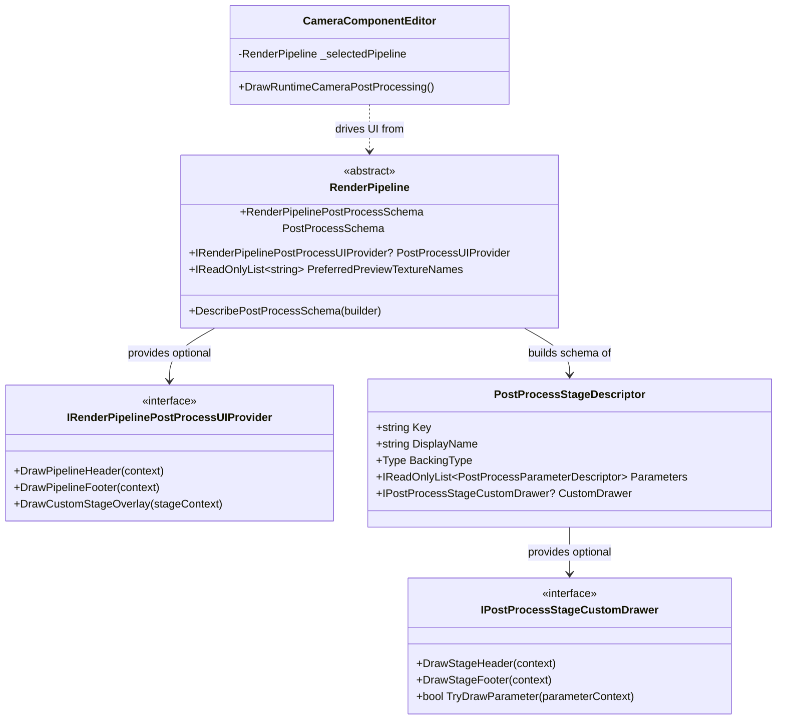
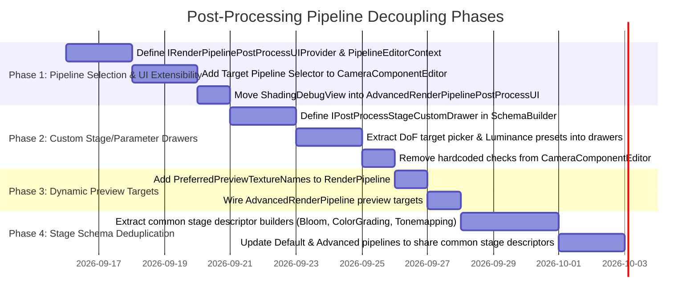

# Pipeline-Driven Post-Processing And Camera Editor Architecture

Last Updated: 2026-09-15  
Status: Draft / Proposed Architecture  
Target Subsystem: `XREngine.Runtime.Rendering` & `XREngine.Editor`  
Primary References:
- [`CameraComponentEditor.cs`](../../../../XREngine.Editor/ComponentEditors/CameraComponentEditor.cs)
- [`RenderPipelinePostProcessSchema.cs`](../../../../XREngine.Runtime.Rendering/Rendering/PostProcessing/RenderPipelinePostProcessSchema.cs)
- [`CameraPostProcessStateCollection.cs`](../../../../XREngine.Runtime.Rendering/Rendering/PostProcessing/CameraPostProcessStateCollection.cs)
- [`DefaultRenderPipeline.PostProcessing.cs`](../../../../XREngine.Runtime.Rendering/Rendering/Pipelines/Types/Default/DefaultRenderPipeline.PostProcessing.cs)
- [`AdvancedRenderPipeline.PostProcessing.cs`](../../../../XREngine.Runtime.Rendering/Rendering/Pipelines/Types/Advanced/AdvancedRenderPipeline.PostProcessing.cs)

---

## 1. Executive Summary

Post-processing in `XRENGINE` is architecturally split between camera state (persisted settings on [`XRCamera`](../../../../XREngine.Runtime.Rendering/Rendering/Camera/XRCamera.cs) via [`CameraPostProcessStateCollection`](../../../../XREngine.Runtime.Rendering/Rendering/PostProcessing/CameraPostProcessStateCollection.cs)) and pipeline execution ([`RenderPipeline`](../../../../XREngine.Runtime.Rendering/Rendering/Pipelines/XRRenderPipeline.cs)). While an extensible schema system ([`RenderPipelinePostProcessSchema`](../../../../XREngine.Runtime.Rendering/Rendering/PostProcessing/RenderPipelinePostProcessSchema.cs)) exists to describe stages and parameters dynamically, the editor implementation in [`CameraComponentEditor.cs`](../../../../XREngine.Editor/ComponentEditors/CameraComponentEditor.cs) remains tightly coupled to implicit runtime defaults, contains hardcoded type-checks for specific pipelines, and features ad-hoc GUI special cases injected directly into generic drawing loops.

This document specifies the target architecture to make post-processing inspection and pipeline configuration **100% dynamic, pipeline-driven, and decoupled**.

---

## 2. Problem Statement & Current Limitations

### 2.1 Implicit Pipeline Resolution Without User Selection
Currently, [`CameraComponentEditor.ResolvePostProcessingEditorPipeline`](../../../../XREngine.Editor/ComponentEditors/CameraComponentEditor.cs#L1550) resolves the pipeline implicitly:
```csharp
private static RenderPipeline ResolveCameraEditorPipeline(XRCamera camera)
    => camera.Viewports
        .Select(viewport => viewport.RenderPipeline)
        .FirstOrDefault(pipeline => pipeline is not null)
        ?? camera.RenderPipeline;
```
- **Limitation**: The editor provides no way to choose which pipeline profile to inspect or configure. If the editor viewport runs on OpenGL [`DefaultRenderPipeline`](../../../../XREngine.Runtime.Rendering/Rendering/Pipelines/Types/Default/DefaultRenderPipeline.cs), the user cannot edit or preview the camera's post-processing settings for [`AdvancedRenderPipeline`](../../../../XREngine.Runtime.Rendering/Rendering/Pipelines/Types/Advanced/AdvancedRenderPipeline.cs) (Vulkan) without launching a full game session or manually rebinding viewport pipelines.

### 2.2 Concrete Pipeline Type Leaks (`if (pipeline is AdvancedRenderPipeline)`)
Pipeline-specific controls, such as `ShadingDebugView` or hardware execution flags, do not fit into the standard scalar/vector stage schema. Currently, adding such controls requires polluting [`CameraComponentEditor.cs`](../../../../XREngine.Editor/ComponentEditors/CameraComponentEditor.cs) with concrete pipeline casts:
```csharp
AdvancedRenderPipeline? advancedPipeline = pipeline as AdvancedRenderPipeline ...;
if (advancedPipeline is not null)
{
    DrawAdvancedShadingDebugViewSelector(advancedPipeline);
}
```
- **Limitation**: Violates the Open-Closed Principle. New render pipelines (or experimental render paths) cannot expose pipeline-level diagnostic or configuration controls without modifying engine editor UI code.

### 2.3 Hardcoded Special Cases Inside the Dynamic Schema Loop
Even though parameters are drawn dynamically by iterating `stage.Parameters`, specific stages have special-case UI logic hardcoded directly into [`CameraComponentEditor.cs`](../../../../XREngine.Editor/ComponentEditors/CameraComponentEditor.cs):
- **Depth of Field**:
  ```csharp
  if (component is not null && stageState.BackingInstance is DepthOfFieldSettings dof)
      DrawDepthOfFieldFocusTarget(dof, component);
  ```
- **Tonemapping Bypass for HDR**:
  ```csharp
  bool tonemappingDisabled = effectiveHDR && stage.Descriptor.Key.Equals(TonemappingStageKey, ...);
  ```
- **AutoExposure Luminance Weights**:
  ```csharp
  if (param.Name == nameof(ColorGradingSettings.AutoExposureLuminanceWeights)) { /* Rec.709, Rec.601 buttons */ }
  ```
- **Temporal AA Status**:
  `DrawTemporalControlsStatus(component)` is statically injected at the top of the panel regardless of whether the pipeline's active AA mode is TAA.

### 2.4 Monolithic Schema Code Duplication
[`DefaultRenderPipeline.PostProcessing.cs`](../../../../XREngine.Runtime.Rendering/Rendering/Pipelines/Types/Default/DefaultRenderPipeline.PostProcessing.cs) and [`AdvancedRenderPipeline.PostProcessing.cs`](../../../../XREngine.Runtime.Rendering/Rendering/Pipelines/Types/Advanced/AdvancedRenderPipeline.PostProcessing.cs) each contain ~2,000 lines of redundant schema builder declarations (`DescribeTonemappingStage`, `DescribeBloomStage`, `DescribeAmbientOcclusionStage`, etc.). Individual passes have no autonomy over their own parameter descriptors or editor representations.

### 2.5 Hardcoded Preview Target Names
The "Camera Preview" tab in [`CameraComponentEditor.cs`](../../../../XREngine.Editor/ComponentEditors/CameraComponentEditor.cs#L191-L203) explicitly looks for strings defined on `DefaultRenderPipeline`:
```csharp
private static readonly string[] PreferredPreviewTextureNames =
[
    DefaultRenderPipeline.PostProcessOutputTextureName,
    DefaultRenderPipeline.HDRSceneTextureName,
    DefaultRenderPipeline.DiffuseTextureName
];
```
Under pipelines where these textures do not exist (such as native Vulkan frame graphs), preview fallback is fragile or fails entirely.

---

## 3. Core Architectural Principles

1. **Inversion of Control**: The editor queries the render pipeline for what controls and stages to display. The editor never queries concrete pipeline types.
2. **Separation of State and Presentation**:
   - `XRCamera` holds raw post-process state keyed by pipeline ID (`CameraPostProcessStateCollection`).
   - `RenderPipeline` defines the schema (what parameters exist, validation, defaults, and custom UI drawers).
   - `CameraComponentEditor` serves purely as an ImGui coordinator.
3. **Pipeline Discovery & Switching**: The user should be able to explicitly view and edit post-processing configurations for any registered pipeline in the project, with clear indicators of whether that pipeline is currently driving an active viewport.
4. **Composable Stage Modules**: Stages (Bloom, GTAO, Tonemapping) should declare their own schemas and custom UI widgets as self-contained descriptors rather than monolithic pipeline methods.

---

## 4. Target Architecture



### 4.1 Pipeline Target Context & UI Selector

At the top of the Camera Component's **Post Processing** tab, add an explicit pipeline selector:

```csharp
public sealed record PipelineEditorContext(
    XRCamera Camera,
    CameraComponent? Component,
    RenderPipeline ActiveViewportPipeline,
    RenderPipeline SelectedPipeline,
    PipelinePostProcessState State,
    RenderPipelinePostProcessSchema Schema);
```

#### UI Layout:
```text
+-----------------------------------------------------------------------+
| Pipeline: [ Active: AdvancedRenderPipeline (Vulkan)             v ]   |
| Status: Rendering 1 Viewport (MainViewport)                           |
+-----------------------------------------------------------------------+
| [Optional Pipeline Header Extensions: ShadingDebugView, Timers]       |
+-----------------------------------------------------------------------+
| Category / Effect: [ Ambient Occlusion (GTAO)                   v ]   |
| [Reset To Defaults]                                                   |
| --------------------------------------------------------------------- |
| Radius:           [========|============] 0.50 m                      |
| Falloff Bias:     [====|================] 0.10                        |
| Power:            [=============|=======] 1.50                        |
| ...                                                                   |
+-----------------------------------------------------------------------+
| [Optional Pipeline Footer Extensions]                                 |
+-----------------------------------------------------------------------+
```

When changing the dropdown:
- The user can select from:
  1. **Active Viewport Pipeline (Default)**: Automatically tracks whatever pipeline is rendering this camera.
  2. **Any Available RenderPipeline Asset / Service**: Allows pre-configuring or authoring settings for alternate pipelines (e.g. configuring high-end Vulkan settings while running on a low-end OpenGL test harness).
- The editor immediately retrieves the matching `PipelinePostProcessState` via `camera.GetPostProcessState(selectedPipeline)`.

---

### 4.2 Pipeline UI Extensions (`IRenderPipelinePostProcessUIProvider`)

Pipelines can optionally implement or return an `IRenderPipelinePostProcessUIProvider`:

```csharp
namespace XREngine.Rendering.PostProcessing;

public interface IRenderPipelinePostProcessUIProvider
{
    /// <summary>
    /// Invoked at the top of the Camera Post Processing inspector, before the stage selector.
    /// Ideal for pipeline-level view modes, debug views (e.g. ShadingDebugView), or profile overrides.
    /// </summary>
    void DrawPipelineHeader(PipelineEditorContext context);

    /// <summary>
    /// Invoked at the bottom of the Camera Post Processing inspector, after stages are rendered.
    /// Ideal for pipeline diagnostic metrics, pass timings, or memory stats.
    /// </summary>
    void DrawPipelineFooter(PipelineEditorContext context);
}
```

#### Implementation in `AdvancedRenderPipeline`:
```csharp
public sealed class AdvancedRenderPipelinePostProcessUI : IRenderPipelinePostProcessUIProvider
{
    private readonly AdvancedRenderPipeline _pipeline;

    public AdvancedRenderPipelinePostProcessUI(AdvancedRenderPipeline pipeline) => _pipeline = pipeline;

    public void DrawPipelineHeader(PipelineEditorContext context)
    {
        ImGui.Separator();
        ImGui.Text("Native Shading Debug View");
        EAdvancedShadingDebugView currentView = _pipeline.ShadingDebugView;
        ImGui.SetNextItemWidth(-1.0f);
        if (ImGui.BeginCombo("##ShadingDebugViewCombo", currentView.ToString()))
        {
            foreach (EAdvancedShadingDebugView view in Enum.GetValues<EAdvancedShadingDebugView>())
            {
                bool isSelected = view == currentView;
                if (ImGui.Selectable(view.ToString(), isSelected))
                    _pipeline.ShadingDebugView = view;
                if (isSelected)
                    ImGui.SetItemDefaultFocus();
            }
            ImGui.EndCombo();
        }
    }

    public void DrawPipelineFooter(PipelineEditorContext context)
    {
        // Pipeline-specific GPU memory or pass stats
    }
}
```

`CameraComponentEditor.cs` calls:
```csharp
pipeline.PostProcessUIProvider?.DrawPipelineHeader(context);
```
**Zero concrete pipeline casts in `CameraComponentEditor.cs`.**

---

### 4.3 Custom Stage and Parameter Drawers (`IPostProcessStageCustomDrawer`)

To eliminate hardcoded `if (stageState.BackingInstance is DepthOfFieldSettings)` or `if (param.Name == "AutoExposureLuminanceWeights")`, stages can register an optional `IPostProcessStageCustomDrawer`:

```csharp
public interface IPostProcessStageCustomDrawer
{
    /// <summary>
    /// Custom controls rendered after standard stage parameters.
    /// </summary>
    void DrawStageFooter(PostProcessStageCustomDrawerContext context);

    /// <summary>
    /// Optionally intercepts drawing a specific parameter.
    /// Return true if handled; false to fall back to the default widget (slider, drag, checkbox).
    /// </summary>
    bool TryDrawParameter(PostProcessParameterCustomDrawerContext context) => false;
}
```

#### Example: Depth of Field Focus Target Drawer
Instead of hardcoding DoF in `CameraComponentEditor`, `DepthOfFieldSettings` (or its stage registration) provides a drawer:

```csharp
public sealed class DepthOfFieldStageDrawer : IPostProcessStageCustomDrawer
{
    public void DrawStageFooter(PostProcessStageCustomDrawerContext context)
    {
        if (context.StageState.BackingInstance is not DepthOfFieldSettings dof || context.CameraComponent is null)
            return;

        if (dof.Mode != DepthOfFieldSettings.DepthOfFieldControlMode.TargetTransform)
            return;

        ImGui.Separator();
        // Drag-and-drop target transform logic isolated here!
    }
}
```

Registered directly during schema building:
```csharp
builder.Stage(DepthOfFieldStageKey, "Depth of Field")
    .BackedBy<DepthOfFieldSettings>()
    .WithCustomDrawer(new DepthOfFieldStageDrawer());
```

#### Example: Luminance Weights Preset Drawer
```csharp
public sealed class LuminanceWeightsParameterDrawer : IPostProcessStageCustomDrawer
{
    public bool TryDrawParameter(PostProcessParameterCustomDrawerContext context)
    {
        if (context.Parameter.Name != nameof(ColorGradingSettings.AutoExposureLuminanceWeights))
            return false;

        // Draw custom Rec.709, Rec.601, and Default buttons
        return true;
    }
}
```

---

### 4.4 Decoupled Preview Target Discovery

`RenderPipeline` exposes a virtual contract for preview targets:

```csharp
public abstract class RenderPipeline : XRBase
{
    /// <summary>
    /// Returns the preferred texture names to inspect in the Camera Preview tab,
    /// in order of priority (e.g. final post-processed output, then HDR scene, then diffuse).
    /// </summary>
    public virtual IReadOnlyList<string> PreferredPreviewTextureNames => DefaultPreviewTextureNames;

    /// <summary>
    /// Returns the preferred framebuffer names to inspect in the Camera Preview tab.
    /// </summary>
    public virtual IReadOnlyList<string> PreferredPreviewFrameBufferNames => DefaultPreviewFrameBufferNames;
}
```

`DefaultRenderPipeline` returns its classic textures (`HDRScene`, `PostProcessOutput`), while `AdvancedRenderPipeline` returns its native Vulkan frame attachments (`AdvancedSceneColor`, `AdvancedTonemappedColor`).

`CameraComponentEditor` simply iterates `selectedPipeline.PreferredPreviewTextureNames`.

---

## 5. Implementation & Migration Plan



### Detailed Phases

#### Phase 1: Pipeline Selector & Header/Footer Extensibility
1. Add `IRenderPipelinePostProcessUIProvider` to `XREngine.Runtime.Rendering.PostProcessing`.
2. Add `PostProcessUIProvider` virtual property to `RenderPipeline`.
3. Implement `AdvancedRenderPipelinePostProcessUI` to host `ShadingDebugView`.
4. In `CameraComponentEditor.cs`, add a `Target Pipeline` dropdown at the top of `DrawRuntimeCameraPostProcessing`.
5. Remove concrete reference to `AdvancedRenderPipeline` from `CameraComponentEditor.cs`.

#### Phase 2: Custom Stage Drawers
1. Add `WithCustomDrawer(...)` to `RenderPipelinePostProcessSchemaBuilder.PostProcessStageBuilder`.
2. Implement `DepthOfFieldCustomDrawer` and `ColorGradingCustomDrawer`.
3. In `CameraComponentEditor.DrawSchemaStage` and `DrawSchemaParameter`, delegate to the stage's custom drawer before falling back to default ImGui controls.
4. Remove all hardcoded `DepthOfFieldSettings`, `TonemappingStageKey`, and `ColorGradingSettings` checks from `CameraComponentEditor.cs`.

#### Phase 3: Preview Contract
1. Add `PreferredPreviewTextureNames` and `PreferredPreviewFrameBufferNames` to `RenderPipeline`.
2. Override in `AdvancedRenderPipeline` to expose native Vulkan intermediate targets.
3. Update `CameraComponentEditor.DrawPreviewSection` to query the selected pipeline rather than static fields on `DefaultRenderPipeline`.

#### Phase 4: Reusable Post-Processing Stage Library
1. Create `CommonPostProcessStages` helper with standardized builder methods for universal passes (`Tonemapping`, `Bloom`, `Vignette`, `ColorGrading`, `ChromaticAberration`).
2. Deduplicate the ~2,000 lines of identical schema code in `DefaultRenderPipeline.PostProcessing.cs` and `AdvancedRenderPipeline.PostProcessing.cs`.

---

## 6. Verification & Acceptance Criteria

1. **Pipeline Selection Verification**:
   - In the Camera Component editor under ImGui, the user can toggle the target pipeline between `Active (Auto)` and any registered pipeline.
   - Modifying parameters under `AdvancedRenderPipeline` updates the camera's Vulkan post-process state without affecting `DefaultRenderPipeline` state.
2. **Extensibility Verification**:
   - `CameraComponentEditor.cs` contains zero `is AdvancedRenderPipeline` or `is DefaultRenderPipeline` statements.
   - Adding a new custom pipeline or debug view requires zero modifications to `XREngine.Editor`.
3. **Behavioral Parity**:
   - DoF focus target dragging works identically.
   - Tonemapping HDR bypass notification functions correctly.
   - Luminance weight presets (Rec.709, Rec.601, Default) function correctly.
4. **Clean Build & Unit Tests**:
   - `dotnet build .\XREngine.Editor\XREngine.Editor.csproj` builds with 0 warnings and 0 errors.
   - All tests in `XREngine.UnitTests\Rendering\` pass without regressions.
