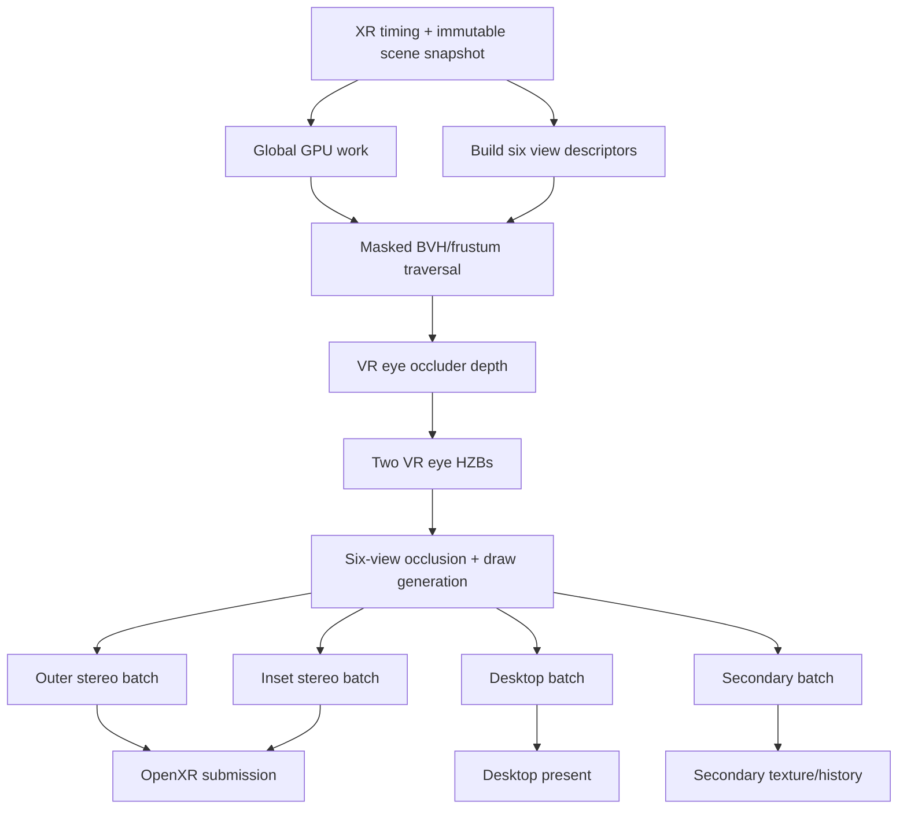

The clean architecture is a deadline-aware render graph with six logical views, but only four render batches:

1. VR outer stereo — left/right multiview
2. VR inset stereo — left/right multiview
3. Desktop camera
4. Secondary camera

The four VR views should not be treated as four unrelated cameras. OpenXR 1.1 defines them as outer-left, outer-right, inset-left, and inset-right. Critically, each inset has the same pose as its corresponding outer eye and is contained inside its FoV; only the projection/FoV and resolution differ. The inset FoV may also move every frame. [OpenXR 1.1 view configuration specification](https://registry.khronos.org/OpenXR/specs/1.1/html/xrspec.html#XrViewConfigurationType)

That lets you share much more than merely scene updates, nya~ 🐾

## Recommended frame DAG



The graph is rebuilt or conditionally instantiated each frame, but most pass definitions, pipelines, resource layouts, and command-recording code remain cached.

## View organization

Use stable logical view IDs:

```csharp
enum ViewId : byte
{
    VrOuterLeft,
    VrOuterRight,
    VrInsetLeft,
    VrInsetRight,
    Desktop,
    Secondary
}

sealed class ViewState
{
    public ViewId Id;
    public Matrix4x4 View;
    public Matrix4x4 Projection;
    public Matrix4x4 PreviousViewProjection;
    public Frustum Frustum;
    public Extent2D Resolution;

    public GpuImage Depth;
    public GpuImage HiZPrevious;
    public GpuImage HiZCurrent;

    public TemporalHistory TaaHistory;
    public bool HistoryValid;
}
```

Then organize compatible views into batches:

```csharp
record ViewBatch(
    string Name,
    ViewId[] Views,
    bool UseMultiview,
    uint VulkanViewMask,
    RenderPriority Priority);
```

Typical batches:

| Batch     | Views     | Execution                           |
| --------- | --------- | ----------------------------------- |
| VR outer  | Outer L/R | Vulkan multiview, `viewMask = 0b11` |
| VR inset  | Inset L/R | Vulkan multiview, `viewMask = 0b11` |
| Desktop   | Desktop   | Single view                         |
| Secondary | Secondary | Single view                         |

Vulkan multiview broadcasts each draw into the selected attachment layers and exposes the layer through `ViewIndex`. It also provides correlation masks as an optimization hint for spatially coherent views. [Vulkan multiview specification](https://docs.vulkan.org/spec/latest/chapters/renderpass.html#renderpass-multiview)

Outer and inset should normally be separate multiview batches because they commonly have different resolutions and attachment extents.

## Share frustum traversal, not frustum results

Frustum culling still needs an independent result for every POV, but that does not require traversing your scene BVH six times.

Traverse it once while carrying a six-bit active-view mask:

```text
bit 0 = outer left
bit 1 = outer right
bit 2 = inset left
bit 3 = inset right
bit 4 = desktop
bit 5 = secondary
```

Conceptually:

```csharp
uint CullNode(Node node, uint activeMask)
{
    uint visible = activeMask;

    visible &= TestIfActive(node.Bounds, OuterLeftFrustum,  Bit0);
    visible &= TestIfActive(node.Bounds, OuterRightFrustum, Bit1);

    // Insets are guaranteed to be contained by their corresponding outer view.
    if ((visible & Bit0) == 0)
        visible &= ~Bit2;
    else
        visible &= TestIfActive(node.Bounds, InsetLeftFrustum, Bit2);

    if ((visible & Bit1) == 0)
        visible &= ~Bit3;
    else
        visible &= TestIfActive(node.Bounds, InsetRightFrustum, Bit3);

    visible &= TestIfActive(node.Bounds, DesktopFrustum,   Bit4);
    visible &= TestIfActive(node.Bounds, SecondaryFrustum, Bit5);

    return visible;
}
```

On the GPU, each workgroup should:

* Load the node or instance bounds once.
* Test all active frusta.
* Produce one `visibleViewMask`.
* Use subgroup ballots/prefix sums to compact survivors.
* Propagate masks down the BVH so child nodes never test views already rejected by their parents.

The result is one candidate record per object:

```csharp
struct VisibilityCandidate
{
    public uint InstanceId;
    public uint ViewMask;
}
```

This preserves exact per-POV results while sharing bounds loads, traversal, transforms, and memory traffic.

## The most useful VR occlusion-sharing trick

Because an inset and outer view for one eye have the same pose, geometric occlusion along a ray is the same. Therefore, you can infer that one outer-FoV HZB per physical eye can conservatively service both the outer and inset views.

You need:

* VR-left outer HZB
* VR-right outer HZB
* Desktop HZB
* Secondary HZB

Not six independent HZBs.

For an inset occlusion query:

1. Frustum-test against the actual inset projection.
2. Project its bounding box into the corresponding outer projection.
3. Sample the outer eye’s HZB.
4. Preserve the inset bit only if that occlusion test passes.

Do not project into inset coordinates and then sample an outer HZB; the coordinate system must match the projection used to construct the HZB.

This remains conservative when the outer HZB is lower resolution—it may fail to cull something, but should not falsely cull it if your reduction and depth bias are correct.

For reversed-Z:

* Construct each HZB mip using the minimum depth.
* An object is occluded only when its nearest reverse-Z depth is behind the conservative minimum occluder depth across its projected rectangle.
* Expand the query rectangle and apply a depth bias.

Avoid bounding-box occluder proxies that fill space the real mesh does not occupy. Occluder proxies must be conservative inward approximations, or they can falsely hide geometry.

### Two occlusion modes

I would make occlusion mode selectable by the graph:

**Temporal HZB mode**

* Cull against last frame’s four HZBs.
* Lowest latency and maximum parallelism.
* Expand bounds based on camera/object velocity.
* Disable occlusion briefly after camera cuts or tracking jumps.

**Current-frame VR mode**

* Render a cheap outer-eye occluder depth pass with multiview.
* Build the two layered eye HZBs.
* Cull all four VR views against them.
* Render outer and inset opaque batches.

Current-frame mode costs an early depth pass and introduces a dependency, but it is substantially more reliable in highly dynamic scenes. Desktop and secondary can still use temporal HZBs so they do not extend the VR critical path.

## GPU-generated draw organization

After occlusion, classify surviving instances by:

```text
(view batch, pass, pipeline, material, mesh, LOD)
```

Generate indirect buffers such as:

```csharp
struct BatchDrawData
{
    GpuBuffer Commands;     // VkDrawIndexedIndirectCommand[]
    GpuBuffer DrawCount;
    GpuBuffer DrawMetadata; // instance ID, material ID, visible view mask
}
```

Render with `vkCmdDrawIndexedIndirectCount`.

Because a multiview draw is broadcast to both views, its indirect list must ordinarily be the union of the two per-eye lists. Store the exact view mask in draw metadata:

```glsl
uint globalView = batchViewBase + gl_ViewIndex;
bool visible = (draw.visibleViewMask & (1u << globalView)) != 0u;

gl_CullDistance[0] = visible ? 1.0 : -1.0;
```

This prevents fragments from appearing in an eye where the object was culled, though vertex processing still occurs for that eye.

Track the similarity of the two lists:

[
J = \frac{|V_L \cap V_R|}{|V_L \cup V_R|}
]

If the union waste becomes unusually large—particularly for narrow, independently moving inset views—the graph can switch that batch to two separate single-view draws. Use hysteresis so it does not switch modes every frame.

## What should be shared

| Frequency                | Work                                                                                                |
| ------------------------ | --------------------------------------------------------------------------------------------------- |
| Once per frame           | Scene snapshot, transforms, bone matrices, particle simulation, resource uploads, dirty shadow maps |
| Once per unique mesh/LOD | Compute skinning and blendshape output                                                              |
| Once per physical VR eye | Outer-FoV occlusion depth/HZB                                                                       |
| Once for all six views   | Masked BVH traversal and candidate generation                                                       |
| Per logical view         | Frustum, projected LOD, light clusters, motion vectors, temporal history                            |
| Per render batch         | Indirect draw lists, opaque/deferred pass, transparency, post-processing                            |
| Per output               | OpenXR submission, desktop present, secondary texture publication                                   |

Some further distinctions:

* Spot/point shadow maps are view-independent and should be shared.
* Directional cascades can be anchored around the VR head center. Only build another cascade set for a remote camera when its visible region genuinely falls outside the shared atlas.
* Bone matrices are always shared.
* Compute-skinned vertices can be shared, but only once per unique mesh/LOD requested by any view.
* Transparent sorting remains per POV.
* Forward+ or clustered-light grids remain projection-dependent. You can build them in one dispatch with the view index as the third dimension.
* TAA histories should remain separate for all six logical views. Inset projections move with gaze, so sharing outer history directly will ghost badly.
* Low-frequency volumetrics are good candidates for a world-space or eye-space cache shared between outer and inset views.

## Deadline-aware scheduling

The graph compiler should calculate the reverse longest path to `OpenXRSubmit` and schedule that path first. Desktop and secondary rendering must never delay XR.

A useful priority order is:

1. VR pose/culling and inset rendering
2. VR outer rendering
3. XR submission
4. Desktop view
5. Secondary view
6. Nonessential capture/debug work

If predicted GPU time exceeds the XR budget:

* Skip or reuse the secondary camera.
* Reuse the prior desktop image or lower its resolution.
* Reduce outer-eye shading quality before inset quality.
* Reduce optional SSAO/SSR/volumetric quality.
* Fall back from current-frame occlusion to temporal HZB if the early depth dependency is too expensive.

At 90 Hz, the nominal interval is 11.11 ms, but your application budget is smaller because the runtime compositor needs headroom.

If the secondary camera is displayed inside the VR scene, use its previous-frame texture. That breaks this expensive same-frame dependency:

```text
Secondary camera → Main VR render → OpenXR submit
```

Double-buffering the secondary texture moves its rendering off the XR critical path. True pose-sensitive mirrors may be the exception.

## Vulkan queues and synchronization

I would start with one graphics queue and one optional async-compute queue:

* Graphics: occluder depth, shadows, raster passes, XR output.
* Compute: HZB generation, culling, draw compaction, clustered lights, post effects.
* Transfer: uploads only if a real dedicated transfer queue helps on the target GPU.

Do not automatically move every compute pass onto async compute. HZB/culling can compete with graphics for the same GPU resources. Let timestamp measurements decide whether asynchronous overlap is beneficial.

Use:

* `vkCmdPipelineBarrier2` / synchronization2 for intra-queue hazards.
* One timeline semaphore per internal queue.
* Binary semaphores for desktop WSI acquire/present.
* Cross-queue waits only where DAG edges actually cross queues.
* As few queue submissions as possible while preserving useful overlap.

Vulkan’s synchronization guidance notes that semaphore signal/wait operations already provide memory availability/visibility, allowing many redundant barriers around cross-queue dependencies to be removed. [Khronos synchronization examples](https://docs.vulkan.org/guide/latest/synchronization_examples.html)

For OpenXR, submit final XR commands on the queue supplied through `XrGraphicsBindingVulkan2KHR`. Transition XR swapchain images back to the layouts and queue ownership required by the runtime. OpenXR permits releasing a Vulkan swapchain image while commands referencing it remain in flight, provided they were submitted to the bound queue. Also serialize queue submission against OpenXR calls that may access that queue. [OpenXR Vulkan binding rules](https://registry.khronos.org/OpenXR/specs/1.1/html/xrspec.html#XR_KHR_vulkan_enable2)

## Render-loop skeleton

```csharp
while (running)
{
    XrFrameState xrFrame = XrWaitFrame();
    XrBeginFrame();

    if (!xrFrame.ShouldRender)
    {
        XrEndFrameWithoutLayers(xrFrame.PredictedDisplayTime);
        continue;
    }

    // Every system uses this same time.
    RenderSnapshot snapshot =
        simulation.CreateRenderSnapshot(xrFrame.PredictedDisplayTime);

    // Do CPU work that does not require final head/gaze poses first.
    PrepareGlobalResources(snapshot);

    // Locate as late as practical, but do not change these matrices after culling.
    XrView[] xrViews = XrLocateViews(
        XrViewConfigurationType.PrimaryStereoWithFoveatedInset,
        xrFrame.PredictedDisplayTime);

    ViewSet views = BuildSixViews(
        xrViews,
        desktopCamera,
        secondaryCamera);

    AcquireAndWaitForXrSwapchains();

    bool desktopAvailable = TryAcquireDesktopImageWithoutBlocking();
    bool secondaryDue = secondaryCamera.ShouldUpdateThisFrame();

    graph.BeginFrame(frameContext);

    var scene = graph.Import(snapshot.SceneBuffers);
    var histories = graph.Import(viewHistory);

    AddGlobalUpdatePasses(graph, scene);
    AddSharedShadowPasses(graph, scene);

    var candidates = AddMaskedBvhTraversal(graph, scene, views);

    var vrEyeDepth = AddVrOuterOccluderDepth(
        graph, candidates, views);

    var vrEyeHzb = AddVrEyeHiZ(
        graph, vrEyeDepth);

    var visibility = AddMultiViewOcclusionAndDrawGeneration(
        graph,
        candidates,
        views,
        vrEyeHzb,
        histories.DesktopHiZ,
        histories.SecondaryHiZ);

    AddOuterStereoRender(graph, visibility, views);
    AddInsetStereoRender(graph, visibility, views);

    if (desktopAvailable)
        AddDesktopRender(graph, visibility, views);

    if (secondaryDue)
        AddSecondaryRender(graph, visibility, views);

    AddXrFinalizePasses(graph);
    AddHistoryUpdatePasses(graph);

    CompiledGraph compiled = graph.Compile();
    compiled.RecordParallel();
    compiled.Submit();

    XrReleaseSwapchains();
    XrEndFrameWithProjectionLayer(
        xrFrame.PredictedDisplayTime,
        xrViews);

    if (desktopAvailable)
        PresentDesktop();
}
```

OpenXR explicitly recommends using one consistent predicted display time through every engine stage to avoid motion judder, and `xrWaitFrame` should only be called once for that generated frame. [OpenXR frame synchronization](https://registry.khronos.org/OpenXR/specs/1.1/html/xrspec.html#frame-synchronization)

## Graph compiler requirements

Each graph resource use should declare:

```csharp
record ResourceUse(
    GraphResource Resource,
    PipelineStage2 Stage,
    AccessFlags2 Access,
    ImageLayout? Layout,
    bool IsWrite);
```

The compiler should then:

* Version resources after every write.
* Create producer-to-consumer edges.
* Reject cycles and uninitialized reads.
* Topologically sort passes.
* Calculate transient-resource lifetimes.
* Alias only resources whose scheduled lifetimes cannot overlap.
* Insert synchronization2 barriers.
* Insert queue-family ownership transfers when required.
* Batch adjacent same-queue passes into a small number of submissions.
* Emit a graph dump showing edges, barriers, memory aliases, and predicted timings.

Be careful with transient aliasing across async queues: topological order alone does not prove that two resources cannot overlap. Their actual semaphore-constrained execution intervals must be disjoint.

## Things I would instrument immediately

For this design to tune itself intelligently, record:

* Candidate count after BVH/frustum culling.
* Visibility count for every one of the six bits.
* Left/right union and intersection counts.
* Occlusion rejection rate per POV.
* HZB false-negative validation failures.
* GPU timestamp duration per graph node.
* Queue overlap and idle gaps.
* XR missed-frame count.
* Desktop/secondary cost and reuse rate.
* Draw count per pipeline bucket.
* Outer versus inset pixel and triangle cost.

For correctness testing, periodically render a hidden validation frame with occlusion disabled and compare its visibility buffer against the culled frame. Any missing visible instance indicates an unsafe HZB test, stale transform, bad temporal reprojection, or insufficient bounds expansion.

The central idea is: maintain six exact logical visibility results, collapse their traversal into one masked operation, collapse VR occlusion into two eye-space depth hierarchies, and collapse rasterization into two stereo multiview batches plus two ordinary cameras. That gives you the sharing you want without pretending the projections themselves are interchangeable, nya~ 💕🐈‍⬛
