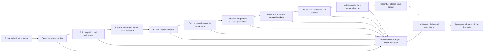

# Vulkan Render Loop Target Architecture

Last Updated: 2026-08-05

Owner: Rendering / Vulkan

Status: Target design for the v1 Vulkan backend

## Purpose

The Vulkan backend should have the robustness, failure containment, profiling
ergonomics, and predictable frame behavior expected from a mature production
renderer while remaining substantially smaller and easier to understand than
the current implementation. References to Unreal and Lumina describe that
quality bar; this design does not attempt to reproduce either engine's internal
architecture.

The intended result is a render loop that a contributor can follow from frame
wake through output settlement without searching hundreds of partial files. It
must be safe under resize, mixed outputs, resource replacement, shader and asset
churn, OpenXR timing, and device loss. It must also reveal where CPU time went in
every slow frame, including waits and work performed on other threads.

This is the target-state design. Implementation is tracked in the
[Vulkan Core Hardening And Recording Code Changes TODO](../../todo/rendering/vulkan-core-hardening-and-device-loss-todo.md),
and acceptance evidence is tracked in the
[Vulkan Core Hardening And Recording Testing TODO](../../testing/rendering/vulkan-core-hardening-and-recording-testing-todo.md).

## Current Baseline And Why It Is Not The Target

A 2026-08-05 source audit of
`XREngine.Runtime.Rendering.Vulkan/Rendering/API/Rendering/Vulkan/` found:

- 858 C# files and approximately 170,048 physical lines;
- 320 files named `VulkanRenderer*.cs`;
- 566 files below 100 lines and 447 files below 50 lines;
- 209 command files, 143 frame files, 142 backend-object files, 67 resource
  files, 59 descriptor files, and 45 render-graph files;
- individual ownership files above 3,000 lines while the lifecycle is also
  fragmented across very small partials.

The count was produced with `rg --files` and physical `Get-Content` line counts.
Generated files were not separately excluded because the present tree does not
provide a canonical generated-source manifest. The implementation must add one
before final structural comparison.

The timing surface is fragmented too. Desktop lifecycle counters currently
record a small fixed list of phases, `EVulkanCpuStage` records many flat
micro-stages, and `VulkanCpuSpanProfiler` can retain selected thread-local
spans. Those records do not yet share complete frame/output identity,
cross-thread links, wait classification, exclusive-time rules, or a root-time
reconciliation contract. Adding more isolated timers would make the problem
worse.

## Design Goals

1. **Deterministic correctness.** Every frame attempt, resource generation,
   recorded artifact, queue submission, and output image has explicit ownership
   and a legal settlement path.
2. **A small readable lifecycle.** One orchestration spine expresses the whole
   render transaction; focused owners implement its phases without hidden
   callbacks into a partial-class monolith.
3. **Low and predictable CPU cost.** Warm steady-state rendering allocates
   nothing, performs work proportional to changed or visible content, and
   avoids unnecessary waits, rescans, rebuilding, and native calls.
4. **Complete CPU attribution.** A developer can inspect p50, p95, p99, worst,
   exclusive work, waits, parallel overlap, and the critical path for the whole
   frame or any output.
5. **One architecture for every output.** Desktop, OpenXR, mirror, capture,
   probes, shadows, previews, ImGui, and diagnostics use the same frame-plan,
   generation, recording, submission, and telemetry vocabulary.
6. **Visible failure.** Requested accelerated paths fail with a structured
   reason when unavailable or invalid. They never silently become a CPU path or
   submit a mixed-generation frame.

## Non-Goals

- Do not replace the partial monolith with a generic service locator, dependency
  injection graph, callback framework, or interface per operation.
- Do not meet a file-count target by creating new giant files, grouping
  unrelated top-level types, or hiding behavior in generated code.
- Do not make multi-queue execution, parallel recording, command reuse, or
  device recreation mandatory when a simpler measured path is faster or safer.
- Do not put editor, MCP, logging, trace export, or profiler aggregation work in
  the measured render-loop hot path.
- Do not maintain multiple production planners, schedulers, descriptor models,
  or lifetime authorities for legacy and advanced paths.

## Core Invariants

- A frame is an explicit transaction with one immutable identity and exactly
  one terminal result: submitted, presented/released, deferred, rejected,
  superseded, output-unavailable, device-lost, or stopped.
- Every acquire, frame-slot reservation, upload reservation, command-pool use,
  timeline value, and output image is either transferred to a successful
  submission or settled on every early return.
- A frame consumes one immutable `FramePlan` and generation-complete resource
  publication. Planner or generation changes after planning reject or defer the
  frame; recording never re-resolves mutable global state.
- One owner publishes each mutable state transition. Other subsystems receive a
  value, immutable view, or narrow operation; they do not reach back through
  `VulkanRenderer` to discover ambient state.
- Recorded artifacts name exact pipelines, layouts, descriptors, image views,
  attachments, buffer ranges, output extents, and allocation/publication
  generations. Logical wrappers and names are not physical identity.
- No native object is destroyed while referenced by a worker, cached command
  artifact, submitted command buffer, output image, or pending diagnostic
  readback.
- A command pool has one recording owner at a time. Worker completion order can
  never change GPU-visible execution order.
- A partial worker batch, incompatible output, invalid plan, stale descriptor,
  or failed precondition is never submitted as a successful frame.
- Warm production paths perform zero managed allocation, zero same-frame GPU
  readback, and no unbounded loop, queue, cache, or retirement drain.
- Every hot collection has a declared consumer access pattern, canonical layout,
  element size/alignment, owner, and copy/conversion budget. `SoA`, `AoS`, and
  `AoSoA` are measured layout choices, not project-wide style rules.
- Unsafe code is confined to named native-interop or mapped-memory owners. A raw
  pointer never substitutes for frame/resource lifetime, capacity, bounds,
  alignment, generation, or cross-thread ownership.
- Every blocking call has a bounded policy where the API permits it and is
  measured as a named wait with an outcome. No wait is hidden inside a generic
  work stage.
- Device loss is first-writer-wins. Once confirmed, no new record, submit,
  wait, map, allocate, descriptor update, or plan publication may begin.

## Minimal Ownership Model

The target has one public facade and seven long-lived internal authorities.
Small value types remain beside their owner, one top-level type per file.

| Authority | Owns | Must not own |
|---|---|---|
| `VulkanRenderer` | Backend-neutral API translation and composition references | Per-frame mutable state, caches, native lifetime, scheduling policy, or feature implementation |
| `VulkanDeviceContext` | Instance, physical/logical device, capabilities, queues, device state, debug/fault facilities | Output policy, frame plans, or feature work |
| `VulkanOutputRuntime` | Desktop WSI and imported-output acquire/release/present contracts, output generations, recreate transactions | Scene planning or command encoding |
| `VulkanFrameLoop` | The frame transaction, phase order, typed outcomes, settlement, and deadline decisions | Resource caches, feature-specific recording, or native-object destruction |
| `VulkanFramePlanner` | Immutable view/output plans, render DAG compilation, packet ordering, and plan identity | Live native mutation or queue submission |
| `VulkanResourceRuntime` | Registry, memory, uploads, descriptor/pipeline publication, generation replacement, pinning, retirement | Frame policy or ambient plan selection |
| `VulkanCommandRuntime` | Prepared packet scheduling, record/reuse, worker arenas, barriers, queue gateway, and submission receipts | Scene discovery, mutable planner lookup, or output recreation |
| `VulkanFrameTelemetry` | Allocation-free aggregate timing, targeted trace capture, counters, correlation, and post-frame publication | Logging strings, file export, UI rendering, or benchmark orchestration on measured threads |

OpenXR and ImGui are adapters to these authorities, not alternative frame
loops. `VulkanOpenXrOutput` supplies runtime timing and imported images through
the output contract. ImGui contributes a volatile overlay packet in the same
plan and cannot replace the active resource-planner context.

Feature encoders are stateless or own only feature-local caches. They consume a
prepared packet/context and emit commands; they do not submit, present, retire,
or select another planner.

Dependencies flow in one direction:

```text
VulkanRenderer
  |-- VulkanDeviceContext
  `-- VulkanFrameLoop
       |-- VulkanOutputRuntime
       |-- VulkanFramePlanner
       |-- VulkanResourceRuntime
       |-- VulkanCommandRuntime
       `-- VulkanFrameTelemetry
```

The lower-level authorities receive only the narrow device facilities they use.
They may share immutable value contracts, but they do not call back into the
facade or frame loop to locate state.

## Source And Complexity Budget

The v1 target intentionally pairs source-count limits with size and ownership
limits so consolidation cannot create another monolith.

- `VulkanRenderer` is one non-partial facade in one hand-written source file,
  at most 500 physical lines. Generated interop is separate and may not own
  renderer state.
- The acquire-to-settlement lifecycle spine is at most 40 hand-written files
  and 20,000 physical lines. This includes frame orchestration, output
  coordination, planning orchestration, command scheduling/recording
  orchestration, submission, settlement, and lifecycle telemetry; it excludes
  leaf feature encoders and backend-object implementations.
- The complete hand-written Vulkan core under the audited directory is reduced
  from 858 files / 170,048 lines to no more than 550 files / 125,000 lines.
  Relocating truly backend-neutral code to its proper assembly counts only when
  dependency direction remains correct; hiding or generating the same Vulkan
  behavior does not.
- The main frame orchestration method is at most 100 logical lines and reads as
  the phase sequence below. Any hand-written file above 1,500 physical lines or
  method above 150 logical lines requires a documented ownership exception and
  a split review before promotion.
- The lifecycle spine uses no more than two ownership directories below
  `Vulkan/`. Deep folders are reserved for leaf backend objects or feature
  implementations, not used as a substitute for types and ownership.
- There is one production planner, command scheduler, descriptor publication
  model, lifetime tracker, queue gateway, and CPU trace schema. Legacy
  equivalents are deleted at cutover.

The structural numbers are architecture guardrails, not a reason to merge
unrelated types. If implementation evidence proves a target harmful, the owner
must revise this design and its testing gate before declaring completion; an
unrecorded exception is a failure.

## The Frame Transaction

The logical lifecycle is stable even when independent phases overlap or an
output is deferred:



OpenXR may begin with `xrWaitFrame`/`xrBeginFrame` and locate views late;
desktop acquire may be nonblocking and occur after shared preparation. Those
are output-policy variations inside the same transaction, not separate state
models.

Conceptually, the orchestration remains this small:

```csharp
VulkanFrameResult Render(in VulkanRenderRequest request)
{
    using VulkanFrameTrace frame = _telemetry.BeginFrame(request.Identity);
    VulkanFrameAttempt attempt = VulkanFrameAttempt.Begin(request);

    try
    {
        if (!_device.TryEnterFrame(ref attempt))
            return attempt.RejectForDeviceState();

        _resources.PollCompletionAndRetirement(ref attempt);
        _outputs.ResolveTimingAndAcquire(ref attempt);

        VulkanFramePlan plan = _planner.BuildOrReuse(request, in attempt);
        VulkanPreparedFrame prepared = _resources.Prepare(in plan, ref attempt);
        VulkanCommandBatch commands = _commands.RecordOrReuse(in prepared, ref attempt);
        VulkanSubmissionReceipt receipt = _commands.Submit(in commands, ref attempt);

        _outputs.Complete(in receipt, ref attempt);
        return attempt.Complete(in receipt);
    }
    finally
    {
        attempt.SettleAllOwnership();
        frame.End(attempt.Result);
    }
}
```

The exact C# types may change. The required property is that the method exposes
the complete lifecycle and every phase consumes explicit input and produces a
typed result.

## Stable Lifecycle Stages

All timing modes use one stable coarse taxonomy. Detail scopes can be added
under a stage without changing dashboards or promotion budgets.

| Stage | Includes | Important subdivisions |
|---|---|---|
| `FramePacing` | Callback dispatch, `xrWaitFrame`, deadline selection | engine delay, runtime wait, scheduler delay |
| `SnapshotHandoff` | Render snapshot/view-set availability and collect handoff | producer work, consumer wait, stale/deferred result |
| `CompletionMaintenance` | Timeline/fence polling and bounded retirement | driver query, retirement work, budget exhaustion |
| `OutputAcquire` | Desktop or imported-output acquire and ownership transfer | WSI wait, XR acquire/wait, unavailable/recreate result |
| `PlanBuild` | View/output plan, DAG compile/reuse, validation | cache lookup, graph compile, rejection reason |
| `ResourcePrepare` | Upload ranges, descriptors, pipelines, attachments, publication | useful work, cache hit/miss, driver work |
| `WorkSchedule` | Packet lowering, dependency comparison, worker assignment | visible work, dirty work, reuse decision |
| `CommandRecord` | Primary/secondary recording and deterministic merge | serial work, worker work, worker wait, native encoding |
| `SubmitPrepare` | Barrier/lifetime validation and wait/signal construction | queue-lock wait, validation, publication preparation |
| `QueueSubmit` | Native queue call and submission receipt publication | driver call, queue gateway wait, result |
| `OutputComplete` | Present, XR release/end, mirror/capture publication | driver/runtime wait, output result |
| `FrameSettlement` | Ownership settlement and immutable statistics publication | recovery submission, cancellation, final result |

Every stage record is classified as `Work`, `Wait`, `Driver`, `External`, or
`Diagnostic`. A wait reason and outcome are mandatory for `Wait`, `Driver`, and
`External` intervals. Generic `Other` or silently missing time is not an
acceptable steady-state classification.

## Immutable Plans And Generation Ownership

The frame plan contains only immutable, compact data needed to execute one
logical frame:

- engine frame, render frame, output, view-set, frame-slot, and deadline
  identity;
- ordered output requests and logical views;
- compiled pass/resource dependencies and render areas;
- resource, descriptor, pipeline, attachment, output, and layout generations;
- prepared packet ranges and command inheritance;
- explicit required, optional, deferrable, and reusable work;
- exact invalidation reasons and fallback/error policy.

Plan creation may borrow frame-local arenas but cached plans cannot retain a
borrowed span. A plan is published only when all referenced generations are
coherent. Data-only updates use stable frame-indexed ranges and do not create a
new structural plan.

Resource replacement is a transaction:

1. Allocate and prepare the complete replacement generation.
2. Validate views, descriptors, attachment identity, layouts, and command
   dependencies.
3. Publish the replacement as one atomic immutable tuple.
4. Let new plans reference the new generation.
5. Retire the prior generation after all frame-slot, worker, cached-artifact,
   queue, output, and diagnostic pins complete.

The old generation remains valid if preparation or publication fails.

## Resize, Output Change, And Device Loss

Interactive resize does not repeatedly destroy the active renderer. During a
Win32 modal drag, the last complete scene/presentation generation remains
published and WSI scaling presents it at the changing surface extent. Once the
extent stabilizes, output recreation builds one replacement generation and
publishes it transactionally. Minimized or zero-size surfaces produce an
explicit deferred output result.

Swapchain recreation never calls device-wide idle as a routine policy. It waits
only for completion values that own affected objects, and optional outputs
cannot block a required XR deadline.

Device state follows a single state machine:

```text
Running -> Quiescing -> Lost -> DiagnosticsComplete -> Stopped/RestartRequested
```

The first failing Vulkan/OpenXR operation owns the transition and diagnostic
context. Other threads observe `Quiescing` or `Lost` and stop producing work.
The v1 requirement is deterministic containment, evidence preservation, and an
explicit renderer/process restart policy. Transparent in-process logical-device
recovery is a later capability, not a prerequisite for a stable failure path.

## Command Recording And Submission

- The render graph and immutable frame plan are the only ordering authorities.
- Resource, pipeline, descriptor, and image-state preparation completes before
  a worker receives a packet.
- Persistent workers own fixed command-pool arenas per frame slot. Dispatch uses
  preallocated job records and occurs only when measured work exceeds the
  serial threshold.
- Reuse compares a generation-complete key. Camera, transform, material,
  visibility, and count data updated inside stable ranges remain data changes;
  they do not invalidate structural command topology.
- Volatile UI, text, debug, capture, and output-sensitive packets remain
  isolated so they cannot dirty stable scene artifacts.
- The primary records only render-scope boundaries, required barriers,
  secondary execution, explicitly primary-owned commands, and final output
  transitions.
- One queue gateway owns external queue synchronization, native submission,
  timeline publication, and breadcrumbs. It never holds a queue lock while
  waiting for a frame slot or resource retirement.
- Multi-queue execution is enabled only after paired ownership transfers,
  semaphore edges, and a measured whole-frame benefit are proven. Metadata that
  predicts overlap is not reported as executed overlap.

## CPU Efficiency Contract

Steady-state cost must scale with active work, not global registry size:

- no per-frame LINQ, closures, boxing, strings, exceptions for expected WSI
  results, `Task` creation, or collection growth;
- preallocated frame-slot arenas, struct keys, spans, SoA tables, stable numeric
  IDs, and reusable worker queues;
- no repeated string parsing, reflection, render-graph sorting, full registry
  scans, descriptor fingerprint reconstruction, or cache-wide dirty
  propagation on a stable frame;
- no pipeline/shader compilation, texture decode/transcode, large upload
  planning, or diagnostic serialization on the render thread;
- dirty-range descriptor and buffer publication, with capacity growth outside
  the measured interval when possible;
- bounded retirement, uploads, optional outputs, shadow refresh, capture work,
  and diagnostic readback;
- no same-frame CPU visibility/count readback for a zero-readback strategy;
- every lock has one named owner and measured contention. Broad renderer locks
  and lock ordering discovered through call-stack convention are forbidden.

Both work saved locally and whole-frame effect are measured. An optimization is
rejected if it moves a larger cost into planning, synchronization, descriptor
publication, retirement, another output, or tail latency.

## Data Layout And Native-Memory Boundary

Data layout follows the loop that consumes it:

1. Use SoA when a bulk stage scans the same subset of fields across many
   elements, especially when it removes unused cache-line traffic or enables
   vector/coalesced access.
2. Use compact AoS when one worker consumes most fields of one element together,
   as with a command job, frame-attempt state, dependency key, or final native
   Vulkan structure.
3. Use a hot/cold split when execution needs a compact common record but
   diagnostics, ownership, or uncommon variants require additional state.
4. Consider AoSoA only when realistic benchmarks show that fixed-size tiles
   improve SIMD or prefetch behavior without adding a material transpose,
   publication, or tail cost.
5. Do not maintain a canonical record plus an unconditional derived SoA copy.
   Either publish the stage-native streams directly or prove that the conversion
   cost is amortized by measured downstream savings.

The production layout contract is:

| Data | Canonical target | Reason |
|---|---|---|
| GPUScene culling, visibility, classification, and sorting inputs | Stage/domain SoA streams, with compact vector records inside a stream when one invocation consumes the whole vector | These stages scan selected fields over many draws; unrelated material, transform, identity, or diagnostic lanes must not consume bandwidth. |
| Vulkan indirect arguments | Contiguous AoS `VkDrawIndirectCommand` / `VkDrawIndexedIndirectCommand` output generated after culling | Vulkan consumes an array of native command structures at the requested stride. |
| CPU frame operations and render packets | Rich authoring objects only at ingress, then one opcode/index stream plus dense per-kind payload streams and numeric range-based packet headers | Planning, sorting, and recording must not chase polymorphic object graphs, per-packet arrays, or diagnostic strings. |
| Prepared mesh draws | Compact AoS hot header plus flattened frame-slot side streams; cold ownership and diagnostics remain in indexed sidecars | The encoder consumes most hot header fields together, while descriptor, vertex, primitive, viewport, scissor, push-constant, and lifetime payloads are variable-length. |
| Render-graph dependencies and planned barriers | Typed numeric resource IDs and flat offset/count adjacency arrays | Graph traversal is bulk numeric work; string-key dictionaries and lists-of-lists are not the execution representation. |
| Native barrier and descriptor update payloads | Contiguous ABI-shaped AoS scratch arrays | `VkDependencyInfo` and descriptor update commands take pointers to arrays of Vulkan structures. |
| Descriptor publication state | SoA dirty/generation/resource/layout tables; driver-ready arrays or descriptor bytes materialized only for dirty ranges | Publication scans selected state, while the final driver contract has a different native layout. |
| Worker jobs | Compact AoS records | A worker dequeues and consumes one complete job. |
| Worker-owned counters and trace storage | Per-worker blocks with independently aligned base and stride, merged after work completes | Field padding alone does not prevent false sharing when the containing array base is unaligned. |
| Frame transaction, typed outcomes, and dependency signatures | Compact AoS, split into structural/binding/data keys only when comparison profiles justify it | These values are consumed as coherent records and protect lifecycle correctness. |

### Current layout implications

The current scene database is a useful domain-level SoA foundation, but it still
contains broad per-draw records and compatibility conversions:

- `DrawMetadata` and `BoundsGpu` are currently 64 bytes each, while
  `GPUIndirectRenderCommandHot` is 80 bytes. Culling consumes only selected draw
  control lanes plus its chosen sphere/AABB representation.
- `GPURenderExtractSoA.comp` writes sphere/control scratch buffers, but the
  current `SoACull` method has no callers and itself binds `DrawMetadataBuffer`
  and `BoundsBuffer` rather than those extracted buffers. Production must remove
  this dead conversion and its scratch resources, or establish a measured real
  consumer before retaining it.
- `BuildSourceHotCommandBuffer` remains a compatibility conversion for current
  culling consumers. The target is direct consumption of stage-native GPUScene
  streams; a broad compatibility envelope must not remain an unconditional
  production pass.

GPUScene should therefore publish compact cull-control, cull-bounds,
classification/sort-key, material/state, transform, and visibility streams
directly. A cull-bounds stream may remain an AoS of `vec4` groups when one shader
invocation consumes the complete sphere or AABB; SoA does not mean splitting
every scalar into a separate buffer. AABB storage is optional for stages that do
not use it, rather than being fetched through every bounds lookup.

Logical SoA streams do not imply one wrapper, source file, Vulkan allocation, or
descriptor binding per field. One scene-layout schema and one scene-storage
owner publish related streams transactionally; compatible streams may occupy
typed aligned ranges of a shared backing allocation. The layout should reduce
bytes touched without recreating the file-count, object-count, binding-count, or
lifetime complexity this architecture is intended to remove.

CPU lowering follows the same rule. `FrameOp` subclasses may remain a convenient
front-door representation, but the immutable frame build lowers them once into
numeric operation and per-kind payload streams. `RenderPacket` becomes a compact
header containing IDs and `start/count` ranges into frame-owned storage. Prepared
mesh recording uses one frame-slot arena instead of per-draw arrays or pooled
buffers. Managed owner references and diagnostic names live in cold indexed
sidecars and are never touched by the worker encoding loop unless a diagnostic
is requested.

### Unsafe-code policy

Unsafe code is appropriate only where it expresses a real native-memory
contract:

- Vulkan ABI calls, `pNext` chains, and bounded arrays passed to the driver;
- persistently mapped upload, uniform, staging, readback, and descriptor-buffer
  arenas;
- binary SPIR-V/descriptor packing and validated GPU readback decoding; and
- measured aligned worker-local storage when managed placement cannot satisfy a
  proven false-sharing requirement.

Planning, sorting, graph traversal, lifecycle state, ordinary copies, field
comparisons, and bounds-check removal are not by themselves reasons to use
unsafe code. Start with idiomatic structs, `Span<T>`, `ReadOnlySpan<T>`,
`MemoryMarshal`, and vectorized .NET APIs. Retain a pointer implementation only
when a representative benchmark proves a meaningful end-to-end improvement and
the safe implementation cannot produce equivalent code.

Unsafe operations live in small non-partial owners such as
`VulkanNativeScratchArena` and `VulkanMappedFrameArena`; the facade and complete
subsystems are not declared `unsafe`. Their public/internal buffer interfaces use
typed slices containing arena identity, byte/element offset, length, alignment,
and generation. Raw pointers are acquired at the final native boundary and do
not escape the call or a generation-pinned arena lease. A pointer into managed
memory does not cross a `fixed` scope, frame, worker handoff, await, pool return,
or resource retirement boundary.

Every native arena validates capacity and alignment when reserving a slice,
records a high-water mark, and has one write owner while mutable. Base address
and element/worker stride are both aligned where false-sharing avoidance is the
goal. Vulkan mapped ranges additionally honor host/device ownership and
`nonCoherentAtomSize` flush/invalidate expansion; CPU cache-line padding is not a
substitute for Vulkan memory synchronization. Small bounded temporary storage
may use `stackalloc` through `Span<T>`, never inside an unbounded loop.

### Research basis

These rules reflect primary vendor/runtime/API guidance rather than assuming
that lower-level code is automatically faster:

- Intel's [SIMD Made Easy with Intel ISPC](https://www.intel.com/content/dam/develop/external/us/en/documents/simd-made-easy-with-intel-ispc.pdf)
  demonstrates SoA improving lane utilization for a field-wise triangle loop;
  it supports matching layout to the consumer, not universal SoA conversion.
- Microsoft's [.NET SIMD guidance](https://learn.microsoft.com/en-us/dotnet/standard/simd)
  requires realistic measurement because vectorization adds complexity and can
  expose memory bandwidth as the next bottleneck.
- Intel's [false-sharing analysis](https://www.intel.com/content/www/us/en/docs/vtune-profiler/cookbook/2024-2/false-sharing.html)
  shows that a cache-line-sized worker record is insufficient when the array
  base is not also aligned.
- Microsoft's [.NET unsafe-code guidance](https://learn.microsoft.com/en-us/dotnet/standard/unsafe-code/best-practices)
  prefers idiomatic `Span<T>` operations, bounded span-backed `stackalloc`, and
  scoped ownership over speculative pointer-based coalescing or escaping pooled
  buffers.
- Microsoft's [native interoperability guidance](https://learn.microsoft.com/en-us/dotnet/standard/native-interop/best-practices)
  favors fixed-layout blittable structures at native boundaries.
- The Vulkan definitions for [`VkDependencyInfo`](https://docs.vulkan.org/refpages/latest/refpages/source/VkDependencyInfo.html),
  [descriptor sets](https://docs.vulkan.org/spec/latest/chapters/descriptorsets.html),
  and [`vkCmdDrawIndexedIndirect`](https://docs.vulkan.org/refpages/latest/refpages/source/vkCmdDrawIndexedIndirect.html)
  require final pointer-addressed arrays of native structures; internal SoA
  plans must be materialized into those ABI layouts.
- Vulkan's [descriptor-buffer guide](https://docs.vulkan.org/guide/latest/descriptor_buffer.html)
  supports aligned arena allocation and mapped descriptor bytes, while the
  [memory specification](https://docs.vulkan.org/spec/latest/chapters/memory.html)
  requires explicit mapped-memory ownership and non-coherent range alignment.

## One CPU Observability System

`VulkanFrameTelemetry` replaces the three disconnected timing interpretations
with one schema and two capture modes.

### Aggregate mode

- Always available in profiling-enabled builds.
- Uses fixed per-thread/per-frame arrays indexed by the stable lifecycle stage.
- Records one root and coarse stage totals, outcomes, counts, waits, and
  allocations with no per-scope allocation and no strings.
- Publishes once at frame settlement; dashboard aggregation and percentiles run
  on another thread or after capture.

### Targeted trace mode

- Opt-in and explicitly marked diagnostic when observer overhead is material.
- Uses pre-warmed, preallocated per-thread/worker ring buffers.
- Retains selected subtrees and a small frame window rather than tracing every
  native call forever.
- Can freeze the preceding and following bounded frame window when a stage or
  root exceeds a configured slow-frame threshold.
- Exports only after the measured interval.

Every retained span contains:

- engine frame ID, render frame ID, output ID, view-set ID, frame slot, and
  output/resource generation;
- stable stage ID and optional detail ID;
- span ID, parent span ID, and a cross-thread link ID for dispatched work;
- managed thread ID and stable worker ID;
- start/end monotonic timestamps and allocated bytes;
- classification (`Work`, `Wait`, `Driver`, `External`, or `Diagnostic`);
- operation count/bytes where meaningful;
- typed result and wait/reuse/invalidation/failure reason.

The hot path stores numeric IDs. Names and formatted descriptions are resolved
by the exporter.

### Attribution rules

- Inclusive and exclusive time are computed from span nesting after capture.
- Parallel worker time is reported as aggregate CPU, wall-clock active span,
  overlap, imbalance, and render-thread wait; worker durations are not summed
  into root wall time.
- The critical path follows causal links from frame wake to required output
  completion. Optional desktop/capture work is not charged to an XR critical
  path unless it actually delays it.
- Driver and external waits remain visible rather than appearing as engine
  work.
- The union of classified root children is reconciled against the root wall
  interval. In detailed acceptance captures, at least 99% of the root interval
  must be attributed and every individual gap of 50 microseconds or more must
  receive a stage or an explicit `Unattributed` failure record.
- Percentiles are calculated over compatible frame/output cohorts. Average FPS
  alone is never a promotion metric.

The standard output presents:

- root and stage p50/p95/p99/worst;
- exclusive work, wait, driver, and external time;
- critical-path contribution and parallel overlap;
- allocation, invocation, work-item, cache hit/miss, and invalidation counts;
- slow-frame reason, first dominating stage, and remaining unattributed time;
- a frame tree/timeline in the editor profiler and the same stable IDs in
  machine-readable JSON/CSV/trace and MCP results.

The detailed component-profile harness remains owned by the
[Vulkan Headless MCP Component Profiling TODO](../../todo/rendering/optimization/vulkan-headless-mcp-component-profiling-todo.md).
That harness consumes this lifecycle schema; it must not create a second stage
taxonomy.

## Migration Strategy

1. Freeze the current structural and performance baselines, define the
   generated-source manifest, and add dependency/ownership reports.
2. Implement the root frame/output identity and stable lifecycle telemetry
   before moving behavior, so every extraction can be measured.
3. Establish the small `VulkanFrameLoop` spine and typed settlement contract
   over current behavior.
4. Extract or consolidate the seven authorities one vertical responsibility at
   a time, migrating all callers before starting another authority.
5. Replace mutable/ambient planning with immutable plans and generation-complete
   publications, then lower object graphs into the canonical measured hot-data
   layouts before worker scheduling.
6. Collapse command scheduling, recording, reuse, submission, native scratch,
   and mapped-memory access onto the one command runtime, queue gateway, and
   audited unsafe boundary.
7. Move desktop, OpenXR, capture, shadow, preview, and ImGui through the same
   output/frame contracts.
8. Delete partial implementations, forwarding shims, duplicate profilers,
   legacy planners/caches, and superseded feature paths immediately after each
   consumer migrates.
9. Meet the structural, correctness, resize, device-loss, allocation,
   profiler-overhead, desktop, presentationless, and OpenXR gates before
   production cutover.

Mechanical moves and behavioral changes should remain reviewable, but an
intermediate forwarding layer is deleted in the same phase that finishes its
migration. A forwarding layer is not a completed architecture.

## Completion Definition

The target is complete only when all of the following are true:

- the ownership and source budgets above pass from a reproducible inventory;
- a contributor can trace frame wake through settlement from the one frame-loop
  spine and locate every mutable owner from this document;
- steady-state desktop and supported XR paths allocate zero managed bytes and
  meet their approved p50/p95/p99/worst CPU budgets;
- each hot stage has one measured canonical layout, no unconsumed compatibility
  extraction or duplicate publication path, and reports the elements, bytes,
  copies, and conversions responsible for its cost;
- logical SoA streams remain grouped under cohesive schemas and storage owners
  rather than creating per-column wrappers, files, allocations, or lifetime
  authorities;
- unsafe code exists only in the audited native/mapped-memory owners, every raw
  pointer is bounded by an explicit slice and generation lease, and no unsafe
  implementation survives when the safe span-based form is equivalent;
- detailed traces attribute at least 99% of frame-root wall time, identify every
  50-microsecond-or-larger gap, and distinguish critical-path work, waits,
  driver time, and parallel overlap;
- observer overhead passes the clean-versus-aggregate-versus-targeted A/B gates;
- continuous resize, minimize/restore, swapchain recreation, mixed-output churn,
  resource replacement, shader/asset churn, and long soaks complete without
  device loss, stale generation, use-after-retire, deadlock, or unbounded work;
- injected failure at every lifecycle boundary produces one structured result,
  settles ownership, and preserves the first fault;
- no requested accelerated path silently falls back to CPU execution;
- current architecture docs, profiler documentation, source maps, and runtime
  behavior agree.

## Related Documents

- [Vulkan CPU SIMD Refactor Pass Design](vulkan-cpu-simd-refactor-pass-design.md) -
  the measured, backend-neutral policy and execution sequence for CPU rendering
  kernels; Vulkan lifecycle and native command code remain outside SIMD scope.
- [Vulkan Renderer](../../../architecture/rendering/vulkan-renderer.md) - the
  current implementation architecture until this target is cut over.
- [Vulkan Primary And Secondary Command Recording](../../../architecture/rendering/vulkan-command-recording.md) - current recording behavior and
  invariants.
- [Vulkan Multi-View Render-Graph Design](vulkan-render-loop-design.md) - view,
  render-batch, occlusion, and deadline-scheduling design consumed by this
  lifecycle architecture.
- [Vulkan Runtime Code Organization TODO](../../todo/rendering/vulkan-runtime-code-organization-todo.md) - historical extraction milestone and audit
  context; remaining target-state debt is consolidated into core hardening.
