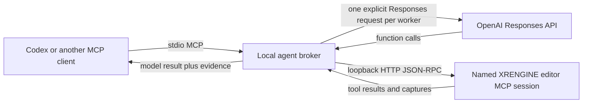

# Lightweight Local Agent Broker And Orchestration Extraction TODO

Created: 2026-07-30

Status: Completed 2026-07-30

## Goal

Extract the provider and tool-use orchestration currently embedded in the
ImGui MCP Assistant into a reusable, UI-independent library, then add a
lightweight local broker that:

- is callable by Codex or another MCP client over stdio;
- starts explicit OpenAI Responses API runs on GPT-5.6 Terra, Luna, or Sol;
- proxies model function calls to a specifically named local editor MCP
  session;
- returns a compact evidence packet and the exact model actually used; and
- preserves cancellation, budgets, mutation safety, and useful diagnostics.

The broker is an application built on the public OpenAI API. It must not use
ChatGPT/Codex session credentials, private endpoints, undocumented model
aliases, or editor-process discovery by process name.

## Why A Local Broker Is Still Needed

The Responses API has a hosted multi-agent beta, but all subagents in one
request share that request's model and tools. That is useful for same-tier
parallelism, but it does not provide explicit mixed Sol/Terra/Luna routing.
The first broker version should therefore launch one normal Responses API run
per explicitly selected worker model and coordinate those runs locally.

The editor MCP server is loopback-only in the normal development workflow.
The broker should translate its MCP tool definitions into Responses API
function tools and execute calls locally. It should not expose the editor MCP
server to the public Internet merely so the Responses API can use the hosted
remote-MCP tool.

Relevant current OpenAI documentation:

- [Responses API multi-agent](https://developers.openai.com/api/docs/guides/responses-multi-agent)
- [Function calling](https://developers.openai.com/api/docs/guides/function-calling)
- [MCP and connectors](https://developers.openai.com/api/docs/guides/tools-connectors-mcp)
- [GPT-5.6 model guidance](https://developers.openai.com/api/docs/guides/latest-model)
- [Production best practices](https://developers.openai.com/api/docs/guides/production-best-practices)

## Existing Implementation To Extract

The following code already proves most of the protocol path but is coupled to
`McpAssistantWindow`, ImGui chat state, and editor globals:

- `XREngine.Editor/UI/Tools/McpAssistantWindow/McpAssistantWindow.OpenAiResponses.cs`
  owns the Responses API request, SSE parsing, ten-round function-call loop,
  `call_id` correlation, tool execution, image feedback, and final text.
- `XREngine.Editor/UI/Tools/McpAssistantWindow/McpAssistantWindow.McpTools.cs`
  lists local editor MCP tools and converts MCP `inputSchema` definitions into
  OpenAI function parameters.
- `XREngine.Editor/UI/Tools/McpAssistantWindow/McpAssistantWindow.LocalTools.cs`
  dispatches local tools and HTTP JSON-RPC `tools/call` requests.
- `XREngine.Editor/UI/Tools/McpAssistantWindow/McpAssistantWindow.McpAttach.cs`
  starts and preflights the in-process editor MCP server.
- `XREngine.Editor/UI/Tools/McpAssistantWindow/McpAssistantWindow.RequestDispatch.cs`
  owns provider selection, timeouts, reprompting, context compaction, UI
  lifecycle, and cancellation.
- `XRENGINE/Settings/EditorPreferences.cs` and
  `XRENGINE/Settings/EditorPreferences.Secrets.cs` own editor-facing model,
  endpoint, and protected/environment-backed secret preferences.

The extraction must leave chat rendering, ImGui state, viewport presentation,
and editor preference mutation in `XREngine.Editor`.

## Proposed Shape

Project names are provisional and should be confirmed in P0 before adding them.

| Project | Responsibility | Dependency direction |
|---|---|---|
| `XREngine.AgentOrchestration` | Responses transport, streaming event parser, tool loop, MCP client abstraction, routing contracts, budgets, and run results | .NET BCL only for the first slice |
| `Tools/LocalAgentBroker` | Small console/MCP stdio host, run registry, configuration, named editor-session resolution, and tool-policy enforcement | References `XREngine.AgentOrchestration` |
| `XREngine.Editor` | ImGui adapter, chat history/segments, editor preferences, screenshots, and in-process MCP startup | References `XREngine.AgentOrchestration` |

Do not put the broker in `XREngine.ControlPlane`; that project owns multiplayer
instance coordination and should not gain AI-provider or editor dependencies.

## Non-Goals For Version 1

- Replacing Codex's built-in subagent system or claiming that the current Codex
  task changed models.
- Reusing a ChatGPT subscription, browser cookie, Codex access token, or other
  non-API credential.
- Making the editor MCP endpoint public or requiring a secure tunnel.
- Giving API workers unrestricted shell, repository write, Git, process, or
  network tools.
- Automatically choosing a more expensive or cheaper model without explicit
  caller authorization.
- Running multiple mutating workers concurrently against the same editor
  session.
- Replacing Anthropic, Gemini, GitHub Models, or Realtime support during the
  first extraction.

## Core Contracts

Define focused types in separate files:

- `AgentRunRequest`: objective, success criteria, constraints, requested model,
  reasoning effort, evidence packet, editor session, tool policy, and budgets.
- `AgentRunResult`: run ID, status, exact model used, output items, final text,
  tool evidence, token usage, elapsed time, and structured failure.
- `AgentRunBudget`: maximum turns, tool calls, output tokens, elapsed time,
  retries, and optional concurrency.
- `AgentToolDefinition`, `AgentToolCall`, and `AgentToolResult`: provider-neutral
  tool contracts that preserve the provider call ID without leaking UI types.
- `IAgentModelClient`: provider request/continuation boundary.
- `IAgentToolProvider`: list and execute boundary for editor MCP or future
  local tools.
- `IAgentRunObserver`: streaming text, tool state, usage, and diagnostic events
  consumed by either ImGui or the broker host.
- `AgentFailure`: stable category, safe summary, retryability, provider status,
  and redacted diagnostic detail.

Keep `JsonNode`, HTTP, SSE, and Responses-specific output-item parsing behind
the OpenAI model-client implementation. Keep `ChatMessage`, `ToolCallEntry`,
camera focusing, and UI status strings out of the reusable layer.

## Broker MCP Surface

Start with a small, explicit tool set:

- `recommend_agent_route`: classify a supplied task against the repository's
  Terra/Luna/Sol policy without launching or changing models.
- `start_agent_run`: validate an explicitly requested model and enqueue a run;
  return a run ID immediately.
- `get_agent_run`: return status, incremental text, tool evidence, usage, and
  the final result.
- `cancel_agent_run`: cooperatively cancel the model request and any outstanding
  local tool call.
- `list_agent_runs`: return bounded metadata for active and recent runs.

Do not add a generic "execute command" tool. Do not let a model name arrive as
an arbitrary unvalidated API string.

## Model Routing Contract

- Use exact public API model IDs in configuration:
  `gpt-5.6-terra`, `gpt-5.6-luna`, and `gpt-5.6-sol`.
- Require `requested_model` on `start_agent_run`. The broker may reject or
  recommend a different tier, but it must not silently substitute one.
- Apply the repository policy:
  - Terra for normal coordination, implementation, debugging, and review.
  - Luna for bounded, reversible work with deterministic checks.
  - Sol for difficult or high-risk reasoning slices.
- Return `requested_model` and `actual_model` in every result and diagnostic.
- Treat account/model unavailability as a visible failure. Do not fall back to
  another model unless the caller submits a new explicitly authorized request.
- Carry a compact handoff packet: objective, success criteria, constraints,
  relevant files and symbols, current diff, commands/results, failed
  hypotheses, unresolved questions, and next decision.
- Keep hosted Responses multi-agent disabled in version 1. Evaluate it later
  only for same-model work, with a feature flag and measured benefit.

## Editor MCP Safety Contract

- Require a named session and resolve only
  `Build/_AgentValidation/mcp-sessions/<name>/session.json`.
- Validate the manifest path stays within the repository session root.
- Accept only loopback endpoints by default (`localhost`, `127.0.0.1`, or
  `[::1]`), then call `ping` and verify the reported editor session name.
- Never find, start, stop, or terminate an editor process by process name.
  Session lifecycle remains owned by `Tools/Manage-McpEditorSession.ps1`.
- Default each run to read-only tools. Mutation requires an explicit request
  flag plus an allowlist compatible with the named editor session.
- Maintain one mutation lease per editor session. Independent read-only runs
  may execute concurrently; mutating runs must serialize.
- Enforce broker-side allowed/denied tool lists even when the editor session
  itself uses `AllowAll`.
- Preserve MCP JSON-RPC errors and tool error state instead of converting them
  into successful text.
- Bound tool result size and store large captures under the active
  `Build/_AgentValidation/<run>/` root.
- Require read-back or viewport capture evidence for visually observable
  mutations.

## API And Secret Safety

- Use the public `https://api.openai.com/v1/responses` endpoint.
- Read the standalone broker key from `OPENAI_API_KEY` or another explicitly
  configured environment-variable name. Do not accept the key on the command
  line, return it through MCP, or persist it in broker JSON.
- Let the editor adapter continue using the existing protected/env-backed
  preferences; pass a resolved credential through an in-memory interface only.
- Redact authorization headers, keys, source payloads marked sensitive, and
  provider response headers before logging.
- Make storage behavior an explicit configuration decision and document what
  request and trace data may leave the machine.
- Record model ID, token usage, call counts, elapsed time, cancellation, and
  retry decisions. Do not hard-code dollar estimates that can become stale.
- Add exponential backoff with jitter only for retryable transport/rate-limit
  failures. Never retry a mutating tool call whose completion is ambiguous
  without an idempotency contract.
- Re-check current OpenAI service terms, usage policies, and model availability
  before distributing the broker. The implementation must rely only on normal
  API access billed to the configured API account.

## P0 - Freeze Boundaries And Acceptance Tests

- [x] Record the current assistant behavior with deterministic tests before
      moving code: SSE text, function argument deltas, multiple calls, malformed
      events, provider error events, images, round limits, and cancellation.
- [x] Confirm project names, target frameworks, dependency direction, and
      whether the reusable library can remain BCL-only.
- [x] Inventory which current methods are orchestration, provider transport,
      MCP transport, local tool implementation, prompt construction, and UI.
- [x] Define the stable request/result/error/event schemas and JSON
      serialization contract.
- [x] Define the explicit routing and mutation-authorization contract.
- [x] Decide whether version 1 uses `store: false` and document the required
      continuation/reasoning-item handling.
- [x] Write a threat model covering API-key exposure, prompt injection, hostile
      tool descriptions/results, path traversal, arbitrary endpoints, duplicate
      mutations, cost exhaustion, and orphaned runs.

Exit criteria:

- the extraction boundary is documented;
- existing behavior has deterministic characterization tests; and
- no new package or dependency has been introduced.

## P1 - Extract The Reusable Tool Loop

- [x] Move Responses payload creation, SSE parsing, output-item handling,
      function-call aggregation, `call_id` preservation, and round control into
      `XREngine.AgentOrchestration`.
- [x] Replace direct `ChatMessage` mutation with `IAgentRunObserver` events.
- [x] Extract MCP `tools/list`, schema conversion, `tools/call`, auth, timeout,
      and protocol-error handling behind `IAgentToolProvider`.
- [x] Keep viewport presentation, tool-call segments, camera auto-focus, and
      ImGui status updates in an editor observer/adapter.
- [x] Make maximum rounds, tool calls, result bytes, elapsed time, and output
      tokens request budgets instead of embedded constants.
- [x] Preserve multimodal tool results without forcing every consumer to load
      an entire capture into memory.
- [x] Keep the current editor assistant behavior working through the extracted
      library before adding the broker host.

Exit criteria:

- the ImGui assistant passes its characterization tests;
- orchestration code has no ImGui or editor-global dependency; and
- the Editor builds with zero new warnings.

## P2 - Add The Local Broker Host

- [x] Add the console host and implement MCP stdio framing without writing
      logs or banners to stdout.
- [x] Add `recommend_agent_route`, `start_agent_run`, `get_agent_run`,
      `cancel_agent_run`, and `list_agent_runs`.
- [x] Implement a bounded in-memory run registry with cancellation and
      retention limits.
- [x] Validate exact model IDs and return both requested and actual models.
- [x] Resolve and preflight named editor sessions from their manifests.
- [x] Add per-session read/write coordination and broker-side tool filtering.
- [x] Place optional traces under one
      `Build/_AgentValidation/<run>/` directory with redaction enabled.
- [x] Add a PowerShell launcher that resolves the repository root without
      depending on Git ownership checks.
- [x] Add an optional project `.codex/config.toml` entry only after a direct MCP
      initialize/list-tools smoke test passes on Windows.

Exit criteria:

- Codex can initialize the broker over stdio;
- starting a run returns promptly and polling yields a terminal result; and
- cancellation stops both the API request and pending editor call.

## P3 - Validate Routing And Editor Use

- [x] Use fake Responses and MCP servers for all deterministic CI tests.
- [x] Prove Terra, Luna, and Sol requests preserve the caller's exact selection
      and reject an unavailable or unapproved model without substitution.
- [x] Prove a worker can list editor tools, inspect a named session, and return
      evidence through a read-only run.
- [x] Prove a mutation-authorized worker performs one bounded editor change,
      reads it back, and captures visual evidence when applicable.
- [x] Prove two read-only runs may overlap while two mutating runs targeting the
      same session cannot.
- [x] Prove malformed tool arguments, duplicate call IDs, timeouts, retries,
      cancellation races, oversized outputs, and editor shutdown are terminal
      or recoverable according to the documented contract.
- [x] Add an opt-in live API smoke test guarded by `OPENAI_API_KEY`; never run it
      in ordinary CI or without a strict token/tool/time budget.
- [x] Compare the broker against direct in-editor execution for result quality,
      latency, token use, tool-call count, and failure clarity.

## P4 - Documentation And Operational Handoff

- [x] Add a user guide for configuring the API key, starting the broker,
      selecting a model explicitly, choosing a named editor session, polling,
      cancelling, and understanding API charges.
- [x] Add a developer guide for the extraction boundaries, protocol schemas,
      routing rules, tool security, traces, and test fixtures.
- [x] Update the MCP server guide to distinguish the editor MCP server, the
      broker MCP server, and the broker's internal MCP client.
- [x] Update `AGENTS.md` only if the broker becomes a supported routing surface;
      state clearly that an API worker is not an in-place Codex model switch.
- [x] Document setup and the Windows launcher in the canonical bootstrap/task
      workflow.
- [x] If any NuGet package is proposed, obtain dependency approval first, verify
      commercial/community-license compatibility, run
      `Tools/Generate-Dependencies.ps1`, and review the generated dependency and
      license files.

## Final Acceptance Criteria

- The ImGui assistant and broker share one tested orchestration implementation.
- The broker uses only public API credentials and endpoints.
- Every run reports its requested and actual model with no silent tier change.
- A named local editor session can be used without exposing it publicly.
- Read-only is the default, mutations require explicit authorization, and
  same-session mutations are serialized.
- Runs have deterministic cancellation and bounded time, tokens, tool calls,
  output size, retries, concurrency, and retention.
- Secrets and authorization headers are absent from MCP output and traces.
- Fake-server tests cover protocol and failure behavior; the opt-in live smoke
  test is documented and budgeted.
- Targeted library, broker, Editor, and unit-test builds pass with zero new
  warnings.

## Completion Notes

- Implemented `XREngine.AgentOrchestration` and `Tools/LocalAgentBroker` as
  .NET 10 BCL-only projects; no dependency or license inventory changed.
- The ImGui OpenAI Responses path now uses the shared transport, SSE parser,
  contracts, observer events, and bounded tool loop.
- Deterministic fake-provider/editor tests cover all three exact model IDs,
  streaming and malformed events, function calls/call IDs, mutation evidence,
  visual capture evidence, policies, retries, timeouts, truncation,
  cancellation, named-session identity, run polling, and read/write leases.
- The Windows publish plus stdio initialize/list-tools smoke test passed. The
  billed live API smoke remains explicit and was not run during implementation.
- Direct in-editor and broker execution now share the same orchestration
  implementation. Deterministic comparison shows equivalent parsed output,
  usage, tool evidence, and failure categories; broker-only overhead is named
  session preflight, enqueue/polling, and lease coordination.
- The orchestration/broker builds and targeted tests pass with no new compiler
  warnings. The touched Editor assembly also builds against existing project
  references; a full dependency rebuild at closeout was blocked by the
  unrelated dirty-worktree Vulkan `Debug.Assert` compile error recorded in the
  handoff.
