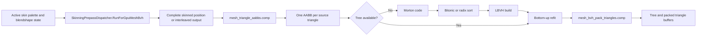
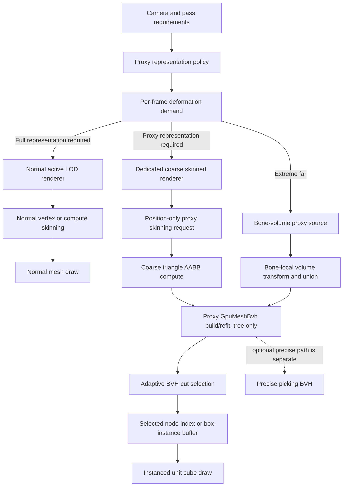

# GPU Skinned BVH Proxy LOD Rendering Design

Last Updated: 2026-08-26  
Status: design proposal  
Reference Revision: `master` at `76e241e5937ad29d00d435de3c32be1d095ff327`  
Scope: far-distance rendering for skinned meshes using a dedicated coarse deformation source, a tree-only GPU BVH, an adaptive BVH node cut rendered as instanced solid boxes, and an optional bone-driven extreme-distance tier.

[<- Work docs index](../../../README.md)

Related docs:

- [GPU Mesh BVH](../../../../architecture/rendering/gpu-mesh-bvh.md)
- [Skinning](../../../../developer-guides/rendering/skinning.md)
- [GPU-Driven Animation Architecture](gpu-driven-animation.md)
- [GPU Skinning Buffer Compression Plan](gpu-skinning-buffer-compression-plan.md)
- [Skinning Deferred GPU Efficiency Design](skinning-deferred-gpu-efficiency-design.md)
- [Skinning GPU Efficiency Follow-Ups TODO](../../../todo/rendering/gpu/skinning-gpu-efficiency-followups-todo.md)
- [Avatar Optimization And Virtualized Avatar Rendering Design](../avatar-optimization-and-virtualized-rendering-design.md)
- [GPU Meshlet Zero-Readback Rendering Design](../gpu-meshlet-zero-readback-rendering-design.md)
- [Zero-Readback GPU-Driven Rendering Plan](../zero-readback-gpu-driven-rendering-plan.md)
- [Production GPU-Driven Rendering Roadmap](../../../todo/rendering/gpu/production-rendering-pipeline-roadmap.md)

---

## 1. Executive Summary

XRENGINE already builds and refits per-mesh triangle BVHs entirely on the GPU. For skinned meshes, `GpuMeshBvh` forces `SkinningPrepassDispatcher` to produce current deformed positions, computes one AABB per source triangle, builds or refits a Morton LBVH, and optionally packs the deformed triangles in Morton order for ray queries.

Rendering the current BVH leaves as boxes without changing that pipeline would avoid the normal source-mesh draw, but it would still:

- skin every vertex of the active source mesh,
- process every source triangle into an AABB,
- refit the full triangle hierarchy,
- and, under the current readiness contract, pack every deformed triangle for ray queries.

That naive form can reduce material, overdraw, draw-call, and shadow cost, but it does **not** reliably reduce deformation cost. At long range, where the source covers few pixels, full-resolution skinning and per-triangle BVH work can cost more than the raster draw being replaced.

This design therefore makes the following production decisions:

1. **The proxy BVH uses a dedicated coarse skinned source renderer**, normally the furthest authored/generated LOD or a dedicated generated proxy source. It does not use LOD0 unless explicitly requested.
2. **The proxy tree is separate from the precise picking BVH.** It uses larger primitive groups and tree-only output, while the picking tree may retain one triangle per leaf and packed triangles.
3. **Proxy-only preparation never packs raycast triangles.** `GpuMeshBvh` exposes distinct tree-ready and raycast-ready states.
4. **The visible proxy is an adaptive cut through the BVH**, not necessarily the physical leaf array. Internal nodes become render-time proxy leaves when their projected size is sufficiently small.
5. **All selected nodes are rendered as instances of one shared solid unit cube.** There is never one draw call or one mesh allocation per box.
6. **Proxy deformation updates run at a reduced, screen-size-dependent cadence**, while the renderable root transform remains current every frame.
7. **The original high-detail renderer is not compute-skinned solely for a far proxy view.** It may still be skinned when another active consumer requires it, such as a near camera, a precise interaction request, or a pass that has not adopted the proxy policy.
8. **An optional bone-driven extreme-distance tier bypasses vertex skinning completely.** Cooked conservative bone-local proxy volumes are transformed from the active skin palette and used to refit a coarse proxy hierarchy.
9. **The first implementation uses a CPU-direct production proxy command for correctness and isolation.** A later GPUScene integration keeps both representations resident and routes proxy boxes through a global indirect instance stream.

The feature is intended to sit after conventional mesh LODs and before an impostor or single-volume representation:

```text
Near        full skinned LOD
Middle      authored/generated low-poly skinned LOD
Far         adaptive GPU BVH box proxy from a coarse skinned source
Very far    bone-volume proxy or octahedral impostor
```

The BVH proxy is not a replacement for a good low-poly LOD. It is an automatically generated, conservative, continuously scalable final geometry tier for cases where the source would otherwise spend substantial deformation and material cost for very little screen contribution.

---

## 2. Decision Summary

| Area | Decision |
|---|---|
| Default proxy source | Furthest valid skinned LOD, not the current high-detail LOD. |
| Fallback when no coarse LOD exists | Disable by default; optionally generate a dedicated source through the existing meshoptimizer LOD pipeline. |
| BVH ownership | Separate `GpuMeshBvh` instance for proxy rendering. |
| BVH output | Tree only; packed triangles are omitted. |
| Default leaf grouping | Start at 64 source triangles per physical leaf and tune by profiling. |
| Rendered nodes | Adaptive internal-node cut selected by projected size. |
| Proxy primitive | One shared `[0,1]^3` solid cube, 24 vertices and 36 indices, instanced. |
| Normal path | Flat face normals transformed with the proxy basis normal matrix. |
| Main transition metric | Projected screen radius in pixels, with enter/exit hysteresis. |
| Node refinement metric | Projected node diameter in pixels. |
| Update cadence | Pose-sensitive and screen-size-dependent; root transform remains per-frame. |
| Readback policy | No synchronous GPU readback in the visible path. |
| Picking | Continues using the precise mesh BVH or CPU mesh path; proxy boxes are not authoritative geometry. |
| Initial submission path | CPU-direct command using GPU-generated buffers and indirect instance count where supported. |
| Production crowd path | Global GPU proxy manager, indirect box instance stream, GPUScene representation routing. |
| Extreme-distance path | Bone-driven conservative proxy leaf bounds; no vertex skinning. |

---

## 3. Goals

### 3.1 Primary goals

- Avoid skinning the original high-detail mesh when only the far proxy representation is required.
- Reduce deformed vertex count, triangle-AABB work, node-refit work, raster triangles, material evaluation, draw calls, and shadow cost at distance.
- Reuse XRENGINE's existing GPU BVH node layout, refit implementation, skinning buffers, render-thread lifetime model, and indirect drawing infrastructure.
- Keep the normal visible path GPU-resident and free of synchronous readback.
- Preserve the source asset and normal LOD chain; the feature is an additional runtime representation.
- Keep precise interaction, collision, and editor BVH preview behavior independent from proxy quality settings.
- Support OpenGL first without designing an OpenGL-only contract that blocks Vulkan.
- Remain allocation-free in steady-state render and update paths.
- Produce explicit profiler and fallback diagnostics so the feature can be disabled when it is not profitable.

### 3.2 Quality goals

- Proxy transitions should occur only when blockiness is below a configurable screen-space error threshold.
- The selected BVH cut must conservatively cover every proxy-source primitive exactly once through one selected ancestor.
- The proxy must remain spatially attached to the current skinned root and must not lag root translation, rotation, or scale.
- Reduced deformation cadence may lag local animation, but it must be bounded, configurable, and reset immediately on teleports, source changes, or representation transitions.
- Stereo views must agree on one conservative cut or otherwise avoid left/right-eye representation mismatch.

### 3.3 Performance goals

- No LOD0 skinning dispatch should be caused solely by a proxy-active far view when a dedicated coarse source is available.
- Proxy preparation must skip `mesh_bvh_pack_triangles.comp`.
- The selected box count must be capped and observable.
- The far proxy should be cheaper than the lowest conventional visible LOD on representative scenes before it is enabled by default.
- Crowd scaling should move toward one or a small number of proxy draws per material domain rather than one draw per character.

---

## 4. Non-Goals

- The proxy is not authoritative collision geometry.
- The proxy does not replace precise ray picking.
- The first implementation does not attempt texture-accurate UV mapping onto boxes.
- The first implementation does not preserve transparent hair-card appearance. Transparent and highly masked sections require separate eligibility rules or an impostor.
- The first implementation does not skin only visible source meshlets. Cluster-local skinning remains a separate longer-horizon optimization.
- The first implementation does not solve all multi-camera representation conflicts. The safe fallback is the highest-detail demand across concurrent views.
- The first implementation does not require the GPU-driven animation project. It consumes the renderer's active skin palette through the existing skinning prepass contract.
- The proxy does not make full-resolution animation evaluation free. CPU or GPU animation may still evaluate the skeleton; the savings begin at vertex/blendshape deformation and rendering.
- The feature does not guarantee a gain for every mesh. Small, cheap, opaque meshes may be faster as ordinary LODs.

---

## 5. Terminology

| Term | Meaning |
|---|---|
| Source renderable | The normal `RenderableMesh` and its regular LOD chain. |
| Full source | The high-detail renderer that would normally be drawn near the camera. |
| Proxy source | A dedicated coarse skinned `XRMeshRenderer` used only to generate current proxy bounds. |
| Proxy tree | A `GpuMeshBvh` instance owned for far rendering, separate from precise picking. |
| Physical leaf | A leaf emitted by `bvh_build.comp`, containing up to `MaxLeafPrimitives` Morton-sorted source triangles. |
| Adaptive cut | A set of BVH nodes whose subtrees partition the proxy tree and are rendered as boxes. |
| Render-time proxy leaf | Any selected node in the adaptive cut, including an internal BVH node. |
| Proxy box | One instanced solid cube transformed to a selected node's bounds. |
| Tree-ready | BVH nodes and Morton permutation are valid. Packed raycast triangles are not required. |
| Raycast-ready | Tree-ready plus current packed triangles. |
| Bone-driven proxy | Extreme-distance path that computes conservative proxy bounds from bone matrices instead of deformed vertices. |

---

## 6. Current Engine State

### 6.1 Current skinned GPU mesh BVH flow

The current implementation is centered on:

- `XREngine.Runtime.Rendering/Rendering/Compute/GpuMeshBvh.cs`
- `XREngine.Runtime.Rendering/Rendering/Compute/GpuBvhTree.cs`
- `XREngine.Runtime.Rendering/Rendering/Compute/GpuBvhTree.Dispatch.cs`
- `XREngine.Runtime.Rendering/Rendering/Compute/SkinningPrepassDispatcher.cs`
- `Build/CommonAssets/Shaders/Scene3D/RenderPipeline/mesh_triangle_aabbs.comp`
- `Build/CommonAssets/Shaders/Scene3D/RenderPipeline/mesh_bvh_pack_triangles.comp`
- `Build/CommonAssets/Shaders/Scene3D/RenderPipeline/bvh_build.comp`
- `Build/CommonAssets/Shaders/Scene3D/RenderPipeline/bvh_refit.comp`

For a requested skinned BVH update, the current path is:



`GpuMeshBvh.Prepare()` currently derives its source from `RenderableMesh.CurrentLODRenderer`. When realtime skinned operation is requested, it forces a compute skinning output even if the visible mesh would otherwise use direct vertex skinning.

`mesh_triangle_aabbs.comp` loads each triangle's three current positions, transforms them into `RenderableMesh.SkinnedBvhWorldToLocalMatrix`, and writes one local AABB. `GpuBvhTree` computes Morton codes from AABB centers, sorts them, emits a Karras-style LBVH, and refits node bounds. Later animation updates preserve topology and normally refit only.

The physical leaf count is:

\[
L = \left\lceil \frac{T}{M} \right\rceil
\]

where `T` is triangle count and `M` is `MaxLeafPrimitives`. The node count is:

\[
N = 2L - 1
\]

The default mesh BVH uses `M = 1`, which is appropriate for precise picking but inappropriate for solid-box proxy rendering.

### 6.2 Existing reusable seams

The implementation already provides most low-level primitives needed by this design:

- `GpuMeshBvh` owns per-renderable triangle index, AABB, Morton, node, and packed-triangle buffers.
- `GpuBvhTree` supports initial Morton construction and topology-preserving refit.
- `GpuBvhNode` includes local bounds, children, primitive range, parent index, and leaf flag.
- Physical leaves are emitted first in the node array.
- `GpuBvhDebugLineRenderer` already consumes a node SSBO directly without CPU traversal.
- `CpuOcclusionProxyRenderer` already demonstrates the `[0,1]^3` unit-cube-to-AABB transform.
- `SubMeshLOD` already carries both distance and projected-radius metadata.
- `MeshLodGenerationSettings` and meshoptimizer integration can generate coarse source meshes.
- `DrawElementsIndirectCommand` and the GPU-driven renderer provide a backend-neutral indirect command layout.
- `RenderableMesh` already owns the active LOD, skinned-root basis, live culling bounds, and interaction-triggered GPU BVH lifecycle.

### 6.3 Why the naive full-source proxy is insufficient

A direct implementation that renders current physical leaves but keeps the current source and readiness rules would pay:

```text
full-source skinning             retained
full-source blendshape work      retained when active
one AABB per source triangle     retained
full proxy-tree refit            retained
packed triangle generation       retained
normal source draw               removed
proxy box draw                   added
```

It can still win for expensive masked, transparent, multi-material, or shadow-heavy content. It is not a reliable far-distance optimization because the object may cover only a few pixels while the deformation pipeline still touches every source vertex and triangle.

The design must reduce the source of the BVH work, not only replace the final draw.

---

## 7. Proposed Representation Ladder

The proxy is one tier in a broader representation ladder.

| Tier | Representation | Vertex deformation | Typical use |
|---|---|---:|---|
| 0 | Full skinned mesh | Full source | Close hero view. |
| 1 | Conventional skinned LOD | Reduced mesh | Normal mid-distance rendering. |
| 2 | Adaptive BVH box proxy | Dedicated coarse proxy source | Far characters and props where material and deformation cost remain material. |
| 3 | Bone-driven boxes/capsules | No vertex skinning | Very far animated characters or crowds. |
| 4 | Octahedral impostor or billboard | No per-frame mesh deformation | Extreme distance and dense crowds. |

Tier 2 is the primary scope of this design. Tier 3 is included because it is the path that fully eliminates vertex skinning while preserving current skeletal motion.

### 7.1 Why retain conventional LODs

A well-authored low-poly mesh usually has:

- a better silhouette,
- fewer overlapping surfaces,
- more meaningful normals,
- usable UVs and textures,
- and less box overdraw.

The BVH proxy is most useful when:

- a deterministic automatic final LOD is needed,
- source materials or submesh fan-out remain expensive,
- a conservative animated shape is acceptable,
- the rendered object is small enough that blockiness is not perceptible,
- or a temporary/generated proxy is preferred over authoring new geometry.

The representation policy should therefore choose the BVH proxy only after the conventional LOD chain has already reduced the source substantially.

---

## 8. Core Design Invariants

1. `CurrentLODRenderer` remains the normal LOD source and is never replaced by the unit cube renderer.
2. Proxy preparation accepts an explicit source renderer; it does not implicitly bind itself to whichever renderer happens to be visible.
3. A proxy tree is never reconfigured back and forth between picking and proxy leaf sizes.
4. Tree-ready and raycast-ready are separate states.
5. Proxy-only updates never call the triangle packing shader.
6. The normal high-detail mesh is not deformed unless at least one active consumer requests it.
7. Selected node indices and draw counts remain GPU-resident.
8. No CPU traversal or synchronous node readback is used to create the visible proxy.
9. Every selected cut covers each physical leaf through exactly one selected ancestor.
10. Buffer capacities are bounded, overflow is explicit, and overflow never produces an out-of-range draw.
11. Program-link-pending and resource-pending states skip or use a documented fallback; they do not silently draw corrupt geometry.
12. All steady-state per-frame paths allocate zero managed heap memory.

---

## 9. High-Level Architecture



The normal mesh and proxy source may share skeleton state and active palettes, but they are independent mesh renderers with independent vertex counts and output buffers.

---

## 10. Asset And Authoring Model

### 10.1 New settings object

Add a dedicated settings object to `SubMesh` rather than expanding `SubMesh` with many unrelated scalar properties.

Suggested API:

```csharp
public enum SkinnedBvhProxySourceMode
{
    FurthestLod,
    ExplicitLodIndex,
    GeneratedProxyLod,
    BoneVolumes,
}

public enum SkinnedBvhProxyMaterialMode
{
    AverageLitColor,
    SourceConstantParameters,
    UserMaterial,
    DepthOnly,
}

public enum SkinnedBvhProxyBlendshapePolicy
{
    Disable,
    PreserveAvailableProxyShapes,
    PreserveSilhouetteCriticalShapes,
}

[MemoryPackable(GenerateType.NoGenerate)]
public partial class GpuSkinnedBvhProxySettings : XRBase
{
    public bool Enabled { get; set; }
    public SkinnedBvhProxySourceMode SourceMode { get; set; }
    public int ExplicitSourceLodIndex { get; set; }

    public float EnterProjectedRadiusPixels { get; set; }
    public float ExitProjectedRadiusPixels { get; set; }
    public float TargetNodeDiameterPixels { get; set; }

    public uint MaxLeafPrimitives { get; set; }
    public uint MaxSelectedNodes { get; set; }

    public float NearProxyUpdateRateHz { get; set; }
    public float FarProxyUpdateRateHz { get; set; }

    public bool CastShadows { get; set; }
    public bool ReceiveShadows { get; set; }
    public bool UseDitherTransition { get; set; }
    public float TransitionDurationSeconds { get; set; }

    public SkinnedBvhProxyMaterialMode MaterialMode { get; set; }
    public XRMaterial? MaterialOverride { get; set; }
    public SkinnedBvhProxyBlendshapePolicy BlendshapePolicy { get; set; }
}
```

Use `SetField(...)` in the real implementation and clamp all values in setters.

Recommended initial defaults are listed later in [Recommended Defaults](#34-recommended-defaults).

### 10.2 Source selection

Source resolution order:

1. If `SourceMode == ExplicitLodIndex`, use that LOD when it is valid and skinned.
2. If `SourceMode == FurthestLod`, use the furthest valid skinned LOD.
3. If `SourceMode == GeneratedProxyLod`, use a cooked hidden proxy source generated through the existing meshoptimizer LOD pipeline.
4. If `SourceMode == BoneVolumes`, use cooked bone-volume data and no source mesh.
5. If no valid source is available, disable the proxy for that renderable and record a reason.

The selected proxy source must:

- reference the same effective skeleton/root basis as the source renderable,
- have valid triangle topology for the triangle-derived path,
- have skin influence buffers available when skinning is enabled,
- have deterministic source identity and revision tracking,
- and remain alive while the proxy tree retains its buffers.

### 10.3 Generated proxy source

The generated source should use the existing `MeshLodGenerationSettings` and meshoptimizer integration rather than introducing a second simplifier.

Recommended cook behavior:

- Generate a final source with a configurable target index ratio and object-space error.
- Preserve skin weights and required bone references.
- Preserve only blendshapes allowed by `BlendshapePolicy`.
- Keep source vertex and triangle remaps for diagnostics.
- Mark the generated source as proxy-only so normal LOD iteration does not accidentally select it as a visible mesh unless explicitly configured.
- Record source hash, LOD settings hash, meshoptimizer version, proxy settings hash, and cooked payload version.

A generated source should normally target a few thousand triangles, not tens of thousands.

### 10.4 Proxy material summary

Box UVs do not correspond to the source mesh. The first visible material should therefore use a compact appearance summary:

```csharp
public readonly record struct GpuBvhProxyMaterialSummary(
    Vector4 BaseColor,
    float Roughness,
    float Metallic,
    Vector3 Emissive,
    uint Flags);
```

Possible sources:

- constant source material parameters,
- offline average albedo/emissive values,
- average vertex color,
- or a user-supplied material.

For a `SubMesh`, all source triangles normally share one material, which keeps this mapping simple. Multi-material `XRMeshRenderer` cases should create one proxy controller per material-bearing submesh or use a material ID in the selected instance stream.

### 10.5 Eligibility policy

Default eligible content:

- opaque skinned submeshes,
- masked submeshes whose conservative opaque replacement is accepted,
- conventional positive-scale skeleton roots,
- and proxy sources with a meaningful reduction from LOD0.

Default ineligible content:

- alpha-blended hair cards,
- refractive eyes,
- materials with view-dependent displacement that changes silhouette,
- source meshes whose furthest LOD is not materially cheaper,
- invalid or missing proxy source skinning data,
- and renderers whose required pass behavior cannot be represented by the proxy material.

Ineligible content falls back to the normal LOD chain or an impostor. It does not silently render an opaque box cloud with a materially incorrect transparency domain.

---

## 11. Runtime Ownership

### 11.1 `RenderableMesh` integration

Add a new partial:

```text
XREngine.Runtime.Rendering/Scene/Components/Mesh/RenderableMesh.ProxyLod.cs
```

Suggested owned state:

```csharp
private GpuSkinnedBvhProxyLod? _gpuSkinnedProxyLod;
private bool _proxyRepresentationActive;
private float _lastProxyProjectedRadiusPixels;
private ulong _proxyRepresentationRevision;
```

`GpuSkinnedBvhProxyLod` owns:

- the resolved proxy source renderer or cooked bone-volume source,
- a dedicated `GpuMeshBvh` or coarse `GpuBvhTree`,
- the proxy selection buffers,
- the box renderer and proxy material,
- update cadence state,
- transition state,
- diagnostics,
- and resource invalidation subscriptions.

### 11.2 Separate source and visible renderer

The proxy controller must distinguish:

```text
ProxySourceRenderer   coarse skinned mesh used for bounds
ProxyBoxRenderer      unit cube renderer used for the visible draw
CurrentLODRenderer    normal source LOD selected by RenderableMesh
```

The proxy source may be an existing furthest LOD renderer, but the visible command must never set `CurrentLODRenderer` to the cube.

### 11.3 Disposal

Dispose or invalidate proxy state when:

- the owning `RenderableMesh` is destroyed,
- the source `SubMesh` changes,
- LOD meshes or materials are replaced,
- the root bone or root transform changes,
- skinning layout/settings change,
- the renderer backend is reset,
- or proxy settings change incompatibly.

Source buffers borrowed by the BVH must remain valid until the next build, clear, or disposal, following the existing `GpuBvhTree` AABB lifetime contract.

---

## 12. `GpuMeshBvh` API Refactor

### 12.1 Explicit source renderer

Replace the implicit source dependency with an overload or revised API that accepts an explicit renderer.

```csharp
[Flags]
public enum GpuMeshBvhOutputs
{
    Tree = 1u << 0,
    PackedTriangles = 1u << 1,

    Proxy = Tree,
    Picking = Tree | PackedTriangles,
}

public readonly record struct GpuMeshBvhPrepareOptions(
    bool RealtimeSkinned,
    bool ForceRebuild,
    uint MaxLeafPrimitives,
    GpuMeshBvhOutputs Outputs,
    SkinningPrepassPurpose SkinningPurpose);

public bool Prepare(
    RenderableMesh renderable,
    XRMeshRenderer sourceRenderer,
    in GpuMeshBvhPrepareOptions options);
```

A compatibility overload may continue to use `CurrentLODRenderer` for existing picking/editor callers.

### 12.2 Split readiness

Current readiness includes packed triangles. Split it:

```csharp
public bool IsTreeReady =>
    _built &&
    _tree.NodeCount > 0 &&
    _tree.PrimitiveCount == _triangleCount;

public bool IsRaycastReady =>
    IsTreeReady &&
    _packedTrianglesUploaded &&
    _packedTriangleBuffer is not null &&
    _packedTriangleBuffer.ElementCount >= _triangleCount;
```

Existing `IsBvhReady` can either become an obsolete alias for `IsRaycastReady` or be renamed cleanly because the repository is pre-v1.

### 12.3 Skip triangle packing

After build/refit:

```csharp
if (!treeReady)
    return false;

if ((options.Outputs & GpuMeshBvhOutputs.PackedTriangles) == 0)
    return true;

return PackTriangles(...);
```

Proxy preparation must not allocate, resize, dispatch, or validate the packed triangle buffer.

### 12.4 Exposed proxy data

Expose only the stable read-only data required by the proxy renderer:

```csharp
public XRDataBuffer? BvhNodeBuffer { get; }
public uint BvhNodeCount { get; }
public uint PrimitiveCount { get; }
public uint MaxLeafPrimitives { get; }
public Matrix4x4 LocalToWorldMatrix { get; }
public bool LastUpdateUsedGpuSkinning { get; }
public bool IsTreeReady { get; }
```

Do not expose mutable tree internals or require a CPU node mirror.

### 12.5 Separate proxy and picking instances

`MaxLeafPrimitives` marks a tree dirty. Switching one tree between `1` for picking and `64` for proxy rendering would rebuild repeatedly as camera and interaction state change.

Use:

```text
GpuMeshBvh            precise/requested interaction tree
GpuSkinnedProxyBvh    coarse continuously rendered proxy tree
```

The two trees may share the same current skinned position buffer when they happen to use the same source renderer, but they retain independent topology, node buffers, output requirements, and update policy.

---

## 13. Skinning Prepass Changes

### 13.1 Current issue

`RunForGpuMeshBvh(renderer)` currently communicates only `forceSkinning: true`. That conflates several output needs:

- current positions for triangle AABBs,
- normals and tangents for normal rendering,
- blendshape output,
- live skinned world bounds,
- and potentially previous-frame data.

The proxy tree needs current positions only, and only for the coarse proxy source.

### 13.2 Output requirement contract

Introduce an explicit request:

```csharp
[Flags]
internal enum SkinningPrepassOutputs
{
    None = 0,
    Positions = 1u << 0,
    Normals = 1u << 1,
    Tangents = 1u << 2,
    WorldBounds = 1u << 3,
    PreviousPositions = 1u << 4,
}

internal enum SkinningPrepassPurpose
{
    VisibleMesh,
    MeshBvhPicking,
    MeshBvhProxy,
    SkinnedBounds,
    Shadow,
}

internal readonly record struct SkinningPrepassRequest(
    SkinningPrepassPurpose Purpose,
    SkinningPrepassOutputs Outputs,
    bool ForceCurrentPose);
```

Proxy request:

```csharp
new SkinningPrepassRequest(
    SkinningPrepassPurpose.MeshBvhProxy,
    SkinningPrepassOutputs.Positions,
    ForceCurrentPose: true);
```

### 13.3 Dispatch reuse

The dispatcher should union requests per renderer and frame. For example:

```text
proxy BVH requests positions
visible normal pass requests positions + normals + tangents
bounds requests positions + world bounds

union: positions + normals + tangents + world bounds
one compatible dispatch/output publication
```

A proxy-only renderer should not automatically trigger world-bounds reduction merely because skinning was forced. Existing renderable bone-aggregate or authored bounds remain the CPU culling source unless the normal skinned-bounds feature separately requests GPU reduction.

### 13.4 Position-only variant

A position-only shader variant is desirable for the proxy source, especially when the source is still a few thousand vertices. It should:

- read the same compact influence and active palette contracts,
- apply allowed proxy blendshapes,
- write only positions,
- omit normal cofactor work,
- omit tangent work,
- and publish the same output revision/lifetime semantics.

This is an optimization phase, not a hard dependency for the first coarse-source implementation. The first implementation may use the existing output path as long as it only processes the coarse proxy source.

### 13.5 Full-source demand rule

The original renderer is deformed only when at least one active demand requires it:

```text
near main camera
near reflection or capture camera
full-detail shadow policy
precise GPU picking refresh
full-detail editor preview
another renderer consumer explicitly requesting its output
```

A far proxy camera alone requests only the proxy source. When a near and far camera coexist, the near camera's full-source demand wins for that frame; the far camera may still render the proxy, but the engine cannot claim that full-source deformation was avoided globally.

---

## 14. Proxy BVH Build And Refit

### 14.1 Build inputs

Triangle-derived proxy mode uses:

- proxy source triangle index buffer,
- current proxy source position buffer,
- one AABB per proxy source triangle,
- conservative proxy-source normalization bounds,
- configured `MaxLeafPrimitives`,
- `BvhBuildMode.MortonOnly`.

The proxy tree remains in the renderable's skinned-root local basis:

```text
current skinned positions in world space
  -> SkinnedBvhWorldToLocalMatrix
  -> proxy triangle AABBs and nodes in stable local basis
  -> SkinnedBvhLocalToWorldMatrix at draw time
```

This keeps root motion independent from local deformation cadence.

### 14.2 Initial build

On the first valid current proxy pose:

1. Produce current proxy source positions.
2. Compute triangle AABBs.
3. Compute Morton codes from triangle AABB centers.
4. Sort Morton pairs.
5. Emit grouped physical leaves.
6. Build internal connectivity.
7. Refit leaves and internal nodes.
8. Mark tree-ready.

If current skinned buffers are temporarily unavailable, the implementation may build a bind-pose proxy tree only when the selected fallback policy allows it. A bind-pose proxy should be marked stale and replaced by the current pose as soon as output becomes available.

### 14.3 Refit

When source topology, triangle count, and leaf grouping are unchanged:

1. Update proxy source positions only when the cadence/invalidation policy requests it.
2. Recompute triangle AABBs.
3. Refit physical leaves from their fixed Morton ranges.
4. Propagate child bounds to the root.
5. Retain topology and selected-node buffers.

### 14.4 Topology quality

A fixed Morton topology can degrade under large deformation. For proxy rendering this appears as oversized, overlapping node boxes and excessive overdraw rather than incorrect coverage.

Rebuild when any of these occurs:

- source mesh or triangle topology changes,
- proxy source LOD changes,
- `MaxLeafPrimitives` changes,
- the normalization domain is invalid or escaped materially,
- a configured maximum refit count is reached,
- GPU quality diagnostics indicate unacceptable normalized hierarchy cost,
- or an editor/debug force-rebuild request is issued.

A periodic rebuild should use current conservative proxy bounds and should be rate-limited. It must not rebuild every time the camera cut changes; camera cut selection does not alter tree topology.

### 14.5 Physical leaf size

`MaxLeafPrimitives` controls build/refit cost and the finest possible box resolution.

- `1`: precise but too many nodes for a proxy.
- `16`: useful for small coarse sources or closer transitions.
- `32-64`: expected default range.
- `128+`: very cheap but may merge spatially separated surfaces into large boxes.

The adaptive cut can select internal nodes above physical leaves, but it cannot subdivide below a physical leaf. Therefore, physical leaf grouping sets the maximum available detail.

---

## 15. Adaptive BVH Cut Selection

### 15.1 Why render internal nodes

Rendering every physical leaf makes geometry complexity depend on source triangle count rather than screen contribution. Every internal node already carries a valid current AABB, so it can serve as a coarser box representing its entire subtree.

The desired cut behaves as:

```text
large node on screen     descend to children
small node on screen     render this node and skip descendants
physical leaf            always render when reached
frustum-disjoint node    skip subtree
```

At increasing distance the same tree naturally collapses toward the root.

### 15.2 Projected-size metric

For a node local AABB:

```text
centerLocal = (min + max) * 0.5
radiusLocal = length(max - min) * 0.5
```

Use a conservative world radius under the node-to-world transform:

```text
maxScale = max(length(matrix column X),
               length(matrix column Y),
               length(matrix column Z))
radiusWorld = radiusLocal * maxScale
```

For a perspective view:

\[
r_{px} \approx \frac{r_{world} \cdot H \cdot P_{yy}}{2z}
\]

where:

- `H` is viewport height,
- `Pyy` is the vertical projection scale,
- `z` is positive view-space depth,
- `rpx` is projected radius in pixels.

Use projected diameter `2 * rpx` for comparison with `TargetNodeDiameterPixels`.

Near-plane intersections require a conservative clamp. A node crossing or behind the near plane should be treated as large and descended or kept at the finest available level.

### 15.3 Cut invariant

A valid selected set must satisfy:

1. No selected node has a selected ancestor.
2. Every non-culled physical leaf has exactly one selected ancestor, possibly itself.
3. Every selected node is either a physical leaf or meets the projected-size stopping rule.

This guarantees that the selected boxes represent the complete visible proxy tree without duplicate ancestor/descendant draws.

### 15.4 Selection buffer layout

Per-proxy first implementation:

```glsl
layout(std430, binding = 0) readonly buffer BvhNodes;

layout(std430, binding = 1) writeonly buffer SelectedNodes
{
    uint SelectedNodeIndices[];
};

layout(std430, binding = 2) buffer ProxySelectionState
{
    uint selectedCount;
    uint overflowFlags;
    uint selectionRevision;
    uint reserved;
};

layout(std430, binding = 3) buffer ProxyIndirectCommand
{
    uint indexCount;
    uint instanceCount;
    uint firstIndex;
    int  baseVertex;
    uint baseInstance;
};
```

Initialize the indirect command with `indexCount = 36` and `instanceCount = 0`. Selection atomically appends node indices and increments `instanceCount` only within capacity.

### 15.5 Initial selection algorithm

For coarse trees, a one-thread-per-node scan is simpler and sufficiently cheap. To guarantee the cut even if projected-size monotonicity is disturbed by perspective, each stopping candidate can walk its bounded parent chain and reject itself when any ancestor also meets the stopping rule.

Conceptual shader:

```glsl
bool shouldStop(BvhNode node)
{
    return isLeaf(node) || projectedDiameterPixels(node) <= targetNodePixels;
}

void main()
{
    uint nodeIndex = gl_GlobalInvocationID.x;
    if (nodeIndex >= nodeCount)
        return;

    BvhNode node = nodes[nodeIndex];
    if (!valid(node) || !intersectsActiveViewUnion(node))
        return;

    if (!shouldStop(node))
        return;

    uint parent = node.parentIndex;
    uint guard = nodeCount;
    while (parent != INVALID_INDEX && guard-- > 0u)
    {
        BvhNode ancestor = nodes[parent];
        if (intersectsActiveViewUnion(ancestor) && shouldStop(ancestor))
            return;
        parent = ancestor.parentIndex;
    }

    uint slot = atomicAdd(selectedCount, 1u);
    if (slot >= selectedCapacity)
    {
        atomicOr(overflowFlags, PROXY_SELECTION_OVERFLOW);
        return;
    }

    SelectedNodeIndices[slot] = nodeIndex;
    atomicAdd(instanceCount, 1u);
}
```

The real shader must ensure `instanceCount` cannot exceed written records. One safe pattern is to reserve a slot with an atomic compare loop and increment the indirect count only after the node index is stored.

### 15.6 Later traversal algorithm

If proxy trees become large enough that scanning all nodes is measurable, replace the scan with a root-driven queue:

- initialize queue with `rootIndex`,
- cull or stop each popped node,
- append stopped nodes,
- append children of refined nodes,
- use bounded queue capacity and an overflow flag,
- use indirect dispatch or wavefront passes rather than unsafe cross-workgroup assumptions.

The initial coarse-source design should not require this complexity.

### 15.7 Stereo and multiview

One proxy tree is shared across views. The selected cut should use a conservative union policy:

- a node is visible if it intersects any active eye frustum,
- projected size is the maximum across active eyes,
- a node refines if any eye requires refinement.

This prevents left/right-eye topology mismatch and stereo shimmer. The resulting cut may be slightly more detailed than either single-eye optimum.

### 15.8 Capacity and overflow

Every proxy has a configured `MaxSelectedNodes`.

On overflow:

1. Set an overflow flag.
2. Do not write beyond capacity.
3. Draw a guaranteed safe fallback, preferably the root or a precomputed fixed-depth cut.
4. Record diagnostics.
5. Increase the effective target node size or capacity on a later safe reconfiguration.

Never draw `MaxSelectedNodes` blindly when fewer valid records were produced, and never read the counter synchronously to determine the draw count.

### 15.9 Cut stability

The cut can change as projected sizes cross the threshold. Initial stabilization:

- quantize the target metric modestly,
- update selection only when camera/proxy revisions require it,
- use object-level proxy entry/exit hysteresis,
- and keep the target small enough that split/merge changes occur below obvious pixel size.

Later stabilization can store a compact per-node split state and use separate split/merge thresholds:

```text
split when diameter > target * 1.15
merge when diameter < target * 0.85
```

A per-node dither transition is optional and should not block the first implementation.

---

## 16. Proxy Box Rendering

### 16.1 Shared cube geometry

Use one shared unit cube in local coordinates `[0,0,0]..[1,1,1]`.

For correct flat lighting, the mesh should contain 24 vertices, four per face, and 36 indices. The cube is immutable and shared across all proxy renderers.

Do not create one mesh, transform, render command, or draw call per node.

### 16.2 Vertex transform

Per instance:

```glsl
uint nodeIndex = SelectedNodeIndices[gl_InstanceID];
BvhNode node = nodes[nodeIndex];

vec3 nodeLocalPosition = mix(
    node.minBounds,
    node.maxBounds,
    CubePosition01);

vec4 worldPosition = NodeToWorld * vec4(nodeLocalPosition, 1.0);
gl_Position = ViewProjection * worldPosition;
```

The proxy box follows current root motion every frame through `NodeToWorld`, even when local node bounds are updated at a lower cadence.

### 16.3 Normals

The cube's face normal is transformed by the normal matrix derived from `NodeToWorld`:

```glsl
worldNormal = normalize(NodeNormalToWorld * CubeFaceNormal);
```

The AABB scale from `min/max` is axis-aligned in node local space and does not need a separate inverse-transpose when the source face normal is one of the local axes. The root transform still requires proper normal handling for non-uniform or mirrored scale.

Initial safety policy:

- support non-uniform positive scale,
- use cull-none or explicit winding correction for negative determinant transforms,
- reject non-finite or degenerate boxes,
- and skip nodes with `min > max`.

### 16.4 Material

Initial visible material:

- opaque,
- depth-tested and depth-writing,
- inexpensive lit color,
- no source texture sampling,
- no source blendshape or skinning shader variant,
- receives lighting according to project policy,
- optionally receives shadows,
- and uses a single proxy material summary.

Debug modes may color by:

- tree depth,
- physical leaf versus internal node,
- update age,
- projected size,
- source LOD,
- selection overflow,
- or proxy/full representation state.

### 16.5 Indirect draw

Adaptive selection produces a GPU-only instance count. The preferred draw is indexed indirect:

```csharp
new DrawElementsIndirectCommand
{
    Count = 36u,
    InstanceCount = 0u,
    FirstIndex = 0u,
    BaseVertex = 0,
    BaseInstance = selectedNodeBase,
};
```

Required barrier after selection:

```text
ShaderStorage | Command | VertexAttribArray
```

The exact backend API should reuse the existing indirect command infrastructure rather than adding an OpenGL-only raw call in `GpuBvhProxyRenderer`.

### 16.6 Fixed-leaf fallback

Before indirect selection is implemented, the first visual prototype may draw all physical leaves because leaf count is CPU-known from triangle count and `MaxLeafPrimitives`.

This prototype is valid only with coarse grouping. It must never use one-triangle leaves as a production proxy.

---

## 17. Representation State And LOD Policy

### 17.1 Use projected size, not only distance

Distance alone does not account for:

- object scale,
- field of view,
- viewport resolution,
- VR eye resolution,
- or large versus small characters.

Use projected bounding-sphere radius in pixels, compatible with the existing `SubMeshLOD.MinProjectedScreenRadiusPixels` concept.

### 17.2 Object-level hysteresis

State transition:

```text
normal -> proxy when radius <= EnterProjectedRadiusPixels
proxy  -> normal when radius >= ExitProjectedRadiusPixels
```

Require:

```text
ExitProjectedRadiusPixels > EnterProjectedRadiusPixels
```

Example starting band:

```text
enter proxy at 24 px radius
leave proxy at 32 px radius
```

The actual values require visual validation.

### 17.3 Transition

Initial transition choices:

1. Hard switch with hysteresis: cheapest and simplest.
2. Dithered crossfade: preferred visual option once both materials share a stable dither convention.
3. Alpha blend: not preferred because it changes pass ordering and doubles overdraw.

A dithered transition briefly draws both representations. During the transition, full-source skinning is still required, so the fade duration should be short.

### 17.4 Per-pass representation

Representation is pass-aware:

| Pass | Initial policy |
|---|---|
| Opaque/masked main view | Use proxy when active and eligible. |
| Velocity | Root-motion velocity only or zero local deformation velocity initially. |
| Depth-normal/contact prepass | Use proxy representation when the main surface uses proxy. |
| Shadow | Use proxy only in configured distant cascades or distant point/spot faces. |
| Reflection/capture | Conservative highest-detail demand until per-view routing is implemented. |
| Picking/selection | Use precise source path; proxy is not authoritative. |
| Editor mesh BVH preview | Independent from production proxy settings. |
| Outline/stencil | Either proxy outline or disabled; never leave the hidden full mesh's auxiliary pass active. |

All material pass commands created by `RenderableMesh.SyncMaterialPassCommands` must follow the chosen representation. It is incorrect to hide the primary full mesh while continuing to draw its full-detail shadow, velocity, outline, or depth-normal variants unless that is an explicit pass policy.

### 17.5 Multiple cameras

When command state cannot vary safely per concurrent output, choose the highest-detail demand across cameras in the frame. This may reduce savings but preserves correctness.

Final GPUScene integration should make representation selection view-local while sharing deformation outputs:

- one full-source deformation if any view requires it,
- one proxy-source deformation if any proxy view requires it,
- per-view choice of full versus proxy draw,
- one conservative stereo cut for paired eyes.

---

## 18. Update Scheduling

### 18.1 Separate root and local deformation updates

Root transform:

- update every render frame,
- applied through `NodeToWorld`,
- no proxy BVH refit required for pure root motion.

Local deformation:

- update only when the proxy source pose revision changes and the cadence allows it,
- recompute proxy positions, triangle AABBs, and node bounds,
- retain the latest completed result between updates.

### 18.2 Cadence policy

Suggested interpolation:

```text
larger proxy on screen     up to NearProxyUpdateRateHz
smaller proxy on screen    down to FarProxyUpdateRateHz
```

For example:

```text
24-32 px radius            20-30 Hz
8-24 px radius             10-20 Hz
below 8 px radius          5-10 Hz
```

These are starting values, not final budgets.

Use frame IDs or monotonic render timing rather than scheduling managed timers. Keep a next-eligible-update frame/time in the proxy controller.

### 18.3 Immediate invalidation

Ignore cadence and refresh immediately on:

- proxy representation entry,
- source renderer or mesh change,
- source buffer revision change that invalidates topology assumptions,
- root-basis change,
- teleport or large root discontinuity when local/world conventions require it,
- proxy settings change,
- forced editor/debug refresh,
- stale bind-pose fallback becoming current-pose capable,
- or detected BVH quality/domain failure.

### 18.4 Pose revision

Avoid using only frame count. Track a source deformation revision incorporating:

- active skin palette revision,
- proxy blendshape revision,
- proxy source mesh revision,
- skinning settings/layout revision,
- and any GPU-driven palette source revision.

A static pose should reuse its existing proxy buffers indefinitely apart from camera cut selection.

### 18.5 Demand aggregation

Long-term scheduling should aggregate all pass/view demands before dispatching deformation. A per-frame demand record may contain:

```csharp
[Flags]
internal enum SkinnedRepresentationDemand
{
    None = 0,
    FullSourceCurrent = 1u << 0,
    FullSourcePrevious = 1u << 1,
    ProxySourceCurrent = 1u << 2,
    BoneProxy = 1u << 3,
    PrecisePicking = 1u << 4,
}
```

This prevents a far pass from accidentally dispatching LOD0 before a later policy stage determines that only the proxy was needed.

---

## 19. Initial Render-Command Integration

### 19.1 Current command constraints

`RenderableMesh` owns one primary `RenderCommandMesh3D`. `GPUScene.Add` registers mesh commands independently of the live `Enabled` flag, while `RenderInfo.PreCollectCommandsCallback` controls CPU command collection. Therefore, simply adding a second proxy command and toggling `Enabled` is not sufficient for the retained GPUScene path without additional representation gating.

### 19.2 V1 command strategy

Use the existing primary command, but keep source state separate:

```text
CurrentLODRenderer       remains normal source/LOD state
GpuSkinnedProxyLod       owns explicit proxy source
_rc.Mesh                 chooses visible normal renderer or proxy box renderer
```

When proxy-active in the initial path:

```csharp
_rc.Mesh = proxy.BoxRenderer;
_rc.MaterialOverride = proxy.Material;
_rc.ForceCpuRendering = true;
_rc.WorldMatrix = Matrix4x4.Identity;
_rc.WorldMatrixIsModelMatrix = false;
```

The proxy vertex shader applies the current `NodeToWorld` matrix from its own uniform/buffer. The command's world culling volume remains the renderable's normal conservative skinned world bounds.

When proxy-inactive, restore normal command state.

### 19.3 Why `ForceCpuRendering` initially

The first production renderer needs custom node and selected-index SSBOs plus a GPU-written instance count. Keeping it CPU-direct initially:

- isolates correctness from mesh atlas/material-table assumptions,
- avoids registering box instances as normal source geometry,
- allows explicit program and buffer binding,
- and lets the feature validate its cost before expanding GPUScene metadata.

This still performs GPU skinning, AABB generation, BVH refit, selection, and indirect draw. “CPU-direct” here means command submission, not CPU geometry generation.

### 19.4 GPUScene updates

Mesh/material/instance/force-CPU changes must trigger the existing command update path or an explicit `GPUScene.TryUpdateMeshCommand` publication. Representation transitions are hysteretic and therefore uncommon, but they must not leave stale resident metadata that continues drawing the hidden full mesh.

### 19.5 Auxiliary commands

When proxy-active:

- disable or retarget full-detail material-pass commands,
- ensure outline/stencil behavior is intentional,
- ensure shadow commands use the selected shadow representation,
- do not run full-source compute skinning only because a hidden auxiliary command remained enabled.

---

## 20. Production GPUScene And Indirect Integration

### 20.1 Goal

For many proxy-active characters, one CPU-direct draw per character becomes submission-bound. The production crowd path should batch selected boxes into one or a small number of indirect draws per material/pass domain.

### 20.2 Keep both representations resident

Do not repeatedly swap logical mesh residency in the final path. Register:

- the normal logical mesh/LOD chain,
- a proxy descriptor keyed by source draw identity,
- one shared unit cube geometry,
- and a global proxy instance stream.

GPU culling/LOD selection chooses a representation per view without mutating the source command.

### 20.3 Companion proxy descriptor buffer

Use a companion buffer keyed by `DrawID` rather than overloading `SkinID` with unrelated semantics.

Conceptual record:

```c
struct GpuSkinnedProxyDescriptor
{
    uint flags;
    uint transformId;
    uint selectedInstanceBase;
    uint selectedInstanceCapacity;

    float enterRadiusPixels;
    float exitRadiusPixels;
    float targetNodePixels;
    uint materialClassId;

    uint sourceLodIndex;
    uint proxyRevision;
    uint representationStateOffset;
    uint reserved;
};
```

Per-tree node buffers remain independently owned initially. A render-thread manager dispatches selection for each active proxy, binding that tree and writing its reserved slice in the global instance buffer.

### 20.4 Global instance record

```c
struct GpuBvhProxyBoxInstance
{
    vec3 localMin;
    uint transformId;

    vec3 localMax;
    uint materialId;
};
```

The vertex shader fetches the current transform from the GPUScene transform table. This avoids rewriting every box when only root motion changes.

Optional later fields:

- previous local bounds for deformation velocity,
- transition weight/age,
- source/debug IDs,
- packed average color,
- node depth.

### 20.5 Global indirect stream

Selection writes or contributes to indirect commands grouped by:

- render pass,
- proxy material class,
- stereo mode,
- shadow policy,
- and raster state.

The common case should be one unit-cube draw with many instances. `BaseInstance` points at the global box-instance slice.

### 20.6 Representation routing

Extend GPU LOD selection so a command can resolve to:

```text
Traditional mesh LOD
Meshlet path
BVH proxy path
Impostor path
```

The proxy route must suppress traditional and meshlet draw emission for that view. It must not merely add a proxy draw alongside the existing command.

### 20.7 Zero-readback contract

The final path keeps these values GPU-resident:

- selected node count,
- selected box instances,
- representation choice,
- indirect draw count,
- and overflow flags used by GPU fallback logic.

CPU may consume delayed asynchronous diagnostics, but visible rendering never waits for them.

---

## 21. Shadow And Depth Policies

### 21.1 Shadows

AABB boxes inflate silhouettes. Use them selectively:

- distant directional cascades,
- low-resolution point/spot shadows,
- or explicitly accepted crowd shadows.

Keep full or conventional LOD shadows near the camera. Shadow selection should use light-space projected error rather than the main camera's node cut when practical.

A simpler first policy is one coarser fixed cut per shadow pass.

### 21.2 Depth prepasses

If the visible main surface is proxy geometry, depth-normal and contact-shadow prepasses must describe the same proxy surface. Drawing full source depth and proxy color produces mismatched depth, contact shadows, and motion reconstruction.

### 21.3 Occlusion

The proxy is conservative and therefore a safe occludee bound but can be a poor occluder because boxes fill holes. Do not automatically use visible proxy boxes as high-confidence occluders without validation.

A root or coarse-node depth-only proxy may still be useful for conservative query recovery, similar to `CpuOcclusionProxyRenderer`, but that is a separate policy.

### 21.4 Motion vectors

Initial policy:

- publish correct root transform motion,
- omit or zero local deformation velocity,
- reset temporal history on representation transition,
- keep transition below a screen-size threshold where the error is minor.

Later policy can store previous selected local bounds and matched node IDs. When a split/merge changes the cut, use zero local velocity or reset history for affected pixels rather than fabricating invalid correspondence.

---

## 22. Bone-Driven Extreme-Distance Proxy

### 22.1 Purpose

The triangle-derived proxy avoids skinning the original mesh by skinning a coarse source. It still performs vertex skinning on that source. The bone-driven tier removes vertex skinning entirely.

### 22.2 Cooked data

At import/optimization time, generate coarse proxy regions. For each region, store conservative bounds in one or more influencing bone-local spaces.

```c
struct ProxyLeafBoneRange
{
    uint firstEntry;
    uint entryCount;
};

struct ProxyBoneLocalAabb
{
    uint boneIndex;
    uint proxyLeafIndex;
    vec3 localMin;
    vec3 localMax;
};
```

Generation options:

- begin with coarse triangle clusters from the generated proxy source,
- collect contributing bones and weighted vertices,
- transform bind/reference positions into each bone's local space,
- compute conservative local bounds,
- add profile-controlled safety margins,
- store a small number of dominant bone volumes per leaf,
- or use semantic body regions for humanoids.

### 22.3 Runtime pass

`proxy_leaf_bounds_from_bones.comp`:

1. Load each leaf's bone-volume entries.
2. Transform the eight corners of each local AABB by the current final bone matrix or compatible palette transform.
3. Union transformed corners in the skinned-root proxy basis.
4. Write one AABB per proxy leaf.
5. Refit the coarse proxy hierarchy.

No source vertex, normal, tangent, or blendshape output is produced.

### 22.4 Conservativeness

For nonnegative linear blend skinning weights, the final vertex is a convex combination of its influencing bone-transformed positions. A union of conservative contributing bone-space volumes can conservatively contain those positions, but the exact cook representation and transform convention must be validated against XRENGINE's final affine palette contract.

Additional expansion is required for:

- blendshape deltas,
- corrective shapes,
- cloth or soft-body deformation,
- GPU physics-chain offsets not represented by the selected palette,
- and procedural vertex displacement.

Content that cannot produce a reliable envelope falls back to the triangle-derived proxy or an authored/impostor representation.

### 22.5 Capsules and semantic volumes

Humanoids may look better with capsules or oriented boxes for limbs and torso. The same demand and LOD infrastructure can support a `BoneVolumes` representation even when it does not use the triangle BVH topology.

This design keeps the first extreme-distance implementation as boxes because it reuses the unit-cube renderer and buffer contracts. Capsules are a later quality option.

---

## 23. Performance Model

### 23.1 Raster geometry

A solid box is 12 triangles. If every physical leaf is rendered:

\[
T_{proxy} = 12 \left\lceil \frac{T_{source}}{M} \right\rceil
\]

Geometric break-even versus source triangles occurs only when `M > 12`, before accounting for overlapping-box overdraw. Practical leaf grouping should be materially larger.

### 23.2 Deformation work

Triangle-derived proxy cost is approximately:

```text
proxy source vertex skinning
+ proxy source blendshape work allowed by policy
+ proxy source triangle AABB generation
+ proxy tree refit
+ cut selection
+ box draw
```

It does not include high-detail source skinning unless another consumer requests it.

### 23.3 Illustrative example

Assume:

```text
LOD0 source             80,000 vertices, 140,000 triangles
proxy source             2,000 vertices,   3,000 triangles
MaxLeafPrimitives            64
physical leaves                 47
proxy nodes                      93
adaptive selected boxes       12-40
```

Approximate reductions when no other pass requests LOD0:

| Work | Normal LOD0 | Proxy path | Reduction |
|---|---:|---:|---:|
| Skinned vertices | 80,000 | 2,000 | 97.5% |
| Triangle-AABB evaluations | none for normal draw, or 140,000 for full BVH | 3,000 | 97.9% versus full-source BVH |
| Visible triangles | 140,000 | 144-480 box triangles | 99.7%+ |
| Main material slots | potentially many | normally one proxy material | content-dependent |
| Packed raycast triangle writes | 140,000 when current BVH path is reused | 0 | 100% for proxy-only tree |

Illustrative proxy buffers:

| Buffer | Approximate size |
|---|---:|
| Triangle AABBs, `3,000 * 32 B` | 96 KB |
| BVH nodes, `93 * 48 B` plus header/slack | about 4.5 KB |
| Selected node indices, `256 * 4 B` | 1 KB |
| Indirect command and counters | under 128 B |
| Packed triangles omitted, `3,000 * 64 B` avoided | 192 KB avoided |

These values are examples, not acceptance guarantees.

### 23.4 Break-even factors

The proxy is more likely to win when the source has:

- expensive masked or translucent materials,
- high material/submesh count,
- costly shadow participation,
- high vertex count relative to screen coverage,
- expensive normal/tangent skinning,
- or many characters sharing the proxy material path.

It is less likely to win when:

- the lowest conventional LOD is already tiny,
- the source material is a cheap single opaque pass,
- the proxy selects too many overlapping boxes,
- the proxy updates every frame despite tiny screen size,
- or CPU-direct submission becomes the bottleneck.

### 23.5 Runtime profitability gate

The system may use static asset heuristics initially:

```text
proxy source vertex count <= 25% of full source
proxy source triangle count <= 25% of full source
estimated selected box triangles <= lowest visible LOD triangles
eligible material domain
```

Later, profiler-informed policies can disable the feature per asset/profile when measured proxy GPU time exceeds the conventional LOD.

---

## 24. Resource And Synchronization Contract

### 24.1 Required ordering

Triangle-derived update:

```text
proxy skinning dispatch
  barrier: ShaderStorage
triangle AABB dispatch
  barrier: ShaderStorage
BVH refit/build dispatches
  barrier: ShaderStorage
selection dispatch
  barrier: ShaderStorage | Command | VertexAttribArray
indirect proxy draw
```

Bone-driven update replaces skinning and triangle AABBs with the bone-volume bounds dispatch.

### 24.2 Buffer ownership

`GpuSkinnedBvhProxyLod` owns:

- selection index buffer,
- counter/overflow buffer,
- indirect command buffer,
- proxy renderer/material resources when not globally shared,
- and its proxy tree.

The proxy tree owns its node/Morton/counter buffers and borrows the AABB input according to the existing lifetime contract.

Shared static ownership:

- unit cube mesh,
- common proxy shaders/material templates,
- optional global proxy manager buffers.

### 24.3 Capacity growth

Use retained power-of-two capacities and grow only on source/settings changes or overflow recovery. Never resize selection or instance buffers every frame.

### 24.4 Program readiness

If a required compute or draw program is still linking:

- retain the prior valid proxy for a bounded stale interval when safe,
- otherwise fall back to the normal conventional LOD,
- never clear the normal representation before the proxy is ready,
- record `ProgramPending` diagnostics.

### 24.5 Backend reset

Backend/device reset must invalidate:

- generated buffer handles,
- linked programs,
- indirect command buffers,
- global instance slices,
- and tree readiness.

Asset/source identity remains and can rebuild lazily.

---

## 25. Threading And Allocation Policy

- All GPU resource creation, dispatch, binding, and drawing occurs on the render thread.
- Source/settings changes may be observed elsewhere but are converted into revision flags or queued render-thread work.
- No LINQ, closures, per-frame arrays, temporary lists, or boxed diagnostics are allowed in steady state.
- LOD source snapshots should reuse existing `RenderableMesh.GetLodSnapshot()` only outside the hot path or cache the resolved source until invalidated.
- Selection buffers, view parameter blocks, and diagnostics records are retained.
- Global manager registration uses stable handles and pooled/free-list slices.
- Lock scope must not include expensive GPU dispatch or program linking when a narrower state lock is possible.
- Existing `_gpuMeshBvhLock` should not be reused blindly for the proxy tree if it serializes unrelated picking work. Give each owned tree a clear lock/lifetime boundary.

---

## 26. Diagnostics And Profiling

### 26.1 Per-renderable diagnostics

Expose a compact snapshot:

```csharp
public readonly record struct GpuSkinnedProxyDiagnostics(
    bool Active,
    string SourceMode,
    int SourceLodIndex,
    uint SourceVertexCount,
    uint SourceTriangleCount,
    uint BvhNodeCount,
    uint SelectedNodeCount,
    uint SelectedNodeCapacity,
    bool SelectionOverflowed,
    float ProjectedRadiusPixels,
    float EffectiveTargetNodePixels,
    float EffectiveUpdateRateHz,
    uint FramesSinceDeformationUpdate,
    ulong BuildCount,
    ulong RefitCount,
    ulong SelectionDispatchCount,
    string? FallbackReason);
```

Avoid allocating the fallback string every frame; use an enum internally and format only in UI.

### 26.2 Global counters

Add renderer stats for:

- active proxy renderables,
- triangle-derived versus bone-driven proxies,
- proxy source vertices skinned,
- full-source vertices avoided by proxy policy,
- proxy triangle AABB count,
- proxy BVH builds/refits,
- selected box instances,
- selection overflows,
- packed triangle dispatches skipped,
- proxy draw calls and indirect instances,
- proxy update age distribution,
- representation transitions,
- and fallback reasons.

### 26.3 GPU timing stages

Extend or parallel `BvhGpuProfiler` stages:

```text
ProxySkinning
ProxyTriangleAabb
ProxyBuild
ProxyRefit
ProxySelection
ProxyDraw
BoneProxyBounds
```

The proxy should be evaluated as a complete pipeline, not only by comparing draw triangles.

### 26.4 Debug views

Editor/runtime debug modes:

- proxy source mesh,
- physical leaves,
- selected adaptive cut,
- selected node depth heatmap,
- source/full/proxy representation state,
- stale update age,
- cut overflow fallback,
- proxy material summary,
- and normal versus proxy silhouette overlay.

Reuse the existing GPU BVH node coloring/filter conventions where possible.

---

## 27. Editor UX

Add an expandable `Skinned BVH Proxy LOD` section to `SubMeshInspector` and the model component editor.

Fields:

- Enabled
- Source mode
- Resolved source LOD and counts
- Enter/exit projected radius
- Physical leaf primitive limit
- Target node diameter
- Max selected nodes
- Near/far update rate
- Material mode/override
- Shadow policy
- Transition policy
- Blendshape policy

Read-only live diagnostics:

- current representation,
- projected radius,
- source/full vertex ratio,
- tree node count,
- selected box count,
- last update age,
- build/refit counts,
- last fallback reason,
- and measured GPU timings when available.

Preview controls:

- Force Normal
- Force Proxy
- Freeze Proxy Deformation
- Freeze Adaptive Cut
- Render Proxy Over Source
- Color By Node Depth
- Force Rebuild

The editor should warn when:

- the selected source is LOD0,
- the source reduction is too small,
- one-triangle leaves are configured,
- the material is transparent/ineligible,
- max selected nodes overflowed,
- or the proxy measured slower than the conventional LOD in the latest benchmark capture.

---

## 28. Failure And Fallback Policy

Use an explicit enum:

```csharp
public enum GpuSkinnedProxyFallbackReason
{
    None,
    Disabled,
    NoValidSource,
    SourceNotSkinned,
    UnsupportedTopology,
    UnsupportedMaterial,
    ProgramsPending,
    SourceBuffersPending,
    TreeNotReady,
    SelectionOverflow,
    InvalidNodeBounds,
    BackendUnsupported,
    IncompatiblePass,
    PerformancePolicyRejected,
}
```

Fallback order:

1. Last valid current-pose proxy within an allowed stale interval.
2. Bind-pose proxy when explicitly allowed and visually acceptable.
3. Furthest conventional LOD.
4. Normal active LOD.
5. Skip only when the normal renderer also cannot render.

Do not silently fall back from an explicitly forced proxy validation mode without reporting the reason.

---

## 29. File And Symbol Plan

### 29.1 Existing files to modify

| File | Change |
|---|---|
| `XREngine.Runtime.Rendering/Rendering/Compute/GpuMeshBvh.cs` | Explicit source renderer, output flags, split readiness, proxy-only no-pack path. |
| `XREngine.Runtime.Rendering/Rendering/Compute/GpuBvhTree.cs` | Expose any additional diagnostics needed by proxy policy; no CPU traversal API. |
| `XREngine.Runtime.Rendering/Rendering/Compute/SkinningPrepassDispatcher.cs` | Purpose/output request contract and request union. |
| `XREngine.Runtime.Rendering/Scene/Components/Mesh/RenderableMesh.cs` | Representation choice handoff and primary command integration. |
| `XREngine.Runtime.Rendering/Scene/Components/Mesh/RenderableMesh.GpuBvh.cs` | Keep precise BVH lifecycle separate from proxy lifecycle. |
| `XREngine.Runtime.Rendering/Scene/Components/Mesh/RenderableMesh.Skinning.cs` | Source/basis invalidation and optional bone-volume inputs. |
| `XREngine.Runtime.Rendering/Rendering/Models/Meshes/SubMesh.cs` | Add proxy settings object. |
| `XREngine.Runtime.Rendering/Rendering/Models/Meshes/SubMeshLOD.cs` | Optional proxy-only/generated-source metadata if not stored separately. |
| `XREngine.Editor/AssetEditors/SubMeshInspector.cs` | Authoring and diagnostics UI. |
| `XREngine.Editor/ComponentEditors/ModelComponentEditor.cs` | Live preview controls and status. |
| `docs/architecture/rendering/gpu-mesh-bvh.md` | Document tree-only proxy consumer after implementation. |

### 29.2 New runtime files

```text
XREngine.Runtime.Rendering/Rendering/Compute/GpuBvhProxyRenderer.cs
XREngine.Runtime.Rendering/Rendering/Compute/GpuBvhProxySelectionBuffers.cs
XREngine.Runtime.Rendering/Rendering/Compute/GpuSkinnedProxyManager.cs       # later global path
XREngine.Runtime.Rendering/Scene/Components/Mesh/RenderableMesh.ProxyLod.cs
XREngine.Runtime.Rendering/Rendering/Models/Meshes/GpuSkinnedBvhProxySettings.cs
```

Possible cooked bone-volume files:

```text
XREngine.Runtime.Rendering/Rendering/Models/Meshes/GpuBoneProxyPayload.cs
XREngine.Runtime.ModelAssetPipeline/Importing/GpuBoneProxyPayloadBuilder.cs
```

### 29.3 New shaders

```text
Build/CommonAssets/Shaders/Scene3D/RenderPipeline/bvh_proxy_select.comp
Build/CommonAssets/Shaders/Scene3D/RenderPipeline/bvh_proxy_box.vert
Build/CommonAssets/Shaders/Scene3D/RenderPipeline/bvh_proxy_box.frag
Build/CommonAssets/Shaders/Scene3D/RenderPipeline/proxy_leaf_bounds_from_bones.comp   # later
Build/CommonAssets/Shaders/Compute/Animation/SkinningPrepassPositionsOnly.comp       # optional phase
```

Use `bvh_nodes.glslinc` for node layout and existing engine camera/transform includes where applicable.

### 29.4 Tests

```text
XREngine.UnitTests/Rendering/GpuMeshBvhTreeOnlyTests.cs
XREngine.UnitTests/Rendering/GpuSkinnedBvhProxyContractTests.cs
XREngine.UnitTests/Rendering/GpuBvhProxyCutTests.cs
XREngine.UnitTests/Rendering/GpuBvhProxyIndirectTests.cs
XREngine.UnitTests/Rendering/GpuBoneProxyBoundsTests.cs
```

Add a representative unit-testing-world component or scenario for live visual and profiler validation.

---

## 30. API Sketches

### 30.1 Proxy controller

```csharp
internal sealed class GpuSkinnedBvhProxyLod : IDisposable
{
    public bool IsReady { get; }
    public bool IsActive { get; }
    public XRMeshRenderer? SourceRenderer { get; }
    public XRMeshRenderer? BoxRenderer { get; }
    public XRMaterial? Material { get; }
    public GpuSkinnedProxyDiagnostics Diagnostics { get; }

    public bool ResolveSource(
        RenderableMesh renderable,
        GpuSkinnedBvhProxySettings settings);

    public void RegisterDemand(
        RenderableMesh renderable,
        IRuntimeRenderCamera camera,
        int renderPass,
        float projectedRadiusPixels);

    public bool Prepare(
        RenderableMesh renderable,
        in GpuSkinnedProxyFrameRequest request);

    public bool QueueOrRender(
        RenderableMesh renderable,
        in GpuSkinnedProxyDrawRequest request);

    public void MarkSourceDirty();
    public void Dispose();
}
```

### 30.2 Frame request

```csharp
internal readonly record struct GpuSkinnedProxyFrameRequest(
    ulong RenderFrameId,
    float ProjectedRadiusPixels,
    bool ForceDeformationUpdate,
    bool ForceTreeRebuild,
    bool UpdateSelection,
    GpuSkinnedProxyViewSet Views,
    int RenderPass);
```

### 30.3 Representation decision

```csharp
internal enum SkinnedMeshRepresentation
{
    NormalMesh,
    BvhProxy,
    BoneProxy,
    Impostor,
}

internal readonly record struct SkinnedRepresentationDecision(
    SkinnedMeshRepresentation Representation,
    float ProjectedRadiusPixels,
    bool Entering,
    bool Exiting,
    GpuSkinnedProxyFallbackReason FallbackReason);
```

### 30.4 Selection request

```csharp
internal readonly record struct GpuBvhProxySelectionRequest(
    XRDataBuffer NodeBuffer,
    uint NodeCount,
    Matrix4x4 NodeToWorld,
    ReadOnlyMemory<GpuProxyViewParameters> Views,
    float TargetNodeDiameterPixels,
    uint MaxSelectedNodes,
    uint SelectionRevision);
```

The real hot-path implementation should avoid allocating `ReadOnlyMemory` wrappers per frame; use retained buffers/spans or fixed view arrays.

---

## 31. Implementation Phases

### Phase 0 - Baseline and instrumentation

Deliverables:

- Capture current LOD0 and furthest-LOD vertex/triangle/material costs.
- Capture current `GpuMeshBvh` full-source update timing.
- Add counters distinguishing skinning dispatches by renderer and purpose.
- Record packed triangle bytes and dispatch count.
- Build a representative test scene with one hero avatar and a crowd range.

Exit criteria:

- Full-source and coarse-source costs can be compared stage by stage.
- No implementation claim depends only on triangle-count estimates.

### Phase 1 - Tree-only `GpuMeshBvh`

Deliverables:

- Explicit source renderer API.
- `GpuMeshBvhOutputs` flags.
- `IsTreeReady` and `IsRaycastReady`.
- Proxy-only path skips packed triangle allocation/dispatch.
- Existing picking/editor tests remain valid.

Exit criteria:

- A tree can build/refit and be consumed without `PackedTriangleBuffer`.
- Picking still requires and receives current packed triangles.
- Changing proxy settings cannot dirty the precise picking tree.

### Phase 2 - Dedicated coarse source and fixed physical-leaf boxes

Deliverables:

- `GpuSkinnedBvhProxySettings`.
- Source resolution from furthest or explicit LOD.
- `RenderableMesh.ProxyLod.cs` controller.
- Shared solid cube renderer and proxy material.
- Fixed physical-leaf instancing with coarse `MaxLeafPrimitives`.
- Main-pass representation hysteresis.
- Initial CPU-direct command integration.

Exit criteria:

- Proxy-active main view does not dispatch LOD0 skinning unless another consumer requests it.
- Proxy source skinning uses the selected coarse renderer.
- No CPU BVH traversal/readback is used.
- One draw renders all physical proxy leaves for a renderable.

### Phase 3 - Adaptive cut and indirect count

Deliverables:

- `bvh_proxy_select.comp`.
- Selected-node, counter, overflow, and indirect command buffers.
- View-union projected-size selection.
- Capacity-safe fallback.
- Reduced update cadence and pose revision checks.
- Root motion remains per-frame.

Exit criteria:

- Selected cut passes coverage/no-duplicate validation.
- Box count decreases monotonically in representative pull-back tests, allowing small threshold jitter.
- No synchronous selected-count readback occurs.
- Overflow produces a safe coarse fallback.

### Phase 4 - Pass parity and GPUScene batching

Deliverables:

- Proxy depth-normal and configured shadow paths.
- Auxiliary command suppression/retargeting.
- Global proxy descriptor and instance buffers.
- GPUScene representation routing.
- One/few indirect proxy draws per material/pass domain.
- Per-view representation choice with conservative shared deformation demands.

Exit criteria:

- Traditional/meshlet and proxy representations are mutually exclusive per view.
- Crowd proxy draw-call count no longer scales linearly with character count in the common material domain.
- OpenGL GPU-driven path passes validation; Vulkan layout/descriptor contracts compile and are covered by tests even if broader backend features remain gated.

### Phase 5 - Bone-driven extreme-distance tier

Deliverables:

- Cooked bone-local proxy volumes.
- Bone-volume bounds compute shader.
- Coarse tree refit from proxy leaf AABBs.
- Blendshape/procedural expansion policy.
- Optional semantic humanoid body regions.

Exit criteria:

- Bone proxy updates without any source vertex skinning dispatch.
- Validation confirms conservative containment for the supported asset corpus.
- Unsupported deformation paths fall back explicitly.

### Phase 6 - Editor, cooking, and promotion

Deliverables:

- Generated proxy-source cooking and cache provenance.
- Inspector preview/debug controls.
- Automated performance eligibility report.
- Visual-diff and profiler capture workflow.
- Documentation and production roadmap updates.

Exit criteria:

- Representative profiles meet the acceptance gates below.
- No new steady-state allocations.
- The feature remains opt-in until measured benefit and visual thresholds are documented.

---

## 32. Testing Plan

### 32.1 Unit and contract tests

Test:

- explicit source matching and invalidation,
- tree-ready without packed triangles,
- raycast-ready requiring packed triangles,
- max-leaf changes dirty only the owning tree,
- leaf and node count formulas,
- selected-cut coverage,
- no selected ancestor/descendant pair,
- frustum rejection,
- projected-size threshold behavior,
- selection capacity and overflow,
- indirect command count bounds,
- root transform application,
- negative/degenerate bound rejection,
- source LOD resolution,
- and fallback reason classification.

### 32.2 Skinning scenarios

Cover:

- interleaved and non-interleaved proxy sources,
- core-only and spill-heavy influence layouts,
- CPU-owned and external GPU-driven skin palettes,
- blendshapes disabled and enabled by proxy policy,
- static poses and continuously changing poses,
- root bone and component-root bases,
- non-uniform scale,
- mirrored scale fallback,
- and GPU physics-chain-driven palettes.

### 32.3 Representation scenarios

Cover:

- hard switch with hysteresis,
- rapid camera oscillation around thresholds,
- camera teleport,
- multiple cameras with conflicting detail demand,
- stereo view union,
- normal and reversed-Z cameras,
- shadow pass policy,
- editor selection/outline,
- program-link-pending startup,
- device/backend reset,
- and source LOD replacement at runtime.

### 32.4 Bone proxy validation

For each representative animation clip/pose sample:

1. Compute reference deformed proxy-source vertices.
2. Compute bone-driven proxy leaf bounds.
3. Verify every reference vertex assigned to a leaf is contained with tolerance.
4. Measure excess-volume ratio.
5. Reject or expand payloads that fail containment.

Include:

- long chains,
- hands/fingers,
- face/jaw/eyes,
- non-uniform scale,
- extreme animation poses,
- blendshape extremes,
- and physics-chain motion.

### 32.5 Visual validation

Capture:

- normal lowest LOD,
- fixed physical leaves,
- adaptive cut,
- bone proxy,
- and impostor when available.

Metrics:

- silhouette difference in pixels,
- depth difference,
- FLIP or equivalent perceptual difference where available,
- transition visibility,
- stereo discomfort/shimmer,
- and shadow inflation.

The proxy should be judged at and beyond its intended transition range, not in close-up debug views alone.

### 32.6 Performance validation

Record per stage:

- animation/palette evaluation,
- source skinning,
- blendshape work,
- triangle AABB compute,
- BVH build/refit,
- selection,
- proxy draw,
- normal LOD draw,
- shadow cost,
- CPU submission time,
- draw calls,
- GPU memory traffic estimates,
- and steady-state allocations.

Test at least:

- one high-detail avatar,
- one masked/hair-heavy avatar with ineligible sections separated,
- 10 proxy-active characters,
- 50 proxy-active characters,
- mixed near/far views,
- desktop mono,
- and stereo XR.

### 32.7 Validation commands

Use the repository's normal validation workflow:

```powershell
dotnet build XRENGINE.slnx
dotnet test XREngine.UnitTests/XREngine.UnitTests.csproj
```

Also run the editor unit-testing world and `Report-NewAllocations`, capturing profiler logs under the repository's normal `Build/Logs/...` session path.

---

## 33. Acceptance Criteria

### 33.1 Correctness

- The proxy is never rendered from invalid or partially published node data.
- The adaptive cut conservatively covers all non-culled proxy-source primitives.
- No selected node has a selected ancestor.
- Root motion is current every frame.
- Source/LOD/settings changes invalidate the correct resources.
- Precise picking behavior is unchanged.
- Hidden full-detail auxiliary passes do not continue rendering accidentally.
- Stereo eyes use a consistent conservative cut.

### 33.2 Deformation savings

For the representative proxy assets:

- Proxy source vertices are at most 25% of LOD0 vertices, with a preferred target below 10%.
- Proxy source triangles are at most 25% of LOD0 triangles.
- A proxy-only far view does not trigger LOD0 skinning.
- Bone-driven tier triggers no vertex skinning.
- Proxy-only tree preparation performs zero packed triangle dispatches.

These ratios are profile gates, not universal hard engine limits.

### 33.3 Rendering savings

- Selected proxy box triangles are below the conventional far LOD triangle count at the transition distance.
- Box count remains below configured capacity in representative scenes.
- Proxy material/pass count is lower than the source representation.
- Crowd mode batches common proxy draws rather than issuing one draw per box or one permanent draw per character.

### 33.4 Performance

- Proxy total GPU time is lower than the conventional representation over its enabled range on the validation corpus.
- No synchronous readback is introduced.
- No steady-state managed allocations are introduced.
- No unbounded compute loops or queues are introduced.
- Overflow, stale data, and program-pending states are visible in diagnostics.

### 33.5 Quality

- The object-level switch is not visibly unstable under normal camera motion.
- Silhouette error at the transition remains within the selected profile's pixel budget.
- Shadow inflation is acceptable in passes where proxy shadows are enabled.
- Transparent/ineligible sections use an explicit alternative rather than silently becoming opaque boxes.

---

## 34. Recommended Defaults

These values are starting points for implementation and profiling, not final product commitments.

| Setting | Initial value |
|---|---:|
| Enabled | false / profile opt-in |
| Source mode | `FurthestLod` |
| Enter projected radius | 24 px |
| Exit projected radius | 32 px |
| Physical max leaf primitives | 64 |
| Target selected-node diameter | 3 px |
| Max selected nodes per renderable | 256 |
| Near proxy deformation rate | 24 Hz |
| Far proxy deformation rate | 8 Hz |
| Transition duration | 0.12 s |
| Material mode | `AverageLitColor` |
| Blendshape policy | `Disable` initially |
| Main pass | enabled for eligible opaque content |
| Shadows | distant cascades only, opt-in |
| Bone-driven tier | disabled until cooked validation exists |

---

## 35. Risks And Mitigations

### 35.1 Box overdraw

**Risk:** overlapping AABBs produce heavy fragment overdraw and fill holes in the source silhouette.

**Mitigation:** coarse source, adaptive node cap, depth-writing opaque material, screen-size transition, profiler gate, and impostor fallback.

### 35.2 BVH topology degradation

**Risk:** fixed Morton topology becomes spatially poor under animation.

**Mitigation:** conservative source bounds, quality diagnostics, periodic/current-pose rebuild, and coarse source with modest deformation range.

### 35.3 Proxy slower than low LOD

**Risk:** skinning, AABB, refit, selection, and box overdraw exceed the cost of an ordinary low-poly mesh.

**Mitigation:** opt-in/profile gate, stage timing, source reduction requirement, reduced cadence, bone-driven tier, and automatic performance rejection.

### 35.4 Multi-camera full-source demand

**Risk:** a near camera causes LOD0 deformation even when the main view is far, reducing apparent savings.

**Mitigation:** report demand reasons, share the one full deformation, keep proxy draw view-local, and avoid claiming global avoidance when another consumer legitimately requested it.

### 35.5 Pass mismatch

**Risk:** full source still renders in shadow, depth, velocity, or outline passes.

**Mitigation:** centralized representation decision, per-pass policy table, auxiliary command tests, and demand counters by purpose.

### 35.6 GPUScene residency churn

**Risk:** V1 mesh swapping causes repeated logical mesh/material updates.

**Mitigation:** hysteresis and CPU-direct prototype first; production path keeps both representations resident and routes through a companion proxy stream.

### 35.7 Bone-volume underbounds

**Risk:** bone-driven volumes fail to contain blendshape, cloth, or corrective deformation.

**Mitigation:** cooked pose corpus validation, explicit expansion margins, deformation eligibility flags, and triangle-derived fallback.

### 35.8 Temporal artifacts

**Risk:** reduced update cadence and cut changes cause TAA ghosting or velocity discontinuities.

**Mitigation:** root velocity, transition history reset, bounded update age, small-screen activation, and optional previous-node data later.

---

## 36. Rejected Alternatives

### 36.1 Render one box per original triangle

Rejected because one source triangle becomes a 12-triangle box. It increases geometry by roughly 12x before overdraw.

### 36.2 Use the current full-resolution `GpuMeshBvh` unchanged

Rejected as the default because it retains full-source skinning, triangle AABB generation, refit, and packed triangles. It may remain a debug/prototype mode.

### 36.3 Reconfigure the picking tree for proxy rendering

Rejected because changing `MaxLeafPrimitives` dirties the tree and causes interaction/camera-dependent rebuild thrash.

### 36.4 Read nodes back and build a CPU proxy mesh

Rejected because it introduces synchronization, CPU traversal, allocations, mesh uploads, and delayed animation.

### 36.5 One draw call per selected node

Rejected because command count scales with proxy detail and defeats the purpose of the proxy.

### 36.6 Replace `CurrentLODRenderer` with the unit cube renderer

Rejected because it corrupts source matching, LOD semantics, skinning source selection, and BVH lifecycle. Only the visible command/representation changes.

### 36.7 Add a second command and toggle only `RenderCommand.Enabled`

Rejected for the initial retained GPUScene path because GPUScene registration does not use the live CPU collection `Enabled` gate as the representation selector. A dedicated GPU representation route is required.

### 36.8 Always render only the root AABB

Rejected as the only proxy tier because it is too visually coarse at moderate far distances. Root-only remains a safe overflow or extreme-distance fallback.

### 36.9 Replace all conventional LODs with the BVH proxy

Rejected because conventional low-poly meshes usually provide better appearance and lower overdraw at middle distances.

---

## 37. Open Questions

The following decisions should be resolved with prototype measurements:

1. Is `MaxLeafPrimitives = 64` the best default across avatars, or should physical leaf size derive from source triangle count and deformation metrics?
2. Does a one-thread-per-node ancestor walk remain negligible for the intended proxy tree sizes?
3. Should the initial indirect draw be added as a reusable `XRMeshRenderer` capability or remain specialized inside `GpuBvhProxyRenderer`?
4. Which proxy material summary can be generated reliably across XRENGINE material types?
5. Which masked-material classes are acceptable as opaque proxy boxes?
6. Should proxy source generation preserve a minimal facial blendshape set, or should facial sections switch directly to an impostor?
7. What shadow cascades and light types produce acceptable box-proxy shadows?
8. Which current GPUScene field or companion table is the cleanest representation-routing seam?
9. Can proxy selection consume the current GPU BVH quality diagnostics directly to choose a rebuild without CPU readback?
10. Which bone-volume representation gives the best containment-to-excess-volume ratio: per-leaf multi-bone AABBs, semantic body boxes, capsules, or a hybrid?
11. How should cloth, soft-body, and vertex-displacement sections declare proxy eligibility and expansion margins?
12. What is the maximum stale local-deformation age acceptable in desktop and VR profiles?

Recommended prototype order is to answer profitability and visual-transition questions before investing in global batching or bone-volume cooking.

---

## 38. Documentation And Roadmap Updates After Implementation

After the corresponding phases land:

- Update [GPU Mesh BVH](../../../../architecture/rendering/gpu-mesh-bvh.md) with tree-only readiness, explicit sources, and the proxy consumer.
- Update [Skinning](../../../../developer-guides/rendering/skinning.md) with purpose/output requests and proxy-source deformation behavior.
- Add execution items to [Skinning GPU Efficiency Follow-Ups TODO](../../../todo/rendering/gpu/skinning-gpu-efficiency-followups-todo.md) for measured position-only proxy dispatch and demand aggregation.
- Link this feature from [Avatar Optimization And Virtualized Avatar Rendering Design](../avatar-optimization-and-virtualized-rendering-design.md).
- Add GPUScene representation-routing work to the [Production GPU-Driven Rendering Roadmap](../../../todo/rendering/gpu/production-rendering-pipeline-roadmap.md).
- Add user-facing guidance only after the feature is validated and promoted beyond opt-in status.

---

## 39. Final Recommendation

Implement the feature in two meaningful optimization steps rather than treating visible boxes alone as the optimization:

1. **First make the proxy source cheap.** Use a dedicated coarse skinned source, tree-only BVH output, no packed triangles, and reduced update cadence. This is the step that avoids skinning the original mesh.
2. **Then make proxy rendering scale.** Select an adaptive internal-node cut on the GPU and render it as one instanced cube stream, followed by GPUScene batching for crowds.

Add the bone-driven tier only after the triangle-derived coarse-source path has measured value. It is the strongest deformation optimization because it removes vertex skinning entirely, but it also requires cooked conservative envelopes and a larger validation corpus.

The feature should remain a far-distance representation selected by measured screen-space and performance policy. A conventional low-poly LOD remains the preferred middle-distance representation, and an impostor remains the preferred endpoint when the object becomes too small for animated geometry to matter.
