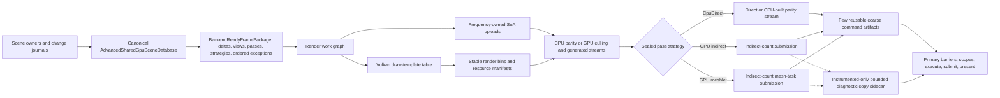

# Vulkan Resident Draw Stream And Render Task Pool TODO

Last Updated: 2026-08-20
Owner: Rendering / Frame Scheduling / Vulkan
Status: Paused after Phase 0 measurements — meshlet core accepted; remaining lifetime/RenderDoc prerequisite gates still block Phase 1
Priority: High; successor to the prepared-cohort bridge

Related current architecture and evidence:

- [Meshlet import cooking and production readiness prerequisite](../gpu/meshlet-import-cooking-and-production-readiness-todo.md)
- [Vulkan command-recording optimization ledger](vulkan-command-recording-architecture-optimization-todo.md)
- [CPU-direct rendering plan](cpu-direct-fast-path-todo.md)
- [Mesh-submission strategy contract](../../../../architecture/rendering/mesh-submission-strategies.md)
- [Vulkan compact zero-readback submission](../../../../architecture/rendering/vulkan-compact-zero-readback-submission.md)
- [Vulkan command recording](../../../../architecture/rendering/vulkan-command-recording.md)
- [Zero-readback GPU-driven rendering plan](../../../design/rendering/zero-readback-gpu-driven-rendering-plan.md)
- [GPU meshlet zero-readback rendering design](../../../design/rendering/gpu-meshlet-zero-readback-rendering-design.md)
- [Next-frame package handoff](../../../progress/rendering/next-frame-preparation-and-collect-visible-handoff-2026-07-29.md)
- [Sponza camera-motion investigation](../../../investigations/rendering/vulkan-camera-motion-black-flicker-2026-08-10.md)

## Implementation Hold

Implementation is intentionally paused after Phase 0 measurement and source
reconciliation. Complete the
[meshlet import cooking and production readiness TODO](../gpu/meshlet-import-cooking-and-production-readiness-todo.md)
before beginning Phase 1 below. The prerequisite moves LOD/meshlet generation
into first import, persists it through normal mesh/model caches, removes
cooking/hash/file work from rendering, introduces explicit mixed meshlet and
traditional GPU bins, and proves real Vulkan EXT indirect-count mesh-task
submission on supported hardware.

Phase 0 evidence work in this tracker may continue when matching hardware or
trace privileges become available, but no resident-stream implementation phase
should begin until the prerequisite's resume gate is satisfied.

2026-08-20 update: the prerequisite's core cold/warm standalone and Vulkan
production path now passes with nonzero delayed GPU-written task/dispatch
evidence and zero generic readback/mapping/fallback counters. Phase 1 remains
paused because broad reimport/streaming/unload lifetime validation, a real
RenderDoc event capture, and the prerequisite's performance/resume gates remain
open. Evidence: [meshlet import production closeout](../../../investigations/rendering/meshlet-import-production-closeout-2026-08-20.md).

## Decision

The final XRENGINE Vulkan fast path will not be another larger whole-frame or
whole-view cache. It will be a resident, data-oriented draw system with:

1. one canonical renderer-neutral resident database, evolved from
   `AdvancedSharedGpuSceneDatabase` and its generation-tagged
   `AdvancedGpuHandle` records rather than duplicated by a second registry;
2. generation-checked Vulkan template slots that own explicit native-resource
   leases;
3. frame/view/pass/material/object/instance data in independently versioned
   structure-of-arrays storage;
4. stable numeric bins whose membership changes only when render topology
   changes;
5. one sealed per-pass strategy contract for `CpuDirect`,
   `GpuIndirectZeroReadback`, `GpuIndirectInstrumented`,
   `GpuMeshletZeroReadback`, and `GpuMeshletInstrumented`;
6. indirect-count submission for compatible opaque and masked bins, with GPU
   culling as the normal high-draw-count path and diagnostics as an explicitly
   separate asynchronous sidecar;
7. a bounded engine-owned render work pool with a configurable number of
   persistent background worker threads; and
8. few coarse recording tasks and command buffers, using one Vulkan command
   arena per recording lane and frame slot.

The render thread remains the frame authority, records or reuses the primary
command buffer, owns queue submission, and participates in CPU work while it
would otherwise wait. Worker completion order never changes GPU execution
order.

The current `VulkanPreparedMeshOperationCohort` and
`VulkanPreparedMeshIngress` are a safe transition, not the endpoint. They still
drain and compare every raw request, revalidate reusable binding artifacts per
draw, materialize safety holes, and invalidate the complete ordered cohort when
one member changes. They must be deleted after the resident path has desktop,
explicit, OpenXR, shadow, UI, and failure-path parity.

The existing legacy `GPUScene`/`HybridRenderingManager` implementation and the
newer `AdvancedSharedGpuSceneDatabase` cannot remain independent production
scene databases in the final architecture. The advanced shared database is the
canonical target because it already owns pipeline-neutral generation handles,
draw/instance/transform/deformation/render-state/geometry records, material
records, dense-index lookup, remap publication, and bounded frame-boundary
growth. The legacy GPU-driven paths become adapters/consumers during migration
and are deleted or reduced to a compatibility facade after dual-publication
parity. Phase 0 must document any missing contract before extending the
advanced database; it must not answer a missing contract by adding a parallel
identity allocator.

## Why this work is required

### Measured evidence

The final dense Sponza Debug/MCP bridge run contained 625 mesh requests. A
stable hit reused 566 recipes and materialized 59 safety holes. Twelve dense
samples reported:

- 13.111 ms median frame-operation preparation, improved from the earlier
  19--25 ms dense-view range;
- 21.951 ms median whole-frame CPU time; and
- 3.767 ms median reported GPU command-buffer time.

The bridge proves that avoiding managed/backend operation reconstruction is
valuable, but a 566-entry hit still performs O(visible draws) matching and
artifact validation. The remaining CPU cost is not solved by recording the same
draw-centric work on more threads.

### Current cache boundary is too late

The reusable native command artifacts sit after several draw-proportional
stages. A stable frame can reuse the final command buffers while still paying
to:

- enumerate or drain raw mesh requests;
- rebuild or compare draw-oriented managed records;
- select and validate program/material binding artifacts;
- lower descriptor and attachment uses;
- assemble frame-operation payloads and resource-plan input; and
- refresh data through every reusable draw.

The final cache boundary must be before those operations. Stable topology is a
resident template; current transforms, views, material values, visibility, and
indirect counts are data updates, not reasons to reconstruct a draw.

### Existing GPU-driven paths are architectural inputs

The CPU-direct Sponza evidence above identifies a real bottleneck, but the final
design must not optimize that bridge by bypassing XRENGINE's existing
GPU-resident submission contracts. The current engine already distinguishes:

- `GpuIndirectZeroReadback`, the production indirect-count path;
- `GpuIndirectInstrumented`, its diagnostic/readback and explicitly enabled
  CPU-fallback counterpart;
- `GpuMeshletZeroReadback`, the production GPU-written mesh-task path; and
- `GpuMeshletInstrumented`, its diagnostic counterpart.

All four GPU strategies must consume the same canonical scene handles,
material tables, view/pass records, dirty uploads, and lifetime generations as
the CPU parity path. Instrumentation is an opt-in branch after the same
production data and commands are built; it is not a second scene database,
culling implementation, binning model, or command-cache hierarchy. A CPU
indirect implementation may prove the new resident contracts, but it may not
temporarily replace, disable, or silently become the fallback inside a selected
zero-readback pass.

### Current CPU thread budget is not centralized

The source currently exposes several independently owned execution domains:

- `Engine.Jobs` creates a configurable `JobManager` in
  `XRENGINE/Engine/Subclasses/Engine.State.cs`;
- `RuntimeEngine.Jobs` constructs another default `JobManager` in
  `XREngine.Runtime.Rendering/Runtime/RuntimeEngine.cs`;
- Vulkan command-chain recording lazily creates 0--8 persistent workers in
  `VulkanRenderer.CommandChainWorkers.cs`, with an automatic capacity of four;
- OpenXR creates two more persistent eye-recording threads; and
- cold pipeline compilation owns another persistent below-normal thread.

Not all of those threads are busy simultaneously, so source inspection alone
does not prove oversubscription is the active bottleneck. It does prove that no
single owner currently resolves or reports the total CPU execution budget. On
a heterogeneous 22-thread laptop, independent defaults can compete with the
render, collect-visible, update, fixed-update, window, audio, and driver
threads. The 32-thread desktop has substantially more scheduling headroom. The
new architecture must make this topology explicit and measurable.

### Native lifetime is not a managed-reference contract

The prepared cohort safely restricts retained `ProgramBindingSnapshot` values,
because the renderer has no general cache-owned lease for the complete native
dependency closure. A managed reference to a renderer, material, buffer, image,
program, descriptor, or target does not keep the corresponding Vulkan handle
legal after streaming, shader reload, resize, or device recovery.

Resident Vulkan templates may retain native handles only after every retained
handle is protected by a typed cache-owned generation reference and participates
in deferred retirement. Until then, an entry must retain stable resource IDs
and resolve handles at a safe backend boundary.

## Authoritative research conclusions

These sources establish constraints; XRENGINE performance still requires
measurement on its own hardware and scenes.

| Source | Constraint adopted by this plan |
| --- | --- |
| [Khronos Vulkan threading guide](https://docs.vulkan.org/guide/latest/threading.html) | Vulkan does not provide hidden application parallelism. A command pool is externally synchronized, so each recording host thread needs independent pool ownership. |
| [Khronos command-buffer usage sample](https://docs.vulkan.org/samples/latest/samples/performance/command_buffer_usage/README.html) | Use per-frame/per-thread pools, balance work, keep secondary count low, do not exceed useful CPU parallelism, and prefer pool recycling over allocate/free. Its approximately 1,800-draw example gained about 15% with eight threads/buffers; that result is evidence for measurement, not an XRENGINE constant. |
| [AMD RDNA performance guide](https://gpuopen.com/learn/rdna-performance-guide/) | Applications own command-recording parallelism, allocators are not thread-safe, submissions should be few, and tiny secondaries can cost more than they save. AMD gives ten draws/dispatches as a minimum rule of thumb, not a universal optimum. |
| [NVIDIA Vulkan dos and don'ts](https://developer.nvidia.com/blog/vulkan-dos-donts/) | Use a task graph for command, descriptor, resource, and pipeline preparation; record evenly on several cores; keep command buffers and submissions coarse; reuse only when measured; and perform begin/end work on the recording thread. |
| [Khronos profiling guide](https://docs.vulkan.org/guide/latest/profiling.html) | Command recording, descriptor updates, state changes, and small submissions are major CPU costs. Pipeline sorting, descriptor indexing/buffers, frame rings, and CPU/GPU timelines are required evidence tools. |
| [Khronos descriptor management sample](https://docs.vulkan.org/samples/latest/samples/performance/descriptor_management/README.html) | Reuse descriptor topology and prefer a small number of per-frame buffers with stable dynamic offsets over per-object descriptor allocation/update. |
| [Khronos descriptor-indexing sample](https://docs.vulkan.org/samples/latest/samples/extensions/descriptor_indexing/README.html) | Large indexed resource arrays can replace per-draw binding. Update-after-bind still requires precise access and in-flight lifetime rules. |
| [Khronos multi-draw-indirect sample](https://docs.vulkan.org/samples/latest/samples/performance/multi_draw_indirect/README.html) and [draw-indirect-count guide](https://docs.vulkan.org/guide/latest/extensions/VK_KHR_draw_indirect_count.html) | Compatible geometry and material data can be selected from buffers while one command consumes many GPU-generated draws; indirect count is core in Vulkan 1.2 when the feature is enabled. |
| [VK_EXT_device_generated_commands](https://docs.vulkan.org/spec/latest/chapters/device_generated_commands/generatedcommands.html) | DGC is useful when state must vary inside a device-generated stream, but the specification notes that ordinary indirect draws can be faster for a one-token action stream. MDI is therefore the baseline; DGC is a measured optional tier. |
| [VK_EXT_descriptor_heap proposal](https://docs.vulkan.org/features/latest/features/proposals/VK_EXT_descriptor_heap.html) | The ratified newer-hardware model is explicit sampler/resource heap memory and is intended to replace `VK_EXT_descriptor_buffer`. It is an optional capability tier, not the minimum XRENGINE path until driver coverage and measured results justify it. |
| [.NET managed thread-pool guidance](https://learn.microsoft.com/en-us/dotnet/standard/threading/the-managed-thread-pool) | The process-wide pool is shared by TPL, async I/O, timers, and other work; excess threads increase contention. Stable thread identity or dedicated priority/lifetime is a documented reason to own threads. Per-frame Vulkan recording must not be a pile of `Task.Run` calls. |
| [.NET `Environment.ProcessorCount` behavior](https://learn.microsoft.com/en-us/dotnet/core/compatibility/core-libraries/6.0/environment-processorcount-on-windows) | On current .NET for Windows, the value respects process affinity and job-object CPU limits. It is the correct available-logical-processor input, but it does not identify performance versus efficiency cores. |
| [Windows processor scheduling guidance](https://learn.microsoft.com/en-us/windows/win32/procthread/multiple-processors) and [QoS guidance](https://learn.microsoft.com/en-us/windows/win32/procthread/quality-of-service) | Hard affinity should normally be avoided because it restricts the scheduler. Foreground render workers must not accidentally run as EcoQoS; any HighQoS or CPU-set policy is opt-in and profile-gated, especially on hybrid CPUs. |

## Required asymptotic behavior

The following are acceptance requirements, not aspirations:

- A stable opaque/masked scene performs CPU preparation work proportional to
  active passes, bins, and dirty owners, not visible draw count. GPU culling
  remains proportional to the selected candidate/cluster workload unless a
  measured hierarchy reduces it.
- Camera-only motion publishes view data once and launches culling. It does not
  rebuild templates, material snapshots, descriptors, or per-draw resource
  manifests.
- Object motion updates only dirty object/instance slots.
- A material value change updates one material slot per in-flight frame slot.
  It does not rerecord commands when layout, descriptor index, and buffer
  location are stable.
- A texture replacement updates a stable resource-table slot and lifetime
  lease. It does not rebin or rerecord unless the binding topology changes.
- Shader link, vertex layout, fixed-function state, render-pass compatibility,
  or geometry relocation invalidates only affected template/bin artifacts.
- Stable descriptor topology performs zero descriptor allocation and zero
  redundant descriptor writes.
- Stable recorded topology performs zero command-buffer recording.
- All normal steady-state paths allocate zero managed memory after warmup.
- All five mesh-submission strategies consume the same resident logical
  identity and data generations; selecting diagnostics never duplicates or
  repopulates the scene database.
- `GpuIndirectZeroReadback` and `GpuMeshletZeroReadback` perform zero GPU-to-CPU
  readback bytes, host mappings, readback-driven waits, and CPU fallback during
  steady-state submission. Strict zero-readback performance captures do not
  enable timestamp/query retrieval that would violate that measurement.
- Instrumented modes copy only explicitly requested data into bounded
  frame-latent staging slots, never wait for the current frame, never steer
  production submission from returned values, and add zero dormant work when
  not selected.
- CPU-known capacity exhaustion or task failure can select a compatibility
  strategy before plan sealing or reject the frame, but can never omit a draw
  and still publish success. After a zero-readback GPU pass begins, it cannot
  inspect an overflow flag and retry on the CPU; capacity must be proven from
  resident source bounds, GPU writes must clamp for memory safety, and an
  unexpected overflow invalidates promotion evidence.
- Every exception path is named, counted, and excluded from fast-path
  acceptance.

## Target architecture



### 1. One engine execution topology

Introduce an engine composition-root owner named `EngineExecutionTopology`.
It resolves the process CPU budget once before `JobManager`, rendering, OpenXR,
or backend worker construction.

The topology owns these counts:

- effective logical processors (`Environment.ProcessorCount`, which already
  respects process affinity and CPU limits on current .NET);
- continuously active foreground engine threads;
- general/background worker lanes;
- render-critical worker lanes;
- background pipeline/import compiler lanes; and
- externally owned or diagnostic dedicated threads.

There must be one host-installed `EngineWorkScheduler`. `JobManager` becomes a
compatibility facade over its general domain during migration, then loses its
private worker array. `RuntimeEngine.Jobs` is removed; runtime rendering obtains
work services from the composition root through a new focused
`IRuntimeRenderWorkServices` capability.

The render-critical domain owns stable numbered logical lanes. Lane 0 is the
existing render thread; lanes `1..R` are persistent background OS threads with
lane-local storage and bounded queues. The Vulkan backend attaches one command
arena per logical lane and frame slot. General asset jobs may never borrow a
Vulkan arena. Migratable render preparation may run on any render lane; native
recording runs only on a lane that owns the selected arena.

OpenXR eye-primary work and desktop command-chain recording use this same
domain. Delete the separate two-thread `OpenXrEyeRecordWorkerScheduler` and the
separate command-chain worker array after parity. Pipeline compilation remains
a distinct below-normal background domain because it may block in the driver
and must not occupy a render-critical lane.

### 2. Allocation-free pooled render batches

`System.Threading.Tasks.Task`, `TaskCompletionSource`, captured delegates,
`ConcurrentQueue<Job>`, and per-item managed objects are forbidden in the
per-frame render work path.

Add a low-level pooled batch API with these conceptual types:

- `RenderWorkBatch`: frame-slot-owned arrays plus generation, lifecycle, fault,
  and remaining-work state;
- `RenderWorkItem`: a compact value containing operation kind, source
  start/count, prerequisite count, dependent range, preferred lane, and cost
  estimate;
- `RenderWorkerContext`: stable lane ID, thread ID, frame slot, scratch arenas,
  profiler buffer, and backend attachment index;
- `RenderWorkBatchLease`: prevents a frame slot from being reset while any
  worker can still read it; and
- `IRenderWorkExecutor`: one executor per sealed batch, dispatching a task kind
  to a typed range without per-task delegates.

Use preallocated per-lane deques for migratable preparation work and a bounded
lane queue for arena-affine recording work. Work stealing is legal only before
a task acquires a thread-owned native arena. Recording artifacts use a stable
preferred lane derived from the bin identity; a different lane may replace an
artifact only through copy-on-write retirement.

The render thread publishes a sealed generation, executes ready migratable
tasks itself, then waits only if work remains. Completion uses an epoch and
atomic remaining count. Wakeups occur on empty-to-nonempty transitions; idle
workers block rather than continuously spin. A two-second wait remains a fatal
lifecycle bound, not an ordinary frame budget.

A worker exception atomically faults the batch, stops new claims, invalidates
all partial outputs, and quarantines native artifacts touched by that batch.
Nothing from a partially completed batch can be submitted. If the last complete
frame is presentable, use it; otherwise report a visible rejected frame.

### 3. Canonical resident GPUScene and generation identity

Evolve `AdvancedSharedGpuSceneDatabase` into the one renderer-neutral resident
authority. Do not add a parallel `RenderDrawResidencyRegistry`. The existing
advanced owner already separates:

- `AdvancedGpuSceneDatabase` draw, instance, transform, deformation,
  render-state, editor-identity, and geometry record tables;
- `AdvancedMaterialDatabase` material, shading-kernel, layout, constant, and
  texture-binding records; and
- `AdvancedGpuSceneLookupTable` logical-handle-to-dense-index publication.

`AdvancedGpuHandle(Index, Generation)` is the canonical ABA-safe logical
identity for every table. A dense index is an upload/lookup location and may
change after compaction; it is never persisted as scene identity. If stronger
compile-time types are useful, add zero-storage wrappers or typed table access
over `AdvancedGpuHandle`; do not add another allocator, generation counter,
object-to-ID map, or remap table. A later rename may remove the `Advanced`
prefix once this becomes the only path, but naming cleanup must not create a
second migration-era identity domain.

The canonical scene draw record is structural and references stable handles
for geometry, material, instance, transforms/deformation, render state, and
editor identity. A Vulkan draw template combines that draw handle with the
sealed pass family, shader/pipeline variant, ordering class, and backend
geometry-fetch profile. It excludes:

- current or previous matrix contents while their transform handles remain
  stable;
- camera/view/projection values;
- frame number and frame-slot index;
- current visibility and GPU-produced counts;
- swapchain/OpenXR image handles;
- transient descriptor-set handles;
- material scalar values when their packed layout is unchanged; and
- resource content generations that update a stable table slot without
  changing its binding topology.

Extend the advanced record tables with bounded immutable delta journals for
additions, tombstones, structural changes, dense-index remaps, and data-only
dirty ranges. Removal remains two-stage: publish a tombstone, wait until every
render consumer and in-flight GPU reference acknowledges the generation, then
recycle the slot with a new generation. The render-command collection may
publish changes only through the collect-visible/swap boundary; render workers
consume a sealed generation and never mutate the database.

Capacity grows only at an unowned producer/consumer or retired frame-slot
boundary. If a journal or table fills mid-frame, the complete affected range
uses an already sealed compatibility strategy or the frame is visibly
rejected, then bounded growth is requested for the next legal boundary.
Partial publication is forbidden. A zero-readback GPU pass cannot discover a
host-side growth requirement from a GPU overflow result during submission.

During migration, the current `GPUScene` and `HybridRenderingManager` consume
or are dual-fed from the advanced database. Dual publication compares logical
handles, dense remaps, geometry/material records, visibility inputs, and output
draw identities. Once parity is proven, remove duplicate legacy arrays and ID
maps instead of indefinitely synchronizing two resident databases.

`BackendReadyFramePackage` stops treating an array of live managed
`BackendReadyMeshSelection` references as its final draw contract. It
publishes:

- canonical scene generation plus ordered delta/remap ranges;
- frame, view, and pass records;
- a resolved `EMeshSubmissionStrategy` and capability/downgrade reason for each
  pass/output;
- dirty material/transform/instance/geometry ranges;
- optional immutable diagnostic-readback requests for instrumented passes;
- ordered exception draws and explicit transparent/UI ranges; and
- pass/render-graph metadata.

The canonical opaque resident path does not republish all visible draws every
frame. Static candidates remain resident and are culled from current view data.
The CPU-visible compatibility path writes compact `AdvancedGpuHandle` values
and pass-local range records, not `IRenderCommandMesh`, `XRMeshRenderer`,
`XRMaterial`, or `MeshDrawOp` objects.

### 4. Frequency-owned SoA data

Keep the existing frame/view/pass/material/object/instance frequency contract,
but make its final storage independent of draw visitation. Reuse and complete
the advanced scene/material record tables and existing `GPUScene` SoA layouts
where their ownership and binary contract already match; do not introduce a
third set of scene streams merely to feed the Vulkan templates.

Required SoA streams include at least:

- frame constants and global resource-table generation;
- view matrices, previous matrices, frusta, viewport, jitter, and view mask;
- pass constants and render-scope compatibility;
- material scalar block, texture/sampler indices, and material generation;
- object current/previous transforms, bounds, flags, and material/object IDs;
- instance range and optional skinning/deformation data; and
- per-bin indirect command and count buffers.

The same uploaded scene records feed CPU parity, GPU indirect, and GPU meshlet
strategies. Strategy selection may choose a different output stream or shader
variant, but it never triggers an O(scene) repack into a strategy-specific
database.

Each owner publishes dirty slot/range journals. Jobs receive disjoint ranges,
so they can write persistent mapped memory or staging memory without locks.
Static range coalescing must not scan all resident or visible objects.

The frame slot owns the mutable GPU destination. A published payload handle
contains storage ID, offset/index, length, content generation, frame-slot
generation, and frequency domain. A data update changes content generation;
only relocation or layout change changes recording generation.

### 5. Vulkan draw-template table and native leases

Add a render-thread-owned `VulkanDrawTemplateTable`. A
`VulkanDrawTemplateHandle(Slot, Generation)` is a backend projection of one
canonical `AdvancedGpuHandle` draw plus a sealed pass/pipeline variant; it is
not another scene identity and never owns a second object-to-ID map. Resolve
and store this projection when a draw/pass topology delta occurs. Normal frame
packages and bin memberships carry the already resolved backend handle, so
stable frames use direct slot access rather than rebuilding the composite key.
Each entry validates both the Vulkan-template generation and canonical draw
generation, then contains compact IDs or handles for:

- linked program and pipeline variant;
- pipeline layout/binding schema generation;
- geometry buffers, offsets, index type, and primitive parameters;
- material/resource-table slot;
- immutable resource-manifest template;
- bin key components;
- indirect command prototype; and
- reusable recorded-artifact references, when legal.

Hashing is used only to resolve a new structural template. A hash match always
performs full structural equality. Normal frame lookup is direct slot access,
not a dictionary lookup or per-draw fingerprint rebuild.

The render thread is the table's only writer. Before dispatch it freezes the
selected template/bin entry indices and generations into frame-slot-owned
prepared ranges. Workers consume those ranges under the batch lease; they do
not query or mutate the live template table.

Program/schema, pipeline, geometry, and material-topology owners maintain
bounded reverse membership lists of template slots. A topology-generation
change appends affected slots to a deduplicated invalidation journal; normal
invalidation never scans the entire template table. Device-generation reset is
the intentional O(1) whole-table invalidation exception.

Before an entry can retain native handles, implement a typed
`VulkanDrawTemplateDependencySet`. It owns a flat pooled slice of cache-owned
generation references. Extend the existing native generation-pin vocabulary
with an explicit template/cache reference, or add an equivalent typed lease;
do not reinterpret descriptor, queued, or recorded references as cache
ownership.

Dependency acquisition is transactional:

1. resolve the exact program/pipeline/geometry/material-table owners;
2. acquire every typed generation reference into scratch storage;
3. validate that none of the owner generations changed during acquisition;
4. publish the entry and lease slice atomically; or
5. release the acquired prefix and leave the template on the explicit
   compatibility path.

The material/resource table, not every draw template, owns texture and sampler
residency. A draw template owns only its program/pipeline/geometry topology and
the stable material-table index. Frame targets and swapchain/OpenXR images are
always frame/render-scope leases and are never retained in a template.

On invalidation or bounded eviction, detach the entry immediately, retire its
recorded artifacts, and release cache references only after queued/recorded
references and the relevant GPU timeline/fence are complete. Device loss
invalidates the table generation in O(1), then retires storage through the
device-recovery authority.

### 6. Stable bins and bin-level resource manifests

Build a numeric `VulkanRenderBinKey` from state that must be common for one
indirect or recorded range:

- pass and render-scope compatibility key;
- pipeline/program variant;
- geometry page/buffer binding group and index type;
- topology and fixed-function state;
- descriptor binding model;
- stereo/multiview view mask; and
- ordering class.

Material is data, not a bin key, when bindless/indexed resources are active. It
remains a compatibility key on the legacy descriptor-set path. Actual target
image handles are excluded; attachment format/sample/view-mask compatibility is
included.

Bin membership changes on template residency or topology changes, not on camera
motion. Maintain membership with slot-indexed intrusive arrays or bounded flat
lists. Do not sort a managed object list every frame.

Replace per-draw `FrameOpResourceUseList` lowering on the resident path with:

- an immutable `VulkanTemplateResourceManifest` for stable geometry/program
  semantics;
- a `VulkanBinResourceManifest` recomputed only when bin membership/topology
  changes; and
- current frame/view/pass/attachment uses appended after final swapchain/OpenXR
  context coalescing.

The planner consumes bin and exception manifests. It never replays retained
frame-local descriptor or attachment uses. Pass normalization and target-
dependent lowering remain after context coalescing, preserving the correctness
fix made by the prepared-ingress bridge.

### 7. One resident substrate, five terminal strategy lanes

`EMeshSubmissionStrategy` remains the authoritative per-pass contract. Resolve
capabilities and explicit downgrade policy before `FramePlan` sealing, snapshot
the resolved strategy and reason into the pass record, and never rerun the
resolver from a worker or native recording callback.

| Strategy | Resident input and terminal submission | Host feedback/fallback contract |
| --- | --- | --- |
| `CpuDirect` | Canonical draw handles feed ordered direct draws or the CPU-built indirect parity stream. | Does not depend on GPU-produced counts. It is selected explicitly or by the resolver before sealing, never as an in-pass zero-readback retry. |
| `GpuIndirectZeroReadback` | Canonical GPUScene records feed GPU culling/scatter and fixed compact `vkCmdDrawIndexedIndirectCount` ranges. | No count/list/overflow mapping, diagnostic query retrieval, CPU safety-net draw, or readback-driven submission decision. |
| `GpuIndirectInstrumented` | Uses the same GPU indirect inputs and production command layout, with an explicit diagnostic copy/query sidecar. | Bounded readbacks are allowed and counted. CPU safety-net fallback is legal only when its existing diagnostic setting explicitly requests it. Returned values never steer the zero-readback implementation. |
| `GpuMeshletZeroReadback` | Uses the same scene/material records, then GPU-written mesh-task records/counts and `vkCmdDrawMeshTasksIndirectCountEXT`. | No readback or implicit fallback. Unsupported capability is resolved visibly to another strategy before plan sealing. |
| `GpuMeshletInstrumented` | Uses the same meshlet stream plus explicitly requested diagnostic outputs. | Bounded readbacks/timestamps are allowed and counted; meshlet failure does not fall through inside the pass to traditional indirect or CPU draws. |

The final instrumented paths do not map GPU-produced active ranges/counts to
decide what to submit in that same frame. They render through the same fixed
production submission topology and inspect results later. An explicitly
enabled `GpuIndirectInstrumented` CPU safety-net/parity draw is planned before
sealing and labeled as extra diagnostic work; it is not triggered by waiting on
the current frame's GPU result. Retire same-frame readback-assisted material
submission from the final frame loop. If a blocking legacy bring-up tool must
temporarily remain, name it as a serial manual diagnostic, exclude it from all
performance/zero-readback evidence, and never schedule its wait on a render
worker.

The zero-readback and instrumented member of a strategy pair use identical
production scene records, stable material/resource indices, visibility inputs,
draw/task record layouts, and non-diagnostic shaders whenever possible. If a
diagnostic requires shader instrumentation, the pipeline key contains an
explicit instrumentation schema generation and is compared against the
non-instrumented output for parity. It does not mutate the canonical scene
record or invalidate unrelated production templates.

#### Instrumented readback is a bounded asynchronous sidecar

Represent instrumentation as an immutable `GpuDiagnosticReadbackPlan` attached
only to an instrumented pass. Each `GpuDiagnosticReadbackRequest` identifies:

- source resource/range and producer stage/access;
- copy size, alignment, decoder kind, and expected schema generation;
- frame, frame slot, output, view, pass, strategy, and source-resource
  generations; and
- whether the result is a counter, command dump, overflow record, timestamp, or
  validation signature.

The render graph inserts a transfer/query-resolve branch after the last
producer and before source retirement. Vulkan copies into a fixed-capacity
host-visible staging ring owned by the resource/telemetry authority. The frame
completion owner polls the associated fence/timeline without waiting; only
after completion may a general/telemetry worker decode and publish the copied
bytes. No render-critical worker blocks on a GPU fence, maps a pending slot, or
spins for diagnostic completion.

The diagnostic node participates in the normal resource planner and names the
exact source generation, queue family, transfer ownership, and destination
slice. A committed ring slot owns its staging slice, command/submission receipt,
completion primitive, schema, and decoder lease until exactly one terminal
settlement: decoded, dropped as stale, rejected before submit, abandoned on
device loss, or cancelled during shutdown. The decoder lease prevents slot
reuse while a general worker reads it; settlement releases every native/frame
reference without depending on a callback into a disposed output.

If the ring or request table is full, the engine drops and counts the diagnostic
request. It never stalls, grows storage mid-frame, changes strategy, or drops
render work. Late results are discarded on generation mismatch. Results are
observations only: they cannot change the resident database, bin membership,
capacity, culling mode, resolver output, command-cache validity, or current or
future production submission. The zero-readback plan contains no diagnostic
copy/query nodes, ring reservation, polling obligation, or decoder task.

Strict zero-readback evidence requires
`RuntimeEngine.Rendering.Stats.GpuReadback.GpuReadbackBytes == 0`, zero
readback mappings, and zero readback-caused waits. A run that enables counter
tracing or retrieves GPU timestamp/query data is instrumented evidence even if
submission itself never consumes the result. Externally captured GPU timings
must be labeled separately from strict in-engine zero-readback evidence.

### 8. Indirect submission is the baseline high-draw-count consumer

CPU-built indirect data is a migration/parity scaffold for the canonical
resident contracts; it is not a prerequisite that disables or replaces the
existing production GPU-driven paths. Keep the current
`GpuIndirectZeroReadback` and `GpuMeshletZeroReadback` routes operational while
their `GPUScene`/`HybridRenderingManager` inputs are dual-published and moved to
the canonical advanced database.

For compatible geometry pages, the CPU parity path may write
`VkDrawIndexedIndirectCommand` records and issue one
`vkCmdDrawIndexedIndirect` or `vkCmdDrawIndexedIndirectCount` per bin/range.
Shaders obtain object, material, and resource indices from `firstInstance`, a
parallel draw-data buffer, push data, or the selected geometry-fetch profile.
This path validates templates, bins, manifests, and reusable command artifacts
without becoming an internal fallback for a sealed zero-readback pass.

The production GPU indirect path reuses and consolidates the existing GPUScene
culling, LOD, material-scatter, compact atlas-tier, and indirect-count stages:

1. read canonical resident bounds, object flags, LOD data, and current
   view/cascade data;
2. classify visible objects into stable state/material/atlas output ranges;
3. compact indirect commands and counts entirely on the GPU;
4. synchronize compute writes with indirect-command and shader reads; and
5. execute the compact indirect-count ranges from stable command artifacts.

The baseline Vulkan compact contract submits at most the fixed static, dynamic,
and streaming atlas-tier ranges for each supported pass. Source capacity is
known before dispatch and output capacity covers the declared worst-case
expansion. GPU reservations clamp for memory safety, but an overflow is a
contract violation for valid production input: instrumented mode reports it,
while zero-readback mode never maps the flag to choose a same-frame retry.

The production meshlet path consumes the same canonical scene/material table,
visibility generations, and pass strategy, then generates mesh-task records and
counts on the GPU. It does not create a parallel meshlet scene database. Camera
motion updates view data and reruns the selected GPU culling path; it does not
reconstruct 625 CPU draws. Shadow cascades use the same resident handles with
per-cascade view data and independent GPU counts.

Geometry that cannot share a conventional vertex/index binding is grouped by
geometry page first. Buffer-device-address fetching may reduce those groups
only under the existing capability/profile contract. Descriptor heaps and
device-generated commands are later measured tiers, not prerequisites for the
resident/MDI architecture. Mesh shaders remain an existing explicit strategy
tier rather than being hidden inside the optional DGC work.

`VK_EXT_device_generated_commands` is considered only when measured state
changes inside a generated stream make MDI bins too fragmented. A one-action
draw stream stays on ordinary indirect commands unless DGC wins on every target
vendor and does not regress validation or tooling.

### 9. Few coarse command-recording tasks

The task graph is phase-oriented:

1. validate the canonical scene generation and sealed per-pass strategies;
2. apply resident deltas/remaps and publish dirty frequency-owned data;
3. resolve new/invalid Vulkan templates and commit leases on the render owner;
4. rebuild only dirty bins/manifests;
5. build CPU parity streams or encode the selected GPU culling/scatter/meshlet
   stages without constructing unused alternatives;
6. append bounded diagnostic copy/query work only for instrumented passes;
7. record only dirty coarse command artifacts;
8. merge artifact references in canonical order; and
9. record/reuse the primary, submit, and present.

Do not create one task or one secondary per draw or bin. Initial task formation
uses these explicit rules, then hardware measurements may tune the constants:

- preparation work creates at most `4 * (renderWorkerThreads + 1)` migratable
  range tasks per phase;
- recording creates at most `2 * (renderWorkerThreads + 1)` secondaries per
  compatible render scope;
- a recording task contains at least ten draw/dispatch equivalents and should
  target at least 32 on desktop unless a measured cost model predicts otherwise;
- adjacent bins may share a secondary only when render scope, inheritance,
  query state, ordering, and queue family are compatible;
- an exponentially weighted per-kind/per-bin cost estimate balances ranges;
- dispatch requires at least two independent tasks and predicted saved work
  greater than the measured queue/wake/merge cost plus hysteresis; and
- a forced worker count is a benchmark override, not permission to dispatch
  tiny production batches.

With MDI and stable artifacts, zero worker dispatches on a stable frame are
expected and desirable. The pool exists to overlap dirty uploads, template/bin
rebuilds, explicitly selected CPU parity/fallback preparation, and unavoidable
command recording. A stable GPU-driven frame creates no per-draw CPU tasks.
Diagnostic fence polling belongs to the frame-completion owner and completed
readback decoding belongs to the general/telemetry domain; neither may occupy a
render lane while waiting for the GPU.

### 10. Command-pool and artifact ownership

Each logical render lane, including the render-thread lane, owns for each
indexed frame slot and Vulkan queue family:

- a transient command pool reset wholesale after that frame slot retires;
- a retained-artifact arena whose command buffers are not invalidated by a
  transient pool reset;
- descriptor/upload scratch whose ranges are disjoint from other lanes; and
- a cache-line-separated timing/fault block.

Transient always-recorded work uses the pool-reset strategy recommended by
Khronos. Reusable secondaries cannot share a pool that is reset every frame;
they use retained artifact arenas and copy-on-write retirement. Compare
individual reset, arena-generation replacement, and periodic whole-arena
retirement under the existing reset/allocation counters before selecting the
retained strategy.

Keep one recorded artifact per required in-flight frame slot unless the same
native command buffer is proven not pending. Do not enable
`SIMULTANEOUS_USE_BIT` merely to avoid correct slot ownership. Primary execution
lists secondaries in canonical bin/range order, independent of task completion
order.

### 11. Explicit compatibility lanes

The resident architecture must classify, not hide, unsupported work:

- transparent/order-preserving draws use a compact ordered stream; initially
  CPU sorted, later optionally GPU sorted;
- screen-space UI uses one final ordered overlay lane and must have identical
  cold/hit classification;
- `HasRenderDataPreparation` and other mutable callbacks stay legacy until
  replaced by a typed producer that publishes data and generations before
  sealing;
- external targets, prewarm outputs, query brackets, scoped bindings, and
  callbacks retain explicit serial/primary ownership until their lifetime and
  ordering contracts are represented;
- OpenXR eye images are frame leases; templates remain eye-image independent;
- explicit/OpenXR production must consume the same template/data/bin contracts
  before the prepared-cohort bridge can be removed;
- unsupported GPU-indirect or meshlet capability is resolved once, visibly,
  before plan sealing; a recording failure never invents an in-pass CPU or
  traditional-indirect fallback;
- `GpuIndirectInstrumented` retains its explicitly enabled CPU safety-net lane,
  while neither meshlet mode gains an implicit fallback; and
- a legacy draw may coexist with resident bins in the same frame, but its
  resource uses and order are inserted through one deterministic exception
  range.

The canonical dense Sponza opaque/masked cohort must reach zero legacy holes.
UI, editor gizmos, text, and deliberately callback-driven diagnostics are
reported separately and do not contaminate the opaque fast-path count.

## Configuration contract

Add a renderer-neutral `RenderExecutionSettings` subtree and expose it through
engine, project, and user effective settings. Environment variables are
launch-only diagnostic overrides, not the primary configuration surface.

| Setting | Values | Required behavior |
| --- | --- | --- |
| `RenderWorkerThreadCount` | `-1` auto, `0` inline, `1..32` fixed background workers | Count excludes the render thread. Fixed count is applied at scheduler startup; changing it requires scheduler/renderer restart. |
| `RenderWorkerThreadCap` | `1..32`, default `8` | Upper bound used by auto selection. Auto-mode storage uses the cap; fixed-mode storage uses the explicit count. The hard safety maximum remains 32. |
| `GeneralWorkerThreadCount` | existing auto/fixed setting | Resolved by the same topology owner rather than a separate `JobManager` default. |
| `ReservedForegroundThreadCount` | auto by active engine mode, optional positive override | Covers render, collect-visible, update, fixed-update, and other continuously active engine-owned foreground loops. Report the resolved list, not only a number. |
| `AllowCpuOversubscription` | default `false` | If explicit general + render + reserved foreground + dedicated background counts exceed effective processors, startup fails with the requested/effective topology. Diagnostic opt-in may allow it. |
| `RenderWorkerQos` | `OsDefault` default, `High` diagnostic, no production `Eco` | Do not set hard affinity. HighQoS requires Windows-only measured acceptance and is cleared on teardown. |

The existing `ForceMeshSubmissionStrategy`,
`XRE_FORCE_MESH_SUBMISSION_STRATEGY`, Vulkan GPU-driven profile, zero-readback
material draw-path setting, and meshlet capability resolver remain the only
strategy-selection authorities. Do not add a task-pool-specific strategy
toggle. The resolved strategy is immutable for one sealed pass even if a
diagnostic request or worker fails.

Diagnostic GPU copies are recorded through render lanes because they touch
Vulkan command arenas, but fence polling is part of bounded frame completion
and completed-byte decoding uses the general/telemetry domain. Decoder work is
included in the central topology and queue capacities; it does not create a
dedicated thread or consume `RenderWorkerThreadCount` while waiting. The
existing 32-slot GPU-stats readback storage is generalized rather than joined
by another ring; any future capacity setting is startup-only, bounded, reported,
and preallocated before an instrumented frame.

Initial deterministic auto policy:

```text
P = Environment.ProcessorCount
F = min(P, resolved continuously-active foreground engine threads)
D = resolved dedicated background lanes that may overlap a frame
B = max(0, P - F - D)
R = P < 8 ? 0 : min(RenderWorkerThreadCap, B / 3)
G = min(GeneralWorkerThreadCap, max(0, B - R))
```

`R` is the number of background render lanes; maximum render concurrency is
`R + 1` when the render thread participates. The formula is a safe starting
policy, not a permanent hardware truth. If auto produces `G == 0`, general work
uses an explicit cooperative/inline path; it must not instantiate a hidden
worker. `D` includes any retained pipeline compiler or similar lane until that
work is migrated into a budgeted scheduler domain. The acceptance sweep below
may change the formula, but the final formula and evidence must be committed
together.

Replace `XRE_VULKAN_COMMAND_CHAIN_WORKER_COUNT` at cutover with
`XRE_RENDER_WORKER_THREADS=-1|0|1..32`. Keep a temporary diagnostic alias only
while both implementations coexist, warn once when it is used, and delete it
with the old worker domain. Retain explicit force-inline, trace, and
force-rerecord controls only as documented diagnostic switches.

Invalid values are never silently ignored. Startup reports:

- requested and effective worker counts;
- source of every value (user/project/engine/environment/auto);
- effective processor count and foreground reservations;
- scheduler lane/thread IDs and QoS;
- task/queue capacities; and
- whether a restart is required for a pending setting change.

## Invalidation matrix

| Change | Data upload | Template rebuild | Rebin/manifest | Secondary rerecord | Notes |
| --- | --- | --- | --- | --- | --- |
| Camera/view motion | View only | No | No | No | Rerun culling; stable indirect buffers/offsets. |
| Object transform/bounds | Dirty object slots | No | No | No | Previous transform advances independently. |
| Instance count within reserved range | Instance/count range | No | No | No | Indirect count/data changes only. |
| Material scalar value | Dirty material slot | No | No | No | Layout and table index remain stable. |
| Texture/sampler replacement in stable slot | Resource-table slot | No | No | No | Acquire new table lease before releasing old. |
| Material binding layout or shader interface | Affected data | Yes | Yes | Yes | Invalidate affected program/pipeline variants only. |
| Fixed-function/render-option change | Maybe | Yes | Yes | Yes | New bin key. |
| Mesh vertex/index content in stable allocation | Geometry range | No | No | No | Synchronize upload with reads. |
| Geometry layout, index type, or buffer relocation | Geometry range | Yes | Yes | Yes | Old native lease retires after GPU completion. |
| Visibility/LOD result | Indirect data/count | No | No | No | CPU or GPU culling result. |
| Advanced-table compaction/dense remap | Lookup/remap ranges | No if logical handles/topology are unchanged | No | No | Dense index is location, not identity. |
| Resolved submission-strategy change | Strategy/pass data | Resolve affected Vulkan variant | Affected output topology only | Affected strategy artifacts only | Canonical scene handles and data remain resident. |
| Diagnostic request set change | Diagnostic staging/query ranges only | Only if shader instrumentation schema changes | No production rebin | Diagnostic branch/variant only | Zero-readback artifacts remain reusable. |
| Diagnostic ring full or late result | None | No | No | No | Drop/count observation; never alter rendering. |
| Unexpected GPU output overflow | None during pass | No same-frame rebuild | No same-frame rebin | No same-frame retry | GPU clamps for memory safety; instrumented mode reports a capacity-contract failure. |
| Swapchain resize/format/sample change | Frame/pass data | No base template | Affected scope only | Affected scope only | Actual target remains a frame lease. |
| OpenXR acquired image change | View/frame data | No | No if compatible | No | Image identity is not in template. |
| Pass compatibility/view-mask change | Pass data | Pass variant | Yes | Yes | Preserve dynamic-rendering inheritance rules. |
| Scene removal | Tombstone | Detach entry | Remove membership | Retire artifact | Recycle ID only after consumer/GPU acknowledgement. |
| Device loss | Republish all | O(1) table-generation invalidation, then rebuild | Rebuild | Rebuild | No stale handle survives recovery. |

## Telemetry required before promotion

Expose all counters in runtime stats, profile-capture NDJSON, and the MCP
profiler. Time counters that scale with work must have corresponding item and
byte counts.

Execution topology and pool:

- requested/effective general and render worker counts;
- active render lanes, peak concurrency, thread IDs, and QoS;
- tasks built, queued, stolen, executed inline, executed by lane, and cancelled;
- per-kind queue delay, execution time, active span, overlap, wait, and merge;
- scheduler wakeups, empty wakeups, queue-full fallbacks, faults, timeouts, and
  quarantines;
- task-array and queue high-water marks; and
- managed allocated bytes per build/dispatch/execute/merge stage.

Residency/templates/data:

- canonical advanced draw/instance/transform/deformation/render-state/
  geometry/material counts and capacities, plus any remaining legacy duplicate
  bytes;
- add/remove/topology/data delta counts;
- template direct hits, creates, rebuilds, generation mismatches, hash
  collisions, lease failures, evictions, and retirements;
- dirty slots/ranges and bytes by frequency owner;
- stable frames that visit zero draw templates for refresh; and
- compatibility draws by exact reason.

Strategy and diagnostic readback:

- requested/resolved `EMeshSubmissionStrategy`, capability rung, downgrade
  reason, output, view, and pass identity;
- frames/passes and draw/task dispatches by all five strategies;
- zero-readback GPU bytes, map attempts, query-result retrievals,
  readback-caused waits, and CPU fallback attempts, all of which must remain
  zero for strict zero-readback evidence;
- instrumented requests, accepted copies, bytes, ring occupancy/high-water,
  completion latency in frames/time, decoded results, generation-mismatch
  discards, ring-full drops, and decoder faults;
- instrumentation pipeline/schema variants and diagnostic-only command
  records/submissions; and
- strategy transitions plus exact production artifact invalidations and dormant
  diagnostic overhead.

Bins/indirect/recording:

- bin counts, dirty bins, membership edits, manifest rebuilds, and resources per
  manifest;
- CPU culling candidate/visible/rejected/compacted counts; GPU-produced counts
  only when an instrumented readback or external capture makes them available,
  tagged with source frame and latency rather than reported as current-frame
  zeroes;
- indirect commands/count buffers/bytes and MDI calls;
- DGC/descriptor-heap capability and selected-path reasons;
- primary/secondary records, reuses, resets, allocations, pool resets, and
  executed secondary count; and
- Vulkan API calls for pipeline binds, descriptor binds/updates, vertex/index
  binds, draw/direct, draw/indirect, queue submit, and waits.

## Code update map

Names below define responsibility. They may be split into focused partial files
but must not collapse back into one monolithic frame-loop class.

### Runtime core and composition root

- Add `EngineExecutionTopology`, `EngineWorkScheduler`, worker-domain/lane
  types, and pooled batch storage under `XREngine.Runtime.Core/Execution/`.
- Refactor `XREngine.Runtime.Core/JobManager.cs` into focused partials and make
  it a compatibility facade over the general worker domain.
- Update `XRENGINE/Engine/Subclasses/Engine.State.cs` to resolve topology before
  scheduler construction.
- Add `IRuntimeRenderWorkServices` beside the focused runtime-rendering host
  interfaces and install it in
  `XREngine.Runtime.Bootstrap/RenderingHost/Engine.RuntimeRenderingHostServices.cs`.
- Replace the independently constructed `RuntimeEngine.Jobs` immediately with a
  compatibility facade over the host general domain, migrate every rendering
  caller to the focused host work service, then delete the property at cutover.

### Settings and diagnostics

- Add `RenderExecutionSettings` to
  `XREngine.Runtime.Rendering/Runtime/Settings/RuntimeEngine.Rendering.EngineSettings.cs`.
- Thread it through `IRuntimeRenderSettingsServices`,
  `RuntimeRenderingHostServiceDefaults`, `RuntimeEffectiveSettings`, engine
  effective settings, game/user overrides, and the ImGui effective-settings
  panel.
- Add environment constants in
  `XREngine.Data/Environment/XREngineEnvironmentVariables.cs`.
- Preserve `EMeshSubmissionStrategy`, its resolver, profile/capability gates,
  and zero-readback material-path settings as the strategy authority; add only
  the telemetry and bounded diagnostic-capacity settings required by this
  architecture.
- Regenerate Unit Testing World settings/schema in the same implementation
  change that adds the settings, before live validation.
- Extend Vulkan/runtime stats, profile capture, profiler packet, and MCP
  profiler groups with the counters above.

### Renderer-neutral frame data

- Evolve
  `Rendering/Commands/GPUScene/Advanced/AdvancedSharedGpuSceneDatabase.cs`,
  `AdvancedGpuSceneDatabase`, `AdvancedGpuRecordTable<T>`, material tables,
  lookup table, and `AdvancedGpuHandle` into the canonical resident authority.
  Add missing bounded delta/tombstone/dirty-range publication there; do not add
  `RenderDrawResidencyRegistry` or parallel geometry/material/object/draw ID
  allocators.
- Add compact pass-local Vulkan-template projection handles, ordered-exception
  records, SoA range descriptors, `GpuDiagnosticReadbackPlan`, and
  `GpuDiagnosticReadbackRequest` without giving them independent scene
  identity ownership.
- Evolve `BackendReadyFramePackage` and `RenderCommandCollection` to publish
  canonical advanced-database deltas/remaps, numeric frame records, resolved
  per-pass strategies, and diagnostic requests.
- Convert the current `GPUScene`, `GPURenderPassCollection`, and
  `HybridRenderingManager` to consume or dual-publish the canonical records;
  delete duplicate command/material/mesh ID maps and SoA storage after parity.
- Keep a dual-publication equivalence mode until membership, order, pass,
  logical/dense handle mapping, material/mesh selection, visibility input,
  shadow caster, GPU indirect/meshlet output identity, and visual signatures
  match.

### Vulkan backend

- Add `VulkanDrawTemplateTable`, `VulkanDrawTemplateEntry`,
  `VulkanDrawTemplateDependencySet`, `VulkanRenderBinTable`,
  `VulkanTemplateResourceManifest`, and `VulkanBinResourceManifest` in focused
  `Frame/Templates/` and `Frame/Bins/` folders.
- Add CPU indirect-stream construction as a parity scaffold without disabling
  either existing zero-readback GPU strategy. Port the current compact
  GPU-indirect and meshlet producers to canonical advanced handles and stable
  bins instead of implementing a second GPU culling/scatter pipeline.
- Generalize `GpuRenderStatsReadbackSlot`,
  `VulkanFrameLoop.GpuStatsReadback`, and their existing 32-slot bounded
  storage into the generation-tagged diagnostic plan/ring. Integrate copies
  into the render graph/submission lifetime, remove render-thread decoding and
  closure-based re-enqueue, and dispatch completed decoders through the
  general/telemetry work domain.
- Keep `VulkanProducerCompleteIndirectStream`, compact atlas-tier indirect-count
  submission, compute-to-indirect barriers, and mesh-task indirect-count
  submission as explicit strategy consumers of the same resident data.
- Extend `VulkanResourceGenerationPins` or its successor with explicit
  cache-owned template lifetime; do not retain native handles before this step.
- Make `FramePlanBuilder` and `VulkanFrameOperationScheduler` consume bin-level
  manifests plus ordered exception operations.
- Replace command-chain worker dispatch and OpenXR eye-worker dispatch with the
  host render work domain while preserving `VulkanWorkerSecondaryCommandArena`,
  `VulkanRecordedCommandArtifact`, deterministic merge, and quarantine
  semantics.
- Keep `FrameOperationStream` for nonresident/exception operations and primary
  structural nodes; do not expand it into another per-resident-draw stream.
- Delete `VulkanPreparedMeshOperationCohort*` and
  `VulkanPreparedMeshIngress*` only at the final cutover gate.

## Phased implementation checklist

### Phase 0 - Freeze evidence and contracts

Checkpoint (2026-08-17): original-laptop measurement, third-laptop checkpoint,
and source-audit results are in
[the Phase 0 investigation](../../../investigations/rendering/vulkan-resident-draw-stream-phase0-2026-08-17.md).
The third-laptop run is recorded separately because its commit, workload
identity, power policy, and observed workload shape do not match the accepted
original-laptop baseline. Phase 0 remains open for a same-commit/same-workload
machine matrix including the desktop, elevated scheduler trace,
three-view/RenderDoc evidence, unavailable meshlet paths, and removal of the
instrumented path's synchronous one-shot fence wait.

- [ ] Capture matched Release dense-Sponza baselines on the laptop and
  7950X3D/RTX 3090 desktop: same commit, camera transform, window/internal
  resolution, render settings, present mode, validation state, warmup, and
  sample duration.
- [ ] Capture the same scene under `CpuDirect`, `GpuIndirectZeroReadback`,
  `GpuIndirectInstrumented`, `GpuMeshletZeroReadback`, and
  `GpuMeshletInstrumented` wherever capabilities permit. Record requested and
  resolved strategies rather than treating a visible downgrade as the named
  path.
- [ ] Capture CPU sampled traces including every engine-owned thread, .NET
  ThreadPool counters, context switches, core migration, QoS, and per-thread CPU
  time.
- [x] Report every current worker pool/thread and whether it overlaps the
  render critical path.
- [ ] Freeze draw/pass/material/shadow/UI equivalence signatures and current
  screenshots from at least three camera positions.
- [x] Add counters that distinguish raw-request drain, cohort match, hole
  materialization, binding validation, resource-use lowering, planning,
  indirect construction, native encoding, and waits.
- [ ] Inventory every field/allocator/map/SoA stream in legacy `GPUScene` and
  `HybridRenderingManager` against `AdvancedSharedGpuSceneDatabase`; designate
  the advanced table that replaces it or document the exact missing record to
  add. No duplicate registry work begins before this map is reviewed.
- [x] Trace every GPU buffer map/read helper, fence/query retrieval, CPU
  fallback, delayed stats readback, and diagnostic command submission reachable
  from each strategy. Freeze zero-readback and instrumented source-contract
  signatures.

Exit gate:

- [ ] The desktop/laptop difference is separated into CPU work, scheduler/QoS,
  GPU execution, and presentation rather than inferred from FPS alone.
- [ ] Every planned O(draw) stage has a measured baseline count and time.
- [ ] The canonical database migration map has exactly one final owner for every
  scene/material identity and GPU upload stream.
- [ ] Both zero-readback modes demonstrate zero readback bytes/mappings/waits
  and CPU fallback; both instrumented modes report bounded expected diagnostic
  activity without a current-frame wait.

### Phase 1 - Central execution topology and pooled batch primitive

- [ ] Implement `EngineExecutionTopology` and fail visibly on an invalid
  explicit oversubscribed configuration.
- [ ] Implement persistent general and render domains in one
  `EngineWorkScheduler`.
- [ ] Add stable lane IDs, pooled batch/item arrays, dependency counters,
  bounded queues, render-thread participation, cancellation, fault, and
  teardown contracts.
- [ ] Add lane-local backend attachment registration without a dependency from
  Runtime.Core to Vulkan.
- [ ] Install `IRuntimeRenderWorkServices` and route one non-native preparation
  batch through it as a smoke path.
- [ ] Route one already-completed synthetic diagnostic decode batch through the
  general/telemetry domain; prove that pending GPU completion can never occupy
  a worker item.
- [ ] Make both `Engine.Jobs` and the temporary `RuntimeEngine.Jobs` facade use
  the same scheduler-owned general lanes; no second `JobManager` worker array
  may remain.
- [ ] Keep Vulkan recording on the existing worker implementation during this
  phase; do not change two concurrency systems at once.

Exit gate:

- [ ] Pooled batches allocate zero managed bytes after warmup.
- [ ] `0`, `1`, `2`, `4`, `8`, and auto worker modes execute deterministic
  output and clean shutdown.
- [ ] Tiny batches select inline execution; large synthetic batches prove real
  overlap and bounded waits.
- [ ] The resolved total thread topology never silently exceeds its budget.

### Phase 2 - Canonical advanced GPUScene deltas and dual publication

- [ ] Extend `AdvancedSharedGpuSceneDatabase` and its existing record/material
  tables with the missing bounded delta, tombstone, dirty-range, remap, and
  consumer-acknowledgement contracts identified in Phase 0.
- [ ] Preserve `AdvancedGpuHandle` as the only renderer-neutral logical handle;
  use typed wrappers only if they share its allocator/generation/remap storage.
- [ ] Build backend template projections only on structural changes and publish
  canonical deltas through `BackendReadyFramePackage`.
- [ ] Publish frame/view/pass, resolved strategy/downgrade, diagnostic request,
  and dirty owner ranges independently of visible draw enumeration.
- [ ] Add compact CPU-visible and ordered-exception records.
- [ ] Dual-feed legacy `GPUScene`/`HybridRenderingManager` and the new package
  projection, comparing logical handles, dense remaps, membership, order, pass,
  selection, instance, material/geometry data, shadow, and dependency
  signatures for every selected strategy.

Exit gate:

- [ ] Stable static Sponza publishes zero topology deltas.
- [ ] Camera motion publishes view changes without template rebuilds.
- [ ] Add/remove/reparent/material/mesh mutations produce bounded exact deltas
  with no ABA reuse.
- [ ] Dual publication matches CPU direct, GPU indirect, and available meshlet
  source/output identities before the canonical database drives production.
- [ ] A source/ownership audit finds no second renderer-neutral scene identity
  allocator introduced by this phase.

### Phase 3 - Vulkan template table and lifetime ownership

- [ ] Implement direct-slot Vulkan template lookup and full structural equality
  on creation, keyed by a generation-validated canonical draw plus sealed
  pass/pipeline variant.
- [ ] Implement transactional typed native dependency acquisition and deferred
  release.
- [ ] Separate data-content, resource-table, layout/topology, and recording
  generations.
- [ ] Key strategy-specific and shader-instrumented command/pipeline artifacts
  explicitly while retaining shared canonical scene/template dependencies.
- [ ] Convert persistent program-binding artifact ownership from per-hit
  reacquisition to generation-driven template invalidation after the lease
  contract is complete.
- [ ] Exercise shader reload, material mutation, geometry streaming, eviction,
  resize, device loss, and shutdown.

Exit gate:

- [ ] Stable frames perform zero template hash lookup, artifact reacquisition,
  and structural comparison per draw.
- [ ] No cached native handle outlives its owner generation or GPU use.
- [ ] CPU-known capacity failure chooses a complete strategy/failure outcome
  before sealing. A sealed zero-readback pass has no readback-and-retry path.

### Phase 4 - Stable bins, manifests, and CPU parity scaffold

- [ ] Implement stable bin keys/membership and bin-level resource manifests.
- [ ] Preserve context coalescing before target-dependent pass normalization and
  resource-use finalization.
- [ ] Build CPU indirect command/count data from compact canonical-handle
  visibility records only for `CpuDirect` parity or an explicitly selected
  diagnostic/capability path.
- [ ] Record one/few indirect calls per compatible bin while retaining ordered
  legacy exception ranges.
- [ ] Keep a direct-draw parity mode that compares visible template IDs, draw
  parameters, material/object indices, and rendered output.
- [ ] Keep both existing zero-readback GPU strategies operational and measured
  throughout this phase; the CPU scaffold may not become their internal
  fallback or require repopulating a second scene database.

Exit gate:

- [ ] Camera motion causes zero rebinning for canonical opaque Sponza.
- [ ] Resident opaque planning/resource lowering scales with bins, not draws.
- [ ] In the CPU-indirect parity configuration, canonical opaque Sponza issues
  no per-object `vkCmdDraw*` calls. Traditional direct draws remain an explicit
  `CpuDirect` reference mode, not a failure of this gate.
- [ ] CPU indirect output is visually and semantically equivalent to direct
  draws before the existing GPU paths are cut over to canonical data.
- [ ] The production GPU-indirect baseline retains its zero-readback contract
  and does not regress merely because the CPU parity scaffold exists.

### Phase 5 - Unify GPU strategy pairs and diagnostic sidecars

- [ ] Port/consolidate the existing GPUScene bounds/LOD, per-view/per-cascade
  culling, material scatter, atlas-tier compaction, and count generation onto
  canonical advanced handles and stable bin outputs; do not build a parallel
  GPU-driven pipeline.
- [ ] Make `GpuIndirectZeroReadback` consume the compact fixed atlas-tier
  indirect-count streams with no host inspection or in-pass fallback.
- [ ] Make `GpuMeshletZeroReadback` consume the same scene/material/visibility
  inputs and GPU-written mesh-task records/counts where production meshlet
  capability is available.
- [ ] Generalize the existing Vulkan GPU-stats readback slots into
  `GpuDiagnosticReadbackPlan` execution for both instrumented strategies:
  render-graph-ordered copy/query work, nonblocking completion polling,
  generation validation, and completed decoding on the general/telemetry
  domain.
- [ ] Remove same-frame readback-assisted active-range/material submission from
  the final instrumented path. Plan any explicitly enabled CPU safety-net draw
  before sealing and keep temporary blocking bring-up tooling serial, manual,
  and outside render-worker/performance acceptance.
- [ ] Resolve unsupported capabilities and explicit CPU safety-net policy before
  sealing. Preserve CPU fallback only for explicitly configured
  `GpuIndirectInstrumented`; never retry a sealed zero-readback or meshlet pass
  through another strategy.
- [ ] Prove source/output capacity from resident counts and declared worst-case
  expansion before dispatch; clamp GPU writes for memory safety and report
  unexpected overflow only through instrumented evidence.
- [ ] Validate compute-to-indirect and compute-to-shader synchronization with
  synchronization validation.
- [ ] Measure GPU time, bandwidth, occupancy, overdraw, and empty-bin overhead;
  do not trade an unbounded GPU regression for lower CPU time.

Exit gate:

- [ ] Camera-only motion CPU work is independent of visible draw count for the
  resident opaque path.
- [ ] Both zero-readback modes record zero readback bytes, mappings,
  readback-caused waits, query retrievals, and CPU fallback attempts.
- [ ] Both available instrumented modes render the same output as their paired
  zero-readback strategy, report the expected bounded bytes/results with source
  frame latency, and never wait for the current frame.
- [ ] A full diagnostic ring drops/counts only diagnostic requests; rendered
  output, strategy, and command-cache generations are unchanged.
- [ ] Canonical advanced scene/material records are the only resident source for
  CPU, indirect, and available meshlet consumers.
- [ ] GPU time is within the acceptance budget below on both target GPUs.

### Phase 6 - Migrate Vulkan recording to the render work pool

- [ ] Attach per-lane/per-frame-slot Vulkan transient and retained command
  arenas.
- [ ] Dispatch only immutable prepared range records; workers may not traverse
  materials, renderers, callbacks, or mutable planner state.
- [ ] Replace the command-chain persistent thread array with render-domain
  lane-affine tasks.
- [ ] Replace dedicated left/right OpenXR threads with two or more compatible
  render-domain tasks and canonical eye/submission ordering.
- [ ] Retain serial inline recording as the deterministic mode and small-work
  policy.
- [ ] Record instrumented copy/query branches through lane-owned command arenas,
  but poll them only through bounded frame completion and decode only after
  completion on the general/telemetry domain.
- [ ] Delete old worker events/countdowns only after desktop and OpenXR parity.

Exit gate:

- [ ] Configured render worker count is the only frame-critical background
  recording pool.
- [ ] Large dirty cohorts show overlapping native recording and beat serial;
  small/stable cohorts select inline/reuse and do not regress.
- [ ] Command-pool external synchronization, query inheritance, render-scope
  inheritance, and artifact lifetime validation all pass.
- [ ] No render worker blocks, spins, or remains claimed while a diagnostic GPU
  result is pending.

### Phase 7 - Close compatibility lanes

- [ ] Convert mutable mesh-preparation callbacks to typed pre-seal data
  publishers where practical.
- [ ] Integrate shadow cascades through resident templates and per-view counts.
- [ ] Integrate explicit/OpenXR production with the same bins/manifests while
  retaining their target and overlay policies.
- [ ] Preserve resolved strategy and diagnostic policy independently for each
  desktop, eye, mirror, shadow, capture, and external-output pass without
  duplicating canonical scene residency.
- [ ] Preserve transparent and UI order with compact exception streams; add GPU
  sorting only as an independently validated optimization.
- [ ] Count any remaining legacy draw by exact reason and decide whether it is a
  permanent explicit lane or unfinished migration.

Exit gate:

- [ ] Dense Sponza opaque/masked rendering reports zero legacy holes.
- [ ] Desktop, explicit, stereo, multiview, shadows, UI, callbacks, and external
  targets have documented ownership and parity.

### Phase 8 - Optional capability tiers

- [ ] Benchmark legacy stable descriptor sets/dynamic offsets versus descriptor
  indexing on AMD, NVIDIA, and an available integrated GPU.
- [ ] Prototype `VK_EXT_descriptor_heap` only on drivers that advertise it;
  compare CPU writes, GPU performance, tooling, validation, and streaming
  lifetime against descriptor indexing.
- [ ] Prototype `VK_EXT_device_generated_commands` only for bins fragmented by
  device-selected state changes; retain ordinary MDI when it wins.
- [ ] Evaluate buffer-device-address geometry fetching and mesh shaders through
  existing feature profiles, not as unconditional requirements.

Exit gate:

- [ ] Capability choice is recorded in a device profile with an exact reason.
- [ ] No optional tier is promoted from novelty or a single-vendor result.

### Phase 9 - Cutover and deletion

- [ ] Make the resident/bin/indirect path the production default for eligible
  work.
- [ ] Make `AdvancedSharedGpuSceneDatabase` the sole production
  renderer-neutral scene/material identity and upload authority; remove or
  reduce legacy `GPUScene` storage/ID ownership to an intentional adapter for
  remaining compatibility work.
- [ ] Delete the whole-cohort match/build/reuse path and its ingress classes.
- [ ] Remove old per-draw stable refresh, raw-request reconstruction, and
  resource-use lowering for resident draws.
- [ ] Remove `RuntimeEngine.Jobs`, separate Vulkan chain workers, separate
  OpenXR eye workers, obsolete environment variables, and duplicate telemetry.
- [ ] Remove duplicate GPU indirect/meshlet scene preparation and readback-ring
  implementations; retain the five named strategy contracts over one resident
  substrate and one diagnostic sidecar implementation.
- [ ] Update architecture, settings, environment-variable, profiling, and MCP
  documentation to describe only the shipped path.

Exit gate:

- [ ] A source search finds no alternate stable opaque path that reconstructs
  `MeshDrawOp`/`PendingMeshDraw` per resident draw.
- [ ] Every retained compatibility path is intentional, named, and measured.

## Performance and correctness acceptance

Use Release builds with validation disabled for performance. Run Standard and
Synchronization Validation separately for correctness. Never compare a Debug,
validation-enabled, different-resolution, different-camera, or wall-facing
sample with the dense canonical cohort.

### Structural gates

- Stable dense opaque Sponza: zero template rebuilds, zero rebinning, zero
  descriptor allocations/writes, zero per-draw binding validation, zero command
  records, zero managed allocation, zero legacy holes, and one canonical
  resident scene/material database.
- Camera-motion dense Sponza: view publication plus the selected culling path
  only; zero template rebuilds/rebinning. Strict zero-readback strategies add no
  host readback or diagnostic work.
- Tenfold resident instance count with unchanged bins must not produce a
  tenfold CPU frame-preparation increase.
- Native draw commands in resident indirect/meshlet modes scale with compatible
  bins/ranges, not visible object count. Explicit traditional `CpuDirect`
  remains the reference exception.
- Secondary count remains bounded by compatible scopes and the coarse-task
  rule, not bins or draws.

### Submission-strategy and diagnostic gates

Run a matrix over `CpuDirect`, `GpuIndirectZeroReadback`,
`GpuIndirectInstrumented`, `GpuMeshletZeroReadback`, and
`GpuMeshletInstrumented`. A meshlet row may be marked capability-unavailable
only when the requested/resolved strategy and exact downgrade reason are
captured; a silently downgraded frame is not evidence for the requested row.

- All five strategies consume the same `AdvancedGpuHandle` identities,
  canonical material/geometry records, and pass/view generations. Stable
  strategy changes perform zero scene re-registration or full-buffer repack.
- `GpuIndirectZeroReadback` and `GpuMeshletZeroReadback` report exactly zero
  `GpuReadbackBytes`, buffer-map attempts, query-result retrievals,
  readback-caused waits, diagnostic copy submissions, and CPU fallback
  attempts for the entire steady-state sample.
- Strict zero-readback GPU timings come from an external capture/profiler that
  does not alter in-engine submission, or the run is relabeled instrumented.
  Delayed in-engine timestamp/counter retrieval is not called zero-readback.
- Each instrumented strategy produces visual and draw/task identity parity with
  its zero-readback counterpart, and reports the expected request kind, byte
  count, source frame/generations, completion latency, and decoder result.
- Instrumented results never change later resolver output, bin membership,
  capacity, culling, command-cache hits, or visible output. Run results in a
  different order to catch accidental feedback.
- Saturating every diagnostic slot drops/counts diagnostic requests only. It
  causes zero render waits, frame rejection, strategy changes, skipped draws,
  unbounded allocation, or leaked staging/native resources.
- Diagnostics disabled produces zero ring reservations, copy/query nodes,
  decoder tasks, diagnostic pipeline variants, and measurable dormant-path
  regression.
- Hot-switch all five requested strategies both while prior frame slots remain
  in flight and across fully retired boundaries. Verify that exact generation
  leases preserve old artifacts and only affected pass/pipeline/command
  variants change; canonical scene handles and unrelated artifacts remain
  stable.
- CPU safety-net rendering occurs only in explicitly configured
  `GpuIndirectInstrumented`. It is zero for both zero-readback strategies and
  both meshlet strategies.

### Target hardware gates

Run at minimum:

1. the current Intel Core Ultra 9 185H / RTX 4070 Laptop system;
2. the Ryzen 9 7950X3D / RTX 3090 desktop;
3. NVIDIA and AMD Vulkan drivers where hardware is available; and
4. one integrated/tile-based device when available before declaring a portable
   descriptor/secondary policy.

For the matched dense Sponza profile:

- laptop Release whole-frame CPU p50 must be at or below 8.33 ms and p95 at or
  below 10 ms when the GPU/present path is not the limiter;
- desktop Release whole-frame CPU p50 must be at or below 5 ms and p95 at or
  below 6 ms under the same qualification;
- resident frame-operation preparation p50 must be at or below 2 ms on both
  named systems;
- GPU p95 may not regress more than 5% versus the equivalent direct-draw
  baseline without a separately accepted image-quality or scalability gain;
  and
- no frame-time claim is accepted without the stage timings, counts, CPU/GPU
  timeline, and present-mode evidence that explain it.

If hardware cannot meet an absolute budget because another measured stage is
limiting, keep the structural gates mandatory and record the blocker rather
than weakening or misattributing the result.

### Worker-count sweep

For small, medium, large-dirty, stable, and moving-camera cohorts, capture
`0`, `1`, `2`, `4`, `8`, and auto render workers. On lower-core systems, omit
counts rejected by the topology budget. Repeat for CPU direct, both GPU
indirect modes, and both meshlet modes where supported; do not assume the
worker policy that wins CPU direct also wins a stable GPU-driven frame.

- Auto must remain within 5% of the best valid p50 and within 10% of the best
  valid p95 for both named machines after the policy is tuned.
- A large dirty cohort on a system with at least eight effective processors
  must show two or more overlapping native-record intervals and at least a 20%
  p50 improvement over forced inline before parallel recording is promoted.
- Small and stable cohorts may dispatch zero workers; they must not regress
  forced inline by more than 3% at p50 or 5% at p95.
- Report scheduler queue/wake/merge cost so moving work off the render thread
  cannot be mistaken for eliminating it.

### Correctness and lifetime matrix

- Standard Validation and Synchronization Validation: zero errors/VUIDs.
- Multiple camera positions and camera motion: correct current-frame output,
  not a stale cached image.
- Resize, minimize/restore, display/internal resolution changes, HDR/format and
  MSAA changes.
- Shader hot reload, material/resource mutation, texture streaming, mesh buffer
  relocation, and scene add/remove churn.
- Pause/resume, failed acquire/submit/present, device loss/recovery, and repeated
  start/stop/shutdown.
- Desktop, explicit, OpenXR stereo/multiview, mirror, shadow cascades, UI,
  transparent ordering, callbacks, query brackets, and external targets.
- Strategy/profile/capability changes, zero-readback/instrumented pairing,
  diagnostic ring wrap/full/late completion, generation-mismatched readbacks,
  and device loss with pending diagnostic slots.
- Zero skipped draws, dropped operations, stale generations, pool concurrent
  access, task timeouts, worker faults, and leaked native generation pins.

Per repository policy, complete live/runtime validation first. Add or update
automated tests only after the user explicitly clears test work for the
functionally validated integration.

## Approaches explicitly rejected

- Do not enlarge the exact whole-cohort cache or add more whole-view variants as
  the final solution. It remains O(draws), fragile under visibility/order
  changes, and difficult to own safely.
- Do not cache lowered frame-local resource-use lists across frames.
- Do not retain a program binding artifact merely because its managed object is
  unchanged.
- Do not add `RenderDrawResidencyRegistry` or another logical scene/material ID
  allocator beside `AdvancedSharedGpuSceneDatabase`. Backend template handles
  are projections, not a second scene identity.
- Do not build a new Vulkan-only GPU culling/scatter database while leaving
  `GPUScene`, `HybridRenderingManager`, and the advanced database independently
  populated.
- Do not let instrumented readback results steer production strategy, capacity,
  visibility, binning, caching, or later frames. Instrumentation observes; it
  does not become a feedback controller.
- Do not wait, spin, or retain a render worker for diagnostic GPU completion.
  Ring exhaustion drops diagnostics, never render work.
- Do not describe a run that retrieves in-engine GPU counters/timestamps as
  strict zero-readback evidence.
- Do not schedule one `Task.Run`, delegate, `TaskCompletionSource`, or managed
  job object per draw/bin/frame task.
- Do not solve preparation cost by waking more threads than the process budget
  or by silently competing independent pools.
- Do not pin render workers to P-cores/E-cores or CCDs by default. Measure OS
  placement first; prefer OS scheduling and explicit QoS diagnostics.
- Do not create one secondary per draw or per small bin.
- Do not make descriptor heap, descriptor buffer, DGC, mesh shaders, or buffer
  device address mandatory for the baseline resident path. Existing meshlet
  strategies remain explicit capability-gated consumers; they are not replaced
  by an unrelated optional prototype.
- Do not move live `XRMaterial`, renderer, callback, or planner traversal onto
  command-recording workers.
- Do not claim success by reducing render-thread time while total CPU work,
  queue delay, GPU time, latency, or frame p95 regresses.

## Recommended implementation order

1. Freeze matched evidence, thread topology, all five strategy contracts, and
   the legacy-versus-advanced GPUScene ownership map.
2. Introduce the centralized execution budget and pooled batch primitive.
3. Extend `AdvancedSharedGpuSceneDatabase` as the sole canonical resident owner
   and publish its deltas/frequency-owned data in dual mode.
4. Add typed Vulkan template leases and direct-slot template resolution.
5. Build stable bins/manifests and the CPU indirect parity scaffold serially
   without disabling either production GPU strategy.
6. Port/consolidate GPU indirect and meshlet strategy pairs onto the canonical
   scene data and fixed indirect-count topology.
7. Generalize the existing bounded GPU-stats readback storage into the
   asynchronous instrumented sidecar and prove strict zero-readback separation.
8. Parallelize only measured dirty preparation/recording through the shared
   render work pool.
9. Integrate OpenXR, shadows, UI, transparent, and callback compatibility.
10. Evaluate optional descriptor-heap/DGC/BDA tiers and measure existing
    capability-gated meshlet variants.
11. Pass the full strategy/readback/lifetime/performance matrix, then delete the
    transitional cohort, duplicate GPUScene storage, and duplicate worker
    domains.

This order deliberately removes redundant work before increasing concurrency.
The desired stable result is often no worker activity at all: a few generation
checks, dirty-range uploads, culling/indirect dispatch, reusable coarse command
artifacts, and one small submission sequence.
